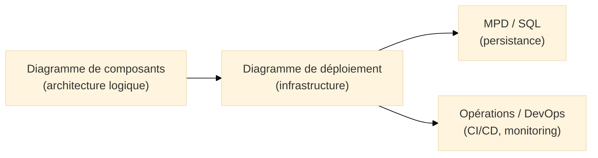
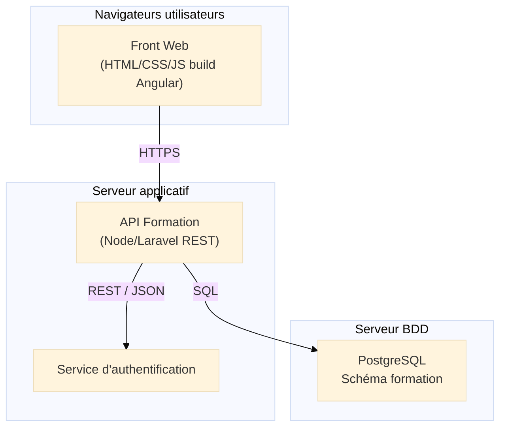
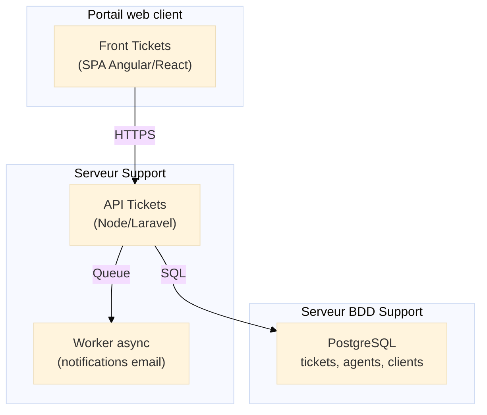

# Diagramme de déploiement (Deployment Diagram)

## Introduction au diagramme de déploiement

!!! quote "Analogie pédagogique"
*Imaginez un **réseau ferroviaire** : gares, lignes, aiguillages. Les trains (vos applications) doivent rouler sur des rails précis, dans des gares définies, reliées par une topologie bien organisée. Le **diagramme de déploiement UML** joue ce rôle : il décrit **où** tournent vos composants, **sur quoi**, et **comment** ils sont reliés.*

Le **diagramme de déploiement UML** décrit l’**infrastructure physique ou virtuelle** d’un système logiciel[^uml].
Il montre :

* les **nœuds d’exécution** (serveurs, conteneurs, VM, mobiles, cloud, appliances),
* les **artefacts déployés** (binaire, JAR, image Docker, package Node, fichier statique),
* les **connexions réseau**, protocoles et contraintes techniques,
* les liens entre **composants UML logiques** et **nœuds physiques**.

Là où le **diagramme de composants** montre l’architecture **logique**,
le **diagramme de déploiement** montre l’architecture **physique et opérationnelle**.

---

## Pour repartir des bases

### 1. Ce qu’est (et n’est pas) un diagramme de déploiement

Le diagramme représente :

* des **nœuds** (devices, serveurs, VM, conteneurs, pods Kubernetes),
* des **artefacts** déployés dans ces nœuds,
* des **connexions réseau** (HTTP, AMQP, TCP, gRPC…),
* la **topologie d’exécution** réelle.

Il **ne représente pas** :

* la structure interne du code (diagramme de classes),
* la logique fonctionnelle (Use Case),
* le déroulé temporel (séquence).

!!! note "Objectif"
**“Montrer où vit réellement le logiciel, et comment les différents éléments communiquent.”**

### 2. Vocabulaire minimal

| Terme             | Rôle                                                           |
| ----------------- | -------------------------------------------------------------- |
| **Nœud**          | Environnement d’exécution (serveur, conteneur, mobile)[^noeud] |
| **Artefact**      | Élément déployable (binaire, image Docker, script)[^artefact]  |
| **Device**        | Matériel ou VM capable d’héberger des nœuds                    |
| **Communication** | Connexion ou protocole entre nœuds (HTTP, MQ, WebSocket…)      |
| **Environnement** | Dev, Test, Preprod, Prod, Cloud, On-premise                    |

---

## Pour qui, et quand utiliser ce diagramme ?

* :lucide-users:{ .lg .middle } **Pour qui ?**

    ---

    * Architectes logiciels
    * Ingénieurs DevOps / SRE
    * Développeurs fullstack
    * Équipes cybersécurité (analyse de surface d’exposition)
    * Admin systèmes / réseaux

* :lucide-clock:{ .lg .middle } **Quand l’utiliser ?**

    ---

    * Avant un déploiement Kubernetes / Docker / Cloud
    * Lors d’une migration d’architecture (monolithe → microservices)
    * Lors d’un audit d’infrastructure
    * Lors de la documentation technique d’un projet
    * Quand il faut aligner dev <-> ops <-> cyber

---

## Lien avec Merise et les autres diagrammes UML

Ce diagramme complète :

* **Merise** (où sont les données sensibles, quels serveurs les hébergent ?),
* **Composants UML** (quelle partie logique tourne où ?),
* **Dév / Ops / Cyber** (séparation des réseaux, segmentation, exposition).

---

# Ex. 1 – Plateforme de formation (aligné Merise & composants)

Votre modèle Merise : `FORMATION – SESSION – STAGIAIRE – FORMATEUR – INSCRIPTION`,
vos composants UML : `Catalogue`, `GestionSessions`, `AuthService`, `Front Web`.

Nous représentons ici un déploiement typique **web + API + SGBD**.

### Lecture du diagramme

* Le **Front Web** (build Angular) est servi côté client.
* L'API (Node/Laravel) implémente les cas d’usage : inscription, consultation du catalogue…
* L’**Auth Service** gère les tokens (JWT).
* Le MPD/SQL “formation” vit dans PostgreSQL.

Ce diagramme est fidèle :

* aux **cas d’usage** (s’inscrire, consulter une session),
* aux **classes UML** (`Formation`, `Session`, `Inscription`),
* au **MPD Merise** (tables + FK).

---

# Ex. 2 – Support client / tickets (aligné Merise & composants)

Votre modèle : `CLIENT – AGENT – TICKET`.
Architecture simple : front + API + BDD.

### Lecture du diagramme

* Le **client** interagit avec le portail.
* L’**API** gère les tickets (création, statut, affectation).
* Le **worker asynchrone** traite les notifications.
* La BDD stocke les données Merise (`CLIENT`, `AGENT`, `TICKET`).

---

## Bonnes pratiques pour les diagrammes de déploiement

* Représentez uniquement les **nœuds importants** (évitez les 20 serveurs inutiles).
* Évitez les détails réseau trop techniques : IPv4/IPv6, VLAN… sauf nécessité.
* Chaque diagramme doit tenir sur **une seule vue**.
* Utilisez un diagramme de déploiement par **environnement** (Dev, Préprod, Prod).
* Faites apparaître **les flux sensibles** (authentification, données personnelles), utile en cyber.

---

## Mot de la fin

!!! quote

    Le **diagramme de déploiement** permet de répondre à une question fondamentale :  
    **“Où vit réellement votre système, et comment les différents éléments fonctionnent ensemble ?”**

    C’est un diagramme essentiel pour :  
    – préparer un déploiement,  
    – documenter une architecture,  
    – structurer une migration,  
    – ou réussir un audit cyber / DevOps.

    Bien construit, il clarifie les choix d’infrastructure et facilite la communication entre développeurs, administrateurs systèmes, DevOps et architectes.

---

[^uml]: UML (Unified Modeling Language), norme OMG, inclut une famille de diagrammes structurels et comportementaux permettant de décrire toutes les facettes d’un système logiciel.

[^noeud]: En UML, un **nœud** représente un environnement d’exécution physique ou virtuel (serveur, VM, conteneur).

[^artefact]: Un **artefact UML** est un fichier ou un composant exécutable déployé dans un nœud (JAR, binaire Go, image Docker, code compilé).

