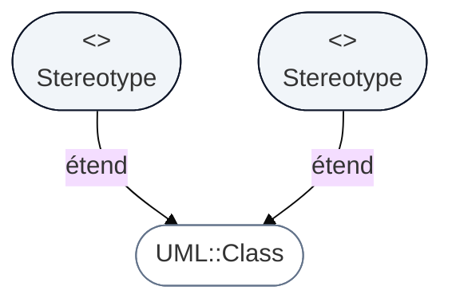
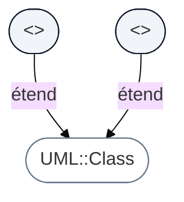
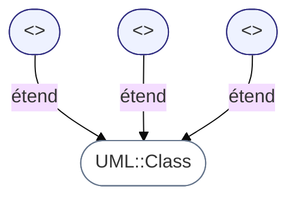

# Diagramme de profils (Profile Diagram)

## Introduction au diagramme de profils UML

!!! quote "Analogie pédagogique"
    _Imaginez une **boîte à outils personnalisée** : vous partez d’un outil standard (un marteau), puis vous y ajoutez un embout magnétique ou un grip amélioré pour répondre à votre usage particulier. C’est exactement ce que propose le **diagramme de profils UML** : étendre UML avec des concepts spécialisés adaptés à vos contextes métier (cybersécurité, DevSecOps, microservices, RGPD…)._

Le **diagramme de profils (Profile Diagram)** permet d’**étendre UML** grâce à :

- des **stéréotypes**  
- des **tagged values** (propriétés supplémentaires)  
- des **contraintes**  
- une spécialisation du **métamodèle UML**

Il est très utilisé dans :

- la cybersécurité (ex. profils UML pour l’analyse de risques),  
- les architectures SI (SOA, microservices, DDD),  
- les processus métier (BPM, modélisation réglementaire),  
- les organisations qui veulent **normer leur modélisation**.

Le diagramme de profils n’est **pas** utilisé pour modéliser votre application directement :  
il sert à **créer votre propre dialecte UML**, cohérent et adapté à votre contexte.

---

## Pour repartir des bases

### 1. Ce qu’est un profil UML

Un **profil UML** est un paquetage spécialisé contenant :

- des **stéréotypes**  
- des **valeurs taguées**  
- des **contraintes métier**  
- des **extensions** d’éléments UML standard

Il vous permet d’écrire des choses comme :

- `<<API>>`  
- `<<Entity>>`  
- `<<SensitiveData>>`  
- `<<CriticalComponent>>`  
- `<<AggregatRoot>>` (DDD)  
- `<<RiskSource>>` (EBIOS)  
- `<<RGPD-PersonalData>>`

Ces stéréotypes ajoutent du sens **métier** ou **organisationnel**.

### 2. Ce qu’un profil n’est pas

Un profil UML **n’ajoute aucune syntaxe graphique nouvelle**.  
Vous étendez **la sémantique**, pas l’apparence.

Un profil n’est pas non plus :

- une surcouche d’exécution,
- un langage de programmation,
- un DSL complet,
- un moyen de définir des modules logiciels.

C’est **une extension du métamodèle UML**, structurée et normalisée[^metamodel].

---

## Pour qui, et quand utiliser un profil UML ?

-   :lucide-users:{ .lg .middle } **Pour qui ?**

    ---

    - Architectes d’entreprise / urbanistes SI  
    - Architectes logiciels  
    - Experts cybersécurité (EBIOS, Threat Modeling, SecArch)  
    - Architectes data et analystes métier  
    - Formateurs ou organisations voulant normaliser leurs diagrammes

-   :lucide-clock:{ .lg .middle } **Quand l’utiliser ?**

    ---

    - Pour **standardiser votre modélisation UML** dans un projet ou une entreprise  
    - Pour introduire des règles métier récurrentes (cyber, RGPD, DDD)  
    - Pour contrôler la qualité des modèles dans de grands projets  
    - Pour spécifier des contraintes fortes ou exposer des concepts non présents dans UML de base  

-   :lucide-pencil-ruler:{ .lg .middle } **Comment l’utiliser concrètement ?**

    ---

    1. Identifier les concepts spécifiques à votre métier  
    2. Créer des **stéréotypes** les représentant  
    3. Définir les **valeurs taguées** nécessaires  
    4. Rattacher vos stéréotypes à des éléments UML standard  
    5. Définir vos **contraintes** (OCL optionnel)  
    6. Documenter et diffuser le profil dans votre organisation  

-   :lucide-activity:{ .lg .middle } **Impact direct**

    ---

    - Cohérence de la modélisation entre équipes  
    - Règles métier explicites et auditées  
    - Diagrammes UML plus sémantiques et lisibles  
    - Préparation solide pour l’analyse de risques ou audits internes  

---

## Exemple minimal d’un profil UML

Voici un profil simplifié pour un contexte **cybersécurité**, mettant en évidence les composants critiques.

Ce profil permet ensuite d’écrire dans vos diagrammes :

* `<<CriticalComponent>> TicketService`
* `<<SensitiveData>> Email`
* `<<SensitiveData>> MotDePasse hashed=true`

---

## H2 Ex. 1 – Profil pour la plateforme de formation

On crée un mini-profil pour annoter des entités métier sensibles.

### Objectif

* Identifier les **données personnelles** (RGPD[^rgpd])
* Identifier les **composants critiques**

Vous pourriez ensuite annoter :

* `Stagiaire <<PersonalData>>`
* `AuthService <<CriticalComponent>>`
* `Inscription.dateInscription <<PersonalData>>`

---

## H2 Ex. 2 – Profil pour le support client / tickets

### Objectif

* Identifier les **données sensibles**
* Taguer les **services soumis aux SLA**
* Taguer les **éléments auditables**

Exemples d’usage :

* `Ticket.priorite <<SensitiveField>>`
* `TicketService <<SLA-Critical>>`
* `Agent <<Auditable>>`

---

## Bonnes pratiques pour les profils UML

* Ne créer un stéréotype que s’il apporte **une valeur métier claire**.

* Limiter les profils à **un domaine fonctionnel** (cyber, RGPD, architecture, data).

* Documenter les **valeurs taguées** (type, contrainte, domaine).

* Éviter les profils trop verbeux : UML n’est pas un tableur.

* Préférer des stéréotypes courts et parlants :

  * `<<Entity>>`, `<<Service>>`, `<<Aggregate>>`
  * `<<PersonalData>>`, `<<CriticalComponent>>`
  * `<<SLA-Critical>>`, `<<Auditable>>`

* Réutiliser les profils existants quand c’est possible (SysML, MARTE, BPMN…).

---

## Mot de la fin

!!! quote

    Le **diagramme de profils UML** est l’outil ultime pour adapter UML à vos besoins
    tout en restant dans le cadre du métamodèle standard.

    Il vous permet de créer un **dialecte UML** propre à votre entreprise,
    conforme à vos exigences métier, cyber et réglementaires.

    Bien utilisé, un profil :
    - clarifie les notions transverses (critique, sensible, RGPD),  
    - augmente la lisibilité de vos modèles,  
    - harmonise la modélisation entre équipes.  

    > C’est un outil avancé, mais incontournable pour une documentation professionnelle et cohérente.

[^metamodel]: UML repose sur un métamodèle défini par l’OMG. Les profils UML permettent d’en spécialiser des portions sans créer un nouveau langage complet.

[^rgpd]: Le RGPD impose d’identifier les données personnelles, leurs finalités, les durées de conservation et les mesures de protection associées.
