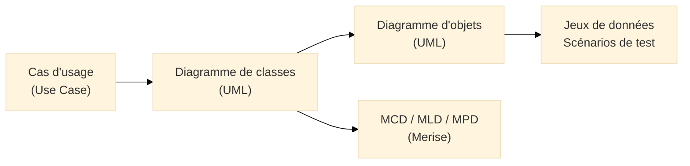
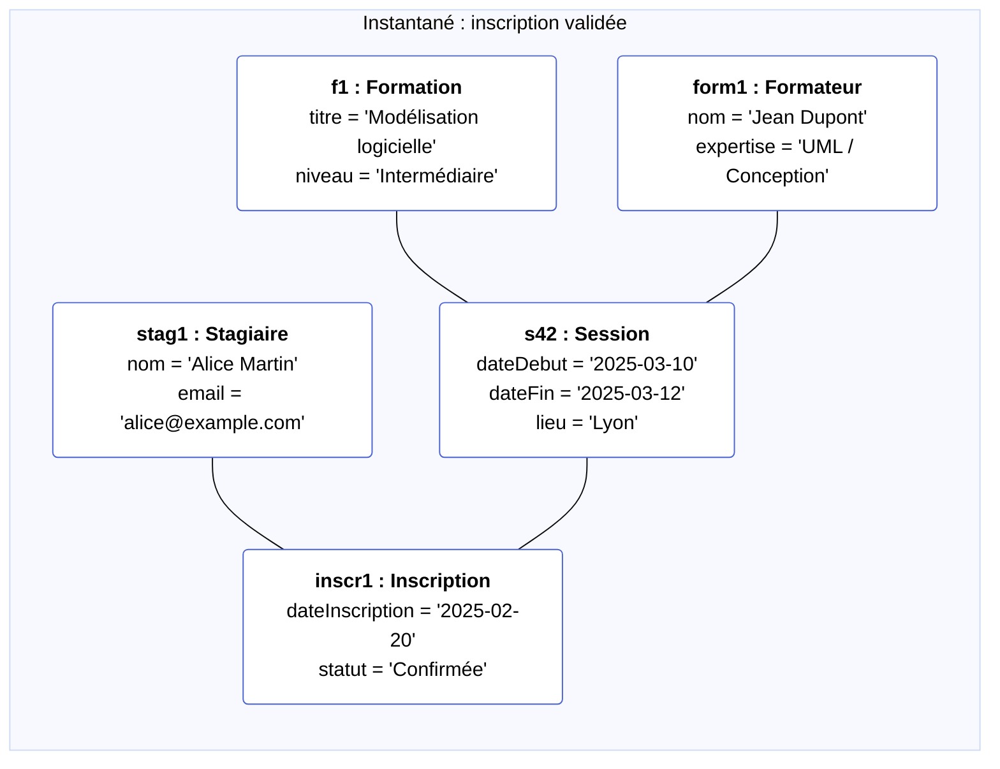
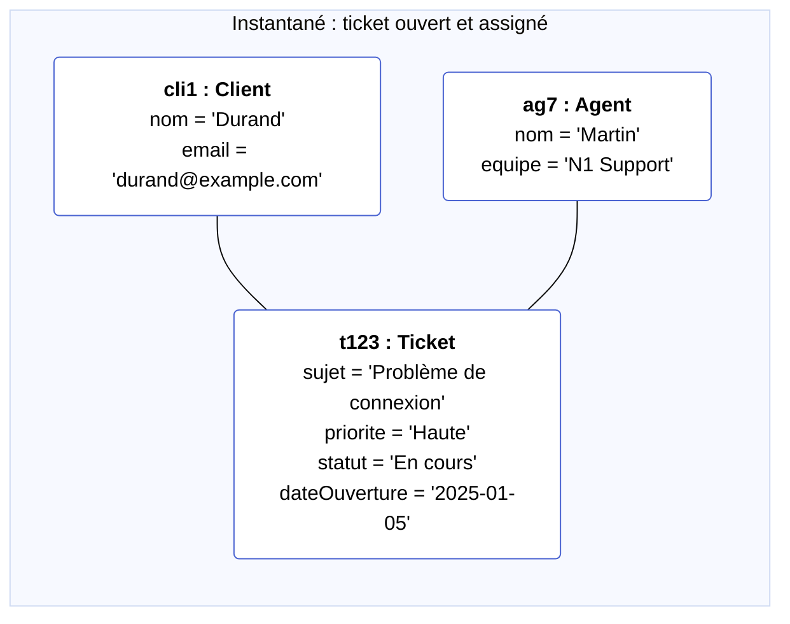

# Diagramme d’objets (Object Diagram)

<div
  class="omny-meta"
  data-level="🟡 Intermédiaire"
  data-version="1.0"
  data-time="25-35 minutes">
</div>

## Introduction au diagramme d’objets

!!! quote "Analogie pédagogique"
    _Un **diagramme de classes** ressemble aux plans normalisés d’un immeuble : types d’appartements, surfaces, dispositions standards.  
    Le **diagramme d’objets**, lui, est une **photo d’un étage réel un mardi soir** :  
    quel appartement est occupé par qui, quels meubles sont présents, quelles portes sont ouvertes.  
    Même bâtiment, mais cette fois on regarde **les instances concrètes à un instant donné**._

Le **diagramme d’objets UML** représente un **instantané du système** :  
des **objets concrets** en mémoire (ou équivalents métier) avec **leurs valeurs d’attributs** et **leurs liens effectifs**.[^uml]

Là où le diagramme de classes décrit les **types** (`Stagiaire`, `Session`, `Ticket`),  
le diagramme d’objets montre des **instances** réelles :

- `stagiaire1 : Stagiaire` avec `nom = "Alice"`,  
- `session42 : Session` avec `dateDebut = 2025-03-10`,  
- `ticket123 : Ticket` avec `statut = "Ouvert"`.

Il répond à la question :

> **“À cet instant précis, quels objets existent, avec quelles valeurs, et reliés comment ?”**

---

## Pour repartir des bases

### 1. Ce qu’est (et n’est pas) un diagramme d’objets

Un diagramme d’objets représente :

- des **objets** (instances de classes) avec leur nom et leur type (`panierClient : Panier`),  
- des **valeurs d’attributs** (`total = 120.50`, `statut = "EnCours"`),  
- des **liens d’instances** entre objets (références, compositions, agrégations),  
- un **état figé** du système à un instant donné (comme une capture d’écran mémoire).[^objet]

Il ne représente pas :

- l’évolution dans le temps (c’est le rôle du **diagramme de séquence** ou d’état),  
- tous les objets possibles du système (seulement un **sous-ensemble pertinent**),  
- la structure abstraite du domaine (c’est le travail du **diagramme de classes**).

!!! note "Objectif"
    Le diagramme d’objets répond à la question :  
    **“Comment le diagramme de classes se matérialise-t-il dans un cas concret, avec des objets réels et des valeurs spécifiques ?”**

### 2. Vocabulaire minimal

| Terme                 | Rôle                                                                                                 |
|----------------------|------------------------------------------------------------------------------------------------------|
| **Classe**           | Modèle abstrait (type) défini dans le diagramme de classes (`Stagiaire`, `Session`, `Ticket`)       |
| **Objet / Instance** | Occurrence concrète d’une classe (`stag1 : Stagiaire`, `ticket42 : Ticket`)                         |
| **Slot**             | Attribut avec une valeur dans l’objet (`email = "alice@example.com"`)                               |
| **Lien d’objets**    | Relation concrète entre deux objets (référence, composition, etc.)                                  |
| **Instantané**       | Vue figée du système à un moment donné (avant / après une opération métier, par exemple)            |

---

## Pour qui, et quand utiliser un diagramme d’objets ?

<div class="grid cards" markdown>

-   :lucide-users:{ .lg .middle } **Pour qui ?**

    ---

    - Développeurs orientés objet (Java, C#, PHP, TypeScript, Go avec modèles)  
    - Architectes logiciels et concepteurs fonctionnels  
    - Formateurs qui souhaitent illustrer le lien **classe → objet → BDD**  
    - Testeurs / QA qui conçoivent des **jeux de données**  

-   :lucide-clock:{ .lg .middle } **Quand l’utiliser ?**

    ---

    - Pour illustrer un **cas d’usage concret** (avant/après une action métier)  
    - Pour expliquer ou debugger un comportement (incohérence de données, doublons…)  
    - Pour documenter des **scénarios de test** ou des jeux de données de référence  
    - Pour relier le diagramme de classes à des enregistrements réels de base de données  

</div>

<div class="grid cards" markdown>

-   :lucide-pencil-ruler:{ .lg .middle } **Comment l’utiliser concrètement ?**

    ---

    1. Partir d’un **diagramme de classes** déjà stabilisé  
    2. Choisir un **scénario précis** (ex. “stagiaire inscrit à une session”)  
    3. Lister les **objets réellement concernés** (1 stagiaire, 1 session, 1 formation, 1 inscription…)  
    4. Donner des **valeurs explicites** aux attributs importants  
    5. Représenter les **liens d’instances** (quel objet référence quel autre)

-   :lucide-activity:{ .lg .middle } **Impact direct**

    ---

    - Rend le modèle de classes **concret** pour les métiers  
    - Facilite la conception de **tests fonctionnels** et de jeux de données  
    - Sert de support de **debug** (montrer où une valeur est incohérente)  
    - Aide à faire le pont entre **Merise (tables)** et **objets métier**  

</div>

---

## Lien avec le diagramme de classes et Merise

Le diagramme d’objets est **toujours dérivé** d’un diagramme de classes existant :  
vous ne créez pas de nouveaux types, vous instanciez des types déjà définis.[^classe]



<small><i>Le diagramme de classes définit la **grammaire des types**.
Le diagramme d’objets montre une **phrase concrète**, avec des valeurs réelles.</i></small>

En parallèle :

* vos modèles Merise (`FORMATION`, `SESSION`, `INSCRIPTION`, `TICKET`, etc.) décrivent la **structure persistée**,
* vos diagrammes d’objets peuvent représenter un **extrait de données** issu de la base, mais vu côté **objets métier**.

---

## Lire un diagramme d’objets UML

Un objet UML est généralement noté :

```text
nomObjet : NomDeClasse
----------------------
attribut1 = valeur1
attribut2 = valeur2
```

Exemple :

```text
stag1 : Stagiaire
-----------------
nom = "Alice Martin"
email = "alice@example.com"
```

Dans Mermaid, pour rester compatible, on va se rapprocher de cette notation
en utilisant des **nœuds de flowchart** stylés, avec des retours à la ligne HTML (`<br/>`).

Un lien entre deux objets est matérialisé par une **ligne** entre leurs nœuds,
comme dans un diagramme de classes.

---

## Ex. 1 – Plateforme de formation (aligné Merise)

Contexte Merise déjà posé :

* `FORMATION`, `SESSION`, `FORMATEUR`, `STAGIAIRE`, `INSCRIPTION`
* UML : classes `Formation`, `Session`, `Formateur`, `Stagiaire`, `Inscription`

### Scénario

> Un stagiaire nommé **Alice** est inscrit à la session **"UML – Niveau 1"**
> de la formation **"Modélisation logicielle"**, animée par le formateur **Dupont**.

### Diagramme d’objets



<small><i>Ce diagramme ne redéfinit pas les classes : il montre une **instance réelle** de chaque classe du modèle.
Vous pouvez le rapprocher d’un **échantillon de lignes** des tables `FORMATION`, `SESSION`, `FORMATEUR`, `STAGIAIRE`, `INSCRIPTION`, mais vu côté UML (objets).</i></small>

### Ce que l’on lit dans le diagramme

* `f1 : Formation` correspond à une ligne concrète dans la table `FORMATION`.
* `s42 : Session` est une session particulière de cette formation.
* `stag1 : Stagiaire` représente Alice, `inscr1 : Inscription` l’inscription d’Alice à `s42`.
* Les liens montrent que **l’inscription relie un stagiaire précis à une session précise**,
  ce qui reflète exactement la structure Merise (classe d’association `INSCRIPTION`).

---

## Ex. 2 – Support client / tickets (aligné Merise)

Contexte Merise :

* `CLIENT`, `AGENT`, `TICKET`
* UML : `Client`, `Agent`, `Ticket`

### Scénario

> Le client **Durand** a ouvert le ticket **#123**,
> pris en charge par l’agent **Martin**, avec priorité **Haute**.

### Diagramme d’objets



### Ce que l’on lit dans le diagramme

* `cli1 : Client` correspond à une entrée `CLIENT`.
* `t123 : Ticket` est une instance particulière avec une **valeur de priorité** et un **statut** fixés.
* Le lien `C1 --- T1` reflète la clé étrangère `id_client` dans `TICKET`.
* Le lien `A1 --- T1` reflète `id_agent` (qui peut être `NULL` dans la base lorsque le ticket n’est pas encore assigné).

Ce diagramme est utile pour illustrer :

* un **cas de test** (“ticket ouvert, affecté à un agent N1, priorité haute”),
* un **état anormal** (deux tickets identiques, client inconnu, etc.),
* un **avant / après** (avant affectation vs après affectation).

---

## Bonnes pratiques pour le diagramme d’objets

Quelques recommandations pour garder des diagrammes lisibles et utiles :

* **Limiter le nombre d’objets** : l’objectif est d’illustrer un scénario, pas de reproduire toute la base.

* Donner des **valeurs explicites** et réalistes aux attributs (éviter `val1`, `val2`, etc.).

* Nommer clairement les objets (`stag1`, `ticket123`, `sessionUml1`) pour qu’ils restent repérables.

* Utiliser les diagrammes d’objets pour :

  * illustrer un **cas d’usage** donné,
  * documenter des **jeux de données de test**,
  * expliquer un **bug fonctionnel** (valeur manquante, lien absent, doublon…).

* Toujours partir d’un **diagramme de classes validé** : si le diagramme de classes change,
  les diagrammes d’objets associés doivent être revus.

---

## Mot de la fin

!!! quote

    Le **diagramme de classes** structure votre domaine.  
    Le **diagramme d’objets** met ce domaine en situation réelle, avec des instances et des valeurs.

    Utilisé au bon moment, il permet de :

    * rendre le modèle compréhensible pour des profils non techniques,  
    * préparer des **scénarios de test** et des jeux de données de référence,  
    * rapprocher les **tables Merise** des **objets métier** manipulés par le code.

    > Il ne s’agit pas de multiplier les diagrammes d’objets, mais de choisir quelques **instantanés représentatifs** qui éclairent les cas d’usage et les décisions d’architecture.


[^uml]: UML (Unified Modeling Language) est un langage de modélisation standardisé par l’OMG, utilisé pour représenter des systèmes logiciels de manière structurée, indépendamment des langages et technologies d’implémentation.

[^objet]: Par “objet” on entend ici une **instance d’une classe** au sens orienté objet : un élément existant réellement en mémoire ou dans un modèle métier, avec des valeurs spécifiques pour ses attributs.

[^classe]: Le diagramme de classes définit les **types et relations possibles** ; le diagramme d’objets montre une **configuration concrète** à un instant donné, en respectant ces types et relations.
