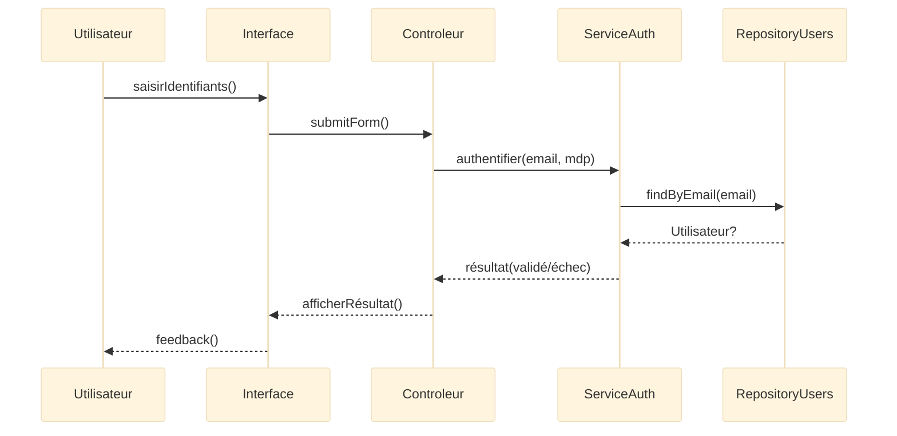
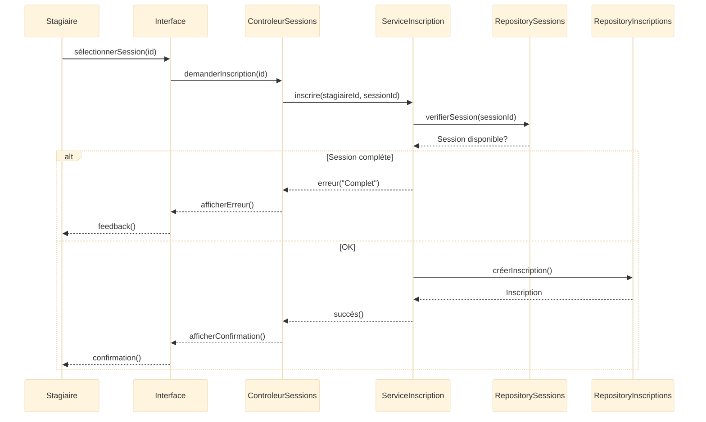
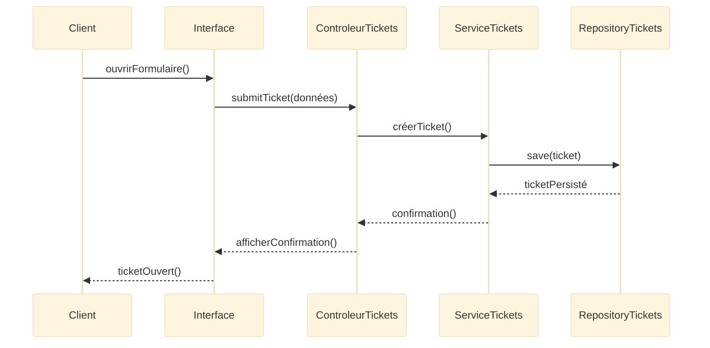

# Diagramme de séquence (Sequence Diagram)

## Introduction au diagramme de séquence

!!! quote "Analogie pédagogique"
    _Imaginez un **storyboard de film** : image après image, on voit **qui parle**, **qui agit**, **dans quel ordre**, et **ce qui se passe ensuite**.  
    Le diagramme de séquence UML fonctionne exactement ainsi : il montre **la chronologie des interactions** entre acteurs et objets pour réaliser un cas d’usage._

Le **diagramme de séquence UML** est un diagramme d’**interaction**[^interaction], utilisé pour représenter :

- l’**ordre chronologique** des messages,  
- les **échanges** entre acteurs et objets,  
- les **conditions**, **boucles**, **retours**,  
- la **logique métier dynamique** derrière un cas d’usage.

Il complète naturellement le **diagramme de classes** (structure) et le **diagramme de cas d’usage** (fonctionnalité).

Il répond à la question :

> **Comment les objets collaborent-ils dans le temps pour accomplir une fonctionnalité ?**

---

## Pour repartir des bases

### 1. Ce qu’est (et n’est pas) un diagramme de séquence

Il montre :

- les **lifelines** (acteurs, objets, services),  
- les **messages envoyés** dans un ordre strict,  
- les **activations** (zones où un objet exécute une opération),  
- les **retours**,  
- les **conditions** (`alt`), les **boucles** (`loop`),  
- les **fragments** (`opt`, `par`, `ref`).  

Il ne montre pas :

- la structure du système (c’est le rôle du **diagramme de classes**),  
- les cas métier globaux (c’est le rôle des **cas d’usage**),  
- les transitions d’état internes (machine à états).  

!!! note "Objectif"
    Le diagramme de séquence répond à :  
    **“Dans quel ordre les appels doivent-ils se produire pour que l’opération réussisse ?”**

### 2. Vocabulaire minimal

| Terme          | Rôle                                                                 |
|----------------|----------------------------------------------------------------------|
| **Lifeline**   | Ligne de vie d’un acteur ou d’un objet                               |
| **Activation** | Période pendant laquelle un objet exécute une opération              |
| **Message**    | Appel envoyé d’un participant à un autre                             |
| **Return**     | Réponse / résultat renvoyé                                           |
| **Fragment**   | Bloc regroupant une structure de contrôle (alt, opt, loop, ref…)    |
| `alt`          | Condition avec plusieurs branches                                    |
| `opt`          | Optionnel                                                            |
| `loop`         | Boucle                                                               |
| `ref`          | Référence à un autre diagramme                                       |

Mermaid permet de représenter toutes ces notions de manière lisible.

---

## Pour qui, et quand utiliser un diagramme de séquence ?

-   :lucide-users:{ .lg .middle } **Pour qui ?**

    ---

    - Développeurs backend / frontend  
    - Architectes logiciels  
    - Équipes DevSecOps (analyse des flux sensibles)  
    - Testeurs fonctionnels / QA  
    - Équipes métier nécessitant une **vue chronologique claire**  

-   :lucide-clock:{ .lg .middle } **Quand l’utiliser ?**

    ---

    - Lors d’un atelier de conception technique  
    - Lors de la définition d’API ou de services  
    - Pour documenter un flux sensible (paiement, authentification)  
    - Pour transformer un cas d’usage en **tests**  
    - Pour analyser un incident (logique, sécurité)

-   :lucide-pencil-ruler:{ .lg .middle } **Comment l’utiliser ?**

    ---

    1. Partir d’un **cas d’usage**  
    2. Identifier les **objets / services** impliqués  
    3. Définir l’**ordre des messages**  
    4. Introduire conditions / boucles si nécessaire  
    5. Lier chaque message à une **opération** d’une classe  

-   :lucide-activity:{ .lg .middle } **Impact direct**

    ---

    - clarifie la **logique métier réelle**  
    - aide à définir les **API / services** nécessaires  
    - met en évidence les **risques fonctionnels**  
    - structure l’implémentation orientée objet  

---

## Ex 1 – Auth. (scénario transversal UML)

Il s’agit d’un flux ultra-standard utilisé dans presque toutes les applications.

### Scénario

1. L’utilisateur saisit ses identifiants.  
2. L’interface transmet au contrôleur.  
3. Le contrôleur vérifie auprès d’un service d’authentification.  
4. Le service interroge le dépôt (repository).  
5. Le résultat est renvoyé successivement.

### Diagramme de séquence

<small><i>Ce diagramme représente le **flux minimal** nécessaire pour comprendre ce qui se passe lors d’une authentification complète, sans entrer dans les détails techniques (hash, tokens).</i></small>

---

## Ex. 2 – Plateforme de formation (aligné Merise)

Nous réutilisons votre modèle :
`FORMATION`, `SESSION`, `STAGIAIRE`, `INSCRIPTION`.

### Cas d’usage associé

**“S’inscrire à une session”**

### Participants

* **Stagiaire** (acteur)
* **Interface** (UI)
* **ContrôleurSession**
* **ServiceInscription**
* **RepositorySession / RepositoryInscription**

### Diagramme de séquence

<small><i>Le fragment `alt` représente la règle métier importante : **une session peut être complète**. On montre aussi la réutilisation directe des ressources du MPD Merise.</i></small>

---

## Ex 3 – Support client (aligné Merise)

Cas d’usage : **“Ouvrir un ticket”**

### Participants

* Client
* Interface
* ControleurTickets
* ServiceTickets
* RepositoryTickets

### Diagramme

---

## Diagrammes de séquence : bonnes pratiques

* Les noms doivent être **métier** (ex. `inscrire()`, pas `POST /sessions/…`).
* Respectez l’ordre logique du **Use Case correspondant**.
* Ne créez pas 20 participants : limitez aux acteurs utiles.
* Utilisez `alt`, `opt`, `loop` pour rester lisible.
* Synchronisez toujours avec :

  * vos **diagrammes de classes**,
  * vos **cas d’usage**,
  * vos **modèles Merise**,
  * vos **mécanismes de sécurité** (authentification, validation).

Un bon diagramme de séquence sert ensuite de base :

* aux tests,
* aux API,
* au code,
* aux revues d’architecture,
* aux audits de sécurité.

---

## Mot de la fin

!!! quote
    Le **diagramme de séquence UML** est le chaînon manquant entre
    ce que les utilisateurs veulent (cas d’usage)
    et comment le système le fait vraiment (implémentation).

    C’est un outil puissant pour rendre explicite la **collaboration entre objets**,  
    clarifier les **échanges dynamiques**, et sécuriser la logique métier.

[^interaction]: Les diagrammes d’interaction UML regroupent quatre types : séquence, communication, temps et vue d’ensemble d’interaction.
