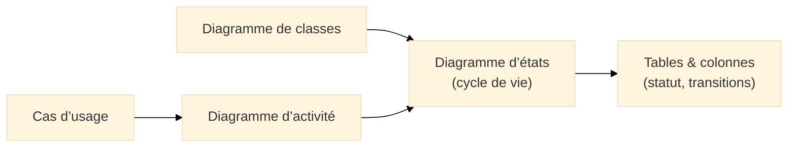
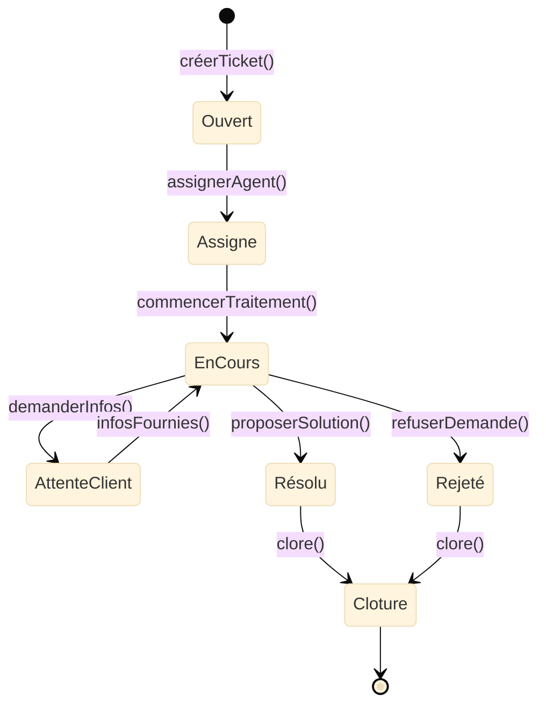
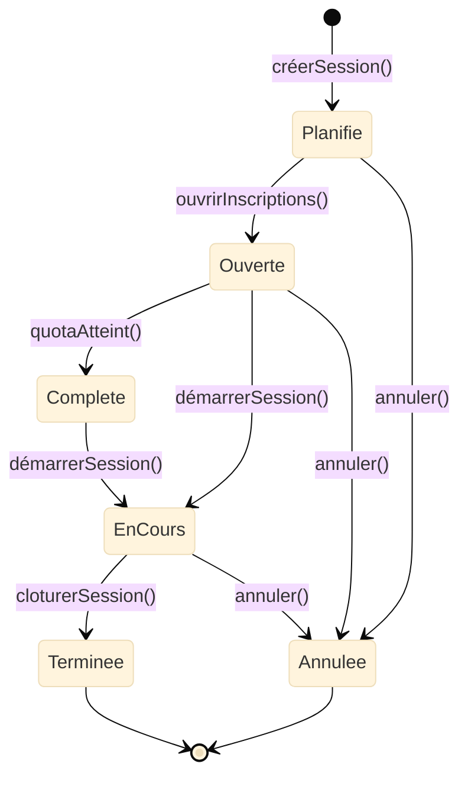

# Diagramme d’états (State Machine)

## Introduction au diagramme d’états

!!! quote "Analogie pédagogique"
    _Imaginez le **cycle de vie d’un colis** : “préparé”, “expédié”, “en transit”, “livré”, “retourné”.  
    À chaque transition, un **événement** (scan, validation, retour client) fait avancer l’état du colis.  
    Le **diagramme d’états UML** représente ce cycle de vie **de manière explicite**, avec les états, les transitions et les règles qui les gouvernent._

Le **diagramme d’états (State Machine)** est un diagramme **comportemental** d’UML[^beh].  
Il modélise le **cycle de vie** d’un objet métier : ses **états successifs**, leurs **conditions d’entrée**, leurs **conditions de sortie** et les **événements** qui déclenchent les transitions.

Il répond à une question simple :

> **Comment évolue un objet au fil du temps, et quels événements changent son état ?**

C’est un diagramme essentiel pour des objets comme :  
`Ticket`, `Commande`, `Session`, `Utilisateur`, `Dossier RH`, `Workflow d’approbation`, etc.

---

## Pour repartir des bases

### 1. Ce qu’est (et n’est pas) un diagramme d’états

Un diagramme d’états montre :

- des **états** (ex. “Ouvert”, “Assigné”, “Résolu”),  
- des **transitions** (flèches),  
- des **événements déclencheurs**,  
- des **conditions de garde** (facultatives),  
- des **actions** exécutées lors de la transition,  
- un **état initial** et un ou plusieurs **états finaux**.

Il ne montre pas :

- les rôles utilisateurs (c’est pour les **Use Case**),  
- le détail des interactions (c’est pour le **diagramme de séquence**),  
- la structure de l’objet (c’est pour le **diagramme de classes**),  
- les transitions purement techniques (logs, HTTP, SQL… inutile ici).

!!! note "Objectif"
    Le diagramme d’états répond à :  
    **“Comment cet objet évolue-t-il, étape par étape, selon quels événements et quelles règles ?”**

### 2. Vocabulaire minimal

| Terme              | Rôle                                                                                 |
|--------------------|--------------------------------------------------------------------------------------|
| **État**           | Situation stable d’un objet (ex. `Ouvert`, `Résolu`, `Annulé`)                      |
| **Transition**     | Passage d’un état à un autre, déclenché par un **événement**                         |
| **Événement**      | Action ou occurrence provoquant le changement (ex. `assigner()`, `clore()`)          |
| **Condition**      | Prérequis nécessaire pour effectuer une transition (`[si utilisateur authentifié]`) |
| **Action**         | Ce qui est exécuté pendant la transition (`/ envoyerNotification()`)                 |
| **État initial**   | Point d’entrée dans la machine d’états                                               |
| **État final**     | Point de sortie                                                                      |

---

## Pour qui, et quand utiliser un diagramme d’états ?

-   :lucide-users:{ .lg .middle } **Pour qui ?**

    ---

    - Développeurs orientés objets  
    - Architectes logiciels  
    - Concepteurs d’applications complexes  
    - Équipes support / cybersécurité qui analysent des **cycles de vie sensibles**  
    - QA / testeurs (tests basés sur les transitions)

-   :lucide-clock:{ .lg .middle } **Quand l’utiliser ?**

    ---

    - Quand un objet possède **plusieurs états métier**  
    - Quand il existe des règles d’évolution complexes  
    - Quand certaines transitions sont **conditionnelles** ou **interdites**  
    - Pour générer des tests structurés basés sur les transitions  

---

## Lien avec Merise et les autres diagrammes UML

Le diagramme d’états est parfaitement aligné avec votre chaîne métier :

* **Diagramme de classes** : identifie les objets porteurs d’un état (ex. `Ticket.statut`).
* **Diagramme d’activité** : montre la logique métier globale.
* **Diagramme d’états** : fige précisément les **étapes du cycle de vie**.
* **Merise / MPD** : traduit l’état dans des **colonnes** ou **contraintes** (`statut`, triggers, etc.).

---

## Ex. 1 – Cycle de vie d’un ticket support

*(aligné Merise : table `TICKET`)*

### Scénario métier

Un ticket support suit généralement ce cycle :

1. Créé par un client.
2. Assigné à un agent.
3. En cours de traitement.
4. Résolu ou refusé.
5. Clôturé.

### Diagramme d’états

### Lecture rapide

* `Ouvert → Assigne` se produit via l’événement **assignerAgent()**.
* `EnCours → AttenteClient` montre une **boucle métier**, très fréquente.
* Les transitions `Résolu → Cloture` et `Rejeté → Cloture` reflètent vos **règles de fermeture**.

Ce modèle correspond exactement aux colonnes :
**`date_ouverture`, `statut`, `id_agent`, `priorite`, `sujet`**, déjà définies dans votre MPD.

---

## Ex. 2 – Cycle de vie d’une session de formation

*(aligné Merise : `SESSION`, `FORMATION`, `INSCRIPTION`)*

### Scénario métier

1. La session est planifiée.
2. Elle est ouverte aux inscriptions.
3. Elle peut être complète.
4. Elle se déroule.
5. Elle est terminée ou annulée.

### Diagramme d’états

### Lecture rapide

* Une session **Planifiée** devient **Ouverte** lorsque les inscriptions ouvrent.
* Elle peut devenir **Complète** lorsque le quota est atteint (`INSCRIPTION`).
* Dès qu’elle commence, elle passe à **EnCours**.
* À la fin → **Terminée**, ou **Annulée** selon la réalité métier.

C’est un diagramme très utile pour clarifier les règles visibles en base :
`statut = planifiée / ouverte / complète / en_cours / terminée / annulée`.

---

## Bonnes pratiques pour les diagrammes d’états

* Un **état** doit représenter une **situation métier stable**, pas un simple “flag technique”.
* Éviter les diagrammes tentaculaires : si nécessaire, créer des **sous-machines**.
* Nommer les états avec des termes **métier**, pas techniques (`Ouvert`, `EnCours`, `Terminé`).
* Une transition doit toujours être déclenchée par un **événement identifiable**.
* Un diagramme d’états doit être cohérent avec :

  * la colonne `statut` du MPD,
  * les règles métier des cas d’usage,
  * le parcours défini dans le diagramme d’activité.

---

## Mot de la fin

!!! quote
    Le **diagramme d’états UML** est un outil puissant pour modéliser les **cycles de vie métier**.
    Il clarifie ce qui est **possible**, **interdit**, **obligatoire** et **optionnel** dans l’évolution d’un objet.

    Bien utilisé, il élimine les ambiguïtés, sécurise la logique métier et facilite :  
    - la qualité du code,  
    - les tests,  
    - la conformité,  
    - et la documentation long terme.

    Le diagramme d’états complète ainsi idéalement vos cas d’usage, vos diagrammes d’activité et vos modèles Merise.

[^beh]: En UML, les diagrammes comportementaux regroupent cas d’usage, activités et machines à états.

