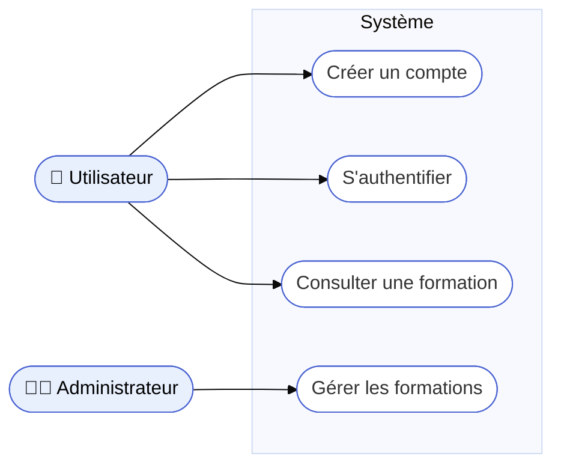
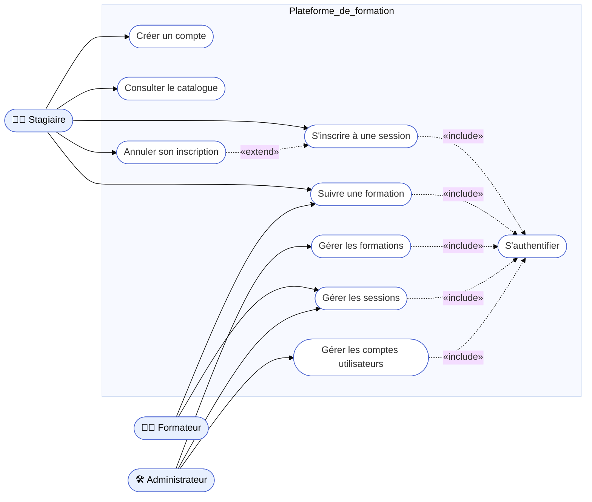
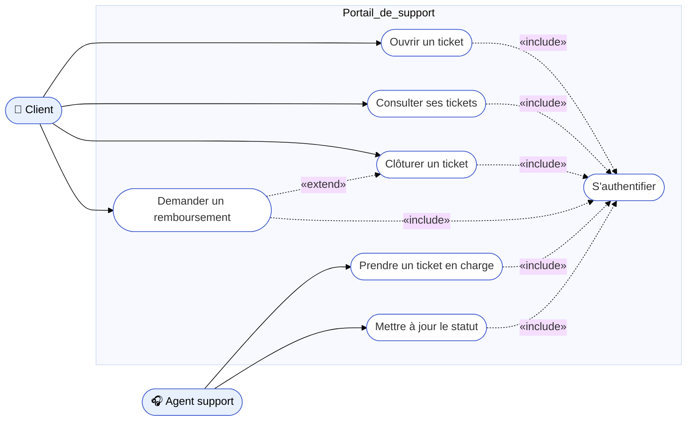

# Diagramme de cas d’usage (Use Case)

## Introduction au diagramme de cas d’usage

!!! quote "Analogie pédagogique"
    _Imaginez un **théâtre** : les **acteurs** entrent et sortent de la scène, jouent des rôles, déclenchent des actions. Le **diagramme de cas d’usage** est le plan qui indique **qui joue quel rôle** et **quelles scènes importantes** doivent absolument exister pour que la pièce ait du sens. Il ne détaille pas les dialogues mot à mot : il décrit les **situations clés** que le système doit gérer._

Le **diagramme de cas d’usage (Use Case)** est l’un des outils UML les plus utilisés pour décrire **ce que le système doit faire** du point de vue des utilisateurs, sans entrer dans la technique[^uml].  

Il répond à une question simple :  

> **Qui interagit avec le système, et pour obtenir quoi ?**

Contrairement à Merise, qui se concentre sur les **données** (MCD, MLD, MPD), le diagramme de cas d’usage se concentre sur les **fonctionnalités métier** : authentification, inscription, commande, gestion de ticket, etc.

!!! info "Pourquoi commencer par les cas d’usage ?"
    - C’est souvent **le premier diagramme UML** présenté aux métiers.  
    - Il structure le **cadrage fonctionnel** et les ateliers avec les utilisateurs.  
    - Il sert de base aux **user stories**, aux **tests fonctionnels** et aux **exigences**.  
    - Il s’intègre très bien avec vos modèles Merise existants : un cas d’usage consomme ou met à jour des données décrites dans le MCD/MLD/MPD.

---

## Pour repartir des bases

### 1. Ce qu’est (et n’est pas) un diagramme de cas d’usage

Un diagramme de cas d’usage **décrit les fonctionnalités attendues** d’un système logiciel du point de vue de ses **acteurs**[^acteur] (utilisateurs humains, systèmes externes, services partenaires).  

Il contient :

- des **acteurs** (ex. : Stagiaire, Formateur, Client, Agent support)  
- des **cas d’usage** (ex. : “S’authentifier”, “Suivre une formation”, “Ouvrir un ticket”)  
- une **frontière du système**[^frontiere] (ce qui est dans le SI vs ce qui est à l’extérieur)  
- des **relations** entre cas d’usage (`include`, `extend`) si nécessaire

Il **ne décrit pas** :

- le déroulé technique détaillé (API, endpoints, schéma de base)  
- les algorithmes, ni la structure de classes ou de tables  
- les flux système bas niveau (logs, batch techniques…)  

!!! note "Objectif fonctionnel"
    Le diagramme de cas d’usage répond à la question :  
    **“Quelles interactions importantes les acteurs doivent-ils pouvoir réaliser avec le système, et dans quel périmètre fonctionnel ?”**

### 2. Vocabulaire minimal

| Terme                 | Rôle                                                                                 |
|----------------------|--------------------------------------------------------------------------------------|
| **Acteur**           | Rôle externe qui interagit avec le système (utilisateur, application, service…)     |
| **Système**          | Boîte noire que l’on modélise (application web, SI métier, module de support…)      |
| **Cas d’usage**      | Fonctionnalité métier significative, vue par un acteur (`S'authentifier`, `Commander`) |
| **Frontière système**| Limite graphique entre ce qui est **dans** le système et ce qui est **extérieur**   |
| **Relation**         | Lien acteur ↔ cas d’usage, ou entre cas d’usage (include, extend, généralisation)   |
| `<<include>>`        | Un cas d’usage **intègre obligatoirement** un autre (ex. “Payer” inclut “S’authentifier”) |
| `<<extend>>`         | Un cas d’usage **prolonge éventuellement** un autre (ex. “Annuler commande” étend “Commander”) |

---

## Pour qui, et quand utiliser un diagramme de cas d’usage ?

-   :lucide-users:{ .lg .middle } **Pour qui ?**

    ---

    - Chefs de projet, Product Owners, Business Analysts  
    - Équipes métier (MOA) qui souhaitent formaliser leurs besoins  
    - Développeurs et architectes qui ont besoin d’une **vue fonctionnelle claire**  
    - Testeurs fonctionnels, QA, équipes de recette  
    - Consultants cyber / conformité qui veulent identifier les **scénarios sensibles** (authentification, paiement, accès à des données sensibles…)

-   :lucide-clock:{ .lg .middle } **Quand l’utiliser ?**

    ---

    - Lors du **cadrage** ou de la **conception fonctionnelle**  
    - Lors d’une **refonte d’application** pour remettre à plat les fonctionnalités  
    - Avant de définir les **API** et les **flux techniques**  
    - Lors de l’écriture de **user stories** ou de cahiers de tests  
    - Lors d’audits ou d’analyses de risques (par exemple, EBIOS RM[^ebios])

-   :lucide-pencil-ruler:{ .lg .middle } **Comment l’utiliser concrètement ?**

    ---

    1. Identifier les **acteurs** qui interagissent avec le système  
    2. Lister les **actions métier importantes** (cas d’usage)  
    3. Délimiter la **frontière du système**  
    4. Relier chaque acteur aux cas d’usage pertinents  
    5. Factoriser avec `<<include>>` / `<<extend>>` en cas de scénarios communs ou optionnels  

-   :lucide-activity:{ .lg .middle } **Impact direct**

    ---

    - Vue claire et partageable en atelier  
    - Base directe pour la **spécification fonctionnelle**  
    - Point d’entrée pour relier **Merise (données)** et **UML (comportement)**  
    - Support visuel pour les arbitrages de périmètre (MVP, versions futures)

---

## Vue d’ensemble : un exemple simple de cas d’usage

Avant de plonger dans des exemples détaillés, voici un **cas minimaliste** de plateforme de formation en ligne, déjà aligné avec votre modèle Merise `FORMATION / SESSION / STAGIAIRE / FORMATEUR / INSCRIPTION`.

<small><i>Ce diagramme montre le **périmètre fonctionnel** de la plateforme du point de vue des utilisateurs : ce qu’un stagiaire peut faire, ce qu’un formateur peut faire, et ce qui est réservé à l’administrateur. Il ne parle ni de tables, ni de colonnes, ni d’APIs : uniquement de **fonctionnalités métier visibles**.</i></small>

---

## Comment construire un diagramme de cas d’usage (méthode pas à pas)

### 1. Identifier les acteurs

À partir des ateliers métier, des personas, des profils utilisateurs, vous identifiez :

* les **utilisateurs humains** (Client, Stagiaire, Formateur, Agent support…),
* les **systèmes externes** (Passerelle de paiement, SSO, SI RH…),
* les **services techniques externes** (fournisseur d’email, identity provider, etc.).

Chaque acteur doit avoir un **rôle d’interaction** clair avec le système.

### 2. Délimiter la frontière du système

Vous dessinez une **boîte** qui représente le système étudié :

* “Application de support client”
* “Plateforme de formation”
* “Backoffice de gestion de commandes”

Tout ce qui est **dans la boîte** est considéré comme interne. Les acteurs restent **à l’extérieur**.

### 3. Lister les cas d’usage

Pour chaque acteur, vous listez les **intentions métier** :

* “Consulter ses tickets”, “Ouvrir un ticket”, “Réinitialiser un mot de passe”
* “S’inscrire à une session”, “Annuler une inscription”, “Télécharger une attestation”

Un cas d’usage doit être **formulé en verbe + complément** et avoir une **valeur métier** lisible.

### 4. Relier acteurs et cas d’usage

Vous reliez chaque acteur aux cas d’usage qu’il peut déclencher :

* Client → “Ouvrir un ticket”
* Stagiaire → “S’inscrire à une session”

Si deux acteurs distincts peuvent réaliser la même action, ils peuvent être reliés au même cas d’usage.

### 5. Factoriser avec `<<include>>` et `<<extend>>` (optionnel)

Quand certains cas d’usage utilisent **systématiquement** une même fonctionnalité, vous pouvez utiliser :

* `<<include>>` pour exprimer une **obligation** (ex. “Commander en ligne” inclut “S’authentifier”)
* `<<extend>>` pour exprimer un **complément optionnel** (ex. “Demander un remboursement” étend “Annuler une commande”)

L’idée est de **clarifier les dépendances**, pas de faire de la dentelle graphique.

---

## Ex. 1 – Plateforme de formation (aligné Merise)

Nous reprenons votre modèle de données : `FORMATION`, `SESSION`, `FORMATEUR`, `STAGIAIRE`, `INSCRIPTION`.
Le diagramme de cas d’usage va montrer **comment ces données sont manipulées** par les différents acteurs.

### Scénario métier

* Un **Stagiaire** consulte le catalogue de formations et s’inscrit à des sessions.
* Un **Formateur** anime les sessions et consulte la liste des inscrits.
* Un **Administrateur** gère le catalogue et les sessions (création, modification, annulation).

### Diagramme de cas d’usage

### Lien direct avec Merise

* Les cas d’usage **“S’inscrire à une session”** et **“Annuler une inscription”** manipulent la table `INSCRIPTION`.
* **“Gérer les formations”** manipule `FORMATION`.
* **“Gérer les sessions”** manipule `SESSION` (avec `id_formation` et `id_formateur`).
* **“Consulter le catalogue de formations”** correspond à des requêtes de lecture sur `FORMATION` et `SESSION`.

Le diagramme UML de cas d’usage est donc **complémentaire** de votre MPD/SQL :

* Merise : **quoi stocker** et **comment le relier**.
* UML (Use Case) : **qui fait quoi** avec ces données.

---

## Ex. 2 – Support client / tickets (aligné Merise)

Nous nous appuyons maintenant sur votre modèle `CLIENT`, `AGENT`, `TICKET`.

### Scénario métier

* Un **Client** ouvre un ticket, consulte son statut et peut le clôturer si le problème est résolu.
* Un **Agent** prend en charge les tickets, les met à jour, ajoute des commentaires.
* Un **Administrateur support** gère la répartition et les catégories (optionnel dans le diagramme).

### Diagramme de cas d’usage

### Lien direct avec Merise

* **“Ouvrir un ticket”** crée une ligne dans la table `TICKET` (avec `id_client`, `statut`, `priorite`…).
* **“Consulter l’état de ses tickets”** lit `TICKET` filtré sur `id_client`.
* **“Prendre en charge un ticket”** et **“Mettre à jour le ticket”** modifient `TICKET`, notamment `id_agent`, `statut`.

Vous obtenez ainsi :

* un **modèle de données propre** (Merise, déjà fait) ;
* un **modèle fonctionnel clair** (Use Case) qui montre comment ces données sont exploitées par les acteurs.

---

## Bonnes pratiques pour les cas d’usage UML

* Un cas d’usage doit avoir un **titre clair et métier** (“S’authentifier”, “Ouvrir un ticket”), pas un intitulé technique (“POST /login”).
* Un diagramme doit tenir dans une **vue lisible** : si vous commencez à scroller dans tous les sens, il faut **le découper en sous-diagrammes**.
* Ne cherchez pas à tout représenter : concentrez-vous sur les **fonctionnalités importantes** pour le métier.
* Utilisez `<<include>>` et `<<extend>>` uniquement quand cela **clarifie** réellement le modèle.
* Synchronisez toujours vos cas d’usage avec :

  * vos **user stories** ou spécifications,
  * vos **modèles de données Merise** (pour vérifier qu’aucune donnée critique n’est “orpheline” fonctionnellement).

---

## Mot de la fin

!!! quote

    Le **diagramme de cas d’usage** est la porte d’entrée idéale vers UML :  
    il permet de mettre d’accord le métier, la technique et la qualité autour d’une vision commune :  
    **“Qui fait quoi avec le système ?”**

    Bien utilisé, il devient un support puissant pour :

    * cadrer un projet sans noyer les interlocuteurs dans les détails techniques,  
    * structurer les exigences, les tests et les priorités,  
    * faire le lien naturel entre **Merise (données)** et **UML (fonctionnalités)**.

    > Une bonne pratique consiste à partir des cas d’usage majeurs,  
    > puis à dériver ensuite les **diagrammes de classes**, **diagrammes de séquence** et **modèles de données** qui les rendent possibles.

[^uml]: UML (Unified Modeling Language) est un langage de modélisation standardisé par l’OMG, destiné à représenter des systèmes logiciels de manière structurée, indépendante des langages de programmation et des technologies concrètes.

[^acteur]: Un **acteur UML** représente un rôle externe qui interagit avec le système (utilisateur, service externe, autre application). Une même personne peut jouer plusieurs rôles (par exemple “Stagiaire” et “Formateur”).

[^frontiere]: La **frontière du système** délimite ce qui appartient au système étudié (responsabilité de l’équipe projet) de ce qui est externe (utilisateurs, SI tiers). Cette frontière est essentielle en analyse de risques et en cybersécurité.

[^ebios]: **EBIOS Risk Manager** est une méthode française d’analyse de risques SSI publiée par l’ANSSI. Les scénarios de cas d’usage peuvent servir de base à l’identification des “événements redoutés” et des chemins d’attaque possibles.
[^include]: En UML, la relation `<<include>>` indique qu’un cas d’usage de base **intègre systématiquement** un autre cas d’usage, réutilisé comme une sous-fonctionalité obligatoire.
[^extend]: En UML, la relation `<<extend>>` indique qu’un cas d’usage vient **compléter de manière optionnelle** un cas d’usage de base, dans certains scénarios ou sous-conditions.
