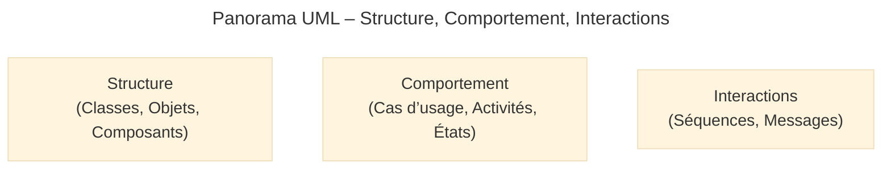
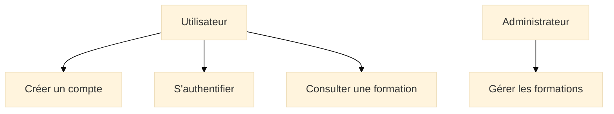
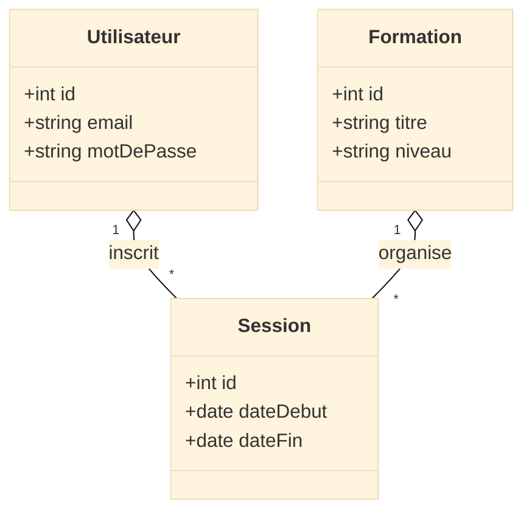
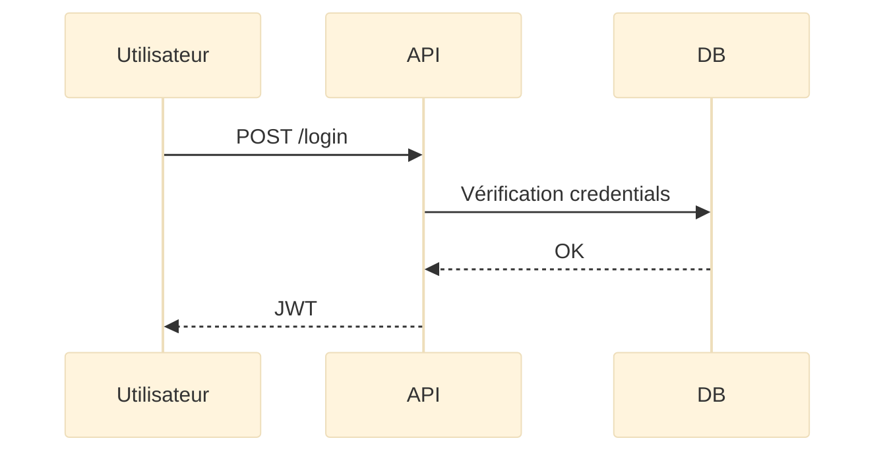
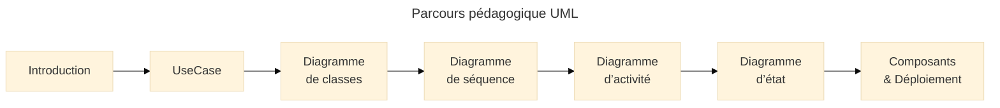

# Introduction

## Introduction

**UML (Unified Modeling Language)** est un **langage de modélisation universel** permettant de représenter clairement la structure, le comportement et les interactions d’un système logiciel.  
Contrairement à **Merise**, qui se concentre sur les données, UML couvre **l’ensemble du système** : objets, workflows, acteurs, messages, composants, services, états…

> UML n’impose pas une méthode.  
Il fournit un **langage graphique** pour mieux comprendre et concevoir.

UML reste aujourd’hui incontournable car il facilite :  
la communication entre équipes, l’analyse d’architectures complexes, la documentation, les audits, la cybersécurité, la conception logicielle moderne (API, microservices, DDD…).

!!! info "Pourquoi UML reste indispensable en 2025 ?"
    - Standard ISO/IEC utilisé par l’industrie depuis plus de 20 ans  
    - Supporte tous les types de projets : web, mobile, backend, cloud, cyber  
    - Vocabulaire unique pour les développeurs, architectes, PO, testeurs  
    - Complément parfait de Merise : UML modélise le **système**, Merise modélise la **donnée**

---

## Pour qui, et quand utiliser UML ?

-   :lucide-users:{ .lg .middle } **Pour qui ?**

    ---

    - Développeurs orientés objets  
    - Architectes logiciels  
    - Ingénieurs systèmes / DevOps / SRE  
    - Étudiants et formateurs  
    - Concepteurs API et responsables techniques

-   :lucide-layers:{ .lg .middle } **Quand l'utiliser ?**

    ---

    - Documentation d’un projet  
    - Analyse d’une base de code  
    - Conception d’API ou d’architectures distribuées  
    - Communication entre plusieurs équipes  
    - Préparation d’audits ou travaux de cybersécurité

-   :lucide-pencil-ruler:{ .lg .middle } **Comment l’utiliser concrètement ?**

    ---

    1. Identifier la **partie du système** à représenter  
    2. Choisir le **type de diagramme UML** adapté  
    3. Représenter uniquement l’essentiel pour éviter le bruit  
    4. Mettre à jour les diagrammes à mesure que l’architecture évolue

-   :lucide-activity:{ .lg .middle } **Impact direct**

    ---

    - Une vision claire et partagée  
    - Un meilleur design logiciel  
    - Une architecture mieux comprise  
    - Une documentation exploitable sur la durée  

---

## Vue d’ensemble : les grandes familles UML

Les 14 diagrammes UML se regroupent en trois grandes familles.

- **Diagrammes structurels**  
  Représentent la *forme* du système :  
  classes, objets, composants, modules, déploiement.

- **Diagrammes comportementaux**  
  Représentent les *fonctionnalités* :  
  cas d’usage, activités, états, processus.

- **Diagrammes d’interaction**  
  Représentent les *échanges* :  
  séquences, messages, collaborations.

<small><i>UML n’a pas vocation à tout représenter : l’objectif est de sélectionner le bon diagramme pour clarifier un point précis du système.</i></small>

---

## UML et Merise : complémentarité

| Merise                            | UML                                      |
| --------------------------------- | ---------------------------------------- |
| Modélisation des données          | Modélisation du système complet          |
| MCD → MLD → MPD                   | 14 diagrammes selon le besoin            |
| Centré SI et BD relationnelles    | Centré objet, architecture, interactions |
| Idéal pour les modèles de données | Idéal pour la conception applicative     |

Les deux approches sont **parfaitement complémentaires** dans une documentation professionnelle.

---

## Les diagrammes UML essentiels (version claire & lisible)

Chaque diagramme est présenté dans un **grid propre et homogène**.

### Diagrammes structurels

* :lucide-box:{ .lg .middle } **Diagramme de classes**

    ---

    Représente les objets, attributs, méthodes, héritages et associations.
    C’est le cœur du design orienté objet.

* :lucide-component:{ .lg .middle } **Diagramme de composants**

    ---

    Montre l’architecture logique : modules, dépendances, services, API.

* :lucide-server:{ .lg .middle } **Diagramme de déploiement**

    ---

    Visualise l’infrastructure : serveurs, conteneurs, réseaux, nœuds.

### Diagrammes comportementaux

* :lucide-user-check:{ .lg .middle } **Cas d’usage (Use Case)**

    ---

    Vision fonctionnelle : *qui fait quoi ?*

* :lucide-git-branch:{ .lg .middle } **Diagramme d’activité**

    ---

    Montre un workflow, un processus métier ou un pipeline.

* :lucide-refresh-ccw:{ .lg .middle } **Diagramme d’état**

    ---

    Décrit le cycle de vie d’un objet : ouvert → en cours → résolu…

### Diagrammes d’interaction

* :lucide-arrow-down-up:{ .lg .middle } **Diagramme de séquence**

    ---

    Représente l’échange de messages dans le temps.

* :lucide-message-square:{ .lg .middle } **Diagramme de communication**

    ---

    Vue alternative à la séquence, centrée sur les liens entre objets.

---

## Ex. UML cohérent : module de formation en ligne

### 1. Cas d’usage

### 2. Diagramme de classes

### 3. Diagramme de séquence

---

## Bonnes pratiques UML

* UML doit **clarifier**, jamais complexifier.
* Un bon diagramme tient sur un **écran sans zoom**.
* Chaque diagramme doit avoir un **objectif** clairement annoncé.
* Ne modélisez que ce qui a une **valeur explicative**.
* Synchronisez toujours UML avec l’architecture réelle.

---

## Parcours UML dans OmnyDocs

<small><i>Chaque document développera un diagramme avec exemples, cas pratiques et schémas explicatifs.</i></small>

---

## Mot de la fin

!!! quote 

    UML n’est pas un simple outil de dessin.
    C’est un **langage universel**, précis, stable, structurant.
    Il permet de **concevoir**, **communiquer** et **documenter** des systèmes de manière durable.

    Bien utilisé, il devient un véritable avantage stratégique :
    plus de clarté, moins d’ambiguïtés, une architecture mieux pensée.

 