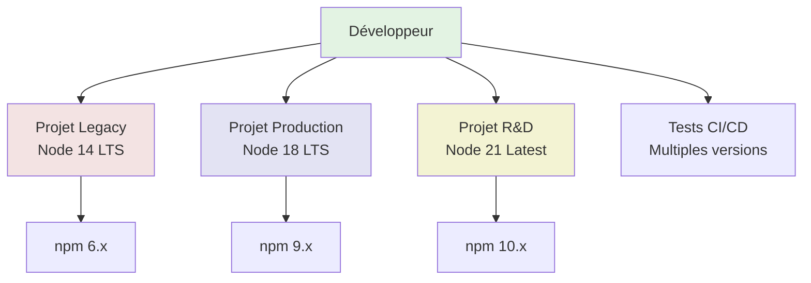
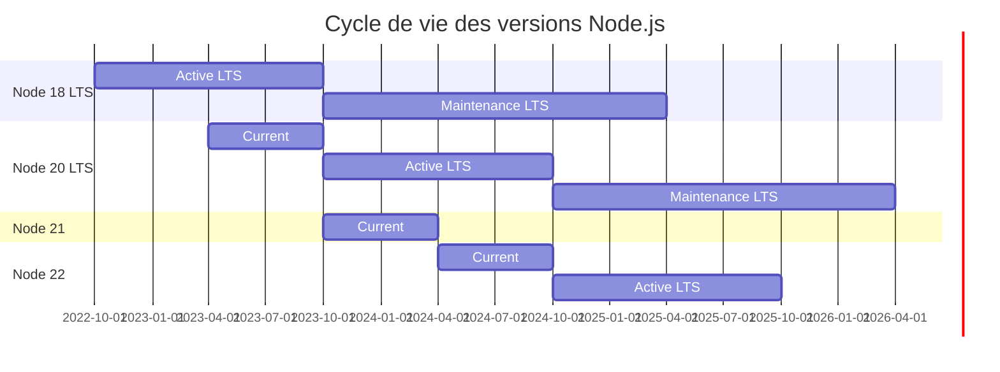

# NVM - Node Version Manager

## Introduction

**Niveau :** Débutant & Intermédiaire

!!! quote "Analogie pédagogique"
    _Imaginez que vous êtes un traducteur professionnel devant travailler sur plusieurs projets simultanément : un roman médiéval nécessite un français du XIIIe siècle, un contrat commercial demande un français juridique moderne, et un manga requiert un français contemporain familier. **NVM fonctionne exactement ainsi** : il vous permet de basculer instantanément entre différentes versions de Node.js selon les besoins de chaque projet, sans conflit ni installation complexe._

> **NVM (Node Version Manager)** est un **gestionnaire de versions Node.js** qui permet d'installer, gérer et basculer entre **plusieurs versions de Node.js** sur une même machine. C'est devenu l'outil **standard de l'industrie** pour les développeurs JavaScript/TypeScript, résolvant élégamment les problèmes de compatibilité entre projets nécessitant des versions Node différentes.

Avant NVM, les développeurs devaient **désinstaller et réinstaller Node.js manuellement** à chaque changement de projet, ou utiliser des configurations complexes. NVM transforme cette tâche laborieuse en une **simple commande** : `nvm use 18` ou `nvm use 20`.

!!! info "Pourquoi c'est important ?"
    NVM permet de **travailler sur plusieurs projets** avec des versions Node différentes, **tester la compatibilité** de votre code, **basculer instantanément** entre versions LTS et latest, **isoler les environnements** par projet, et **suivre les best practices** de l'écosystème JavaScript moderne.

## Pour repartir des bases (vrais débutants)

**Node.js** est un **environnement d'exécution JavaScript** qui permet d'exécuter du code JavaScript en dehors du navigateur - pour créer des serveurs web, des outils en ligne de commande, des applications desktop, etc. **npm** (Node Package Manager) est le gestionnaire de paquets livré avec Node.js.

**Problème sans NVM :**
- Projet A nécessite Node 16 (version stable utilisée en production)
- Projet B nécessite Node 20 (dernière version avec nouvelles fonctionnalités)
- Impossible d'avoir les deux simultanément avec installation classique

**Solution avec NVM :**
```bash
cd projet-a
nvm use 16      # Bascule sur Node 16

cd ../projet-b
nvm use 20      # Bascule sur Node 20
```

!!! tip "NVM = Liberté de version !"
    Pensez à NVM comme une **télécommande** pour changer de version Node.js instantanément, sans réinstallation.

## Pourquoi utiliser NVM ?

### Scénarios réels nécessitant plusieurs versions


**Cas d'usage concrets :**

1. **Applications legacy** : Projets anciens figés sur Node 12/14
2. **Production LTS** : Applications stables sur Node 18/20 LTS
3. **Développement moderne** : Nouvelles fonctionnalités Node 21+
4. **Tests de compatibilité** : Vérifier que le code fonctionne sur plusieurs versions
5. **CI/CD** : Tester automatiquement sur différentes versions Node
6. **Dépendances natives** : Certains modules natifs nécessitent versions spécifiques
7. **Migration progressive** : Tester nouvelle version avant migration production

### Versions Node.js : Comprendre les releases

**Cycle de releases Node.js :**


**Nomenclature des versions :**

| Type | Versions | Durée support | Usage recommandé |
|------|----------|---------------|------------------|
| **LTS (Long Term Support)** | Paires (18, 20, 22) | 30 mois | Production, applications stables |
| **Current** | Impaires (19, 21, 23) | 6 mois | Expérimentation, nouvelles features |
| **Active LTS** | 18 mois après release | 18 mois | Production recommandée |
| **Maintenance LTS** | Après Active LTS | 12 mois | Sécurité uniquement |
| **EOL (End of Life)** | Après Maintenance | - | ⚠️ Ne plus utiliser |

**Versions actuelles (Nov 2025) :**
- **Node 20 LTS** (Iron) : Active LTS - **Recommandée production**
- **Node 22** : Current - Nouvelles fonctionnalités
- **Node 18 LTS** (Hydrogen) : Maintenance LTS - Migration recommandée
- **Node 16 LTS** : EOL depuis Sept 2023 - ⚠️ Plus de support

!!! success "Règle d'or"
    - **Production** : Toujours utiliser la **dernière version LTS Active**
    - **Développement** : Tester sur **Current** pour préparer migrations
    - **Legacy** : Planifier migration avant **EOL**

## Installation de NVM

### Linux et macOS (nvm officiel)

**Méthode recommandée : Script d'installation**
```bash
# Télécharger et exécuter le script d'installation
curl -o- https://raw.githubusercontent.com/nvm-sh/nvm/v0.39.7/install.sh | bash

# Ou avec wget
wget -qO- https://raw.githubusercontent.com/nvm-sh/nvm/v0.39.7/install.sh | bash
```

**Ce script effectue automatiquement :**
1. Clone le repo nvm dans `~/.nvm`
2. Ajoute configuration au fichier de profil shell (`~/.bashrc`, `~/.zshrc`, etc.)
3. Configure les variables d'environnement

**Configuration ajoutée automatiquement :**
```bash
export NVM_DIR="$HOME/.nvm"
[ -s "$NVM_DIR/nvm.sh" ] && \. "$NVM_DIR/nvm.sh"  # Charge nvm
[ -s "$NVM_DIR/bash_completion" ] && \. "$NVM_DIR/bash_completion"  # Autocomplétion
```

**Recharger le shell :**
```bash
# Bash
source ~/.bashrc

# Zsh
source ~/.zshrc

# Fish
source ~/.config/fish/config.fish

# Ou fermer et rouvrir le terminal
```

**Vérifier l'installation :**
```bash
nvm --version
# v0.39.7

command -v nvm
# nvm
```

### Windows (nvm-windows)

**NVM natif ne fonctionne PAS sous Windows**. Utiliser **nvm-windows** (projet distinct).

**Installation via installeur :**

1. Télécharger : [github.com/coreybutler/nvm-windows/releases](https://github.com/coreybutler/nvm-windows/releases)
2. Exécuter `nvm-setup.exe`
3. Suivre l'assistant (installation par défaut : `C:\Users\<User>\AppData\Roaming\nvm`)

**Installation via Chocolatey :**
```powershell
# PowerShell Administrateur
choco install nvm
```

**Installation via Scoop :**
```powershell
scoop install nvm
```

**Vérifier (PowerShell) :**
```powershell
nvm version
# 1.1.12
```

!!! warning "Différences nvm-windows"
    **nvm-windows est un port distinct** avec syntaxe légèrement différente :
    - `nvm list` au lieu de `nvm ls`
    - `nvm use <version>` nécessite **PowerShell Administrateur**
    - Pas de fichier `.nvmrc` automatique
    - Gestion différente des alias

### WSL (Windows Subsystem for Linux)

**Recommandation forte : Installer nvm Linux dans WSL**, pas nvm-windows.
```bash
# Dans WSL Ubuntu/Debian
curl -o- https://raw.githubusercontent.com/nvm-sh/nvm/v0.39.7/install.sh | bash

# Recharger
source ~/.bashrc

# Vérifier
nvm --version
```

**Avantages nvm Linux dans WSL :**
- ✅ Syntaxe standard nvm
- ✅ Fichiers `.nvmrc` automatiques
- ✅ Performances natives
- ✅ Compatible avec tous les workflows Linux
- ✅ Intégration VSCode Remote-WSL parfaite

!!! tip "Meilleure pratique WSL"
    **Installez tout votre environnement de développement dans WSL** (nvm, Node, Git, etc.), pas dans Windows. Performances et compatibilité maximales.

## Utilisation de base

### Installer des versions Node.js
```bash
# Installer dernière version LTS (recommandé)
nvm install --lts

# Installer version LTS spécifique par nom de code
nvm install lts/iron      # Node 20 LTS
nvm install lts/hydrogen  # Node 18 LTS

# Installer dernière version (current)
nvm install node

# Installer version spécifique
nvm install 20.10.0
nvm install 18.19.0
nvm install 16.20.2

# Installer version avec npm spécifique
nvm install 20 --latest-npm

# Installer sans utiliser immédiatement
nvm install 20 --no-use
```

**Versions disponibles :**
```bash
# Lister toutes les versions disponibles au téléchargement
nvm ls-remote

# Lister uniquement versions LTS
nvm ls-remote --lts

# Lister versions LTS d'une famille
nvm ls-remote --lts=iron
nvm ls-remote --lts=hydrogen
```

### Lister versions installées
```bash
# Lister versions installées localement
nvm ls

# Résultat exemple :
#       v16.20.2
#       v18.19.0
#  ->   v20.10.0
#        system
# default -> 20.10.0 (-> v20.10.0)
# iojs -> N/A (default)
# node -> stable (-> v20.10.0) (default)
# stable -> 20.10 (-> v20.10.0) (default)

# Afficher chemin d'installation
nvm which 20
# /home/user/.nvm/versions/node/v20.10.0/bin/node
```

### Utiliser une version
```bash
# Basculer sur version spécifique
nvm use 20
nvm use 18.19.0

# Basculer sur dernière version LTS
nvm use --lts

# Basculer sur dernière version installée
nvm use node

# Utiliser version système (si Node installé hors nvm)
nvm use system
```

**Vérification après basculement :**
```bash
node --version
# v20.10.0

npm --version
# 10.2.3

which node
# /home/user/.nvm/versions/node/v20.10.0/bin/node
```

### Définir version par défaut
```bash
# Définir version par défaut pour nouveaux shells
nvm alias default 20

# Vérifier
nvm ls
# default -> 20 (-> v20.10.0)

# Utiliser dernière LTS par défaut
nvm alias default lts/*

# Utiliser dernière version installée par défaut
nvm alias default node
```

**Effet :**
- Chaque **nouveau terminal** démarrera avec cette version
- Ne change **pas** la version du terminal actuel (utiliser `nvm use`)

### Désinstaller une version
```bash
# Désinstaller version spécifique
nvm uninstall 16.20.2

# Désinstaller et nettoyer
nvm uninstall 18 --lts
```

!!! warning "Impossible de désinstaller version en cours"
    Basculer sur une autre version avant de désinstaller :
```bash
    nvm use 20
    nvm uninstall 18
```

## Gestion avancée

### Fichier .nvmrc

Le fichier **`.nvmrc`** définit la version Node.js pour un projet spécifique.

**Créer .nvmrc à la racine du projet :**
```bash
cd mon-projet

# Méthode 1 : Utiliser version actuelle
node --version > .nvmrc

# Méthode 2 : Spécifier manuellement
echo "20.10.0" > .nvmrc

# Méthode 3 : Utiliser LTS
echo "lts/iron" > .nvmrc

# Méthode 4 : Utiliser dernière version majeure
echo "20" > .nvmrc
```

**Contenu .nvmrc (exemples) :**
```
20.10.0          # Version exacte
20               # Dernière version 20.x installée
lts/iron         # Dernière LTS Iron installée
lts/*            # Dernière LTS toutes familles
node             # Dernière version installée
```

**Utiliser .nvmrc :**
```bash
cd mon-projet

# Lire et utiliser version du .nvmrc
nvm use

# Si version pas installée, installer puis utiliser
nvm install

# Vérifier version active
node --version
```

**Automatiser avec hook shell :**

**Bash (~/.bashrc) :**
```bash
# Charger automatiquement .nvmrc en changeant de répertoire
autoload_nvmrc() {
  if [[ -f .nvmrc && -r .nvmrc ]]; then
    nvm use
  elif [[ $(nvm version) != $(nvm version default) ]]; then
    nvm use default
  fi
}

# Hook sur changement de répertoire
cd() {
  builtin cd "$@"
  autoload_nvmrc
}

# Charger au démarrage du shell
autoload_nvmrc
```

**Zsh (~/.zshrc) :**
```bash
# Fonction pour charger .nvmrc automatiquement
autoload -U add-zsh-hook
load-nvmrc() {
  local node_version="$(nvm version)"
  local nvmrc_path="$(nvm_find_nvmrc)"

  if [ -n "$nvmrc_path" ]; then
    local nvmrc_node_version=$(nvm version "$(cat "${nvmrc_path}")")

    if [ "$nvmrc_node_version" = "N/A" ]; then
      nvm install
    elif [ "$nvmrc_node_version" != "$node_version" ]; then
      nvm use
    fi
  elif [ "$node_version" != "$(nvm version default)" ]; then
    nvm use default
  fi
}
add-zsh-hook chpwd load-nvmrc
load-nvmrc
```

### Aliases personnalisés
```bash
# Créer alias personnalisé
nvm alias production 20.10.0
nvm alias development 21.5.0
nvm alias legacy 18.19.0

# Utiliser alias
nvm use production
nvm use development

# Lister aliases
nvm alias

# Supprimer alias
nvm unalias production
```

**Aliases par défaut :**
- `default` : Version par défaut nouveaux shells
- `node` : Dernière version installée
- `stable` : Dernière version stable (identique à `node`)
- `iojs` : io.js (obsolète)

### Migration de packages globaux

Lors du changement de version Node, les **packages npm globaux** ne sont pas partagés.

**Problème :**
```bash
nvm use 18
npm install -g typescript eslint

nvm use 20
tsc --version  # ❌ Command not found
```

**Solution 1 : Réinstaller manuellement**
```bash
npm install -g typescript eslint prettier nodemon
```

**Solution 2 : Migration automatique**
```bash
# Installer nouvelle version en copiant packages globaux depuis version actuelle
nvm install 20 --reinstall-packages-from=18

# Ou depuis version par défaut
nvm install 20 --reinstall-packages-from=default

# Lister packages globaux actuels
npm list -g --depth=0
```

**Solution 3 : Script de synchronisation**
```bash
# Sauvegarder liste packages globaux
npm list -g --depth=0 --json | jq -r '.dependencies | keys[]' > ~/npm-global-packages.txt

# Sur nouvelle version, réinstaller
cat ~/npm-global-packages.txt | xargs npm install -g
```

!!! tip "Minimiser packages globaux"
    **Best practice** : Utiliser `npx` plutôt qu'installer globalement :
```bash
    # ❌ Éviter
    npm install -g typescript
    tsc --version
    
    # ✅ Préférer
    npx tsc --version
    npx eslint .
```

### Utilisation dans scripts
```bash
#!/usr/bin/env bash

# Charger nvm dans script
export NVM_DIR="$HOME/.nvm"
[ -s "$NVM_DIR/nvm.sh" ] && \. "$NVM_DIR/nvm.sh"

# Utiliser version spécifique
nvm use 20

# Exécuter commandes Node
node script.js
npm run build
```

**Script portable avec .nvmrc :**
```bash
#!/usr/bin/env bash

export NVM_DIR="$HOME/.nvm"
[ -s "$NVM_DIR/nvm.sh" ] && \. "$NVM_DIR/nvm.sh"

# Charger version du projet
if [ -f .nvmrc ]; then
  nvm install
  nvm use
fi

# Build projet
npm install
npm run build
```

## Configuration avancée

### Variables d'environnement
```bash
# Répertoire d'installation nvm (défaut: ~/.nvm)
export NVM_DIR="$HOME/.nvm"

# Répertoire de téléchargement temporaire
export NVM_CACHE_DIR="$HOME/.nvm/.cache"

# Miroir de téléchargement Node.js (par défaut nodejs.org)
export NVM_NODEJS_ORG_MIRROR="https://nodejs.org/dist"

# Miroir iojs (obsolète)
export NVM_IOJS_ORG_MIRROR="https://iojs.org/dist"

# Désactiver vérification certificat SSL (développement uniquement)
export NVM_INSECURE=1

# Couleurs dans output
export NVM_COLORS="rgbcm"
```

**Configuration Chine (Great Firewall) :**
```bash
# Utiliser miroir Taobao
export NVM_NODEJS_ORG_MIRROR=https://npmmirror.com/mirrors/node
```

### Performance et optimisation

**Lazy loading nvm (démarrage shell plus rapide) :**
```bash
# ~/.zshrc ou ~/.bashrc
# Ne charge nvm que quand utilisé

export NVM_DIR="$HOME/.nvm"

# Fonction proxy
nvm() {
  # Charger nvm réellement
  [ -s "$NVM_DIR/nvm.sh" ] && \. "$NVM_DIR/nvm.sh"
  # Exécuter commande
  nvm "$@"
}

# Ajouter Node/npm au PATH sans charger tout nvm
export PATH="$NVM_DIR/versions/node/$(cat $NVM_DIR/alias/default)/bin:$PATH"
```

**Avec zsh-nvm plugin (Oh My Zsh) :**
```bash
# ~/.zshrc
plugins=(... nvm)

# Lazy loading automatique
zstyle ':omz:plugins:nvm' lazy yes
```

### Cache et téléchargements
```bash
# Nettoyer cache nvm
rm -rf "$NVM_DIR/.cache"

# Forcer re-téléchargement version
nvm install 20 --reinstall-packages-from=none

# Voir taille cache
du -sh "$NVM_DIR/.cache"
```

## Intégration IDE et outils

### Visual Studio Code

**Configuration workspace (.vscode/settings.json) :**
```json
{
  "terminal.integrated.defaultProfile.linux": "bash",
  "terminal.integrated.profiles.linux": {
    "bash": {
      "path": "/bin/bash",
      "args": ["-l"]  // Login shell pour charger nvm
    }
  },
  
  // Spécifier version Node pour ESLint
  "eslint.nodePath": "/home/user/.nvm/versions/node/v20.10.0/bin/node",
  
  // TypeScript SDK
  "typescript.tsdk": "node_modules/typescript/lib"
}
```

**Extension recommandée :**
- **NVM Integration** : Détecte .nvmrc et bascule automatiquement

### CI/CD : GitHub Actions
```yaml
# .github/workflows/test.yml
name: Tests

on: [push, pull_request]

jobs:
  test:
    runs-on: ubuntu-latest
    
    strategy:
      matrix:
        node-version: [18, 20, 21]
    
    steps:
      - uses: actions/checkout@v4
      
      # Setup Node.js (pas besoin de nvm)
      - name: Setup Node.js
        uses: actions/setup-node@v4
        with:
          node-version: ${{ matrix.node-version }}
          cache: 'npm'
      
      - name: Install dependencies
        run: npm ci
      
      - name: Run tests
        run: npm test
```

**Avec .nvmrc automatique :**
```yaml
- name: Setup Node.js
  uses: actions/setup-node@v4
  with:
    node-version-file: '.nvmrc'
    cache: 'npm'
```

### CI/CD : GitLab CI
```yaml
# .gitlab-ci.yml
image: node:20

stages:
  - test
  - build

# Job avec version spécifique
test:node-18:
  image: node:18
  stage: test
  script:
    - npm ci
    - npm test

test:node-20:
  image: node:20
  stage: test
  script:
    - npm ci
    - npm test

# Ou utiliser nvm dans script
test:multi-version:
  image: ubuntu:latest
  before_script:
    - curl -o- https://raw.githubusercontent.com/nvm-sh/nvm/v0.39.7/install.sh | bash
    - export NVM_DIR="$HOME/.nvm"
    - \. "$NVM_DIR/nvm.sh"
    - nvm install
  script:
    - npm ci
    - npm test
```

### Docker

**Multi-stage build avec versions spécifiques :**
```dockerfile
# Utiliser image Node officielle plutôt que nvm
FROM node:20-alpine AS build

WORKDIR /app
COPY package*.json ./
RUN npm ci
COPY . .
RUN npm run build

FROM node:20-alpine
WORKDIR /app
COPY --from=build /app/dist ./dist
COPY package*.json ./
RUN npm ci --production
CMD ["node", "dist/index.js"]
```

**Si vraiment besoin de nvm dans Docker (rare) :**
```dockerfile
FROM ubuntu:22.04

# Installer dépendances
RUN apt-get update && apt-get install -y curl

# Installer nvm
RUN curl -o- https://raw.githubusercontent.com/nvm-sh/nvm/v0.39.7/install.sh | bash

# Charger nvm et installer Node
SHELL ["/bin/bash", "--login", "-c"]
RUN nvm install 20

WORKDIR /app
COPY . .
RUN npm install
CMD ["npm", "start"]
```

## Package.json : Best practices

### Spécifier version Node requise
```json
{
  "name": "mon-projet",
  "version": "1.0.0",
  "engines": {
    "node": ">=20.0.0 <21.0.0",
    "npm": ">=10.0.0"
  },
  "volta": {
    "node": "20.10.0"
  }
}
```

**Forcer respect de la version :**
```json
{
  "scripts": {
    "preinstall": "node -e \"const v=process.version;const r='>=20.0.0';const s=require('semver');if(!s.satisfies(v,r)){throw new Error('Node '+v+' incompatible. Requires '+r)}\""
  }
}
```

**Ou utiliser package `check-node-version` :**
```json
{
  "scripts": {
    "preinstall": "npx check-node-version --node $(cat .nvmrc)"
  }
}
```

### Scripts avec nvm
```json
{
  "scripts": {
    "prestart": "nvm use",
    "start": "node server.js",
    "dev": "nvm use && nodemon server.js",
    "build": "nvm use && npm run compile",
    "test": "nvm use && jest"
  }
}
```

## Troubleshooting

### nvm: command not found

**Problème :** nvm non chargé dans le shell.

**Solutions :**
```bash
# Vérifier si nvm installé
ls -la ~/.nvm

# Ajouter manuellement au profil shell
echo 'export NVM_DIR="$HOME/.nvm"' >> ~/.bashrc
echo '[ -s "$NVM_DIR/nvm.sh" ] && \. "$NVM_DIR/nvm.sh"' >> ~/.bashrc
source ~/.bashrc

# Zsh
echo 'export NVM_DIR="$HOME/.nvm"' >> ~/.zshrc
echo '[ -s "$NVM_DIR/nvm.sh" ] && \. "$NVM_DIR/nvm.sh"' >> ~/.zshrc
source ~/.zshrc
```

### Version ne persiste pas entre shells

**Problème :** `nvm use 20` fonctionne, mais nouveau terminal revient à une autre version.

**Solution :** Définir version par défaut
```bash
nvm alias default 20
```

### Permissions npm EACCES

**Problème :** `npm install -g` échoue avec erreur permissions.

**Solution :** Avec nvm, **ne jamais utiliser sudo** :
```bash
# ❌ MAUVAIS
sudo npm install -g typescript

# ✅ BON (nvm gère permissions)
npm install -g typescript

# Si problème persiste, réinstaller Node via nvm
nvm deactivate
nvm uninstall 20
nvm install 20
```

### Conflit avec installation Node système

**Problème :** Node installé via apt/brew interfère avec nvm.

**Solutions :**
```bash
# Désinstaller Node système
# Ubuntu/Debian
sudo apt remove nodejs npm

# macOS
brew uninstall node

# Vérifier aucune trace
which node
# Si résultat, nettoyer PATH

# Redémarrer terminal
nvm install 20
nvm use 20
```

### .nvmrc ignoré automatiquement

**Problème :** Changement de répertoire n'active pas .nvmrc.

**Solution :** Configurer hook shell (voir section Gestion avancée > Fichier .nvmrc).

### Performances lentes (Windows)

**Problème :** nvm-windows très lent comparé à Linux.

**Solutions :**

1. **Utiliser WSL** avec nvm Linux (recommandé)
2. Désactiver antivirus scanning sur `%APPDATA%\nvm`
3. Utiliser alternative plus rapide : **fnm** ou **volta**

### Erreur téléchargement versions

**Problème :** `nvm install 20` échoue avec erreur réseau.

**Solutions :**
```bash
# Vérifier connectivité
curl -I https://nodejs.org/dist/

# Changer miroir (Chine)
export NVM_NODEJS_ORG_MIRROR=https://npmmirror.com/mirrors/node
nvm install 20

# Désactiver SSL (développement uniquement)
export NVM_INSECURE=1
nvm install 20

# Nettoyer cache
rm -rf "$NVM_DIR/.cache"
nvm install 20
```

## Alternatives à NVM

### Comparaison des gestionnaires de versions

| Outil | Langage | Vitesse | Plateforme | Particularités |
|-------|---------|---------|------------|----------------|
| **nvm** | Bash | ⚠️ Moyenne | Linux/macOS | Standard industrie, mature |
| **nvm-windows** | Go | ⚠️ Lente | Windows | Port Windows, syntaxe différente |
| **fnm** | Rust | ✅ Très rapide | Cross-platform | .nvmrc auto, rapide |
| **volta** | Rust | ✅ Rapide | Cross-platform | Pinning automatique package.json |
| **n** | Bash | ⚠️ Moyenne | Linux/macOS | Minimaliste, simple |
| **asdf** | Bash | ⚠️ Moyenne | Linux/macOS | Multi-langages (Node, Ruby, Python...) |
| **nodenv** | Bash | ⚠️ Moyenne | Linux/macOS | Clone rbenv pour Node |

### fnm (Fast Node Manager)

**Installation :**
```bash
# Linux/macOS
curl -fsSL https://fnm.vercel.app/install | bash

# Windows (PowerShell)
winget install Schniz.fnm

# Cargo
cargo install fnm
```

**Configuration :**
```bash
# ~/.bashrc ou ~/.zshrc
eval "$(fnm env --use-on-cd)"
```

**Utilisation (compatible nvm) :**
```bash
fnm install 20
fnm use 20
fnm default 20
fnm list
```

**Avantages fnm :**
- ✅ **10-20x plus rapide** que nvm
- ✅ Écrit en Rust (performant)
- ✅ Support `.nvmrc` automatique
- ✅ Cross-platform natif (Windows inclus)
- ✅ Syntaxe quasi-identique à nvm

### volta

**Installation :**
```bash
# Linux/macOS
curl https://get.volta.sh | bash

# Windows
winget install Volta.Volta
```

**Philosophie différente :**
```bash
# Volta "pin" versions dans package.json automatiquement
volta install node@20

cd mon-projet
volta pin node@20
# Ajoute automatiquement dans package.json:
# "volta": { "node": "20.10.0" }

# Bascule automatiquement en entrant dans le projet
cd mon-projet  # Utilise automatiquement Node 20
```

**Avantages volta :**
- ✅ Gestion automatique par projet (package.json)
- ✅ Pas besoin de `nvm use` manuel
- ✅ Rapide (Rust)
- ✅ Gère aussi npm, yarn, pnpm

### asdf

**Installation :**
```bash
# Clone asdf
git clone https://github.com/asdf-vm/asdf.git ~/.asdf --branch v0.13.1

# Ajouter au shell
echo '. "$HOME/.asdf/asdf.sh"' >> ~/.bashrc

# Installer plugin Node
asdf plugin add nodejs
```

**Utilisation :**
```bash
asdf install nodejs 20.10.0
asdf global nodejs 20.10.0
asdf local nodejs 18.19.0  # .tool-versions dans projet
```

**Avantages asdf :**
- ✅ **Multi-langages** : Node, Ruby, Python, Go, Rust...
- ✅ Un seul outil pour tout gérer
- ✅ Fichier `.tool-versions` universel

**Exemple .tool-versions :**
```
nodejs 20.10.0
python 3.11.5
ruby 3.2.0
golang 1.21.4
```

### Recommandations

| Scénario | Outil recommandé | Raison |
|----------|------------------|--------|
| **Développeur Linux/macOS** | **fnm** | Rapidité + compatibilité nvm |
| **Développeur Windows** | **fnm** ou **volta** | Support natif Windows |
| **Débutant** | **nvm** | Standard industrie, documentation |
| **Multi-langages** | **asdf** | Gère Node + Python + Ruby... |
| **Équipe** | **nvm** ou **volta** | Adoption large, .nvmrc standard |
| **Performance critique** | **fnm** | Plus rapide |

## Exemples de workflows

### Workflow freelance multi-clients
```bash
# Structure
~/projects/
├── client-a/
│   ├── .nvmrc  # 18
│   └── backend/
├── client-b/
│   ├── .nvmrc  # 20
│   └── frontend/
└── personal/
    ├── .nvmrc  # 21 (expérimentation)
    └── blog/

# Hook automatique charge .nvmrc
cd ~/projects/client-a   # Bascule sur Node 18
cd ~/projects/client-b   # Bascule sur Node 20
cd ~/projects/personal   # Bascule sur Node 21
```

### Workflow tests compatibilité
```bash
#!/bin/bash
# test-all-versions.sh

VERSIONS=("18" "20" "21")

for version in "${VERSIONS[@]}"; do
  echo "Testing on Node $version"
  nvm use $version
  npm test
  if [ $? -ne 0 ]; then
    echo "❌ Tests failed on Node $version"
    exit 1
  fi
done

echo "✅ All versions passed"
```

### Workflow migration progressive
```bash
# 1. Audit version actuelle
cd projet
cat .nvmrc  # 18

# 2. Créer branche test
git checkout -b upgrade-node-20

# 3. Mettre à jour .nvmrc
echo "20" > .nvmrc

# 4. Installer et tester
nvm install
npm install  # Peut nécessiter updates dépendances
npm test

# 5. Si succès, merger
git add .nvmrc package-lock.json
git commit -m "chore: upgrade to Node 20"
git push
```

## Le mot de la fin

!!! quote
    **NVM a révolutionné la gestion des versions Node.js** en transformant une tâche autrefois pénible (désinstaller/réinstaller Node) en une simple commande. Ce qui semblait être un détail technique est devenu un **outil indispensable** pour tout développeur JavaScript moderne.
    
    La **flexibilité de basculer entre versions** ne concerne pas seulement le confort - c'est une **nécessité professionnelle**. Les projets legacy, les migrations progressives, les tests de compatibilité, et les contraintes de production imposent de jongler entre versions. NVM rend cela **transparent et sans friction**.
    
    Le **fichier .nvmrc** standardise les versions au niveau projet, garantissant que toute l'équipe utilise la même version Node. L'**automatisation via hooks shell** élimine même le besoin de penser à changer de version - ça arrive automatiquement.
    
    **Maîtriser NVM** signifie comprendre :
    - Le **cycle de vie des versions** Node (LTS vs Current)
    - Les **implications de compatibilité** entre versions
    - L'**intégration dans workflows** CI/CD et équipe
    - Les **alternatives modernes** (fnm, volta) selon vos besoins
    
    Que vous utilisiez nvm classique, fnm pour la performance, ou volta pour l'automatisation, le principe reste identique : **isolation des versions, bascule transparente, configuration par projet**. Choisissez l'outil adapté à votre contexte, mais ne travaillez **jamais sans gestionnaire de versions Node**.

---

!!! abstract "Métadonnées"
    **Version** : 1.0  
    **Dernière mise à jour** : Novembre 2025  
    **Durée de lecture** : 55-65 minutes  
    **Niveau** : Débutant & Intermédiaire  
    **Prérequis** : Connaissance basique de Node.js et terminal