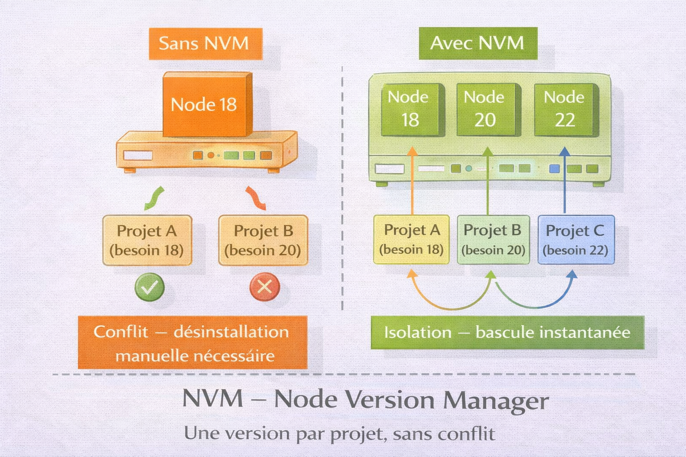
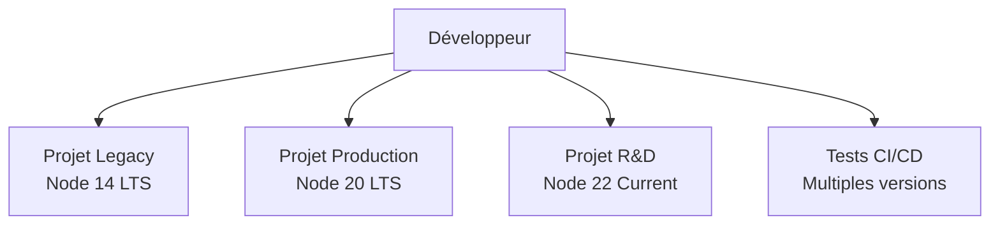
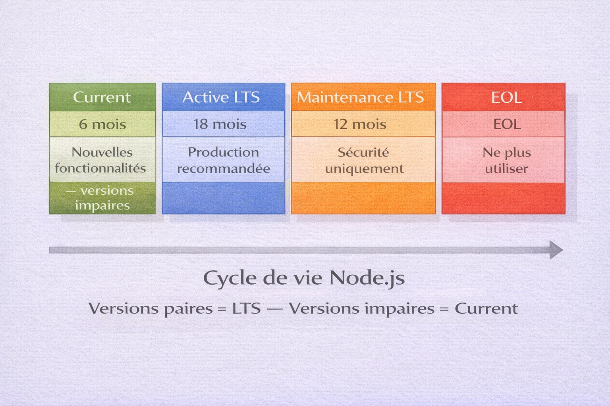
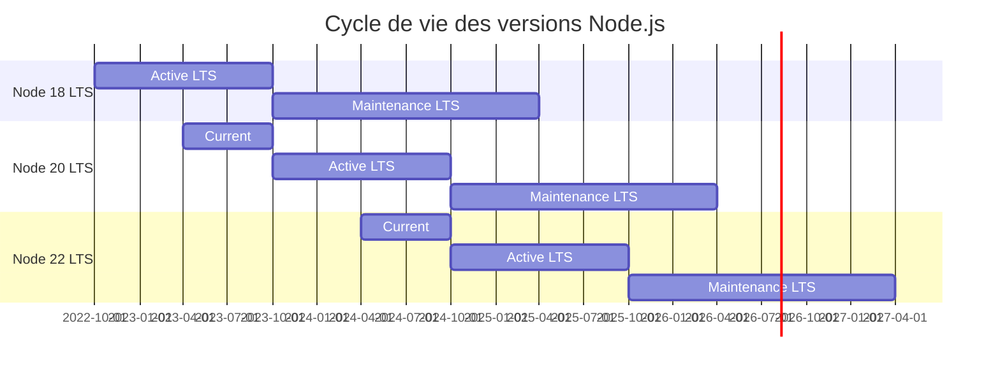
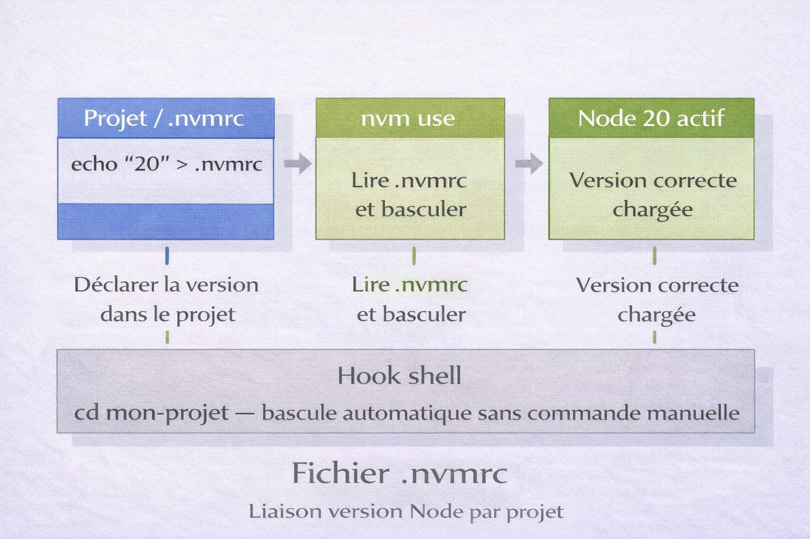

# NVM — Node Version Manager

<div
  class="omny-meta"
  data-level="🟢 Débutant & 🟡 Intermédiaire"
  data-version="1.1"
  data-time="55-65 minutes">
</div>

!!! quote "Analogie"
    _Un traducteur professionnel qui travaille sur plusieurs projets simultanément : un roman médiéval nécessite un français du XIIIe siècle, un contrat commercial demande un français juridique moderne, un manga requiert un français contemporain familier. NVM fonctionne exactement ainsi : il permet de basculer instantanément entre différentes versions de Node.js selon les besoins de chaque projet, sans conflit ni réinstallation._

**NVM (Node Version Manager)** est un gestionnaire de versions Node.js qui permet d'installer, gérer et basculer entre **plusieurs versions de Node.js** sur une même machine. C'est devenu l'outil standard de l'industrie pour les développeurs JavaScript et TypeScript, résolvant élégamment les problèmes de compatibilité entre projets nécessitant des versions Node différentes.

**Node.js** est un environnement d'exécution JavaScript qui permet d'exécuter du code JavaScript en dehors du navigateur — pour créer des serveurs web, des outils en ligne de commande, des applications desktop. **npm** (Node Package Manager) est le gestionnaire de paquets livré avec Node.js.

Avant NVM, les développeurs devaient désinstaller et réinstaller Node.js manuellement à chaque changement de projet, ou maintenir des configurations complexes. NVM transforme cette contrainte en une simple commande : `nvm use 18` ou `nvm use 20`.

!!! info "Pourquoi c'est important"
    NVM permet de travailler sur plusieurs projets avec des versions Node différentes, de tester la compatibilité du code, de basculer instantanément entre versions LTS et current, d'isoler les environnements par projet et de suivre les bonnes pratiques de l'écosystème JavaScript moderne.

<br />

---

## Pourquoi utiliser NVM

### Le problème concret

!!! note "L'image ci-dessous illustre le problème central que NVM résout. Avoir plusieurs projets nécessitant des versions Node différentes est la situation normale d'un développeur actif — pas un cas exceptionnel."



<p><em>Sans NVM, une seule version de Node est disponible sur la machine — changer de projet nécessite une désinstallation manuelle. Avec NVM, chaque projet peut spécifier sa version via un fichier .nvmrc et la bascule est instantanée. Les packages npm globaux restent isolés par version.</em></p>


```mermaid
flowchart TB
    A[Développeur]
    B["Projet Legacy\nNode 14 LTS"]
    C["Projet Production\nNode 20 LTS"]
    D["Projet R&D\nNode 22 Current"]
    E["Tests CI/CD\nMultiples versions"]

    A --> B
    A --> C
    A --> D
    A --> E
```

Cas d'usage concrets justifiant plusieurs versions : applications legacy figées sur Node 12 ou 14, applications stables en production sur Node 18 ou 20 LTS, développement avec les nouvelles fonctionnalités Node 22+, tests de compatibilité multi-versions, pipelines CI/CD, modules natifs nécessitant une version spécifique, migrations progressives avant passage en production.

### Versions Node.js — Comprendre les releases

!!! note "L'image ci-dessous représente le cycle de vie des versions Node.js. Savoir lire ces cycles est indispensable pour décider quelle version installer en production et anticiper les dates de fin de support."



<p><em>Les versions paires (18, 20, 22) sont des versions LTS — elles reçoivent 30 mois de support. Les versions impaires (19, 21, 23) sont des versions Current — elles reçoivent 6 mois de support et servent à expérimenter les nouvelles fonctionnalités. Une version en Maintenance LTS ne reçoit plus que les correctifs de sécurité critiques.</em></p>


```mermaid
gantt
    title Cycle de vie des versions Node.js
    dateFormat YYYY-MM

    section Node 18 LTS
    Active LTS           :a1, 2022-10, 2023-10
    Maintenance LTS      :a2, 2023-10, 2025-04

    section Node 20 LTS
    Current              :b1, 2023-04, 2023-10
    Active LTS           :b2, 2023-10, 2024-10
    Maintenance LTS      :b3, 2024-10, 2026-04

    section Node 22 LTS
    Current              :d1, 2024-04, 2024-10
    Active LTS           :d2, 2024-10, 2025-10
    Maintenance LTS      :d3, 2025-10, 2027-04
```

| Type | Versions | Durée support | Usage |
|---|---|---|---|
| LTS Active | Paires (20, 22) | 18 mois | Production — recommandé |
| Maintenance LTS | Paires après Active | 12 mois | Sécurité uniquement |
| Current | Impaires (21, 23) | 6 mois | Expérimentation |
| EOL | Toutes après maintenance | — | Ne plus utiliser |

!!! tip "Règle de décision versions"
    En production, toujours utiliser la dernière version LTS Active. En développement, tester sur Current pour anticiper les migrations. Planifier la migration avant la date EOL — ne jamais rester sur une version EOL.

<br />

---

## Installation

### Linux et macOS

```bash title="Bash — installation NVM via script officiel"
# Méthode curl
curl -o- https://raw.githubusercontent.com/nvm-sh/nvm/v0.39.7/install.sh | bash

# Méthode wget
wget -qO- https://raw.githubusercontent.com/nvm-sh/nvm/v0.39.7/install.sh | bash
```

Le script clone le repo dans `~/.nvm` et ajoute automatiquement la configuration au fichier de profil shell.

```bash title="Bash — configuration ajoutée automatiquement au profil shell"
export NVM_DIR="$HOME/.nvm"
[ -s "$NVM_DIR/nvm.sh" ] && \. "$NVM_DIR/nvm.sh"                    # Charge nvm
[ -s "$NVM_DIR/bash_completion" ] && \. "$NVM_DIR/bash_completion"   # Autocomplétion
```

```bash title="Bash — recharger le shell après installation"
# Bash
source ~/.bashrc

# Zsh
source ~/.zshrc

# Vérifier l'installation
nvm --version
# v0.39.7
```

### Windows — nvm-windows

NVM natif ne fonctionne pas sous Windows. Utiliser **nvm-windows** — un projet distinct.

```powershell title="PowerShell — installation via gestionnaire de paquets"
# Via Chocolatey
choco install nvm

# Via Scoop
scoop install nvm

# Vérifier
nvm version
# 1.1.12
```

L'installeur graphique est disponible sur [github.com/coreybutler/nvm-windows/releases](https://github.com/coreybutler/nvm-windows/releases).

!!! warning "Différences nvm-windows"
    nvm-windows est un port distinct — `nvm list` au lieu de `nvm ls`, `nvm use` nécessite PowerShell en mode administrateur, les fichiers `.nvmrc` ne sont pas chargés automatiquement.

### WSL

```bash title="Bash — installer NVM Linux dans WSL (recommandé)"
curl -o- https://raw.githubusercontent.com/nvm-sh/nvm/v0.39.7/install.sh | bash
source ~/.bashrc
nvm --version
```

Installer nvm Linux dans WSL plutôt que nvm-windows dans Windows — syntaxe standard, `.nvmrc` automatique, performances natives, intégration VSCode Remote-WSL complète.

<br />

---

## Utilisation de base

### Installer des versions Node.js

```bash title="Bash — installer des versions Node.js"
# Installer la dernière LTS
nvm install --lts

# Installer une LTS par nom de code
nvm install lts/iron      # Node 20 LTS
nvm install lts/hydrogen  # Node 18 LTS

# Installer la dernière version current
nvm install node

# Installer une version spécifique
nvm install 20.10.0
nvm install 18.19.0

# Installer en mettant npm à jour en même temps
nvm install 20 --latest-npm

# Installer sans basculer immédiatement
nvm install 20 --no-use
```

```bash title="Bash — lister les versions disponibles au téléchargement"
# Toutes les versions disponibles
nvm ls-remote

# Versions LTS uniquement
nvm ls-remote --lts

# Versions LTS d'une famille
nvm ls-remote --lts=iron
```

### Lister et utiliser les versions installées

```bash title="Bash — lister les versions installées"
nvm ls

# Résultat exemple :
#       v18.19.0
#  ->   v20.10.0
# default -> 20.10.0 (-> v20.10.0)
# node -> stable (-> v20.10.0) (default)

# Afficher le chemin d'installation d'une version
nvm which 20
# /home/user/.nvm/versions/node/v20.10.0/bin/node
```

```bash title="Bash — basculer entre versions"
# Basculer sur une version spécifique
nvm use 20
nvm use 18.19.0

# Basculer sur la dernière LTS installée
nvm use --lts

# Basculer sur la version système (si Node installé hors NVM)
nvm use system

# Vérifier après basculement
node --version
npm --version
which node
```

### Définir la version par défaut

```bash title="Bash — définir la version par défaut"
# Définir la version par défaut pour les nouveaux shells
nvm alias default 20

# Utiliser la dernière LTS comme défaut
nvm alias default lts/*

# Vérifier
nvm ls
# default -> 20 (-> v20.10.0)
```

Chaque nouveau terminal démarre avec la version `default`. `nvm alias` ne change pas la version du terminal courant — utiliser `nvm use` pour le shell actif.

### Désinstaller une version

```bash title="Bash — désinstaller une version Node.js"
nvm uninstall 18.19.0
```

!!! warning "Basculer avant de désinstaller"
    Il est impossible de désinstaller la version en cours d'utilisation. Basculer sur une autre version d'abord : `nvm use 20` puis `nvm uninstall 18`.

<br />

---

## Gestion avancée

### Fichier .nvmrc

!!! note "L'image ci-dessous illustre comment le fichier .nvmrc lie une version Node à un projet et comment les hooks shell automatisent la bascule. C'est le mécanisme central pour garantir qu'une équipe utilise la même version Node sur un projet donné."



<p><em>Le fichier .nvmrc à la racine d'un projet contient une version Node — exacte, majeure ou alias LTS. La commande `nvm use` lit ce fichier et bascule sur la version correspondante. Un hook shell peut automatiser cette bascule à chaque changement de répertoire — plus besoin d'y penser manuellement.</em></p>

```bash title="Bash — créer un fichier .nvmrc"
cd mon-projet

# Utiliser la version actuellement active
node --version > .nvmrc

# Spécifier manuellement
echo "20.10.0" > .nvmrc   # Version exacte
echo "20"       > .nvmrc   # Dernière 20.x installée
echo "lts/iron" > .nvmrc   # Alias LTS
```

```bash title="Bash — utiliser le .nvmrc d'un projet"
cd mon-projet

# Lire et appliquer la version du .nvmrc
nvm use

# Si la version n'est pas installée — l'installer puis l'activer
nvm install
```

**Automatiser avec un hook shell :**

```bash title="Bash — hook automatique ~/.bashrc"
# Bascule automatiquement sur le .nvmrc en changeant de répertoire
autoload_nvmrc() {
    if [[ -f .nvmrc && -r .nvmrc ]]; then
        nvm use
    elif [[ $(nvm version) != $(nvm version default) ]]; then
        nvm use default
    fi
}

cd() {
    builtin cd "$@"
    autoload_nvmrc
}

autoload_nvmrc
```

```bash title="Bash — hook automatique ~/.zshrc"
autoload -U add-zsh-hook

load-nvmrc() {
    local node_version="$(nvm version)"
    local nvmrc_path="$(nvm_find_nvmrc)"

    if [ -n "$nvmrc_path" ]; then
        local nvmrc_node_version=$(nvm version "$(cat "${nvmrc_path}")")
        if [ "$nvmrc_node_version" = "N/A" ]; then
            nvm install
        elif [ "$nvmrc_node_version" != "$node_version" ]; then
            nvm use
        fi
    elif [ "$node_version" != "$(nvm version default)" ]; then
        nvm use default
    fi
}

add-zsh-hook chpwd load-nvmrc
load-nvmrc
```

### Aliases personnalisés

```bash title="Bash — créer et utiliser des aliases NVM"
# Créer des aliases métier
nvm alias production  20.10.0
nvm alias development 22.0.0
nvm alias legacy      18.19.0

# Utiliser
nvm use production
nvm use legacy

# Lister tous les aliases
nvm alias

# Supprimer un alias
nvm unalias production
```

### Migration de packages globaux

Les packages npm globaux ne sont pas partagés entre versions Node. Changer de version revient à repartir d'un environnement vide pour les packages globaux.

```bash title="Bash — migrer les packages globaux vers une nouvelle version"
# Installer une nouvelle version en copiant les packages globaux de l'ancienne
nvm install 22 --reinstall-packages-from=20

# Lister les packages globaux actuels
npm list -g --depth=0
```

```bash title="Bash — sauvegarder et restaurer les packages globaux manuellement"
# Sauvegarder la liste
npm list -g --depth=0 --json | jq -r '.dependencies | keys[]' > ~/npm-global-packages.txt

# Restaurer sur la nouvelle version
nvm use 22
cat ~/npm-global-packages.txt | xargs npm install -g
```

!!! tip "Minimiser les packages globaux"
    Utiliser `npx` plutôt que d'installer globalement — la commande est téléchargée à la volée si nécessaire et toujours à jour. `npx tsc --version` plutôt que `npm install -g typescript`.

### Utilisation dans des scripts

```bash title="Bash — charger NVM dans un script shell"
#!/usr/bin/env bash

# Charger NVM explicitement dans le script
export NVM_DIR="$HOME/.nvm"
[ -s "$NVM_DIR/nvm.sh" ] && \. "$NVM_DIR/nvm.sh"

# Utiliser la version du projet si .nvmrc présent
if [ -f .nvmrc ]; then
    nvm install
    nvm use
fi

npm install
npm run build
```

<br />

---

## Configuration avancée

### Variables d'environnement

```bash title="Bash — variables d'environnement NVM"
# Répertoire d'installation (défaut : ~/.nvm)
export NVM_DIR="$HOME/.nvm"

# Miroir de téléchargement Node.js (défaut : nodejs.org)
export NVM_NODEJS_ORG_MIRROR="https://nodejs.org/dist"

# Miroir alternatif (derrière le Great Firewall)
export NVM_NODEJS_ORG_MIRROR="https://npmmirror.com/mirrors/node"
```

### Lazy loading — démarrage shell plus rapide

NVM ralentit légèrement l'ouverture du terminal car il se charge à chaque démarrage. Le lazy loading ne charge NVM que lorsqu'une commande `nvm` ou `node` est effectivement appelée.

```bash title="Bash — lazy loading NVM dans ~/.bashrc ou ~/.zshrc"
export NVM_DIR="$HOME/.nvm"

# Ajouter Node au PATH sans charger tout NVM
export PATH="$NVM_DIR/versions/node/$(cat $NVM_DIR/alias/default)/bin:$PATH"

# Proxy — charge NVM réellement au premier appel
nvm() {
    [ -s "$NVM_DIR/nvm.sh" ] && \. "$NVM_DIR/nvm.sh"
    nvm "$@"
}
```

```bash title="Bash — lazy loading avec zsh-nvm plugin (Oh My Zsh)"
# ~/.zshrc
plugins=(... nvm)
zstyle ':omz:plugins:nvm' lazy yes
```

<br />

---

## Intégration outils et CI/CD

### VSCode

```json title="JSON — .vscode/settings.json avec NVM"
{
    "terminal.integrated.defaultProfile.linux": "bash",
    "terminal.integrated.profiles.linux": {
        "bash": {
            "path": "/bin/bash",
            "args": ["-l"]
        }
    },
    "typescript.tsdk": "node_modules/typescript/lib"
}
```

L'argument `-l` (login shell) garantit que NVM est chargé dans le terminal intégré VSCode.

### GitHub Actions

```yaml title="YAML — workflow multi-versions Node.js"
name: Tests

on: [push, pull_request]

jobs:
  test:
    runs-on: ubuntu-latest

    strategy:
      matrix:
        node-version: [18, 20, 22]

    steps:
      - uses: actions/checkout@v4

      - name: Setup Node.js
        uses: actions/setup-node@v4
        with:
          node-version: ${{ matrix.node-version }}
          cache: 'npm'

      - run: npm ci
      - run: npm test
```

```yaml title="YAML — version Node.js depuis .nvmrc"
- name: Setup Node.js
  uses: actions/setup-node@v4
  with:
    node-version-file: '.nvmrc'
    cache: 'npm'
```

### GitLab CI

```yaml title="YAML — pipeline multi-versions GitLab CI"
stages:
  - test

test:node-18:
  image: node:18
  stage: test
  script:
    - npm ci
    - npm test

test:node-20:
  image: node:20
  stage: test
  script:
    - npm ci
    - npm test
```

### Docker

```dockerfile title="Dockerfile — build multi-stage avec image Node officielle"
# Utiliser l'image Node officielle plutôt que NVM dans Docker
FROM node:20-alpine AS build

WORKDIR /app
COPY package*.json ./
RUN npm ci
COPY . .
RUN npm run build

FROM node:20-alpine
WORKDIR /app
COPY --from=build /app/dist ./dist
COPY package*.json ./
RUN npm ci --omit=dev
CMD ["node", "dist/index.js"]
```

!!! tip "NVM dans Docker — cas rare"
    Dans la grande majorité des cas, utiliser l'image officielle `node:VERSION` est préférable à installer NVM dans un conteneur. NVM dans Docker n'est justifié que pour des scénarios très spécifiques : tests multi-versions dans un même conteneur.

<br />

---

## Package.json — Bonnes pratiques

### Déclarer la version Node requise

```json title="JSON — engines dans package.json"
{
    "name": "mon-projet",
    "version": "1.0.0",
    "engines": {
        "node": ">=20.0.0 <21.0.0",
        "npm": ">=10.0.0"
    }
}
```

```json title="JSON — vérification de version au preinstall"
{
    "scripts": {
        "preinstall": "npx check-node-version --node $(cat .nvmrc)"
    }
}
```

Le champ `engines` est informatif par défaut — il n'empêche pas l'installation avec une version incompatible sauf si `engine-strict=true` est configuré dans `.npmrc`.

<br />

---

## Dépannage

### nvm: command not found

```bash title="Bash — corriger NVM non chargé dans le shell"
# Vérifier que NVM est bien installé
ls -la ~/.nvm

# Ajouter manuellement la configuration au profil
echo 'export NVM_DIR="$HOME/.nvm"' >> ~/.bashrc
echo '[ -s "$NVM_DIR/nvm.sh" ] && \. "$NVM_DIR/nvm.sh"' >> ~/.bashrc
source ~/.bashrc
```

### La version ne persiste pas entre terminaux

La version définie par `nvm use` ne s'applique qu'au shell courant. Pour qu'une version soit active par défaut dans tous les nouveaux terminaux :

```bash title="Bash — définir la version par défaut persistante"
nvm alias default 20
```

### Erreur de permissions npm (EACCES)

Avec NVM, ne jamais utiliser `sudo` pour les packages npm globaux — NVM gère les permissions dans son propre répertoire.

```bash title="Bash — réinstaller pour corriger les permissions"
# Ne jamais utiliser sudo avec NVM
# sudo npm install -g typescript  <- incorrect

# La bonne approche — NVM gère les droits
npm install -g typescript

# Si le problème persiste, réinstaller la version via NVM
nvm deactivate
nvm uninstall 20
nvm install 20
```

### Conflit avec Node installé via le système

```bash title="Bash — supprimer Node installé hors NVM"
# Ubuntu / Debian
sudo apt remove nodejs npm

# macOS
brew uninstall node

# Vérifier qu'il ne reste aucune trace
which node

# Redémarrer le terminal puis installer via NVM
nvm install 20
nvm use 20
```

### Téléchargement échoue

```bash title="Bash — diagnostiquer et contourner les problèmes réseau"
# Tester la connectivité vers nodejs.org
curl -I https://nodejs.org/dist/

# Changer de miroir
export NVM_NODEJS_ORG_MIRROR=https://npmmirror.com/mirrors/node
nvm install 20

# Nettoyer le cache et réessayer
rm -rf "$NVM_DIR/.cache"
nvm install 20
```

<br />

---

## Alternatives à NVM

### Comparaison des gestionnaires de versions

| Outil | Technologie | Vitesse | Plateforme | Particularités |
|---|---|---|---|---|
| nvm | Bash | Moyenne | Linux, macOS | Standard industrie, mature, documentation riche |
| nvm-windows | Go | Lente | Windows uniquement | Port Windows, syntaxe différente |
| fnm | Rust | Très rapide | Cross-platform | .nvmrc automatique, syntaxe quasi identique à nvm |
| volta | Rust | Rapide | Cross-platform | Pinning automatique via package.json |
| n | Bash | Moyenne | Linux, macOS | Minimaliste |
| asdf | Bash | Moyenne | Linux, macOS | Multi-langages (Node, Ruby, Python, Go) |

### fnm — Fast Node Manager

```bash title="Bash — installer fnm"
# Linux / macOS
curl -fsSL https://fnm.vercel.app/install | bash

# Windows (PowerShell)
winget install Schniz.fnm

# Via Cargo
cargo install fnm
```

```bash title="Bash — configurer fnm dans le profil shell"
# ~/.bashrc ou ~/.zshrc
eval "$(fnm env --use-on-cd)"
```

```bash title="Bash — utiliser fnm (syntaxe quasi identique à nvm)"
fnm install 20
fnm use 20
fnm default 20
fnm list
```

fnm est écrit en Rust — 10 à 20 fois plus rapide que nvm au démarrage, supporte `.nvmrc` automatiquement, fonctionne nativement sous Windows.

### volta

```bash title="Bash — installer volta"
# Linux / macOS
curl https://get.volta.sh | bash

# Windows
winget install Volta.Volta
```

```bash title="Bash — utiliser volta — philosophie par projet"
# Installer une version
volta install node@20

# Lier une version à un projet — modifie package.json automatiquement
cd mon-projet
volta pin node@20
# Ajoute dans package.json : "volta": { "node": "20.x.x" }

# La bascule est automatique en entrant dans le projet
```

volta gère aussi les versions de npm, yarn et pnpm via le même mécanisme de pinning.

### asdf — gestionnaire multi-langages

```bash title="Bash — installer asdf et le plugin Node"
git clone https://github.com/asdf-vm/asdf.git ~/.asdf --branch v0.13.1
echo '. "$HOME/.asdf/asdf.sh"' >> ~/.bashrc

asdf plugin add nodejs
asdf install nodejs 20.10.0
asdf global nodejs 20.10.0
```

```bash title="Bash — fichier .tool-versions (équivalent .nvmrc pour asdf)"
# .tool-versions à la racine du projet
nodejs 20.10.0
python 3.11.5
golang 1.21.4
```

Un seul outil pour gérer les versions de Node, Python, Ruby, Go et d'autres runtimes.

### Recommandations selon contexte

| Contexte | Outil recommandé | Raison |
|---|---|---|
| Linux / macOS | fnm | Rapidité, compatibilité .nvmrc |
| Windows natif | fnm ou volta | Support natif Windows |
| Débutant | nvm | Standard industrie, documentation exhaustive |
| Multi-langages | asdf | Node + Python + Ruby dans un seul outil |
| Équipe — cohérence maximale | nvm ou volta | .nvmrc standard, adoption large |

<br />

---

## Workflows types

### Multi-projets avec versions différentes

```bash title="Bash — structure de projets avec .nvmrc par répertoire"
# Structure
# ~/projects/
# client-a/  (.nvmrc: 18)
# client-b/  (.nvmrc: 20)
# personal/  (.nvmrc: 22)

# Avec hook shell actif, la bascule est automatique
cd ~/projects/client-a   # Bascule sur Node 18
cd ~/projects/client-b   # Bascule sur Node 20
cd ~/projects/personal   # Bascule sur Node 22
```

### Tests de compatibilité multi-versions

```bash title="Bash — script de test sur plusieurs versions Node"
#!/bin/bash
# test-all-versions.sh

VERSIONS=("18" "20" "22")

for version in "${VERSIONS[@]}"; do
    echo "--- Tests Node $version ---"
    nvm use "$version"
    npm test

    if [ $? -ne 0 ]; then
        echo "Echec sur Node $version"
        exit 1
    fi
done

echo "Toutes les versions validées"
```

### Migration progressive vers une version majeure

```bash title="Bash — workflow de migration Node.js"
# 1. Vérifier la version actuelle du projet
cat .nvmrc

# 2. Créer une branche de test
git checkout -b upgrade-node-20

# 3. Mettre à jour .nvmrc
echo "20" > .nvmrc

# 4. Installer la nouvelle version et tester
nvm install
npm install
npm test

# 5. Si succès, committer
git add .nvmrc package-lock.json
git commit -m "chore: upgrade to Node 20"
```

<br />

---

## Conclusion

!!! quote "Conclusion"
    _NVM a transformé la gestion des versions Node.js en rendant une tâche autrefois laborieuse — désinstaller et réinstaller Node — transparente et instantanée. La flexibilité de basculer entre versions n'est pas un confort optionnel : c'est une nécessité professionnelle imposée par la coexistence de projets legacy, de contraintes de production et de migrations progressives. Le fichier .nvmrc standardise la version au niveau projet et garantit la cohérence dans une équipe. Automatisé via un hook shell, le changement de version devient aussi naturel que de changer de répertoire. Que ce soit nvm classique, fnm pour la performance ou volta pour l'automatisation par projet, le principe reste identique : isolation des versions, bascule transparente, configuration déclarative par projet._

<br />