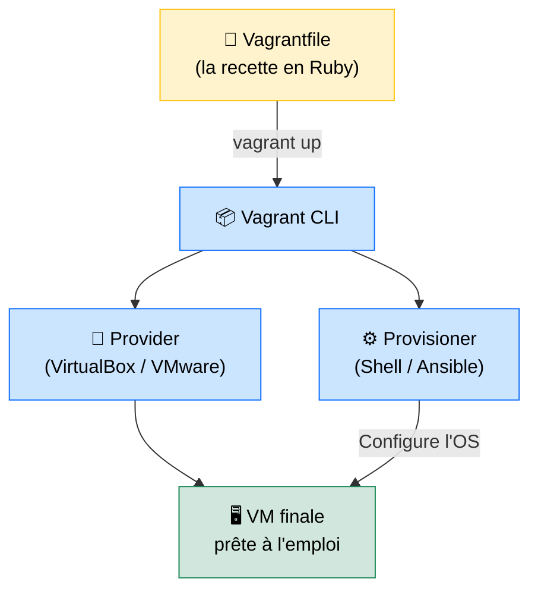

# Vagrant — L'Environnement de Développement comme du Code

<div
  class="omny-meta"
  data-level="🟡 Intermédiaire"
  data-version="2.x"
  data-time="~25 minutes">
</div>

## Introduction

!!! quote "Analogie pédagogique — La Recette de Cuisine vs le Plat Préparé"
    Partager une VM VirtualBox entre collègues, c'est comme envoyer un plat cuisiné par la poste : lourd, fragile, et le résultat change selon qui l'a préparé. **Vagrant**, c'est partager la **recette** (un fichier texte de 20 lignes) : n'importe qui peut recréer exactement le même plat en une commande, n'importe où, n'importe quand.

    Le `Vagrantfile` est votre recette : il décrit l'OS, la RAM, le réseau, et les logiciels à installer. La commande `vagrant up` exécute cette recette et livre une VM prête à l'emploi en moins de 5 minutes.

Vagrant est développé par HashiCorp et s'appuie sur des **providers** (VirtualBox, VMware, Hyper-V) et des **provisioners** (Shell, Ansible, Chef) pour livrer des environnements identiques à tous les membres d'une équipe. C'est l'antidote au classique *"ça marche sur ma machine"*.

<br>

---

## Architecture Vagrant



_`vagrant up` orchestre tout : télécharger la **box** (image de base), créer la VM dans VirtualBox, appliquer le réseau et le provisioning. Le résultat est déterministe et reproductible._

<br>

---

## Le Vagrantfile — La Base

```ruby title="Vagrantfile — VM de développement Laravel"
Vagrant.configure("2") do |config|

  # ── Image de base (box) ──────────────────────────────────────
  # Chercher des boxes sur https://app.vagrantup.com/boxes/search
  config.vm.box = "ubuntu/jammy64"  # Ubuntu 22.04 LTS

  # ── Réseau ───────────────────────────────────────────────────
  # Accéder à l'appli depuis l'hôte sur http://192.168.56.10
  config.vm.network "private_network", ip: "192.168.56.10"

  # ── Dossier partagé : synchronisation code hôte ↔ VM ─────────
  # Votre code sur l'hôte = /var/www/html dans la VM
  config.vm.synced_folder ".", "/var/www/html", type: "virtualbox"

  # ── Ressources VirtualBox ────────────────────────────────────
  config.vm.provider "virtualbox" do |vb|
    vb.memory = "2048"  # 2 Go RAM
    vb.cpus   = 2
    vb.name   = "laravel-dev"
  end

  # ── Provisioning : installer PHP, Nginx, Composer ────────────
  config.vm.provision "shell", inline: <<-SHELL
    apt-get update -qq
    apt-get install -y nginx php8.3-fpm php8.3-cli php8.3-mbstring \
      php8.3-xml php8.3-curl php8.3-pdo php8.3-mysql composer

    # Démarrer les services
    systemctl enable nginx php8.3-fpm
    systemctl start nginx php8.3-fpm

    echo "✅ Environnement Laravel prêt sur http://192.168.56.10"
  SHELL
end
```

<br>

---

## Commandes Essentielles

```bash title="Cycle de vie d'une VM Vagrant"
# Créer et démarrer la VM (télécharge la box si absente)
vagrant up

# Se connecter en SSH (sans connaître l'IP ni les clés)
vagrant ssh

# Relancer le provisioning (si vous avez modifié le Vagrantfile)
vagrant provision

# Éteindre la VM proprement (état sauvegardé)
vagrant halt

# Suspendre (pause — redémarrage très rapide)
vagrant suspend
vagrant resume

# Détruire complètement la VM (libère l'espace disque)
vagrant destroy

# Voir le statut de toutes les VMs Vagrant
vagrant global-status
```

### Partager le Vagrantfile avec l'équipe

```bash title="Workflow en équipe"
# Le développeur 1 crée l'environnement
git add Vagrantfile
git commit -m "feat: ajouter Vagrantfile pour environnement de dev Laravel"
git push

# Le développeur 2 récupère et lance exactement le même environnement
git pull
vagrant up
# → Même VM, même PHP, même Nginx, même version — garanti.
```

<br>

---

## Bonnes Pratiques

| Règle | Raison |
|---|---|
| **Commiter le Vagrantfile** | C'est le code de l'environnement — il doit être versionné comme le reste |
| **Ne pas commiter `.vagrant/`** | Ce dossier est local et contient l'état de la VM — ajouter à `.gitignore` |
| **Utiliser des boxes officielles** | `ubuntu/jammy64`, `debian/bookworm64` — éviter les boxes communautaires non vérifiées |
| **Provisioning idempotent** | Votre script shell doit pouvoir s'exécuter plusieurs fois sans erreur |

<br>

---

## Conclusion

!!! quote "Ce qu'il faut retenir"
    Vagrant résout le problème numéro un du développement en équipe : **l'environnement variable**. En décrivant l'infrastructure comme du code (IaC) dans un `Vagrantfile` commité dans Git, vous garantissez que chaque développeur, chaque pipeline CI et chaque serveur de staging travaillent dans **le même environnement**. C'est le fondement de la philosophie DevOps appliquée au poste de développement.

> [Retour aux outils d'environnement virtuel →](./)