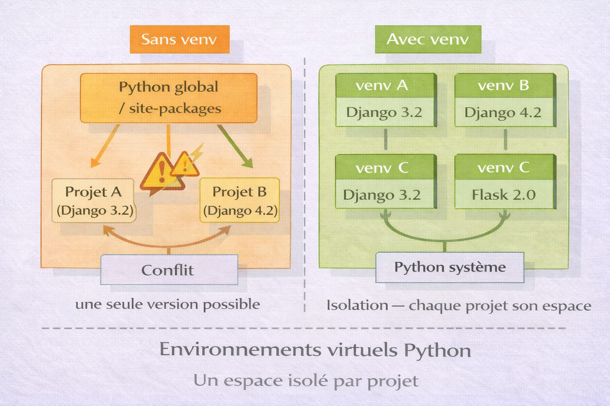
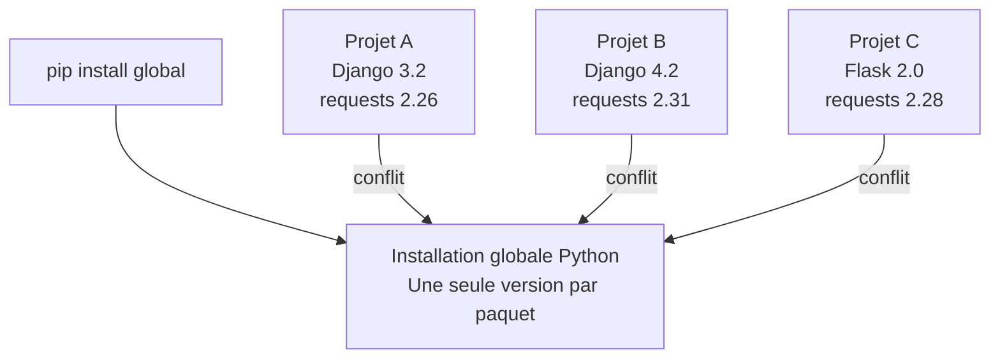
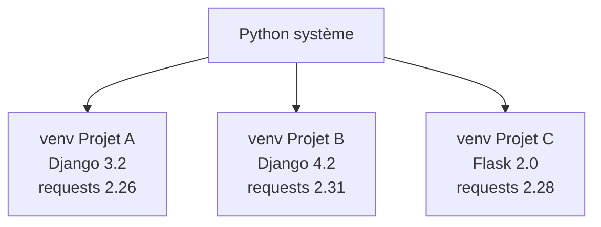
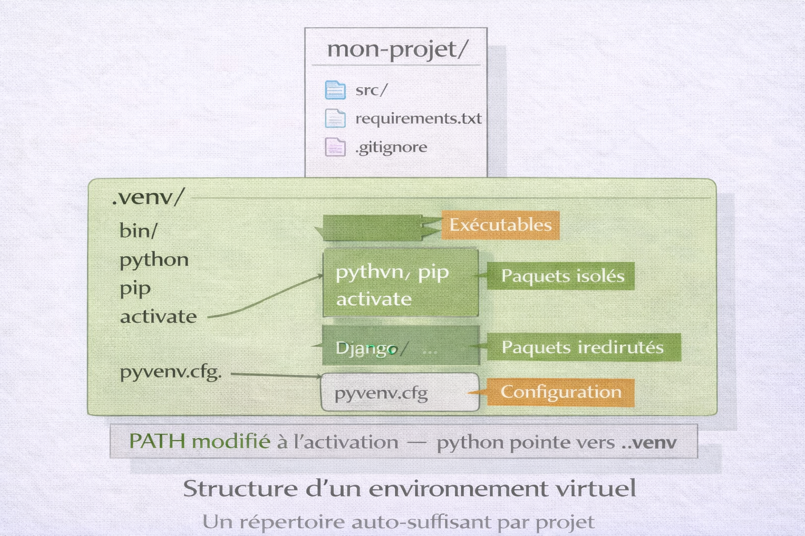
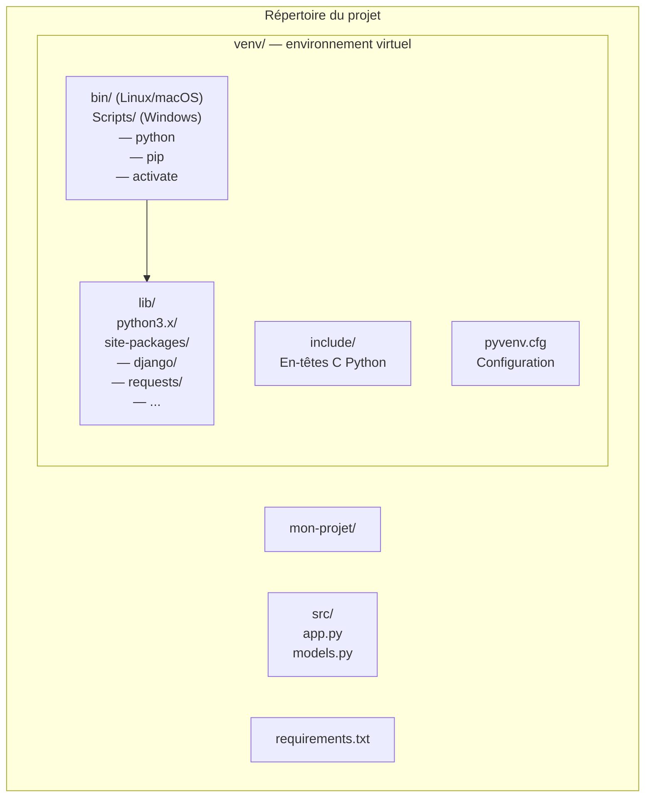
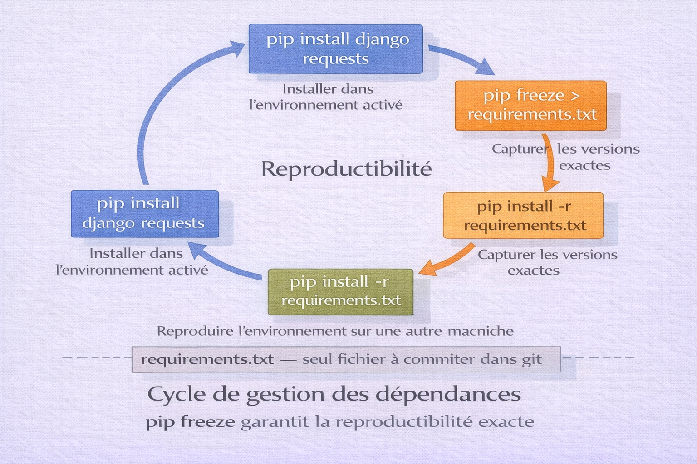

# Python — Environnements Virtuels (venv)

<div
  class="omny-meta"
  data-level="🟢 Débutant & 🟡 Intermédiaire"
  data-version="1.0"
  data-time="40-50 minutes">
</div>

!!! quote "Analogie"
    _Un laboratoire pharmaceutique dispose de plusieurs chercheurs. Chacun travaille sur une molécule différente qui nécessite des réactifs spécifiques, des températures précises et des équipements dédiés. Partager un seul espace de travail commun serait catastrophique — les réactifs se contamineraient mutuellement. Chaque chercheur dispose donc d'un laboratoire isolé, avec son propre inventaire, sans interférence avec les autres. Un environnement virtuel Python fonctionne exactement ainsi : un espace isolé par projet, avec ses propres paquets et ses propres versions, totalement indépendant du reste du système._

**venv** est le module standard Python, intégré depuis Python 3.3, qui permet de créer des **environnements virtuels isolés**. Chaque environnement dispose de son propre interpréteur Python, de ses propres paquets installés via pip, et de son propre espace de configuration — sans interférer avec les autres projets ni avec l'installation Python du système.

Sans isolation, tous les projets Python partagent le même espace d'installation global. Cela crée inévitablement des conflits de versions : un projet nécessite Django 3.2, un autre exige Django 4.2 — il est impossible de satisfaire les deux simultanément. venv résout ce problème structurellement.

!!! info "Pourquoi c'est important"
    Tout projet Python sérieux utilise un environnement virtuel. C'est une pratique non négociable en développement professionnel — les frameworks (Django, Flask, FastAPI), les outils de data science (NumPy, Pandas, TensorFlow) et les pipelines CI/CD en dépendent tous.

<br />

---

## Pourquoi isoler les dépendances

### Le problème sans environnement virtuel

!!! note "L'image ci-dessous illustre ce qui se passe sans isolation. Le conflit de versions entre projets est la cause la plus fréquente d'environnements Python corrompus et de bugs difficiles à reproduire."



<p><em>Sans environnement virtuel, pip installe tous les paquets dans un seul répertoire global sur le système. Deux projets nécessitant des versions différentes d'un même paquet ne peuvent pas coexister — le dernier installé écrase le précédent. L'environnement global devient progressivement incohérent et impossible à reproduire.</em></p>



**Conséquences concrètes sans isolation :** un paquet mis à jour pour un projet casse un autre projet, les versions installées sur la machine de développement diffèrent de la production, le fichier `requirements.txt` contient des paquets qui n'appartiennent pas au projet, les pipelines CI/CD échouent par manque de reproductibilité.

### La solution — un environnement par projet



Chaque projet possède son propre environnement isolé avec exactement les versions dont il a besoin. Les environnements ne s'interfèrent jamais.

<br />

---

## Architecture d'un environnement virtuel

!!! note "L'image ci-dessous montre la structure interne d'un environnement virtuel créé par venv. Comprendre cette structure explique pourquoi l'activation modifie le PATH et comment Python résout les imports dans un environnement activé."



<p><em>venv crée un répertoire auto-suffisant qui contient une copie ou un lien symbolique vers l'interpréteur Python, un pip propre à l'environnement, et un répertoire site-packages isolé. À l'activation, les variables PATH et VIRTUAL_ENV sont modifiées pour pointer vers cet environnement — toute commande python ou pip opère alors dans l'espace isolé.</em></p>



**Contenu de `pyvenv.cfg` :**

```ini title="INI — pyvenv.cfg généré automatiquement par venv"
home = /usr/bin                  # Répertoire Python source
include-system-site-packages = false  # Isolation du système (recommandé)
version = 3.12.3                 # Version Python utilisée
```

**Mécanisme d'isolation :** quand l'environnement est activé, le shell ajoute `venv/bin/` en tête du `PATH`. La commande `python` pointe alors vers l'interpréteur de l'environnement, et cet interpréteur cherche ses modules dans `venv/lib/python3.x/site-packages/` — pas dans les packages système.

<br />

---

## Prérequis

venv est inclus dans Python 3.3+ et ne nécessite aucune installation supplémentaire. Il est disponible comme module standard.

```bash title="Bash — vérifier Python et la disponibilité de venv"
# Vérifier la version Python
python3 --version
# Python 3.12.3

# Vérifier que venv est disponible
python3 -m venv --help

# Sur Ubuntu/Debian, venv peut nécessiter un paquet séparé
sudo apt install python3-venv
```

!!! warning "Debian et Ubuntu"
    Sur Debian et Ubuntu, `python3-venv` n'est pas toujours installé avec Python. Si la commande `python3 -m venv` échoue avec "ensurepip is not available", installer `python3-venv` via apt.

<br />

---

## Création et activation

### Créer un environnement virtuel

```bash title="Bash — créer un environnement virtuel"
# Se placer dans le répertoire du projet
cd ~/projects/mon-projet

# Créer l'environnement dans le sous-répertoire .venv
python3 -m venv .venv

# Créer avec une version Python spécifique
python3.11 -m venv .venv
python3.12 -m venv .venv

# Créer avec accès aux packages système (rare — cas spécifiques)
python3 -m venv .venv --system-site-packages

# Créer sans pip (environnements minimalistes)
python3 -m venv .venv --without-pip
```

!!! tip "Nommage de l'environnement"
    Le nom `.venv` (avec point) est la convention standard Python — il est reconnu automatiquement par VSCode, PyCharm et la plupart des outils. Le nom `venv` (sans point) est également courant. Éviter `env` seul qui est trop générique.

### Activer l'environnement

L'activation modifie le `PATH` du shell courant pour pointer vers l'environnement virtuel.

```bash title="Bash — activer l'environnement (Linux / macOS)"
source .venv/bin/activate

# Le prompt change pour indiquer l'environnement actif
# (.venv) user@machine:~/projects/mon-projet$
```

```powershell title="PowerShell — activer l'environnement (Windows)"
# PowerShell
.venv\Scripts\Activate.ps1

# Si erreur de politique d'exécution
Set-ExecutionPolicy -ExecutionPolicy RemoteSigned -Scope CurrentUser
.venv\Scripts\Activate.ps1

# CMD (invite de commandes)
.venv\Scripts\activate.bat
```

```bash title="Bash — activer dans WSL (Windows Subsystem for Linux)"
# Identique à Linux
source .venv/bin/activate
```

**Vérifier que l'activation a fonctionné :**

```bash title="Bash — vérifier l'environnement actif"
# Le prompt doit afficher (.venv) en préfixe
which python
# /home/user/projects/mon-projet/.venv/bin/python

python --version
# Python 3.12.3

# La variable VIRTUAL_ENV est définie
echo $VIRTUAL_ENV
# /home/user/projects/mon-projet/.venv
```

### Désactiver l'environnement

```bash title="Bash — désactiver l'environnement actif"
deactivate

# Le prompt revient à la normale
# Le PATH est restauré à son état original
```

### Supprimer un environnement

Un environnement virtuel est un simple répertoire — le supprimer suffit.

```bash title="Bash — supprimer un environnement virtuel"
# Désactiver d'abord si actif
deactivate

# Supprimer le répertoire
rm -rf .venv

# Recréer proprement si nécessaire
python3 -m venv .venv
```

<br />

---

## Gestion des dépendances

!!! note "L'image ci-dessous illustre le cycle complet de gestion des dépendances — de l'installation à la reproduction de l'environnement sur une autre machine. Ce cycle est la base de la reproductibilité en Python."



<p><em>Les dépendances s'installent avec pip dans l'environnement activé, pip freeze capture l'état exact de l'environnement dans requirements.txt, et pip install -r requirements.txt reproduit cet état identique sur n'importe quelle autre machine. Ce cycle garantit que développement, tests et production utilisent exactement les mêmes versions.</em></p>

### Installer des paquets avec pip

```bash title="Bash — installer des paquets dans l'environnement activé"
# Vérifier que l'environnement est activé
echo $VIRTUAL_ENV

# Installer un paquet
pip install requests
pip install django
pip install flask fastapi uvicorn

# Installer une version spécifique
pip install django==4.2.0
pip install requests>=2.28.0,<3.0.0

# Installer depuis un fichier requirements.txt
pip install -r requirements.txt

# Installer en mode développement (package local avec lien symbolique)
pip install -e .
```

```bash title="Bash — inspecter les paquets installés"
# Lister les paquets installés dans l'environnement actif
pip list

# Format détaillé avec versions
pip list --format=columns

# Vérifier un paquet spécifique
pip show django

# Vérifier les dépendances obsolètes
pip list --outdated
```

### Le fichier requirements.txt

`requirements.txt` est le fichier de référence qui liste les dépendances d'un projet. Il permet de reproduire l'environnement à l'identique sur n'importe quelle machine.

```bash title="Bash — générer requirements.txt depuis l'environnement actif"
# Capturer l'état exact de l'environnement (versions épinglées)
pip freeze > requirements.txt

# Vérifier le contenu
cat requirements.txt
```

```text title="Text — exemple de requirements.txt généré par pip freeze"
certifi==2024.2.2
charset-normalizer==3.3.2
django==4.2.13
idna==3.7
requests==2.31.0
urllib3==2.2.1
```

!!! warning "pip freeze capture TOUT"
    `pip freeze` liste toutes les dépendances installées, y compris les dépendances transitives (dépendances de dépendances). Le fichier peut rapidement contenir des paquets que le projet n'utilise pas directement. Voir la section "Alternatives" pour des outils gérant cette distinction.

**Formats de spécification de versions :**

```text title="Text — syntaxe des contraintes de versions dans requirements.txt"
django==4.2.0         # Version exacte — reproductibilité maximale
requests>=2.28.0      # Version minimale
flask>=2.0.0,<3.0.0   # Intervalle de versions
numpy~=1.24.0         # Compatible release — 1.24.x uniquement
pytest                # Pas de contrainte — dernière version
```

**Bonnes pratiques requirements.txt :**

```bash title="Bash — séparer dépendances de production et de développement"
# requirements.txt — dépendances production uniquement
pip freeze | grep -v "pytest\|black\|flake8" > requirements.txt

# requirements-dev.txt — dépendances développement
pip freeze > requirements-dev.txt
```

```text title="Text — requirements-dev.txt avec inclusion de requirements.txt"
# Inclure les dépendances de production
-r requirements.txt

# Dépendances développement uniquement
pytest==8.2.0
black==24.4.2
flake8==7.0.0
mypy==1.10.0
```

### Reproduire un environnement

```bash title="Bash — reproduire un environnement depuis requirements.txt"
# Cloner le projet
git clone https://github.com/user/mon-projet.git
cd mon-projet

# Créer et activer un environnement
python3 -m venv .venv
source .venv/bin/activate

# Installer toutes les dépendances
pip install -r requirements.txt

# Vérifier
pip list
```

### Mettre à jour des dépendances

```bash title="Bash — mettre à jour des paquets dans l'environnement"
# Mettre à jour un paquet spécifique
pip install --upgrade requests

# Mettre à jour pip lui-même
pip install --upgrade pip

# Mettre à jour tous les paquets (à faire avec précaution)
pip list --outdated --format=json | python3 -c "
import json, sys, subprocess
pkgs = json.load(sys.stdin)
for p in pkgs:
    subprocess.run(['pip', 'install', '--upgrade', p['name']])
"

# Après mise à jour, recapturer requirements.txt
pip freeze > requirements.txt
```

<br />

---

## Bonnes pratiques

### Structure de projet recommandée

```bash title="Bash — structure standard d'un projet Python avec venv"
# mon-projet/
# .venv/                  # Environnement virtuel — ignoré par git
# src/
#   mon_module/
#     __init__.py
#     models.py
#     services.py
# tests/
#   test_models.py
# .gitignore              # Contient .venv/
# requirements.txt        # Dépendances production
# requirements-dev.txt    # Dépendances développement
# README.md
# pyproject.toml          # Configuration du projet (optionnel)
```

### .gitignore

Le répertoire de l'environnement virtuel ne doit jamais être commité dans git — il est spécifique à chaque machine et peut contenir plusieurs centaines de fichiers.

```bash title="Bash — créer ou compléter le .gitignore"
cat >> .gitignore << 'EOF'
# Environnements virtuels Python
.venv/
venv/
env/
ENV/

# Cache Python
__pycache__/
*.py[cod]
*.pyo

# Distribution et packaging
*.egg-info/
dist/
build/
EOF
```

!!! danger "Ne jamais commiter le répertoire venv"
    Un environnement virtuel contient des exécutables et des liens absolus spécifiques à la machine. Le commiter dans git corrompt le dépôt, gonfle l'historique inutilement et ne fonctionnera pas sur une autre machine. Seul `requirements.txt` se commite.

### Automatiser l'activation

```bash title="Bash — script d'initialisation de projet"
#!/usr/bin/env bash
# setup.sh — à exécuter une fois à la récupération du projet

# Créer l'environnement si absent
if [ ! -d ".venv" ]; then
    python3 -m venv .venv
    echo "Environnement créé dans .venv/"
fi

# Activer
source .venv/bin/activate

# Installer les dépendances
pip install --upgrade pip
pip install -r requirements-dev.txt

echo "Environnement prêt. Activer avec : source .venv/bin/activate"
```

### Makefile pour les commandes courantes

```makefile title="Makefile — commandes de gestion de l'environnement"
.PHONY: venv install freeze test clean

# Créer l'environnement
venv:
	python3 -m venv .venv

# Installer les dépendances
install:
	.venv/bin/pip install --upgrade pip
	.venv/bin/pip install -r requirements-dev.txt

# Capturer les dépendances actuelles
freeze:
	.venv/bin/pip freeze > requirements.txt

# Lancer les tests
test:
	.venv/bin/pytest tests/

# Supprimer l'environnement
clean:
	rm -rf .venv __pycache__ *.egg-info
```

```bash title="Bash — utiliser le Makefile"
make venv
make install
make test
```

<br />

---

## Intégration VSCode

VSCode détecte automatiquement les environnements virtuels dans le répertoire du projet. Il suffit de sélectionner l'interpréteur.

```bash title="Bash — ouvrir VSCode dans le répertoire du projet"
# Avec l'environnement activé ou non
code .
```

**Sélectionner l'interpréteur :**

`Ctrl+Shift+P` → "Python: Select Interpreter" → choisir `.venv/bin/python`

VSCode mémorise ce choix dans `.vscode/settings.json` :

```json title="JSON — .vscode/settings.json avec interpréteur Python"
{
    "python.defaultInterpreterPath": "${workspaceFolder}/.venv/bin/python",
    "python.terminal.activateEnvironment": true,
    "python.linting.enabled": true,
    "python.formatting.provider": "black"
}
```

Avec `"python.terminal.activateEnvironment": true`, VSCode active automatiquement l'environnement dans chaque nouveau terminal intégré.

**Extensions recommandées :**

`ms-python.python` — support Python complet avec détection automatique de venv.

<br />

---

## Alternatives à venv

### Comparaison des outils de gestion d'environnements Python

| Outil | Cas d'usage | Avantages | Inconvénients |
|---|---|---|---|
| venv | Développement général | Standard Python, sans dépendances | Pas de gestion de versions Python, requirements.txt limité |
| virtualenv | venv étendu | Supporte Python 2, plus rapide | Dépendance externe |
| conda | Data science, ML | Gère Python + paquets non-Python (CUDA, etc.) | Lourd, écosystème distinct |
| poetry | Projets structurés | Gestion dépendances avancée, build, publish | Courbe d'apprentissage |
| pipenv | Pipfile + venv | requirements.txt amélioré | Moins maintenu |
| uv | Remplacement universel | Extrêmement rapide (Rust), tout-en-un | Plus récent, écosystème en développement |

### uv — le successeur rapide

uv est un gestionnaire Python écrit en Rust, développé par Astral. Il remplace pip, venv et pip-tools avec des performances nettement supérieures.

```bash title="Bash — installer uv"
# Linux / macOS
curl -LsSf https://astral.sh/uv/install.sh | sh

# Windows (PowerShell)
powershell -ExecutionPolicy ByPass -c "irm https://astral.sh/uv/install.ps1 | iex"

# Via pip
pip install uv
```

```bash title="Bash — utiliser uv (syntaxe proche de venv + pip)"
# Créer un environnement
uv venv .venv

# Activer (identique à venv)
source .venv/bin/activate

# Installer des paquets — beaucoup plus rapide que pip
uv pip install django requests

# Générer requirements.txt
uv pip freeze > requirements.txt

# Installer depuis requirements.txt
uv pip install -r requirements.txt
```

uv est 10 à 100 fois plus rapide que pip pour l'installation de paquets grâce à la résolution parallèle et au cache agressif.

### poetry — gestion de projet complète

```bash title="Bash — installer poetry"
curl -sSL https://install.python-poetry.org | python3 -
```

```bash title="Bash — utiliser poetry"
# Initialiser un projet
poetry new mon-projet
cd mon-projet

# Ajouter une dépendance
poetry add django
poetry add pytest --group dev

# Activer l'environnement
poetry shell

# Installer les dépendances
poetry install

# Exporter vers requirements.txt
poetry export -f requirements.txt --output requirements.txt
```

poetry gère la distinction entre dépendances directes et transitives dans `pyproject.toml`, et génère un fichier `poetry.lock` pour la reproductibilité exacte.

### conda — data science et ML

```bash title="Bash — gérer des environnements avec conda"
# Créer un environnement avec une version Python spécifique
conda create -n mon-projet python=3.12

# Activer
conda activate mon-projet

# Installer des paquets (y compris paquets non-Python comme CUDA)
conda install numpy pandas scikit-learn
conda install pytorch torchvision -c pytorch

# Exporter l'environnement
conda env export > environment.yml

# Reproduire depuis environment.yml
conda env create -f environment.yml
```

conda est l'outil de référence pour les projets de data science et machine learning car il gère les dépendances non-Python (librairies C, CUDA, MKL).

<br />

---

## Dépannage

### "python3 -m venv" échoue

```bash title="Bash — résoudre l'erreur ensurepip not available"
# Sur Ubuntu / Debian
sudo apt install python3-venv python3-pip

# Vérifier la version Python
python3 --version

# Créer sans pip si l'erreur persiste
python3 -m venv .venv --without-pip

# Puis installer pip manuellement
curl https://bootstrap.pypa.io/get-pip.py -o get-pip.py
.venv/bin/python get-pip.py
rm get-pip.py
```

### ModuleNotFoundError après activation

```bash title="Bash — diagnostiquer un module manquant"
# Vérifier que l'environnement est bien activé
echo $VIRTUAL_ENV
which python

# Vérifier que le paquet est installé dans l'environnement actif
pip show nom-du-paquet

# Réinstaller si absent
pip install nom-du-paquet

# Si le module est installé mais introuvable — vérifier le bon interpréteur
python -c "import sys; print(sys.executable)"
```

### L'environnement ne s'active pas sous Windows (PowerShell)

```powershell title="PowerShell — corriger la politique d'exécution"
# Vérifier la politique actuelle
Get-ExecutionPolicy

# Autoriser les scripts locaux
Set-ExecutionPolicy -ExecutionPolicy RemoteSigned -Scope CurrentUser

# Activer l'environnement
.venv\Scripts\Activate.ps1

# Vérifier
$env:VIRTUAL_ENV
```

### pip install échoue (SSL ou réseau)

```bash title="Bash — contourner les problèmes SSL ou réseau"
# Mettre pip à jour en premier
pip install --upgrade pip

# Utiliser un miroir alternatif (entreprise ou région)
pip install django --index-url https://pypi.org/simple/

# Désactiver la vérification SSL (développement uniquement)
pip install django --trusted-host pypi.org --trusted-host files.pythonhosted.org
```

### Conflit de versions entre paquets

```bash title="Bash — diagnostiquer et résoudre les conflits"
# Identifier les conflits
pip check

# Résultat exemple :
# requests 2.31.0 has requirement urllib3<3,>=1.21.1, but urllib3 3.0.0 is installed

# Forcer une version compatible
pip install "urllib3>=1.21.1,<3"

# En dernier recours, recréer l'environnement proprement
deactivate
rm -rf .venv
python3 -m venv .venv
source .venv/bin/activate
pip install -r requirements.txt
```

### Environnement corrompu après déplacement du projet

```bash title="Bash — recréer l'environnement après déplacement"
# Un environnement virtuel contient des chemins absolus
# Le déplacer ou renommer le répertoire du projet le corrompt

# Solution — recréer depuis requirements.txt
deactivate
rm -rf .venv
python3 -m venv .venv
source .venv/bin/activate
pip install -r requirements.txt
```

!!! warning "Un environnement virtuel n'est pas portable"
    Ne pas copier ou déplacer un répertoire `.venv` — il contient des chemins absolus vers l'interpréteur Python de la machine d'origine. Toujours recréer l'environnement depuis `requirements.txt` sur la machine cible.

<br />

---

## Conclusion

!!! quote "Ce qu'il faut retenir"
    L'outil venv est un compagnon quotidien dans la vie d'un professionnel de l'IT. Sa maîtrise ne s'acquiert pas en le lisant, mais par une pratique constante. Automatisez au maximum son utilisation pour qu'il devienne une seconde nature.

!!! quote "Conclusion"
    _L'environnement virtuel est la première décision à prendre avant d'écrire la moindre ligne de code Python. Ce n'est pas une option avancée réservée aux projets complexes — c'est la pratique de base qui évite des heures de débogage liées à des conflits de versions. venv est inclus dans Python, sans installation supplémentaire, et suffit pour la grande majorité des projets. Le fichier requirements.txt est l'artefact central : il matérialise les dépendances du projet, garantit la reproductibilité et documente l'environnement. Commiter requirements.txt, ignorer .venv, activer l'environnement avant toute commande pip — ces trois réflexes suffisent à maintenir un environnement Python propre et reproductible._

<br />