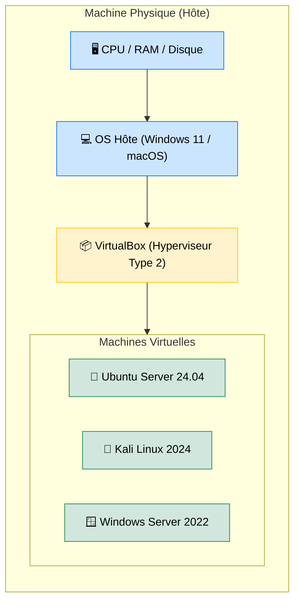

# VirtualBox — Votre Laboratoire Virtuel

<div
  class="omny-meta"
  data-level="🟢 Débutant"
  data-version="7.x"
  data-time="~20 minutes">
</div>

## Introduction

!!! quote "Analogie pédagogique — La Chambre des Maquettes"
    Imaginez une chambre de collectionneur de maquettes. Sur la même table (votre ordinateur physique), il peut construire une maquette de château médiéval, une fusée Saturn V et un sous-marin — chacune complètement indépendante, sans qu'elles interfèrent. Si une maquette s'effondre, les autres restent intactes.

    **VirtualBox** fait la même chose avec des systèmes d'exploitation : sur votre Windows 11 ou macOS, vous faites tourner simultanément un Ubuntu Server, un Kali Linux et un Windows Server — chacun dans sa propre fenêtre, sans risque pour votre machine principale.

VirtualBox est un **hyperviseur de type 2** (hosted) : il s'exécute par-dessus votre système d'exploitation existant, contrairement aux hyperviseurs de type 1 (VMware ESXi, Proxmox) qui remplacent l'OS du serveur. C'est la solution idéale pour le développement, les labs de cybersécurité et l'apprentissage.

<br>

---

## Architecture et Concepts



_Chaque VM possède son propre CPU virtuel, sa propre RAM allouée, son propre disque (un fichier `.vdi` sur votre disque physique) et ses propres interfaces réseau. Elles sont **complètement isolées** les unes des autres._

<br>

---

## Création d'une Machine Virtuelle

### 1. Télécharger et installer

Téléchargez VirtualBox depuis [virtualbox.org](https://www.virtualbox.org) et l'ISO de la distribution cible (ex: Ubuntu Server 24.04 LTS).

### 2. Créer une nouvelle VM

```
VirtualBox > Nouvelle > Paramètres recommandés par type :
```

| Paramètre | Linux Server | Kali Linux | Windows Server |
|---|---|---|---|
| **RAM** | 2 Go minimum | 4 Go | 4 Go |
| **CPU** | 2 vCPU | 2 vCPU | 2 vCPU |
| **Disque** | 20 Go (VDI dynamique) | 50 Go | 60 Go |
| **Réseau** | NAT ou Bridge | NAT | NAT ou Host-Only |

### 3. Modes réseau — Le Point le Plus Important

| Mode | Accès Internet | Accès Hôte→VM | Accès VM→VM | Usage typique |
|---|---|---|---|---|
| **NAT** | ✅ Oui | ❌ Non (par défaut) | ❌ Non | Navigation web depuis la VM |
| **Bridge** | ✅ Oui | ✅ Oui | ✅ Oui | La VM se comporte comme un PC du réseau local |
| **Host-Only** | ❌ Non | ✅ Oui | ✅ Oui | Réseau isolé entre VM et hôte (labs cyber) |
| **Internal** | ❌ Non | ❌ Non | ✅ Oui | Réseau isolé entre VMs uniquement |

!!! warning "Choix du mode réseau en cybersécurité"
    Pour les labs de hacking (Kali vs machines cibles), utilisez **Host-Only** ou **Internal Network** pour isoler complètement votre laboratoire du réseau de production. Ne jamais mettre une VM Kali en mode Bridge sur votre réseau d'entreprise.

<br>

---

## Les Snapshots — Votre Filet de Sécurité

Un **snapshot** est un état figé de la VM à un instant T. Vous pouvez revenir à cet état en un clic, même après avoir détruit le système d'exploitation à l'intérieur.

```bash title="Workflow recommandé avec snapshots"
# 1. Installer la VM proprement (OS + mises à jour)
# 2. Prendre un snapshot "OS propre - base"
# 3. Installer vos outils / faire vos expériences
# 4. Si quelque chose se casse : Restaurer le snapshot
# 5. Reprendre à partir d'un état stable
```

!!! tip "Bonne pratique"
    Prenez toujours un snapshot **avant** d'installer un logiciel douteux, de tester une configuration système, ou de commencer un lab de sécurité. Le coût en espace disque est faible, le bénéfice en temps gagné est énorme.

<br>

---

## Conclusion

!!! quote "Ce qu'il faut retenir"
    VirtualBox est le meilleur ami du développeur et de l'étudiant en cybersécurité. Il offre un environnement de lab **gratuit, flexible et réversible** : les snapshots garantissent que vous ne pouvez jamais casser définitivement quoi que ce soit. Maîtriser les modes réseau (NAT, Bridge, Host-Only) est la compétence clé pour construire des labs réalistes et sécurisés.

> [VBoxManage — Contrôler VirtualBox depuis la ligne de commande →](./vboxmanage.md)