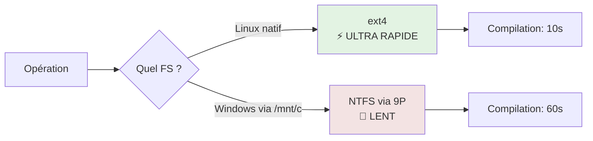
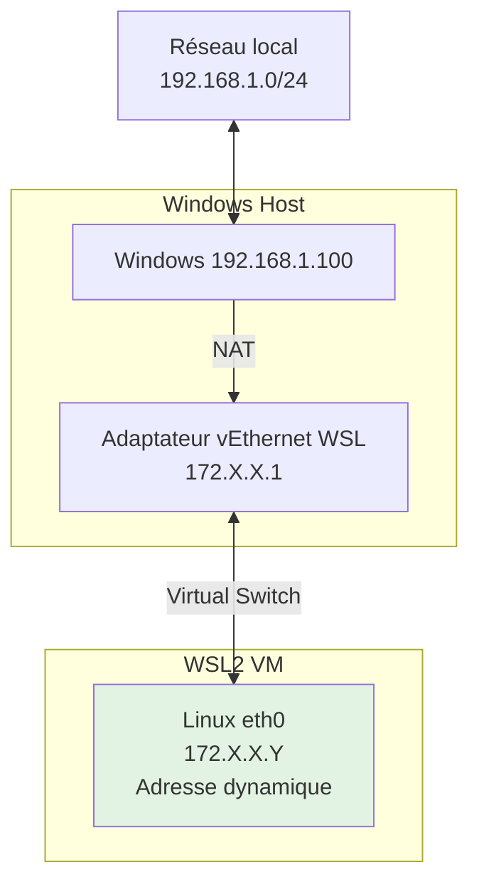

# WSL - Windows Subsystem for Linux

## Introduction

**Niveau :** Débutant & Intermédiaire

!!! quote "Analogie pédagogique"
    _Imaginez que vous habitez dans un immeuble (Windows) et que vous souhaitez avoir un jardin japonais authentique. Plutôt que de déménager au Japon (dual-boot) ou de construire une serre séparée dans votre appartement (machine virtuelle lourde), vous créez un **espace intégré directement dans votre salon** qui reproduit fidèlement l'environnement japonais tout en partageant l'électricité et le chauffage de votre appartement. **WSL fonctionne exactement ainsi** : il vous donne un Linux complet et performant directement intégré dans Windows, partageant les ressources système sans la lourdeur d'une virtualisation traditionnelle._

> **WSL (Windows Subsystem for Linux)** est une **couche de compatibilité** développée par Microsoft qui permet d'exécuter un **environnement Linux authentique directement sous Windows 10/11**, sans les contraintes d'une machine virtuelle traditionnelle ou d'un dual-boot. WSL2, la version actuelle, utilise un **véritable noyau Linux** optimisé par Microsoft pour offrir une **compatibilité quasi-totale** avec les applications et outils Linux.

WSL révolutionne le développement sous Windows en permettant aux développeurs d'utiliser **nativement** les outils, scripts et workflows Linux tout en conservant l'écosystème Windows (Office, Visual Studio, etc.). Cette intégration transparente élimine les frictions entre ces deux mondes historiquement séparés.

!!! info "Pourquoi c'est important ?"
    WSL permet le **développement web/cloud moderne**, l'**utilisation d'outils DevOps**, l'**exécution de conteneurs Docker**, le **scripting Bash**, l'**apprentissage Linux** sans quitter Windows, et l'**accès aux outils de cybersécurité Linux**. C'est devenu l'environnement de référence pour les développeurs sous Windows.

## Pour repartir des bases (vrais débutants)

Si vous débutez complètement, sachez que **Linux** est un système d'exploitation (comme Windows) largement utilisé pour les **serveurs**, le **développement** et la **cybersécurité**. WSL vous permet d'utiliser Linux **sans installer un système séparé**, directement depuis votre Windows. Aucune connaissance Linux préalable n'est requise - ce chapitre vous guidera pas à pas.

!!! tip "Pensez intégration plutôt que séparation !"
    WSL n'est **pas** une machine virtuelle isolée. C'est une **intégration profonde** où Windows et Linux partagent ressources, fichiers et réseau. Vous pouvez éditer des fichiers Linux avec VSCode Windows, lancer des commandes Windows depuis Linux, et vice-versa.

## WSL1 vs WSL2 : Évolution architecturale

Microsoft a développé **deux versions** de WSL avec des architectures radicalement différentes.

### Architecture WSL1


**Fonctionnement WSL1 :**
- **Traduction d'appels système** : Convertit syscalls Linux en syscalls Windows
- **Pas de véritable kernel Linux** : Émulation au niveau API
- **Léger** : Démarrage instantané, faible consommation RAM
- **Limites** : Compatibilité incomplète (pas de Docker natif, problèmes I/O)

### Architecture WSL2


**Fonctionnement WSL2 :**
- **Véritable noyau Linux** : Kernel maintenu par Microsoft
- **Compatibilité totale** : Tous les appels système Linux fonctionnent
- **Virtualisation légère** : Hyper-V optimisé avec démarrage rapide
- **Performances** : I/O Linux nativement rapide, Docker natif

### Comparaison détaillée

| Critère | WSL1 | WSL2 | Recommandation |
|---------|------|------|----------------|
| **Compatibilité** | ~80% | ~100% | ✅ WSL2 |
| **Performances I/O Linux** | Lentes | ✅ Natives | ✅ WSL2 |
| **Performances I/O Windows** | ✅ Rapides | Plus lentes | WSL1 si accès intensif /mnt/c |
| **Démarrage** | Instantané | ~2 secondes | WSL1 marginal |
| **RAM** | Faible | Moyenne | WSL1 si RAM limitée |
| **Docker** | ❌ Non natif | ✅ Natif | ✅ WSL2 |
| **Systemd** | ❌ Non | ✅ Oui (depuis 2022) | ✅ WSL2 |
| **Kernel modules** | ❌ Non | ✅ Oui | ✅ WSL2 |
| **Networking** | ✅ Bridge | NAT (plus complexe) | WSL1 si besoin réseau simple |

!!! success "Recommandation générale"
    **Utilisez WSL2** sauf cas spécifiques (accès intensif aux fichiers Windows, RAM très limitée <4GB). WSL2 est le standard moderne et sera le seul maintenu à long terme.

## Installation de WSL

### Prérequis système

**Configuration minimale :**
- Windows 10 version 2004+ (Build 19041+) ou Windows 11
- Architecture 64-bit (x64 ou ARM64)
- Virtualisation activée dans le BIOS/UEFI
- 4 GB RAM minimum (8 GB recommandé)
- 20 GB d'espace disque disponible

**Vérifier la version Windows :**
```powershell
# Dans PowerShell
winver

# Ou
[System.Environment]::OSVersion.Version
```

**Vérifier si virtualisation activée :**
```powershell
# Gestionnaire des tâches → Performance → CPU
# "Virtualisation" doit être "Activé"

# Ou en PowerShell
Get-ComputerInfo | Select-Object HyperVisorPresent, HyperVRequirementVirtualizationFirmwareEnabled
```

### Installation moderne (Windows 10 2004+ / Windows 11)

**Méthode 1 : Installation automatique (Recommandée)**
```powershell
# Ouvrir PowerShell en Administrateur
# Installer WSL avec distribution par défaut (Ubuntu)
wsl --install

# Choisir une distribution spécifique
wsl --install -d Ubuntu-24.04
wsl --install -d Debian
```

Cette commande effectue **automatiquement** :
1. Active les fonctionnalités Windows nécessaires
2. Télécharge le kernel Linux WSL2
3. Définit WSL2 comme version par défaut
4. Installe la distribution choisie (Ubuntu par défaut)

**Redémarrage requis** après l'installation.

**Méthode 2 : Installation manuelle**
```powershell
# 1. Activer WSL
dism.exe /online /enable-feature /featurename:Microsoft-Windows-Subsystem-Linux /all /norestart

# 2. Activer la plateforme de machine virtuelle
dism.exe /online /enable-feature /featurename:VirtualMachinePlatform /all /norestart

# 3. Redémarrer Windows

# 4. Télécharger et installer le package kernel WSL2
# https://aka.ms/wsl2kernel

# 5. Définir WSL2 par défaut
wsl --set-default-version 2

# 6. Installer une distribution depuis Microsoft Store
# Ou télécharger manuellement et installer
```

### Distributions disponibles

**Voir les distributions disponibles :**
```powershell
wsl --list --online
# ou
wsl -l -o
```

**Distributions officielles Microsoft Store :**

| Distribution | Version | Usage recommandé |
|--------------|---------|------------------|
| **Ubuntu** | 24.04 LTS | Développement général, débutants |
| **Ubuntu** | 22.04 LTS | Stabilité maximale |
| **Debian** | 12 (Bookworm) | Serveurs, stabilité |
| **Kali Linux** | Rolling | Cybersécurité, pentesting |
| **Alpine** | 3.19 | Conteneurs légers, minimale |
| **openSUSE** | Leap/Tumbleweed | Développement entreprise |
| **Fedora** | Latest | Technologies récentes, Red Hat |
| **Arch Linux** | Rolling | Utilisateurs avancés, bleeding edge |
| **Oracle Linux** | 8/9 | Entreprise, compatibilité RHEL |

**Installer une distribution :**
```powershell
# Depuis Microsoft Store (GUI)
# ou via CLI
wsl --install -d Debian

# Installer plusieurs distributions
wsl --install -d Ubuntu-24.04
wsl --install -d Kali-Linux
```

### Première configuration

Au **premier lancement**, WSL demande :
```bash
# Création utilisateur Unix
Enter new UNIX username: alice
New password: ********
Retype new password: ********

# Installation complète automatique (quelques minutes)
```

**Important :** Cet utilisateur est **différent** de votre utilisateur Windows et aura les droits `sudo` dans Linux.

## Gestion des distributions WSL

### Commandes essentielles
```powershell
# Lister distributions installées
wsl --list --verbose
wsl -l -v

# Résultat exemple :
#   NAME            STATE           VERSION
# * Ubuntu-24.04    Running         2
#   Debian          Stopped         2
#   Kali-Linux      Stopped         2

# Lancer une distribution
wsl -d Ubuntu-24.04
wsl -d Debian

# Lancer distribution par défaut
wsl

# Définir distribution par défaut
wsl --set-default Ubuntu-24.04

# Arrêter une distribution
wsl --terminate Ubuntu-24.04
wsl -t Debian

# Arrêter toutes les distributions
wsl --shutdown

# Démarrer en tant qu'utilisateur spécifique
wsl -u root
wsl -d Debian -u alice

# Exécuter une commande sans shell interactif
wsl ls -la
wsl -d Debian cat /etc/os-release
```

### Conversion WSL1 ↔ WSL2
```powershell
# Convertir une distribution de WSL1 vers WSL2
wsl --set-version Ubuntu-24.04 2

# Convertir de WSL2 vers WSL1 (rare)
wsl --set-version Ubuntu-24.04 1

# Définir version par défaut pour nouvelles installations
wsl --set-default-version 2
```

### Import/Export de distributions
```powershell
# Exporter une distribution (backup)
wsl --export Ubuntu-24.04 D:\Backups\ubuntu-backup.tar

# Importer une distribution
wsl --import Ubuntu-Restored D:\WSL\Ubuntu D:\Backups\ubuntu-backup.tar

# Désinstaller (supprimer) une distribution
wsl --unregister Ubuntu-24.04
# ⚠️ Supprime TOUTES les données de cette distribution !
```

### Cloner une distribution
```powershell
# Export de la distribution source
wsl --export Ubuntu-24.04 D:\temp\ubuntu-source.tar

# Import avec nouveau nom
wsl --import Ubuntu-Dev D:\WSL\Ubuntu-Dev D:\temp\ubuntu-source.tar

# Définir utilisateur par défaut pour le clone
ubuntu-dev config --default-user alice

# Nettoyer le fichier temporaire
del D:\temp\ubuntu-source.tar
```

## Configuration WSL

### Fichier .wslconfig (Global)

Configure **toutes les distributions WSL2** sur la machine.

**Emplacement :** `C:\Users\<VotreNom>\.wslconfig`
```ini
[wsl2]
# Mémoire maximum allouée à WSL2
memory=8GB

# Nombre de processeurs virtuels
processors=4

# Taille du swap
swap=4GB

# Fichier swap (par défaut %USERPROFILE%\AppData\Local\Temp\swap.vhdx)
swapFile=D:\\WSL\\swap.vhdx

# Localisation du kernel Linux personnalisé (optionnel)
# kernel=C:\\custom-kernel\\bzImage

# Arguments supplémentaires pour le kernel
kernelCommandLine=

# Activer localhost forwarding (ports Linux accessibles via localhost Windows)
localhostForwarding=true

# Mode réseau (NAT par défaut, ou mirrored/bridged en experimental)
# networkingMode=NAT

# Activer nested virtualization (VM dans WSL)
nestedVirtualization=true

# Activer GUI Linux (WSLg)
guiApplications=true

# Temps avant hibernation automatique (0 = désactiver)
autoMemoryReclaim=gradual

# Niveau debug
debugConsole=false
```

**Appliquer les modifications :**
```powershell
# Redémarrer toutes les distributions WSL
wsl --shutdown
```

### Fichier wsl.conf (Par distribution)

Configure une **distribution spécifique**.

**Emplacement :** `/etc/wsl.conf` (dans chaque distribution Linux)
```ini
[automount]
# Monter automatiquement les lecteurs Windows
enabled=true

# Point de montage (par défaut /mnt)
root=/mnt/

# Options de montage
options="metadata,umask=22,fmask=11"

# Monter les lecteurs amovibles
mountFsTab=true

[network]
# Générer /etc/hosts automatiquement
generateHosts=true

# Générer /etc/resolv.conf automatiquement
generateResolvConf=true

# Nom d'hôte
hostname=wsl-machine

[interop]
# Autoriser lancement de .exe Windows depuis Linux
enabled=true

# Ajouter PATH Windows au PATH Linux
appendWindowsPath=true

[boot]
# Commande à exécuter au démarrage (WSL2 uniquement)
# command="service docker start"

# Activer systemd (WSL2 2022+)
systemd=true

[user]
# Utilisateur par défaut
default=alice
```

**Éditer le fichier :**
```bash
# Dans WSL
sudo nano /etc/wsl.conf

# Redémarrer la distribution pour appliquer
# Depuis PowerShell Windows
wsl --terminate Ubuntu-24.04
```

### Activer systemd

Systemd permet d'utiliser `systemctl`, Docker natif, et les services Linux modernes.
```bash
# Éditer /etc/wsl.conf
sudo nano /etc/wsl.conf

# Ajouter
[boot]
systemd=true

# Sauvegarder et quitter (Ctrl+O, Ctrl+X)
```
```powershell
# Redémarrer WSL depuis Windows
wsl --shutdown
wsl

# Vérifier systemd dans WSL
systemctl --version
systemctl status
```

## Système de fichiers

### Architecture des systèmes de fichiers
```mermaid
graph TB
    subgraph "Windows C:"
        A[C:\Users\Alice\]
        B[C:\Program Files\]
        C[D:\Projects\]
    end
    
    subgraph "WSL Linux"
        D[/home/alice/<br/>Système natif Linux]
        E[/mnt/c/<br/>Lecteur C: Windows]
        F[/mnt/d/<br/>Lecteur D: Windows]
    end
    
    A --> E
    C --> F
    
    style D fill:#e3f3e3
    style E fill:#f3e3e3
    style F fill:#f3e3e3
```

### Accès fichiers Linux depuis Windows

**Méthode 1 : Explorateur Windows** (Recommandé)
```powershell
# Dans la barre d'adresse de l'Explorateur
\\wsl$\Ubuntu-24.04\home\alice

# Ou
\\wsl.localhost\Ubuntu-24.04\home\alice

# Créer un raccourci réseau
# Clic droit → Mapper un lecteur réseau
```

**Méthode 2 : Ouvrir depuis WSL**
```bash
# Ouvrir l'Explorateur Windows au répertoire courant
explorer.exe .

# Ouvrir un fichier avec application Windows
notepad.exe fichier.txt
code fichier.py  # VSCode
```

**Emplacement physique** (pour référence, ne PAS modifier directement) :
```
C:\Users\<VotreNom>\AppData\Local\Packages\
  CanonicalGroupLimited.Ubuntu24.04LTS_...\LocalState\ext4.vhdx
```

### Accès fichiers Windows depuis Linux

Les **lecteurs Windows** sont montés automatiquement dans `/mnt/` :
```bash
# Accéder au lecteur C:
cd /mnt/c/Users/Alice/Documents

# Accéder au lecteur D:
cd /mnt/d/Projects

# Lister tous les montages Windows
ls -la /mnt/
```

### Performances des systèmes de fichiers


**Règles d'or :**

!!! success "Fichiers Linux dans système Linux"
    **Stockez vos projets dans `/home/alice/projects/`** pour performances maximales.
```bash
    # BON
    ~/projects/monapp/
    
    # MAUVAIS (très lent)
    /mnt/c/Users/Alice/projects/monapp/
```

!!! warning "Ne jamais modifier fichiers Linux depuis Windows"
    **Ne modifiez JAMAIS** les fichiers dans `\\wsl$\` avec des outils Windows en dehors de VSCode/IntelliJ qui gèrent correctement WSL. Risque de **corruption**.

**Cas d'usage :**

| Scénario | Où stocker | Raison |
|----------|------------|--------|
| Projet Node.js/Python/Go | `~/projects/` | npm/pip/go ultra rapide |
| Site web PHP | `~/www/` | Performances serveur max |
| Configuration dotfiles | `~/` | Natif Linux |
| Documents Word/Excel | `/mnt/c/Users/Alice/Documents/` | Édition Windows native |
| Code partagé Windows/Linux | `/mnt/c/SharedCode/` + git | Compromis acceptable |

### Permissions et métadonnées

Par défaut, les fichiers Windows montés ont des permissions fixes. Activer les métadonnées :
```bash
# Éditer /etc/wsl.conf
sudo nano /etc/wsl.conf

[automount]
options="metadata,umask=22,fmask=11"
```
```powershell
# Redémarrer WSL
wsl --shutdown
```

Désormais, `chmod` et `chown` fonctionnent sur `/mnt/c/`.

## Réseau et connectivité

### Architecture réseau WSL2


**Caractéristiques :**
- WSL2 obtient une **IP dynamique** dans un sous-réseau privé (172.X.X.0/20)
- **NAT** : Linux sort via Windows
- **Localhost forwarding** : `localhost` Windows → WSL et vice-versa

### Accès réseau

#### Depuis Linux → Windows
```bash
# Les services Windows sont accessibles via localhost
curl http://localhost:8080

# Ou via IP de l'hôte Windows
# Récupérer IP Windows depuis Linux
ip route show | grep -i default | awk '{ print $3}'

# Exemple
curl http://172.29.96.1:8080
```

#### Depuis Windows → Linux

**Via localhost (automatique) :**
```powershell
# Service Linux sur port 3000
# Accessible depuis Windows
http://localhost:3000

# Ou
http://127.0.0.1:3000
```

**Vérifier le forwarding :**
```powershell
# Doit afficher "true"
wsl cat /etc/wsl.conf | grep localhostForwarding
```

#### Depuis réseau externe → WSL

Les **ports WSL ne sont PAS exposés automatiquement** au réseau local.

**Solution 1 : Port forwarding Windows**
```powershell
# PowerShell en Administrateur
# Transférer port 3000 Windows → WSL
netsh interface portproxy add v4tov4 `
  listenport=3000 `
  listenaddress=0.0.0.0 `
  connectport=3000 `
  connectaddress=$(wsl hostname -I)

# Lister les forwardings
netsh interface portproxy show all

# Supprimer un forwarding
netsh interface portproxy delete v4tov4 listenport=3000 listenaddress=0.0.0.0
```

**Solution 2 : Script automatique**
```powershell
# Script à exécuter à chaque démarrage WSL
$wsl_ip = (wsl hostname -I).Trim()
$ports = @(3000, 8080, 5432)

foreach ($port in $ports) {
    netsh interface portproxy delete v4tov4 listenport=$port listenaddress=0.0.0.0
    netsh interface portproxy add v4tov4 listenport=$port listenaddress=0.0.0.0 connectport=$port connectaddress=$wsl_ip
}

# Autoriser dans le pare-feu Windows
New-NetFirewallRule -DisplayName "WSL Ports" -Direction Inbound -LocalPort $ports -Protocol TCP -Action Allow
```

### DNS et résolution de noms

**Configuration automatique :**
```bash
# WSL génère /etc/resolv.conf automatiquement
cat /etc/resolv.conf

# Désactiver la génération automatique si besoin
sudo nano /etc/wsl.conf
[network]
generateResolvConf=false

# Configurer DNS manuellement
sudo nano /etc/resolv.conf
nameserver 8.8.8.8
nameserver 1.1.1.1

# Protéger contre réinitialisation
sudo chattr +i /etc/resolv.conf
```

### VPN et WSL

**Problème courant :** VPN Windows peut bloquer connectivité WSL.

**Solution 1 : Routage manuel**
```bash
# Ajouter route vers VPN
sudo ip route add 10.0.0.0/8 via $(ip route | grep default | awk '{print $3}')
```

**Solution 2 : DNS du VPN**
```bash
# Utiliser DNS de l'entreprise
sudo nano /etc/resolv.conf
nameserver 10.10.10.10  # DNS VPN
```

**Solution 3 : Cisco AnyConnect / OpenVPN**
```bash
# Installer client VPN dans WSL directement
sudo apt install openconnect  # Pour Cisco
# Connexion depuis Linux
sudo openconnect vpn.company.com
```

## Intégration Windows ↔ Linux

### Lancer applications Windows depuis Linux
```bash
# Exécuter n'importe quel .exe Windows
notepad.exe
explorer.exe
code.exe

# Passer arguments
notepad.exe fichier.txt
explorer.exe .  # Ouvre répertoire courant dans Explorateur

# Ouvrir URL dans navigateur Windows
cmd.exe /c start https://google.com

# Utiliser PowerShell depuis Linux
powershell.exe -Command "Get-Process"

# Variables d'environnement Windows accessibles
echo $APPDATA  # Vide, mais disponible via
cmd.exe /c echo %APPDATA%
```

### Lancer commandes Linux depuis Windows
```powershell
# Exécuter commande dans distribution par défaut
wsl ls -la

# Dans une distribution spécifique
wsl -d Debian apt update

# Pipeline PowerShell → Linux
Get-Content file.txt | wsl grep "pattern"

# Pipeline Linux → PowerShell
wsl ls | Where-Object { $_ -like "*.txt" }
```

### VSCode et WSL

**Installation Remote - WSL extension :**

1. Installer extension dans VSCode Windows : `ms-vscode-remote.remote-wsl`
2. Ouvrir projet WSL :
```bash
# Depuis Linux, dans le dossier projet
code .

# Ou depuis Windows
code --remote wsl+Ubuntu-24.04 /home/alice/projects/monapp
```

**Fonctionnalités :**
- Édition fichiers Linux avec performances natives
- Terminal intégré dans WSL
- Extensions installées dans WSL
- Debugging dans environnement Linux
- Git dans Linux

**Configuration :**
```json
// settings.json dans WSL
{
  "terminal.integrated.defaultProfile.linux": "bash",
  "terminal.integrated.profiles.linux": {
    "bash": {
      "path": "/bin/bash"
    }
  }
}
```

### Windows Terminal

**Configuration optimale pour WSL :**
```json
// settings.json Windows Terminal
{
  "defaultProfile": "{guid-ubuntu}",
  "profiles": {
    "list": [
      {
        "guid": "{guid-ubuntu}",
        "name": "Ubuntu",
        "source": "Windows.Terminal.Wsl",
        "startingDirectory": "~",
        "colorScheme": "One Half Dark",
        "font": {
          "face": "Cascadia Code NF",
          "size": 11
        }
      }
    ]
  }
}
```

## Docker et conteneurs

### Docker Desktop avec WSL2

**Configuration Docker Desktop :**

1. Installer Docker Desktop pour Windows
2. Settings → General → **Use the WSL 2 based engine** ✅
3. Settings → Resources → WSL Integration → Activer distributions
```bash
# Docker CLI disponible dans WSL
docker --version
docker run hello-world

# Docker Compose
docker-compose --version

# Les conteneurs tournent dans WSL2 avec performances natives
```

### Docker natif dans WSL2 (sans Desktop)
```bash
# Installation Docker Engine dans Ubuntu WSL
sudo apt update
sudo apt install -y \
    ca-certificates \
    curl \
    gnupg \
    lsb-release

# Ajouter clé GPG officielle Docker
sudo mkdir -p /etc/apt/keyrings
curl -fsSL https://download.docker.com/linux/ubuntu/gpg | \
  sudo gpg --dearmor -o /etc/apt/keyrings/docker.gpg

# Ajouter repository
echo \
  "deb [arch=$(dpkg --print-architecture) signed-by=/etc/apt/keyrings/docker.gpg] \
  https://download.docker.com/linux/ubuntu \
  $(lsb_release -cs) stable" | \
  sudo tee /etc/apt/sources.list.d/docker.list > /dev/null

# Installer Docker
sudo apt update
sudo apt install -y docker-ce docker-ce-cli containerd.io docker-buildx-plugin docker-compose-plugin

# Ajouter utilisateur au groupe docker
sudo usermod -aG docker $USER

# Démarrer Docker (si systemd activé)
sudo systemctl enable docker
sudo systemctl start docker

# Ou démarrage manuel
sudo service docker start

# Tester
docker run hello-world
```

## Développement avec WSL

### Environnement Python
```bash
# Python déjà installé sur Ubuntu
python3 --version

# Installer pip
sudo apt update
sudo apt install python3-pip python3-venv

# Créer environnement virtuel
cd ~/projects/monapp
python3 -m venv venv

# Activer
source venv/bin/activate

# Installer dépendances
pip install flask django requests

# Désactiver
deactivate
```

### Environnement Node.js
```bash
# Installer Node.js via apt (version stable)
sudo apt update
sudo apt install nodejs npm

# Ou via NodeSource pour version récente
curl -fsSL https://deb.nodesource.com/setup_20.x | sudo -E bash -
sudo apt install -y nodejs

# Vérifier
node --version
npm --version

# Projet exemple
mkdir ~/projects/monapp-node
cd ~/projects/monapp-node
npm init -y
npm install express

# Lancer
node server.js
```

**Recommandation : Utiliser [NVM](nvm.md)** pour gérer plusieurs versions Node (voir chapitre dédié).

### Environnement Go
```bash
# Installer Go
sudo apt update
sudo apt install golang-go

# Vérifier
go version

# Configurer GOPATH
echo 'export GOPATH=$HOME/go' >> ~/.bashrc
echo 'export PATH=$PATH:$GOPATH/bin' >> ~/.bashrc
source ~/.bashrc

# Projet exemple
mkdir -p ~/projects/monapp-go
cd ~/projects/monapp-go
go mod init monapp

# Installer dépendances
go get github.com/gin-gonic/gin
```

### Environnement PHP
```bash
# Installer PHP et extensions courantes
sudo apt update
sudo apt install php php-cli php-fpm php-mysql php-xml php-curl php-mbstring php-zip

# Composer (gestionnaire dépendances PHP)
curl -sS https://getcomposer.org/installer | php
sudo mv composer.phar /usr/local/bin/composer

# Vérifier
php --version
composer --version

# Laravel exemple
composer global require laravel/installer
export PATH="$HOME/.config/composer/vendor/bin:$PATH"
laravel new monapp
```

### Bases de données

**PostgreSQL :**
```bash
sudo apt install postgresql postgresql-contrib

# Démarrer (avec systemd)
sudo systemctl start postgresql
sudo systemctl enable postgresql

# Ou sans systemd
sudo service postgresql start

# Connexion
sudo -u postgres psql

# Créer base
CREATE DATABASE monapp;
CREATE USER alice WITH PASSWORD 'secret';
GRANT ALL PRIVILEGES ON DATABASE monapp TO alice;
```

**MySQL :**
```bash
sudo apt install mysql-server

sudo service mysql start

# Sécuriser installation
sudo mysql_secure_installation

# Connexion
sudo mysql

CREATE DATABASE monapp;
CREATE USER 'alice'@'localhost' IDENTIFIED BY 'secret';
GRANT ALL PRIVILEGES ON monapp.* TO 'alice'@'localhost';
FLUSH PRIVILEGES;
```

**Redis :**
```bash
sudo apt install redis-server

sudo service redis-server start

# Tester
redis-cli ping
# PONG
```

## GUI Linux (WSLg)

**WSLg** permet d'exécuter **applications graphiques Linux** directement sous Windows.

### Configuration WSLg

Activé par défaut sur Windows 11 et Windows 10 22H2+.
```ini
# .wslconfig
[wsl2]
guiApplications=true
```

### Exemples d'applications GUI
```bash
# Installer applications graphiques
sudo apt install gedit firefox gimp

# Lancer (fenêtre s'ouvre dans Windows)
gedit &
firefox &
gimp &

# Navigateur Firefox Linux
sudo apt install firefox
firefox https://github.com &

# IDE Linux
sudo snap install code --classic
code .
```

**Intégration :**
- Fenêtres Linux apparaissent dans taskbar Windows
- Copier-coller entre Windows et Linux GUI
- Audio/microphone partagés
- Accélération GPU

## GPU et CUDA

### GPU passthrough (NVIDIA)

WSL2 supporte **GPU compute** (CUDA, TensorFlow) mais **pas le gaming**.

**Prérequis :**
- GPU NVIDIA compatible CUDA
- Windows 11 ou Windows 10 21H2+
- Driver NVIDIA Windows à jour

**Installation :**
```bash
# Dans WSL
# NE PAS installer driver NVIDIA dans Linux
# Le driver Windows est partagé

# Vérifier GPU visible
nvidia-smi

# Installer CUDA Toolkit
wget https://developer.download.nvidia.com/compute/cuda/repos/wsl-ubuntu/x86_64/cuda-keyring_1.1-1_all.deb
sudo dpkg -i cuda-keyring_1.1-1_all.deb
sudo apt update
sudo apt install cuda-toolkit-12-3

# Tester CUDA
nvcc --version

# PyTorch avec GPU
pip install torch torchvision torchaudio --index-url https://download.pytorch.org/whl/cu121

# Tester
python3 -c "import torch; print(torch.cuda.is_available())"
# True
```

## Bonnes pratiques et optimisations

### Performance
```ini
# .wslconfig - Configuration optimisée
[wsl2]
memory=8GB
processors=4
swap=4GB
localhostForwarding=true
autoMemoryReclaim=gradual

# Allouer plus de RAM si machine puissante (16GB+ RAM)
memory=12GB
```
```bash
# Nettoyer régulièrement
sudo apt autoremove
sudo apt clean

# Compacter le disque virtuel WSL
# Depuis PowerShell Windows
wsl --shutdown
Optimize-VHD -Path C:\Users\<User>\AppData\Local\Packages\...\ext4.vhdx -Mode Full
```

### Sauvegardes
```powershell
# Script backup automatique
$date = Get-Date -Format "yyyy-MM-dd"
$backup = "D:\Backups\WSL\Ubuntu-$date.tar"

wsl --export Ubuntu-24.04 $backup

# Conserver seulement 7 dernières sauvegardes
Get-ChildItem D:\Backups\WSL\ | 
  Sort-Object LastWriteTime -Descending | 
  Select-Object -Skip 7 | 
  Remove-Item
```

### Sécurité
```bash
# Garder le système à jour
sudo apt update && sudo apt upgrade -y

# Configurer firewall (si exposition ports)
sudo apt install ufw
sudo ufw default deny incoming
sudo ufw default allow outgoing
sudo ufw allow 22/tcp  # SSH
sudo ufw enable

# SSH avec clés uniquement
sudo nano /etc/ssh/sshd_config
PasswordAuthentication no
PubkeyAuthentication yes

# Fail2ban contre brute-force
sudo apt install fail2ban
sudo systemctl enable fail2ban
```

### Dotfiles et configuration
```bash
# Synchroniser dotfiles via Git
cd ~
git clone https://github.com/username/dotfiles.git
cd dotfiles
./install.sh

# Ou utiliser un gestionnaire
# GNU Stow
sudo apt install stow
cd ~/dotfiles
stow bash zsh vim git
```

## Troubleshooting

### WSL ne démarre pas
```powershell
# Réinitialiser WSL
wsl --shutdown
wsl --unregister Ubuntu-24.04
wsl --install -d Ubuntu-24.04

# Vérifier Hyper-V
Get-WindowsOptionalFeature -Online -FeatureName Microsoft-Hyper-V
# Si State = Disabled, activer
Enable-WindowsOptionalFeature -Online -FeatureName Microsoft-Hyper-V -All

# Logs WSL
dmesg | tail -50
```

### Performances lentes
```bash
# Vérifier emplacement projet
pwd
# Si /mnt/c/... → DÉPLACER vers ~/projects/

# Désactiver services inutiles
sudo systemctl disable apache2
sudo systemctl disable mysql

# Nettoyer cache
sudo apt clean
rm -rf ~/.cache/*
```

### Problèmes réseau
```bash
# Réinitialiser réseau WSL
# PowerShell Admin
wsl --shutdown
netsh winsock reset
netsh int ip reset all
netsh winhttp reset proxy
ipconfig /flushdns

# Dans WSL, régénérer resolv.conf
sudo rm /etc/resolv.conf
# Redémarrer WSL
```

### Erreur "Référence d'objet non définie"
```powershell
# Réinitialiser composants WSL
wsl --shutdown
netsh winsock reset
Restart-Computer

# Réinstaller kernel WSL
wsl --update
```

### Corruption disque virtuel
```powershell
# Vérifier intégrité
wsl --shutdown

# Compacter et réparer (PowerShell Admin)
Optimize-VHD -Path "C:\Users\...\ext4.vhdx" -Mode Full

# Si corruption irréparable, restaurer backup
wsl --unregister Ubuntu-24.04
wsl --import Ubuntu-24.04 C:\WSL\Ubuntu D:\Backups\ubuntu-backup.tar
```

## Comparaison avec alternatives

| Critère | WSL2 | VM (VirtualBox/VMware) | Dual-boot | Cloud VM |
|---------|------|------------------------|-----------|----------|
| **Performances** | ✅ Excellentes | ⚠️ Moyennes | ✅ Natives | ⚠️ Dépend réseau |
| **Intégration Windows** | ✅ Parfaite | ❌ Isolée | ❌ Aucune | ❌ Distante |
| **Démarrage** | ✅ 2 secondes | ⚠️ 30-60 secondes | ⚠️ Redémarrage | ✅ Instant |
| **RAM** | ✅ Partagée dynamique | ❌ Allouée fixe | ✅ Totale | 💰 Facturée |
| **Complexité** | ✅ Simple | ⚠️ Moyenne | ⚠️ Complexe | ✅ Simple |
| **GUI Linux** | ✅ WSLg | ✅ Full Desktop | ✅ Full Desktop | ⚠️ Possible (X11) |
| **Compatibilité** | ✅ ~100% | ✅ 100% | ✅ 100% | ✅ 100% |
| **Backup** | ✅ Export/Import | ✅ Snapshot | ⚠️ Complexe | ✅ Snapshot cloud |
| **Coût** | ✅ Gratuit | ✅ Gratuit (VBox) | ✅ Gratuit | 💰 Payant |

!!! success "Quand utiliser WSL2"
    - **Développement web/cloud moderne**
    - **Apprentissage Linux** sous Windows
    - **Scripts Bash** et automation
    - **Conteneurs Docker**
    - **Outils DevOps** (Ansible, Terraform, kubectl)
    - **Cybersécurité** (Kali, outils pentesting)

!!! warning "Quand utiliser VM/Dual-boot"
    - **Desktop Linux complet** (GNOME/KDE full)
    - **Gaming Linux**
    - **Tests kernel** ou modules bas niveau
    - **Formation certifications Linux** (RHCSA/LPIC)
    - **Environnement isolé** strict

## Le mot de la fin

!!! quote
    **WSL2 a révolutionné le développement sous Windows** en apportant Linux de manière native, performante et parfaitement intégrée. Ce qui était autrefois un choix binaire - Windows OU Linux - devient désormais Windows ET Linux harmonieusement couplés.
    
    L'architecture WSL2 avec son **véritable kernel Linux**, son **intégration filesystem transparente**, son **networking intelligent** et son **support GPU** en fait bien plus qu'une simple commodité : c'est un **environnement de développement de classe professionnelle** qui combine le meilleur des deux mondes.
    
    **Maîtriser WSL** signifie comprendre ses **forces** (performances natives, intégration VSCode, Docker) et ses **limites** (réseau complexe pour exposition externe, performances cross-filesystem). Utilisez le **système de fichiers Linux natif** pour vos projets, configurez **systemd** pour un environnement Linux authentique, et exploitez l'**interopérabilité** Windows-Linux pour maximiser votre productivité.
    
    WSL n'est pas un outil de niche - c'est devenu le **standard de facto** pour les développeurs modernes sous Windows, et comprendre son architecture profonde vous permet d'en exploiter tout le potentiel.

---

!!! abstract "Métadonnées"
    **Version** : 1.0  
    **Dernière mise à jour** : Novembre 2025  
    **Durée de lecture** : 60-70 minutes  
    **Niveau** : Débutant & Intermédiaire  
    **Prérequis** : Windows 10 2004+ ou Windows 11