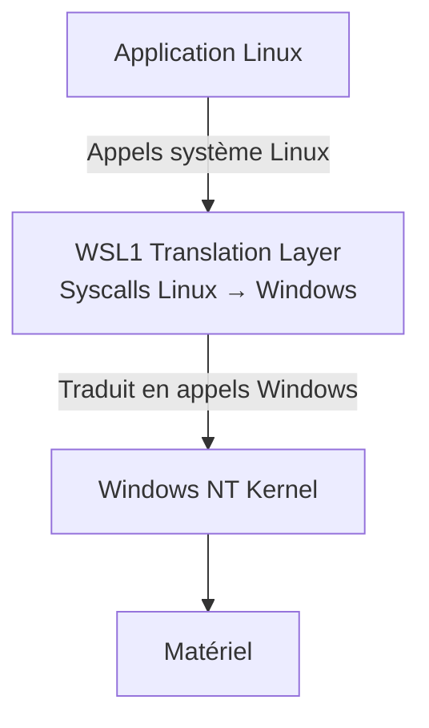
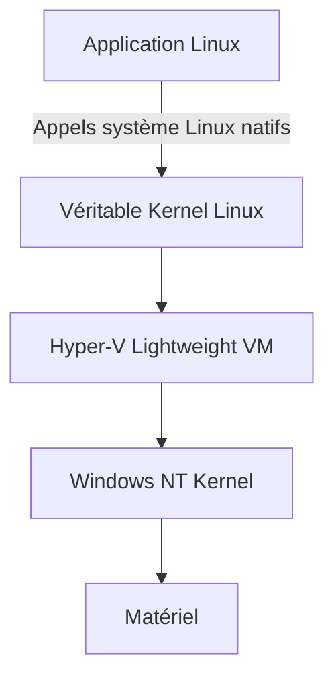
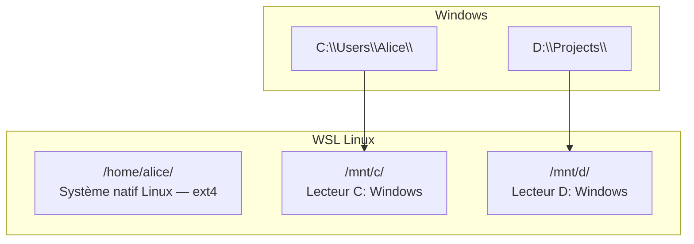
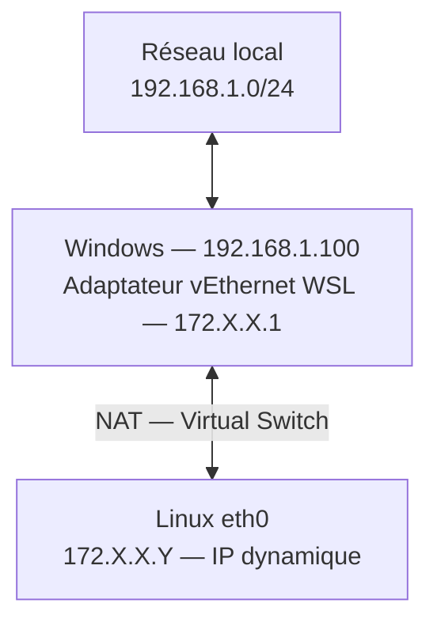

# WSL — Windows Subsystem for Linux

<div
  class="omny-meta"
  data-level="🟢 Débutant & 🟡 Intermédiaire"
  data-version="1.1"
  data-time="60-70 minutes">
</div>

!!! quote "Analogie"
    _Un immeuble (Windows) dans lequel on souhaite aménager un jardin japonais authentique. Plutôt que de déménager au Japon (dual-boot) ou de construire une serre séparée dans l'appartement (machine virtuelle lourde), on crée un espace intégré directement dans le salon qui reproduit fidèlement l'environnement voulu tout en partageant l'électricité et le chauffage de l'appartement. WSL fonctionne exactement ainsi : un Linux complet et performant, directement intégré dans Windows, partageant les ressources système sans la lourdeur d'une virtualisation traditionnelle._

**WSL (Windows Subsystem for Linux)** est une couche de compatibilité développée par Microsoft qui permet d'exécuter un **environnement Linux authentique directement sous Windows 10/11**, sans les contraintes d'une machine virtuelle traditionnelle ou d'un dual-boot. WSL2, la version actuelle, utilise un **véritable noyau Linux** optimisé par Microsoft pour offrir une compatibilité quasi-totale avec les applications et outils Linux.

WSL révolutionne le développement sous Windows en permettant d'utiliser nativement les outils, scripts et workflows Linux tout en conservant l'écosystème Windows. Cette intégration transparente élimine les frictions entre ces deux mondes historiquement séparés.

!!! info "Pourquoi c'est important"
    WSL permet le développement web et cloud moderne, l'utilisation d'outils DevOps, l'exécution de conteneurs Docker, le scripting Bash, l'apprentissage Linux sans quitter Windows et l'accès aux outils de cybersécurité Linux. C'est devenu l'environnement de référence pour les développeurs sous Windows.

!!! tip "Intégration, pas séparation"
    WSL n'est pas une machine virtuelle isolée. C'est une intégration profonde où Windows et Linux partagent ressources, fichiers et réseau. Il est possible d'éditer des fichiers Linux avec VSCode Windows, de lancer des commandes Windows depuis Linux, et inversement.

<br />

---

## WSL1 vs WSL2 — Évolution architecturale

Microsoft a développé deux versions de WSL avec des architectures radicalement différentes.

!!! note "L'image ci-dessous compare les deux architectures côte à côte. Comprendre la différence entre traduction d'appels système et kernel réel explique pourquoi WSL2 est le standard — et dans quels rares cas WSL1 reste pertinent."


<p><em>WSL1 traduit les appels système Linux en appels Windows — démarrage instantané, faible consommation mémoire, mais compatibilité partielle. WSL2 exécute un vrai kernel Linux dans une VM Hyper-V allégée — compatibilité totale, performances I/O natives dans le système Linux, mais accès cross-filesystem plus lent.</em></p>

### Architecture WSL1


```mermaid
flowchart TB
    A[Application Linux]
    B["WSL1 Translation Layer\nSyscalls Linux → Windows"]
    C[Windows NT Kernel]
    D[Matériel]

    A -->|Appels système Linux| B
    B -->|Traduit en appels Windows| C
    C --> D
```

WSL1 traduit les appels système Linux en appels Windows sans véritable kernel Linux. Démarrage instantané, faible consommation RAM, mais compatibilité incomplète : pas de Docker natif, problèmes d'I/O, syscalls manquants.

### Architecture WSL2


```mermaid
flowchart TB
    A[Application Linux]
    B[Véritable Kernel Linux]
    C[Hyper-V Lightweight VM]
    D[Windows NT Kernel]
    E[Matériel]

    A -->|Appels système Linux natifs| B
    B --> C
    C --> D
    D --> E
```

WSL2 exécute un vrai kernel Linux maintenu par Microsoft dans une VM Hyper-V optimisée. Compatibilité totale avec tous les appels système Linux, Docker natif, systemd, modules kernel.

### Comparaison détaillée

| Critère | WSL1 | WSL2 |
|---|---|---|
| Compatibilité syscalls | Partielle (~80%) | Totale (~100%) |
| Performances I/O Linux | Lentes | Natives |
| Performances I/O Windows (/mnt/c) | Rapides | Réduites |
| Démarrage | Instantané | ~2 secondes |
| Consommation RAM | Faible | Moyenne |
| Docker natif | Non | Oui |
| Systemd | Non | Oui (depuis 2022) |
| Modules kernel | Non | Oui |
| Réseau | Bridge direct | NAT |

!!! tip "Recommandation"
    Utiliser WSL2 dans tous les cas sauf accès intensif aux fichiers Windows depuis Linux ou RAM très limitée (moins de 4 Go). WSL2 est le standard moderne et sera le seul maintenu à long terme.

<br />

---

## Installation

### Prérequis système

Configuration minimale : Windows 10 version 2004+ (Build 19041+) ou Windows 11, architecture 64-bit, virtualisation activée dans le BIOS/UEFI, 4 Go de RAM minimum (8 Go recommandé), 20 Go d'espace disque disponible.

```powershell title="PowerShell — vérifier la version Windows et la virtualisation"
# Version Windows
winver

# Vérifier si la virtualisation est activée
Get-ComputerInfo | Select-Object HyperVisorPresent, HyperVRequirementVirtualizationFirmwareEnabled
```

### Installation automatique (recommandée)

```powershell title="PowerShell — installation WSL (droits administrateur requis)"
# Installer WSL avec Ubuntu par défaut
wsl --install

# Installer une distribution spécifique
wsl --install -d Ubuntu-24.04
wsl --install -d Debian
```

Cette commande active les fonctionnalités Windows nécessaires, télécharge le kernel Linux WSL2, définit WSL2 comme version par défaut et installe la distribution choisie. Un redémarrage est requis après l'installation.

### Installation manuelle

```powershell title="PowerShell — installation manuelle étape par étape"
# 1. Activer WSL
dism.exe /online /enable-feature /featurename:Microsoft-Windows-Subsystem-Linux /all /norestart

# 2. Activer la plateforme de machine virtuelle
dism.exe /online /enable-feature /featurename:VirtualMachinePlatform /all /norestart

# 3. Redémarrer Windows, puis télécharger le package kernel WSL2
# https://aka.ms/wsl2kernel

# 4. Définir WSL2 comme version par défaut
wsl --set-default-version 2

# 5. Installer une distribution depuis le Microsoft Store
```

### Distributions disponibles

```powershell title="PowerShell — lister les distributions disponibles"
wsl --list --online
```

| Distribution | Version | Usage recommandé |
|---|---|---|
| Ubuntu | 24.04 LTS | Développement général, débutants |
| Ubuntu | 22.04 LTS | Stabilité maximale |
| Debian | 12 (Bookworm) | Serveurs, stabilité |
| Kali Linux | Rolling | Cybersécurité, pentesting |
| Alpine | 3.19 | Conteneurs légers, minimal |
| Fedora | Latest | Technologies récentes, Red Hat |
| Arch Linux | Rolling | Utilisateurs avancés |
| Oracle Linux | 8/9 | Entreprise, compatibilité RHEL |

### Première configuration

Au premier lancement, WSL demande la création d'un utilisateur Unix :

```bash title="Bash — configuration initiale au premier lancement"
# WSL demande un nom d'utilisateur et un mot de passe Unix
Enter new UNIX username: alice
New password:
Retype new password:
# Cet utilisateur est distinct du compte Windows et dispose des droits sudo
```

<br />

---

## Gestion des distributions

```powershell title="PowerShell — commandes de gestion WSL"
# Lister les distributions installées avec leur version et état
wsl --list --verbose

# Résultat exemple :
#   NAME            STATE           VERSION
# * Ubuntu-24.04    Running         2
#   Debian          Stopped         2
#   Kali-Linux      Stopped         2

# Lancer une distribution spécifique
wsl -d Ubuntu-24.04

# Définir la distribution par défaut
wsl --set-default Ubuntu-24.04

# Arrêter une distribution
wsl --terminate Ubuntu-24.04

# Arrêter toutes les distributions
wsl --shutdown

# Lancer en tant qu'utilisateur spécifique
wsl -u root
wsl -d Debian -u alice

# Exécuter une commande sans shell interactif
wsl ls -la
wsl -d Debian cat /etc/os-release
```

### Conversion WSL1 vers WSL2

```powershell title="PowerShell — conversion de version WSL"
# Convertir une distribution vers WSL2
wsl --set-version Ubuntu-24.04 2

# Définir la version par défaut pour les nouvelles installations
wsl --set-default-version 2
```

### Import et export

```powershell title="PowerShell — sauvegarde et restauration de distributions"
# Exporter une distribution — sauvegarde complète du système Linux
wsl --export Ubuntu-24.04 D:\Backups\ubuntu-backup.tar

# Importer une distribution restaurée dans un répertoire dédié
wsl --import Ubuntu-Restored D:\WSL\Ubuntu D:\Backups\ubuntu-backup.tar

# Désinstaller une distribution — supprime toutes les données sans confirmation
wsl --unregister Ubuntu-24.04
```

### Cloner une distribution

```powershell title="PowerShell — cloner une distribution WSL"
# Exporter la distribution source
wsl --export Ubuntu-24.04 D:\temp\ubuntu-source.tar

# Importer avec un nouveau nom dans un répertoire dédié
wsl --import Ubuntu-Dev D:\WSL\Ubuntu-Dev D:\temp\ubuntu-source.tar

# Nettoyer le fichier temporaire
Remove-Item D:\temp\ubuntu-source.tar
```

<br />

---

## Configuration

### Fichier .wslconfig — configuration globale

Configure toutes les distributions WSL2 de la machine.

**Emplacement :** `C:\Users\<VotreNom>\.wslconfig`

```ini title="INI — .wslconfig (configuration globale WSL2)"
[wsl2]
# Mémoire maximum allouée à WSL2
memory=8GB

# Nombre de processeurs virtuels
processors=4

# Taille du swap
swap=4GB

# Localisation du fichier swap
swapFile=D:\\WSL\\swap.vhdx

# Forwarding localhost — ports Linux accessibles via localhost Windows
localhostForwarding=true

# Activer la virtualisation imbriquée (VM dans WSL)
nestedVirtualization=true

# Activer les applications GUI Linux (WSLg)
guiApplications=true

# Récupération automatique de la mémoire inutilisée
autoMemoryReclaim=gradual
```

```powershell title="PowerShell — appliquer les modifications .wslconfig"
# Redémarrer toutes les distributions pour appliquer
wsl --shutdown
```

### Fichier wsl.conf — configuration par distribution

Configure une distribution spécifique.

**Emplacement :** `/etc/wsl.conf` dans chaque distribution Linux.

```ini title="INI — /etc/wsl.conf (configuration par distribution)"
[automount]
# Monter automatiquement les lecteurs Windows
enabled=true

# Point de montage
root=/mnt/

# Options de montage — metadata active chmod/chown sur /mnt/c
options="metadata,umask=22,fmask=11"

[network]
# Générer /etc/hosts automatiquement
generateHosts=true

# Générer /etc/resolv.conf automatiquement
generateResolvConf=true

# Nom d'hôte de la distribution
hostname=wsl-dev

[interop]
# Autoriser le lancement d'exécutables Windows depuis Linux
enabled=true

# Ajouter le PATH Windows au PATH Linux
appendWindowsPath=true

[boot]
# Activer systemd (WSL2 2022+)
systemd=true

# Commande à exécuter au démarrage (exemple)
# command="service docker start"

[user]
# Utilisateur par défaut au lancement
default=alice
```

### Activer systemd

Systemd permet d'utiliser `systemctl`, Docker natif et les services Linux modernes.

```bash title="Bash — activer systemd dans /etc/wsl.conf"
sudo nano /etc/wsl.conf
```

```ini title="INI — section boot à ajouter dans wsl.conf"
[boot]
systemd=true
```

```powershell title="PowerShell — redémarrer WSL pour appliquer systemd"
wsl --shutdown
```

```bash title="Bash — vérifier que systemd fonctionne"
systemctl --version
systemctl status
```

<br />

---

## Système de fichiers

!!! note "L'image ci-dessous illustre les deux zones du système de fichiers WSL et leurs performances respectives. C'est la règle la plus importante à retenir pour éviter des ralentissements sur un projet actif."


<p><em>Le système de fichiers Linux (ext4) est accédé nativement — compilations, installations npm, opérations git y sont rapides. Les lecteurs Windows montés via /mnt/ passent par le protocole 9P — un projet Node.js dans /mnt/c/ peut être 5 à 10 fois plus lent qu'en /home/. Stocker les projets actifs dans le système Linux est non négociable.</em></p>

### Architecture


```mermaid
flowchart TB
    subgraph Windows
        A["C:\\Users\\Alice\\"]
        B["D:\\Projects\\"]
    end

    subgraph "WSL Linux"
        D["/home/alice/\nSystème natif Linux — ext4"]
        E["/mnt/c/\nLecteur C: Windows"]
        F["/mnt/d/\nLecteur D: Windows"]
    end

    A --> E
    B --> F
```

### Accès aux fichiers Linux depuis Windows

```powershell title="PowerShell — accéder aux fichiers Linux depuis l'Explorateur Windows"
# Dans la barre d'adresse de l'Explorateur Windows
\\wsl$\Ubuntu-24.04\home\alice

# Alternative disponible depuis Windows 11
\\wsl.localhost\Ubuntu-24.04\home\alice
```

```bash title="Bash — ouvrir l'Explorateur Windows au répertoire courant"
explorer.exe .

# Ouvrir un fichier avec une application Windows
code fichier.py
```

### Accès aux fichiers Windows depuis Linux

```bash title="Bash — accéder aux lecteurs Windows depuis Linux"
# Lecteur C:
cd /mnt/c/Users/Alice/Documents

# Lecteur D:
cd /mnt/d/Projects

# Lister tous les montages
ls -la /mnt/
```

### Règles de stockage

| Scénario | Emplacement recommandé | Raison |
|---|---|---|
| Projet Node.js / Python / Go | `~/projects/` | npm, pip, go ultra rapides |
| Site web PHP | `~/www/` | Performances serveur maximales |
| Dotfiles et config | `~/` | Natif Linux |
| Documents Word / Excel | `/mnt/c/Users/Alice/Documents/` | Édition Windows native |
| Code partagé Windows/Linux | `/mnt/c/SharedCode/` + git | Compromis acceptable |

```bash title="Bash — exemple d'emplacement correct vs incorrect"
# Correct — performances maximales
~/projects/monapp/

# Incorrect — performances dégradées (5 à 10 fois plus lent)
/mnt/c/Users/Alice/projects/monapp/
```

!!! danger "Ne jamais modifier les fichiers Linux directement depuis Windows"
    Modifier les fichiers dans `\\wsl$\` avec des outils Windows en dehors de VSCode ou IntelliJ risque de corrompre les métadonnées Linux. Ces éditeurs gèrent WSL correctement — les autres non.

### Activer les métadonnées (chmod sur /mnt/)

```bash title="Bash — activer les métadonnées sur les lecteurs Windows montés"
sudo nano /etc/wsl.conf
```

```ini title="INI — options automount avec métadonnées"
[automount]
options="metadata,umask=22,fmask=11"
```

```powershell title="PowerShell — redémarrer pour appliquer"
wsl --shutdown
```

Après redémarrage, `chmod` et `chown` fonctionnent sur `/mnt/c/`.

<br />

---

## Réseau et connectivité

### Architecture réseau WSL2


```mermaid
flowchart TB
    LAN["Réseau local\n192.168.1.0/24"]
    WIN["Windows — 192.168.1.100\nAdaptateur vEthernet WSL — 172.X.X.1"]
    WSL["Linux eth0\n172.X.X.Y — IP dynamique"]

    LAN <--> WIN
    WIN <-->|"NAT — Virtual Switch"| WSL
```

WSL2 obtient une IP dynamique dans un sous-réseau privé (172.X.X.0/20). Le trafic Linux sort via NAT Windows. Le localhost forwarding rend les ports Linux accessibles via `localhost` sous Windows.

### Accès réseau

```bash title="Bash — accéder à des services Windows depuis Linux"
# Les services Windows sont accessibles via localhost
curl http://localhost:8080

# Récupérer l'IP de l'hôte Windows depuis Linux
ip route show | grep -i default | awk '{ print $3 }'
```

```powershell title="PowerShell — accéder à des services Linux depuis Windows"
# Un service Linux sur le port 3000 est accessible via localhost Windows
# http://localhost:3000  (localhost forwarding activé par défaut)
```

### Exposer des ports WSL au réseau local

Les ports WSL ne sont pas exposés automatiquement au réseau local — seul `localhost` Windows y a accès.

```powershell title="PowerShell — port forwarding vers le réseau local (droits administrateur)"
# Transférer le port 3000 Windows vers WSL
netsh interface portproxy add v4tov4 `
    listenport=3000 `
    listenaddress=0.0.0.0 `
    connectport=3000 `
    connectaddress=$(wsl hostname -I)

# Lister les forwardings actifs
netsh interface portproxy show all

# Supprimer un forwarding
netsh interface portproxy delete v4tov4 listenport=3000 listenaddress=0.0.0.0
```

```powershell title="PowerShell — script de port forwarding automatique"
# Exécuter après chaque démarrage de WSL — l'IP WSL change à chaque redémarrage
$wsl_ip = (wsl hostname -I).Trim()
$ports  = @(3000, 8080, 5432)

foreach ($port in $ports) {
    netsh interface portproxy delete v4tov4 listenport=$port listenaddress=0.0.0.0
    netsh interface portproxy add v4tov4 `
        listenport=$port `
        listenaddress=0.0.0.0 `
        connectport=$port `
        connectaddress=$wsl_ip
}

# Autoriser dans le pare-feu Windows
New-NetFirewallRule -DisplayName "WSL Ports" -Direction Inbound -LocalPort $ports -Protocol TCP -Action Allow
```

### DNS et VPN

```bash title="Bash — configurer le DNS manuellement"
sudo nano /etc/wsl.conf
```

```ini title="INI — désactiver la génération automatique de resolv.conf"
[network]
generateResolvConf=false
```

```bash title="Bash — configurer les serveurs DNS"
sudo nano /etc/resolv.conf

# Ajouter les serveurs DNS
nameserver 8.8.8.8
nameserver 1.1.1.1

# Protéger contre la réinitialisation automatique par WSL
sudo chattr +i /etc/resolv.conf
```

!!! warning "VPN et connectivité WSL"
    Un VPN actif sous Windows peut bloquer la connectivité réseau de WSL2. En cas de problème, configurer manuellement le DNS du VPN dans `/etc/resolv.conf` ou utiliser un client VPN installé directement dans WSL.

```bash title="Bash — client VPN natif dans WSL (Cisco AnyConnect)"
sudo apt install openconnect
sudo openconnect vpn.entreprise.com
```

<br />

---

## Intégration Windows-Linux

!!! note "L'image ci-dessous représente les quatre axes d'interopérabilité WSL. Cette intégration bidirectionnelle est la principale différence avec une machine virtuelle classique — les deux systèmes coexistent sans friction."


<p><em>Contrairement à une VM isolée, WSL partage le système de fichiers (via /mnt/), les ports réseau (via localhost forwarding), le presse-papier et la capacité à lancer des exécutables dans les deux sens. Cette transparence rend le basculement Windows/Linux imperceptible au quotidien.</em></p>

### Lancer des applications Windows depuis Linux

```bash title="Bash — exécuter des applications Windows depuis WSL"
# Ouvrir l'Explorateur Windows au répertoire courant
explorer.exe .

# Ouvrir VSCode sur un fichier
code fichier.py

# Ouvrir une URL dans le navigateur Windows par défaut
cmd.exe /c start https://example.com

# Exécuter PowerShell depuis Linux
powershell.exe -Command "Get-Process"

# Ouvrir un fichier avec son application par défaut
notepad.exe fichier.txt
```

### Lancer des commandes Linux depuis Windows

```powershell title="PowerShell — exécuter des commandes Linux depuis Windows"
# Commande dans la distribution par défaut
wsl ls -la

# Commande dans une distribution spécifique
wsl -d Debian apt update

# Pipeline PowerShell vers Linux
Get-Content file.txt | wsl grep "pattern"

# Pipeline Linux vers PowerShell
wsl ls | Where-Object { $_ -like "*.txt" }
```

### VSCode et WSL

```bash title="Bash — ouvrir un projet WSL dans VSCode"
# Depuis Linux, dans le dossier du projet
code .
```

L'extension `Remote - WSL` (ms-vscode-remote.remote-wsl) permet d'éditer des fichiers Linux avec les performances natives, d'utiliser le terminal WSL intégré, d'installer des extensions dans l'environnement Linux et de déboguer en contexte Linux. Elle s'installe automatiquement au premier lancement de `code .` depuis WSL.

### Windows Terminal

```json title="JSON — configuration Windows Terminal pour WSL"
{
    "defaultProfile": "{guid-ubuntu}",
    "profiles": {
        "list": [
            {
                "guid": "{guid-ubuntu}",
                "name": "Ubuntu",
                "source": "Windows.Terminal.Wsl",
                "startingDirectory": "~",
                "colorScheme": "One Half Dark",
                "font": {
                    "face": "Cascadia Code NF",
                    "size": 11
                }
            }
        ]
    }
}
```

<br />

---

## Docker et conteneurs

### Docker Desktop avec WSL2

Docker Desktop utilise WSL2 comme backend — les conteneurs tournent dans WSL2 avec des performances natives.

1. Installer Docker Desktop pour Windows
2. Settings → General → activer "Use the WSL 2 based engine"
3. Settings → Resources → WSL Integration → activer les distributions souhaitées

```bash title="Bash — vérifier Docker dans WSL"
docker --version
docker run hello-world
docker compose version
```

### Docker Engine natif dans WSL2 (sans Docker Desktop)

```bash title="Bash — installer Docker Engine dans Ubuntu WSL"
# Prérequis
sudo apt update
sudo apt install -y ca-certificates curl gnupg lsb-release

# Clé GPG officielle Docker
sudo mkdir -p /etc/apt/keyrings
curl -fsSL https://download.docker.com/linux/ubuntu/gpg | \
    sudo gpg --dearmor -o /etc/apt/keyrings/docker.gpg

# Repository Docker
echo \
    "deb [arch=$(dpkg --print-architecture) signed-by=/etc/apt/keyrings/docker.gpg] \
    https://download.docker.com/linux/ubuntu \
    $(lsb_release -cs) stable" | \
    sudo tee /etc/apt/sources.list.d/docker.list > /dev/null

# Installation
sudo apt update
sudo apt install -y docker-ce docker-ce-cli containerd.io docker-buildx-plugin docker-compose-plugin

# Ajouter l'utilisateur courant au groupe docker
sudo usermod -aG docker $USER

# Démarrer Docker (systemd requis)
sudo systemctl enable docker
sudo systemctl start docker

# Vérifier
docker run hello-world
```

<br />

---

## Environnements de développement

### Python

```bash title="Bash — environnement Python dans WSL"
# Python est préinstallé sur Ubuntu
python3 --version

# Installer pip et venv
sudo apt update
sudo apt install python3-pip python3-venv

# Créer et activer un environnement virtuel
cd ~/projects/monapp
python3 -m venv venv
source venv/bin/activate

# Installer les dépendances
pip install flask requests

# Désactiver
deactivate
```

### Node.js

```bash title="Bash — Node.js dans WSL via NodeSource"
# Version LTS récente via NodeSource
curl -fsSL https://deb.nodesource.com/setup_20.x | sudo -E bash -
sudo apt install -y nodejs

node --version
npm --version
```

!!! tip "Utiliser NVM pour gérer plusieurs versions Node"
    NVM permet d'installer et de basculer entre plusieurs versions de Node.js sans conflit. Voir la fiche [NVM](nvm.md) pour la configuration complète.

### Go

```bash title="Bash — environnement Go dans WSL"
sudo apt update
sudo apt install golang-go

go version

# Configurer GOPATH dans le profil shell
echo 'export GOPATH=$HOME/go'         >> ~/.bashrc
echo 'export PATH=$PATH:$GOPATH/bin'  >> ~/.bashrc
source ~/.bashrc

# Initialiser un module
mkdir -p ~/projects/monapp-go
cd ~/projects/monapp-go
go mod init monapp
```

### PHP et Laravel

```bash title="Bash — PHP et Composer dans WSL"
sudo apt update
sudo apt install php php-cli php-fpm php-mysql php-xml php-curl php-mbstring php-zip

# Composer
curl -sS https://getcomposer.org/installer | php
sudo mv composer.phar /usr/local/bin/composer

php --version
composer --version

# Laravel
composer global require laravel/installer
export PATH="$HOME/.config/composer/vendor/bin:$PATH"
laravel new monapp
```

### Bases de données

```bash title="Bash — PostgreSQL dans WSL"
sudo apt install postgresql postgresql-contrib

sudo systemctl start postgresql
sudo systemctl enable postgresql

sudo -u postgres psql
```

```sql title="SQL — création base et utilisateur PostgreSQL"
CREATE DATABASE monapp;
CREATE USER alice WITH PASSWORD 'secret';
GRANT ALL PRIVILEGES ON DATABASE monapp TO alice;
```

```bash title="Bash — MySQL dans WSL"
sudo apt install mysql-server
sudo service mysql start
sudo mysql_secure_installation
sudo mysql
```

```sql title="SQL — création base et utilisateur MySQL"
CREATE DATABASE monapp;
CREATE USER 'alice'@'localhost' IDENTIFIED BY 'secret';
GRANT ALL PRIVILEGES ON monapp.* TO 'alice'@'localhost';
FLUSH PRIVILEGES;
```

```bash title="Bash — Redis dans WSL"
sudo apt install redis-server
sudo service redis-server start

redis-cli ping
# PONG
```

<br />

---

## Applications GUI Linux (WSLg)

WSLg permet d'exécuter des applications graphiques Linux directement dans Windows. Activé par défaut sur Windows 11 et Windows 10 22H2+.

```ini title="INI — activer WSLg dans .wslconfig"
[wsl2]
guiApplications=true
```

```bash title="Bash — applications GUI Linux dans WSL"
# Installer des applications graphiques
sudo apt install gedit gimp firefox

# Les fenêtres s'ouvrent directement dans la taskbar Windows
gedit &
gimp &
firefox &
```

Les fenêtres Linux apparaissent dans la barre des tâches Windows. Le copier-coller, l'audio et l'accélération GPU sont partagés entre les deux environnements.

<br />

---

## GPU et CUDA (NVIDIA)

WSL2 supporte le compute GPU (CUDA, TensorFlow, PyTorch) mais pas le gaming.

```bash title="Bash — vérifier la visibilité du GPU dans WSL"
# Le driver Windows est automatiquement partagé avec WSL2 — ne pas installer de driver NVIDIA dans Linux
nvidia-smi
```

```bash title="Bash — installer CUDA Toolkit dans WSL"
wget https://developer.download.nvidia.com/compute/cuda/repos/wsl-ubuntu/x86_64/cuda-keyring_1.1-1_all.deb
sudo dpkg -i cuda-keyring_1.1-1_all.deb
sudo apt update
sudo apt install cuda-toolkit-12-3

nvcc --version
```

```bash title="Bash — PyTorch avec support GPU"
pip install torch torchvision torchaudio --index-url https://download.pytorch.org/whl/cu121

# Vérifier l'accès GPU
python3 -c "import torch; print(torch.cuda.is_available())"
# True
```

!!! warning "Ne pas installer de driver NVIDIA dans Linux"
    Le driver GPU Windows est partagé automatiquement avec WSL2. Installer un driver NVIDIA dans la distribution Linux cassera le passthrough GPU.

<br />

---

## Bonnes pratiques

### Performances

```ini title="INI — .wslconfig optimisé pour machine 16+ Go de RAM"
[wsl2]
memory=8GB
processors=4
swap=4GB
localhostForwarding=true
autoMemoryReclaim=gradual
```

```bash title="Bash — maintenance courante de la distribution"
# Nettoyer les paquets inutilisés
sudo apt autoremove
sudo apt clean
```

```powershell title="PowerShell — compacter le disque virtuel WSL"
wsl --shutdown
# Adapter le chemin selon la distribution et le nom d'utilisateur Windows
Optimize-VHD -Path "$env:LOCALAPPDATA\Packages\CanonicalGroupLimited.Ubuntu24.04LTS_...\LocalState\ext4.vhdx" -Mode Full
```

### Sauvegardes automatiques

```powershell title="PowerShell — script de sauvegarde automatique WSL"
$date   = Get-Date -Format "yyyy-MM-dd"
$backup = "D:\Backups\WSL\Ubuntu-$date.tar"

wsl --export Ubuntu-24.04 $backup

# Conserver seulement les 7 dernières sauvegardes
Get-ChildItem D:\Backups\WSL\ |
    Sort-Object LastWriteTime -Descending |
    Select-Object -Skip 7 |
    Remove-Item
```

### Sécurité de base

```bash title="Bash — durcissement minimal de l'environnement WSL"
# Maintenir le système à jour
sudo apt update && sudo apt upgrade -y

# Configurer UFW si des ports sont exposés
sudo apt install ufw
sudo ufw default deny incoming
sudo ufw default allow outgoing
sudo ufw allow 2222/tcp  # SSH sur port non standard
sudo ufw enable
```

```bash title="Bash — désactiver l'authentification SSH par mot de passe"
sudo nano /etc/ssh/sshd_config

# Modifier les paramètres suivants :
# PasswordAuthentication no
# PubkeyAuthentication yes
```

<br />

---

## Dépannage

### WSL ne démarre pas

```powershell title="PowerShell — diagnostiquer et réinitialiser WSL"
wsl --shutdown
wsl --update

# Vérifier Hyper-V
Get-WindowsOptionalFeature -Online -FeatureName Microsoft-Hyper-V

# Activer Hyper-V si nécessaire
Enable-WindowsOptionalFeature -Online -FeatureName Microsoft-Hyper-V -All
```

```bash title="Bash — consulter les logs kernel WSL"
dmesg | tail -50
```

### Performances dégradées

```bash title="Bash — vérifier l'emplacement du projet"
# Si la commande affiche /mnt/c/... déplacer le projet vers ~/projects/
pwd

# Désactiver les services inutiles au démarrage
sudo systemctl disable apache2
sudo systemctl disable mysql
```

### Problèmes réseau

```powershell title="PowerShell — réinitialiser la pile réseau Windows"
wsl --shutdown
netsh winsock reset
netsh int ip reset all
ipconfig /flushdns
```

```bash title="Bash — régénérer resolv.conf"
sudo rm /etc/resolv.conf
# Depuis PowerShell : wsl --shutdown puis wsl
```

### Corruption du disque virtuel

```powershell title="PowerShell — réparer ou restaurer le disque virtuel"
wsl --shutdown

# Compacter et réparer
Optimize-VHD -Path "...\ext4.vhdx" -Mode Full

# Si corruption irréparable — restaurer depuis sauvegarde
wsl --unregister Ubuntu-24.04
wsl --import Ubuntu-24.04 C:\WSL\Ubuntu D:\Backups\ubuntu-backup.tar
```

<br />

---

## WSL2 vs alternatives

| Critère | WSL2 | VM (VirtualBox) | Dual-boot | Cloud VM |
|---|---|---|---|---|
| Performances | Excellentes | Moyennes | Natives | Selon réseau |
| Intégration Windows | Transparente | Isolée | Aucune | Distante |
| Démarrage | ~2 secondes | 30 à 60 secondes | Redémarrage requis | Instantané |
| RAM | Partagée dynamiquement | Allouée fixe | Totale | Facturée |
| Complexité | Simple | Moyenne | Complexe | Simple |
| GUI Linux | WSLg intégré | Desktop complet | Desktop complet | Possible (X11) |
| Compatibilité | ~100% | 100% | 100% | 100% |
| Coût | Gratuit | Gratuit | Gratuit | Payant |

!!! tip "Quand utiliser WSL2"
    Développement web et cloud moderne, apprentissage Linux sous Windows, scripting Bash et automation, conteneurs Docker, outils DevOps (Ansible, Terraform, kubectl), cybersécurité (Kali, outils de pentesting).

!!! warning "Quand préférer une VM ou un dual-boot"
    Desktop Linux complet (GNOME/KDE), gaming Linux, tests de modules kernel, formation aux certifications Linux (RHCSA, LPIC), environnement strictement isolé.

<br />

---

## Conclusion

!!! quote "Conclusion"
    _WSL2 a transformé le développement sous Windows en apportant Linux de manière native, performante et parfaitement intégrée. Ce qui était autrefois un choix binaire — Windows ou Linux — est devenu Windows et Linux harmonieusement couplés. Maîtriser WSL, c'est comprendre ses forces (performances natives dans le système Linux, intégration VSCode, Docker) et ses limites (réseau complexe pour l'exposition externe, performances cross-filesystem réduites). Stocker les projets dans le système de fichiers Linux, activer systemd pour un environnement authentique, et exploiter l'interopérabilité Windows-Linux : ces trois réflexes font de WSL un environnement de développement de classe professionnelle._

<br />