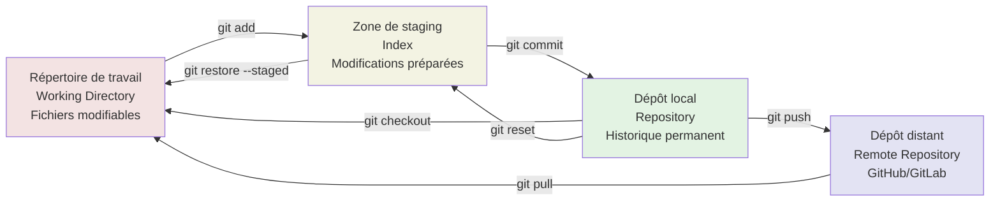
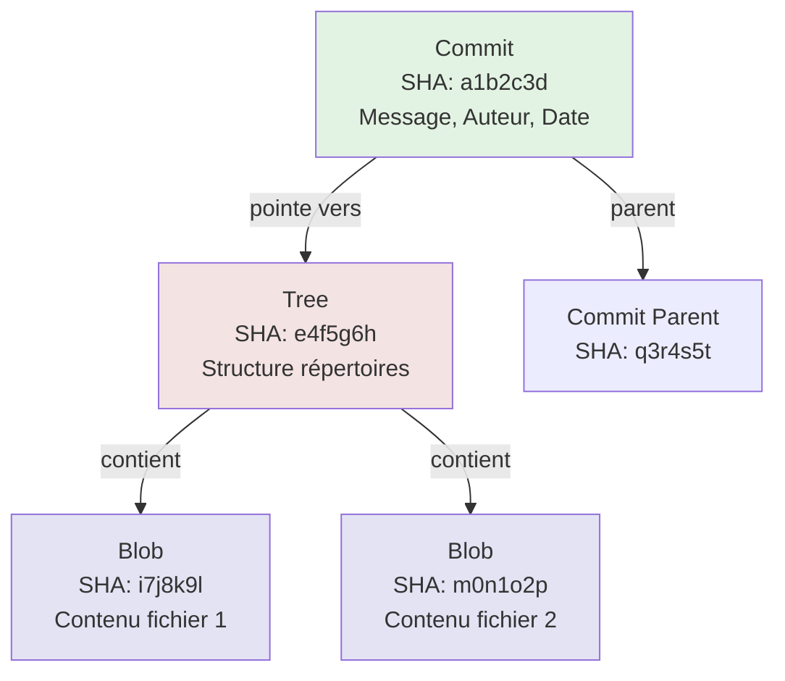
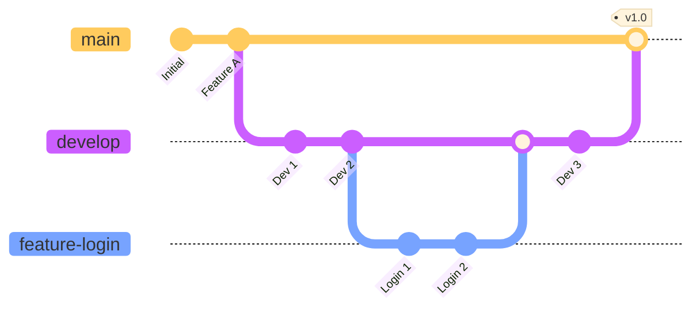
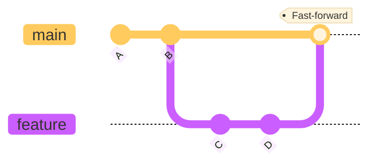
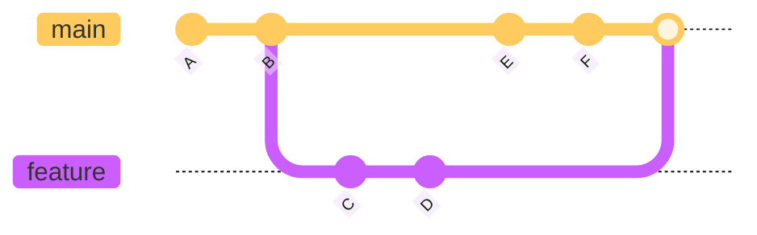
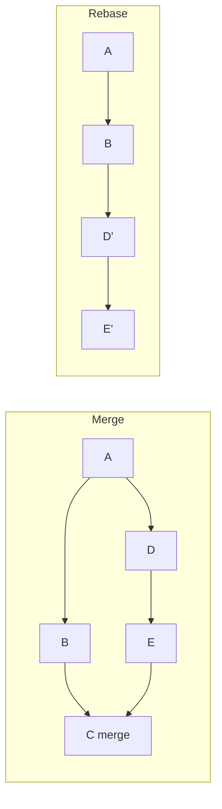
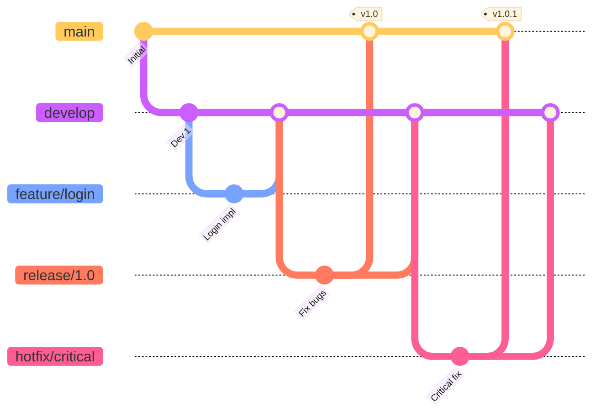

# Git

## Introduction

**Niveau :** Débutant & Intermédiaire

!!! quote "Analogie pédagogique"
    _Imaginez une **machine à remonter le temps** pour vos documents. À chaque modification importante, vous créez un **point de sauvegarde** avec une description. Vous pouvez revenir à n'importe quel point passé, comparer deux versions séparées de mois, ou même créer des **univers parallèles** où vous testez différentes approches sans affecter votre travail principal. **Git fonctionne exactement ainsi** : c'est un système de gestion de versions qui enregistre l'historique complet de vos fichiers et permet une collaboration sans conflit entre dizaines de développeurs._

> **Git** est un système de **gestion de versions distribué** créé en 2005 par **Linus Torvalds** (créateur de Linux) pour gérer le développement du noyau Linux. Face à l'inefficacité des outils existants, Torvalds a conçu Git avec des objectifs radicaux : **vitesse extrême**, **architecture distribuée**, **intégrité cryptographique**, et capacité à gérer des projets massifs (Linux compte des millions de lignes de code avec des milliers de contributeurs).

Git a révolutionné le développement logiciel. Avant Git, les systèmes centralisés (SVN, CVS) créaient des goulots d'étranglement et rendaient le travail hors ligne impossible. Git a introduit un modèle où **chaque développeur possède l'historique complet** du projet, permettant le travail autonome et la fusion sophistiquée de contributions parallèles. Aujourd'hui, Git alimente **GitHub, GitLab, Bitbucket** et constitue le standard industriel absolu pour le versioning de code.

!!! info "Pourquoi c'est important ?"
    Git permet de **tracer chaque modification** du code (qui, quoi, quand, pourquoi), de **collaborer efficacement** en parallèle sans écraser le travail des autres, de **revenir en arrière** en cas d'erreur catastrophique, d'**expérimenter librement** dans des branches isolées, et de **maintenir plusieurs versions** du logiciel simultanément (production, développement, hotfixes).

## Pour repartir des bases (vrais débutants)

Si vous n'avez jamais utilisé de système de versioning, Git semblera d'abord complexe. Cette complexité apparente cache une puissance remarquable. Comprenez que Git n'est **pas** un système de sauvegarde automatique comme Dropbox. Vous devez **explicitement** dire à Git quelles modifications sauvegarder et quand. Cette approche manuelle permet un contrôle total sur l'historique.

!!! tip "Git n'est pas GitHub"
    **Git** est l'outil de versioning qui fonctionne sur votre machine. **GitHub** est une plateforme web qui héberge des dépôts Git et ajoute des fonctionnalités sociales (pull requests, issues, wikis). GitLab et Bitbucket sont des alternatives similaires. Vous pouvez utiliser Git **sans GitHub**, mais pas l'inverse.

## Architecture de Git

### Modèle distribué

Contrairement aux systèmes centralisés (SVN, Perforce), Git adopte une architecture **distribuée**.

=== "Système Distribué (Git)"

    ```mermaid
    graph TB    
        subgraph "Système Distribué Git"
            C1[Dépôt distant<br/>GitHub/GitLab]
            D1[Dev 1<br/>Dépôt complet local]
            D2[Dev 2<br/>Dépôt complet local]
            D3[Dev 3<br/>Dépôt complet local]
            
            D1 <-->|push/pull| C1
            D2 <-->|push/pull| C1
            D3 <-->|push/pull| C1
            
            D1 <-.->|peer-to-peer| D2
            D2 <-.->|peer-to-peer| D3
        end
        
        style D1 fill:#e3f3e3
        style D2 fill:#e3f3e3
        style D3 fill:#e3f3e3
    ```
    
    Dans un **système distribué** comme Git, chaque développeur possède un **clone complet** du dépôt incluant l'historique entier. Le dépôt distant (GitHub/GitLab) sert de point de synchronisation central, mais n'est pas indispensable au fonctionnement. Les développeurs peuvent travailler entièrement hors ligne, créer des commits, des branches, et même échanger directement entre eux (peer-to-peer) sans passer par le serveur central.

=== "Système Centralisé (SVN)"

    ```mermaid
    graph TB
        subgraph "Système Centralisé SVN"
            A1[Serveur Central<br/>Historique complet]
            B1[Dev 1<br/>Copie de travail]
            B2[Dev 2<br/>Copie de travail]
            B3[Dev 3<br/>Copie de travail]
            
            B1 -.->|commit| A1
            B2 -.->|commit| A1
            B3 -.->|commit| A1
            
            A1 -.->|update| B1
            A1 -.->|update| B2
            A1 -.->|update| B3
        end
    ```
    
    Dans un **système centralisé** comme SVN, seul le serveur central possède l'historique complet du projet. Les développeurs ne disposent que d'une **copie de travail** de la dernière version. Toute opération (commit, historique, branches) nécessite une connexion au serveur. Si le serveur central tombe en panne, tout le travail collaboratif s'arrête et l'historique peut être perdu définitivement.

**Avantages du modèle distribué :**

- [x] **Travail hors ligne** : Commit, branches, merge sans connexion réseau
- [x] **Rapidité** : Toutes les opérations sont locales (sauf push/pull)
- [x] **Redondance** : Chaque clone est une sauvegarde complète
- [x] **Flexibilité** : Workflows complexes possibles (peer-to-peer)
- [x] **Sécurité** : Perte du serveur central = aucune perte de données

### Les trois zones

Git organise les fichiers en **trois zones** distinctes.



**Répertoire de travail (Working Directory) :**

- Fichiers visibles et modifiables
- État actuel des fichiers sur le disque
- Zone de modification libre

**Zone de staging (Index) :**

- Modifications **sélectionnées** pour le prochain commit
- Permet de construire des commits logiques et atomiques
- Intermédiaire entre travail et historique

**Dépôt local (Repository) :**

- Historique complet des commits
- Base de données Git (`.git/`)
- Immuable et permanent

### Objets Git

Git stocke l'information sous forme d'**objets** identifiés par hashes SHA-1.



**Types d'objets :**

| Type | Contenu | Rôle |
|------|---------|------|
| **Commit** | Métadonnées (auteur, date, message) + pointeur vers tree | Snapshot du projet |
| **Tree** | Liste de blobs et sous-trees | Structure de répertoires |
| **Blob** | Contenu binaire d'un fichier | Données brutes |
| **Tag** | Référence annotée vers un commit | Marqueur de version |

**Intégrité cryptographique :**

Chaque objet est identifié par le **hash SHA-1** de son contenu. Modifier un fichier change son hash, ce qui change le hash du tree, qui change le hash du commit. Cette chaîne garantit l'**intégrité totale** de l'historique.

!!! note "Similitude avec la blockchain"
    Git utilise le même principe fondamental que la blockchain : chaque commit référence son parent par son hash, créant une **chaîne cryptographique** immuable. Toute tentative de modification d'un commit ancien invalide tous les commits suivants, rendant la falsification détectable immédiatement.
    
    **Différence importante** : Git utilise SHA-1, un algorithme aujourd'hui considéré comme **déprécié** pour des applications critiques de sécurité (collisions théoriquement possibles). Les blockchains modernes utilisent SHA-256 ou des algorithmes plus robustes. Git migre progressivement vers SHA-256, mais SHA-1 reste suffisant pour l'intégrité de versioning de code où les attaques par collision sont peu pertinentes.

## Configuration initiale

### Installation

=== ":fontawesome-brands-ubuntu: Linux (Debian/Ubuntu)"

    ```bash
    apt update
    apt install git
    ```

=== ":fontawesome-brands-fedora: Linux (Fedora/RHEL)"

    ```bash
    dnf install git
    ```

=== ":fontawesome-brands-apple: macOS"

    ```bash
    # Via Homebrew
    brew install git

    # Via Xcode Command Line Tools
    xcode-select --install
    ```

=== ":fontawesome-brands-windows: Windows"

    - Télécharger depuis [git-scm.com](https://git-scm.com)
    - Git pour Windows inclut Git Bash (terminal Unix-like)

!!! note "Universalité des commandes Git"
    Quel que soit votre système d'exploitation (Linux, macOS, Windows), les **commandes Git sont identiques**. Git est un outil en ligne de commande cross-platform. Une fois installé, `git commit`, `git push`, `git branch` fonctionnent exactement de la même manière partout. Cette uniformité permet de travailler sans friction sur différents environnements.

**Vérification :**
```bash
git --version
# git version 2.43.0
```

### Configuration utilisateur

**Configuration globale (obligatoire avant premier commit) :**

```bash
# Identité (apparaîtra dans tous les commits)
git config --global user.name "Alice Dupont"
git config --global user.email "alice@example.com"

# Éditeur par défaut
git config --global core.editor "vim"
git config --global core.editor "code --wait"  # VS Code
git config --global core.editor "nano"         # Nano

# Outil de diff/merge
git config --global merge.tool vimdiff

# Couleurs dans le terminal
git config --global color.ui auto
```

**Niveaux de configuration :**

| Niveau | Portée | Fichier | Priorité |
|--------|--------|---------|----------|
| **--system** | Tous les utilisateurs du système | `/etc/gitconfig` | Basse |
| **--global** | Utilisateur actuel | `~/.gitconfig` | Moyenne |
| **--local** | Dépôt actuel | `.git/config` | Haute |

**Visualiser la configuration :**

```bash
# Toute la configuration
git config --list

# Configuration globale uniquement
git config --global --list

# Valeur d'une option spécifique
git config user.name

# Voir l'origine d'une option
git config --show-origin user.email
```

### Alias utiles

```bash
# Raccourcis de commandes
git config --global alias.st status
git config --global alias.co checkout
git config --global alias.br branch
git config --global alias.ci commit
git config --global alias.unstage 'reset HEAD --'

# Log graphique élégant
git config --global alias.lg "log --graph --pretty=format:'%Cred%h%Creset -%C(yellow)%d%Creset %s %Cgreen(%cr) %C(bold blue)<%an>%Creset' --abbrev-commit"

# Voir les branches récentes
git config --global alias.recent 'for-each-ref --sort=-committerdate --format="%(committerdate:short) %(refname:short)" refs/heads/'
```

## Commandes fondamentales

### Initialisation d'un dépôt

**Créer un nouveau dépôt :**

```bash
# Créer un répertoire de projet
mkdir mon-projet
cd mon-projet

# Initialiser Git
git init

# Résultat : création du répertoire .git/
ls -la
# drwxr-xr-x  .git
```

**Cloner un dépôt existant :**

```bash
# Clone depuis une URL
git clone https://github.com/utilisateur/projet.git

# Clone avec nom personnalisé
git clone https://github.com/utilisateur/projet.git mon-nom

# Clone avec profondeur limitée (historique partiel)
git clone --depth 1 https://github.com/utilisateur/projet.git

# Clone d'une branche spécifique
git clone -b develop https://github.com/utilisateur/projet.git
```

### État du dépôt

**Vérifier le statut :**

```bash
# Statut complet
git status

# Statut court
git status -s
# M  fichier-modifie.txt
# A  fichier-ajoute.txt
# D  fichier-supprime.txt
# ?? fichier-non-suivi.txt
```

**Symboles du statut court :**

| Code | Signification |
|------|---------------|
| `??` | Non suivi (untracked) |
| `A ` | Ajouté au staging |
| `M ` | Modifié dans staging |
| ` M` | Modifié dans working directory |
| `MM` | Modifié dans staging et working directory |
| `D ` | Supprimé dans staging |
| ` D` | Supprimé dans working directory |
| `R ` | Renommé |
| `C ` | Copié |

### Ajouter des fichiers (staging)

```bash
# Ajouter un fichier spécifique
git add fichier.txt

# Ajouter plusieurs fichiers
git add fichier1.txt fichier2.txt

# Ajouter tous les fichiers modifiés et nouveaux
git add .

# Ajouter tous les fichiers (même supprimés)
git add -A

# Ajouter interactivement (choix par fichier)
git add -i

# Ajouter par morceaux (patch)
git add -p
```

**Mode patch (git add -p) :**

Git présente chaque modification et demande l'action :

```
Stage this hunk [y,n,q,a,d,s,e,?]?
y - stage ce morceau
n - ne pas stage ce morceau
q - quitter
a - stage ce morceau et tous les suivants
d - ne stage pas ce morceau ni les suivants
s - découper en morceaux plus petits
e - éditer manuellement le morceau
? - aide
```

### Créer des commits

```bash
# Commit avec message inline
git commit -m "Ajout fonctionnalité authentification"

# Commit avec éditeur pour message détaillé
git commit

# Commit avec staging automatique des fichiers modifiés
git commit -a -m "Correction bug login"

# Amender le dernier commit
git commit --amend -m "Nouveau message"

# Amender sans changer le message
git commit --amend --no-edit
```

**Structure d'un bon message de commit :**

```
Type: Résumé court (50 caractères max)

Description détaillée optionnelle expliquant le pourquoi
des changements, pas le comment (le code montre le comment).

- Point spécifique 1
- Point spécifique 2

Refs: #123
```

**Types de commit conventionnels :**

```
feat:     Nouvelle fonctionnalité
fix:      Correction de bug
docs:     Documentation uniquement
style:    Formatage (espaces, points-virgules)
refactor: Refactoring sans changement fonctionnel
perf:     Amélioration de performance
test:     Ajout/correction de tests
chore:    Tâches de maintenance (build, dépendances)
```

### Visualiser l'historique

```bash
# Log complet
git log

# Log avec graphe des branches
git log --graph --oneline --all

# Log avec statistiques de modifications
git log --stat

# Log avec diff complet
git log -p

# Log des N derniers commits
git log -5

# Log depuis une date
git log --since="2 weeks ago"
git log --after="2025-01-01"

# Log par auteur
git log --author="Alice"

# Log avec recherche dans les messages
git log --grep="bug fix"

# Log affichant les commits qui ont modifié un fichier
git log -- fichier.txt

# Format personnalisé
git log --pretty=format:"%h - %an, %ar : %s"
```

**Format personnalisé :**

| Placeholder | Signification |
|-------------|---------------|
| `%H` | Hash complet du commit |
| `%h` | Hash court du commit |
| `%an` | Nom de l'auteur |
| `%ae` | Email de l'auteur |
| `%ad` | Date d'auteur |
| `%ar` | Date relative (il y a 2 semaines) |
| `%s` | Message (sujet) |
| `%b` | Corps du message |

### Différences

```bash
# Différences working directory vs staging
git diff

# Différences staging vs dernier commit
git diff --staged
git diff --cached  # Équivalent

# Différences entre deux commits
git diff commit1 commit2

# Différences d'un fichier spécifique
git diff fichier.txt

# Statistiques de différences
git diff --stat

# Différences entre branches
git diff main..develop
```

### Annuler des modifications

**Dans le working directory :**

```bash
# Restaurer un fichier depuis le dernier commit
git restore fichier.txt

# Restaurer tous les fichiers
git restore .

# Ancienne syntaxe (toujours valide)
git checkout -- fichier.txt
```

**Dans le staging :**

```bash
# Retirer un fichier du staging (sans modifier le fichier)
git restore --staged fichier.txt

# Ancienne syntaxe
git reset HEAD fichier.txt
```

**Annuler un commit :**

```bash
# Créer un commit qui annule un commit précédent
git revert <commit-hash>

# Revenir au commit précédent (destructif, perte des modifications)
git reset --hard HEAD~1

# Revenir au commit précédent (conserve les modifications dans working directory)
git reset --soft HEAD~1
```

**Options de git reset :**

| Option | Staging | Working Directory | Usage |
|--------|---------|-------------------|-------|
| `--soft` | Conservé | Conservé | Défaire commit, garder tout le reste |
| `--mixed` (défaut) | Réinitialisé | Conservé | Défaire commit + staging |
| `--hard` | Réinitialisé | Réinitialisé | Tout effacer (dangereux) |

## Branches

Les branches sont le cœur de la puissance de Git. Elles permettent de **développer des fonctionnalités en isolation** sans affecter le code principal.



### Gestion des branches

```bash
# Lister les branches locales
git branch

# Lister toutes les branches (locales + distantes)
git branch -a

# Lister avec dernier commit
git branch -v

# Créer une branche
git branch nouvelle-branche

# Créer et basculer sur une branche
git checkout -b nouvelle-branche
git switch -c nouvelle-branche  # Syntaxe moderne

# Basculer sur une branche existante
git checkout nom-branche
git switch nom-branche  # Syntaxe moderne

# Renommer la branche actuelle
git branch -m nouveau-nom

# Renommer une autre branche
git branch -m ancien-nom nouveau-nom

# Supprimer une branche (fusionnée uniquement)
git branch -d nom-branche

# Forcer la suppression d'une branche (non fusionnée)
git branch -D nom-branche

# Supprimer une branche distante
git push origin --delete nom-branche
```

### Fusion de branches (merge)

**Merge fast-forward :**

```bash
# Situation : main n'a pas avancé depuis la création de la branche
git checkout main
git merge feature-branch

# Résultat : main avance simplement vers feature-branch
```



**Merge three-way (avec commit de merge) :**

```bash
# Situation : main a avancé pendant le développement de la branche
git checkout main
git merge feature-branch

# Résultat : création d'un commit de merge avec deux parents
```



**Désactiver le fast-forward :**

```bash
# Toujours créer un commit de merge (traçabilité)
git merge --no-ff feature-branch
```

### Résolution de conflits

**Scénario typique :**

```bash
git checkout main
git merge feature-branch

# Sortie :
# Auto-merging fichier.txt
# CONFLICT (content): Merge conflict in fichier.txt
# Automatic merge failed; fix conflicts and then commit the result.
```

**Marqueurs de conflit dans le fichier :**

```
<<<<<<< HEAD
Contenu de la branche actuelle (main)
=======
Contenu de la branche à fusionner (feature-branch)
>>>>>>> feature-branch
```

**Résolution manuelle :**

1. Éditer le fichier pour résoudre le conflit
2. Supprimer les marqueurs `<<<<<<<`, `=======`, `>>>>>>>`
3. Ajouter le fichier résolu au staging

```bash
# Éditer fichier.txt et résoudre manuellement
git add fichier.txt

# Finaliser le merge
git commit -m "Merge feature-branch - résolution conflits"
```

**Outils de résolution :**

```bash
# Utiliser l'outil de merge configuré
git mergetool

# Abandonner le merge
git merge --abort

# Voir les fichiers en conflit
git status
git diff --name-only --diff-filter=U
```

### Rebase

Le **rebase** réécrit l'historique en rejouant les commits sur une nouvelle base.

```bash
# Rebaser la branche actuelle sur main
git checkout feature-branch
git rebase main

# Rebaser interactivement (permet de modifier l'historique)
git rebase -i HEAD~5
```

**Différence merge vs rebase :**



**Merge :**
- Préserve l'historique exact
- Crée un commit de merge
- Historique non linéaire mais fidèle

**Rebase :**
- Historique linéaire et propre
- Pas de commit de merge
- Réécrit l'historique (dangereux sur branches publiques)

!!! danger "Règle d'or du rebase"
    **Ne jamais rebaser des commits déjà poussés sur un dépôt public.** Le rebase réécrit l'historique, ce qui crée des divergences catastrophiques pour les collaborateurs qui ont basé leur travail sur les anciens commits.

**Rebase interactif :**

```bash
git rebase -i HEAD~3

# Éditeur s'ouvre avec :
pick abc1234 Premier commit
pick def5678 Deuxième commit
pick ghi9012 Troisième commit

# Options disponibles :
# pick   = utiliser le commit
# reword = utiliser le commit mais modifier le message
# edit   = utiliser le commit mais s'arrêter pour amendement
# squash = fusionner avec le commit précédent
# fixup  = comme squash mais ignore le message
# drop   = supprimer le commit
```

## Dépôts distants

### Configuration des remotes

```bash
# Lister les remotes
git remote
git remote -v  # Avec URLs

# Ajouter un remote
git remote add origin https://github.com/user/repo.git

# Renommer un remote
git remote rename origin upstream

# Supprimer un remote
git remote remove origin

# Voir les détails d'un remote
git remote show origin

# Changer l'URL d'un remote
git remote set-url origin https://github.com/user/nouveau-repo.git
```

### Push (envoyer vers remote)

```bash
# Push de la branche actuelle
git push origin main

# Push et créer la branche distante
git push -u origin nouvelle-branche
git push --set-upstream origin nouvelle-branche

# Push de toutes les branches
git push --all origin

# Push des tags
git push --tags

# Forcer le push (dangereux, écrase l'historique distant)
git push --force origin main

# Force push plus sûr (refuse si remote a avancé)
git push --force-with-lease origin main

# Supprimer une branche distante
git push origin --delete ancienne-branche
```

### Pull (récupérer depuis remote)

```bash
# Fetch + merge
git pull origin main

# Fetch + rebase
git pull --rebase origin main

# Fetch uniquement (sans merge)
git fetch origin

# Fetch toutes les branches
git fetch --all

# Prune (supprimer les références distantes obsolètes)
git fetch --prune
```

**Différence fetch vs pull :**

- **fetch** : Télécharge les commits distants dans `.git/` sans toucher au working directory
- **pull** : Fetch + merge/rebase automatique

### Workflows courants

**Workflow centralisé simple :**

```bash
# 1. Récupérer les dernières modifications
git pull origin main

# 2. Travailler localement
git add .
git commit -m "Ajout fonctionnalité"

# 3. Envoyer les modifications
git push origin main
```

**Workflow avec branches de fonctionnalité :**

```bash
# 1. Créer une branche pour la fonctionnalité
git checkout -b feature/authentication

# 2. Développer la fonctionnalité
git add .
git commit -m "Implémenter login"

# 3. Pousser la branche
git push -u origin feature/authentication

# 4. Créer une Pull Request sur GitHub/GitLab

# 5. Après review et merge, nettoyer
git checkout main
git pull origin main
git branch -d feature/authentication
```

**Workflow Gitflow :**



**Branches dans Gitflow :**

| Branche | Durée de vie | Rôle |
|---------|--------------|------|
| **main** | Permanente | Code production |
| **develop** | Permanente | Intégration développement |
| **feature/*** | Temporaire | Nouvelles fonctionnalités |
| **release/*** | Temporaire | Préparation version |
| **hotfix/*** | Temporaire | Corrections urgentes production |

## Tags

Les tags marquent des points spécifiques de l'historique (versions, releases).

```bash
# Créer un tag léger
git tag v1.0.0

# Créer un tag annoté (avec message)
git tag -a v1.0.0 -m "Version 1.0.0 stable"

# Tagger un commit spécifique
git tag -a v0.9.0 abc1234 -m "Version 0.9.0"

# Lister les tags
git tag
git tag -l "v1.*"  # Filtrer par pattern

# Voir les détails d'un tag
git show v1.0.0

# Pousser un tag
git push origin v1.0.0

# Pousser tous les tags
git push origin --tags

# Supprimer un tag local
git tag -d v1.0.0

# Supprimer un tag distant
git push origin --delete v1.0.0

# Checkout d'un tag (mode detached HEAD)
git checkout v1.0.0
```

**Conventions de versioning sémantique :**

```
v{MAJOR}.{MINOR}.{PATCH}

v1.2.3
│ │ └─ PATCH : Corrections de bugs
│ └─── MINOR : Nouvelles fonctionnalités (compatible)
└───── MAJOR : Changements incompatibles
```

## Fichier .gitignore

Le fichier `.gitignore` spécifie les fichiers que Git doit **ignorer**.

**Syntaxe :**

```gitignore
# Commentaire

# Ignorer tous les fichiers .log
*.log

# Ignorer le répertoire node_modules/
node_modules/

# Ignorer tous les fichiers .env
.env
.env.*

# Exception : ne pas ignorer .env.example
!.env.example

# Ignorer les fichiers de build
dist/
build/
*.pyc
__pycache__/

# Ignorer les fichiers IDE
.vscode/
.idea/
*.swp
*.swo

# Ignorer les fichiers système
.DS_Store
Thumbs.db

# Ignorer dans tous les sous-répertoires
**/logs/
**/temp/
```

**Patterns courants :**

```gitignore
# Python
__pycache__/
*.py[cod]
*$py.class
*.so
.Python
env/
venv/
.env

# Node.js
node_modules/
npm-debug.log*
yarn-debug.log*
.npm
.eslintcache

# Java
*.class
*.jar
*.war
target/

# C/C++
*.o
*.a
*.exe
*.out

# Rust
target/
Cargo.lock

# Logs
logs/
*.log

# Bases de données
*.db
*.sqlite
*.sqlite3

# Secrets
.env
secrets.yml
*.pem
*.key

# Build
dist/
build/
out/
```

**Forcer l'ajout d'un fichier ignoré :**

```bash
# Ajouter malgré .gitignore
git add -f fichier-ignore.txt
```

**Voir les fichiers ignorés :**

```bash
# Lister les fichiers ignorés
git status --ignored

# Vérifier si un fichier est ignoré
git check-ignore -v fichier.txt
```

**Templates .gitignore :**

GitHub maintient des templates pour chaque langage : [github.com/github/gitignore](https://github.com/github/gitignore)

## Stash (mise de côté)

Le **stash** permet de sauvegarder temporairement des modifications non commitées.

```bash
# Sauvegarder les modifications
git stash

# Sauvegarder avec message
git stash save "WIP: feature login"

# Lister les stashes
git stash list
# stash@{0}: WIP on main: abc1234 Last commit
# stash@{1}: On feature: def5678 Previous stash

# Appliquer le dernier stash (sans le supprimer)
git stash apply

# Appliquer un stash spécifique
git stash apply stash@{1}

# Appliquer et supprimer le dernier stash
git stash pop

# Supprimer un stash
git stash drop stash@{0}

# Supprimer tous les stashes
git stash clear

# Voir le contenu d'un stash
git stash show -p stash@{0}

# Créer une branche depuis un stash
git stash branch nouvelle-branche stash@{0}
```

**Cas d'usage typique :**

```bash
# Vous travaillez sur une fonctionnalité
git status
# Fichiers modifiés : login.js, auth.js

# Urgence : correction de bug sur main
git stash save "WIP: authentication feature"

# Basculer sur main et corriger
git checkout main
# ... corriger le bug ...
git commit -m "Fix critical bug"

# Retour sur la fonctionnalité
git checkout feature-branch
git stash pop
```

## Recherche et navigation

### Recherche dans le code

```bash
# Rechercher dans les fichiers suivis
git grep "function login"

# Rechercher avec numéro de ligne
git grep -n "function login"

# Rechercher dans un commit spécifique
git grep "function login" abc1234

# Compter les occurrences
git grep -c "TODO"

# Rechercher en ignorant la casse
git grep -i "password"
```

### Recherche dans l'historique

```bash
# Trouver qui a modifié chaque ligne d'un fichier
git blame fichier.txt

# Blame avec plage de lignes
git blame -L 10,20 fichier.txt

# Trouver le commit qui a introduit un bug (bisect)
git bisect start
git bisect bad              # Le commit actuel est mauvais
git bisect good abc1234     # Ce commit était bon
# Git checkout automatiquement des commits intermédiaires
# Tester et marquer good/bad jusqu'à trouver le commit coupable
git bisect reset            # Terminer la recherche

# Trouver quand une ligne a été supprimée
git log -S "texte supprimé" -- fichier.txt

# Voir l'historique d'un fichier (même renommé)
git log --follow fichier.txt
```

### Navigation dans l'historique

```bash
# Revenir à un commit spécifique (mode detached HEAD)
git checkout abc1234

# Revenir à la branche précédente
git checkout -

# Revenir à l'état il y a N commits
git checkout HEAD~3

# Créer une branche depuis un commit ancien
git checkout -b hotfix abc1234
```

## Nettoyage et maintenance

```bash
# Supprimer les fichiers non suivis
git clean -n  # Dry-run (voir ce qui serait supprimé)
git clean -f  # Forcer la suppression

# Supprimer aussi les répertoires
git clean -fd

# Supprimer aussi les fichiers ignorés
git clean -fdx

# Optimiser le dépôt local
git gc

# Vérifier l'intégrité du dépôt
git fsck

# Nettoyer les références obsolètes
git remote prune origin

# Voir la taille du dépôt
du -sh .git

# Compresser le dépôt
git gc --aggressive --prune=now
```

## Sous-modules

Les **sous-modules** permettent d'inclure un dépôt Git dans un autre.

```bash
# Ajouter un sous-module
git submodule add https://github.com/user/lib.git libs/external-lib

# Initialiser les sous-modules après clone
git submodule init
git submodule update

# Clone avec sous-modules
git clone --recurse-submodules https://github.com/user/projet.git

# Mettre à jour tous les sous-modules
git submodule update --remote

# Supprimer un sous-module
git submodule deinit libs/external-lib
git rm libs/external-lib
rm -rf .git/modules/libs/external-lib
```

## Hooks

Les **hooks** sont des scripts exécutés automatiquement lors d'événements Git.

**Emplacement :** `.git/hooks/`

**Hooks courants :**

| Hook | Événement | Usage |
|------|-----------|-------|
| `pre-commit` | Avant commit | Linting, tests |
| `prepare-commit-msg` | Avant édition message | Template de message |
| `commit-msg` | Après édition message | Validation format message |
| `post-commit` | Après commit | Notification |
| `pre-push` | Avant push | Tests, validation |
| `post-receive` | Après réception (serveur) | Déploiement automatique |

**Exemple pre-commit :**

```bash
#!/bin/sh
# .git/hooks/pre-commit

# Exécuter les tests
npm test

# Si les tests échouent, bloquer le commit
if [ $? -ne 0 ]; then
    echo "Tests failed. Commit aborted."
    exit 1
fi
```

**Rendre le hook exécutable :**

```bash
chmod +x .git/hooks/pre-commit
```

## Bonnes pratiques

### Messages de commit

**Règles :**

1. **Ligne de sujet** : 50 caractères maximum
2. **Ligne vide** entre sujet et corps
3. **Corps du message** : 72 caractères par ligne
4. **Impératif présent** : "Add feature" pas "Added feature"
5. **Pourquoi**, pas comment (le code montre le comment)

**Exemple complet :**

```
feat: Implémenter authentification JWT

Ajout d'un système d'authentification basé sur JWT pour
sécuriser l'API REST. Les tokens expirent après 24h et
doivent être renouvelés via le endpoint /refresh.

- Middleware de validation de token
- Génération de tokens avec claims personnalisés
- Tests unitaires des fonctions crypto
- Documentation API mise à jour

Refs: #123
```

### Commits atomiques

Chaque commit devrait représenter **une unité logique de changement**.

**BON :**
```
commit 1: feat: Add user registration endpoint
commit 2: test: Add tests for user registration
commit 3: docs: Update API documentation for registration
```

**MAUVAIS :**
```
commit 1: WIP
commit 2: fix stuff
commit 3: final commit (contains registration, tests, docs, unrelated changes)
```

### Historique linéaire

**Maintenir un historique propre :**

```bash
# Avant de merger, rebaser sur main
git checkout feature-branch
git rebase main
git checkout main
git merge --no-ff feature-branch
```

**Squash des commits avant merge :**

```bash
# Fusionner tous les commits de la branche en un seul
git checkout main
git merge --squash feature-branch
git commit -m "feat: Complete authentication system"
```

### Sécurité

**Ne jamais commiter :**

- Mots de passe
- Clés API
- Tokens d'accès
- Certificats privés
- Fichiers `.env`
- Données sensibles

**Si secret committé par erreur :**

```bash
# Supprimer de l'historique (dangereux)
git filter-branch --force --index-filter \
  "git rm --cached --ignore-unmatch secrets.txt" \
  --prune-empty --tag-name-filter cat -- --all

# Forcer le push (avertir l'équipe)
git push --force --all
git push --force --tags

# Alternative moderne
git filter-repo --path secrets.txt --invert-paths
```

**Prévention :**

1. Utiliser `.gitignore` dès le début
2. Scanner avec `git-secrets` ou `gitleaks`
3. Hooks pre-commit pour détecter les secrets
4. Variables d'environnement pour configuration sensible

### Fréquence des commits

**Recommendations :**

- Commiter **fréquemment** (plusieurs fois par jour minimum)
- Chaque commit doit **compiler/exécuter**
- Pousser vers remote **au moins une fois par jour**
- Ne pas accumuler des jours de travail non poussé

### Revues de code

**Workflow avec Pull Requests :**

```bash
# 1. Créer une branche de fonctionnalité
git checkout -b feature/user-profile

# 2. Développer et commiter
git add .
git commit -m "feat: Add user profile page"

# 3. Pousser vers remote
git push -u origin feature/user-profile

# 4. Créer une Pull Request sur GitHub/GitLab
# 5. Reviewers commentent le code
# 6. Faire les modifications demandées
git add .
git commit -m "refactor: Address review comments"
git push

# 7. Après approbation, merge via l'interface web
# 8. Nettoyer localement
git checkout main
git pull
git branch -d feature/user-profile
```

## Le mot de la fin

!!! quote
    Git a transformé le développement logiciel en permettant une **collaboration massive et asynchrone** à une échelle jamais vue. Des milliers de développeurs peuvent contribuer simultanément au noyau Linux, à Kubernetes, ou à des projets open source sans coordination centralisée, grâce à l'architecture distribuée de Git.
    
    La courbe d'apprentissage de Git est réelle. Les concepts de staging area, de commits, de branches, de merge vs rebase, de remote tracking branches peuvent sembler abstraits au début. Mais cette complexité cache une **puissance remarquable**. Une fois maîtrisé, Git devient invisible - vous ne pensez plus à l'outil, vous pensez à votre code et à son évolution.
    
    Git n'est pas qu'un système de versioning. C'est un **système de gestion de l'historique** qui permet de tracer chaque décision, chaque modification, chaque bug introduit et corrigé. L'historique Git bien entretenu devient une **documentation vivante** du projet, expliquant pourquoi le code est ce qu'il est aujourd'hui.
    
    Les branches Git ont démocratisé l'**expérimentation sans risque**. Créer une branche pour tester une approche radicale prend 100 millisecondes. L'échec coûte un simple `git branch -D`. Cette liberté d'expérimentation accélère l'innovation et réduit la peur de casser le code existant.
    
    Maîtriser Git, c'est comprendre que le versioning est une **discipline**, pas une contrainte. C'est intégrer des pratiques qui semblent fastidieuses au début (messages de commit détaillés, commits atomiques, branches descriptives) mais qui deviennent naturelles et **multiplient l'efficacité** de toute l'équipe.
    
    Git est **omniprésent** : développement logiciel, rédaction technique, configuration système (GitOps), data science (versioning de datasets), infrastructure as code. Cette universalité en fait une compétence **transversale et pérenne**. Les concepts appris avec Git s'appliquent à tout système de versioning moderne.
    
    L'écosystème Git (GitHub, GitLab, Bitbucket) a créé une **culture de l'open source** où partager du code, collaborer avec des inconnus, et contribuer à des projets mondiaux est devenu trivial. Cette démocratisation du développement collaboratif a accéléré l'innovation logicielle de manière exponentielle.

---

!!! abstract "Métadonnées"
    **Version** : 1.1  
    **Dernière mise à jour** : Novembre 2025  
    **Durée de lecture** : 50-55 minutes  
    **Niveau** : Débutant & Intermédiaire