# Git

<div
  class="omny-meta"
  data-level="🟢 Débutant & 🟡 Intermédiaire"
  data-version="1.1"
  data-time="50-55 minutes">
</div>

!!! quote "Analogie"
    _Une machine à remonter le temps pour vos documents. À chaque modification importante, on crée un point de sauvegarde avec une description. On peut revenir à n'importe quel point passé, comparer deux versions séparées de mois, ou créer des univers parallèles pour tester différentes approches sans affecter le travail principal. Git fonctionne exactement ainsi : un système de gestion de versions qui enregistre l'historique complet des fichiers et permet une collaboration sans conflit entre des dizaines de développeurs._

**Git** est un système de **gestion de versions distribué** créé en 2005 par **Linus Torvalds** pour gérer le développement du noyau Linux. Face à l'inefficacité des outils existants, Torvalds a conçu Git avec des objectifs radicaux : vitesse extrême, architecture distribuée, intégrité cryptographique et capacité à gérer des projets massifs. Aujourd'hui, Git alimente **GitHub, GitLab, Bitbucket** et constitue le standard industriel absolu pour le versioning de code.

Git n'est pas un système de sauvegarde automatique comme Dropbox. On doit explicitement indiquer à Git quelles modifications sauvegarder et quand. Cette approche manuelle permet un contrôle total sur l'historique.

!!! info "Pourquoi c'est important"
    Git permet de tracer chaque modification du code — qui, quoi, quand, pourquoi — de collaborer efficacement en parallèle sans écraser le travail des autres, de revenir en arrière en cas d'erreur catastrophique, d'expérimenter librement dans des branches isolées et de maintenir plusieurs versions du logiciel simultanément.

!!! tip "Git n'est pas GitHub"
    Git est l'outil de versioning qui fonctionne sur la machine locale. GitHub est une plateforme web qui héberge des dépôts Git et ajoute des fonctionnalités sociales — pull requests, issues, wikis. GitLab et Bitbucket sont des alternatives similaires. On peut utiliser Git sans GitHub, mais pas l'inverse.

<br />

---

## Architecture de Git

### Modèle distribué

Contrairement aux systèmes centralisés comme SVN ou Perforce, Git adopte une architecture **distribuée**.

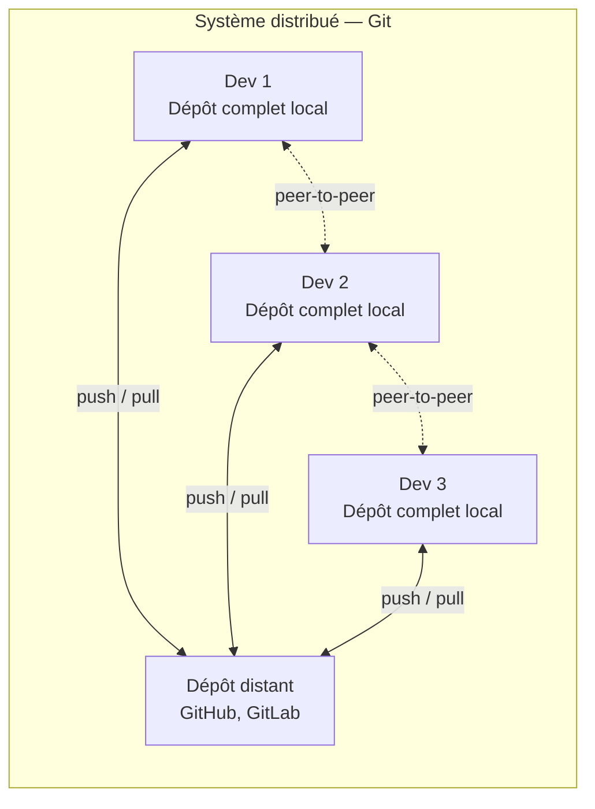
```mermaid
flowchart TB
    subgraph "Système distribué — Git"
        direction TB
        C1["Dépôt distant\nGitHub, GitLab"]
        D1["Dev 1<br />Dépôt complet local"]
        D2["Dev 2<br />Dépôt complet local"]
        D3["Dev 3<br />Dépôt complet local"]

        D1 <-->|push / pull| C1
        D2 <-->|push / pull| C1
        D3 <-->|push / pull| C1

        D1 <-.->|peer-to-peer| D2
        D2 <-.->|peer-to-peer| D3
    end
```

Dans un système distribué comme Git, chaque développeur possède un clone complet du dépôt incluant l'historique entier. Le dépôt distant sert de point de synchronisation central, mais n'est pas indispensable au fonctionnement. Les développeurs peuvent travailler entièrement hors ligne, créer des commits et des branches, et échanger directement entre eux sans passer par le serveur central.

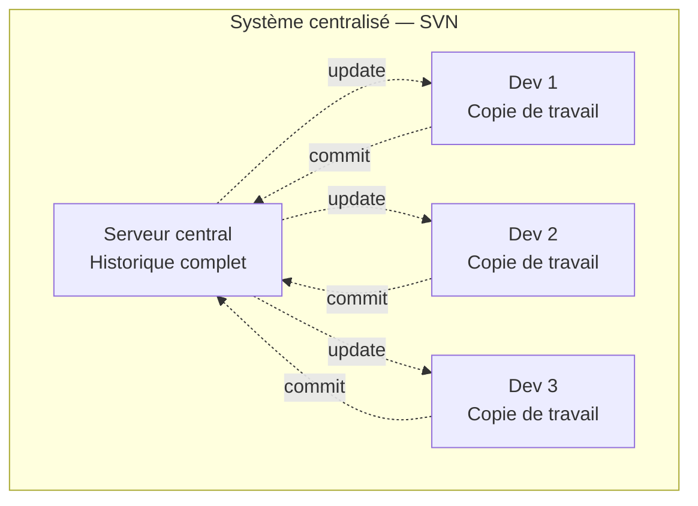
```mermaid
flowchart LR
    subgraph "Système centralisé — SVN"
        direction LR
        A1["Serveur central<br />Historique complet"]
        B1["Dev 1<br />Copie de travail"]
        B2["Dev 2<br />Copie de travail"]
        B3["Dev 3<br />Copie de travail"]

        B1 -.->|commit| A1
        B2 -.->|commit| A1
        B3 -.->|commit| A1

        A1 -.->|update| B1
        A1 -.->|update| B2
        A1 -.->|update| B3
    end
```

Dans un système centralisé comme SVN, seul le serveur possède l'historique complet. Les développeurs ne disposent que d'une copie de travail de la dernière version. Toute opération nécessite une connexion au serveur. Si ce dernier tombe, tout le travail collaboratif s'arrête et l'historique peut être perdu définitivement.

| Critère | Git — distribué | SVN — centralisé |
|---|---|---|
| Travail hors ligne | Oui — commit, branches, merge sans réseau | Non |
| Rapidité | Toutes les opérations sont locales sauf push/pull | Dépend du réseau |
| Redondance | Chaque clone est une sauvegarde complète | Un seul point de défaillance |
| Sécurité | Perte du serveur central sans perte de données | Perte du serveur = perte de l'historique |

### Les trois zones

!!! note "L'image ci-dessous représente les trois zones Git et les commandes qui transitent entre elles. C'est le concept fondamental le plus mal compris — comprendre ces zones supprime 80 % des confusions sur git add, git commit, git push et git restore."


<p><em>Git organise les fichiers en quatre zones distinctes. Le répertoire de travail (working directory) contient les fichiers modifiables sur le disque. La zone de staging (index) contient les modifications sélectionnées pour le prochain commit — c'est ici que l'on construit des commits logiques et atomiques. Le dépôt local contient l'historique permanent des commits dans le répertoire .git/. Le dépôt distant (GitHub, GitLab) est le point de synchronisation entre collaborateurs. Chaque commande Git déplace les modifications entre ces zones dans un sens précis.</em></p>

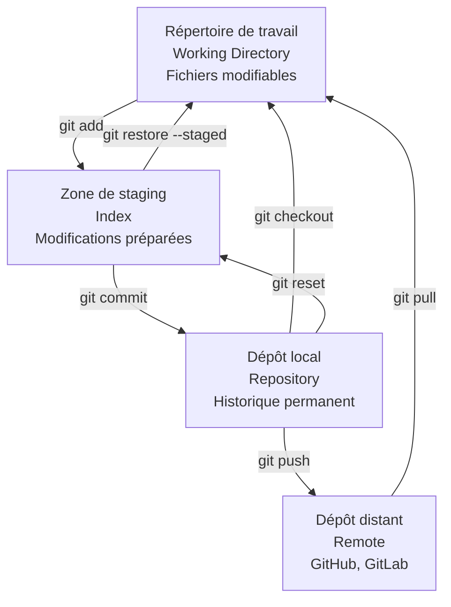
```mermaid
flowchart TB
    A["Répertoire de travail<br />Working Directory<br />Fichiers modifiables"]
    B["Zone de staging<br />Index<br />Modifications préparées"]
    C["Dépôt local<br />Repository<br />Historique permanent"]
    D["Dépôt distant<br />Remote<br />GitHub, GitLab"]

    A -->|"git add"| B
    B -->|"git commit"| C
    C -->|"git push"| D

    D -->|"git pull"| A
    C -->|"git checkout"| A
    B -->|"git restore --staged"| A
    C -->|"git reset"| B
```

### Objets Git

!!! note "L'image ci-dessous représente le modèle d'objets Git et la chaîne de hashes qui garantit l'intégrité de l'historique. Comprendre cette structure explique pourquoi Git est inviolable et comment fonctionne l'intégrité cryptographique."


<p><em>Git stocke l'information sous forme d'objets identifiés par des hashes SHA-1. Un commit contient les métadonnées (auteur, date, message) et pointe vers un tree. Le tree représente la structure de répertoires et pointe vers des blobs. Chaque blob contient le contenu binaire d'un fichier. Modifier un fichier change son hash (blob), ce qui change le hash du tree, ce qui change le hash du commit. Cette chaîne garantit l'intégrité totale de l'historique — toute falsification est immédiatement détectable.</em></p>

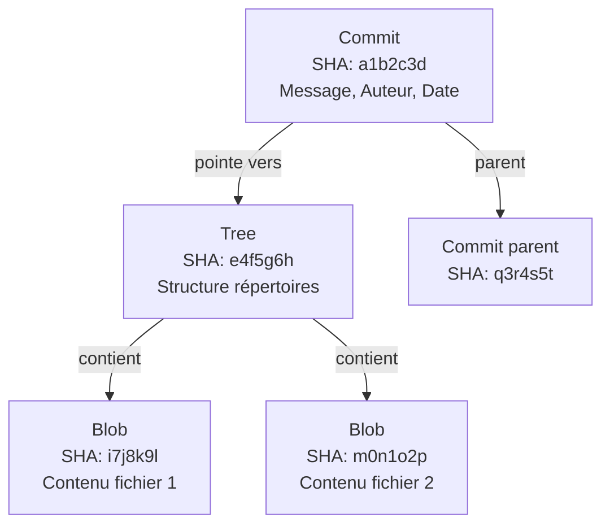
```mermaid
flowchart TB
    A["Commit<br />SHA: a1b2c3d<br />Message, Auteur, Date"]
    B["Tree<br />SHA: e4f5g6h<br />Structure répertoires"]
    C["Blob<br />SHA: i7j8k9l<br />Contenu fichier 1"]
    D["Blob<br />SHA: m0n1o2p<br />Contenu fichier 2"]
    E["Commit parent<br />SHA: q3r4s5t"]

    A -->|"pointe vers"| B
    A -->|"parent"| E
    B -->|"contient"| C
    B -->|"contient"| D
```

| Type | Contenu | Rôle |
|---|---|---|
| Commit | Métadonnées (auteur, date, message) + pointeur vers tree | Snapshot du projet |
| Tree | Liste de blobs et sous-trees | Structure de répertoires |
| Blob | Contenu binaire d'un fichier | Données brutes |
| Tag | Référence annotée vers un commit | Marqueur de version |

!!! note "Similitude avec la blockchain"
    Git utilise le même principe fondamental que la blockchain : chaque commit référence son parent par son hash, créant une chaîne cryptographique immuable. Toute tentative de modification d'un commit ancien invalide tous les commits suivants. Git utilise SHA-1, un algorithme aujourd'hui déprécié pour des applications critiques de sécurité. Git migre progressivement vers SHA-256, mais SHA-1 reste suffisant pour l'intégrité de versioning de code où les attaques par collision sont peu pertinentes.

<br />

---

## Configuration initiale

### Installation

=== ":fontawesome-brands-ubuntu: Linux Debian, Ubuntu"

    ```bash title="Bash — installation Git sur Debian et Ubuntu"
    apt update
    apt install git
    ```

=== ":fontawesome-brands-fedora: Linux Fedora, RHEL"

    ```bash title="Bash — installation Git sur Fedora et RHEL"
    dnf install git
    ```

=== ":fontawesome-brands-apple: macOS"

    ```bash title="Bash — installation Git sur macOS"
    # Via Homebrew
    brew install git

    # Via Xcode Command Line Tools
    xcode-select --install
    ```

=== ":fontawesome-brands-windows: Windows"

    Télécharger depuis [git-scm.com](https://git-scm.com). Git pour Windows inclut Git Bash, un terminal Unix-like.

```bash title="Bash — vérifier la version installée"
git --version
# git version 2.43.0
```

!!! note "Universalité des commandes Git"
    Quel que soit le système d'exploitation — Linux, macOS, Windows — les commandes Git sont identiques. `git commit`, `git push`, `git branch` fonctionnent exactement de la même manière partout. Cette uniformité permet de travailler sans friction sur différents environnements.

### Configuration utilisateur

```bash title="Bash — configuration globale — obligatoire avant le premier commit"
# Identité — apparaîtra dans tous les commits
git config --global user.name "Alice Dupont"
git config --global user.email "alice@example.com"

# Éditeur par défaut pour les messages de commit
git config --global core.editor "vim"
git config --global core.editor "code --wait"  # VS Code
git config --global core.editor "nano"

# Outil de merge
git config --global merge.tool vimdiff

# Couleurs dans le terminal
git config --global color.ui auto
```

| Niveau | Portée | Fichier | Priorité |
|---|---|---|---|
| `--system` | Tous les utilisateurs du système | `/etc/gitconfig` | Basse |
| `--global` | Utilisateur actuel | `~/.gitconfig` | Moyenne |
| `--local` | Dépôt actuel uniquement | `.git/config` | Haute |

```bash title="Bash — visualiser la configuration"
# Toute la configuration effective
git config --list

# Configuration globale uniquement
git config --global --list

# Valeur d'une option spécifique
git config user.name

# Voir l'origine d'une option (quel fichier la définit)
git config --show-origin user.email
```

### Alias utiles

```bash title="Bash — configurer des alias Git"
# Raccourcis de commandes courantes
git config --global alias.st status
git config --global alias.co checkout
git config --global alias.br branch
git config --global alias.ci commit
git config --global alias.unstage 'reset HEAD --'

# Log graphique avec couleurs
git config --global alias.lg "log --graph --pretty=format:'%Cred%h%Creset -%C(yellow)%d%Creset %s %Cgreen(%cr) %C(bold blue)<%an>%Creset' --abbrev-commit"

# Branches récentes par date
git config --global alias.recent 'for-each-ref --sort=-committerdate --format="%(committerdate:short) %(refname:short)" refs/heads/'
```

<br />

---

## Commandes fondamentales

### Initialisation d'un dépôt

```bash title="Bash — créer un nouveau dépôt"
mkdir mon-projet
cd mon-projet

# Initialiser Git — crée le répertoire .git/
git init
```

```bash title="Bash — cloner un dépôt existant"
# Clone complet depuis une URL
git clone https://github.com/utilisateur/projet.git

# Clone avec nom de répertoire personnalisé
git clone https://github.com/utilisateur/projet.git mon-nom

# Clone avec historique partiel — utile pour les grands dépôts
git clone --depth 1 https://github.com/utilisateur/projet.git

# Clone d'une branche spécifique
git clone -b develop https://github.com/utilisateur/projet.git
```

### État du dépôt

```bash title="Bash — inspecter l'état du dépôt"
# Statut complet
git status

# Statut court
git status -s
# M  fichier-modifie.txt    → modifié dans staging
#  M fichier-wd.txt         → modifié dans working directory
# A  fichier-ajoute.txt     → ajouté au staging
# ?? fichier-non-suivi.txt  → non suivi
```

| Code | Signification |
|---|---|
| `??` | Non suivi (untracked) |
| `A ` | Ajouté au staging |
| `M ` | Modifié dans staging |
| ` M` | Modifié dans working directory |
| `MM` | Modifié dans staging et working directory |
| `D ` | Supprimé dans staging |
| `R ` | Renommé |

### Ajouter des fichiers (staging)

```bash title="Bash — ajouter des fichiers au staging"
# Ajouter un fichier spécifique
git add fichier.txt

# Ajouter plusieurs fichiers
git add fichier1.txt fichier2.txt

# Ajouter tous les fichiers modifiés et nouveaux
git add .

# Ajouter tous les fichiers y compris les suppressions
git add -A

# Ajouter interactivement — choix fichier par fichier
git add -i

# Ajouter par morceaux — mode patch
git add -p
```

```bash title="Bash — réponses disponibles en mode patch (git add -p)"
# Stage this hunk [y,n,q,a,d,s,e,?]?
# y — stage ce morceau
# n — ne pas stage ce morceau
# q — quitter
# a — stage ce morceau et tous les suivants
# d — ne stage pas ce morceau ni les suivants
# s — découper en morceaux plus petits
# e — éditer manuellement le morceau
# ? — aide
```

### Créer des commits

```bash title="Bash — créer des commits"
# Commit avec message inline
git commit -m "Ajout fonctionnalité authentification"

# Commit avec éditeur pour message détaillé
git commit

# Commit avec staging automatique des fichiers modifiés (pas les nouveaux)
git commit -a -m "Correction bug login"

# Amender le dernier commit — modifier le message
git commit --amend -m "Nouveau message"

# Amender le dernier commit — ajouter des fichiers sans changer le message
git commit --amend --no-edit
```

```bash title="Bash — structure d'un message de commit"
# Type: Résumé court (50 caractères maximum)
#
# Description détaillée optionnelle expliquant le pourquoi
# des changements, pas le comment (le code montre le comment).
#
# - Point spécifique 1
# - Point spécifique 2
#
# Refs: #123
```

```bash title="Bash — types de commit conventionnels"
# feat:     Nouvelle fonctionnalité
# fix:      Correction de bug
# docs:     Documentation uniquement
# style:    Formatage — espaces, points-virgules
# refactor: Refactoring sans changement fonctionnel
# perf:     Amélioration de performance
# test:     Ajout ou correction de tests
# chore:    Tâches de maintenance — build, dépendances
```

### Visualiser l'historique

```bash title="Bash — consulter l'historique des commits"
# Log complet
git log

# Log avec graphe des branches et hashes courts
git log --graph --oneline --all

# Log avec statistiques de modifications
git log --stat

# Log avec diff complet
git log -p

# Les 5 derniers commits
git log -5

# Commits depuis une date
git log --since="2 weeks ago"
git log --after="2025-01-01"

# Commits par auteur
git log --author="Alice"

# Commits dont le message contient une expression
git log --grep="bug fix"

# Commits ayant modifié un fichier spécifique
git log -- fichier.txt

# Format personnalisé
git log --pretty=format:"%h - %an, %ar : %s"
```

| Placeholder | Signification |
|---|---|
| `%H` | Hash complet du commit |
| `%h` | Hash court du commit |
| `%an` | Nom de l'auteur |
| `%ae` | Email de l'auteur |
| `%ar` | Date relative (il y a 2 semaines) |
| `%s` | Message — sujet |

### Différences

```bash title="Bash — comparer des états du dépôt"
# Différences working directory vs staging
git diff

# Différences staging vs dernier commit
git diff --staged
git diff --cached  # Équivalent

# Différences entre deux commits
git diff commit1 commit2

# Statistiques de différences
git diff --stat

# Différences entre deux branches
git diff main..develop
```

### Annuler des modifications

```bash title="Bash — annuler des modifications dans le working directory"
# Restaurer un fichier depuis le dernier commit
git restore fichier.txt

# Restaurer tous les fichiers
git restore .

# Ancienne syntaxe — toujours valide
git checkout -- fichier.txt
```

```bash title="Bash — retirer des fichiers du staging"
# Retirer un fichier du staging sans modifier le fichier
git restore --staged fichier.txt

# Ancienne syntaxe
git reset HEAD fichier.txt
```

```bash title="Bash — annuler des commits"
# Créer un commit qui annule un commit précédent — non destructif
git revert <commit-hash>

# Revenir au commit précédent en conservant les modifications
git reset --soft HEAD~1

# Revenir au commit précédent en vidant le staging
git reset --mixed HEAD~1

# Revenir au commit précédent en effaçant tout (dangereux)
git reset --hard HEAD~1
```

| Option | Staging | Working Directory | Usage |
|---|---|---|---|
| `--soft` | Conservé | Conservé | Défaire un commit, garder tout le reste |
| `--mixed` (défaut) | Réinitialisé | Conservé | Défaire commit et staging |
| `--hard` | Réinitialisé | Réinitialisé | Tout effacer — irréversible |

<br />

---

## Branches

Les branches permettent de **développer des fonctionnalités en isolation** sans affecter le code principal. Elles sont légères — une branche est simplement un pointeur vers un commit.

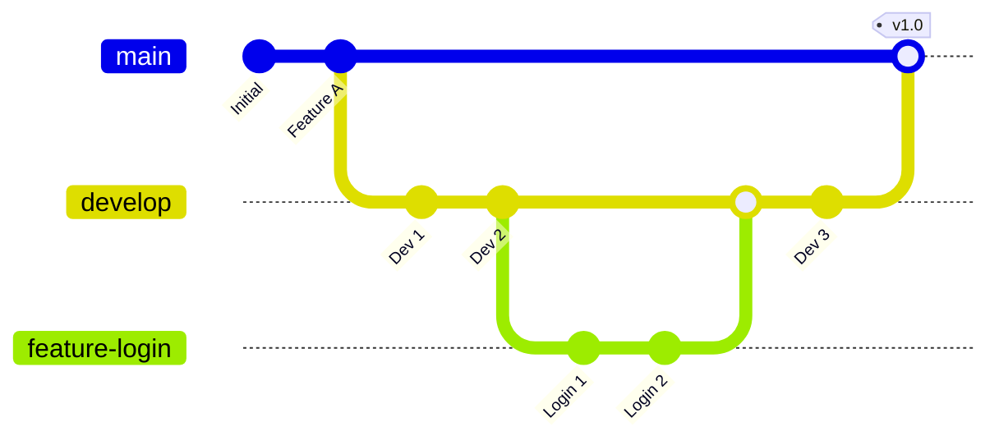
```mermaid
gitGraph
    commit id: "Initial"
    commit id: "Feature A"
    branch develop
    checkout develop
    commit id: "Dev 1"
    commit id: "Dev 2"
    branch feature-login
    checkout feature-login
    commit id: "Login 1"
    commit id: "Login 2"
    checkout develop
    merge feature-login
    commit id: "Dev 3"
    checkout main
    merge develop tag: "v1.0"
```

### Gestion des branches

```bash title="Bash — créer, basculer et supprimer des branches"
# Lister les branches locales
git branch

# Lister toutes les branches — locales et distantes
git branch -a

# Lister avec le dernier commit de chaque branche
git branch -v

# Créer une branche
git branch nouvelle-branche

# Créer et basculer sur une branche
git checkout -b nouvelle-branche
git switch -c nouvelle-branche  # Syntaxe moderne

# Basculer sur une branche existante
git checkout nom-branche
git switch nom-branche  # Syntaxe moderne

# Renommer la branche actuelle
git branch -m nouveau-nom

# Supprimer une branche fusionnée
git branch -d nom-branche

# Forcer la suppression d'une branche non fusionnée
git branch -D nom-branche

# Supprimer une branche distante
git push origin --delete nom-branche
```

### Fusion de branches — Merge

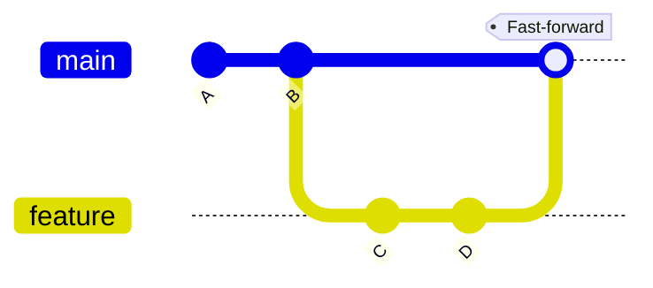
```mermaid
gitGraph
    commit id: "A"
    commit id: "B"
    branch feature
    checkout feature
    commit id: "C"
    commit id: "D"
    checkout main
    merge feature tag: "Fast-forward"
```

```bash title="Bash — fusion fast-forward"
# main n'a pas avancé depuis la création de la branche
# main avance simplement vers le dernier commit de feature
git checkout main
git merge feature-branch
```

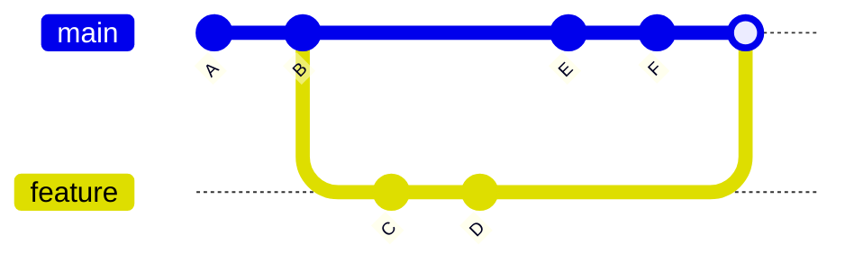
```mermaid
gitGraph
    commit id: "A"
    commit id: "B"
    branch feature
    checkout feature
    commit id: "C"
    commit id: "D"
    checkout main
    commit id: "E"
    commit id: "F"
    merge feature
```

```bash title="Bash — fusion three-way avec commit de merge"
# main a avancé pendant le développement de la branche
# Git crée un commit de merge avec deux parents
git checkout main
git merge feature-branch

# Toujours créer un commit de merge même si fast-forward possible
git merge --no-ff feature-branch
```

### Résolution de conflits

```bash title="Bash — diagnostiquer et résoudre un conflit de merge"
# Exemple de sortie lors d'un conflit
# Auto-merging fichier.txt
# CONFLICT (content): Merge conflict in fichier.txt
# Automatic merge failed; fix conflicts and then commit the result.

# Voir les fichiers en conflit
git status
git diff --name-only --diff-filter=U
```

```bash title="Bash — marqueurs de conflit dans un fichier"
# <<<<<<< HEAD
# Contenu de la branche actuelle (main)
# =======
# Contenu de la branche à fusionner (feature-branch)
# >>>>>>> feature-branch
```

```bash title="Bash — résolution manuelle d'un conflit"
# 1. Éditer le fichier — supprimer les marqueurs et garder le bon contenu
# 2. Ajouter le fichier résolu
git add fichier.txt

# 3. Finaliser le merge
git commit -m "Merge feature-branch — résolution conflits"

# Utiliser l'outil de merge configuré
git mergetool

# Abandonner le merge et revenir à l'état précédent
git merge --abort
```

### Rebase

!!! note "L'image ci-dessous compare le merge et le rebase sur un exemple concret. C'est la source de confusion la plus fréquente chez les utilisateurs Git intermédiaires — et la règle d'or du rebase est le point de sécurité le plus important à retenir."

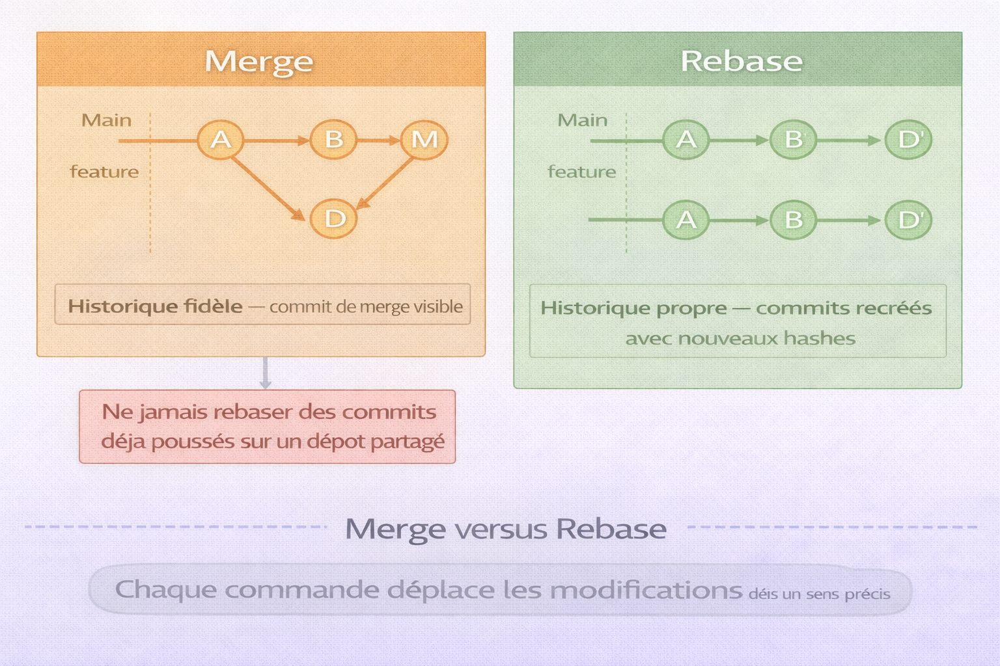

<p><em>Le merge préserve l'historique exact avec un commit de merge visible — l'historique est non linéaire mais fidèle à la réalité. Le rebase réécrit l'historique en rejouant les commits sur une nouvelle base — l'historique est linéaire et propre mais les commits sont recréés avec de nouveaux hashes. Le rebase sur des branches déjà partagées crée des divergences catastrophiques pour les collaborateurs qui ont basé leur travail sur les anciens commits.</em></p>

```bash title="Bash — rebase standard"
# Rebaser la branche actuelle sur main
git checkout feature-branch
git rebase main
```

```bash title="Bash — rebase interactif — modifier l'historique"
git rebase -i HEAD~3

# L'éditeur s'ouvre avec la liste des commits :
# pick abc1234 Premier commit
# pick def5678 Deuxième commit
# pick ghi9012 Troisième commit
#
# pick   — utiliser le commit tel quel
# reword — modifier le message
# edit   — s'arrêter pour amendement
# squash — fusionner avec le commit précédent
# fixup  — comme squash mais ignore le message
# drop   — supprimer le commit
```

!!! danger "Règle absolue du rebase"
    Ne jamais rebaser des commits déjà poussés sur un dépôt partagé. Le rebase réécrit l'historique et crée des divergences catastrophiques pour les collaborateurs qui ont basé leur travail sur les anciens commits.

<br />

---

## Dépôts distants

### Configuration des remotes

```bash title="Bash — gérer les dépôts distants"
# Lister les remotes
git remote
git remote -v  # Avec URLs

# Ajouter un remote
git remote add origin https://github.com/user/repo.git

# Voir les détails d'un remote
git remote show origin

# Changer l'URL d'un remote
git remote set-url origin https://github.com/user/nouveau-repo.git

# Supprimer un remote
git remote remove origin
```

### Push — envoyer vers le remote

```bash title="Bash — pousser des commits vers le remote"
# Push de la branche actuelle
git push origin main

# Push et définir le tracking de la branche distante
git push -u origin nouvelle-branche

# Push de toutes les branches
git push --all origin

# Push des tags
git push --tags

# Force push plus sûr — refuse si le remote a avancé depuis le dernier fetch
git push --force-with-lease origin main

# Supprimer une branche distante
git push origin --delete ancienne-branche
```

### Pull — récupérer depuis le remote

```bash title="Bash — récupérer et intégrer les commits distants"
# Fetch + merge
git pull origin main

# Fetch + rebase — historique plus linéaire
git pull --rebase origin main

# Fetch uniquement — sans toucher au working directory
git fetch origin

# Fetch toutes les branches
git fetch --all

# Supprimer les références distantes obsolètes
git fetch --prune
```

`fetch` télécharge les commits distants sans toucher au working directory. `pull` enchaîne fetch et merge ou rebase automatiquement.

### Workflows courants

```bash title="Bash — workflow centralisé simple"
# 1. Récupérer les dernières modifications
git pull origin main

# 2. Travailler localement
git add .
git commit -m "Ajout fonctionnalité"

# 3. Envoyer les modifications
git push origin main
```

```bash title="Bash — workflow avec branches de fonctionnalité"
# 1. Créer une branche pour la fonctionnalité
git checkout -b feature/authentication

# 2. Développer et commiter
git add .
git commit -m "Implémenter login"

# 3. Pousser la branche
git push -u origin feature/authentication

# 4. Créer une Pull Request sur GitHub ou GitLab

# 5. Après review et merge, nettoyer
git checkout main
git pull origin main
git branch -d feature/authentication
```

### Workflow Gitflow

!!! note "L'image ci-dessous représente l'organisation des branches dans Gitflow. C'est le workflow de référence en environnement enterprise — comprendre le rôle de chaque type de branche évite les erreurs d'organisation courantes."

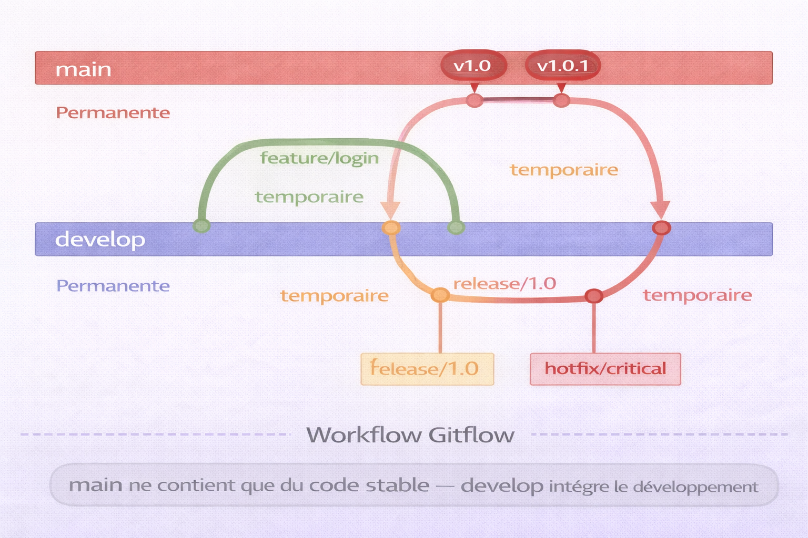

<p><em>Gitflow organise le développement autour de deux branches permanentes — main pour la production et develop pour l'intégration — et trois types de branches temporaires. Les branches feature/* partent de develop pour les nouvelles fonctionnalités. Les branches release/* partent de develop pour préparer une version et fusionnent dans main et develop. Les branches hotfix/* partent de main pour les corrections urgentes en production et fusionnent dans main et develop. Ce schéma garantit que main ne contient que du code stable et déployé.</em></p>

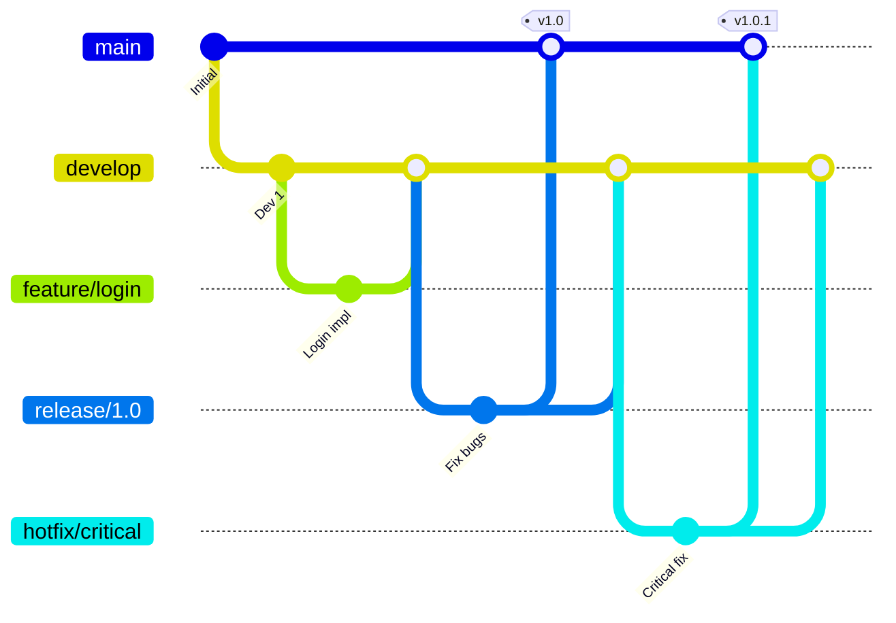
```mermaid
gitGraph
    commit id: "Initial"
    branch develop
    checkout develop
    commit id: "Dev 1"
    branch feature/login
    checkout feature/login
    commit id: "Login impl"
    checkout develop
    merge feature/login
    branch release/1.0
    checkout release/1.0
    commit id: "Fix bugs"
    checkout main
    merge release/1.0 tag: "v1.0"
    checkout develop
    merge release/1.0
    branch hotfix/critical
    checkout hotfix/critical
    commit id: "Critical fix"
    checkout main
    merge hotfix/critical tag: "v1.0.1"
    checkout develop
    merge hotfix/critical
```

| Branche | Durée de vie | Rôle |
|---|---|---|
| main | Permanente | Code de production |
| develop | Permanente | Intégration du développement |
| feature/* | Temporaire | Nouvelles fonctionnalités |
| release/* | Temporaire | Préparation d'une version |
| hotfix/* | Temporaire | Corrections urgentes production |

<br />

---

## Tags

Les tags marquent des points spécifiques de l'historique pour identifier des versions ou des releases.

```bash title="Bash — créer et gérer des tags"
# Tag léger — simple pointeur vers un commit
git tag v1.0.0

# Tag annoté — avec message et métadonnées
git tag -a v1.0.0 -m "Version 1.0.0 stable"

# Tagger un commit spécifique
git tag -a v0.9.0 abc1234 -m "Version 0.9.0"

# Lister les tags
git tag
git tag -l "v1.*"  # Filtrer par pattern

# Pousser un tag spécifique
git push origin v1.0.0

# Pousser tous les tags
git push origin --tags

# Supprimer un tag local
git tag -d v1.0.0

# Supprimer un tag distant
git push origin --delete v1.0.0
```

```bash title="Bash — versioning sémantique"
# v{MAJOR}.{MINOR}.{PATCH}
# v1.2.3
# │ │ └─ PATCH : corrections de bugs
# │ └─── MINOR : nouvelles fonctionnalités compatibles
# └───── MAJOR : changements incompatibles
```

<br />

---

## Fichier .gitignore

```gitignore title="Gitignore — syntaxe et patterns courants"
# Commentaire

# Ignorer tous les fichiers .log
*.log

# Ignorer le répertoire node_modules/
node_modules/

# Ignorer les fichiers .env sauf .env.example
.env
.env.*
!.env.example

# Ignorer les fichiers de build
dist/
build/
*.pyc
__pycache__/

# Ignorer les fichiers IDE
.vscode/
.idea/
*.swp

# Ignorer les fichiers système
.DS_Store
Thumbs.db
```

```gitignore title="Gitignore — patterns par langage"
# Python
__pycache__/
*.py[cod]
venv/
.env

# Node.js
node_modules/
npm-debug.log*
.eslintcache

# Java
*.class
*.jar
target/

# Rust
target/
Cargo.lock

# Secrets — ne jamais commiter
.env
secrets.yml
*.pem
*.key
```

```bash title="Bash — diagnostiquer les fichiers ignorés"
# Lister les fichiers ignorés
git status --ignored

# Vérifier si un fichier spécifique est ignoré et pourquoi
git check-ignore -v fichier.txt

# Forcer l'ajout d'un fichier ignoré
git add -f fichier-ignore.txt
```

GitHub maintient des templates `.gitignore` pour chaque langage : [github.com/github/gitignore](https://github.com/github/gitignore)

<br />

---

## Stash — mise de côté

Le stash permet de sauvegarder temporairement des modifications non commitées pour basculer rapidement sur une autre tâche.

```bash title="Bash — sauvegarder et restaurer avec git stash"
# Sauvegarder les modifications en cours
git stash

# Sauvegarder avec un message descriptif
git stash save "WIP: feature login"

# Lister les stashes
git stash list
# stash@{0}: WIP on main: abc1234 Last commit
# stash@{1}: On feature: def5678 Previous stash

# Appliquer le dernier stash sans le supprimer
git stash apply

# Appliquer et supprimer le dernier stash
git stash pop

# Appliquer un stash spécifique
git stash apply stash@{1}

# Voir le contenu d'un stash
git stash show -p stash@{0}

# Supprimer tous les stashes
git stash clear

# Créer une branche depuis un stash
git stash branch nouvelle-branche stash@{0}
```

```bash title="Bash — cas d'usage typique du stash"
# Travail en cours sur une fonctionnalité
# Urgence : correction de bug sur main

git stash save "WIP: authentication feature"

git checkout main
# corriger le bug
git commit -m "Fix critical bug"

# Retour sur la fonctionnalité
git checkout feature-branch
git stash pop
```

<br />

---

## Recherche et navigation

### Recherche dans le code

```bash title="Bash — rechercher dans le code versionné"
# Rechercher une expression dans les fichiers suivis
git grep "function login"

# Avec numéro de ligne
git grep -n "function login"

# Dans un commit spécifique
git grep "function login" abc1234

# Compter les occurrences
git grep -c "TODO"

# Sans distinction majuscules/minuscules
git grep -i "password"
```

### Recherche dans l'historique

```bash title="Bash — retrouver l'origine d'un bug avec git bisect"
# Identifier le commit qui a introduit un bug (dichotomie automatique)
git bisect start
git bisect bad              # Le commit actuel est mauvais
git bisect good abc1234     # Ce commit était bon
# Git checkout automatiquement des commits intermédiaires
# Tester et marquer good ou bad jusqu'à trouver le commit responsable
git bisect reset            # Terminer la recherche

# Trouver qui a modifié chaque ligne d'un fichier
git blame fichier.txt
git blame -L 10,20 fichier.txt  # Plage de lignes

# Trouver quand une ligne ou un texte a été supprimé
git log -S "texte supprimé" -- fichier.txt

# Voir l'historique d'un fichier y compris après renommage
git log --follow fichier.txt
```

### Navigation dans l'historique

```bash title="Bash — naviguer dans l'historique"
# Revenir à un commit spécifique — mode detached HEAD
git checkout abc1234

# Revenir à la branche précédente
git checkout -

# Revenir à l'état il y a N commits
git checkout HEAD~3

# Créer une branche depuis un commit ancien
git checkout -b hotfix abc1234
```

<br />

---

## Nettoyage et maintenance

```bash title="Bash — nettoyage du dépôt"
# Voir ce qui serait supprimé sans agir (dry-run)
git clean -n

# Supprimer les fichiers non suivis
git clean -f

# Supprimer aussi les répertoires non suivis
git clean -fd

# Supprimer aussi les fichiers ignorés
git clean -fdx

# Optimiser et compresser le dépôt
git gc

# Vérifier l'intégrité du dépôt
git fsck

# Nettoyer les références distantes obsolètes
git remote prune origin

# Compression agressive
git gc --aggressive --prune=now
```

<br />

---

## Hooks

Les hooks sont des scripts exécutés automatiquement lors d'événements Git. Ils sont stockés dans `.git/hooks/`.

| Hook | Événement | Usage typique |
|---|---|---|
| `pre-commit` | Avant commit | Linting, tests |
| `prepare-commit-msg` | Avant édition message | Template de message |
| `commit-msg` | Après édition message | Validation format message |
| `post-commit` | Après commit | Notification |
| `pre-push` | Avant push | Tests, validation |
| `post-receive` | Après réception — serveur | Déploiement automatique |

```bash title="Bash — hook pre-commit — bloquer si tests échouent"
#!/bin/sh
# .git/hooks/pre-commit

npm test

if [ $? -ne 0 ]; then
    echo "Tests failed. Commit aborted."
    exit 1
fi
```

```bash title="Bash — rendre un hook exécutable"
chmod +x .git/hooks/pre-commit
```

<br />

---

## Sous-modules

Les sous-modules permettent d'inclure un dépôt Git dans un autre — utile pour les dépendances partagées.

```bash title="Bash — gérer les sous-modules"
# Ajouter un sous-module
git submodule add https://github.com/user/lib.git libs/external-lib

# Initialiser les sous-modules après clone
git submodule init
git submodule update

# Clone avec initialisation automatique des sous-modules
git clone --recurse-submodules https://github.com/user/projet.git

# Mettre à jour tous les sous-modules
git submodule update --remote

# Supprimer un sous-module
git submodule deinit libs/external-lib
git rm libs/external-lib
rm -rf .git/modules/libs/external-lib
```

<br />

---

## Bonnes pratiques

### Messages de commit

```bash title="Bash — exemple de message de commit complet"
# feat: Implémenter authentification JWT
#
# Ajout d'un système d'authentification basé sur JWT pour
# sécuriser l'API REST. Les tokens expirent après 24h et
# doivent être renouvelés via le endpoint /refresh.
#
# - Middleware de validation de token
# - Génération de tokens avec claims personnalisés
# - Tests unitaires des fonctions crypto
# - Documentation API mise à jour
#
# Refs: #123
```

Règles fondamentales : ligne de sujet 50 caractères maximum, ligne vide entre sujet et corps, corps à 72 caractères par ligne, utiliser l'impératif présent ("Add feature" pas "Added feature"), expliquer le pourquoi et non le comment.

### Commits atomiques

```bash title="Bash — structure correcte versus incorrecte"
# Correct — chaque commit est une unité logique
# commit 1: feat: Add user registration endpoint
# commit 2: test: Add tests for user registration
# commit 3: docs: Update API documentation for registration

# Incorrect — commits non atomiques
# commit 1: WIP
# commit 2: fix stuff
# commit 3: final commit (registration + tests + docs + unrelated changes)
```

### Historique linéaire

```bash title="Bash — maintenir un historique propre avant merge"
# Rebaser sur main avant de merger
git checkout feature-branch
git rebase main
git checkout main
git merge --no-ff feature-branch

# Squash de tous les commits de la branche en un seul
git checkout main
git merge --squash feature-branch
git commit -m "feat: Complete authentication system"
```

### Sécurité — ne jamais commiter de secrets

!!! note "L'image ci-dessous représente le pipeline de prévention des secrets dans un workflow Git. La sécurité doit être intégrée avant le commit — pas après."

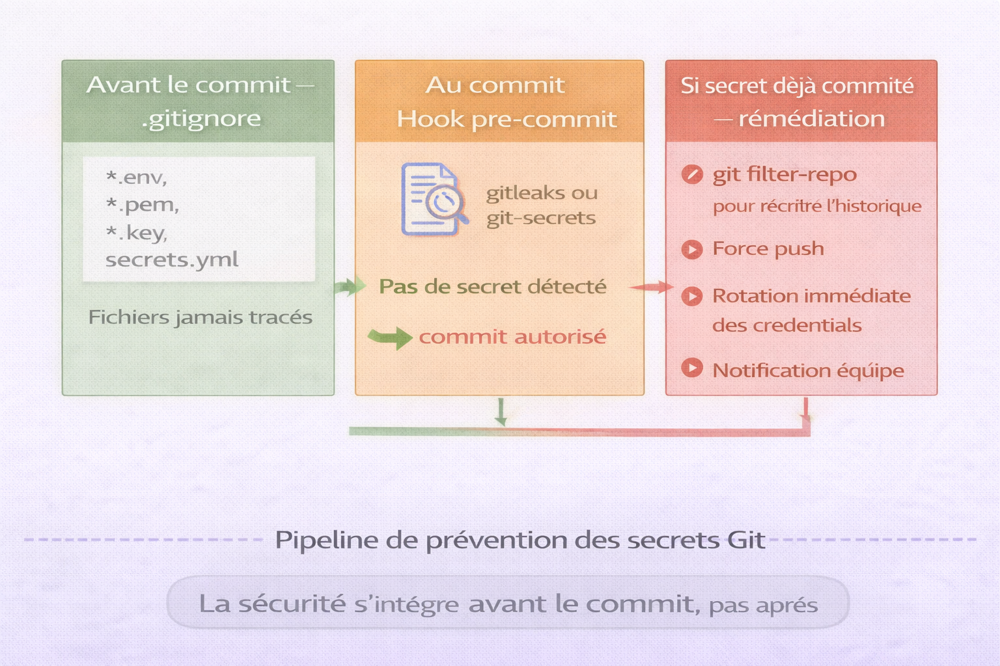

<p><em>La prévention des secrets commitésrepose sur trois niveaux. En amont, le fichier .gitignore exclut les fichiers sensibles avant même qu'ils soient tracés. Au moment du commit, un hook pre-commit avec git-secrets ou gitleaks scanne les modifications et bloque le commit si un secret est détecté. En cas de secret déjà commité, la procédure de remédiation combine git filter-repo pour réécrire l'historique, un force push pour mettre à jour le remote, la rotation immédiate des credentials compromis et la notification de l'équipe.</em></p>

```bash title="Bash — ne jamais commiter ces types de fichiers"
# Mots de passe
# Clés API
# Tokens d'accès
# Certificats privés (.pem, .key)
# Fichiers .env avec valeurs réelles
# Données sensibles
```

```bash title="Bash — remédiation si secret committé par erreur"
# Supprimer un fichier de tout l'historique — méthode moderne
git filter-repo --path secrets.txt --invert-paths

# Forcer le push — avertir toute l'équipe
git push --force --all
git push --force --tags

# OBLIGATOIRE : rotation immédiate des credentials compromis
# Un secret poussé même brièvement doit être considéré comme compromis
```

```bash title="Bash — prévention automatique avec hooks"
# Scanner avec gitleaks en pre-commit
# Installation
brew install gitleaks

# Détecter les secrets dans le dépôt
gitleaks detect

# Hook pre-commit
# gitleaks protect --staged --redact
```

<br />

---

## Conclusion

!!! quote "Ce qu'il faut retenir"
    L'outil git est un compagnon quotidien dans la vie d'un professionnel de l'IT. Sa maîtrise ne s'acquiert pas en le lisant, mais par une pratique constante. Automatisez au maximum son utilisation pour qu'il devienne une seconde nature.

!!! quote "Conclusion"
    _Git a transformé le développement logiciel en permettant une collaboration massive et asynchrone à une échelle jamais vue. Des milliers de développeurs contribuent simultanément au noyau Linux ou à Kubernetes sans coordination centralisée, grâce à l'architecture distribuée de Git. La courbe d'apprentissage est réelle — staging area, commits, branches, merge versus rebase, remote tracking branches — mais cette complexité cache une puissance remarquable. Une fois maîtrisé, Git devient invisible : on ne pense plus à l'outil, on pense au code et à son évolution. Git n'est pas qu'un système de versioning — c'est un système de gestion de l'historique qui permet de tracer chaque décision, chaque modification, chaque bug introduit et corrigé. L'historique Git bien entretenu devient une documentation vivante du projet. Maîtriser Git, c'est comprendre que le versioning est une discipline, pas une contrainte. Les pratiques qui semblent fastidieuses au départ — messages de commit détaillés, commits atomiques, branches descriptives — deviennent naturelles et multiplient l'efficacité de toute l'équipe._

<br />