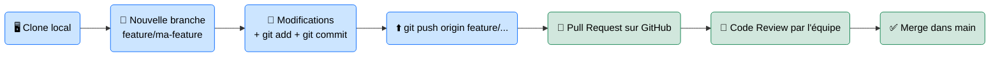

# GitHub — La Place Publique du Code

<div
  class="omny-meta"
  data-level="🟢 Débutant & 🟡 Intermédiaire"
  data-version="2024"
  data-time="~30 minutes">
</div>

## Introduction

!!! quote "Analogie pédagogique — Google Drive pour le Code Professionnel"
    Imaginez que vous travaillez sur un roman avec 5 co-auteurs. Si tout le monde modifie le même fichier Word en même temps, vous obtenez un chaos de conflits et de versions perdues. **GitHub** est le système qui donne un exemplaire à chaque auteur, trace chaque modification (qui a changé quoi, quand et pourquoi), et permet de fusionner proprement le travail de tous.

    La différence avec Google Drive ? GitHub sait comparer deux versions d'un fichier ligne par ligne, nommer précisément chaque ensemble de modifications (un **commit**), et gérer des dizaines de branches de travail en parallèle sans jamais perdre l'historique.

GitHub est construit sur **Git** (le système de versioning local) mais y ajoute une couche de collaboration en ligne, de revue de code, d'automatisation (CI/CD) et de gestion de projet. Il est devenu le standard de facto de l'industrie du logiciel.

<br>

---

## Concepts Fondamentaux

### Les entités clés

| Entité | Définition | Analogie |
|---|---|---|
| **Repository** | Dossier de projet versionné (local + distant) | Le dossier partagé de l'équipe |
| **Branch** | Ligne de développement parallèle | Une copie de travail isolée |
| **Commit** | Snapshot nommé d'un ensemble de modifications | Une sauvegarde avec un titre |
| **Pull Request (PR)** | Demande de fusion d'une branche dans une autre | La soumission d'un travail pour relecture |
| **Issue** | Ticket de suivi (bug, feature, tâche) | Un post-it numérique |
| **Fork** | Copie indépendante d'un repository externe | Un clone sous votre propre contrôle |

### Le workflow Git/GitHub standard



_Le flux de travail **Git Flow** est universel : on ne travaille jamais directement sur `main`. On crée une branche, on pousse, on demande une revue via Pull Request, et on fusionne après validation._

<br>

---

## Commandes Essentielles

### 1. Cloner un repository

```bash title="Récupérer un projet distant"
# Cloner via HTTPS (mot de passe ou token)
git clone https://github.com/username/mon-projet.git

# Cloner via SSH (clé SSH configurée — recommandé)
git clone git@github.com:username/mon-projet.git

cd mon-projet
```

_Après le clone, votre répertoire local est synchronisé avec la branche principale (`main`) du dépôt distant._

### 2. Créer et basculer sur une branche

```bash title="Gestion des branches"
# Créer et basculer en une commande
git checkout -b feature/ajout-login

# Vérifier sur quelle branche vous êtes
git branch
```

### 3. Travailler, committer et pousser

```bash title="Cycle commit → push"
# Voir les fichiers modifiés
git status

# Ajouter des fichiers au prochain commit
git add src/auth/login.php

# Tout ajouter (attention : vérifier git status avant)
git add .

# Créer le commit avec un message explicite
git commit -m "feat: ajouter le formulaire de connexion avec validation CSRF"

# Pousser la branche vers GitHub
git push origin feature/ajout-login
```

_La convention de nommage des commits **Conventional Commits** (`feat:`, `fix:`, `docs:`, `chore:`) est adoptée dans la majorité des projets professionnels. Elle permet de générer des changelogs automatiques et de lire l'historique d'un coup d'œil._

### 4. Rester synchronisé avec `main`

```bash title="Mise à jour de votre branche"
# Récupérer les derniers changements de main
git fetch origin
git rebase origin/main

# OU (merge)
git pull origin main
```

<br>

---

## GitHub Actions — Automatisation CI/CD

Les **GitHub Actions** permettent de déclencher des workflows automatiques à chaque Push, Pull Request, ou selon un calendrier.

```yaml title=".github/workflows/ci.yml — Pipeline de test automatique"
name: CI Pipeline

# Déclencher à chaque Pull Request vers main
on:
  pull_request:
    branches: [ main ]

jobs:
  test:
    runs-on: ubuntu-latest

    steps:
      # 1. Récupérer le code
      - name: Checkout
        uses: actions/checkout@v4

      # 2. Installer PHP
      - name: Setup PHP
        uses: shivammathur/setup-php@v2
        with:
          php-version: '8.3'

      # 3. Installer les dépendances
      - name: Install dependencies
        run: composer install

      # 4. Lancer les tests
      - name: Run PHPUnit
        run: php artisan test
```

_Ce workflow garantit qu'aucun code cassé ne sera fusionné dans `main` : GitHub bloquera automatiquement la Pull Request si les tests échouent._

<br>

---

## Bonnes Pratiques Professionnelles

| Règle | Explication |
|---|---|
| **Branch protection** sur `main` | Interdire les pushes directs, exiger une PR et une review |
| **Commits atomiques** | Un commit = une modification logique. Jamais `fix stuff` |
| **`.gitignore` exhaustif** | Ne jamais committer `.env`, `node_modules/`, `vendor/` |
| **Secrets via GitHub Secrets** | Les tokens et clés API via `Settings → Secrets`, jamais dans le code |
| **Releases taguées** | Utiliser les tags sémantiques (`v1.2.0`) pour marquer les versions de production |

<br>

---

## Conclusion

!!! quote "Ce qu'il faut retenir"
    GitHub n'est pas un simple hébergement de code — c'est un **système nerveux de collaboration** pour les équipes de développement. La Pull Request est l'unité de travail fondamentale : elle centralise le code, la discussion, les tests automatiques et la décision de fusion. Maîtriser le workflow `branche → commit → PR → merge` est le prérequis absolu pour tout développeur professionnel.

> [GitLab — L'alternative auto-hébergée →](./gitlab.md)