# GitLab — Le Studio DevSecOps Intégré

<div
  class="omny-meta"
  data-level="🟢 Débutant & 🟡 Intermédiaire"
  data-version="17.x"
  data-time="~30 minutes">
</div>

## Introduction

!!! quote "Analogie pédagogique — L'Atelier Complet vs l'Outillerie Spécialisée"
    Imaginez que GitHub est une excellente boutique de matériaux de construction : le bois est parfait, bien rangé, collaboratif. Mais pour construire votre maison, vous devez encore appeler un électricien (GitHub Actions), un plombier (un outil de suivi de tickets externe), et un bureau d'architecte (une plateforme de déploiement tierce).

    **GitLab** est l'atelier intégré : le code, les tickets, les pipelines CI/CD, le registre Docker, le scanner de sécurité, et le déploiement continu sont **tous sous le même toit**, sans intégration externe. C'est le choix des équipes qui valorisent la cohérence et la souveraineté sur leurs outils.

GitLab est disponible en deux versions : **GitLab.com** (SaaS hébergé) et **GitLab CE/EE** (auto-hébergé), ce qui en fait la référence pour les organisations qui ne souhaitent pas externaliser leur code source.

<br>

---

## GitLab vs GitHub — Différences Clés

```mermaid
flowchart TD
    classDef gh fill:#cce5ff,stroke:#0d6efd,color:#000
    classDef gl fill:#d1e7dd,stroke:#198754,color:#000

    subgraph GitHub["GitHub"]
        direction TB
        GH1["Code & PRs"]
        GH2["GitHub Actions (CI/CD)"]
        GH3["GitHub Issues"]
        GH4["Packages (registre)"]
        GH5["GitHub Pages"]
    end

    subgraph GitLab["GitLab (Natif)"]
        direction TB
        GL1["Code & Merge Requests"]
        GL2["CI/CD Intégré ✅"]
        GL3["Issues + Milestones + Boards ✅"]
        GL4["Container Registry + Package Registry ✅"]
        GL5["Auto DevOps + SAST + DAST ✅"]
        GL6["Auto-hébergement (CE/EE) ✅"]
    end

    class GH1,GH2,GH3,GH4,GH5 gh
    class GL1,GL2,GL3,GL4,GL5,GL6 gl
```



_La principale différence architecturale : GitHub intègre des services tiers (Actions, Packages), tandis que GitLab propose **une plateforme unifiée** avec toutes les fonctionnalités nativement intégrées et versionnées ensemble._

<br>

---

## Les Merge Requests (MR)

L'équivalent GitLab des Pull Requests GitHub s'appelle une **Merge Request**. Le flux est identique mais enrichi nativement :

- **Code Review** intégrée avec suggestions inline
- **Pipeline CI/CD** attaché à chaque MR (tests, lint, sécurité)
- **Discussions** résolues manuellement
- **Squash & Merge** configurable au niveau du projet

```bash title="Workflow GitLab standard"
# Créer une branche de fonctionnalité
git checkout -b feature/module-paiement

# Travailler, committer
git add .
git commit -m "feat: ajouter l'intégration Stripe"

# Pousser et créer la MR automatiquement via l'URL proposée
git push origin feature/module-paiement
# → GitLab affiche un lien direct pour créer la Merge Request
```

<br>

---

## Les Pipelines CI/CD GitLab

Le fichier `.gitlab-ci.yml` est le cœur de l'automatisation GitLab. Il définit les stages et jobs exécutés automatiquement.

```yaml title=".gitlab-ci.yml — Pipeline Laravel complet"
# Définition des étapes dans l'ordre d'exécution
stages:
  - test
  - security
  - deploy

variables:
  PHP_VERSION: "8.3"

# ─── Stage 1 : Tests ────────────────────────────────────────
tests:
  stage: test
  image: php:8.3-cli
  script:
    - composer install --no-interaction
    - cp .env.example .env
    - php artisan key:generate
    - php artisan test --coverage
  # Se déclenche sur toutes les branches
  rules:
    - if: '$CI_PIPELINE_SOURCE == "merge_request_event"'

# ─── Stage 2 : Sécurité (SAST natif GitLab) ─────────────────
sast:
  stage: security
  # Template officiel GitLab — analyse les failles de code
  include:
    - template: Security/SAST.gitlab-ci.yml

# ─── Stage 3 : Déploiement (sur main uniquement) ────────────
deploy_production:
  stage: deploy
  script:
    - ssh deploy@mon-serveur "cd /var/www && git pull && php artisan migrate --force"
  # Déclenché uniquement sur la branche main
  rules:
    - if: '$CI_COMMIT_BRANCH == "main"'
```

_Le template `Security/SAST.gitlab-ci.yml` est un des atouts majeurs de GitLab : il intègre un scanner de sécurité de code (**SAST**) gratuitement et automatiquement dans le pipeline, sans configuration._

<br>

---

## Auto-hébergement GitLab (CE)

Pour les organisations qui ne peuvent pas externaliser leur code source (secteur public, défense, santé), GitLab CE s'installe sur votre infrastructure.

```bash title="Installation GitLab CE sur Ubuntu (Omnibus)"
# 1. Installer les dépendances
sudo apt update && sudo apt install -y curl openssh-server ca-certificates

# 2. Ajouter le repository GitLab
curl https://packages.gitlab.com/install/repositories/gitlab/gitlab-ce/script.deb.sh | sudo bash

# 3. Installer (remplacez par votre domaine)
sudo EXTERNAL_URL="https://gitlab.mon-entreprise.com" apt install gitlab-ce

# 4. Récupérer le mot de passe admin initial
sudo cat /etc/gitlab/initial_root_password
```

!!! warning "Ressources requises"
    GitLab Omnibus nécessite au minimum **4 cœurs CPU** et **8 Go de RAM** pour une utilisation en production. En dessous, les performances se dégradent significativement.

<br>

---

## Conclusion

!!! quote "Ce qu'il faut retenir"
    GitLab est le choix rationnel pour les équipes qui veulent **une plateforme unique, cohérente et potentiellement auto-hébergée**. Son CI/CD natif, ses fonctionnalités de sécurité intégrées (SAST, DAST, Dependency Scanning) et son modèle open-source en font la référence dans les contextes où la souveraineté des données est non négociable. La migration depuis GitHub est simple — l'écosystème est comparable, la philosophie est identique.

> [Visual Studio Code — Configurer votre éditeur →](./vscode/config.md)