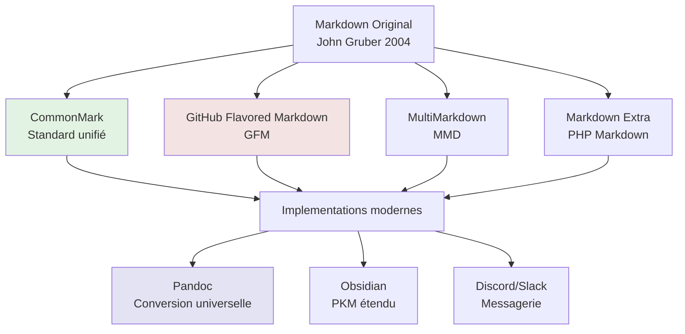
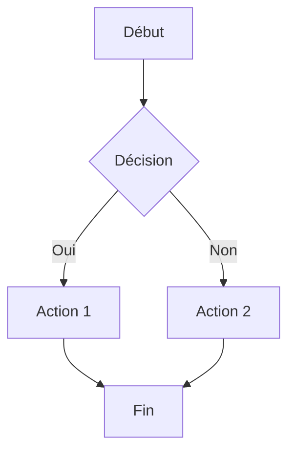
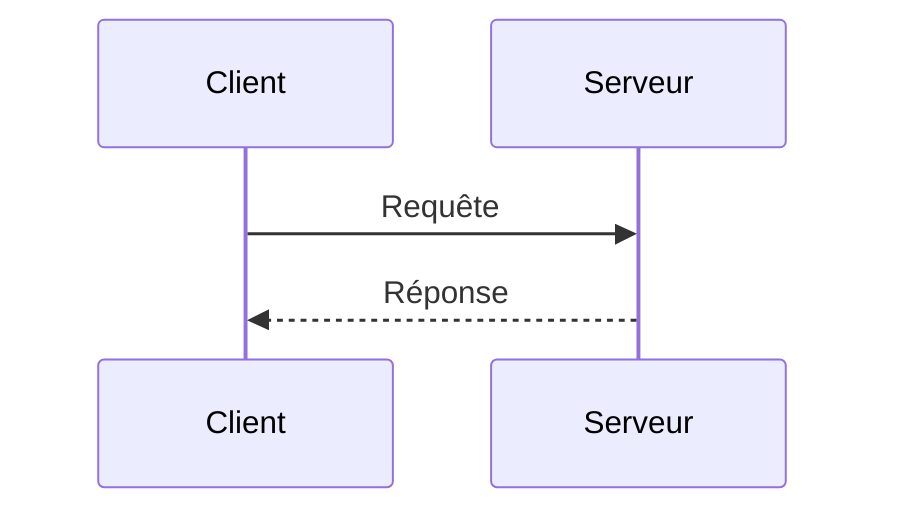
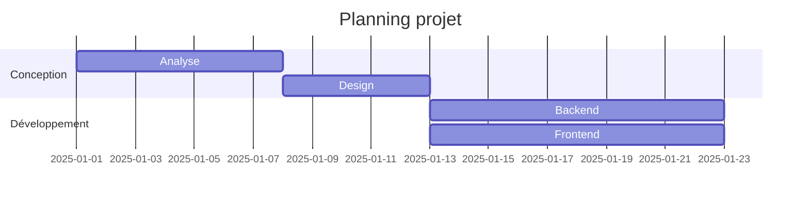

# Markdown

## Introduction

<div
  class="omny-meta"
  data-level="🟢 Débutant & 🟡 Intermédiaire"
  data-version="1.2"
  data-time="40-45 minutes">
</div>

!!! quote "Analogie pédagogique"
    _Imaginez un **système de sténographie universel** où quelques symboles simples (`#`, `*`, `-`) transforment du texte brut en documents structurés et formatés. Vous écrivez `**gras**` et obtenez du **gras**, vous tapez `# Titre` et créez un titre principal. **Markdown fonctionne exactement ainsi** : c'est un langage de balisage léger qui permet de formater du texte avec une syntaxe minimaliste et intuitive, tout en restant parfaitement lisible même sous forme brute._

> **Markdown** est un langage de balisage léger créé en 2004 par **John Gruber** et **Aaron Swartz** avec un objectif simple : permettre d'écrire des documents structurés en texte brut qui soient à la fois **faciles à écrire**, **faciles à lire** dans leur forme source, et **convertibles en HTML** propre. Contrairement à HTML qui utilise des balises verbeuses (`<strong>texte</strong>`), Markdown privilégie la simplicité (`**texte**`).

Markdown est devenu le **standard de facto** pour la documentation technique. GitHub, GitLab, Stack Overflow, Reddit, Discord, Notion, Obsidian, et des milliers d'autres plateformes l'utilisent quotidiennement. Chaque `README.md`, chaque documentation technique, chaque wiki de projet utilise Markdown. Sa simplicité combinée à sa puissance en font un outil indispensable pour tout professionnel du numérique.

!!! info "Pourquoi c'est important ?"
    Markdown permet de **rédiger rapidement** sans quitter le clavier, de **versionner** facilement la documentation avec Git (format texte brut), de **se concentrer sur le contenu** plutôt que la mise en forme, de **garantir la portabilité** entre plateformes, et de **générer automatiquement** du HTML, PDF, ou autres formats.

## Pour repartir des bases (vrais débutants)

Si vous n'avez jamais utilisé Markdown, vous découvrirez qu'écrire en Markdown ressemble à **prendre des notes structurées**. Les symboles utilisés correspondent souvent à ce que vous feriez naturellement : souligner un titre avec `===`, mettre des astérisques autour d'un mot important `*important*`, ou créer des listes avec des tirets `-`. La beauté de Markdown réside dans cette **intuitivité naturelle**.

!!! tip "Markdown n'est pas un traitement de texte"
    Markdown n'est **pas** Microsoft Word ou LibreOffice. Vous n'avez pas de boutons, pas de menus, pas de WYSIWYG (What You See Is What You Get). Vous écrivez du **texte brut** avec des symboles de formatage, et un moteur de rendu transforme ce texte en document formaté. Cette approche sépare le **contenu** de la **présentation**.

## Philosophie Markdown

### Principes fondateurs

**Lisibilité avant tout :**

Le texte Markdown doit rester **lisible** même sans rendu. Comparez :

```markdown
# Titre principal

Ceci est un **texte important** avec un [lien](https://example.com).

- Point 1
- Point 2
- Point 3
```

Contre l'équivalent HTML :

```html
<h1>Titre principal</h1>
<p>Ceci est un <strong>texte important</strong> avec un <a href="https://example.com">lien</a>.</p>
<ul>
  <li>Point 1</li>
  <li>Point 2</li>
  <li>Point 3</li>
</ul>
```

Le Markdown reste **clair et structuré** même brut. Le HTML devient **illisible** avec les balises.

**Simplicité syntaxique :**

Markdown utilise des symboles **visuellement logiques** :

- `#` pour les titres (ressemble à un dièse musical, hiérarchie)
- `*` ou `_` pour l'emphase (entourer visuellement)
- `-` ou `*` pour les listes (puces naturelles)
- `>` pour les citations (flèche de citation)
- `` ` `` pour le code (délimiteur visuel)

**Portabilité :**

Un fichier Markdown (`.md`) est un **fichier texte brut** :
- Compatible avec tous les systèmes d'exploitation
- Versionnable avec Git sans conflit binaire
- Éditable avec n'importe quel éditeur de texte
- Taille minimale (pas de métadonnées cachées)
- Pérennité garantie (format ouvert)

### Variantes de Markdown

Markdown original était minimaliste. Plusieurs variantes ont ajouté des fonctionnalités.



| Variante | Ajouts principaux | Usage |
|----------|-------------------|-------|
| **CommonMark** | Spécification formelle | Standard de référence |
| **GitHub Flavored Markdown (GFM)** | Tableaux, listes de tâches, mentions, emojis | GitHub, GitLab |
| **MultiMarkdown** | Métadonnées, notes de bas de page, tableaux | Documentation académique |
| **Markdown Extra** | Tableaux, abréviations, notes de bas de page | PHP Markdown |
| **Obsidian Markdown** | Wikilinks, graphes, blocs transclusion | Gestion de connaissances |

!!! warning "Compatibilité entre variantes"
    La syntaxe **de base** (titres, emphase, listes, liens, images) fonctionne partout. Les **extensions** (tableaux, notes de bas de page, diagrammes) dépendent du moteur de rendu. Vérifiez toujours la compatibilité de votre plateforme cible.

## Syntaxe fondamentale

### Titres

Les titres structurent votre document hiérarchiquement.

**Syntaxe ATX (recommandée) :**

```markdown
# Titre niveau 1 (h1)
## Titre niveau 2 (h2)
### Titre niveau 3 (h3)
#### Titre niveau 4 (h4)
##### Titre niveau 5 (h5)
###### Titre niveau 6 (h6)
```

**Rendu :**

# Titre niveau 1
## Titre niveau 2
### Titre niveau 3
#### Titre niveau 4
##### Titre niveau 5
###### Titre niveau 6

**Syntaxe Setext (alternative niveau 1 et 2) :**

```markdown
Titre niveau 1
==============

Titre niveau 2
--------------
```

!!! tip "Hiérarchie des titres"
    - Utilisez **un seul h1** par document (titre principal)
    - Respectez la **hiérarchie** : ne sautez pas de niveaux (h1 → h3 est incorrect)
    - Les titres génèrent automatiquement des **ancres** pour les liens internes
    - La syntaxe **ATX** est plus flexible et universelle

### Paragraphes et sauts de ligne

**Paragraphes :**

```markdown
Ceci est un paragraphe.

Ceci est un autre paragraphe. Il faut une ligne vide entre les paragraphes.
```

**Rendu :**

Ceci est un paragraphe.

Ceci est un autre paragraphe. Il faut une ligne vide entre les paragraphes.

**Saut de ligne dans un paragraphe :**

```markdown
Ligne 1  
Ligne 2 (deux espaces à la fin de la ligne précédente)

Ou bien:

Ligne 1\
Ligne 2 (backslash en fin de ligne)
```

!!! warning "Espaces invisibles"
    Les **deux espaces en fin de ligne** pour forcer un saut sont **invisibles** dans la plupart des éditeurs. Cela crée des erreurs de formatage difficiles à diagnostiquer. Préférez le **backslash `\`** si votre moteur le supporte, ou utilisez des paragraphes séparés.

### Emphase

**Italique :**

```markdown
*italique avec astérisques*
_italique avec underscores_
```

**Rendu :** *italique avec astérisques* _italique avec underscores_

**Gras :**

```markdown
**gras avec astérisques**
__gras avec underscores__
```

**Rendu :** **gras avec astérisques** __gras avec underscores__

**Gras italique :**

```markdown
***gras et italique***
___gras et italique___
**_combinaison_**
*__combinaison__*
```

**Rendu :** ***gras et italique*** ___gras et italique___ **_combinaison_** *__combinaison__*

**Barré (GFM) :**

```markdown
~~texte barré~~
```

**Rendu :** ~~texte barré~~

!!! tip "Astérisques vs underscores"
    Les deux fonctionnent, mais par **convention** :
    - Utilisez `*` et `**` pour l'emphase (plus courant)
    - Réservez `_` pour les noms de variables avec underscores sans conflit

### Listes

**Liste non ordonnée :**

```markdown
- Élément 1
- Élément 2
  - Sous-élément 2.1 (indentation 2 espaces)
  - Sous-élément 2.2
    - Sous-sous-élément 2.2.1
- Élément 3

* On peut aussi utiliser des astérisques
+ Ou des plus
```

**Rendu :**

- Élément 1
- Élément 2
  - Sous-élément 2.1
  - Sous-élément 2.2
    - Sous-sous-élément 2.2.1
- Élément 3

**Liste ordonnée :**

```markdown
1. Premier élément
2. Deuxième élément
3. Troisième élément
   1. Sous-élément 3.1
   2. Sous-élément 3.2
4. Quatrième élément

Les numéros peuvent être tous "1." :
1. Élément A
1. Élément B
1. Élément C
```

**Rendu :**

1. Premier élément
2. Deuxième élément
3. Troisième élément
   1. Sous-élément 3.1
   2. Sous-élément 3.2
4. Quatrième élément

**Liste de tâches (GFM) :**

```markdown
- [x] Tâche complétée
- [ ] Tâche en cours
- [ ] Tâche à faire
  - [x] Sous-tâche complétée
  - [ ] Sous-tâche à faire
```

**Rendu :**

- [x] Tâche complétée
- [ ] Tâche en cours
- [ ] Tâche à faire
  - [x] Sous-tâche complétée
  - [ ] Sous-tâche à faire

**Paragraphes dans les listes :**

```markdown
1. Premier élément

   Paragraphe additionnel dans le premier élément.
   
   Indentation de 3 espaces (ou 4) pour maintenir la continuité.

2. Deuxième élément
```

### Liens

**Lien inline :**

```markdown
[Texte du lien](https://example.com)
[Lien avec titre](https://example.com "Titre optionnel au survol")
```

**Rendu :**

[Texte du lien](https://example.com)
[Lien avec titre](https://example.com "Titre optionnel au survol")

**Lien par référence :**

```markdown
Ceci est un [lien par référence][1].

Vous pouvez aussi utiliser [des noms][lien-nom].

Ou simplement [le texte lui-même] comme référence.

[1]: https://example.com
[lien-nom]: https://example.com/page
[le texte lui-même]: https://example.com/autre
```

**Avantages des liens par référence :**
- Sépare le contenu de l'URL (lisibilité)
- Réutilisation d'une même URL plusieurs fois
- Modification centralisée des URLs

**Lien automatique :**

```markdown
<https://example.com>
<email@example.com>
```

**Rendu :**

<https://example.com>
<email@example.com>

**Ancres internes :**

```markdown
[Aller à la section Syntaxe](#syntaxe-fondamentale)

Les titres génèrent automatiquement des ancres :
# Mon Titre → #mon-titre
```

### Images

**Image inline :**

```markdown


```

**Image par référence :**

```markdown
![Logo][logo-ref]

[logo-ref]: images/logo.png "Logo de l'entreprise"
```

**Image avec lien cliquable :**

```markdown
[](https://example.com)
```

!!! warning "Texte alternatif obligatoire"
    Le **texte alternatif** entre crochets est **crucial** pour :
    - L'accessibilité (lecteurs d'écran)
    - Le référencement SEO
    - L'affichage si l'image ne charge pas
    
    Écrivez des descriptions **significatives**, pas "image" ou "photo".

### Citations

**Citation simple :**

```markdown
> Ceci est une citation.
> Elle peut s'étendre sur plusieurs lignes.
```

**Rendu :**

> Ceci est une citation.
> Elle peut s'étendre sur plusieurs lignes.

**Citations imbriquées :**

```markdown
> Citation de niveau 1
>
> > Citation imbriquée niveau 2
> >
> > > Citation imbriquée niveau 3
>
> Retour niveau 1
```

**Rendu :**

> Citation de niveau 1
>
> > Citation imbriquée niveau 2
> >
> > > Citation imbriquée niveau 3
>
> Retour niveau 1

**Citation avec autres éléments :**

```markdown
> ## Titre dans citation
>
> - Liste dans citation
> - Deuxième élément
>
> **Emphase** et `code` fonctionnent aussi.
```

### Code

**Code inline :**

```markdown
Utilisez la fonction `print()` pour afficher du texte.
```

**Rendu :**

Utilisez la fonction `print()` pour afficher du texte.

**Bloc de code indenté (4 espaces) :**

```markdown
    function exemple() {
        return "code indenté";
    }
```

**Bloc de code avec triple backticks (recommandé) :**

````markdown
```
Code sans coloration syntaxique
```

```python
def fonction():
    return "Code Python avec coloration"
```

```javascript
function exemple() {
    return "Code JavaScript avec coloration";
}
```
````

**Langages supportés (dépend du moteur) :**

```
bash, c, cpp, csharp, css, diff, go, html, java, javascript, json,
kotlin, markdown, php, python, ruby, rust, sql, typescript, xml, yaml
```

**Échapper les backticks :**

````markdown
Pour afficher des backticks : `` `code` ``

Pour afficher des triple backticks :
`````
```
code
```
`````
````

!!! tip "Indentation vs backticks"
    Privilégiez toujours les **triple backticks** :
    - Spécification du langage pour coloration syntaxique
    - Lisibilité supérieure
    - Pas de problème avec l'indentation existante
    - Support universel

### Lignes horizontales

```markdown
---

***

___

(Trois tirets, astérisques ou underscores)
```

**Rendu :**

---

## Syntaxe étendue

### Tableaux (GFM)

**Syntaxe basique :**

```markdown
| En-tête 1 | En-tête 2 | En-tête 3 |
|-----------|-----------|-----------|
| Cellule 1 | Cellule 2 | Cellule 3 |
| Cellule 4 | Cellule 5 | Cellule 6 |
```

**Rendu :**

| En-tête 1 | En-tête 2 | En-tête 3 |
|-----------|-----------|-----------|
| Cellule 1 | Cellule 2 | Cellule 3 |
| Cellule 4 | Cellule 5 | Cellule 6 |

**Alignement :**

```markdown
| Gauche | Centre | Droite |
|:-------|:------:|-------:|
| Texte  | Texte  | Texte  |
| A      |   B    |    C   |
```

**Rendu :**

| Gauche | Centre | Droite |
|:-------|:------:|-------:|
| Texte  | Texte  | Texte  |
| A      |   B    |    C   |

**Formatage dans les tableaux :**

```markdown
| Fonctionnalité | Syntaxe | Exemple |
|----------------|---------|---------|
| **Gras** | `**texte**` | **Exemple** |
| *Italique* | `*texte*` | *Exemple* |
| `Code` | `` `code` `` | `exemple()` |
| [Lien](url) | `[texte](url)` | [GitHub](https://github.com) |
```

!!! tip "Tableaux complexes"
    Markdown n'est **pas adapté** aux tableaux complexes (cellules fusionnées, colonnes imbriquées). Pour ces cas, utilisez :
    - HTML directement dans le Markdown
    - Conversion depuis un tableur (Excel → Markdown)
    - Générateurs de tableaux Markdown en ligne

### Notes de bas de page

```markdown
Voici une phrase avec une note de bas de page[^1].

Une autre phrase avec une note nommée[^note-importante].

[^1]: Ceci est la première note de bas de page.

[^note-importante]: Ceci est une note avec nom descriptif.
    Les notes peuvent s'étendre sur plusieurs lignes
    avec indentation.
```

**Rendu :**

Voici une phrase avec une note de bas de page[^1].

Une autre phrase avec une note nommée[^note-importante].

[^1]: Ceci est la première note de bas de page.
[^note-importante]: Ceci est une note avec nom descriptif.

### Listes de définition

```markdown
Terme 1
:   Définition du terme 1

Terme 2
:   Première définition du terme 2
:   Deuxième définition du terme 2
```

**Rendu :**

Terme 1
:   Définition du terme 1

Terme 2
:   Première définition du terme 2
:   Deuxième définition du terme 2

### Abréviations

```markdown
L'HTML et le CSS sont des technologies web.

*[HTML]: HyperText Markup Language
*[CSS]: Cascading Style Sheets
```

Au survol, l'abréviation affiche sa définition complète.

### Attributs personnalisés (Markdown Extra)

```markdown
{#identifiant .classe attribut="valeur"}
```

**Exemple :**

```markdown
# Titre {#mon-id}

Paragraphe {.classe-rouge}

[Lien](url){target="_blank"}
```

### Blocs d'avertissement (extensions)

De nombreuses plateformes (Obsidian, MkDocs, GitBook) supportent des blocs spéciaux.

```markdown
!!! note "Titre de la note"
    Contenu de la note.

!!! warning "Attention"
    Avertissement important.

!!! danger "Danger"
    Action critique.

!!! tip "Astuce"
    Conseil utile.

!!! info "Information"
    Information contextuelle.
```

### Diagrammes Mermaid

**Diagramme de flux :**

````markdown

````

**Diagramme de séquence :**

````markdown

````

**Diagramme de Gantt :**

````markdown

````

## HTML dans Markdown

Markdown **autorise HTML** pour les cas non couverts par sa syntaxe.

**HTML inline :**

```markdown
Texte avec <span style="color: red;">couleur rouge</span>.
```

**Blocs HTML :**

```markdown
<div class="custom-class">
    <p>Paragraphe HTML</p>
    <ul>
        <li>Item 1</li>
        <li>Item 2</li>
    </ul>
</div>
```

**Tableau HTML complexe :**

```html
<table>
    <thead>
        <tr>
            <th rowspan="2">En-tête</th>
            <th colspan="2">Colonnes fusionnées</th>
        </tr>
        <tr>
            <th>Col 1</th>
            <th>Col 2</th>
        </tr>
    </thead>
    <tbody>
        <tr>
            <td>Donnée</td>
            <td>Donnée</td>
            <td>Donnée</td>
        </tr>
    </tbody>
</table>
```

!!! warning "Markdown dans HTML"
    Le **Markdown ne fonctionne PAS** à l'intérieur de blocs HTML. Utilisez HTML complet ou utilisez l'attribut `markdown="1"` si votre moteur le supporte :
    
    ```html
    <div markdown="1">
    ## Titre Markdown
    **Ceci fonctionne**
    </div>
    ```

## Échappement de caractères

Pour afficher un caractère spécial Markdown littéralement, utilisez un **backslash `\`**.

**Caractères à échapper :**

```markdown
\   backslash
`   backtick
*   astérisque
_   underscore
{}  accolades
[]  crochets
()  parenthèses
#   dièse
+   plus
-   tiret
.   point (après un nombre)
!   point d'exclamation
```

**Exemples :**

```markdown
\*Ceci n'est pas en italique\*
\## Ceci n'est pas un titre
\[Ceci n'est pas un lien\](url)
```

**Rendu :**

\*Ceci n'est pas en italique\*
\## Ceci n'est pas un titre
\[Ceci n'est pas un lien\](url)

## Bonnes pratiques

### Structure documentaire

**Organisation hiérarchique :**

```markdown
# Titre principal (un seul par document)

Introduction du document.

## Section principale 1

Contenu de la section.

### Sous-section 1.1

Détails.

### Sous-section 1.2

Plus de détails.

## Section principale 2

Autre contenu.
```

**Table des matières automatique :**

De nombreux moteurs génèrent automatiquement une table des matières depuis les titres.

```markdown
## Table des matières

- [Introduction](#introduction)
- [Section 1](#section-1)
  - [Sous-section 1.1](#sous-section-11)
  - [Sous-section 1.2](#sous-section-12)
- [Conclusion](#conclusion)
```

### Nommage des fichiers

**Conventions :**

- Utilisez des **minuscules** : `readme.md`, `installation.md`
- Remplacez les espaces par **tirets** : `guide-utilisateur.md`
- Extension `.md` ou `.markdown`
- Fichier principal : `README.md` (majuscules par convention GitHub)

**Structure de projet typique :**

```
projet/
├── README.md              # Vue d'ensemble du projet
├── CONTRIBUTING.md        # Guide de contribution
├── CHANGELOG.md           # Historique des versions
├── LICENSE.md             # Licence
└── docs/
    ├── installation.md
    ├── configuration.md
    ├── api-reference.md
    └── troubleshooting.md
```

### Longueur des lignes

**Recommandations :**

- **80 caractères** : Standard historique (terminaux)
- **100-120 caractères** : Compromis moderne
- **Pas de limite** : Laissez l'éditeur gérer le retour à la ligne

**Avantages de limiter la longueur :**
- Diffs Git plus clairs (changements par ligne)
- Revues de code facilitées
- Compatibilité avec tous les éditeurs

### Formatage du code

**Spécifier toujours le langage :**

````markdown
# MAUVAIS
```
function test() {}
```

# BON
```javascript
function test() {}
```
````

**Numérotation de lignes (si supporté) :**

````markdown
```python {.line-numbers}
def fonction():
    ligne 1
    ligne 2
    ligne 3
```
````

### Images et médias

**Organisation des ressources :**

```
docs/
├── guide.md
└── images/
    ├── screenshot-01.png
    ├── screenshot-02.png
    └── diagram.svg
```

**Chemins relatifs :**

```markdown


```

**Taille des images (HTML si nécessaire) :**

```html

```

### Listes de contrôle (checklists)

**Usage en gestion de projet :**

```markdown
## Sprint 23 - Tâches

- [x] Implémenter authentification JWT
- [x] Créer page de login
- [ ] Ajouter tests unitaires
- [ ] Documenter API
- [ ] Déployer en staging
```

### Commentaires

**Commentaires HTML invisibles :**

```markdown
<!-- Ceci est un commentaire invisible dans le rendu -->

<!-- TODO: Ajouter section sur les performances -->
```

## Outils et éditeurs

### Éditeurs Markdown dédiés

| Éditeur | Plateforme | Spécialité | Prix |
|---------|-----------|-----------|------|
| **Obsidian** | Windows/Mac/Linux | PKM, graphes de connaissances | Gratuit (payant pour sync) |
| **Typora** | Windows/Mac/Linux | WYSIWYG élégant | Payant (15$) |
| **Mark Text** | Windows/Mac/Linux | Open source, WYSIWYG | Gratuit |
| **iA Writer** | Mac/iOS | Minimaliste, focus écriture | Payant |
| **Zettlr** | Windows/Mac/Linux | Académique, citations | Gratuit |

### Éditeurs de code avec support Markdown

| Éditeur | Extensions recommandées |
|---------|------------------------|
| **VS Code** | Markdown All in One, Markdown Preview Enhanced |
| **Vim/Neovim** | vim-markdown, markdown-preview.nvim |
| **Sublime Text** | MarkdownEditing, MarkdownPreview |
| **Atom** | markdown-preview-plus |

### Convertisseurs

**Pandoc - Le couteau suisse :**

```bash
# Markdown → HTML
pandoc document.md -o document.html

# Markdown → PDF (nécessite LaTeX)
pandoc document.md -o document.pdf

# Markdown → DOCX
pandoc document.md -o document.docx

# Markdown → Diapositives reveal.js
pandoc document.md -t revealjs -s -o slides.html
```

**Autres outils :**

- **kramdown** : Convertisseur Ruby
- **marked** : JavaScript pour Node.js
- **markdown-it** : Parseur JavaScript moderne
- **remark** : Processeur Markdown en JavaScript

### Générateurs de sites statiques

| Générateur | Langage | Spécialité |
|------------|---------|-----------|
| **MkDocs** | Python | Documentation technique |
| **Jekyll** | Ruby | Blogs, GitHub Pages |
| **Hugo** | Go | Performance, multilingue |
| **Docusaurus** | JavaScript | Documentation projet |
| **VuePress** | JavaScript | Documentation Vue.js style |
| **Gatsby** | JavaScript | Sites performants React |

### Linters et validateurs

**markdownlint :**

```bash
# Installation
npm install -g markdownlint-cli

# Vérification
markdownlint document.md

# Configuration .markdownlint.json
{
  "default": true,
  "line-length": false,
  "no-inline-html": false
}
```

**remark-lint :**

```bash
# Installation
npm install -g remark-cli remark-lint

# Vérification
remark document.md
```

## Cas d'usage professionnels

### Documentation technique

**README.md type :**

```markdown
# Nom du Projet

Description courte du projet en une phrase.

## Badges (optionnel)

  

## Table des matières

- [Installation](#installation)
- [Usage](#usage)
- [API](#api)
- [Contributing](#contributing)
- [License](#license)

## Installation

```bash
npm install package-name
```

## Usage

```javascript
import { fonction } from 'package-name';
fonction();
```

## API

### `fonction(param)`

Description de la fonction.

**Paramètres:**
- `param` (string): Description du paramètre

**Retourne:** Type de retour

**Exemple:**
```javascript
const resultat = fonction("valeur");
```

## Contributing

Les contributions sont bienvenues ! Voir [CONTRIBUTING.md](CONTRIBUTING.md).

## License

MIT © [Votre Nom]
```

### Notes personnelles (PKM)

**Système Zettelkasten :**

```markdown
# 202511161030 - Architecture Hexagonale

#architecture #design-pattern

L'architecture hexagonale (ou ports & adapters) sépare la logique métier
des détails techniques externes.

## Liens

- [[202511151400]] - Clean Architecture
- [[202511141200]] - Dependency Injection

## Références

- Book: "Clean Architecture" par Robert C. Martin
- Article: https://example.com/hexagonal
```

### Rapports d'incident

```markdown
# Incident - Panne serveur production

**Date:** 2025-11-15  
**Durée:** 2h 15min  
**Impact:** Service indisponible  
**Sévérité:** Critique

## Timeline

- **14:30** - Alertes monitoring déclenchées
- **14:32** - Équipe notifiée
- **14:45** - Cause identifiée (saturation disque)
- **15:00** - Nettoyage logs démarré
- **16:45** - Service restauré

## Cause racine

Rotation automatique des logs désactivée suite au dernier déploiement.

## Actions correctives

- [x] Restaurer rotation logs
- [x] Augmenter surveillance disque
- [ ] Automatiser nettoyage préventif
- [ ] Documentation procédure
```

### Spécifications fonctionnelles

```markdown
# SPEC-001 - Authentification Multi-facteurs

**Version:** 1.0  
**Auteur:** Alice Dupont  
**Date:** 2025-11-15

## Contexte

Les utilisateurs doivent pouvoir activer l'authentification à deux facteurs
pour sécuriser leurs comptes.

## Exigences fonctionnelles

### FR-001 - Activation MFA

L'utilisateur doit pouvoir activer la MFA depuis les paramètres de compte.

**Critères d'acceptation:**
- [ ] Génération d'un QR code TOTP
- [ ] Validation du premier code
- [ ] Génération de codes de secours

### FR-002 - Validation à la connexion

Si MFA activée, un code est demandé après le mot de passe.

## Exigences non-fonctionnelles

- **Performance:** Validation code < 100ms
- **Sécurité:** Algorithme TOTP (RFC 6238)
- **UX:** Interface claire et guidée
```

## Le mot de la fin

!!! quote
    Markdown a réussi là où des dizaines de formats propriétaires ont échoué : créer un **langage universel** pour l'écriture structurée. Sa force réside dans son **équilibre parfait** entre simplicité d'écriture et puissance de formatage. Vous pouvez écrire du Markdown dans un terminal SSH, un éditeur de texte basique, ou un IDE sophistiqué - le résultat sera toujours **lisible, portable, et versionnable**.
    
    La philosophie Markdown - **contenu d'abord, présentation ensuite** - libère l'écrivain des préoccupations de mise en forme. Pas de boutons à chercher, pas de menus à explorer, pas de compatibilité à vérifier. Vous écrivez du **texte pur** avec quelques symboles intuitifs, et n'importe quel moteur Markdown génère un document formaté professionnel.
    
    L'adoption massive de Markdown par **GitHub, GitLab, Stack Overflow, Reddit, Discord, Notion, Obsidian** et des milliers d'autres plateformes témoigne de sa pertinence. Chaque développeur, rédacteur technique, chercheur, gestionnaire de projet utilise Markdown quotidiennement. C'est devenu le **langage commun** de la documentation technique.
    
    Maîtriser Markdown, c'est acquérir une compétence **transversale** qui reste pertinente quelle que soit votre plateforme, votre outil, ou votre langage de programmation. C'est comprendre que la **simplicité bien conçue** surpasse toujours la complexité inutile. C'est intégrer un workflow où **écriture et versioning** s'unissent naturellement.
    
    Markdown n'est pas parfait - il a ses limites avec les tableaux complexes, les mises en page sophistiquées, ou les documents académiques formels. Mais pour **99% de la documentation technique, des notes personnelles, et de la communication écrite professionnelle**, Markdown est l'outil optimal. Simple, rapide, portable, pérenne.

---
