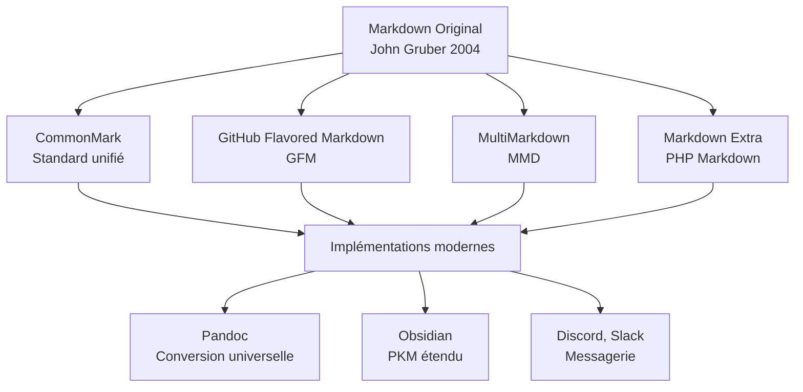
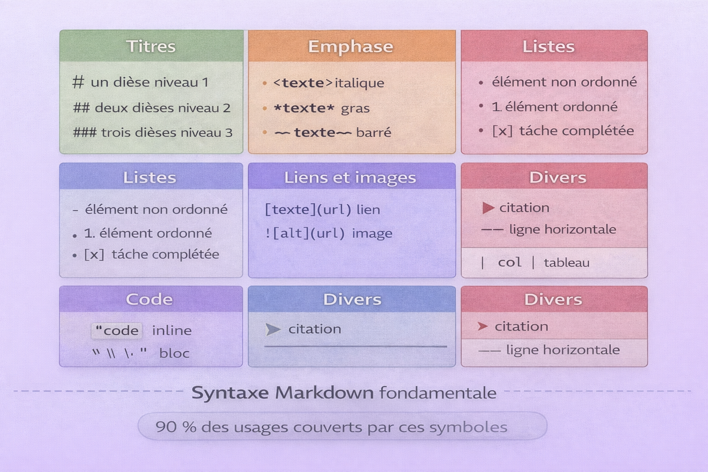
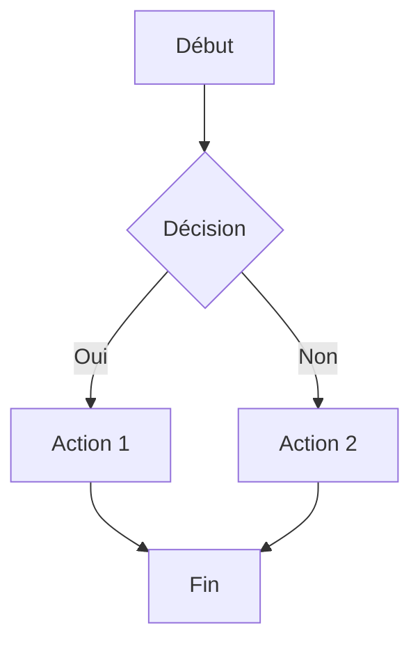
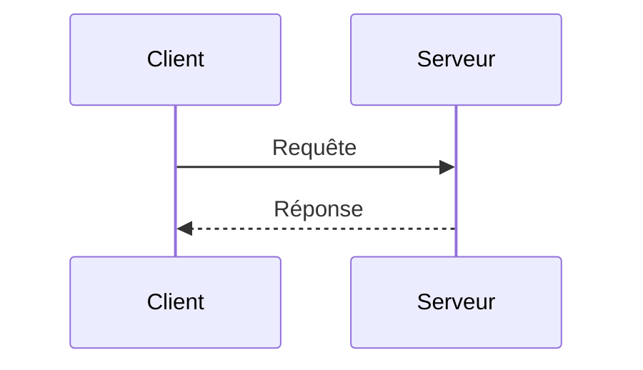
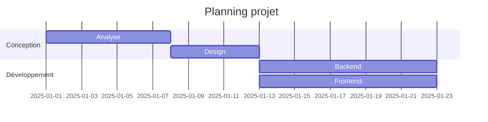
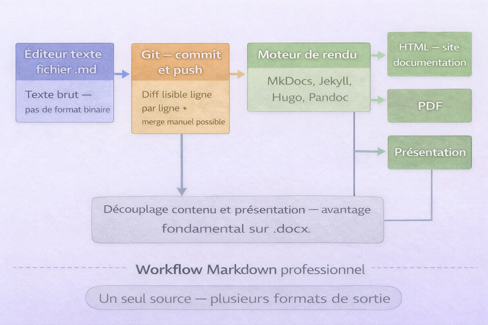

# Markdown

<div
  class="omny-meta"
  data-level="🟢 Débutant & 🟡 Intermédiaire"
  data-version="1.2"
  data-time="40-45 minutes">
</div>

!!! quote "Analogie"
    _Un système de sténographie universel où quelques symboles simples — `#`, `*`, `-` — transforment du texte brut en documents structurés et formatés. On écrit `**gras**` et on obtient du **gras**, on tape `# Titre` et on crée un titre principal. Markdown fonctionne exactement ainsi : un langage de balisage léger qui permet de formater du texte avec une syntaxe minimaliste et intuitive, tout en restant parfaitement lisible même sous forme brute._

**Markdown** est un langage de balisage léger créé en 2004 par **John Gruber** et **Aaron Swartz** avec un objectif simple : permettre d'écrire des documents structurés en texte brut qui soient à la fois faciles à écrire, faciles à lire dans leur forme source et convertibles en HTML propre. Contrairement à HTML qui utilise des balises verbeuses (`<strong>texte</strong>`), Markdown privilégie la simplicité (`**texte**`).

Markdown est devenu le **standard de facto** pour la documentation technique. GitHub, GitLab, Stack Overflow, Reddit, Discord, Notion, Obsidian et des milliers d'autres plateformes l'utilisent quotidiennement. Chaque `README.md`, chaque documentation technique, chaque wiki de projet utilise Markdown. Sa simplicité combinée à sa puissance en font un outil indispensable pour tout professionnel du numérique.

Écrire en Markdown ressemble à prendre des notes structurées. Les symboles utilisés correspondent souvent à ce que l'on ferait naturellement : souligner un titre avec `===`, mettre des astérisques autour d'un mot important, créer des listes avec des tirets. La beauté de Markdown réside dans cette intuitivité naturelle.

!!! info "Pourquoi c'est important"
    Markdown permet de rédiger rapidement sans quitter le clavier, de versionner facilement la documentation avec Git (format texte brut), de se concentrer sur le contenu plutôt que la mise en forme, de garantir la portabilité entre plateformes et de générer automatiquement du HTML, PDF ou d'autres formats.

!!! tip "Markdown n'est pas un traitement de texte"
    Markdown n'est pas Microsoft Word ou LibreOffice. Il n'y a pas de boutons, pas de menus, pas de WYSIWYG. On écrit du texte brut avec des symboles de formatage, et un moteur de rendu transforme ce texte en document formaté. Cette approche sépare le **contenu** de la **présentation**.

<br />

---

## Philosophie Markdown

### Lisibilité avant tout

!!! note "L'image ci-dessous compare la lisibilité de Markdown brut versus son équivalent HTML. C'est l'argument central qui explique pourquoi Markdown s'est imposé comme standard de la documentation technique."


<p><em>Le même contenu exprimé en Markdown reste parfaitement lisible dans sa forme source — les symboles sont visuellement intuitifs et n'obstruent pas le sens. L'équivalent HTML devient difficile à lire dès qu'on ajoute des balises, des attributs et de l'imbrication. C'est ce contraste qui justifie l'adoption massive de Markdown pour toute documentation destinée à être éditée et versionnée.</em></p>

Le texte Markdown doit rester lisible même sans rendu. Comparer les deux formes pour un même contenu :

```markdown title="Markdown — lisibilité source"
# Titre principal

Ceci est un **texte important** avec un [lien](https://example.com).

- Point 1
- Point 2
- Point 3
```

```html title="HTML — équivalent verbeux"
<h1>Titre principal</h1>
<p>Ceci est un <strong>texte important</strong> avec un <a href="https://example.com">lien</a>.</p>
<ul>
  <li>Point 1</li>
  <li>Point 2</li>
  <li>Point 3</li>
</ul>
```

Le Markdown reste clair et structuré même brut. Le HTML devient illisible avec les balises.

### Principes fondateurs

**Simplicité syntaxique** — Markdown utilise des symboles visuellement logiques : `#` pour les titres (hiérarchie), `*` ou `_` pour l'emphase (entourer visuellement), `-` ou `*` pour les listes (puces naturelles), `>` pour les citations (flèche de citation) et `` ` `` pour le code (délimiteur visuel).

**Portabilité** — Un fichier Markdown (`.md`) est un fichier texte brut : compatible avec tous les systèmes d'exploitation, versionnable avec Git sans conflit binaire, éditable avec n'importe quel éditeur de texte, de taille minimale sans métadonnées cachées, et pérenne car le format est ouvert.

### Variantes de Markdown

!!! note "L'image ci-dessous représente l'arbre des variantes Markdown et leur écosystème. Comprendre ces ramifications permet d'anticiper les problèmes de compatibilité entre plateformes."


<p><em>Markdown original était minimaliste. CommonMark a défini une spécification formelle pour unifier les comportements. GitHub Flavored Markdown (GFM) a ajouté les tableaux, les listes de tâches et les emojis. MultiMarkdown et Markdown Extra ont ajouté les métadonnées et les notes de bas de page. La syntaxe de base fonctionne partout — les extensions dépendent du moteur de rendu cible.</em></p>


```mermaid
flowchart TB
    A["Markdown Original<br />John Gruber 2004"]

    A --> B["CommonMark<br />Standard unifié"]
    A --> C["GitHub Flavored Markdown<br />GFM"]
    A --> D["MultiMarkdown<br />MMD"]
    A --> E["Markdown Extra<br />PHP Markdown"]

    B --> F["Implémentations modernes"]
    C --> F
    D --> F
    E --> F

    F --> G["Pandoc<br />Conversion universelle"]
    F --> H["Obsidian<br />PKM étendu"]
    F --> I["Discord, Slack<br />Messagerie"]
```

| Variante | Ajouts principaux | Usage |
|---|---|---|
| CommonMark | Spécification formelle | Standard de référence |
| GitHub Flavored Markdown | Tableaux, listes de tâches, mentions, emojis | GitHub, GitLab |
| MultiMarkdown | Métadonnées, notes de bas de page, tableaux | Documentation académique |
| Markdown Extra | Tableaux, abréviations, notes de bas de page | PHP Markdown |
| Obsidian Markdown | Wikilinks, graphes, blocs de transclusion | Gestion de connaissances |

!!! warning "Compatibilité entre variantes"
    La syntaxe de base — titres, emphase, listes, liens, images — fonctionne partout. Les extensions — tableaux, notes de bas de page, diagrammes — dépendent du moteur de rendu. Vérifier toujours la compatibilité de la plateforme cible avant d'utiliser des fonctionnalités avancées.

<br />

---

## Syntaxe fondamentale

### Référence visuelle rapide

!!! note "L'image ci-dessous constitue une cheat sheet des symboles Markdown les plus courants. Une référence visuelle mémorisée une seule fois suffit pour couvrir 90 % des usages quotidiens."



<p><em>Les symboles Markdown sont visuellement logiques : le dièse # préfixe les titres (un à six selon le niveau), les astérisques entourent le texte mis en emphase, le tiret ou l'astérisque introduit les éléments de liste, le chevron > préfixe les citations et le backtick délimite le code inline. Cette correspondance symbole/usage facilite la mémorisation.</em></p>

### Titres

Les titres structurent le document hiérarchiquement. La syntaxe ATX (avec dièses) est recommandée pour sa flexibilité.

```markdown title="Markdown — titres syntaxe ATX"
# Titre niveau 1 (h1)
## Titre niveau 2 (h2)
### Titre niveau 3 (h3)
#### Titre niveau 4 (h4)
##### Titre niveau 5 (h5)
###### Titre niveau 6 (h6)
```

```markdown title="Markdown — titres syntaxe Setext (alternative niveaux 1 et 2)"
Titre niveau 1
==============

Titre niveau 2
--------------
```

!!! tip "Hiérarchie des titres"
    - Utiliser un seul h1 par document — titre principal uniquement
    - Respecter la hiérarchie — ne pas sauter de niveaux (h1 → h3 est incorrect)
    - Les titres génèrent automatiquement des ancres pour les liens internes
    - La syntaxe ATX est plus flexible et universelle

### Paragraphes et sauts de ligne

```markdown title="Markdown — paragraphes séparés"
Ceci est un paragraphe.

Ceci est un autre paragraphe. Une ligne vide sépare les paragraphes.
```

```markdown title="Markdown — saut de ligne dans un paragraphe"
Ligne 1  
Ligne 2 (deux espaces à la fin de la ligne précédente)

Ligne 1\
Ligne 2 (backslash en fin de ligne — si supporté)
```

!!! warning "Espaces invisibles"
    Les deux espaces en fin de ligne pour forcer un saut sont invisibles dans la plupart des éditeurs — source d'erreurs difficiles à diagnostiquer. Préférer le backslash `\` si le moteur le supporte, ou utiliser des paragraphes séparés.

### Emphase

```markdown title="Markdown — emphase italique, gras et barré"
*italique avec astérisques*
_italique avec underscores_

**gras avec astérisques**
__gras avec underscores__

***gras et italique***
~~texte barré (GFM)~~
```

!!! tip "Astérisques vs underscores"
    Les deux syntaxes fonctionnent. Par convention, utiliser `*` et `**` pour l'emphase (plus courant), et réserver `_` pour les noms de variables contenant des underscores afin d'éviter les conflits de parsing.

### Listes

```markdown title="Markdown — liste non ordonnée avec sous-éléments"
- Élément 1
- Élément 2
  - Sous-élément 2.1 (indentation 2 espaces)
  - Sous-élément 2.2
    - Sous-sous-élément 2.2.1
- Élément 3
```

```markdown title="Markdown — liste ordonnée"
1. Premier élément
2. Deuxième élément
3. Troisième élément
   1. Sous-élément 3.1
   2. Sous-élément 3.2
```

```markdown title="Markdown — liste de tâches (GFM)"
- [x] Tâche complétée
- [ ] Tâche en cours
- [ ] Tâche à faire
  - [x] Sous-tâche complétée
  - [ ] Sous-tâche à faire
```

```markdown title="Markdown — paragraphes dans une liste"
1. Premier élément

   Paragraphe additionnel — indentation de 3 espaces pour maintenir la continuité.

2. Deuxième élément
```

### Liens

```markdown title="Markdown — liens inline et par référence"
[Texte du lien](https://example.com)
[Lien avec titre](https://example.com "Titre optionnel au survol")

[Lien par référence][1]
[Avec nom descriptif][lien-nom]

[1]: https://example.com
[lien-nom]: https://example.com/page
```

Les liens par référence séparent le contenu de l'URL pour une meilleure lisibilité, permettent la réutilisation d'une même URL et centralisent la modification des URLs.

```markdown title="Markdown — liens automatiques et ancres internes"
<https://example.com>
<email@example.com>

[Aller à la section syntaxe](#syntaxe-fondamentale)
```

### Images

```markdown title="Markdown — images inline et avec lien"


[](https://example.com)
```

```markdown title="Markdown — image par référence"
![Logo][logo-ref]

[logo-ref]: images/logo.png "Logo de l'entreprise"
```

!!! warning "Texte alternatif obligatoire"
    Le texte alternatif entre crochets est indispensable pour l'accessibilité (lecteurs d'écran), le référencement SEO et l'affichage si l'image ne charge pas. Écrire des descriptions significatives — pas "image" ou "photo".

### Citations

```markdown title="Markdown — citations simples et imbriquées"
> Ceci est une citation.
> Elle peut s'étendre sur plusieurs lignes.

> Citation de niveau 1
>
> > Citation imbriquée niveau 2
> >
> > > Citation imbriquée niveau 3
>
> Retour niveau 1
```

```markdown title="Markdown — autres éléments dans une citation"
> ## Titre dans citation
>
> - Liste dans citation
> - Deuxième élément
>
> **Emphase** et `code` fonctionnent aussi.
```

### Code

```markdown title="Markdown — code inline"
Utilisez la fonction `print()` pour afficher du texte.
```

````markdown title="Markdown — blocs de code avec spécification de langage"
```python
def fonction():
    return "Code Python avec coloration syntaxique"
```

```javascript
function exemple() {
    return "Code JavaScript avec coloration";
}
```
````

```
bash, c, cpp, csharp, css, diff, go, html, java, javascript, json,
kotlin, markdown, php, python, ruby, rust, sql, typescript, xml, yaml
```

!!! tip "Indentation vs backticks"
    Toujours utiliser les triple backticks plutôt que l'indentation à 4 espaces : spécification du langage pour la coloration syntaxique, lisibilité supérieure, pas de conflit avec l'indentation existante, support universel.

### Lignes horizontales

```markdown title="Markdown — lignes horizontales"
---

***

___
```

<br />

---

## Syntaxe étendue

### Tableaux (GFM)

```markdown title="Markdown — tableau basique"
| En-tête 1 | En-tête 2 | En-tête 3 |
|-----------|-----------|-----------|
| Cellule 1 | Cellule 2 | Cellule 3 |
| Cellule 4 | Cellule 5 | Cellule 6 |
```

```markdown title="Markdown — alignement des colonnes"
| Gauche | Centre | Droite |
|:-------|:------:|-------:|
| Texte  | Texte  | Texte  |
| A      |   B    |    C   |
```

```markdown title="Markdown — formatage dans les cellules de tableau"
| Fonctionnalité | Syntaxe         | Exemple                          |
|---|---|---|
| Gras           | `**texte**`     | **Exemple**                      |
| Italique       | `*texte*`       | *Exemple*                        |
| Code inline    | `` `code` ``   | `exemple()`                      |
| Lien           | `[texte](url)` | [GitHub](https://github.com)     |
```

!!! tip "Tableaux complexes"
    Markdown n'est pas adapté aux tableaux complexes avec cellules fusionnées ou colonnes imbriquées. Pour ces cas, utiliser du HTML directement dans le Markdown, convertir depuis un tableur ou utiliser un générateur de tableaux Markdown en ligne.

### Notes de bas de page

```markdown title="Markdown — notes de bas de page"
Voici une phrase avec une note de bas de page[^1].

Une autre phrase avec une note nommée[^note-importante].

[^1]: Ceci est la première note de bas de page.

[^note-importante]: Ceci est une note avec nom descriptif.
    Les notes peuvent s'étendre sur plusieurs lignes
    avec indentation.
```

### Listes de définition

```markdown title="Markdown — listes de définition"
Terme 1
:   Définition du terme 1

Terme 2
:   Première définition du terme 2
:   Deuxième définition du terme 2
```

### Abréviations

```markdown title="Markdown — abréviations avec définition au survol"
L'HTML et le CSS sont des technologies web.

*[HTML]: HyperText Markup Language
*[CSS]: Cascading Style Sheets
```

Au survol, l'abréviation affiche sa définition complète.

### Blocs d'avertissement (extensions MkDocs, Obsidian)

```markdown title="Markdown — blocs d'avertissement"
!!! note "Titre de la note"
    Contenu de la note.

!!! warning "Attention"
    Avertissement important.

!!! danger "Danger"
    Action critique.

!!! tip "Astuce"
    Conseil utile.

!!! info "Information"
    Information contextuelle.
```

### Diagrammes Mermaid

````markdown title="Markdown — diagramme de flux Mermaid"

```mermaid
flowchart TD
    A[Début] --> B{Décision}
    B -->|Oui| C[Action 1]
    B -->|Non| D[Action 2]
    C --> E[Fin]
    D --> E
```
````

````markdown title="Markdown — diagramme de séquence Mermaid"

```mermaid
sequenceDiagram
    participant Client
    participant Serveur

    Client->>Serveur: Requête
    Serveur-->>Client: Réponse
```
````

````markdown title="Markdown — diagramme de Gantt Mermaid"

```mermaid
gantt
    title Planning projet
    dateFormat YYYY-MM-DD

    section Conception
    Analyse  :a1, 2025-01-01, 7d
    Design   :a2, after a1, 5d

    section Développement
    Backend  :b1, after a2, 10d
    Frontend :b2, after a2, 10d
```
````

<br />

---

## HTML dans Markdown

Markdown autorise le HTML pour les cas non couverts par sa syntaxe.

```markdown title="Markdown — HTML inline pour cas spéciaux"
Texte avec <span style="color: red;">couleur rouge</span>.
```

```html title="HTML — bloc HTML complexe dans Markdown"
<div class="custom-class">
    <p>Paragraphe HTML</p>
    <ul>
        <li>Item 1</li>
        <li>Item 2</li>
    </ul>
</div>
```

```html title="HTML — tableau avec cellules fusionnées"
<table>
    <thead>
        <tr>
            <th rowspan="2">En-tête</th>
            <th colspan="2">Colonnes fusionnées</th>
        </tr>
        <tr>
            <th>Col 1</th>
            <th>Col 2</th>
        </tr>
    </thead>
    <tbody>
        <tr>
            <td>Donnée</td>
            <td>Donnée</td>
            <td>Donnée</td>
        </tr>
    </tbody>
</table>
```

!!! warning "Markdown dans les blocs HTML"
    Le Markdown ne fonctionne pas à l'intérieur de blocs HTML. Utiliser du HTML complet ou l'attribut `markdown="1"` si le moteur le supporte.

<br />

---

## Échappement de caractères

Pour afficher un caractère spécial Markdown littéralement, utiliser un backslash `\`.

```markdown title="Markdown — caractères à échapper"
\   backslash
`   backtick
*   astérisque
_   underscore
{}  accolades
[]  crochets
()  parenthèses
#   dièse
+   plus
-   tiret
.   point (après un nombre)
!   point d'exclamation
```

```markdown title="Markdown — exemples d'échappement"
\*Ceci n'est pas en italique\*
\## Ceci n'est pas un titre
\[Ceci n'est pas un lien\](url)
```

<br />

---

## Bonnes pratiques

### Structure documentaire

!!! note "L'image ci-dessous illustre le workflow Markdown dans un contexte professionnel — de l'écriture en texte brut jusqu'au rendu final en passant par le versioning Git. Ce cycle est la justification principale de Markdown face aux formats binaires."



<p><em>Markdown s'intègre naturellement dans un workflow Git : le fichier .md est du texte brut, les diffs sont lisibles ligne par ligne, les conflits de merge sont gérables manuellement. Un moteur de rendu (MkDocs, Jekyll, Hugo, Pandoc) transforme ensuite le texte brut en HTML, PDF ou présentation selon la cible. Ce découplage entre contenu et présentation est l'avantage fondamental de Markdown sur les formats binaires comme .docx.</em></p>

```markdown title="Markdown — structure hiérarchique recommandée"
# Titre principal (un seul par document)

Introduction du document.

## Section principale 1

Contenu de la section.

### Sous-section 1.1

Détails.

## Section principale 2

Autre contenu.
```

### Nommage des fichiers

```bash title="Bash — conventions de nommage des fichiers Markdown"
# Minuscules avec tirets
readme.md
guide-utilisateur.md
installation.md

# Structure de projet typique
projet/
├── README.md              # Vue d'ensemble — convention GitHub majuscule
├── CONTRIBUTING.md
├── CHANGELOG.md
├── LICENSE.md
└── docs/
    ├── installation.md
    ├── configuration.md
    ├── api-reference.md
    └── troubleshooting.md
```

### Bonnes pratiques pour le code

````markdown title="Markdown — toujours spécifier le langage dans un bloc de code"
# Sans langage — pas de coloration syntaxique
```
function test() {}
```

# Avec langage — coloration syntaxique activée
```javascript
function test() {}
```
````

### Images et ressources

```markdown title="Markdown — organisation des ressources et chemins relatifs"
docs/
├── guide.md
└── images/
    ├── screenshot-01.png
    └── diagram.svg


```

```html title="HTML — contrôle de la taille d'une image dans Markdown"

```

### Commentaires invisibles

```markdown title="Markdown — commentaires HTML invisibles au rendu"
<!-- Ceci est un commentaire invisible dans le rendu -->

<!-- TODO: Ajouter section sur les performances -->
```

<br />

---

## Outils et éditeurs

### Éditeurs Markdown dédiés

| Éditeur | Plateforme | Spécialité | Prix |
|---|---|---|---|
| Obsidian | Windows, Mac, Linux | PKM, graphes de connaissances | Gratuit — sync payant |
| Typora | Windows, Mac, Linux | WYSIWYG élégant | Payant — 15 $ |
| Mark Text | Windows, Mac, Linux | Open source, WYSIWYG | Gratuit |
| iA Writer | Mac, iOS | Minimaliste, focus écriture | Payant |
| Zettlr | Windows, Mac, Linux | Académique, citations | Gratuit |

### Éditeurs de code avec support Markdown

| Éditeur | Extensions recommandées |
|---|---|
| VS Code | Markdown All in One, Markdown Preview Enhanced |
| Vim, Neovim | vim-markdown, markdown-preview.nvim |
| Sublime Text | MarkdownEditing, MarkdownPreview |

### Pandoc — convertisseur universel

```bash title="Bash — conversions Pandoc"
# Markdown vers HTML
pandoc document.md -o document.html

# Markdown vers PDF (nécessite LaTeX)
pandoc document.md -o document.pdf

# Markdown vers DOCX
pandoc document.md -o document.docx

# Markdown vers diapositives reveal.js
pandoc document.md -t revealjs -s -o slides.html
```

### Générateurs de sites statiques

| Générateur | Langage | Spécialité |
|---|---|---|
| MkDocs | Python | Documentation technique |
| Jekyll | Ruby | Blogs, GitHub Pages |
| Hugo | Go | Performance, multilingue |
| Docusaurus | JavaScript | Documentation projet |
| VuePress | JavaScript | Documentation style Vue.js |

### Linters et validation

```bash title="Bash — markdownlint — validation de la syntaxe"
# Installation
npm install -g markdownlint-cli

# Vérification d'un fichier
markdownlint document.md
```

```json title="JSON — .markdownlint.json — configuration"
{
  "default": true,
  "line-length": false,
  "no-inline-html": false
}
```

<br />

---

## Cas d'usage professionnels

### README.md type

````markdown title="Markdown — structure README.md de projet"
# Nom du Projet

Description courte du projet en une phrase.

## Installation

```bash
npm install package-name
```

## Usage

```javascript
import { fonction } from 'package-name';
fonction();
```

## API

### `fonction(param)`

**Paramètres :**
- `param` (string) : description du paramètre

**Retourne :** type de retour

## License

MIT © Auteur
````

### Rapport d'incident

```markdown title="Markdown — rapport d'incident production"
# Incident — Panne serveur production

**Date :** 2025-11-15
**Durée :** 2h 15min
**Impact :** Service indisponible
**Sévérité :** Critique

## Timeline

- **14:30** — Alertes monitoring déclenchées
- **14:32** — Équipe notifiée
- **14:45** — Cause identifiée (saturation disque)
- **16:45** — Service restauré

## Cause racine

Rotation automatique des logs désactivée suite au dernier déploiement.

## Actions correctives

- [x] Restaurer rotation logs
- [x] Augmenter surveillance disque
- [ ] Automatiser nettoyage préventif
- [ ] Documentation procédure
```

### Spécification fonctionnelle

```markdown title="Markdown — spécification fonctionnelle type"
# SPEC-001 — Authentification multi-facteurs

**Version :** 1.0
**Auteur :** Alice Dupont
**Date :** 2025-11-15

## Contexte

Les utilisateurs doivent pouvoir activer l'authentification à deux facteurs
pour sécuriser leurs comptes.

## Exigences fonctionnelles

### FR-001 — Activation MFA

**Critères d'acceptation :**
- [ ] Génération d'un QR code TOTP
- [ ] Validation du premier code
- [ ] Génération de codes de secours

## Exigences non-fonctionnelles

- **Performance :** validation code < 100ms
- **Sécurité :** algorithme TOTP (RFC 6238)
```

<br />

---

## Conclusion

!!! quote "Ce qu'il faut retenir"
    L'outil markdown est un compagnon quotidien dans la vie d'un professionnel de l'IT. Sa maîtrise ne s'acquiert pas en le lisant, mais par une pratique constante. Automatisez au maximum son utilisation pour qu'il devienne une seconde nature.

!!! quote "Conclusion"
    _Markdown a réussi là où des dizaines de formats propriétaires ont échoué : créer un langage universel pour l'écriture structurée. Sa force réside dans son équilibre parfait entre simplicité d'écriture et puissance de formatage. On peut écrire du Markdown dans un terminal SSH, un éditeur de texte basique ou un IDE sophistiqué — le résultat sera toujours lisible, portable et versionnable. La philosophie Markdown — contenu d'abord, présentation ensuite — libère l'écrivain des préoccupations de mise en forme. L'adoption massive par GitHub, GitLab, Stack Overflow, Reddit, Discord, Notion et Obsidian témoigne de sa pertinence. Maîtriser Markdown, c'est acquérir une compétence transversale qui reste pertinente quelle que soit la plateforme, l'outil ou le langage de programmation. Markdown n'est pas parfait — il a ses limites avec les tableaux complexes et les mises en page sophistiquées — mais pour la documentation technique, les notes personnelles et la communication écrite professionnelle, c'est l'outil optimal. Simple, rapide, portable, pérenne._

<br />