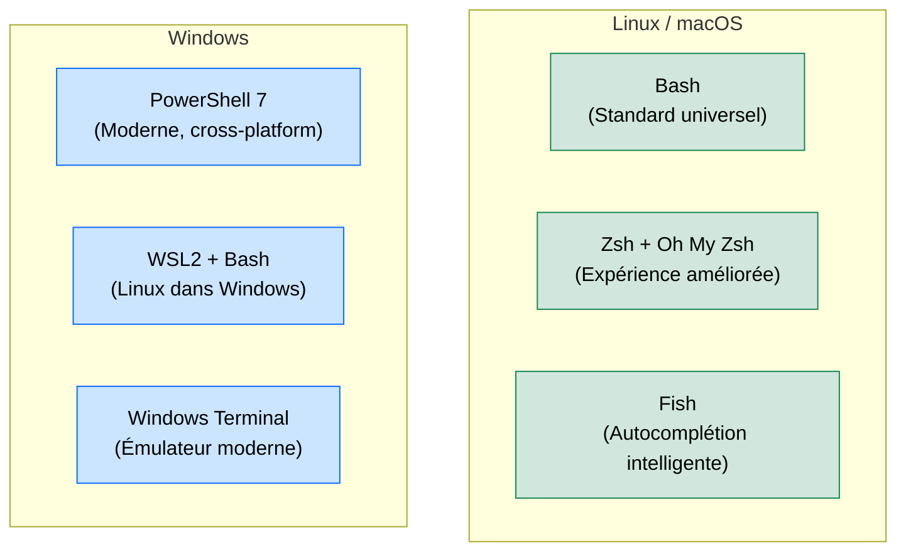

# Terminaux & Shells — Maîtriser la Ligne de Commande

<div
  class="omny-meta"
  data-level="🟢 Débutant"
  data-version="2024"
  data-time="~25 minutes">
</div>

## Introduction

!!! quote "Analogie pédagogique — Le Cockpit vs les Menus"
    Une interface graphique (GUI), c'est un avion moderne avec des écrans tactiles : intuitif, mais limité aux fonctions prévues par le constructeur. Le **terminal**, c'est le cockpit d'un avion de chasse : rien de superflu, mais un accès direct à **chaque paramètre de l'appareil**, sans couche d'abstraction.

    Pour un développeur, la maîtrise du terminal n'est pas optionnelle — c'est la différence entre *utiliser* un outil et *le posséder*. Les commandes Git, les déploiements SSH, les scripts d'automatisation, les installations de dépendances : tout passe par le terminal.

Un **shell** est l'interpréteur de commandes qui reçoit ce que vous tapez et l'exécute. Le **terminal** est l'émulateur qui affiche le shell. Sur Linux/macOS, Bash et Zsh sont les shells par défaut. Sur Windows, PowerShell est natif et WSL2 permet d'utiliser Bash directement.

<br>

---

## Comparatif des Shells Principaux



| Shell | OS | Points forts | Usage recommandé |
|---|---|---|---|
| **Bash** | Linux/macOS | Standard universel, scripts partout | Scripts CI/CD, serveurs |
| **Zsh** | Linux/macOS | Plugins, thèmes, autocomplétion avancée | Poste de développement macOS/Linux |
| **PowerShell 7** | Windows/Linux | Objets .NET, intégration Windows | Administration Windows, Azure |
| **Fish** | Linux/macOS | Autocomplétion sans config | Débutants cherchant la productivité immédiate |

<br>

---

## Commandes Fondamentales (Bash/Zsh)

```bash title="Navigation et gestion de fichiers"
# ── Navigation ──────────────────────────────────────────────
pwd                          # Afficher le chemin actuel
ls -la                       # Lister avec permissions et fichiers cachés
cd /var/www/html             # Aller dans un dossier
cd ..                        # Remonter d'un niveau
cd ~                         # Aller dans votre home directory

# ── Fichiers et dossiers ────────────────────────────────────
mkdir -p mon-projet/src      # Créer des dossiers (et les parents)
touch index.php              # Créer un fichier vide
cp fichier.php backup.php    # Copier
mv fichier.php src/          # Déplacer ou renommer
rm -rf dossier/              # Supprimer récursivement (ATTENTION : irréversible)

# ── Recherche ───────────────────────────────────────────────
find . -name "*.php"         # Trouver tous les fichiers PHP
grep -r "function login" .   # Chercher du texte dans les fichiers

# ── Affichage et manipulation ────────────────────────────────
cat fichier.txt              # Afficher le contenu
less fichier.txt             # Afficher avec pagination (q pour quitter)
head -n 20 fichier.log       # Afficher les 20 premières lignes
tail -f /var/log/nginx/error.log  # Suivre un log en temps réel

# ── Permissions ─────────────────────────────────────────────
chmod 755 script.sh          # Donner les droits d'exécution
chown www-data:www-data /var/www/html  # Changer le propriétaire
```

<br>

---

## Configuration Zsh — Oh My Zsh

**Oh My Zsh** est le framework de configuration Zsh le plus populaire. Il ajoute des thèmes et des plugins en quelques lignes.

```bash title="Installation Oh My Zsh"
# Installation
sh -c "$(curl -fsSL https://raw.github.com/ohmyzsh/ohmyzsh/master/tools/install.sh)"
```

```bash title="~/.zshrc — Configuration recommandée"
# Thème : powerlevel10k (installe avec : brew install powerlevel10k)
ZSH_THEME="powerlevel10k/powerlevel10k"

# Plugins utiles (git, autosuggestions, syntaxe colorée)
plugins=(
    git                    # Alias git (gst, gco, gp...)
    zsh-autosuggestions    # Suggestions grisées basées sur l'historique
    zsh-syntax-highlighting # Coloration des commandes (vert=valide, rouge=erreur)
    docker                 # Autocomplétion Docker
    composer               # Autocomplétion Composer
)
```

```bash title="Alias utiles à ajouter dans ~/.zshrc"
# Git shortcuts
alias gs="git status"
alias ga="git add ."
alias gc="git commit -m"
alias gp="git push"
alias gl="git log --oneline --graph --decorate --all"

# Laravel shortcuts
alias art="php artisan"
alias tinker="php artisan tinker"

# Navigation rapide
alias ..="cd .."
alias ...="cd ../.."
alias www="cd /var/www/html"
```

<br>

---

## Conclusion

!!! quote "Ce qu'il faut retenir"
    La ligne de commande est l'interface la plus universelle et la plus durable qui existe en informatique. Les commandes Bash n'ont pas changé en 30 ans et fonctionnent de la même façon sur un Raspberry Pi, un MacBook Pro et un serveur AWS. Investir dans la maîtrise du terminal, c'est acquérir une compétence qui ne sera jamais obsolète. Commencez par les 20 commandes de navigation et de manipulation de fichiers — c'est 80% de l'utilisation quotidienne.

> [GitHub — Versionner votre code →](../github.md)
