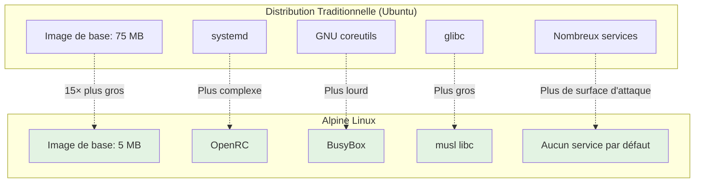
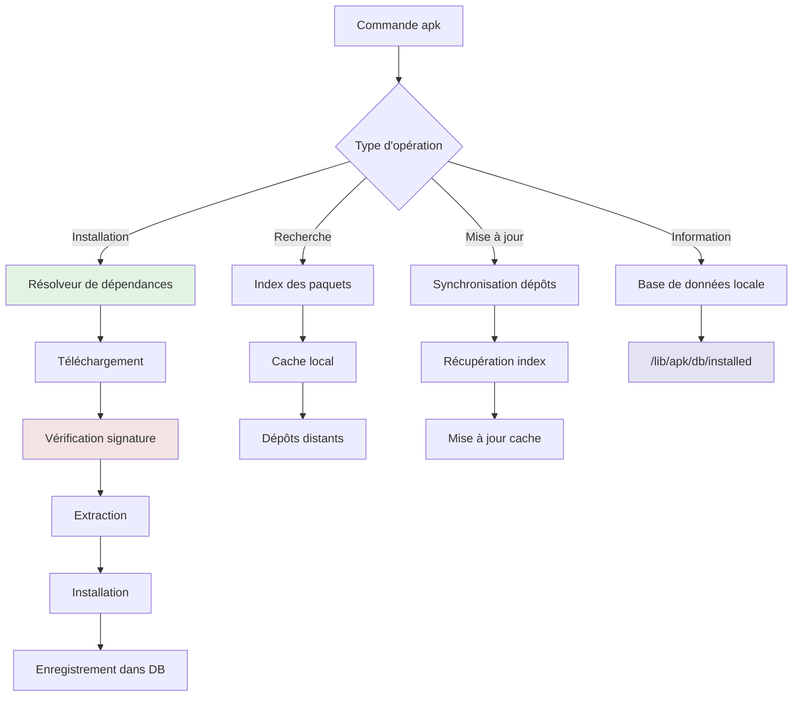

# APK — Alpine Package Manager

## Introduction

**Niveau :** Débutant & Intermédiaire

!!! quote "Analogie pédagogique"
    _Imaginez une **bibliothèque minimaliste** où chaque livre est soigneusement sélectionné pour son utilité réelle, où les étagères occupent le minimum d'espace possible, et où le système de catalogage est si efficace qu'emprunter un ouvrage prend quelques secondes. **APK fonctionne exactement ainsi** : c'est un gestionnaire de paquets conçu pour la rapidité, la légèreté et l'efficacité, sans le superflu qui encombre les systèmes traditionnels._

> **APK (Alpine Package Keeper)** est le gestionnaire de paquets natif d'**Alpine Linux**, une distribution construite autour des principes de **sécurité**, **simplicité** et **efficacité des ressources**. Alpine est devenue la distribution de référence pour les **conteneurs Docker**, les **systèmes embarqués**, et les **environnements à ressources limitées**, grâce à sa taille minimale et sa philosophie de design épuré.

APK se distingue par sa **vitesse d'exécution**, sa **consommation mémoire minimale**, et son **modèle de sécurité renforcé**. Contrairement aux gestionnaires traditionnels qui peuvent prendre plusieurs secondes pour résoudre les dépendances, APK effectue ces opérations en quelques millisecondes. Cette efficacité en fait le choix privilégié pour les **images de conteneurs de production**, où chaque mégaoctet et chaque milliseconde comptent.

!!! info "Pourquoi c'est important ?"
    APK permet de construire des **systèmes ultra-légers** (images Docker de 5-10 MB contre 100+ MB pour Ubuntu), d'accélérer les **déploiements** (builds Docker 3-5× plus rapides), de réduire la **surface d'attaque** (moins de code = moins de vulnérabilités), et de maîtriser la **consommation de ressources** (critique pour les environnements cloud et edge).

## Pour repartir des bases (vrais débutants)

Si vous n'avez jamais administré de système Linux, ce chapitre suppose que vous comprenez les concepts de **distribution Linux**, **paquet logiciel**, et **ligne de commande**. Alpine Linux diffère substantiellement des distributions grand public (Ubuntu, Fedora) dans sa philosophie et ses outils. Si vous débutez avec Linux en général, considérez d'abord Ubuntu ou Debian avant Alpine.

!!! tip "Alpine n'est pas pour tout le monde"
    Alpine Linux cible les **professionnels** recherchant performance et sécurité. Si vous cherchez une distribution de bureau conviviale avec interface graphique et compatibilité logicielle maximale, privilégiez Ubuntu. Alpine excelle dans les **serveurs**, **conteneurs**, et **systèmes embarqués** où chaque ressource compte.

## Philosophie Alpine Linux

Avant d'explorer APK, comprendre la philosophie d'Alpine éclaire ses choix de conception.

### Principes fondateurs

**Sécurité par défaut :**

- Compilation avec **Position Independent Executables (PIE)** et **Stack Smashing Protection (SSP)**
- Kernel durci avec patches **grsecurity** (historiquement)
- Pas de services actifs par défaut
- Surface d'attaque minimale

**Simplicité radicale :**

- Pas de systemd (utilise OpenRC)
- Pas de GNU coreutils (utilise BusyBox)
- Scripts d'initialisation minimalistes
- Configuration en fichiers texte clairs

**Légèreté extrême :**

- Image de base Alpine : **~5 MB**
- Image Ubuntu de base : **~75 MB**
- Debian slim : **~27 MB**

**Bibliothèque C :**

- Utilise **musl libc** au lieu de **glibc**
- Plus léger, plus rapide, plus sécurisé
- Incompatibilité binaire avec programmes compilés pour glibc



### Cas d'usage typiques

| Cas d'usage | Pourquoi Alpine ? | Alternative |
|-------------|-------------------|-------------|
| **Images Docker de production** | Taille minimale, rapidité de déploiement | Ubuntu (si binaires glibc requis) |
| **Microservices** | Consommation mémoire réduite | Debian slim |
| **Systèmes embarqués** | Empreinte disque/RAM minimale | Buildroot, Yocto |
| **Reverse proxy (Nginx)** | Performance, sécurité | Debian |
| **Routeurs/Firewalls** | Stabilité, légèreté | OpenWrt |
| **Environnements cloud** | Coûts réduits, scaling rapide | - |

!!! warning "Limitations d'Alpine"
    La bibliothèque **musl libc** crée des incompatibilités avec certains logiciels propriétaires et binaires précompilés pour glibc. Les applications Java, Node.js, Python fonctionnent parfaitement. Les binaires C/C++ propriétaires nécessitent souvent une recompilation.

## Architecture d'APK

APK adopte une architecture modulaire orientée performance.



### Composants clés

**Base de données locale :**
```
/lib/apk/db/
├── installed          # Paquets installés avec versions
├── scripts.tar        # Scripts pre/post installation
├── triggers           # Déclencheurs système
└── lock               # Verrouillage pour opérations concurrentes
```

**Configuration des dépôts :**
```
/etc/apk/
├── repositories       # Liste des dépôts actifs
├── world              # Paquets installés explicitement par l'utilisateur
├── keys/              # Clés publiques de signature
│   ├── alpine-devel@lists.alpinelinux.org-*.rsa.pub
│   └── ...
└── cache/             # Cache des paquets téléchargés (optionnel)
```

**Dépôts officiels :**
```
# Structure des dépôts Alpine
https://dl-cdn.alpinelinux.org/alpine/
├── v3.18/             # Version stable
│   ├── main/          # Paquets principaux supportés officiellement
│   ├── community/     # Paquets communautaires
│   └── testing/       # Paquets expérimentaux
├── v3.19/             # Version suivante
└── edge/              # Branche de développement
    ├── main/
    ├── community/
    └── testing/
```

## Commandes fondamentales

### Synchronisation et mise à jour

**Mise à jour de l'index des paquets :**
```bash
# Synchroniser l'index local avec les dépôts
apk update
```

Cette commande télécharge les listes de paquets disponibles depuis les dépôts configurés. Exécutez-la **avant toute installation** pour garantir l'accès aux versions les plus récentes.

**Mise à niveau du système :**
```bash
# Mettre à jour tous les paquets installés
apk upgrade

# Mise à jour avec affichage verbeux
apk upgrade -v

# Simulation (dry-run) sans installation réelle
apk upgrade --simulate
```

**Workflow recommandé pour mises à jour :**
```bash
# 1. Synchroniser l'index
apk update

# 2. Vérifier les mises à jour disponibles
apk list --upgradable

# 3. Appliquer les mises à jour
apk upgrade

# 4. Redémarrer si kernel mis à jour
# Vérifier avec : apk info -L linux-lts | grep boot
```

### Installation de paquets

**Installation basique :**
```bash
# Installer un paquet
apk add nginx

# Installer plusieurs paquets
apk add nginx postgresql redis

# Installer avec confirmation interactive (verbose)
apk add -v nginx

# Installer depuis un dépôt spécifique
apk add nginx@edge

# Installer une version spécifique
apk add 'nginx=1.24.0-r0'
```

**Installation avec dépendances :**
```bash
# APK résout automatiquement les dépendances
apk add python3

# Affichera quelque chose comme :
# (1/5) Installing libbz2 (1.0.8-r4)
# (2/5) Installing expat (2.5.0-r1)
# (3/5) Installing libffi (3.4.4-r0)
# (4/5) Installing gdbm (1.23-r0)
# (5/5) Installing python3 (3.11.6-r0)
```

**Installation sans mise en cache :**
```bash
# Utile pour images Docker (économise l'espace)
apk add --no-cache nginx

# Équivalent à :
apk add nginx && rm -rf /var/cache/apk/*
```

**Installation de paquets virtuels :**
```bash
# Créer un groupe de paquets pour suppression facile ultérieure
apk add --virtual .build-deps gcc musl-dev python3-dev

# Compiler/installer votre application

# Supprimer tous les paquets du groupe virtuel
apk del .build-deps
```

!!! tip "Paquets virtuels pour builds Docker"
    Les paquets virtuels permettent d'installer des dépendances de compilation temporaires, puis de les supprimer en une commande. Crucial pour minimiser la taille des images Docker.

### Recherche de paquets

**Recherche par nom :**
```bash
# Rechercher un paquet
apk search nginx

# Recherche exacte
apk search -e nginx

# Recherche avec descriptions
apk search -v -d nginx

# Recherche avec regex
apk search 'python3-*'
```

**Exemple de sortie détaillée :**
```bash
$ apk search -v -d nginx
nginx-1.24.0-r6 - HTTP and reverse proxy server
nginx-mod-http-geoip-1.24.0-r6 - Nginx GeoIP module
nginx-mod-http-headers-more-1.24.0-r6 - Nginx headers-more module
nginx-mod-stream-1.24.0-r6 - Nginx stream module
```

### Informations sur les paquets

**Afficher les informations d'un paquet :**
```bash
# Informations complètes
apk info nginx

# Taille du paquet
apk info -s nginx

# Description détaillée
apk info -d nginx

# Page web du projet
apk info -w nginx

# Dépendances
apk info -R nginx

# Dépendances inverses (qui dépend de ce paquet)
apk info -r nginx

# Tous les fichiers installés par le paquet
apk info -L nginx
```

**Exemple de sortie complète :**
```bash
$ apk info nginx
nginx-1.24.0-r6 description:
HTTP and reverse proxy server

nginx-1.24.0-r6 webpage:
https://nginx.org/

nginx-1.24.0-r6 installed size:
1568 KiB
```

**Identifier le paquet propriétaire d'un fichier :**
```bash
# Quel paquet a installé ce fichier ?
apk info --who-owns /usr/sbin/nginx

# Sortie : /usr/sbin/nginx is owned by nginx-1.24.0-r6
```

### Suppression de paquets

**Suppression basique :**
```bash
# Supprimer un paquet
apk del nginx

# Supprimer plusieurs paquets
apk del nginx postgresql redis

# Supprimer avec purge des fichiers de configuration
apk del --purge nginx
```

**Suppression de dépendances orphelines :**
```bash
# APK ne conserve pas les dépendances inutilisées automatiquement
# Il faut les identifier manuellement

# Lister les paquets installés qui ne sont pas dans 'world'
apk info | sort > installed.txt
cat /etc/apk/world | sort > world.txt
comm -23 installed.txt world.txt

# Analyser manuellement et supprimer si nécessaire
```

### Gestion du cache

**APK ne maintient pas de cache par défaut** (contrairement à apt/dnf). Le cache doit être activé explicitement.

```bash
# Activer le cache dans /etc/apk/cache
mkdir -p /var/cache/apk
ln -s /var/cache/apk /etc/apk/cache

# Nettoyer le cache
rm -rf /var/cache/apk/*

# Afficher la taille du cache
du -sh /var/cache/apk/
```

**Dans un Dockerfile Alpine :**
```dockerfile
# MAUVAIS - Cache inutile dans l'image finale
RUN apk add nginx

# BON - Pas de cache, image plus légère
RUN apk add --no-cache nginx

# BON - Cache pour builds multiples, nettoyé à la fin
RUN apk update && \
    apk add --no-cache nginx python3 && \
    rm -rf /var/cache/apk/*
```

## Gestion des dépôts

### Configuration des dépôts

**Fichier de configuration :**
```bash
# /etc/apk/repositories
https://dl-cdn.alpinelinux.org/alpine/v3.18/main
https://dl-cdn.alpinelinux.org/alpine/v3.18/community
#https://dl-cdn.alpinelinux.org/alpine/v3.18/testing
```

**Activer un dépôt supplémentaire :**
```bash
# Ajouter le dépôt testing
echo "https://dl-cdn.alpinelinux.org/alpine/v3.18/testing" >> /etc/apk/repositories

# Mettre à jour l'index
apk update
```

**Utiliser un miroir géographiquement proche :**
```bash
# Liste des miroirs : https://mirrors.alpinelinux.org/

# Exemple pour un miroir français
sed -i 's|dl-cdn.alpinelinux.org|alpine.42.fr|g' /etc/apk/repositories

# Ou éditer manuellement /etc/apk/repositories
```

### Dépôts par branche

| Dépôt | Stabilité | Usage | Mise à jour |
|-------|-----------|-------|-------------|
| **main** | Stable | Paquets officiels supportés | Conservative |
| **community** | Stable | Paquets communautaires testés | Régulière |
| **testing** | Instable | Paquets expérimentaux | Fréquente |
| **edge** | Très instable | Développement actif | Continue |

**Installer depuis edge temporairement :**
```bash
# Ajouter edge au fichier repositories
echo "@edge https://dl-cdn.alpinelinux.org/alpine/edge/main" >> /etc/apk/repositories
apk update

# Installer un paquet spécifique depuis edge
apk add package-name@edge

# Le reste du système reste sur stable
```

### Épinglage de dépôts (Repository Pinning)

```bash
# /etc/apk/repositories avec tags
@main https://dl-cdn.alpinelinux.org/alpine/v3.18/main
@community https://dl-cdn.alpinelinux.org/alpine/v3.18/community
@edge https://dl-cdn.alpinelinux.org/alpine/edge/main

# Installer depuis un dépôt spécifique
apk add package@main
apk add package@edge
```

## Cas d'usage avancés

### Construction d'images Docker optimales

**Dockerfile multi-stage pour image minimale :**
```dockerfile
# Stage 1 : Build
FROM alpine:3.18 AS builder

# Installer dépendances de compilation (paquet virtuel)
RUN apk add --no-cache --virtual .build-deps \
    gcc \
    musl-dev \
    python3-dev \
    py3-pip

# Installer dépendances Python
COPY requirements.txt /tmp/
RUN pip3 install --no-cache-dir -r /tmp/requirements.txt

# Stage 2 : Runtime
FROM alpine:3.18

# Copier uniquement les dépendances Python depuis builder
COPY --from=builder /usr/lib/python3.11/site-packages /usr/lib/python3.11/site-packages

# Installer uniquement le runtime (pas gcc, etc.)
RUN apk add --no-cache \
    python3 \
    ca-certificates \
    tzdata

# Copier l'application
COPY app/ /app/
WORKDIR /app

# Utilisateur non-root pour sécurité
RUN addgroup -g 1000 appuser && \
    adduser -D -u 1000 -G appuser appuser
USER appuser

CMD ["python3", "main.py"]
```

**Résultat :**
- Image Ubuntu équivalente : **~150 MB**
- Image Alpine optimisée : **~30 MB**
- Réduction de **80%** de la taille

### Installation de paquets avec scripts

```bash
# Script d'installation automatisé
#!/bin/sh
set -e  # Arrêt immédiat en cas d'erreur

# Fonction de vérification
check_package() {
    if apk info -e "$1" > /dev/null 2>&1; then
        echo "✓ $1 déjà installé"
        return 0
    else
        echo "✗ $1 non installé"
        return 1
    fi
}

# Mise à jour système
echo "Mise à jour de l'index..."
apk update

# Installation conditionnelle
packages="nginx postgresql redis python3"
for pkg in $packages; do
    if ! check_package "$pkg"; then
        echo "Installation de $pkg..."
        apk add --no-cache "$pkg"
    fi
done

# Vérification post-installation
echo "\nPaquets installés :"
apk info | grep -E "nginx|postgresql|redis|python3"
```

### Création d'un dépôt local

**Scénario :** Environnement isolé sans accès Internet

```bash
# 1. Créer la structure du dépôt
mkdir -p /var/www/alpine/v3.18/main/x86_64

# 2. Télécharger les paquets nécessaires
cd /var/www/alpine/v3.18/main/x86_64
apk fetch nginx postgresql redis

# 3. Générer l'index du dépôt
apk index -o APKINDEX.tar.gz *.apk

# 4. Signer l'index (optionnel mais recommandé)
openssl genrsa -out /tmp/private.key 2048
openssl rsa -in /tmp/private.key -pubout -out /tmp/public.key
abuild-sign -k /tmp/private.key APKINDEX.tar.gz

# 5. Configurer Nginx pour servir le dépôt
cat > /etc/nginx/http.d/alpine-repo.conf <<EOF
server {
    listen 80;
    server_name alpine.local;
    root /var/www/alpine;
    autoindex on;
}
EOF

# 6. Sur les clients, configurer le dépôt local
echo "http://alpine.local/v3.18/main" > /etc/apk/repositories
cp /tmp/public.key /etc/apk/keys/
apk update
```

### Audit de sécurité des paquets

```bash
# Lister tous les paquets installés avec versions
apk info -v | sort

# Identifier les paquets avec vulnérabilités connues
# (nécessite un outil tiers comme trivy)
apk add trivy
trivy rootfs /

# Vérifier l'intégrité des fichiers installés
apk audit

# Lister les paquets installés mais pas dans 'world'
# (potentiellement oubliés/inutiles)
comm -23 <(apk info | sort) <(cat /etc/apk/world | sort)
```

## Comparaison avec autres gestionnaires

| Fonctionnalité | APK (Alpine) | APT (Debian/Ubuntu) | DNF (Fedora/RHEL) |
|----------------|--------------|---------------------|-------------------|
| **Vitesse résolution dépendances** | Millisecondes | Secondes | Secondes |
| **Taille binaire** | ~100 KB | ~2.5 MB | ~3 MB |
| **Consommation RAM** | <5 MB | ~50 MB | ~100 MB |
| **Cache par défaut** | Non | Oui | Oui |
| **Transactions atomiques** | Oui | Oui | Oui |
| **Gestion snapshots** | Non | Non | Oui (avec Btrfs) |
| **Documentation** | Minimale | Excellente | Excellente |
| **Nombre de paquets** | ~13000 | ~60000 | ~80000 |

**Commandes équivalentes :**

| Opération | APK | APT | DNF |
|-----------|-----|-----|-----|
| Mettre à jour index | `apk update` | `apt update` | `dnf check-update` |
| Installer paquet | `apk add nginx` | `apt install nginx` | `dnf install nginx` |
| Supprimer paquet | `apk del nginx` | `apt remove nginx` | `dnf remove nginx` |
| Rechercher paquet | `apk search nginx` | `apt search nginx` | `dnf search nginx` |
| Info paquet | `apk info nginx` | `apt show nginx` | `dnf info nginx` |
| Lister installés | `apk info` | `dpkg -l` | `dnf list installed` |
| Mettre à jour système | `apk upgrade` | `apt upgrade` | `dnf upgrade` |
| Nettoyer cache | `rm -rf /var/cache/apk/*` | `apt clean` | `dnf clean all` |

## Bonnes pratiques

### Pour images Docker

**Optimisation de la taille :**
```dockerfile
# MAUVAIS - Crée des couches inutiles
RUN apk update
RUN apk add nginx
RUN apk add postgresql

# BON - Une seule couche, cache désactivé
RUN apk add --no-cache \
    nginx \
    postgresql

# EXCELLENT - Multi-stage avec paquets virtuels
FROM alpine:3.18 AS builder
RUN apk add --no-cache --virtual .build-deps gcc musl-dev
RUN # compiler l'application
RUN apk del .build-deps

FROM alpine:3.18
COPY --from=builder /app/binary /app/
RUN apk add --no-cache ca-certificates
```

**Sécurité :**
```dockerfile
# Utiliser version spécifique d'Alpine
FROM alpine:3.18.4

# Mettre à jour immédiatement pour patchs de sécurité
RUN apk upgrade --no-cache

# Créer utilisateur non-root
RUN addgroup -g 1000 appuser && \
    adduser -D -u 1000 -G appuser appuser

# Installer uniquement le nécessaire
RUN apk add --no-cache \
    nginx=1.24.0-r6 \
    && rm -rf /var/cache/apk/*

USER appuser
```

### Pour systèmes de production

**Épinglage des versions :**
```bash
# /etc/apk/world - Versions explicites
nginx=1.24.0-r6
postgresql=15.4-r0
redis=7.0.12-r0

# Installer avec versions exactes
apk add 'nginx=1.24.0-r6'

# Empêcher les mises à jour automatiques non voulues
```

**Sauvegarde de la configuration :**
```bash
# Sauvegarder la liste des paquets installés
apk info > /backup/installed-packages.txt

# Sauvegarder world (paquets explicites)
cp /etc/apk/world /backup/world

# Restaurer sur un nouveau système
apk add $(cat /backup/world)
```

**Monitoring des mises à jour :**
```bash
# Script de vérification quotidienne
#!/bin/sh
apk update > /dev/null 2>&1
upgrades=$(apk list --upgradable 2>/dev/null | wc -l)

if [ "$upgrades" -gt 0 ]; then
    echo "⚠️  $upgrades paquets à mettre à jour"
    apk list --upgradable
    # Envoyer notification (email, Slack, etc.)
fi
```

### Résolution de problèmes

**Réparation de base de données corrompue :**
```bash
# Réinitialiser la base de données APK
rm -rf /lib/apk/db
apk fix --reinstall

# Reconstruire complètement
apk add --initdb
apk add alpine-base
```

**Dépendances cassées :**
```bash
# Vérifier l'intégrité du système
apk audit

# Réparer les dépendances
apk fix

# Réinstaller un paquet corrompu
apk fix --reinstall nginx
```

**Déblocage après interruption :**
```bash
# Supprimer le fichier de verrouillage
rm -f /lib/apk/db/lock

# Reprendre l'opération
apk update
```

## Limites et considérations

### Incompatibilités connues

**Logiciels nécessitant glibc :**
```bash
# Ces paquets peuvent poser problème sur Alpine (musl libc)
- Oracle Java (utiliser OpenJDK Alpine natif)
- Certains binaires Go avec CGO activé
- Applications .NET compilées pour glibc
- Binaires propriétaires précompilés
```

**Solutions :**
```bash
# Option 1 : Recompiler pour musl
apk add alpine-sdk
# Compiler depuis les sources

# Option 2 : Utiliser gcompat (couche de compatibilité)
apk add gcompat
# Certains binaires fonctionneront

# Option 3 : Conteneur avec distribution glibc
# Utiliser Ubuntu/Debian pour ce composant spécifique
```

### Performance et limitations

**Taille du dépôt :**
- Alpine : ~13000 paquets
- Debian : ~60000 paquets
- Si un logiciel n'existe pas, compilation nécessaire

**Documentation :**
- Wiki Alpine moins fourni que Arch Wiki ou Debian Wiki
- Communauté plus petite
- Moins de tutoriels et guides

**Support commercial :**
- Pas de support LTS payant officiel (contrairement à RHEL/Ubuntu)
- Support communautaire uniquement

## Le mot de la fin

!!! quote
    APK représente l'aboutissement d'une philosophie radicale : **moins, c'est plus**. Dans un monde où les distributions Linux gonflent avec des fonctionnalités superflues, Alpine Linux et APK offrent une alternative rafraîchissante : un système qui fait exactement ce dont vous avez besoin, sans plus.
    
    La force d'APK réside dans sa **spécialisation**. Il ne cherche pas à rivaliser avec apt ou dnf sur le nombre de fonctionnalités. Il excelle dans son domaine : **vitesse**, **légèreté**, et **efficacité**. Lorsque vous construisez une image Docker et que vous réduisez sa taille de 150 MB à 30 MB, vous comprenez immédiatement la valeur d'Alpine. Lorsque votre application démarre en 100 ms au lieu de 2 secondes, l'investissement en vaut la peine.
    
    Alpine n'est pas pour tout le monde. Si vous recherchez la **compatibilité maximale** avec des logiciels propriétaires, restez sur Debian ou Ubuntu. Si vous voulez une **distribution de bureau conviviale**, choisissez Ubuntu. Mais si vous construisez des **microservices**, des **conteneurs de production**, ou des **systèmes embarqués** où chaque mégaoctet et chaque milliseconde comptent, Alpine et APK deviennent indispensables.
    
    Maîtriser APK, c'est comprendre que l'optimisation ne commence pas au niveau du code, mais au niveau du **système d'exploitation lui-même**. C'est accepter que parfois, faire moins permet de faire mieux. Cette philosophie, appliquée rigoureusement, produit des systèmes d'une **élégance** et d'une **efficacité** remarquables.

---

!!! abstract "Métadonnées"
    **Version** : 1.0  
    **Dernière mise à jour** : Novembre 2025  
    **Durée de lecture** : 35-40 minutes  
    **Niveau** : Débutant & Intermédiaire