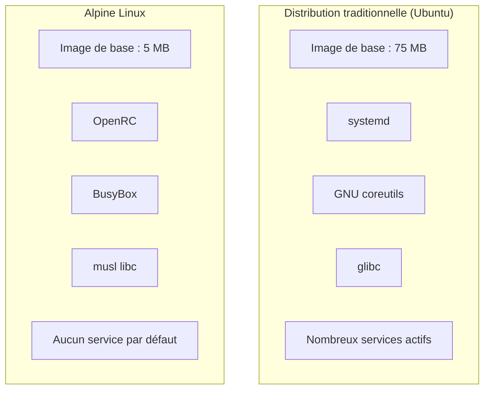
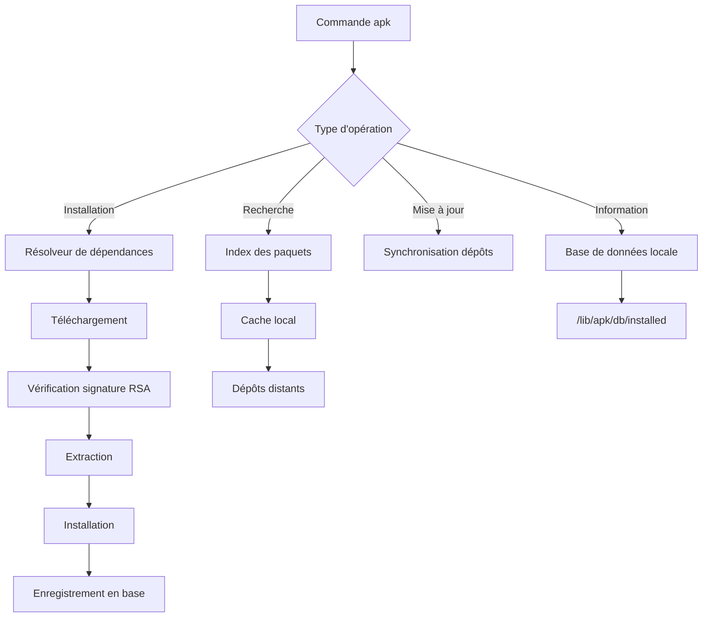

# APK — Alpine Package Manager

<div
  class="omny-meta"
  data-level="🟢 Débutant & 🟡 Intermédiaire"
  data-version="1.0"
  data-time="35-40 minutes">
</div>

!!! quote "Analogie"
    _Une bibliothèque minimaliste où chaque livre est soigneusement sélectionné pour son utilité réelle, où les étagères occupent le minimum d'espace possible, et où le système de catalogage est si efficace qu'emprunter un ouvrage prend quelques secondes. APK fonctionne exactement ainsi : un gestionnaire de paquets conçu pour la rapidité, la légèreté et l'efficacité, sans le superflu qui encombre les systèmes traditionnels._

**APK (Alpine Package Keeper)** est le gestionnaire de paquets natif d'**Alpine Linux**, une distribution construite autour des principes de sécurité, simplicité et efficacité des ressources. Alpine est devenue la distribution de référence pour les **conteneurs Docker**, les systèmes embarqués et les environnements à ressources limitées, grâce à sa taille minimale et sa philosophie de design épuré.

APK se distingue par sa vitesse d'exécution, sa consommation mémoire minimale et son modèle de sécurité renforcé. Contrairement aux gestionnaires traditionnels qui peuvent prendre plusieurs secondes pour résoudre les dépendances, APK effectue ces opérations en quelques millisecondes. Cette efficacité en fait le choix privilégié pour les images de conteneurs de production, où chaque mégaoctet et chaque milliseconde comptent.

!!! info "Pourquoi c'est important"
    APK permet de construire des systèmes ultra-légers (images Docker de 5 à 10 MB contre 100+ MB pour Ubuntu), d'accélérer les builds Docker (3 à 5 fois plus rapides), de réduire la surface d'attaque (moins de code égale moins de vulnérabilités) et de maîtriser la consommation de ressources en environnement cloud et edge.

!!! warning "Alpine n'est pas pour tout le monde"
    Alpine Linux cible les professionnels recherchant performance et sécurité. Pour une distribution de bureau conviviale avec interface graphique et compatibilité logicielle maximale, Ubuntu est plus adapté. Alpine excelle dans les serveurs, conteneurs et systèmes embarqués où chaque ressource compte.

<br />

---

## Philosophie Alpine Linux

Avant d'explorer APK, comprendre la philosophie d'Alpine éclaire ses choix de conception.

!!! note "L'image ci-dessous compare la philosophie Alpine à celle des distributions traditionnelles. La différence de taille et de complexité n'est pas un accident — elle découle de choix architecturaux délibérés à chaque niveau de la pile."


<p><em>Alpine remplace GNU coreutils par BusyBox (un seul binaire multi-commandes), glibc par musl libc (plus léger et plus sécurisé) et systemd par OpenRC (démarrage minimal). Ces trois choix combinés expliquent la différence de taille entre une image Alpine de 5 MB et une image Ubuntu de 75 MB.</em></p>

### Principes fondateurs

**Sécurité par défaut :** compilation avec Position Independent Executables (PIE) et Stack Smashing Protection (SSP), pas de services actifs par défaut, surface d'attaque minimale.

**Simplicité radicale :** pas de systemd (utilise OpenRC), pas de GNU coreutils (utilise BusyBox), configuration en fichiers texte clairs.

**Légèreté extrême :** image de base Alpine à 5 MB contre 75 MB pour Ubuntu et 27 MB pour Debian slim.

**Bibliothèque C :** utilise **musl libc** au lieu de **glibc** — plus léger, plus rapide, plus sécurisé, mais incompatible binaire avec les programmes compilés pour glibc.


```mermaid
flowchart TB
    subgraph "Distribution traditionnelle (Ubuntu)"
        A1["Image de base : 75 MB"]
        A2["systemd"]
        A3["GNU coreutils"]
        A4["glibc"]
        A5["Nombreux services actifs"]
    end

    subgraph "Alpine Linux"
        B1["Image de base : 5 MB"]
        B2["OpenRC"]
        B3["BusyBox"]
        B4["musl libc"]
        B5["Aucun service par défaut"]
    end
```

### Cas d'usage typiques

| Cas d'usage | Pourquoi Alpine | Alternative si incompatible |
|---|---|---|
| Images Docker de production | Taille minimale, déploiement rapide | Ubuntu si binaires glibc requis |
| Microservices | Consommation mémoire réduite | Debian slim |
| Systèmes embarqués | Empreinte disque et RAM minimale | Buildroot, Yocto |
| Reverse proxy (Nginx) | Performance, sécurité | Debian |
| Environnements cloud | Coûts réduits, scaling rapide | — |

!!! warning "Limitations d'Alpine"
    La bibliothèque musl libc crée des incompatibilités avec certains logiciels propriétaires et binaires précompilés pour glibc. Les applications Java, Node.js et Python fonctionnent parfaitement. Les binaires C et C++ propriétaires nécessitent souvent une recompilation.

<br />

---

## Architecture d'APK

!!! note "L'image ci-dessous détaille le flux interne d'APK lors d'une installation. Comprendre ce flux explique pourquoi APK est plus rapide que ses équivalents et comment la vérification de signature garantit l'intégrité des paquets."


<p><em>APK résout les dépendances en mémoire sans écriture disque intermédiaire, ce qui explique sa vitesse de résolution en millisecondes. La vérification de signature RSA est systématique avant toute extraction — un paquet dont la signature ne correspond pas à une clé de confiance est rejeté.</em></p>


```mermaid
flowchart TB
    A["Commande apk"]
    B{"Type d'opération"}

    A --> B

    B -->|Installation| C["Résolveur de dépendances"]
    B -->|Recherche| D["Index des paquets"]
    B -->|Mise à jour| E["Synchronisation dépôts"]
    B -->|Information| F["Base de données locale"]

    C --> G["Téléchargement"]
    G --> H["Vérification signature RSA"]
    H --> I["Extraction"]
    I --> J["Installation"]
    J --> K["Enregistrement en base"]

    D --> L["Cache local"]
    L --> M["Dépôts distants"]

    F --> P["/lib/apk/db/installed"]
```

### Structure des fichiers système

```bash title="Bash — base de données APK locale"
# /lib/apk/db/
# ├── installed          # Paquets installés avec versions
# ├── scripts.tar        # Scripts pre/post installation
# ├── triggers           # Déclencheurs système
# └── lock               # Verrouillage pour opérations concurrentes
```

```bash title="Bash — configuration APK"
# /etc/apk/
# ├── repositories       # Liste des dépôts actifs
# ├── world              # Paquets installés explicitement
# ├── keys/              # Clés publiques de signature RSA
# └── cache/             # Cache des paquets téléchargés (optionnel)
```

```bash title="Bash — structure des dépôts officiels Alpine"
# https://dl-cdn.alpinelinux.org/alpine/
# ├── v3.18/
# │   ├── main/          # Paquets officiels supportés
# │   ├── community/     # Paquets communautaires
# │   └── testing/       # Paquets expérimentaux
# ├── v3.19/
# └── edge/              # Branche de développement
#     ├── main/
#     ├── community/
#     └── testing/
```

<br />

---

## Commandes fondamentales

### Synchronisation et mise à jour

```bash title="Bash — synchroniser l'index des paquets"
# Télécharger les listes de paquets depuis les dépôts configurés
# A exécuter avant toute installation
apk update
```

```bash title="Bash — mettre à jour le système"
# Mettre à jour tous les paquets installés
apk upgrade

# Affichage verbeux
apk upgrade -v

# Simulation sans installation réelle
apk upgrade --simulate
```

```bash title="Bash — workflow recommandé pour les mises à jour"
# 1. Synchroniser l'index
apk update

# 2. Vérifier les mises à jour disponibles
apk list --upgradable

# 3. Appliquer les mises à jour
apk upgrade
```

### Installation de paquets

```bash title="Bash — installer des paquets"
# Installer un paquet
apk add nginx

# Installer plusieurs paquets
apk add nginx postgresql redis

# Installer depuis un dépôt spécifique
apk add nginx@edge

# Installer une version exacte
apk add 'nginx=1.24.0-r0'
```

```bash title="Bash — installer sans cache (Docker)"
# Recommandé pour images Docker — évite les fichiers de cache dans l'image finale
apk add --no-cache nginx
```

```bash title="Bash — paquets virtuels pour dépendances temporaires"
# Créer un groupe de paquets nommé pour suppression groupée ultérieure
apk add --virtual .build-deps gcc musl-dev python3-dev

# Compiler ou installer l'application...

# Supprimer toutes les dépendances de compilation en une commande
apk del .build-deps
```

!!! tip "Paquets virtuels dans les builds Docker"
    Les paquets virtuels permettent d'installer des dépendances de compilation temporaires et de les supprimer en une seule commande après usage. C'est le mécanisme central pour maintenir des images Docker légères.

APK résout automatiquement les dépendances — installer `python3` installe aussi `libbz2`, `expat`, `libffi` et les autres dépendances transitives requises.

### Recherche de paquets

```bash title="Bash — rechercher des paquets"
# Rechercher par nom
apk search nginx

# Recherche exacte
apk search -e nginx

# Recherche avec descriptions
apk search -v -d nginx

# Recherche avec motif
apk search 'python3-*'
```

### Informations sur les paquets

```bash title="Bash — inspecter un paquet"
# Informations complètes
apk info nginx

# Taille du paquet installé
apk info -s nginx

# Dépendances directes
apk info -R nginx

# Dépendances inverses — qui dépend de ce paquet
apk info -r nginx

# Tous les fichiers installés par le paquet
apk info -L nginx

# Identifier le paquet propriétaire d'un fichier
apk info --who-owns /usr/sbin/nginx
# /usr/sbin/nginx is owned by nginx-1.24.0-r6
```

### Suppression de paquets

```bash title="Bash — supprimer des paquets"
# Supprimer un paquet
apk del nginx

# Supprimer plusieurs paquets
apk del nginx postgresql redis

# Supprimer avec purge des fichiers de configuration
apk del --purge nginx
```

### Gestion du cache

APK ne maintient pas de cache par défaut — il doit être activé explicitement.

```bash title="Bash — activer et gérer le cache APK"
# Activer le cache
mkdir -p /var/cache/apk
ln -s /var/cache/apk /etc/apk/cache

# Nettoyer le cache
rm -rf /var/cache/apk/*

# Afficher la taille du cache
du -sh /var/cache/apk/
```

<br />

---

## Gestion des dépôts

### Configuration

```bash title="Bash — /etc/apk/repositories"
https://dl-cdn.alpinelinux.org/alpine/v3.18/main
https://dl-cdn.alpinelinux.org/alpine/v3.18/community
#https://dl-cdn.alpinelinux.org/alpine/v3.18/testing
```

```bash title="Bash — activer un dépôt supplémentaire"
# Ajouter le dépôt testing
echo "https://dl-cdn.alpinelinux.org/alpine/v3.18/testing" >> /etc/apk/repositories

# Mettre à jour l'index
apk update
```

```bash title="Bash — utiliser un miroir géographiquement proche"
# Liste des miroirs disponibles : https://mirrors.alpinelinux.org/
sed -i 's|dl-cdn.alpinelinux.org|alpine.42.fr|g' /etc/apk/repositories
```

### Dépôts par branche

| Dépôt | Stabilité | Usage | Rythme de mise à jour |
|---|---|---|---|
| main | Stable | Paquets officiels supportés | Conservateur |
| community | Stable | Paquets communautaires testés | Régulier |
| testing | Instable | Paquets expérimentaux | Fréquent |
| edge | Très instable | Développement actif | Continu |

### Épinglage de dépôts

```bash title="Bash — /etc/apk/repositories avec tags d'épinglage"
@main      https://dl-cdn.alpinelinux.org/alpine/v3.18/main
@community https://dl-cdn.alpinelinux.org/alpine/v3.18/community
@edge      https://dl-cdn.alpinelinux.org/alpine/edge/main
```

```bash title="Bash — installer un paquet depuis un dépôt spécifique"
# Installer depuis edge sans toucher au reste du système
apk add package-name@edge
```

<br />

---

## Cas d'usage avancés

### Optimisation d'images Docker

!!! note "L'image ci-dessous illustre le pattern paquets virtuels dans un build Docker multi-stage. C'est la technique la plus efficace pour réduire la taille d'une image Alpine sans sacrifier les fonctionnalités."


<p><em>Le pattern se déroule en trois temps : installer les dépendances de compilation dans un groupe virtuel nommé (.build-deps), compiler l'application, puis supprimer le groupe entier avec apk del .build-deps. Combiné au multi-stage build, cette technique réduit une image de 150 MB à 30 MB.</em></p>

```dockerfile title="Dockerfile — multi-stage avec paquets virtuels Alpine"
# Stage 1 — Build
FROM alpine:3.18 AS builder

# Installer les dépendances de compilation dans un groupe virtuel
RUN apk add --no-cache --virtual .build-deps \
    gcc \
    musl-dev \
    python3-dev \
    py3-pip

# Installer les dépendances Python
COPY requirements.txt /tmp/
RUN pip3 install --no-cache-dir -r /tmp/requirements.txt

# Stage 2 — Runtime
FROM alpine:3.18

# Copier uniquement les dépendances Python installées
COPY --from=builder /usr/lib/python3.11/site-packages /usr/lib/python3.11/site-packages

# Installer uniquement le runtime — gcc et musl-dev absents
RUN apk add --no-cache \
    python3 \
    ca-certificates \
    tzdata

COPY app/ /app/
WORKDIR /app

# Utilisateur non-root
RUN addgroup -g 1000 appuser && \
    adduser -D -u 1000 -G appuser appuser
USER appuser

CMD ["python3", "main.py"]
```

```dockerfile title="Dockerfile — règles de base pour images Alpine optimisées"
# Mauvais — plusieurs couches séparées, cache potentiel
RUN apk update
RUN apk add nginx
RUN apk add postgresql

# Correct — une seule couche, cache désactivé
RUN apk add --no-cache \
    nginx \
    postgresql

# Optimal — multi-stage avec paquets virtuels
FROM alpine:3.18 AS builder
RUN apk add --no-cache --virtual .build-deps gcc musl-dev
# ...compilation...
RUN apk del .build-deps

FROM alpine:3.18
COPY --from=builder /app/binary /app/
RUN apk add --no-cache ca-certificates
```

### Script d'installation automatisé

```bash title="Bash — script d'installation conditionnel"
#!/bin/sh
set -e  # Arrêt immédiat en cas d'erreur

# Vérifier si un paquet est installé
check_package() {
    if apk info -e "$1" > /dev/null 2>&1; then
        echo "$1 deja installe"
        return 0
    else
        echo "$1 absent"
        return 1
    fi
}

# Mise à jour de l'index
apk update

# Installation conditionnelle
packages="nginx postgresql redis python3"
for pkg in $packages; do
    if ! check_package "$pkg"; then
        echo "Installation de $pkg..."
        apk add --no-cache "$pkg"
    fi
done

# Vérification post-installation
echo "Paquets installés :"
apk info | grep -E "nginx|postgresql|redis|python3"
```

### Dépôt local pour environnement isolé

```bash title="Bash — créer un dépôt APK local (air-gap)"
# 1. Créer la structure du dépôt
mkdir -p /var/www/alpine/v3.18/main/x86_64

# 2. Télécharger les paquets nécessaires
cd /var/www/alpine/v3.18/main/x86_64
apk fetch nginx postgresql redis

# 3. Générer l'index du dépôt
apk index -o APKINDEX.tar.gz *.apk

# 4. Signer l'index
openssl genrsa -out /tmp/private.key 2048
openssl rsa -in /tmp/private.key -pubout -out /tmp/public.key
abuild-sign -k /tmp/private.key APKINDEX.tar.gz

# 5. Configurer Nginx pour servir le dépôt
cat > /etc/nginx/http.d/alpine-repo.conf << 'EOF'
server {
    listen 80;
    server_name alpine.local;
    root /var/www/alpine;
    autoindex on;
}
EOF

# 6. Sur les clients — pointer vers le dépôt local
echo "http://alpine.local/v3.18/main" > /etc/apk/repositories
cp /tmp/public.key /etc/apk/keys/
apk update
```

### Audit de sécurité

```bash title="Bash — audit des paquets installés"
# Lister tous les paquets installés avec versions
apk info -v | sort

# Vérifier l'intégrité des fichiers installés
apk audit

# Scanner les vulnérabilités (outil tiers)
apk add trivy
trivy rootfs /

# Identifier les paquets installés hors world
comm -23 <(apk info | sort) <(cat /etc/apk/world | sort)
```

<br />

---

## Comparaison avec autres gestionnaires

| Fonctionnalité | APK | APT | DNF |
|---|---|---|---|
| Vitesse résolution dépendances | Millisecondes | Secondes | Secondes |
| Taille binaire | ~100 KB | ~2.5 MB | ~3 MB |
| Consommation RAM | Moins de 5 MB | ~50 MB | ~100 MB |
| Cache par défaut | Non | Oui | Oui |
| Transactions atomiques | Oui | Oui | Oui |
| Nombre de paquets | ~13 000 | ~60 000 | ~80 000 |

**Équivalences de commandes :**

| Opération | APK | APT | DNF |
|---|---|---|---|
| Mettre à jour l'index | `apk update` | `apt update` | `dnf check-update` |
| Installer | `apk add nginx` | `apt install nginx` | `dnf install nginx` |
| Supprimer | `apk del nginx` | `apt remove nginx` | `dnf remove nginx` |
| Rechercher | `apk search nginx` | `apt search nginx` | `dnf search nginx` |
| Informations | `apk info nginx` | `apt show nginx` | `dnf info nginx` |
| Lister installés | `apk info` | `dpkg -l` | `dnf list installed` |
| Mettre à jour le système | `apk upgrade` | `apt upgrade` | `dnf upgrade` |
| Nettoyer le cache | `rm -rf /var/cache/apk/*` | `apt clean` | `dnf clean all` |

<br />

---

## Bonnes pratiques

### Sécurité des images Docker

```dockerfile title="Dockerfile — bonnes pratiques sécurité Alpine"
# Version Alpine épinglée — pas de tag latest en production
FROM alpine:3.18.4

# Appliquer les patchs de sécurité disponibles
RUN apk upgrade --no-cache

# Créer un utilisateur non-root
RUN addgroup -g 1000 appuser && \
    adduser -D -u 1000 -G appuser appuser

# Installer les paquets avec versions épinglées
RUN apk add --no-cache \
    nginx=1.24.0-r6

USER appuser
```

### Épinglage de versions en production

```bash title="Bash — /etc/apk/world avec versions épinglées"
nginx=1.24.0-r6
postgresql=15.4-r0
redis=7.0.12-r0
```

```bash title="Bash — installer avec version exacte"
apk add 'nginx=1.24.0-r6'
```

### Sauvegarde et restauration

```bash title="Bash — sauvegarder la liste des paquets installés"
# Sauvegarder world (paquets installés explicitement)
cp /etc/apk/world /backup/world

# Restaurer sur un nouveau système
apk add $(cat /backup/world)
```

### Monitoring des mises à jour

```bash title="Bash — script de vérification quotidienne des mises à jour"
#!/bin/sh
apk update > /dev/null 2>&1
upgrades=$(apk list --upgradable 2>/dev/null | wc -l)

if [ "$upgrades" -gt 0 ]; then
    echo "$upgrades paquets a mettre a jour :"
    apk list --upgradable
fi
```

<br />

---

## Dépannage

### Base de données corrompue

```bash title="Bash — réparer la base de données APK"
# Vérifier l'intégrité
apk audit

# Réparer les dépendances
apk fix

# Réinstaller un paquet corrompu
apk fix --reinstall nginx

# Réinitialisation complète
rm -rf /lib/apk/db
apk add --initdb
apk add alpine-base
```

### Opération bloquée (fichier de verrouillage)

```bash title="Bash — débloquer APK après interruption"
# Supprimer le verrou laissé par une opération interrompue
rm -f /lib/apk/db/lock

# Reprendre
apk update
```

### Incompatibilités musl libc

```bash title="Bash — options pour les binaires nécessitant glibc"
# Option 1 — Couche de compatibilité glibc (partielle)
apk add gcompat

# Option 2 — Recompiler depuis les sources pour musl
apk add alpine-sdk
# puis compiler l'application

# Option 3 — Utiliser une image avec glibc pour ce composant
# FROM debian:bookworm-slim pour ce service spécifique
```

<br />

---

## Limites et considérations

Le dépôt Alpine contient environ 13 000 paquets contre 60 000 pour Debian et 80 000 pour Fedora. Un logiciel absent nécessite une compilation depuis les sources. La documentation et la communauté Alpine sont plus réduites que celles de Debian ou Arch. Il n'existe pas de support commercial officiel à long terme — uniquement le support communautaire.

La bibliothèque musl libc crée des incompatibilités avec Oracle Java (utiliser OpenJDK Alpine natif), certains binaires Go avec CGO activé, les applications .NET compilées pour glibc et les binaires propriétaires précompilés.

<br />

---

## Conclusion

!!! quote "Ce qu'il faut retenir"
    La gestion des paquets via apk alpine est la porte d'entrée de toute administration système Linux. Comprendre ses mécanismes de résolution de dépendances et de dépôts garantit la stabilité et la sécurité de vos serveurs en production.

!!! quote "Conclusion"
    _APK représente l'aboutissement d'une philosophie radicale : moins, c'est plus. Dans un monde où les distributions Linux gonflent avec des fonctionnalités superflues, Alpine Linux et APK offrent une alternative structurée : un système qui fait exactement ce dont il a besoin, sans plus. La force d'APK réside dans sa spécialisation — il ne cherche pas à rivaliser avec apt ou dnf sur le nombre de fonctionnalités. Il excelle dans son domaine : vitesse, légèreté et efficacité. Réduire une image Docker de 150 MB à 30 MB ou faire démarrer une application en 100 ms au lieu de 2 secondes justifie l'investissement. Alpine n'est pas pour tous les cas — la compatibilité logicielle maximale appartient à Debian et Ubuntu. Mais pour les microservices, les conteneurs de production et les systèmes embarqués, maîtriser APK revient à optimiser au niveau du système d'exploitation lui-même, avant même d'écrire une ligne de code applicatif._

<br />