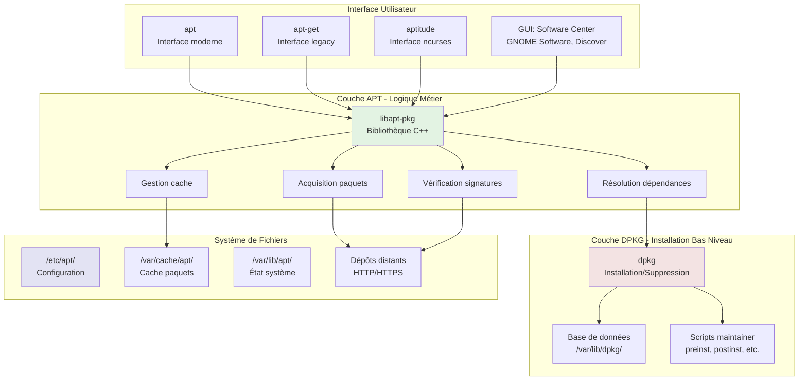
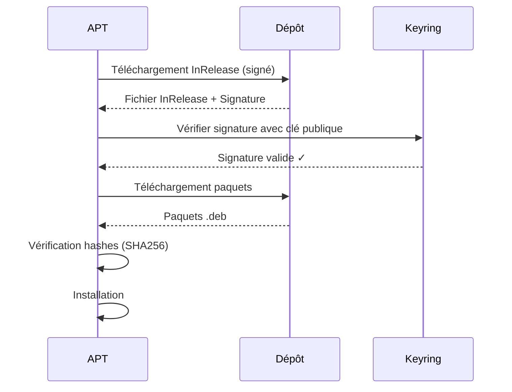

# APT — Advanced Package Tool

## Introduction

**Niveau :** 🟡 Intermédiaire / 🔴 Avancé

!!! quote "Analogie pédagogique"
    _Imaginez une **bibliothèque universitaire géante** avec un catalogue informatisé sophistiqué. Lorsque vous demandez un livre, le système vérifie automatiquement toutes ses dépendances (bibliographies requises, prérequis), résout les conflits potentiels avec vos emprunts existants, télécharge tout le nécessaire, et organise le tout dans votre bibliothèque personnelle. **APT fonctionne exactement ainsi** : c'est un système de gestion de paquets intelligent qui automatise entièrement l'installation, la mise à jour et la suppression de logiciels en gérant toutes les dépendances complexes._

> **APT (Advanced Package Tool)** est le gestionnaire de paquets de référence des distributions **Debian**, **Ubuntu**, et leurs dérivées (Linux Mint, Pop!_OS, Kali Linux, etc.). Créé en 1998, APT a révolutionné la gestion de logiciels Linux en introduisant la **résolution automatique des dépendances**, transformant l'installation de logiciels d'un calvaire technique en une expérience fluide et fiable.

APT gère aujourd'hui **plus de 60 000 paquets** dans les dépôts Debian, couvrant pratiquement tous les besoins logiciels imaginables. Sa fiabilité éprouvée et sa documentation exhaustive en font le choix privilégié pour les **serveurs de production**, les **infrastructures critiques**, et les **distributions grand public**. Ubuntu, basé sur Debian et utilisant APT, équipe des millions d'ordinateurs de bureau et des centaines de milliers de serveurs dans le monde.

!!! info "Pourquoi c'est important ?"
    APT permet la **gestion centralisée** de milliers de paquets, garantit la **stabilité du système** par la résolution rigoureuse des dépendances, automatise les **mises à jour de sécurité** critiques, et assure la **reproductibilité** des installations sur de multiples machines. Maîtriser APT est essentiel pour l'administration système professionnelle.

## Pour les vrais débutants

Si vous débutez avec Linux, APT constitue probablement votre premier contact avec un gestionnaire de paquets. Contrairement à Windows où vous téléchargez des `.exe` depuis divers sites, ou macOS où vous utilisez l'App Store, Linux centralise tous les logiciels dans des **dépôts** sécurisés accessibles via APT. Cette approche garantit la sécurité, la cohérence et la simplicité de gestion.

!!! tip "APT vs apt-get : Quelle différence ?"
    **apt** est la commande moderne (depuis 2014) conçue pour l'utilisateur interactif avec une sortie colorée et lisible. **apt-get** est l'outil historique optimisé pour les scripts. Dans la majorité des cas, utilisez **apt** pour une meilleure expérience utilisateur. Utilisez **apt-get** uniquement dans des scripts automatisés où la stabilité de l'interface est critique.

## Architecture APT

APT s'articule autour de plusieurs couches qui collaborent pour gérer le cycle de vie complet des paquets.



### Hiérarchie des outils

APT constitue une **surcouche intelligente** au-dessus de dpkg.

| Outil | Niveau | Rôle | Utilisation |
|-------|--------|------|-------------|
| **dpkg** | Bas | Installation/suppression locale de paquets .deb | Rarement direct |
| **apt-get** | Moyen | Gestion dépôts + résolution dépendances | Scripts |
| **apt** | Haut | Interface utilisateur moderne et conviviale | Usage quotidien |
| **aptitude** | Haut | Interface ncurses + résolveur avancé | Résolution conflits complexes |

!!! warning "dpkg vs APT"
    **dpkg** installe uniquement le fichier `.deb` fourni sans gérer les dépendances. Si une dépendance manque, l'installation échoue. **APT** résout automatiquement toutes les dépendances en téléchargeant les paquets nécessaires depuis les dépôts.  
    
    > N'utilisez jamais dpkg directement sauf cas très spécifiques.

### Composants du système

**Structure de configuration :**
```
/etc/apt/
├── sources.list              # Liste principale des dépôts
├── sources.list.d/           # Dépôts supplémentaires (un fichier par source)
│   ├── docker.list
│   ├── vscode.list
│   └── kubernetes.list
├── apt.conf.d/               # Configuration fragmentée
│   ├── 00-proxy             # Configuration proxy
│   ├── 20-auto-upgrades     # Mises à jour automatiques
│   └── 50-unattended-upgrades
├── preferences.d/            # Épinglage de versions (pinning)
├── trusted.gpg.d/            # Clés GPG des dépôts
│   ├── debian-archive-keyring.gpg
│   └── ubuntu-archive-keyring.gpg
└── keyrings/                 # Nouveau format de clés (deb822)
```

**Base de données et cache :**
```
/var/lib/apt/
├── lists/                    # Index téléchargés des dépôts
│   ├── deb.debian.org_debian_dists_bookworm_main_binary-amd64_Packages
│   └── security.debian.org_...
├── periodic/                 # État des tâches périodiques
└── extended_states           # États étendus (auto/manual)

/var/cache/apt/
├── archives/                 # Paquets .deb téléchargés
│   ├── nginx_1.24.0-1_amd64.deb
│   └── partial/             # Téléchargements en cours
└── pkgcache.bin             # Cache binaire compilé
```

**Base de données dpkg :**
```
/var/lib/dpkg/
├── status                    # État de tous les paquets installés
├── available                 # Paquets disponibles
├── info/                     # Métadonnées des paquets installés
│   ├── nginx.list           # Liste des fichiers installés
│   ├── nginx.md5sums        # Sommes de contrôle
│   ├── nginx.preinst        # Scripts d'installation
│   └── nginx.postinst
└── triggers/                 # Système de déclencheurs
```

## Gestion des dépôts

### Format sources.list

Le fichier `/etc/apt/sources.list` définit les sources de paquets.

**Syntaxe générale :**
```
deb [options] uri distribution composants
```

**Exemple Debian 12 (Bookworm) :**
```bash
# /etc/apt/sources.list

# Dépôt principal
deb http://deb.debian.org/debian bookworm main contrib non-free non-free-firmware
deb-src http://deb.debian.org/debian bookworm main contrib non-free non-free-firmware

# Mises à jour de sécurité (critique)
deb http://security.debian.org/debian-security bookworm-security main contrib non-free non-free-firmware
deb-src http://security.debian.org/debian-security bookworm-security main contrib non-free non-free-firmware

# Mises à jour intermédiaires (recommandé)
deb http://deb.debian.org/debian bookworm-updates main contrib non-free non-free-firmware
deb-src http://deb.debian.org/debian bookworm-updates main contrib non-free non-free-firmware

# Backports (optionnel - versions récentes de logiciels)
# deb http://deb.debian.org/debian bookworm-backports main contrib non-free non-free-firmware
```

**Exemple Ubuntu 24.04 (Noble) :**
```bash
# /etc/apt/sources.list

# Dépôts principaux
deb http://archive.ubuntu.com/ubuntu noble main restricted universe multiverse
deb-src http://archive.ubuntu.com/ubuntu noble main restricted universe multiverse

# Mises à jour de sécurité
deb http://security.ubuntu.com/ubuntu noble-security main restricted universe multiverse
deb-src http://security.ubuntu.com/ubuntu noble-security main restricted universe multiverse

# Mises à jour recommandées
deb http://archive.ubuntu.com/ubuntu noble-updates main restricted universe multiverse
deb-src http://archive.ubuntu.com/ubuntu noble-updates main restricted universe multiverse

# Proposed (testing - déconseillé en production)
# deb http://archive.ubuntu.com/ubuntu noble-proposed main restricted universe multiverse
```

### Composants des dépôts

**Debian :**

| Composant | Contenu | Licence | Support |
|-----------|---------|---------|---------|
| **main** | Logiciels libres conformes DFSG | Libre (GPL, BSD, etc.) | Officiel complet |
| **contrib** | Logiciels libres dépendant de non-libre | Libre mais dépendances | Limité |
| **non-free** | Logiciels propriétaires | Propriétaire | Communautaire |
| **non-free-firmware** | Micrologiciels propriétaires (drivers) | Propriétaire | Nécessaire pour matériel moderne |

**Ubuntu :**

| Composant | Contenu | Support | Mises à jour |
|-----------|---------|---------|--------------|
| **main** | Logiciels libres supportés officiellement | Canonical (5 ans LTS) | Sécurité + bugs |
| **restricted** | Drivers propriétaires courants (Nvidia) | Canonical | Sécurité |
| **universe** | Logiciels libres communautaires | Communauté | Sécurité |
| **multiverse** | Logiciels propriétaires non supportés | Aucun | Aucune |

!!! danger "Sécurité des dépôts"
    **main** (Debian) et **main/restricted** (Ubuntu) sont les seuls composants recevant un support de sécurité complet et proactif. Les paquets dans **universe/multiverse** (Ubuntu) ou **contrib/non-free** (Debian) peuvent ne pas recevoir de correctifs de sécurité rapides. En production, limitez-vous autant que possible aux dépôts principaux.

### Types de lignes

**deb vs deb-src :**
```bash
# Paquets binaires compilés (nécessaire pour installation)
deb http://deb.debian.org/debian bookworm main

# Code source des paquets (optionnel, utile pour développement)
deb-src http://deb.debian.org/debian bookworm main
```

**Options avancées :**
```bash
# Restriction architecturale
deb [arch=amd64,i386] http://archive.ubuntu.com/ubuntu noble main

# Signature GPG spécifique
deb [signed-by=/usr/share/keyrings/docker-archive-keyring.gpg] \
    https://download.docker.com/linux/ubuntu noble stable

# Forcer HTTPS
deb [trusted=no] https://deb.debian.org/debian bookworm main
```

### Ajout de dépôts tiers

**Méthode moderne (recommandée) :**
```bash
# Exemple : Ajouter le dépôt Docker

# 1. Installer les prérequis
apt install -y ca-certificates curl gnupg lsb-release

# 2. Ajouter la clé GPG officielle
mkdir -p /etc/apt/keyrings
curl -fsSL https://download.docker.com/linux/ubuntu/gpg | \
    gpg --dearmor -o /etc/apt/keyrings/docker.gpg

# 3. Créer le fichier de dépôt
echo \
  "deb [arch=$(dpkg --print-architecture) signed-by=/etc/apt/keyrings/docker.gpg] \
  https://download.docker.com/linux/ubuntu \
  $(lsb_release -cs) stable" | \
  tee /etc/apt/sources.list.d/docker.list > /dev/null

# 4. Mettre à jour et installer
apt update
apt install docker-ce
```

**Méthode legacy (déconseillée mais encore courante) :**
```bash
# Ajoute la clé dans le trousseau système global (moins sécurisé)
curl -fsSL https://example.com/key.gpg | apt-key add -

# Ajoute le dépôt
add-apt-repository "deb https://example.com/ubuntu $(lsb_release -sc) main"

# Mettre à jour
apt update
```

!!! warning "Sécurité des dépôts tiers"
    L'ajout de dépôts tiers expose votre système à des risques :

    - **Malwares** : Un dépôt compromis peut distribuer des paquets malveillants
    - **Conflits** : Paquets incompatibles avec les versions système
    - **Abandonnement** : Dépôt non maintenu avec vulnérabilités
    
    Ne faites confiance qu'aux sources officielles reconnues (Docker, Kubernetes, PostgreSQL, MongoDB, etc.).

### PPA (Personal Package Archives) - Ubuntu uniquement

Les **PPA** sont des dépôts personnels hébergés sur Launchpad.

```bash
# Ajouter un PPA
add-apt-repository ppa:user/ppa-name
apt update

# Exemple : PPA avec version récente de Git
add-apt-repository ppa:git-core/ppa
apt update
apt install git

# Supprimer un PPA
add-apt-repository --remove ppa:user/ppa-name
apt update

# Lister les PPA actifs
ls /etc/apt/sources.list.d/
```

!!! danger "Risques des PPA"
    Les PPA sont maintenus par des **individus**, pas par Canonical. Risques :

    - Qualité variable du packaging
    - Peut casser le système lors de mises à jour
    - Peut être abandonné sans avertissement
    - Pas d'audit de sécurité
    
    Utilisez les PPA uniquement lorsque **absolument nécessaire** et privilégiez les PPA maintenus par des équipes reconnues.

## Commandes fondamentales

### Mise à jour de l'index

```bash
# Télécharge les listes de paquets depuis tous les dépôts configurés
apt update

# Équivalent verbeux (scripts)
apt-get update
```

Cette commande télécharge les **métadonnées** des paquets (versions, dépendances, descriptions) sans installer quoi que ce soit. À exécuter **systématiquement** avant toute installation ou mise à jour.

**Sortie typique :**
```
Hit:1 http://deb.debian.org/debian bookworm InRelease
Get:2 http://security.debian.org/debian-security bookworm-security InRelease [48.0 kB]
Get:3 http://deb.debian.org/debian bookworm-updates InRelease [52.1 kB]
Reading package lists... Done
Building dependency tree... Done
Reading state information... Done
5 packages can be upgraded. Run 'apt list --upgradable' to see them.
```

### Recherche de paquets

```bash
# Recherche par nom ou description
apt search nginx

# Recherche exacte par nom
apt search --names-only nginx

# Afficher les détails d'un paquet
apt show nginx

# Lister tous les paquets disponibles
apt list

# Lister uniquement les paquets installés
apt list --installed

# Lister les paquets avec mises à jour disponibles
apt list --upgradable

# Lister toutes les versions disponibles d'un paquet
apt policy nginx
```

**Exemple de sortie détaillée :**
```bash
$ apt show nginx
Package: nginx
Version: 1.24.0-1
Priority: optional
Section: web
Maintainer: Debian Nginx Maintainers <pkg-nginx-maintainers@alioth-lists.debian.net>
Installed-Size: 1,568 kB
Depends: nginx-core (= 1.24.0-1) | nginx-full (= 1.24.0-1) | nginx-light (= 1.24.0-1)
Homepage: https://nginx.org/
Description: small, powerful, scalable web/proxy server
 Nginx ("engine X") is a high-performance web and reverse proxy server
 created by Igor Sysoev. It can be used both as a standalone web server
 and as a proxy to reduce the load on back-end HTTP or mail servers.
```

### Installation de paquets

**Installation basique :**
```bash
# Installer un paquet
apt install nginx

# Installer plusieurs paquets
apt install nginx postgresql redis-server

# Installer avec confirmation automatique (scripts)
apt install -y nginx

# Installation interactive (aptitude)
aptitude
```

**Installation avec version spécifique :**
```bash
# Installer version exacte
apt install nginx=1.24.0-1

# Installer depuis un dépôt spécifique (backports)
apt install -t bookworm-backports nginx

# Télécharger le paquet sans l'installer
apt download nginx
```

**Installation locale d'un fichier .deb :**
```bash
# Méthode moderne (résout les dépendances)
apt install ./paquet.deb

# Méthode legacy (ne résout pas les dépendances)
dpkg -i paquet.deb
apt install -f  # Résoudre les dépendances après coup
```

### Suppression de paquets

```bash
# Supprimer un paquet (conserve les fichiers de configuration)
apt remove nginx

# Supprimer avec purge complète (configuration incluse)
apt purge nginx

# Supprimer les dépendances devenues inutiles
apt autoremove

# Purger + autoremove en une commande
apt purge nginx && apt autoremove
```

**Différence remove vs purge :**

| Commande | Binaires | Bibliothèques | Configuration `/etc` | Données `/var` |
|----------|----------|---------------|----------------------|----------------|
| **remove** | ✗ Supprimé | ✗ Supprimé | ✓ Conservé | ✓ Conservé |
| **purge** | ✗ Supprimé | ✗ Supprimé | ✗ Supprimé | ✓ Conservé |

!!! tip "Quand utiliser purge ?"
    Utilisez **purge** lorsque vous voulez réinstaller proprement un paquet avec configuration par défaut, ou lorsque vous êtes certain de ne jamais réutiliser le logiciel. Utilisez **remove** si vous prévoyez une réinstallation future et voulez conserver votre configuration personnalisée.

### Mise à jour du système

```bash
# Mettre à jour tous les paquets installés (sûr)
apt upgrade

# Mise à jour agressive (peut supprimer des paquets)
apt full-upgrade

# Équivalent legacy (scripts)
apt-get dist-upgrade
```

**Différence upgrade vs full-upgrade :**

| Commande | Comportement | Risque | Usage |
|----------|--------------|--------|-------|
| **upgrade** | Met à jour uniquement si aucun paquet ne doit être supprimé | Faible | Usage quotidien |
| **full-upgrade** | Met à jour même si des paquets doivent être installés/supprimés | Moyen | Mises à jour majeures |

**Workflow de mise à jour sécurisé :**
```bash
# 1. Sauvegarder la liste des paquets installés
dpkg --get-selections > /backup/packages-$(date +%Y%m%d).txt

# 2. Mettre à jour l'index
apt update

# 3. Vérifier les paquets qui seront mis à jour
apt list --upgradable

# 4. Simuler la mise à jour
apt upgrade --simulate

# 5. Appliquer la mise à jour
apt upgrade

# 6. Redémarrer si nécessaire
if [ -f /var/run/reboot-required ]; then
    echo "Redémarrage nécessaire"
    cat /var/run/reboot-required.pkgs
fi
```

### Gestion du cache

```bash
# Nettoyer le cache des paquets téléchargés
apt clean

# Nettoyer uniquement les anciennes versions
apt autoclean

# Afficher la taille du cache
du -sh /var/cache/apt/archives/

# Afficher l'espace disque utilisé par catégorie
apt-cache stats
```

**Tailles typiques :**
- Cache complet : 500 MB - 5 GB selon fréquence des mises à jour
- Après `apt clean` : ~0 MB
- Après `apt autoclean` : 50-200 MB

## Gestion avancée des dépendances

### Résolution de conflits

**Scénario typique :** Installation impossible à cause de dépendances cassées.

```bash
# Afficher l'état détaillé des dépendances
apt-cache policy paquet

# Afficher la raison de l'installation d'un paquet
apt-cache rdepends paquet

# Résoudre les dépendances cassées
apt install -f

# Forcer la reconfiguration d'un paquet
dpkg-reconfigure paquet

# Simuler l'installation pour identifier les conflits
apt install --simulate paquet
```

**Exemple de conflit :**
```
The following packages have unmet dependencies:
 nginx : Depends: libssl3 (>= 3.0.0) but 1.1.1 is to be installed
         Recommends: nginx-core but it is not going to be installed
E: Unable to correct problems, you have held broken packages.
```

**Résolution :**
```bash
# Identifier les paquets bloqués
apt-mark showhold

# Débloquer si nécessaire
apt-mark unhold libssl3

# Installer manuellement la dépendance
apt install libssl3

# Réessayer l'installation
apt install nginx
```

### Épinglage de versions (Pinning)

L'épinglage permet de **contrôler les priorités** entre dépôts et versions.

**Fichier de configuration :**
```bash
# /etc/apt/preferences.d/custom-pinning

# Priorité par défaut : 500
# Priorité >= 1000 : downgrade autorisé
# Priorité < 0 : paquet bloqué

# Exemple 1 : Préférer stable sauf pour un paquet spécifique
Package: *
Pin: release a=stable
Pin-Priority: 700

Package: nginx
Pin: release a=stable-backports
Pin-Priority: 900

# Exemple 2 : Bloquer une version spécifique
Package: apache2
Pin: version 2.4.50-1
Pin-Priority: -1

# Exemple 3 : Privilégier un dépôt spécifique
Package: docker-ce
Pin: origin download.docker.com
Pin-Priority: 1000
```

**Vérifier l'effet du pinning :**
```bash
apt-cache policy paquet
```

**Sortie exemple :**
```
nginx:
  Installed: 1.24.0-1
  Candidate: 1.25.0-1~bpo12+1
  Version table:
     1.25.0-1~bpo12+1 900
        100 http://deb.debian.org/debian bookworm-backports/main amd64 Packages
 *** 1.24.0-1 700
        500 http://deb.debian.org/debian bookworm/main amd64 Packages
        100 /var/lib/dpkg/status
```

### Paquets maintenus automatiquement vs manuellement

APT distingue les paquets installés **explicitement** par l'utilisateur de ceux installés **automatiquement** comme dépendances.

```bash
# Marquer un paquet comme installé manuellement
apt-mark manual nginx

# Marquer un paquet comme installé automatiquement
apt-mark auto libssl3

# Lister les paquets installés manuellement
apt-mark showmanual

# Lister les paquets installés automatiquement
apt-mark showauto

# Afficher les paquets auto-installés devenus inutiles
apt autoremove --simulate
```

**Importance :** Les paquets marqués **auto** sont candidats à la suppression par `apt autoremove` si plus aucun paquet ne dépend d'eux.

### Blocage de mises à jour

```bash
# Bloquer un paquet à sa version actuelle
apt-mark hold nginx

# Lister les paquets bloqués
apt-mark showhold

# Débloquer un paquet
apt-mark unhold nginx
```

**Scénarios d'utilisation :**
- Version spécifique testée et validée en production
- Application incompatible avec nouvelle version
- Environnement de développement nécessitant version fixe

## Sécurité et signatures

### Vérification des signatures GPG

APT vérifie **systématiquement** l'authenticité des paquets via signatures GPG.



**Gestion des clés :**
```bash
# Lister les clés GPG installées
apt-key list  # Deprecated, utiliser gpg

# Nouveau format recommandé
ls /etc/apt/keyrings/
gpg --list-keys --keyring /etc/apt/keyrings/debian-archive-keyring.gpg

# Ajouter une clé manuellement
curl -fsSL https://example.com/key.gpg | gpg --dearmor -o /etc/apt/keyrings/example.gpg

# Supprimer une clé
rm /etc/apt/keyrings/example.gpg
```

**Erreur de signature courante :**
```
W: GPG error: https://download.docker.com/linux/ubuntu noble InRelease:
   The following signatures couldn't be verified because the public key is not available:
   NO_PUBKEY 7EA0A9C3F273FCD8
```

**Résolution :**
```bash
# Récupérer la clé manquante depuis un serveur de clés
gpg --keyserver keyserver.ubuntu.com --recv-keys 7EA0A9C3F273FCD8
gpg --export 7EA0A9C3F273FCD8 | tee /etc/apt/keyrings/docker.gpg > /dev/null
apt update
```

### Mises à jour de sécurité automatiques

**Configuration unattended-upgrades :**
```bash
# Installer le paquet
apt install unattended-upgrades

# Configurer
dpkg-reconfigure -plow unattended-upgrades
```

**Fichier de configuration :**
```bash
# /etc/apt/apt.conf.d/50unattended-upgrades

Unattended-Upgrade::Allowed-Origins {
    "${distro_id}:${distro_codename}-security";
    // "${distro_id}:${distro_codename}-updates";  // Décommenter pour mises à jour normales
};

// Paquets à exclure
Unattended-Upgrade::Package-Blacklist {
    // "nginx";
    // "postgresql-15";
};

// Supprimer les dépendances inutiles
Unattended-Upgrade::Remove-Unused-Dependencies "true";

// Redémarrage automatique si nécessaire (serveurs)
Unattended-Upgrade::Automatic-Reboot "false";
Unattended-Upgrade::Automatic-Reboot-Time "03:00";

// Notifications email
Unattended-Upgrade::Mail "admin@example.com";
Unattended-Upgrade::MailReport "only-on-error";
```

**Tester la configuration :**
```bash
# Simulation
unattended-upgrade --dry-run --debug

# Vérifier les logs
tail -f /var/log/unattended-upgrades/unattended-upgrades.log
```

## Optimisation et performance

### Utilisation d'apt-fast

**apt-fast** parallélise les téléchargements pour accélérer les opérations.

```bash
# Installation
add-apt-repository ppa:apt-fast/stable
apt update
apt install apt-fast

# Configuration : choisir le nombre de connexions parallèles (8-16)

# Utilisation identique à apt
apt-fast install nginx
apt-fast upgrade
```

**Gains typiques :**

- Connexion lente : 2-3× plus rapide
- Connexion rapide : 1.5-2× plus rapide
- Mises à jour massives : 3-5× plus rapide

### Utilisation de miroirs locaux

```bash
# Installer apt-mirror
apt install apt-mirror

# Configurer /etc/apt/mirror.list
# set base_path /var/spool/apt-mirror
# deb http://deb.debian.org/debian bookworm main contrib non-free

# Synchroniser (nécessite ~150-300 GB)
apt-mirror

# Servir via Nginx/Apache
# Les clients pointent vers http://mirror.local/debian/
```

### Cache partagé Apt-Cacher-NG

**Scénario :** Plusieurs machines téléchargent les mêmes paquets.

```bash
# Sur le serveur cache
apt install apt-cacher-ng

# Sur les clients
echo 'Acquire::http::Proxy "http://cache-server:3142";' > /etc/apt/apt.conf.d/02proxy

# Statistiques cache
http://cache-server:3142/acng-report.html
```

**Économies typiques :**

- 10 serveurs : ~90% de bande passante économisée
- Mises à jour hebdomadaires : ~70% de temps gagné

## Dépannage et résolution de problèmes

### Réparation du système APT

**Base de données corrompue :**
```bash
# Nettoyer les verrous bloqués
rm /var/lib/apt/lists/lock
rm /var/cache/apt/archives/lock
rm /var/lib/dpkg/lock*

# Reconfigurer dpkg
dpkg --configure -a

# Résoudre dépendances cassées
apt install -f

# Mettre à jour l'index
apt update

# Vérifier l'intégrité
apt check
```

**Paquet semi-installé :**
```bash
# Identifier les paquets en état inconsistant
dpkg --audit

# Forcer la suppression
dpkg --remove --force-remove-reinstreq paquet

# Nettoyer
apt install -f
```

### Logs et diagnostic

```bash
# Logs APT
/var/log/apt/history.log    # Historique des opérations
/var/log/apt/term.log        # Sortie complète des commandes

# Logs dpkg
/var/log/dpkg.log            # Opérations bas niveau

# Afficher les dernières installations
grep " install " /var/log/dpkg.log | tail -20

# Afficher les dernières mises à jour
grep " upgrade " /var/log/dpkg.log | tail -20

# Mode debug APT
apt -o Debug::pkgProblemResolver=yes install paquet
```

### Erreurs courantes

**"Could not get lock /var/lib/dpkg/lock" :**
```bash
# Cause : Une autre instance APT est en cours
# Solution 1 : Attendre la fin du processus
ps aux | grep apt

# Solution 2 : Si processus bloqué, le tuer
sudo kill -9 <PID>

# Solution 3 : Supprimer les verrous
sudo rm /var/lib/apt/lists/lock
sudo rm /var/cache/apt/archives/lock
sudo rm /var/lib/dpkg/lock*
sudo dpkg --configure -a
```

**"The following packages have been kept back" :**
```bash
# Cause : upgrade refuse d'installer de nouvelles dépendances
# Solution : Utiliser full-upgrade
apt full-upgrade
```

**"Unable to fetch some archives" :**
```bash
# Cause : Dépôt inaccessible ou miroir défaillant
# Solution 1 : Changer de miroir
sed -i 's|deb.debian.org|ftp.fr.debian.org|g' /etc/apt/sources.list

# Solution 2 : Nettoyer le cache
apt clean
apt update
```

## Bonnes pratiques

### Pour serveurs de production

**Stratégie de mise à jour :**
```bash
# 1. Tester sur environnement de staging identique
# 2. Planifier la maintenance
# 3. Sauvegarder la configuration système
tar -czf /backup/etc-$(date +%Y%m%d).tar.gz /etc/

# 4. Sauvegarder la liste des paquets
dpkg --get-selections > /backup/packages-$(date +%Y%m%d).txt

# 5. Mettre à jour uniquement la sécurité en production
apt update
apt upgrade -o Dpkg::Options::="--force-confold"

# 6. Automatiser les mises à jour de sécurité uniquement
echo 'APT::Periodic::Update-Package-Lists "1";' > /etc/apt/apt.conf.d/20auto-upgrades
echo 'APT::Periodic::Unattended-Upgrade "1";' >> /etc/apt/apt.conf.d/20auto-upgrades
```

**Éviter les interruptions de service :**
```bash
# Installer needrestart pour notifications intelligentes
apt install needrestart

# Configurer le redémarrage automatique des services
# /etc/needrestart/needrestart.conf
$nrconf{restart} = 'a';  # Automatique
```

### Pour environnements Docker

**Image de base optimale :**
```dockerfile
FROM ubuntu:24.04

# Combiner update + install + clean en une seule couche
RUN apt update && \
    apt install -y --no-install-recommends \
        nginx \
        ca-certificates \
        && \
    apt clean && \
    rm -rf /var/lib/apt/lists/*

# --no-install-recommends réduit la taille de 30-50%
```

**Multi-stage build :**
```dockerfile
# Stage build
FROM ubuntu:24.04 AS builder
RUN apt update && apt install -y build-essential
COPY src/ /src/
RUN make -C /src

# Stage runtime
FROM ubuntu:24.04
RUN apt update && \
    apt install -y --no-install-recommends libssl3 && \
    rm -rf /var/lib/apt/lists/*
COPY --from=builder /src/binary /usr/local/bin/
```

### Sécurité

**Auditer les dépôts tiers :**
```bash
# Lister tous les dépôts actifs
grep -r "^deb " /etc/apt/sources.list /etc/apt/sources.list.d/

# Vérifier les clés GPG
gpg --list-keys --keyring /etc/apt/trusted.gpg
ls /etc/apt/keyrings/

# Supprimer les dépôts suspects
rm /etc/apt/sources.list.d/suspicious-repo.list
rm /etc/apt/keyrings/suspicious.gpg
apt update
```

**Scanner les vulnérabilités :**
```bash
# Installer debsecan
apt install debsecan

# Scanner les vulnérabilités présentes
debsecan

# Mettre à jour les définitions de vulnérabilités
debsecan --update-vuln

# Filtrer par criticité
debsecan | grep "remotely exploitable"
```

## Comparaison apt vs apt-get vs aptitude

| Fonctionnalité | apt | apt-get | aptitude |
|----------------|-----|---------|----------|
| **Interface** | Moderne, colorée | Scriptable, stable | Ncurses + CLI |
| **Barre de progression** | ✓ | ✗ | ✓ |
| **Résolution conflits** | Basique | Basique | Avancée |
| **Commandes groupées** | ✓ | ✗ | ✓ |
| **Stabilité API** | Non garantie | Garantie | Garantie |
| **Usage recommandé** | Interactif | Scripts | Résolution problèmes |
| **Affichage** | Concis | Verbeux | Personnalisable |

**Commandes équivalentes :**

| Opération | apt | apt-get | aptitude |
|-----------|-----|---------|----------|
| Installer | `apt install pkg` | `apt-get install pkg` | `aptitude install pkg` |
| Supprimer | `apt remove pkg` | `apt-get remove pkg` | `aptitude remove pkg` |
| Mise à jour | `apt update` | `apt-get update` | `aptitude update` |
| Upgrade | `apt upgrade` | `apt-get upgrade` | `aptitude safe-upgrade` |
| Recherche | `apt search term` | `apt-cache search term` | `aptitude search term` |
| Info | `apt show pkg` | `apt-cache show pkg` | `aptitude show pkg` |

## Le mot de la fin

!!! quote
    APT représente **plus de 25 ans d'évolution** dans la gestion de paquets Linux. Ce qui commençait comme un simple outil pour automatiser l'installation de logiciels est devenu un **écosystème complet** gérant des dizaines de milliers de paquets avec une fiabilité éprouvée sur des millions de systèmes critiques.
    
    La force d'APT réside dans sa **maturité**. Chaque comportement a été pensé, testé et raffiné au fil des années. La résolution de dépendances, bien que parfois frustrante pour les débutants, garantit la **cohérence du système**. Les mécanismes de signatures GPG assurent la **sécurité de la chaîne d'approvisionnement**. Le système de dépôts multiples permet la **flexibilité** sans compromettre la stabilité.
    
    Debian et Ubuntu dominent les **serveurs web** (40%+ de parts de marché), les **clouds publics** (AWS, GCP, Azure), les **superordinateurs** (Linux Top500), et constituent la base de **distributions spécialisées** comme Kali Linux (pentest), Raspberry Pi OS (embarqué), ou Pop!_OS (desktop). Maîtriser APT, c'est comprendre la fondation sur laquelle repose une part substantielle de l'infrastructure numérique mondiale.
    
    APT n'est pas le plus rapide (APK est plus léger), ni le plus moderne (dnf offre plus de fonctionnalités), mais il est le plus **fiable** et le plus **documenté**. Pour l'administration système professionnelle, cette fiabilité éprouvée est inestimable. Lorsqu'un système de production gère des millions d'euros de transactions, vous ne voulez pas d'expérimentation - vous voulez APT.

---

!!! abstract "Métadonnées"
    **Version** : 1.1  
    **Dernière mise à jour** : Novembre 2025  
    **Durée de lecture** : 45-50 minutes  
    **Niveau** : 🟡 Intermédiaire / 🔴 Avancé