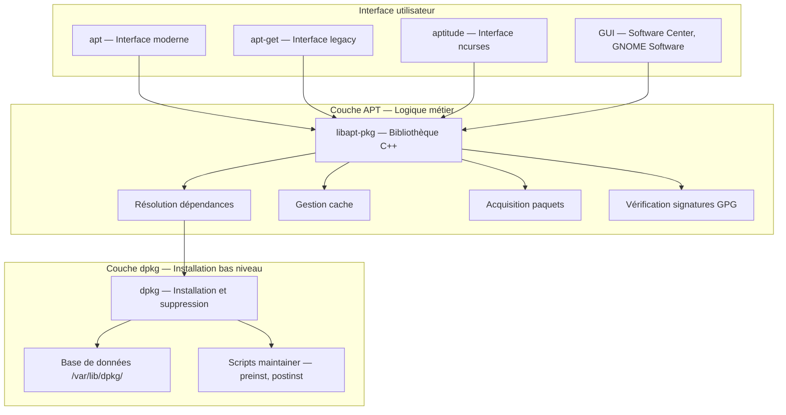
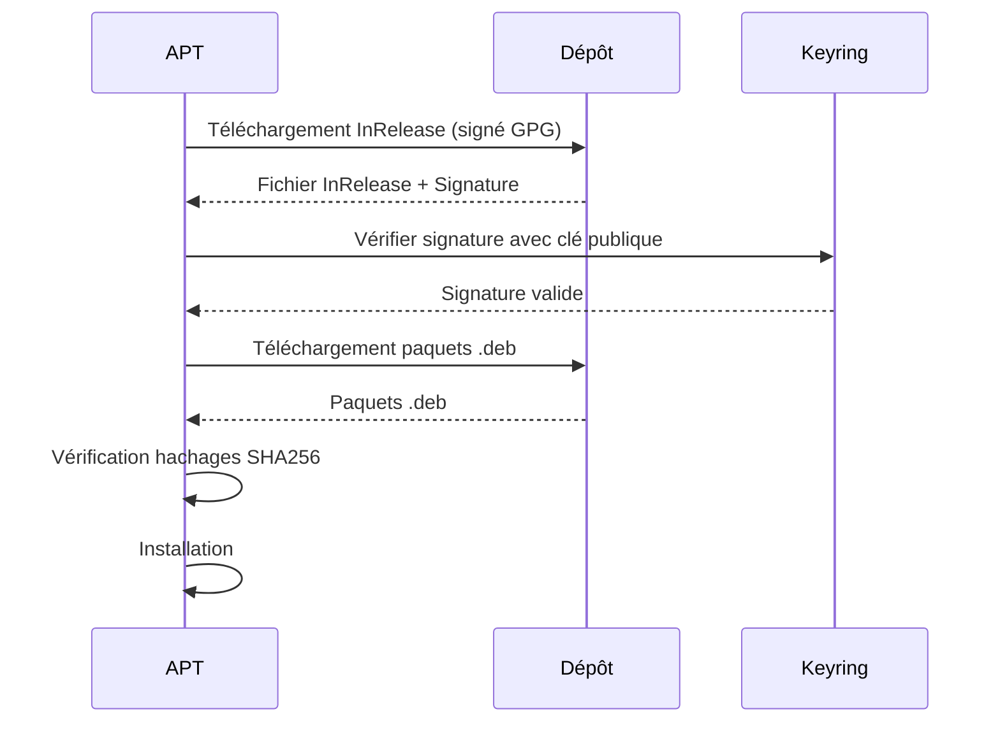

# APT — Advanced Package Tool

<div
  class="omny-meta"
  data-level="🟡 Intermédiaire & 🔴 Avancé"
  data-version="1.2"
  data-time="45-50 minutes">
</div>

!!! quote "Analogie"
    _Une bibliothèque universitaire géante avec un catalogue informatisé sophistiqué. Lorsque vous demandez un livre, le système vérifie automatiquement toutes ses dépendances — bibliographies requises, prérequis — résout les conflits potentiels avec vos emprunts existants, télécharge tout le nécessaire et organise le tout dans votre bibliothèque personnelle. APT fonctionne exactement ainsi : un système de gestion de paquets intelligent qui automatise entièrement l'installation, la mise à jour et la suppression de logiciels en gérant toutes les dépendances complexes._

**APT (Advanced Package Tool)** est le gestionnaire de paquets de référence des distributions **Debian**, **Ubuntu** et leurs dérivées (Linux Mint, Pop!\_OS, Kali Linux, etc.). Créé en 1998, APT a révolutionné la gestion de logiciels Linux en introduisant la **résolution automatique des dépendances**, transformant l'installation de logiciels d'une tâche technique complexe en une expérience fiable.

APT gère aujourd'hui plus de **60 000 paquets** dans les dépôts Debian, couvrant pratiquement tous les besoins logiciels. Sa fiabilité éprouvée et sa documentation exhaustive en font le choix privilégié pour les serveurs de production, les infrastructures critiques et les distributions grand public.

Contrairement à Windows où les exécutables se téléchargent depuis des sites variés, Linux centralise tous les logiciels dans des **dépôts sécurisés** accessibles via APT. Cette approche garantit la sécurité, la cohérence et la simplicité de gestion.

!!! info "Pourquoi c'est important"
    APT permet la gestion centralisée de milliers de paquets, garantit la stabilité du système par la résolution rigoureuse des dépendances, automatise les mises à jour de sécurité critiques et assure la reproductibilité des installations sur de multiples machines. Maîtriser APT est indispensable pour l'administration système professionnelle.

!!! tip "APT vs apt-get — Quelle différence"
    `apt` est la commande moderne (depuis 2014) conçue pour l'utilisateur interactif avec une sortie colorée et lisible. `apt-get` est l'outil historique optimisé pour les scripts. Dans la majorité des cas, utiliser `apt` pour une meilleure expérience. Utiliser `apt-get` uniquement dans des scripts automatisés où la stabilité de l'interface est critique.

<br />

---

## Architecture APT

APT s'articule autour de plusieurs couches qui collaborent pour gérer le cycle de vie complet des paquets.

!!! note "L'image ci-dessous illustre les couches de l'architecture APT. Comprendre cette hiérarchie — et en particulier la séparation entre APT (logique de haut niveau) et dpkg (installation bas niveau) — explique pourquoi on n'utilise jamais dpkg directement sauf cas très spécifiques."


<p><em>APT est une surcouche intelligente au-dessus de dpkg. APT résout les dépendances, télécharge les paquets et vérifie les signatures GPG — puis délègue l'installation physique à dpkg. Cette séparation permet à dpkg de rester simple et fiable, tandis qu'APT gère toute la complexité de l'écosystème de dépôts.</em></p>


```mermaid
flowchart TB
    subgraph "Interface utilisateur"
        A1["apt — Interface moderne"]
        A2["apt-get — Interface legacy"]
        A3["aptitude — Interface ncurses"]
        A4["GUI — Software Center, GNOME Software"]
    end

    subgraph "Couche APT — Logique métier"
        B1["libapt-pkg — Bibliothèque C++"]
        B2["Résolution dépendances"]
        B3["Gestion cache"]
        B4["Acquisition paquets"]
        B5["Vérification signatures GPG"]
    end

    subgraph "Couche dpkg — Installation bas niveau"
        C1["dpkg — Installation et suppression"]
        C2["Base de données /var/lib/dpkg/"]
        C3["Scripts maintainer — preinst, postinst"]
    end

    A1 --> B1
    A2 --> B1
    A3 --> B1
    A4 --> B1

    B1 --> B2
    B1 --> B3
    B1 --> B4
    B1 --> B5

    B2 --> C1
    C1 --> C2
    C1 --> C3
```

### Hiérarchie des outils

| Outil | Niveau | Rôle | Utilisation |
|---|---|---|---|
| dpkg | Bas niveau | Installation et suppression locale de fichiers .deb | Rarement en direct |
| apt-get | Intermédiaire | Gestion dépôts et résolution dépendances | Scripts automatisés |
| apt | Haut niveau | Interface utilisateur moderne et concise | Usage quotidien |
| aptitude | Haut niveau | Interface ncurses avec résolveur avancé | Résolution de conflits complexes |

!!! warning "dpkg vs APT"
    dpkg installe uniquement le fichier `.deb` fourni sans gérer les dépendances — si une dépendance manque, l'installation échoue. APT résout automatiquement toutes les dépendances en téléchargeant les paquets nécessaires depuis les dépôts. Ne jamais utiliser dpkg directement sauf dans des cas très spécifiques.

### Composants du système de fichiers

```bash title="Bash — structure de configuration APT"
# /etc/apt/
# ├── sources.list              # Liste principale des dépôts
# ├── sources.list.d/           # Dépôts supplémentaires (un fichier par source)
# │   ├── docker.list
# │   ├── vscode.list
# │   └── kubernetes.list
# ├── apt.conf.d/               # Configuration fragmentée
# │   ├── 00-proxy              # Proxy
# │   └── 50-unattended-upgrades
# ├── preferences.d/            # Épinglage de versions (pinning)
# ├── trusted.gpg.d/            # Clés GPG des dépôts (format legacy)
# └── keyrings/                 # Clés GPG format moderne (recommandé)
```

```bash title="Bash — cache et base de données APT"
# /var/lib/apt/
# ├── lists/                    # Index téléchargés des dépôts
# └── extended_states           # États étendus (auto vs manuel)
#
# /var/cache/apt/
# ├── archives/                 # Paquets .deb téléchargés
# └── pkgcache.bin              # Cache binaire compilé
#
# /var/lib/dpkg/
# ├── status                    # État de tous les paquets installés
# ├── info/                     # Métadonnées des paquets
# │   ├── nginx.list            # Fichiers installés par le paquet
# │   ├── nginx.md5sums         # Sommes de contrôle
# │   └── nginx.postinst        # Scripts post-installation
# └── triggers/                 # Système de déclencheurs
```

<br />

---

## Gestion des dépôts

### Format sources.list et structure des branches

!!! note "L'image ci-dessous cartographie la structure des dépôts Debian et Ubuntu — branches, composants et leur niveau de stabilité. C'est le point de départ pour comprendre ce qu'on active, ce qu'on commente et les implications en termes de sécurité."


<p><em>Un dépôt APT est organisé en branches (stable, security, updates, backports) et en composants (main, contrib, non-free). La branche security est la seule à recevoir des correctifs en continu — ne jamais la commenter. Les backports permettent d'installer des versions récentes de certains logiciels sans passer à la version suivante de la distribution.</em></p>

```bash title="Bash — /etc/apt/sources.list Debian 12 (Bookworm)"
# Dépôt principal
deb http://deb.debian.org/debian bookworm main contrib non-free non-free-firmware

# Mises à jour de sécurité — critique, ne jamais commenter
deb http://security.debian.org/debian-security bookworm-security main contrib non-free non-free-firmware

# Mises à jour intermédiaires — recommandé
deb http://deb.debian.org/debian bookworm-updates main contrib non-free non-free-firmware

# Backports — optionnel, versions récentes de certains logiciels
# deb http://deb.debian.org/debian bookworm-backports main contrib non-free non-free-firmware
```

```bash title="Bash — /etc/apt/sources.list Ubuntu 24.04 (Noble)"
# Dépôts principaux
deb http://archive.ubuntu.com/ubuntu noble main restricted universe multiverse

# Mises à jour de sécurité
deb http://security.ubuntu.com/ubuntu noble-security main restricted universe multiverse

# Mises à jour recommandées
deb http://archive.ubuntu.com/ubuntu noble-updates main restricted universe multiverse

# Proposed — déconseillé en production
# deb http://archive.ubuntu.com/ubuntu noble-proposed main restricted universe multiverse
```

### Composants des dépôts

**Debian :**

| Composant | Contenu | Licence | Support sécurité |
|---|---|---|---|
| main | Logiciels libres conformes DFSG | Libre (GPL, BSD) | Complet et proactif |
| contrib | Logiciels libres dépendant de non-libre | Libre — dépendances propriétaires | Limité |
| non-free | Logiciels propriétaires | Propriétaire | Communautaire |
| non-free-firmware | Micrologiciels propriétaires (drivers) | Propriétaire | Nécessaire pour matériel moderne |

**Ubuntu :**

| Composant | Contenu | Support | Mises à jour sécurité |
|---|---|---|---|
| main | Logiciels libres officiels | Canonical — 5 ans LTS | Complètes |
| restricted | Drivers propriétaires courants | Canonical | Complètes |
| universe | Logiciels libres communautaires | Communauté | Partielles |
| multiverse | Logiciels propriétaires non supportés | Aucun | Aucune |

!!! danger "Sécurité des composants"
    `main` (Debian) et `main`/`restricted` (Ubuntu) sont les seuls composants recevant un support de sécurité complet et proactif. Les paquets dans `universe`, `multiverse`, `contrib` et `non-free` peuvent ne pas recevoir de correctifs de sécurité rapides. En production, se limiter autant que possible aux dépôts principaux.

### Types de lignes

```bash title="Bash — types de lignes dans sources.list"
# Paquets binaires compilés — nécessaire pour l'installation
deb http://deb.debian.org/debian bookworm main

# Code source — optionnel, utile pour le développement
deb-src http://deb.debian.org/debian bookworm main

# Restriction architecturale
deb [arch=amd64,i386] http://archive.ubuntu.com/ubuntu noble main

# Signature GPG spécifique — méthode moderne recommandée
deb [signed-by=/usr/share/keyrings/docker-archive-keyring.gpg] \
    https://download.docker.com/linux/ubuntu noble stable
```

### Ajout de dépôts tiers

```bash title="Bash — ajouter le dépôt Docker (méthode moderne recommandée)"
# 1. Installer les prérequis
apt install -y ca-certificates curl gnupg lsb-release

# 2. Ajouter la clé GPG officielle dans le répertoire dédié
mkdir -p /etc/apt/keyrings
curl -fsSL https://download.docker.com/linux/ubuntu/gpg | \
    gpg --dearmor -o /etc/apt/keyrings/docker.gpg

# 3. Créer le fichier de dépôt isolé dans sources.list.d/
echo \
  "deb [arch=$(dpkg --print-architecture) signed-by=/etc/apt/keyrings/docker.gpg] \
  https://download.docker.com/linux/ubuntu \
  $(lsb_release -cs) stable" | \
  tee /etc/apt/sources.list.d/docker.list > /dev/null

# 4. Mettre à jour l'index et installer
apt update
apt install docker-ce
```

!!! warning "Sécurité des dépôts tiers"
    L'ajout de dépôts tiers expose le système à des risques réels : un dépôt compromis peut distribuer des paquets malveillants, des paquets incompatibles peuvent casser les dépendances système, et un dépôt abandonné laisse des vulnérabilités non patchées. Ne faire confiance qu'aux sources officielles reconnues — Docker, Kubernetes, PostgreSQL, HashiCorp.

### PPA — Ubuntu uniquement

Les **PPA** sont des dépôts personnels hébergés sur Launchpad, maintenus par des individus.

```bash title="Bash — gérer les PPA Ubuntu"
# Ajouter un PPA
add-apt-repository ppa:git-core/ppa
apt update
apt install git

# Supprimer un PPA
add-apt-repository --remove ppa:git-core/ppa
apt update

# Lister les PPA actifs
ls /etc/apt/sources.list.d/
```

!!! danger "Risques des PPA"
    Les PPA sont maintenus par des individus, pas par Canonical. La qualité du packaging est variable, ils peuvent casser le système lors de mises à jour et être abandonnés sans avertissement. Utiliser les PPA uniquement lorsque absolument nécessaire, en privilégiant ceux maintenus par des équipes reconnues.

<br />

---

## Commandes fondamentales

### Mise à jour de l'index

```bash title="Bash — synchroniser l'index des paquets"
# Télécharger les métadonnées des paquets depuis tous les dépôts configurés
# Aucune installation — uniquement les listes de versions et dépendances
# A exécuter systématiquement avant toute installation ou mise à jour
apt update
```

### Recherche et information

```bash title="Bash — rechercher et inspecter des paquets"
# Rechercher par nom ou description
apt search nginx

# Recherche par nom uniquement
apt search --names-only nginx

# Afficher les détails complets d'un paquet
apt show nginx

# Lister les paquets installés
apt list --installed

# Lister les paquets avec mises à jour disponibles
apt list --upgradable

# Afficher les versions disponibles et la version candidate
apt policy nginx
```

### Installation

```bash title="Bash — installer des paquets"
# Installer un paquet
apt install nginx

# Installer plusieurs paquets
apt install nginx postgresql redis-server

# Confirmer automatiquement — pour scripts
apt install -y nginx

# Installer une version exacte
apt install nginx=1.24.0-1

# Installer depuis un dépôt spécifique (backports)
apt install -t bookworm-backports nginx

# Télécharger le fichier .deb sans l'installer
apt download nginx
```

```bash title="Bash — installer un fichier .deb local"
# Méthode moderne — résout les dépendances automatiquement
apt install ./paquet.deb

# Méthode legacy — ne résout pas les dépendances
dpkg -i paquet.deb
apt install -f  # Résoudre les dépendances manquantes après coup
```

### Suppression de paquets

!!! note "L'image ci-dessous montre exactement ce que chaque commande de suppression laisse ou efface sur le système de fichiers. La confusion entre remove, purge et autoremove est l'une des erreurs les plus fréquentes en administration Debian/Ubuntu."


<p><em>remove supprime les binaires et bibliothèques mais conserve la configuration dans /etc/ — utile si on prévoit de réinstaller en gardant ses paramètres. purge supprime également la configuration — repartir d'une installation propre. autoremove cible les dépendances orphelines installées automatiquement et dont plus aucun paquet ne dépend. Les données dans /var/ (bases de données, logs) ne sont jamais supprimées automatiquement.</em></p>

```bash title="Bash — supprimer des paquets"
# Supprimer un paquet — conserve les fichiers de configuration dans /etc/
apt remove nginx

# Supprimer avec purge complète — configuration incluse
apt purge nginx

# Supprimer les dépendances devenues inutiles
apt autoremove

# Purge et nettoyage des dépendances orphelines en une passe
apt purge nginx && apt autoremove
```

| Commande | Binaires | Bibliothèques | Configuration /etc | Données /var |
|---|---|---|---|---|
| remove | Supprimés | Supprimées | Conservée | Conservées |
| purge | Supprimés | Supprimées | Supprimée | Conservées |
| autoremove | Supprimés (orphelins) | Supprimées (orphelines) | Conservée | Conservées |

!!! tip "remove vs purge — règle de décision"
    Utiliser `purge` pour réinstaller proprement un paquet avec sa configuration par défaut, ou lorsque le logiciel ne sera jamais réutilisé. Utiliser `remove` si une réinstallation future est envisagée et que la configuration personnalisée doit être conservée.

### Mise à jour du système

```bash title="Bash — mettre à jour les paquets installés"
# Mise à jour sûre — ne supprime aucun paquet existant
apt upgrade

# Mise à jour agressive — peut supprimer des paquets pour résoudre les conflits
apt full-upgrade
```

| Commande | Comportement | Risque | Usage |
|---|---|---|---|
| upgrade | Met à jour uniquement sans supprimer de paquets | Faible | Usage quotidien |
| full-upgrade | Met à jour même si des suppressions sont nécessaires | Moyen | Mises à jour majeures |

```bash title="Bash — workflow de mise à jour sécurisé"
# 1. Sauvegarder la liste des paquets installés
dpkg --get-selections > /backup/packages-$(date +%Y%m%d).txt

# 2. Mettre à jour l'index
apt update

# 3. Vérifier les paquets qui seront mis à jour
apt list --upgradable

# 4. Simuler la mise à jour sans l'appliquer
apt upgrade --simulate

# 5. Appliquer la mise à jour
apt upgrade

# 6. Vérifier si un redémarrage est nécessaire
if [ -f /var/run/reboot-required ]; then
    echo "Redemarrage requis pour :"
    cat /var/run/reboot-required.pkgs
fi
```

### Gestion du cache

```bash title="Bash — gérer le cache APT"
# Supprimer tous les paquets téléchargés du cache
apt clean

# Supprimer uniquement les anciennes versions
apt autoclean

# Afficher la taille du cache
du -sh /var/cache/apt/archives/

# Statistiques globales
apt-cache stats
```

<br />

---

## Gestion avancée des dépendances

### Résolution de conflits

```bash title="Bash — diagnostiquer et résoudre les conflits de dépendances"
# Afficher l'état détaillé des dépendances d'un paquet
apt-cache policy paquet

# Afficher les paquets qui dépendent d'un paquet donné
apt-cache rdepends paquet

# Réparer les dépendances cassées
apt install -f

# Forcer la reconfiguration d'un paquet
dpkg-reconfigure paquet

# Simuler l'installation pour identifier les conflits avant d'agir
apt install --simulate paquet
```

```bash title="Bash — résoudre un conflit de version de dépendance"
# Identifier les paquets bloqués (hold)
apt-mark showhold

# Débloquer si nécessaire
apt-mark unhold libssl3

# Installer manuellement la version requise
apt install libssl3

# Réessayer l'installation initiale
apt install nginx
```

### Épinglage de versions (Pinning)

!!! note "L'image ci-dessous représente l'échelle de priorités APT. Le pinning est l'un des concepts les plus mal compris d'APT — visualiser l'échelle numérique avec ses seuils de comportement rend la logique immédiatement lisible."


<p><em>APT attribue une priorité numérique à chaque source de paquet. En dessous de 100, le paquet est ignoré. Entre 100 et 499, il n'est installé que si demandé explicitement. Entre 500 et 989, c'est la priorité normale des dépôts stables. Au-dessus de 990, le paquet est préféré même si une version plus récente existe ailleurs. À 1000 ou plus, APT installe même si cela implique un downgrade.</em></p>

L'épinglage contrôle la priorité d'un paquet ou d'un dépôt — utile pour mélanger stable et backports ou bloquer une version spécifique.

```bash title="Bash — /etc/apt/preferences.d/custom-pinning"
# Priorités APT :
# >= 1000 : installation même si downgrade nécessaire
# 990-999 : préféré à toute autre version
# 500-989 : installé si pas de version supérieure disponible
# 100-499 : installé uniquement si explicitement demandé
# < 0     : paquet bloqué

# Préférer stable pour tout, sauf nginx depuis backports
Package: *
Pin: release a=stable
Pin-Priority: 700

Package: nginx
Pin: release a=stable-backports
Pin-Priority: 900

# Bloquer une version spécifique
Package: apache2
Pin: version 2.4.50-1
Pin-Priority: -1

# Priorité maximale pour un dépôt tiers spécifique
Package: docker-ce
Pin: origin download.docker.com
Pin-Priority: 1000
```

```bash title="Bash — vérifier l'effet du pinning"
apt-cache policy nginx

# Sortie exemple :
# nginx:
#   Installed: 1.24.0-1
#   Candidate: 1.25.0-1~bpo12+1
#   Version table:
#      1.25.0-1~bpo12+1 900    <- backports, priorité 900
#         100 http://deb.debian.org/debian bookworm-backports/main
#  *** 1.24.0-1 700            <- stable, priorité 700 (actuellement installé)
#         500 http://deb.debian.org/debian bookworm/main
```

### Paquets automatiques vs manuels

APT distingue les paquets installés explicitement par l'utilisateur de ceux installés automatiquement comme dépendances.

```bash title="Bash — gérer les marques auto/manuel"
# Marquer un paquet comme installé manuellement
apt-mark manual nginx

# Marquer un paquet comme installé automatiquement
apt-mark auto libssl3

# Lister les paquets installés manuellement
apt-mark showmanual

# Lister les paquets auto-installés devenus inutiles
apt autoremove --simulate
```

Les paquets marqués `auto` sont candidats à la suppression par `apt autoremove` dès qu'aucun autre paquet ne dépend d'eux.

### Blocage de mises à jour

```bash title="Bash — bloquer un paquet à sa version actuelle"
# Bloquer
apt-mark hold nginx

# Vérifier les paquets bloqués
apt-mark showhold

# Débloquer
apt-mark unhold nginx
```

Le blocage est utile pour une version validée en production, une application incompatible avec une nouvelle version ou un environnement de développement nécessitant une version fixe.

<br />

---

## Sécurité et signatures GPG

!!! note "L'image ci-dessous représente le flux de vérification GPG qu'APT applique systématiquement. Ce mécanisme est la garantie fondamentale que les paquets installés sont authentiques et n'ont pas été altérés en transit."


<p><em>APT vérifie l'authenticité en deux temps : d'abord la signature GPG du fichier InRelease du dépôt (qui garantit l'identité de la source), puis les hachages SHA256 de chaque paquet téléchargé (qui garantissent l'intégrité du fichier). Un paquet dont la signature ou le hachage ne correspond pas est rejeté avant toute installation.</em></p>


```mermaid
sequenceDiagram
    participant APT
    participant Dépôt
    participant Keyring

    APT->>Dépôt: Téléchargement InRelease (signé GPG)
    Dépôt-->>APT: Fichier InRelease + Signature
    APT->>Keyring: Vérifier signature avec clé publique
    Keyring-->>APT: Signature valide
    APT->>Dépôt: Téléchargement paquets .deb
    Dépôt-->>APT: Paquets .deb
    APT->>APT: Vérification hachages SHA256
    APT->>APT: Installation
```

### Gestion des clés GPG

```bash title="Bash — gérer les clés GPG des dépôts"
# Lister les clés installées (nouveau format)
ls /etc/apt/keyrings/
gpg --list-keys --keyring /etc/apt/keyrings/debian-archive-keyring.gpg

# Ajouter une clé manuellement
curl -fsSL https://example.com/key.gpg | gpg --dearmor -o /etc/apt/keyrings/example.gpg

# Supprimer une clé
rm /etc/apt/keyrings/example.gpg
```

```bash title="Bash — résoudre une erreur de clé GPG manquante"
# Erreur typique :
# W: GPG error: https://download.docker.com/linux/ubuntu noble InRelease:
#    The following signatures couldn't be verified because the public key is not available:
#    NO_PUBKEY 7EA0A9C3F273FCD8

# Récupérer la clé manquante depuis un serveur de clés
gpg --keyserver keyserver.ubuntu.com --recv-keys 7EA0A9C3F273FCD8
gpg --export 7EA0A9C3F273FCD8 | tee /etc/apt/keyrings/docker.gpg > /dev/null
apt update
```

### Mises à jour de sécurité automatiques

```bash title="Bash — configurer unattended-upgrades"
# Installer le paquet
apt install unattended-upgrades

# Configurer interactivement
dpkg-reconfigure -plow unattended-upgrades
```

```bash title="Bash — /etc/apt/apt.conf.d/50unattended-upgrades"
Unattended-Upgrade::Allowed-Origins {
    "${distro_id}:${distro_codename}-security";
    // "${distro_id}:${distro_codename}-updates";  // Décommenter pour mises à jour normales
};

// Paquets à exclure des mises à jour automatiques
Unattended-Upgrade::Package-Blacklist {
    // "nginx";
    // "postgresql-15";
};

// Supprimer les dépendances devenues inutiles
Unattended-Upgrade::Remove-Unused-Dependencies "true";

// Redémarrage automatique si nécessaire (à activer avec prudence)
Unattended-Upgrade::Automatic-Reboot "false";
Unattended-Upgrade::Automatic-Reboot-Time "03:00";

// Notifications par email
Unattended-Upgrade::Mail "admin@example.com";
Unattended-Upgrade::MailReport "only-on-error";
```

```bash title="Bash — tester et surveiller unattended-upgrades"
# Simulation sans application réelle
unattended-upgrade --dry-run --debug

# Surveiller les logs
tail -f /var/log/unattended-upgrades/unattended-upgrades.log
```

<br />

---

## Optimisation et performance

### apt-fast — téléchargements parallèles

apt-fast parallélise les téléchargements pour accélérer les opérations sur connexion lente.

```bash title="Bash — installer et utiliser apt-fast"
add-apt-repository ppa:apt-fast/stable
apt update
apt install apt-fast

# Utilisation identique à apt
apt-fast install nginx
apt-fast upgrade
```

Gains typiques : 2 à 3 fois plus rapide sur connexion lente, 1,5 à 2 fois sur connexion rapide, 3 à 5 fois lors de mises à jour massives.

### Cache partagé avec Apt-Cacher-NG

Utile dans un environnement avec plusieurs machines qui téléchargent les mêmes paquets.

```bash title="Bash — configurer Apt-Cacher-NG"
# Sur le serveur cache
apt install apt-cacher-ng

# Sur chaque machine cliente
echo 'Acquire::http::Proxy "http://serveur-cache:3142";' > /etc/apt/apt.conf.d/02proxy

# Statistiques disponibles via navigateur
# http://serveur-cache:3142/acng-report.html
```

Sur 10 serveurs, Apt-Cacher-NG économise environ 90 % de la bande passante consommée par les mises à jour.

<br />

---

## Comparaison apt vs apt-get vs aptitude

!!! note "L'image ci-dessous synthétise les cas d'usage des trois outils. Le choix entre eux n'est pas une question de préférence — c'est une question de contexte : interactif, script ou résolution de conflits."


<p><em>apt offre une expérience interactive améliorée (barre de progression, couleurs, commandes groupées) mais son interface peut changer entre versions. apt-get garantit une interface stable pour les scripts. aptitude embarque un résolveur de dépendances plus avancé capable de proposer plusieurs solutions alternatives lors d'un conflit que apt ne sait pas résoudre.</em></p>

| Fonctionnalité | apt | apt-get | aptitude |
|---|---|---|---|
| Interface | Moderne, colorée | Scriptable, stable | Ncurses et CLI |
| Barre de progression | Oui | Non | Oui |
| Résolution de conflits | Basique | Basique | Avancée — propose des alternatives |
| Stabilité d'interface | Non garantie entre versions | Garantie | Garantie |
| Usage recommandé | Interactif | Scripts automatisés | Résolution de problèmes |

**Équivalences de commandes :**

| Opération | apt | apt-get | aptitude |
|---|---|---|---|
| Installer | `apt install pkg` | `apt-get install pkg` | `aptitude install pkg` |
| Supprimer | `apt remove pkg` | `apt-get remove pkg` | `aptitude remove pkg` |
| Mettre à jour l'index | `apt update` | `apt-get update` | `aptitude update` |
| Mettre à jour le système | `apt upgrade` | `apt-get upgrade` | `aptitude safe-upgrade` |
| Rechercher | `apt search term` | `apt-cache search term` | `aptitude search term` |
| Information | `apt show pkg` | `apt-cache show pkg` | `aptitude show pkg` |

<br />

---

## Bonnes pratiques

### Serveurs de production

```bash title="Bash — stratégie de mise à jour sécurisée en production"
# 1. Sauvegarder la configuration système
tar -czf /backup/etc-$(date +%Y%m%d).tar.gz /etc/

# 2. Sauvegarder la liste des paquets installés
dpkg --get-selections > /backup/packages-$(date +%Y%m%d).txt

# 3. Mettre à jour en conservant la configuration existante
apt update
apt upgrade -o Dpkg::Options::="--force-confold"

# 4. Activer les mises à jour de sécurité automatiques
echo 'APT::Periodic::Update-Package-Lists "1";' > /etc/apt/apt.conf.d/20auto-upgrades
echo 'APT::Periodic::Unattended-Upgrade "1";' >> /etc/apt/apt.conf.d/20auto-upgrades
```

```bash title="Bash — needrestart — redémarrage intelligent des services"
# Détecte les services nécessitant un redémarrage après mise à jour
# des bibliothèques — sans redémarrer la machine entière
apt install needrestart
```

### Images Docker

```dockerfile title="Dockerfile — optimisation APT pour images Ubuntu"
FROM ubuntu:24.04

# Combiner update + install + clean dans une seule couche RUN
# --no-install-recommends réduit la taille de 30 à 50 %
RUN apt update && \
    apt install -y --no-install-recommends \
        nginx \
        ca-certificates \
    && \
    apt clean && \
    rm -rf /var/lib/apt/lists/*
```

```dockerfile title="Dockerfile — multi-stage avec APT"
# Stage build — outils de compilation
FROM ubuntu:24.04 AS builder
RUN apt update && apt install -y build-essential
COPY src/ /src/
RUN make -C /src

# Stage runtime — uniquement les dépendances d'exécution
FROM ubuntu:24.04
RUN apt update && \
    apt install -y --no-install-recommends libssl3 && \
    rm -rf /var/lib/apt/lists/*
COPY --from=builder /src/binary /usr/local/bin/
```

### Audit de sécurité

```bash title="Bash — auditer les dépôts et les vulnérabilités"
# Lister tous les dépôts actifs
grep -r "^deb " /etc/apt/sources.list /etc/apt/sources.list.d/

# Vérifier les clés GPG installées
ls /etc/apt/keyrings/

# Supprimer un dépôt suspect
rm /etc/apt/sources.list.d/depot-suspect.list
rm /etc/apt/keyrings/depot-suspect.gpg
apt update

# Scanner les vulnérabilités connues
apt install debsecan
debsecan
debsecan | grep "remotely exploitable"
```

<br />

---

## Dépannage

### Base de données corrompue ou verrou bloqué

```bash title="Bash — réparer le système APT"
# Supprimer les verrous laissés par une opération interrompue
rm /var/lib/apt/lists/lock
rm /var/cache/apt/archives/lock
rm /var/lib/dpkg/lock*

# Reconfigurer les paquets en état inconsistant
dpkg --configure -a

# Résoudre les dépendances cassées
apt install -f

# Vérifier l'intégrité du système APT
apt check

# Mettre à jour l'index
apt update
```

### Paquet semi-installé

```bash title="Bash — résoudre un paquet en état inconsistant"
# Identifier les paquets en état inconsistant
dpkg --audit

# Forcer la suppression d'un paquet bloqué
dpkg --remove --force-remove-reinstreq paquet

# Nettoyer
apt install -f
```

### Erreurs courantes

```bash title="Bash — résoudre les erreurs APT les plus fréquentes"
# Erreur : "Could not get lock /var/lib/dpkg/lock"
# Cause : une autre instance APT est en cours ou s'est interrompue
ps aux | grep apt                  # Vérifier si un processus est en cours
kill -9 <PID>                      # Tuer si bloqué
rm /var/lib/apt/lists/lock         # Supprimer le verrou
rm /var/lib/dpkg/lock*
dpkg --configure -a

# Erreur : "The following packages have been kept back"
# Cause : apt upgrade refuse d'installer de nouvelles dépendances
apt full-upgrade                   # Autoriser les installations supplémentaires

# Erreur : "Unable to fetch some archives"
# Cause : dépôt inaccessible ou miroir défaillant
sed -i 's|deb.debian.org|ftp.fr.debian.org|g' /etc/apt/sources.list
apt clean
apt update
```

### Logs et diagnostic

```bash title="Bash — consulter les logs APT et dpkg"
# Historique des opérations APT
cat /var/log/apt/history.log

# Sortie complète des commandes
cat /var/log/apt/term.log

# Opérations bas niveau dpkg
cat /var/log/dpkg.log

# Dernières installations
grep " install " /var/log/dpkg.log | tail -20

# Dernières mises à jour
grep " upgrade " /var/log/dpkg.log | tail -20

# Mode debug pour diagnostiquer un problème de dépendances
apt -o Debug::pkgProblemResolver=yes install paquet
```

<br />

---

## Conclusion

!!! quote "Ce qu'il faut retenir"
    La gestion des paquets via apt debian est la porte d'entrée de toute administration système Linux. Comprendre ses mécanismes de résolution de dépendances et de dépôts garantit la stabilité et la sécurité de vos serveurs en production.

!!! quote "Conclusion"
    _APT représente plus de 25 ans d'évolution dans la gestion de paquets Linux. Ce qui commençait comme un outil pour automatiser l'installation de logiciels est devenu un écosystème complet gérant des dizaines de milliers de paquets avec une fiabilité éprouvée sur des millions de systèmes critiques. La force d'APT réside dans sa maturité — chaque comportement a été pensé, testé et raffiné au fil des années. La résolution de dépendances garantit la cohérence du système. Les mécanismes de signature GPG assurent la sécurité de la chaîne d'approvisionnement. Le système de dépôts multiples permet la flexibilité sans compromettre la stabilité. Debian et Ubuntu dominent les serveurs web, les clouds publics et constituent la base de distributions spécialisées comme Kali Linux. Maîtriser APT, c'est comprendre la fondation sur laquelle repose une part substantielle de l'infrastructure numérique mondiale. APT n'est pas le plus rapide — APK est plus léger — ni le plus moderne — dnf offre plus de fonctionnalités — mais il est le plus fiable et le plus documenté. En administration système professionnelle, cette fiabilité éprouvée est non négociable._

<br />