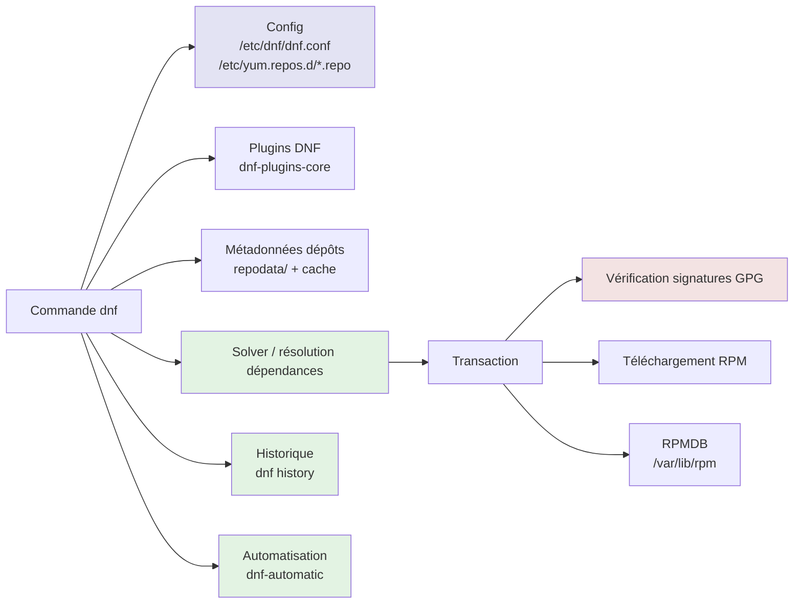
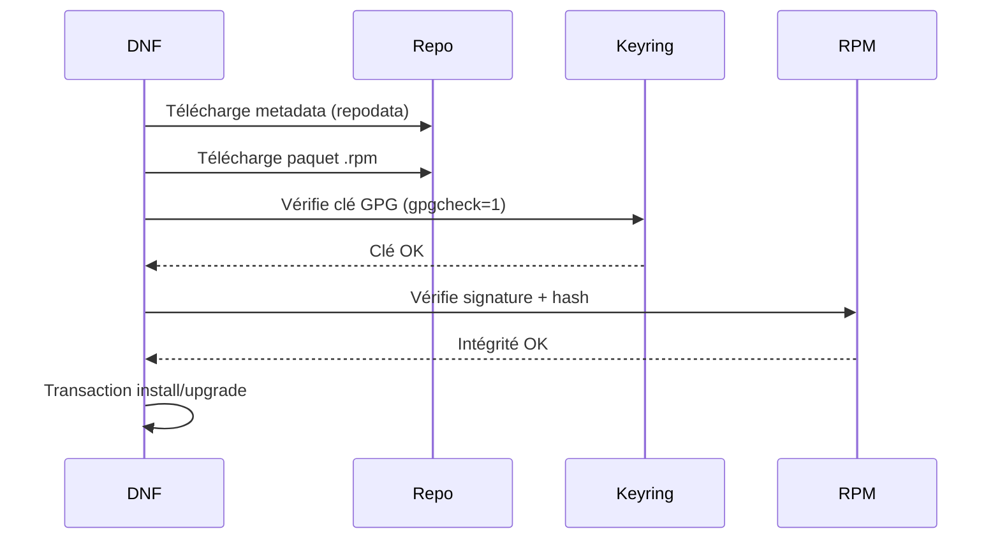

# DNF — Dandified Yum


<div
  class="omny-meta"
  data-level="🟡 Intermédiaire / 🔴 Avancé"
  data-version="1.0"
  data-time="40-55 minutes">
</div>

## Introduction au Gestionnaire pour Redhat (DNF RHEL)

!!! quote "Analogie pédagogique"
    *Imaginez une **chaîne d’approvisionnement d’entreprise**. Les paquets **RPM** sont les produits finis, les dépôts sont les **fournisseurs**, et DNF est le **responsable qualité + logistique** : il sélectionne la bonne version, vérifie l’authenticité (signature), calcule les composants nécessaires (dépendances), puis exécute une **transaction** propre et traçable. DNF ne “bidouille” pas : il orchestre.*

> **DNF (Dandified Yum)** est le gestionnaire de paquets moderne des distributions **RPM**. Sur **RHEL 8/9**, c’est l’outil de référence, et la commande `yum` existe principalement pour compatibilité : sur **RHEL 9**, `yum` est un alias de `dnf`. ([docs.redhat.com][1])
> DNF conserve une compatibilité CLI “raisonnable” avec YUM, mais apporte une architecture plus moderne (plugins, API plus stricte, meilleure gestion des métadonnées). ([dnf.readthedocs.io][2])

!!! info "Pourquoi c'est important ?"
    DNF est au cœur de l’administration “enterprise” sur RHEL-like. Maîtriser DNF, ce n’est pas seulement “installer des paquets” : c’est savoir gouverner les dépôts, maîtriser les versions, gérer l’historique de transactions, comprendre la modularité (AppStream), et dépanner proprement quand les dépendances partent en vrille.

---

## Pour repartir des bases (vrais débutants)

Si vous débutez sur Linux, DNF n’est pas forcément le meilleur point d’entrée. Ici, on suppose que vous comprenez : paquet, dépôt, signatures, dépendances, et impact d’une mise à jour sur un service en production.

DNF s’adresse à des systèmes où la stabilité et la traçabilité priment. Le modèle mental est :

> “je change le système via des transactions contrôlées”.

---

## Philosophie côté RHEL/Fedora : stabilité, backports, gouvernance

Sur RHEL-like, une version “ancienne” n’est pas forcément “non sécurisée”. Les distributions backportent des correctifs de sécurité sur des branches stables. C’est pour ça que vous verrez des versions qui semblent dater, mais qui sont patchées.

DNF est conçu pour jouer proprement dans ce modèle : dépôts officiels, priorités, modularité, historique.

---

## Architecture de DNF



### Répertoires clés

**Configuration :**

```
/etc/dnf/dnf.conf
/etc/yum.repos.d/*.repo
```

**Cache et métadonnées :**

```
/var/cache/dnf/
```

**Base RPM :**

```
/var/lib/rpm/
```

**Clés GPG :**

* dépend des distributions, souvent importées via `rpm --import` ou déclarées via `gpgkey=` dans les `.repo`.

---

## Commandes fondamentales

### Index, mise à jour, upgrade

```bash
# Rafraîchir les métadonnées
dnf makecache

# Voir ce qui est upgradable
dnf check-update

# Mettre à jour (équivalent "upgrade" dans l’usage courant)
dnf upgrade

# Mise à jour d’un paquet spécifique
dnf upgrade openssl
```

En contexte pro, la routine saine ressemble à ça : `check-update`, simulation, puis `upgrade` planifié.

### Installation, suppression, nettoyage

```bash
# Installer
dnf install nginx

# Installer plusieurs paquets
dnf install nginx curl ca-certificates

# Supprimer
dnf remove nginx

# Nettoyer les dépendances devenues inutiles
dnf autoremove
```

### Recherche et inspection

```bash
# Recherche par nom/description
dnf search nginx

# Infos détaillées
dnf info nginx

# Lister fichiers installés par un paquet
dnf repoquery -l nginx

# Trouver "qui fournit" un fichier/commande
dnf provides /usr/sbin/nginx
dnf provides "*/nginx"

# Voir toutes les versions disponibles
dnf list nginx --showduplicates
```

`repoquery` est une arme d’admin : vous inspectez sans installer, vous comprenez avant d’agir.

---

## Gestion des dépôts

### Format `.repo`

```ini
# /etc/yum.repos.d/epel.repo
[epel]
name=EPEL - $basearch
baseurl=https://download.fedoraproject.org/pub/epel/9/Everything/$basearch/
enabled=1
gpgcheck=1
gpgkey=https://dl.fedoraproject.org/pub/epel/RPM-GPG-KEY-EPEL-9
```

### Lister et diagnostiquer

```bash
# Liste dépôts actifs
dnf repolist

# Tous les dépôts (actifs/inactifs)
dnf repolist --all

# Détails d’un dépôt
dnf repoinfo epel

# Mode verbeux utile en diagnostic
dnf -v repolist
```

### Gestion avancée via plugins

Souvent, vous utiliserez `dnf-plugins-core` (selon distro).

```bash
# Installer les plugins utiles
dnf install dnf-plugins-core

# Activer/désactiver un dépôt (si config-manager présent)
dnf config-manager --set-enabled epel
dnf config-manager --set-disabled epel
```

---

## Modularity / AppStream (le point qui piège tout le monde)

La modularité introduit les notions de **module**, **stream** (version), et parfois **profile**. Elle sert à proposer plusieurs versions d’un même composant applicatif sur une même base OS.

Sur RHEL 9, Red Hat documente explicitement la gestion des versions AppStream et l’usage des modules. ([docs.redhat.com][3])

### Commandes de base “modules”

```bash
# Lister les modules disponibles
dnf module list

# Voir le détail d’un module
dnf module info nodejs

# Activer un stream (ex : nodejs:18)
dnf module enable nodejs:18

# Installer un module (peut installer un profil)
dnf module install nodejs:18

# Désactiver un module (ne supprime pas ce qui est déjà installé)
dnf module disable nodejs
```

Point d’attention : désactiver rend les streams inactifs, mais ne retire pas le contenu installé. ([docs.redhat.com][3])
C’est volontaire : en production, on évite les effets de bord destructifs.

---

## Historique et rollback

DNF trace les transactions (install, remove, upgrade…). Sur RHEL 9, Red Hat décrit clairement `dnf history undo` et `dnf history rollback`. ([docs.redhat.com][4])

```bash
# Voir l’historique
dnf history

# Détails d’une transaction
dnf history info 42

# Annuler UNE transaction précise
dnf history undo 42

# Revenir à l’état antérieur en annulant toutes les transactions après un point
dnf history rollback 40
```

À savoir : rollback/undo ne sont pas magiques si les dépôts ont changé, si des versions ne sont plus disponibles, ou si vous avez des modules/streams impliqués. La vraie robustesse vient d’une gouvernance des dépôts (miroirs internes, versions maîtrisées).

---

## Sécurité : chaîne de confiance et signatures



Bon principe : si la signature pose problème, vous corrigez la gestion de clés et la source, vous ne coupez pas `gpgcheck`.

---

## Performance, hygiène, automatisation

### Nettoyage cache (utile en incident)

```bash
# Nettoyer métadonnées et cache
dnf clean all

# Reconstruire ensuite
dnf makecache
```

### Automatiser les mises à jour de sécurité

DNF s’intègre bien avec l’automatisation (systemd timers, dnf-automatic). Vous pouvez faire du “security-only” selon les politiques de votre org.

Exemple d’approche (conceptuelle, à adapter à votre distro) :

* activer un job planifié,
* appliquer seulement les updates sécurité,
* notifier,
* ne pas redémarrer automatiquement en prod sans gouvernance.

---

## Dépannage et résolution de problèmes

### 1) Conflits / dépendances impossibles

```bash
# Simulation : comprendre avant d’exécuter
dnf upgrade --assumeno

# Voir les versions candidates
dnf list <paquet> --showduplicates

# Inspecter qui dépend de quoi
dnf repoquery --whatrequires <paquet>
```

Quand ça coince, 80% du temps c’est :

* un dépôt tiers qui injecte des versions inattendues,
* un module/stream qui verrouille une version,
* des exclusions/holds,
* une incohérence de cache.

### 2) Problème de “modules” incompris

Si vous voyez des comportements “bizarres”, vérifiez d’abord :

```bash
dnf module list
dnf module info <module>
```

La modularité est souvent la cause racine de “le paquet existe mais ne s’installe pas”.

### 3) RPMDB / verrous / interruption

```bash
# Vérifier l’intégrité (peut être long)
rpm -Va

# Rebuild RPMDB (cas avancé, à faire prudemment)
rpm --rebuilddb
```

---

## Comparaison : DNF vs YUM (dans la vraie vie)

Sur RHEL 9, `yum` est un alias de `dnf` pour compatibilité : la bonne pratique est de travailler mentalement en “DNF”, et d’accepter que beaucoup de runbooks écriront encore `yum`. ([docs.redhat.com][1])
DNF se décrit lui-même comme le successeur majeur de YUM, avec compatibilité CLI approximative et un modèle plugin/API plus strict. ([dnf.readthedocs.io][2])

---

## Note importante : DNF5 côté Fedora

Fedora a planifié le passage au gestionnaire **DNF5** comme défaut (remplacement de DNF/YUM/dnf-automatic par la nouvelle pile libdnf5). ([fedoraproject.org][5])
Pour votre documentation, ça implique un encart “attention” : selon la version Fedora, la commande, les options et certains comportements peuvent évoluer. Sur RHEL-like, vous restez sur DNF “classique” (dnf4/libdnf) beaucoup plus longtemps.

---

## Le mot de la fin

!!! quote
    DNF, c’est le point de bascule entre “installer des trucs” et “administrer un parc”. Vous gagnez une vraie capacité d’exploitation quand vous maîtrisez : la gouvernance des dépôts, l’historique de transactions, la modularité, et le diagnostic propre. Et surtout, vous arrêtez de résoudre les problèmes “au hasard” : vous les résolvez par inspection, preuve, et action minimale.


[^1]: Lien officiel : [Managing software with the DNF tool](https://docs.redhat.com/en/documentation/red_hat_enterprise_linux/9/html-single/managing_software_with_the_dnf_tool/index?utm_source=chatgpt.com)
[^2]: Lien officiel : [DNF Command Reference - Read the Docs](https://dnf.readthedocs.io/en/latest/command_ref.html?utm_source=chatgpt.com)
[^3]: Lien officiel : [Chapter 11. Managing versions of application stream content](https://docs.redhat.com/en/documentation/red_hat_enterprise_linux/9/html/managing_software_with_the_dnf_tool/assembly_managing-versions-of-application-stream-content_managing-software-with-the-dnf-tool?utm_source=chatgpt.com)
[^4]: Lien officiel : [Chapter 9. Handling package management history](https://docs.redhat.com/fr/documentation/red_hat_enterprise_linux/9/html/managing_software_with_the_dnf_tool/assembly_handling-package-management-history_managing-software-with-the-dnf-tool?utm_source=chatgpt.com)
[^5]: Lien officiel : [Changes/SwitchToDnf5 - Fedora Project Wiki](https://fedoraproject.org/wiki/Changes/SwitchToDnf5?utm_source=chatgpt.com)
