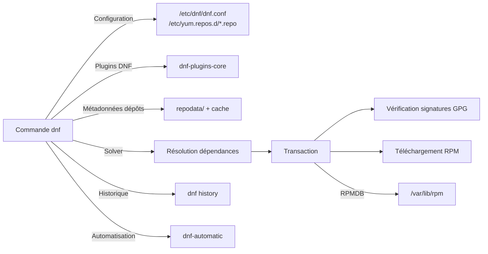
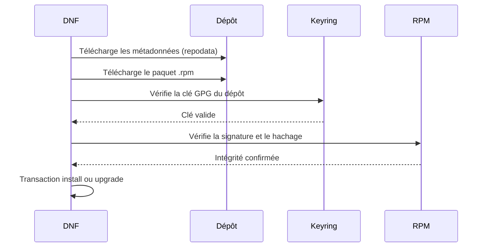

# DNF — Dandified Yum

<div
  class="omny-meta"
  data-level="🟡 Intermédiaire & 🔴 Avancé"
  data-version="1.0"
  data-time="40-55 minutes">
</div>

!!! quote "Analogie"
    _Une chaîne d'approvisionnement d'entreprise. Les paquets RPM sont les produits finis, les dépôts sont les fournisseurs, et DNF est le responsable qualité et logistique : il sélectionne la bonne version, vérifie l'authenticité par signature, calcule les composants nécessaires (dépendances) et exécute une transaction propre et traçable. DNF n'improvise pas — il orchestre._

**DNF (Dandified Yum)** est le gestionnaire de paquets moderne des distributions **RPM**. Sur **RHEL 8 et 9**, c'est l'outil de référence — la commande `yum` existe principalement pour compatibilité et est un alias de `dnf` sur RHEL 9. DNF conserve une compatibilité CLI avec YUM tout en apportant une architecture plus moderne : plugins, API plus stricte et meilleure gestion des métadonnées.

DNF s'adresse à des systèmes où la stabilité et la traçabilité priment. Le modèle mental est simple : on change le système via des **transactions contrôlées**. Ce document suppose une compréhension préalable des concepts fondamentaux — paquet, dépôt, signatures, dépendances et impact d'une mise à jour sur un service en production.

!!! info "Pourquoi c'est important"
    Maîtriser DNF ne se résume pas à installer des paquets. C'est savoir gouverner les dépôts, contrôler les versions, gérer l'historique de transactions, comprendre la modularité AppStream et diagnostiquer proprement quand les dépendances partent en vrille en production.

<br />

---

## Philosophie RHEL — stabilité, backports et gouvernance

Sur les distributions RHEL-like, une version "ancienne" n'est pas forcément non sécurisée. Les distributions backportent les correctifs de sécurité sur des branches stables — c'est pourquoi on voit des versions qui semblent dater mais qui sont patchées. DNF est conçu pour jouer proprement dans ce modèle : dépôts officiels, priorités, modularité et historique transactionnel.

<br />

---

## Architecture DNF

!!! note "L'image ci-dessous représente les composants de DNF et leur articulation. Comprendre cette architecture — en particulier le rôle des plugins et du solver — permet de diagnostiquer précisément à quelle couche un problème se produit."


<p><em>DNF lit sa configuration et les fichiers .repo, charge les plugins actifs, télécharge les métadonnées des dépôts activés, soumet la résolution de dépendances au solver, vérifie les signatures GPG, télécharge les RPM et les installe dans la base de données RPM. Chaque opération est enregistrée dans l'historique transactionnel — ce qui rend possible le rollback. dnf-automatic s'appuie sur ce même pipeline pour automatiser les mises à jour planifiées.</em></p>


```mermaid
flowchart LR
    U["Commande dnf"]

    U -->|Configuration| C["/etc/dnf/dnf.conf\n/etc/yum.repos.d/*.repo"]
    U -->|Plugins DNF| P["dnf-plugins-core"]
    U -->|Métadonnées dépôts| M["repodata/ + cache"]
    U -->|Solver| S["Résolution dépendances"]

    S --> T["Transaction"]

    T --> G["Vérification signatures GPG"]
    T --> D["Téléchargement RPM"]
    T -->|RPMDB| R["/var/lib/rpm"]

    U -->|Historique| H["dnf history"]
    U -->|Automatisation| A["dnf-automatic"]
```

### Structure des fichiers système

```bash title="Bash — configuration DNF"
# /etc/dnf/dnf.conf              # Configuration globale — plugins, cache, exclusions, priorités
# /etc/yum.repos.d/*.repo        # Définition des dépôts — même format que YUM
```

```bash title="Bash — cache, base RPM et clés GPG"
# /var/cache/dnf/                # Métadonnées et RPM téléchargés
#                                # Cause classique de comportements bizarres si corrompu

# /var/lib/rpm/                  # Base de données des paquets installés
#                                # Ne jamais modifier à la main

# Clés GPG importées via rpm --import ou déclarées par gpgkey= dans les .repo
```

<br />

---

## Commandes fondamentales

### Index, mise à jour et upgrade

```bash title="Bash — mettre à jour les métadonnées et le système"
# Rafraîchir les métadonnées des dépôts activés
dnf makecache

# Vérifier ce qui est upgradable sans rien exécuter
dnf check-update

# Mettre à jour tout le système
dnf upgrade

# Mettre à jour un paquet spécifique
dnf upgrade openssl
```

En contexte professionnel, la routine saine est : `check-update` pour la visibilité, simulation avec `--assumeno`, puis `upgrade` planifié avec validation des services.

### Installation, suppression et nettoyage

```bash title="Bash — installer et supprimer des paquets"
# Installer un paquet
dnf install nginx

# Installer plusieurs paquets
dnf install nginx curl ca-certificates

# Supprimer un paquet
dnf remove nginx

# Supprimer les dépendances devenues inutiles
dnf autoremove
```

### Recherche et inspection

```bash title="Bash — rechercher et inspecter des paquets"
# Rechercher par nom ou description
dnf search nginx

# Informations détaillées sur un paquet
dnf info nginx

# Lister les fichiers installés par un paquet
dnf repoquery -l nginx

# Trouver quel paquet fournit un fichier ou une commande
dnf provides /usr/sbin/nginx
dnf provides "*/nginx"

# Lister toutes les versions disponibles d'un paquet
dnf list nginx --showduplicates

# Inspecter les dépendances inverses — qui dépend de ce paquet
dnf repoquery --whatrequires nginx
```

`repoquery` est l'outil d'inspection sans installation — on comprend avant d'agir, on n'agit pas pour comprendre.

<br />

---

## Gestion des dépôts

### Format d'un fichier .repo

```ini title="INI — /etc/yum.repos.d/epel.repo — exemple EPEL 9"
[epel]
name=EPEL - $basearch
baseurl=https://download.fedoraproject.org/pub/epel/9/Everything/$basearch/
enabled=1
gpgcheck=1
gpgkey=https://dl.fedoraproject.org/pub/epel/RPM-GPG-KEY-EPEL-9
```

### Diagnostiquer les dépôts

```bash title="Bash — lister et inspecter les dépôts"
# Lister les dépôts actifs
dnf repolist

# Lister tous les dépôts — actifs et inactifs
dnf repolist --all

# Détails d'un dépôt spécifique
dnf repoinfo epel

# Mode verbeux pour diagnostic
dnf -v repolist
```

### Gestion avancée via plugins

```bash title="Bash — activer et désactiver des dépôts avec config-manager"
# Installer les plugins utiles
dnf install dnf-plugins-core

# Activer un dépôt désactivé
dnf config-manager --set-enabled epel

# Désactiver un dépôt sans le supprimer
dnf config-manager --set-disabled epel
```

<br />

---

## Modularity et AppStream

!!! note "L'image ci-dessous représente la logique de la modularité AppStream. C'est le concept le plus fréquemment mal compris sur RHEL 8 et 9 — et la cause racine de nombreux comportements inattendus lors d'installations."


<p><em>AppStream introduit trois concepts. Un module est un ensemble logiciel cohérent (exemple : nodejs). Un stream est une version majeure de ce module (exemple : nodejs:18, nodejs:20). Un profil est une sélection de paquets dans un stream pour un usage précis (minimal, default, development). Activer un stream verrouille les paquets concernés sur cette version — c'est pourquoi un paquet "disponible dans les dépôts" peut ne pas s'installer si un stream incompatible est actif.</em></p>

La modularité permet de proposer plusieurs versions d'un même composant applicatif sur une même base OS. Sur RHEL 9, Red Hat documente explicitement la gestion des versions AppStream et l'usage des modules.

```bash title="Bash — gérer les modules AppStream"
# Lister les modules disponibles et leur état
dnf module list

# Voir le détail d'un module — streams disponibles, profils, paquets inclus
dnf module info nodejs

# Activer un stream spécifique
dnf module enable nodejs:18

# Installer un module avec son profil par défaut
dnf module install nodejs:18

# Désactiver un module — ne supprime pas ce qui est déjà installé
dnf module disable nodejs
```

!!! warning "Désactiver un module ne supprime pas le contenu installé"
    La désactivation rend les streams inactifs mais ne retire pas les paquets déjà présents sur le système. C'est intentionnel — en production, on évite les effets de bord destructifs. Si le paquet que vous cherchez à installer n'est pas trouvé alors qu'il existe dans les dépôts, vérifier en priorité l'état des modules avec `dnf module list`.

<br />

---

## Historique et rollback

!!! note "L'image ci-dessous illustre le mécanisme de rollback transactionnel de DNF. La couche de modularité AppStream ajoute une complexité absente dans YUM — certains rollbacks impliquent aussi l'état des streams actifs."


<p><em>DNF enregistre chaque transaction dans un historique numéroté. dnf history undo N annule uniquement la transaction N. dnf history rollback N ramène le système à l'état précédant la transaction N en annulant toutes les transactions postérieures. Ces opérations ne sont pas infaillibles : si les dépôts ont changé, si des versions ne sont plus disponibles ou si des streams de modules sont impliqués, le rollback peut échouer. La robustesse réelle vient d'une gouvernance des dépôts — miroirs internes et politiques de versions strictes.</em></p>

```bash title="Bash — consulter et exploiter l'historique DNF"
# Afficher l'historique des transactions
dnf history

# Détail d'une transaction spécifique
dnf history info 42

# Annuler une transaction précise
dnf history undo 42

# Revenir à l'état précédant une transaction — annule toutes les transactions postérieures
dnf history rollback 40
```

<br />

---

## Sécurité — chaîne de confiance et signatures GPG

!!! note "L'image ci-dessous détaille la chaîne de vérification GPG de DNF. Le flux est identique à YUM mais la couche plugin peut intervenir à plusieurs niveaux — comprendre ce pipeline aide à corriger une erreur de signature sans désactiver la vérification."


<p><em>DNF télécharge les métadonnées du dépôt, vérifie leur signature GPG via le keyring local, télécharge le paquet RPM, vérifie sa signature et son hachage SHA256 avant toute installation. Si gpgcheck=1 et que la clé est absente ou invalide, la transaction est annulée. La correction consiste toujours à importer la clé manquante ou à corriger la source — jamais à désactiver gpgcheck.</em></p>


```mermaid
sequenceDiagram
    participant DNF
    participant Dépôt
    participant Keyring
    participant RPM

    DNF->>Dépôt: Télécharge les métadonnées (repodata)
    DNF->>Dépôt: Télécharge le paquet .rpm
    DNF->>Keyring: Vérifie la clé GPG du dépôt
    Keyring-->>DNF: Clé valide
    DNF->>RPM: Vérifie la signature et le hachage
    RPM-->>DNF: Intégrité confirmée
    DNF->>DNF: Transaction install ou upgrade
```

```bash title="Bash — gérer les clés GPG"
# Importer une clé GPG manuellement
rpm --import /etc/pki/rpm-gpg/RPM-GPG-KEY-redhat-release

# Lister les clés importées
rpm -qa gpg-pubkey*

# Vérifier la signature d'un RPM local
rpm --checksig paquet.rpm
```

!!! danger "Ne jamais désactiver gpgcheck en production"
    Si la vérification GPG échoue, diagnostiquer la cause — clé manquante, clé expirée, dépôt mal configuré. Désactiver `gpgcheck` pour débloquer une installation revient à éteindre l'alarme incendie plutôt qu'à éteindre le feu.

<br />

---

## Performance, hygiène et automatisation

### Nettoyage du cache

```bash title="Bash — nettoyer et reconstruire le cache"
# Nettoyer les métadonnées et le cache — utile en cas de comportement bizarre
dnf clean all

# Reconstruire le cache immédiatement après nettoyage
dnf makecache
```

### Automatiser les mises à jour de sécurité

DNF s'intègre avec dnf-automatic pour automatiser les mises à jour planifiées via systemd timers. En contexte enterprise, la bonne pratique est d'appliquer uniquement les mises à jour de sécurité en automatique, de notifier les équipes, et de ne jamais déclencher de redémarrage automatique en production sans processus de gouvernance validé.

```bash title="Bash — configurer dnf-automatic"
# Installer dnf-automatic
dnf install dnf-automatic

# Activer le timer systemd pour les mises à jour automatiques
systemctl enable --now dnf-automatic.timer

# Vérifier le statut
systemctl status dnf-automatic.timer
```

<br />

---

## Dépannage

### Conflits et dépendances impossibles

```bash title="Bash — diagnostiquer les conflits de dépendances"
# Simuler une mise à jour pour comprendre avant d'agir
dnf upgrade --assumeno

# Lister toutes les versions disponibles d'un paquet
dnf list nginx --showduplicates

# Inspecter les dépendances inverses — identifier ce qui bloque
dnf repoquery --whatrequires paquet
```

Les conflits de dépendances ont quatre causes fréquentes : un dépôt tiers qui injecte des versions inattendues, un module ou stream qui verrouille une version, des exclusions dans la configuration, ou une incohérence de cache.

### Modules AppStream mal compris

```bash title="Bash — diagnostiquer un problème de module"
# Vérifier l'état des modules avant tout diagnostic de paquet introuvable
dnf module list
dnf module info nodejs
```

Si un paquet existe dans les dépôts mais refuse de s'installer, la modularité est la cause racine dans la grande majorité des cas. Vérifier l'état des streams actifs en priorité.

### Base de données RPM corrompue

```bash title="Bash — vérifier et réparer la rpmdb"
# Vérifier l'intégrité de tous les fichiers installés (opération longue)
rpm -Va

# Reconstruire la base de données RPM si corruption avérée
rpm --rebuilddb
```

!!! warning "Verrous et transactions interrompues"
    DNF et RPM ne tolèrent pas les interruptions en cours de transaction. En cas de crash, diagnostiquer l'état avec `rpm -Va` avant de supprimer arbitrairement des fichiers de verrou. Une action corrective non éclairée peut aggraver la corruption.

<br />

---

## DNF vs DNF5 — point d'attention Fedora

!!! note "L'image ci-dessous clarifie la coexistence de DNF et DNF5 selon les distributions. C'est un point de confusion fréquent entre les environnements Fedora et RHEL — les deux commandes ne sont pas interchangeables."


<p><em>Fedora a planifié le passage à DNF5 comme gestionnaire par défaut — une réécriture complète basée sur libdnf5 qui remplace DNF, YUM et dnf-automatic. Sur RHEL et ses dérivés (Rocky Linux, AlmaLinux), DNF "classique" (dnf4/libdnf) reste l'outil de référence sur un horizon long. Selon la version Fedora utilisée, la commande, certaines options et des comportements peuvent différer. Vérifier la version de DNF installée avant de transposer une procédure d'un environnement à l'autre.</em></p>

| Axe | DNF — RHEL 8/9, Rocky, Alma | DNF5 — Fedora récent |
|---|---|---|
| Base technique | libdnf — dnf4 | libdnf5 — réécriture complète |
| Compatibilité commandes YUM | Oui — alias disponible | Partielle |
| AppStream modules | Oui — natif | Oui |
| dnf-automatic | Disponible | Remplacé par dnf5-automatic |
| Horizon de support | Long terme RHEL | Cycle Fedora — 6 à 12 mois |

Sur RHEL-like, on reste sur DNF classique beaucoup plus longtemps. Les runbooks et procédures écrits pour RHEL restent valides sans adaptation.

<br />

---

## Comparaison DNF vs YUM

Sur RHEL 9, `yum` est un alias de `dnf` pour compatibilité — la bonne pratique est de travailler en DNF et d'accepter que de nombreux runbooks utilisent encore `yum`. Les commandes fondamentales sont identiques entre les deux outils.

| Axe | YUM — RHEL/CentOS 7 | DNF — RHEL 8/9, Fedora |
|---|---|---|
| Génération | Historique | Successeur officiel |
| Performances | Correctes | Meilleures — solver et métadonnées optimisés |
| Modularité AppStream | Non disponible | Native — RHEL 8+ |
| API et plugins | Legacy | libdnf — plugins modernisés |
| Commande `yum` | Native | Alias de compatibilité |

<br />

---

## Conclusion

!!! quote "Conclusion"
    _DNF est le point de bascule entre installer des paquets et administrer un parc. On gagne une vraie capacité d'exploitation quand on maîtrise la gouvernance des dépôts, l'historique de transactions, la modularité AppStream et le diagnostic rigoureux. Et surtout, on arrête de résoudre les problèmes au hasard — on les résout par inspection, preuve et action minimale. La maîtrise de DNF n'est pas dans la mémorisation de commandes : elle est dans la compréhension du pipeline complet, de la clé GPG jusqu'à la rpmdb._

<br />