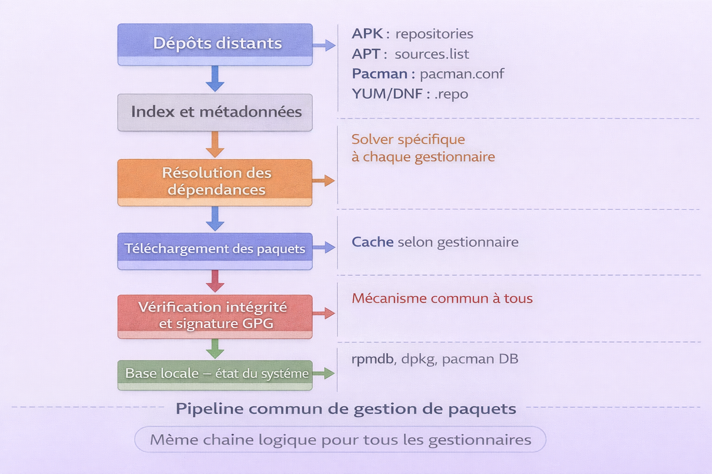
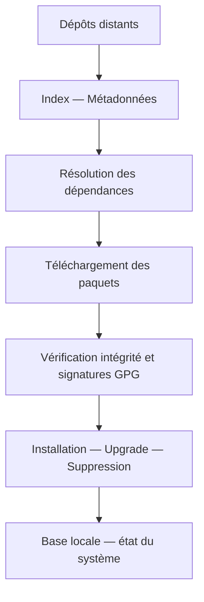

# Gestionnaires de paquets

!!! quote "Analogie"
    _Un gestionnaire de paquets, c'est la logistique d'un OS Linux. Il sait où sont les entrepôts (dépôts), tient l'inventaire (base locale), gère les contrats (dépendances), vérifie l'authenticité (signatures), puis installe et met à jour proprement. La différence entre APK, APT, Pacman, YUM et DNF, c'est surtout l'écosystème — la distribution — et les règles du jeu : dépôts, sécurité, cycles de release._

Ce chapitre est un **index** : comprendre rapidement les cinq gestionnaires, identifier lequel correspond à quelle distribution et accéder au bon guide sans hésiter.

 

---

## Les cinq gestionnaires en une phrase

**APK (Alpine)** : minimalisme extrême, vitesse, excellent pour les conteneurs, logique sans cache et paquets virtuels.

**APT (Debian, Ubuntu)** : maturité, stabilité, écosystème très large, chaîne APT et dpkg, référence pour les serveurs et les postes de travail.

**Pacman (Arch)** : simple, cohérent, rapide, philosophie Arch — contrôle fin et rolling release — configuration très lisible.

**YUM (RHEL legacy)** : outil historique de haut niveau autour de RPM, encore présent dans beaucoup de documentation et de systèmes anciens.

**DNF (RHEL, Fedora moderne)** : successeur de YUM, meilleur résolveur, fonctionnalités modernes — modules AppStream, plugins — usage professionnel actuel.

 

---

## Distribution vers gestionnaire — ne plus se tromper

!!! note "L'image ci-dessous cartographie la correspondance entre les familles de distributions et leur gestionnaire de paquets. C'est la première question à résoudre avant d'ouvrir un guide."

<em>Chaque famille de distribution impose son gestionnaire de paquets et son format de paquet. Alpine utilise APK avec le format .apk. Debian et Ubuntu utilisent APT avec le format .deb. Arch et ses dérivés utilisent Pacman avec le format .pkg.tar.*. Les distributions RHEL-like utilisent RPM comme format commun, géré par YUM sur les systèmes legacy (RHEL 5/6/7) et par DNF sur les systèmes modernes (RHEL 8/9, Rocky Linux, AlmaLinux, Fedora).</em>

| Famille de distribution | Gestionnaire | Format | Usage typique |
|---|---|---|---|
| Alpine | APK | .apk | Docker, microservices, edge, IoT, systèmes légers |
| Debian, Ubuntu | APT | .deb | Serveurs, desktop, cloud, infrastructures stables |
| Arch, Manjaro | Pacman | .pkg.tar.* | Développement, rolling release, environnements très à jour |
| RHEL-like anciens — CentOS 7 | YUM | .rpm | Legacy, documentation historique, serveurs hérités |
| RHEL-like modernes, Fedora | DNF | .rpm | Production actuelle, enterprise, outillage moderne |

 

---

## Modèle mental commun — le pipeline de gestion de paquets

!!! note "L'image ci-dessous représente le pipeline commun à tous les gestionnaires de paquets. Comprendre cette chaîne une seule fois permet de transposer rapidement les concepts d'un gestionnaire à l'autre."

<em>Tous les gestionnaires de paquets Linux suivent la même chaîne logique. Les dépôts distants exposent un index de métadonnées — noms, versions, dépendances. Le gestionnaire résout les dépendances, télécharge les paquets nécessaires, vérifie leur intégrité et leur signature GPG, les installe et met à jour la base locale qui mémorise l'état du système. Les différences entre APK, APT, Pacman, YUM et DNF portent sur la philosophie de release, la gestion du cache, les mécanismes avancés et la structure des dépôts — pas sur ce pipeline fondamental.</em>

Les différences majeures à retenir entre les gestionnaires portent sur quatre axes : la localisation de la base locale qui mémorise ce qui est installé, la gestion du cache par défaut ou non, les mécanismes avancés comme le pinning, les modules, les hooks ou les paquets virtuels, et la philosophie de release — stable ou rolling.

 

---

## Comparatif express

| Sujet | APK | APT | Pacman | YUM | DNF |
|---|---|---|---|---|---|
| Philosophie | Ultra-léger | Stable et mature | Simple et direct | Legacy RPM | RPM moderne |
| Point fort | Conteneurs | Fiabilité | Contrôle fin | Compatibilité documentation | Modules et plugins |
| Configuration dépôts | `repositories` | `sources.list` | `pacman.conf` | `.repo` | `.repo` |
| Spécificités notables | `world`, `--virtual`, `--no-cache` | Pinning, unattended-upgrades | Hooks, rolling release | history, groups | AppStream, repoquery |

 

---

## Navigation des guides

- ### :lucide-package:{ .lg .middle } **APK — Alpine Linux**

    Dépôts, `world`, paquets virtuels, `--no-cache`, conteneurs et pratiques production.

    [:lucide-book-open-check: Ouvrir le guide APK](./apk-alpine.md)

- ### :lucide-box:{ .lg .middle } **APT — Debian, Ubuntu**

    APT et dpkg, sources, clés GPG, pinning, upgrades sûrs, dépannage et automatisation.

    [:lucide-book-open-check: Ouvrir le guide APT](./apt-debian-ubuntu.md)

- ### :lucide-zap:{ .lg .middle } **Pacman — Arch Linux**

    Synchronisation DB, installation et suppression, hooks, clés GPG, dépannage, stratégie rolling release.

    [:lucide-book-open-check: Ouvrir le guide Pacman](./pacman-arch.md)

- ### :lucide-history:{ .lg .middle } **YUM — RHEL legacy**

    Héritage RPM : dépôts, groupes, historique transactionnel, compatibilité avec la documentation existante.

    [:lucide-book-open-check: Ouvrir le guide YUM](./yum-rhel-centos.md)

- ### :lucide-shield-check:{ .lg .middle } **DNF — RHEL, Fedora moderne**

    Successeur de YUM : résolveur amélioré, plugins, modules AppStream, pratiques production actuelles.

    [:lucide-book-open-check: Ouvrir le guide DNF](./dnf-rhel-fedora.md)

 

---

## Méthodologie commune — comment lire les cinq guides

!!! tip "Règles de lecture"
    1. Commencer par la distribution en usage : Alpine → APK, Debian et Ubuntu → APT, Arch → Pacman, RHEL-like → DNF (YUM pour le legacy).
    2. Apprendre d'abord le triptyque fondamental : dépôts, recherche, installation. Le reste devient mécanique.
    3. En production, traiter systématiquement : sécurité de la supply chain, reproductibilité et procédures de dépannage.
    4. En conteneurs, optimiser : couches Docker, cache, dépendances temporaires et utilisateur non-root.

 

---

## Conclusion

!!! quote "Ce qu'il faut retenir"
    La gestion des paquets via index est la porte d'entrée de toute administration système Linux. Comprendre ses mécanismes de résolution de dépendances et de dépôts garantit la stabilité et la sécurité de vos serveurs en production.

!!! quote "Conclusion"
    _La gestion de paquets ne se résume pas à installer un outil. C'est maîtriser la chaîne d'approvisionnement logicielle de ses serveurs et de ses conteneurs. Savoir lire ses dépôts, contrôler ses versions, diagnostiquer un conflit et sécuriser les sources, c'est passer d'un usage utilisateur à un usage administration et production._

 