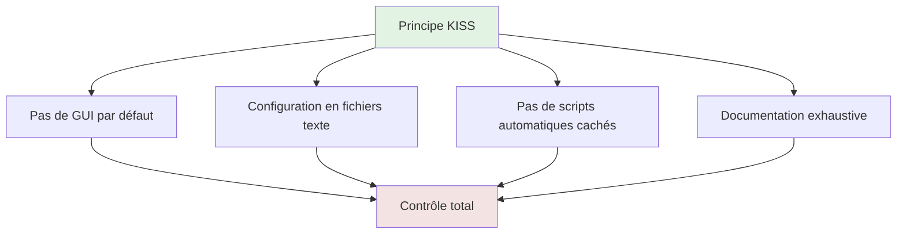
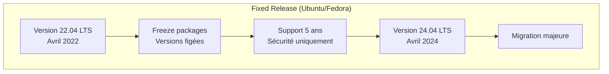
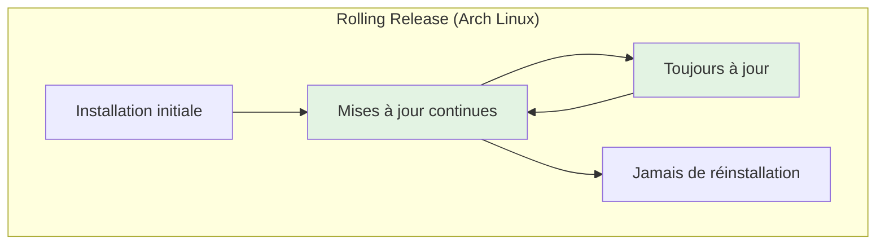
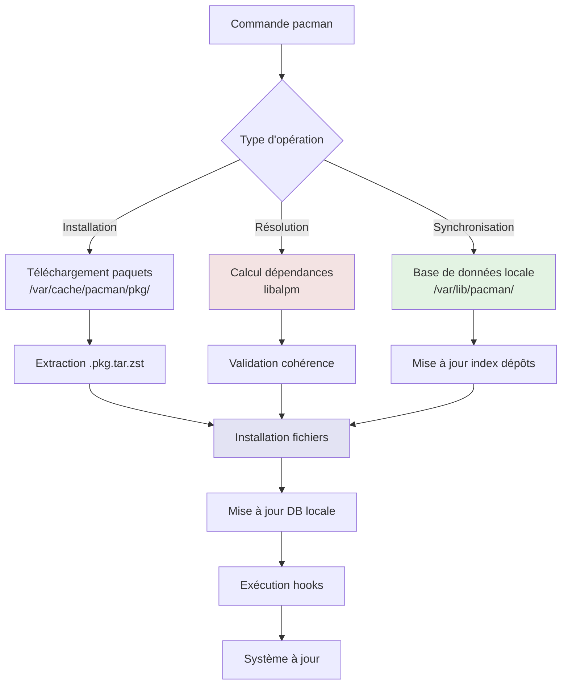
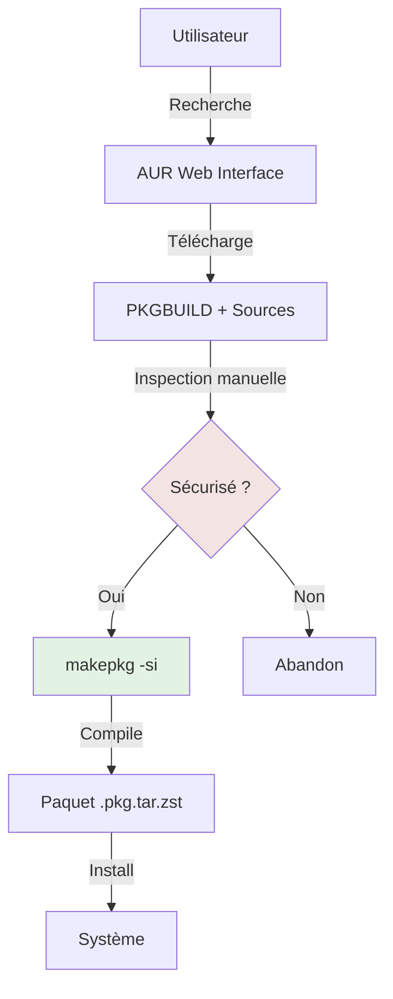

# PACMAN — Arch Linux Package Manager

## Introduction

**Niveau :** 🔴 Avancé

!!! quote "Analogie pédagogique"
    _Imaginez une **bibliothèque d'avant-garde** où vous n'empruntez jamais de livres obsolètes. Chaque ouvrage disponible représente la **version la plus récente** publiée, mise à jour quotidiennement. Le système de catalogage est **ultra-rapide**, les transactions sont **atomiques** (tout réussit ou tout échoue, jamais d'état intermédiaire corrompu), et vous contrôlez **précisément** quels livres entrent dans votre collection. **PACMAN fonctionne exactement ainsi** : c'est un gestionnaire de paquets conçu pour la simplicité, la rapidité, et le contrôle total sur un système en rolling release permanente._

> **PACMAN (Package Manager)** est le gestionnaire de paquets natif d'**Arch Linux**, une distribution créée en 2002 par **Judd Vinet** autour des principes de **simplicité**, **modernité**, **pragmatisme** et **contrôle utilisateur**. Contrairement aux distributions à versions fixes (Ubuntu, Fedora), Arch adopte un modèle de **rolling release** : le système se met à jour en continu vers les dernières versions logicielles sans jamais nécessiter de réinstallation majeure.

PACMAN se distingue par sa **philosophie minimaliste** : pas d'interface graphique par défaut, pas de configuration automatique, pas de décisions prises à la place de l'utilisateur. Chaque action est **explicite**, chaque dépendance **transparente**, chaque mise à jour **contrôlée**. Cette approche fait d'Arch et PACMAN le choix privilégié des utilisateurs avancés recherchant la **maîtrise totale** de leur système et l'**accès immédiat** aux dernières versions logicielles.

!!! info "Pourquoi c'est important ?"
    PACMAN permet de maintenir un système **toujours à jour** (rolling release), de gérer les **dépendances complexes** avec précision, d'accéder aux **logiciels les plus récents** quelques heures après leur sortie, de **comprendre exactement** ce qui se passe sur le système, et de construire un environnement **minimaliste et optimisé** sans bloatware.

## Pour repartir des bases (vrais débutants)

Si vous n'avez jamais utilisé Arch Linux, sachez qu'Arch n'est **pas une distribution pour débutants Linux**. Arch exige une **compréhension solide** du système Linux (partitionnement, chroot, systemd, réseau) car l'installation est entièrement **manuelle** et minimale. PACMAN suppose que vous savez ce que vous faites. Il n'y a pas de garde-fous, pas de confirmations excessives, pas de récupération automatique d'erreurs.

!!! warning "Arch n'est pas Ubuntu"
    **Ubuntu/Debian** visent la stabilité et l'accessibilité avec des versions testées pendant des mois. **Arch Linux** vise la modernité et le contrôle avec des logiciels à jour quotidiennement. Si vous cherchez un système stable pour une production critique, choisissez Debian/RHEL. Si vous voulez les dernières versions et acceptez la maintenance active, Arch est idéal.

## Philosophie Arch Linux

Comprendre PACMAN nécessite de comprendre la philosophie d'Arch Linux.

### Les principes fondateurs

**Simplicité (KISS - Keep It Simple, Stupid) :**

Arch évite les abstractions inutiles. Le système est transparent et compréhensible.



**Modernité (Cutting Edge) :**

- **Rolling release** : Mises à jour continues, pas de versions majeures
- **Derniers kernels** : Linux 6.x disponible quelques jours après sortie
- **Logiciels récents** : Pas de freeze des versions pendant 6 mois
- **Technologies modernes** : systemd, Wayland, PipeWire adoptés rapidement

**Pragmatisme :**

- **Open source privilégié** mais propriétaire accepté si nécessaire
- **Performance** avant purisme idéologique
- **Fonctionnalité** avant philosophie

**Contrôle utilisateur :**

- **Vous décidez** de tout ce qui est installé
- **Aucun paquet** installé par défaut sauf le strict minimum
- **Installation manuelle** qui force la compréhension

### Rolling Release vs Fixed Release





**Avantages Rolling Release :**

- [x] **Dernières fonctionnalités** immédiatement disponibles
- [x] **Pas de migration** majeure tous les 2 ans
- [x] **Corrections de bugs** instantanées
- [x] **Apprentissage continu** du système

**Inconvénients Rolling Release :**

- [ ] **Stabilité réduite** (breakage possible)
- [ ] **Maintenance régulière** obligatoire
- [ ] **Veille technologique** nécessaire
- [ ] **Incompatibilité temporaire** possible

### Architecture des dépôts

Arch organise ses paquets en **dépôts officiels** et **AUR** (Arch User Repository).

```
Dépôts Officiels (maintenus par Arch)
├── core            # Paquets essentiels système
│   ├── kernel
│   ├── systemd
│   └── pacman
├── extra           # Paquets additionnels officiels
│   ├── firefox
│   ├── nginx
│   └── postgresql
└── community       # Paquets communautaires vérifiés
    ├── docker
    ├── kubernetes
    └── vscode

AUR (User Repository - non officiel)
├── yay             # Helper AUR
├── spotify         # Logiciels propriétaires
├── google-chrome   # Versions binaires
└── packages-git    # Versions développement
```

**Distinction critique :**

| Dépôt | Maintenance | Vérification | Sécurité | Support |
|-------|-------------|--------------|----------|---------|
| **core/extra** | Arch Developers | Complète | Haute | Officiel |
| **community** | Trusted Users | Complète | Haute | Communautaire |
| **AUR** | Mainteneur individuel | Aucune | **Variable** | **Aucun** |

!!! danger "AUR n'est PAS un dépôt officiel"
    **AUR** contient des **scripts de build** (PKGBUILD) fournis par des utilisateurs. Ces scripts peuvent contenir **n'importe quoi**, y compris du code malveillant. **Inspectez toujours** le PKGBUILD avant installation. AUR est puissant mais nécessite vigilance.

## Architecture de PACMAN

### Composants du système



### Structure des fichiers

**Configuration :**
```
/etc/pacman.conf        # Configuration principale PACMAN
/etc/pacman.d/          # Configuration fragmentée
├── mirrorlist          # Liste des miroirs
└── hooks/              # Hooks personnalisés
```

**Base de données :**
```
/var/lib/pacman/
├── local/              # Paquets installés
│   ├── bash-5.2.15-1/
│   │   ├── desc        # Description paquet
│   │   ├── files       # Liste fichiers installés
│   │   └── mtree       # Métadonnées arboresence
│   └── ...
├── sync/               # Index dépôts synchronisés
│   ├── core.db
│   ├── extra.db
│   └── community.db
└── ALPM_DB_VERSION     # Version format DB
```

**Cache :**
```
/var/cache/pacman/pkg/  # Archives .pkg.tar.zst téléchargées
├── firefox-120.0-1-x86_64.pkg.tar.zst
├── nginx-1.24.0-1-x86_64.pkg.tar.zst
└── ...
```

### Format des paquets

Les paquets Arch sont des **archives compressées** `.pkg.tar.zst`.

**Contenu d'un paquet :**
```
firefox-120.0-1-x86_64.pkg.tar.zst
├── .BUILDINFO          # Informations de build
├── .MTREE              # Métadonnées fichiers
├── .PKGINFO            # Métadonnées paquet
├── .INSTALL            # Scripts pre/post installation
└── usr/                # Arborescence fichiers
    ├── bin/
    │   └── firefox
    ├── lib/
    │   └── firefox/
    └── share/
        └── applications/
```

**Métadonnées .PKGINFO :**
```
pkgname = firefox
pkgver = 120.0-1
pkgdesc = Standalone web browser from Mozilla
url = https://www.mozilla.org/firefox/
arch = x86_64
license = MPL GPL LGPL
depend = gtk3
depend = libxt
depend = nss
optdepend = libnotify: Notification support
```

## Commandes fondamentales

### Synchronisation de la base de données

```bash
# Mettre à jour la liste des paquets disponibles
pacman -Sy

# ATTENTION : Ne jamais faire juste -Sy avant installation
# Risque de partial upgrade (système cassé)
```

!!! danger "Partial Upgrade - Le piège mortel"
    **Ne JAMAIS** faire `pacman -Sy package`. Toujours faire `pacman -Syu package`.
    
    **Pourquoi ?** `-Sy` synchronise la base de données mais n'installe pas les mises à jour. Si vous installez ensuite un nouveau paquet, il peut dépendre de versions mises à jour d'autres paquets qui ne sont pas encore installées. Résultat : **système cassé**.
    
    **Bonne pratique :** Toujours mettre à jour le système complet avant d'installer quoi que ce soit.

### Mise à jour du système

```bash
# Mise à jour complète du système (recommandé)
pacman -Syu

# Mise à jour forcée (redownload même si packages à jour)
pacman -Syuu

# Mise à jour avec confirmation détaillée
pacman -Syu --verbose

# Mise à jour sans confirmation (scripts)
pacman -Syu --noconfirm
```

**Workflow de mise à jour typique :**

```bash
# 1. Vérifier les actualités Arch (OBLIGATOIRE)
# https://archlinux.org/news/

# 2. Mettre à jour les clés GPG si nécessaire
pacman -Sy archlinux-keyring

# 3. Mettre à jour le système
pacman -Syu

# 4. Redémarrer si kernel mis à jour
uname -r  # Vérifier version kernel en cours
pacman -Q linux  # Vérifier version installée
# Si différent → reboot

# 5. Vérifier les fichiers .pacnew/.pacsave
find /etc -name "*.pac*"
```

### Installation de paquets

```bash
# Installer un paquet
pacman -S firefox

# Installer plusieurs paquets
pacman -S nginx postgresql redis

# Installer avec confirmation automatique
pacman -S --noconfirm docker

# Installer depuis le cache local (offline)
pacman -U /var/cache/pacman/pkg/firefox-120.0-1-x86_64.pkg.tar.zst

# Installer depuis une URL
pacman -U https://archive.archlinux.org/packages/f/firefox/firefox-119.0-1-x86_64.pkg.tar.zst

# Réinstaller un paquet (force)
pacman -S --overwrite '*' firefox
```

**Gestion des dépendances :**

```bash
# Installer uniquement les dépendances (pas le paquet)
pacman -S --asdeps libfoo

# Installer comme dépendance explicite
pacman -S --asexplicit firefox

# Ignorer une dépendance (dangereux)
pacman -S --nodeps package
```

### Recherche de paquets

```bash
# Rechercher dans les dépôts
pacman -Ss firefox

# Recherche avec regex
pacman -Ss '^firefox'

# Afficher les informations détaillées
pacman -Si firefox

# Afficher les dépendances
pacman -Si firefox | grep "Depends On"

# Lister tous les paquets disponibles
pacman -Sl

# Lister les paquets d'un dépôt spécifique
pacman -Sl core

# Rechercher qui fournit un fichier
pacman -F /usr/bin/vim
# Nécessite : pacman -Fy (mise à jour base fichiers)
```

### Interrogation des paquets installés

```bash
# Lister tous les paquets installés
pacman -Q

# Lister les paquets installés explicitement
pacman -Qe

# Lister les dépendances orphelines
pacman -Qdt

# Informations sur un paquet installé
pacman -Qi firefox

# Lister les fichiers d'un paquet installé
pacman -Ql firefox

# Trouver le paquet propriétaire d'un fichier
pacman -Qo /usr/bin/firefox

# Vérifier l'intégrité des fichiers installés
pacman -Qk firefox

# Vérifier tous les paquets
pacman -Qkk
```

### Suppression de paquets

```bash
# Supprimer un paquet
pacman -R firefox

# Supprimer avec dépendances inutilisées
pacman -Rs firefox

# Supprimer récursivement (cascade)
pacman -Rsc firefox

# Supprimer avec fichiers de configuration
pacman -Rn firefox

# Supprimer complètement (recommandé)
pacman -Rns firefox

# Supprimer les orphelins
pacman -Rns $(pacman -Qtdq)
```

**Signification des options :**

| Option | Effet |
|--------|-------|
| `-R` | Remove (suppression basique) |
| `-s` | Recursive (supprimer dépendances non utilisées) |
| `-c` | Cascade (supprimer paquets dépendant du paquet) |
| `-n` | Nosave (supprimer fichiers de configuration) |

### Nettoyage du cache

```bash
# Nettoyer les paquets désinstallés du cache
pacman -Sc

# Nettoyer TOUT le cache (libère beaucoup d'espace)
pacman -Scc

# Voir la taille du cache
du -sh /var/cache/pacman/pkg/

# Garder seulement les N dernières versions (avec paccache)
paccache -r

# Garder seulement les 3 dernières versions
paccache -rk3

# Supprimer les paquets désinstallés du cache
paccache -ruk0
```

!!! tip "Gestion intelligente du cache"
    Le cache permet de **downgrader** facilement en cas de problème. Recommandation :
    - Garder les **3 dernières versions** de chaque paquet (`paccache -rk3`)
    - Nettoyer mensuellement avec `paccache -r`
    - Avant mise à jour majeure, garder plus de versions

## Configuration PACMAN

### Fichier /etc/pacman.conf

**Structure du fichier :**

```ini
#
# /etc/pacman.conf
#

[options]
# Architecture
Architecture = auto

# Répertoires
RootDir     = /
DBPath      = /var/lib/pacman/
CacheDir    = /var/cache/pacman/pkg/
LogFile     = /var/log/pacman.log
GPGDir      = /etc/pacman.d/gnupg/

# Comportement
HoldPkg      = pacman glibc
# XferCommand = /usr/bin/curl -L -C - -f -o %o %u
# CleanMethod = KeepInstalled

# Téléchargement parallèle (recommandé)
ParallelDownloads = 5

# Affichage couleur
Color

# Barre de progression détaillée
ILoveCandy

# Vérification signatures
SigLevel    = Required DatabaseOptional
LocalFileSigLevel = Optional

# Hooks
#NoUpgrade   =
#NoExtract   =

# Ignorer des paquets (dangereux)
#IgnorePkg   = linux
#IgnoreGroup = gnome

# Dépôts
[core]
Include = /etc/pacman.d/mirrorlist

[extra]
Include = /etc/pacman.d/mirrorlist

[community]
Include = /etc/pacman.d/mirrorlist

# Dépôts tiers (exemple)
#[multilib]
#Include = /etc/pacman.d/mirrorlist
```

### Options importantes

**ParallelDownloads :**

```ini
# Téléchargements parallèles (5 recommandé)
ParallelDownloads = 5
```

Accélère considérablement les mises à jour (2-3× plus rapide).

**Color et ILoveCandy :**

```ini
# Activer les couleurs
Color

# Pac-Man au lieu de barres de progression
ILoveCandy
```

**IgnorePkg :**

```ini
# Bloquer mise à jour de paquets spécifiques
IgnorePkg = linux linux-headers
```

!!! warning "IgnorePkg est dangereux"
    Bloquer des mises à jour crée des **partial upgrades**. À utiliser uniquement temporairement si un paquet spécifique casse le système. Surveiller les mises à jour et débloquer dès que possible.

**HoldPkg :**

```ini
# Paquets critiques (PACMAN demande confirmation si suppression)
HoldPkg = pacman glibc
```

Empêche la suppression accidentelle de paquets critiques.

### Gestion des miroirs

**Fichier /etc/pacman.d/mirrorlist :**

```bash
# Miroirs Arch Linux
# Généré par reflector le 2025-11-15

# France
Server = https://archlinux.mailtunnel.eu/$repo/os/$arch
Server = https://mirror.oldsql.cc/archlinux/$repo/os/$arch

# Allemagne
Server = https://mirror.netcologne.de/archlinux/$repo/os/$arch

# Global CDN
Server = https://mirror.rackspace.com/archlinux/$repo/os/$arch
```

**Optimisation avec reflector :**

```bash
# Installer reflector
pacman -S reflector

# Générer liste optimisée (20 miroirs les plus rapides en France)
reflector --country France --latest 20 --sort rate --save /etc/pacman.d/mirrorlist

# Automatiser avec systemd timer
systemctl enable --now reflector.timer

# Configuration /etc/xdg/reflector/reflector.conf
--save /etc/pacman.d/mirrorlist
--country France,Germany
--protocol https
--latest 10
--sort rate
```

**Test manuel de vitesse :**

```bash
# Tester un miroir
time curl -o /dev/null https://mirror.example.com/core/os/x86_64/core.db

# Comparer plusieurs miroirs
for mirror in mirror1.com mirror2.com mirror3.com; do
    echo "Testing $mirror"
    time curl -o /dev/null https://$mirror/core/os/x86_64/core.db
done
```

## Gestion avancée

### Downgrade de paquets

Si une mise à jour casse le système, revenir à la version précédente.

**Méthode 1 : Depuis le cache local**

```bash
# Lister les versions disponibles dans le cache
ls /var/cache/pacman/pkg/ | grep firefox

# Installer version spécifique
pacman -U /var/cache/pacman/pkg/firefox-119.0-1-x86_64.pkg.tar.zst

# Bloquer temporairement la mise à jour
# /etc/pacman.conf
IgnorePkg = firefox
```

**Méthode 2 : Arch Linux Archive**

```bash
# Télécharger depuis archive.archlinux.org
pacman -U https://archive.archlinux.org/packages/f/firefox/firefox-119.0-1-x86_64.pkg.tar.zst
```

**Méthode 3 : Outil downgrade**

```bash
# Installer downgrade (depuis AUR)
yay -S downgrade

# Utiliser downgrade (interface interactive)
downgrade firefox
```

### Hooks PACMAN

Les hooks permettent d'exécuter des actions avant/après opérations PACMAN.

**Emplacement :** `/etc/pacman.d/hooks/`

**Exemple : Hook de sauvegarde automatique**

```ini
# /etc/pacman.d/hooks/backup-kernel.hook

[Trigger]
Operation = Upgrade
Type = Package
Target = linux

[Action]
Description = Sauvegarde kernel avant mise à jour
When = PreTransaction
Exec = /usr/local/bin/backup-kernel.sh
```

**Script de sauvegarde :**

```bash
#!/bin/bash
# /usr/local/bin/backup-kernel.sh

BACKUP_DIR="/boot/backup"
mkdir -p "$BACKUP_DIR"

cp /boot/vmlinuz-linux "$BACKUP_DIR/vmlinuz-linux-$(date +%Y%m%d)"
cp /boot/initramfs-linux.img "$BACKUP_DIR/initramfs-linux-$(date +%Y%m%d).img"

echo "Kernel sauvegardé dans $BACKUP_DIR"
```

**Exemple : Hook de nettoyage automatique**

```ini
# /etc/pacman.d/hooks/clean-cache.hook

[Trigger]
Operation = Upgrade
Operation = Install
Operation = Remove
Type = Package
Target = *

[Action]
Description = Nettoyage cache PACMAN
When = PostTransaction
Exec = /usr/bin/paccache -rk2
```

### Vérification de l'intégrité

```bash
# Vérifier l'intégrité d'un paquet
pacman -Qk firefox

# Vérifier tous les paquets (long)
pacman -Qkk

# Réinstaller si fichiers modifiés/corrompus
pacman -S --overwrite '*' firefox

# Vérifier la base de données PACMAN
pacman-db-upgrade
```

### Gestion des fichiers de configuration

PACMAN ne remplace **jamais** automatiquement vos fichiers de configuration modifiés.

**Fichiers .pacnew et .pacsave :**

| Fichier | Situation | Signification |
|---------|-----------|---------------|
| `.pacnew` | Mise à jour | Nouvelle version du fichier config fournie par le paquet |
| `.pacsave` | Suppression | Ancienne version sauvegardée lors de la suppression |

**Workflow de gestion :**

```bash
# Trouver les fichiers .pacnew
find /etc -name "*.pacnew"

# Comparer avec diff
diff /etc/pacman.conf /etc/pacman.conf.pacnew

# Fusionner manuellement ou remplacer
mv /etc/pacman.conf.pacnew /etc/pacman.conf

# Outil automatisé : pacdiff
pacdiff
```

**pacdiff interactif :**

```bash
# Installer pacdiff (dans pacman-contrib)
pacman -S pacman-contrib

# Lancer pacdiff
pacdiff
# Options :
# v - Voir diff
# m - Fusionner avec vimdiff
# r - Remplacer par .pacnew
# s - Sauter
# q - Quitter
```

## AUR (Arch User Repository)

### Comprendre AUR

**AUR** contient des **PKGBUILD** (scripts de build) fournis par la communauté, **pas des paquets binaires**.



**PKGBUILD exemple :**

```bash
# Maintainer: Username <email@example.com>

pkgname=myapp
pkgver=1.0.0
pkgrel=1
pkgdesc="My application"
arch=('x86_64')
url="https://example.com"
license=('MIT')
depends=('python' 'gtk3')
makedepends=('git')
source=("$pkgname-$pkgver.tar.gz::https://example.com/releases/$pkgver.tar.gz")
sha256sums=('abc123...')

build() {
    cd "$pkgname-$pkgver"
    make
}

package() {
    cd "$pkgname-$pkgver"
    make DESTDIR="$pkgdir" install
}
```

### Installation manuelle depuis AUR

```bash
# 1. Rechercher sur https://aur.archlinux.org/

# 2. Cloner le dépôt Git
git clone https://aur.archlinux.org/yay.git
cd yay

# 3. INSPECTER le PKGBUILD (OBLIGATOIRE)
cat PKGBUILD
# Vérifier :
# - Source légitime
# - Pas de commandes suspectes
# - SHA256 correct

# 4. Compiler et installer
makepkg -si
# -s : Installer dépendances
# -i : Installer le paquet compilé

# 5. Mettre à jour
cd yay
git pull
makepkg -si
```

### Helpers AUR

Les **AUR helpers** automatisent le processus d'installation depuis AUR.

**yay (Yet Another Yogurt) - Recommandé :**

```bash
# Installer yay manuellement (une fois)
pacman -S --needed git base-devel
git clone https://aur.archlinux.org/yay.git
cd yay
makepkg -si

# Utiliser yay comme pacman
yay -Syu              # Mettre à jour système + AUR
yay -S spotify        # Installer depuis AUR
yay -Ss spotify       # Rechercher dans official + AUR
yay -Yc               # Nettoyer dépendances orphelines
```

**paru (Alternative moderne) :**

```bash
# Fonctionnalités similaires à yay
paru -Syu
paru -S google-chrome
```

!!! danger "Sécurité AUR"
    **Jamais de confiance aveugle** :
    1. Toujours **inspecter le PKGBUILD** avant installation
    2. Vérifier le **mainteneur** (utilisateur reconnu ?)
    3. Vérifier les **votes** et **commentaires**
    4. Vérifier la **date de dernière mise à jour**
    5. Vérifier les **sources** (URL légitime ?)
    
    Un PKGBUILD malveillant peut **compromettre tout le système**.

## Résolution de problèmes

### Erreurs de clés GPG

**Problème :** Signatures invalides lors de mises à jour.

```bash
error: package-name: signature from "Builder <email>" is invalid
error: failed to commit transaction (invalid or corrupted package)
```

**Solution :**

```bash
# Mettre à jour les clés
pacman -Sy archlinux-keyring

# Réinitialiser complètement les clés (dernier recours)
rm -rf /etc/pacman.d/gnupg
pacman-key --init
pacman-key --populate archlinux
```

### Conflit de fichiers

**Problème :** Fichiers appartenant à plusieurs paquets.

```bash
error: failed to commit transaction (conflicting files)
package-name: /usr/bin/binary exists in filesystem
```

**Solutions :**

```bash
# Méthode 1 : Vérifier qui possède le fichier
pacman -Qo /usr/bin/binary

# Si orphelin, forcer l'écrasement
pacman -S --overwrite /usr/bin/binary package-name

# Si appartient à un autre paquet, conflit légitime
# Désinstaller l'ancien ou résoudre manuellement
```

### Base de données corrompue

```bash
# Sauvegarder la DB actuelle
cp -r /var/lib/pacman /var/lib/pacman.bak

# Régénérer la base de données
pacman-db-upgrade

# Si échec complet, réinstaller PACMAN
pacman -S --overwrite '*' pacman
```

### Système cassé après mise à jour

**Scénario de récupération :**

```bash
# 1. Booter sur USB Live Arch

# 2. Monter le système cassé
mount /dev/sdaX /mnt
mount /dev/sdaY /mnt/boot  # Si /boot séparé
arch-chroot /mnt

# 3. Downgrader le paquet problématique
pacman -U /var/cache/pacman/pkg/broken-package-old-version.pkg.tar.zst

# 4. Bloquer temporairement
# /etc/pacman.conf
IgnorePkg = broken-package

# 5. Redémarrer
exit
umount -R /mnt
reboot
```

## Bonnes pratiques

### Routine de maintenance

**Hebdomadaire :**

```bash
# 1. Lire les actualités Arch
# https://archlinux.org/news/

# 2. Mettre à jour le système
pacman -Syu

# 3. Nettoyer les orphelins
pacman -Rns $(pacman -Qtdq)

# 4. Nettoyer le cache (garder 3 versions)
paccache -rk3
```

**Mensuelle :**

```bash
# Vérifier .pacnew
pacdiff

# Vérifier l'intégrité
pacman -Qkk | grep warning

# Vérifier les fichiers orphelins
find /etc /opt /usr -type f \( -name "*.pac*" \) 2>/dev/null
```

### Sauvegardes avant mise à jour majeure

```bash
# Liste des paquets installés
pacman -Qe > ~/backup/pkglist-$(date +%Y%m%d).txt

# Copie complète de /etc
tar -czf ~/backup/etc-$(date +%Y%m%d).tar.gz /etc

# Snapshot filesystem (si Btrfs)
btrfs subvolume snapshot / /.snapshots/pre-update-$(date +%Y%m%d)
```

### Éviter les partial upgrades

!!! danger "Règle d'or Arch"
    **TOUJOURS** faire `pacman -Syu` avant toute installation. **JAMAIS** juste `pacman -Sy package`.

**Mauvais :**
```bash
pacman -Sy firefox  # DANGEREUX
```

**Bon :**
```bash
pacman -Syu firefox  # CORRECT
```

### Surveiller les actualités

**Avant chaque mise à jour :**

```bash
# Consulter https://archlinux.org/news/
# Vérifier si interventions manuelles nécessaires

# Exemples d'interventions passées :
# - Migration /usr/lib/modules → /lib/modules
# - Changement grub.cfg
# - Migration base vers base-devel
```

**Automatiser avec arch-audit :**

```bash
pacman -S arch-audit

# Vérifier vulnérabilités connues
arch-audit
```

## Optimisations

### Compilation avec makepkg

**Configuration /etc/makepkg.conf :**

```bash
# Optimisations CPU (exemple AMD Ryzen)
CFLAGS="-march=native -O2 -pipe -fno-plt"
CXXFLAGS="${CFLAGS}"

# Compilation parallèle (nombre de cœurs + 1)
MAKEFLAGS="-j9"

# Compression paquet (zstd ultra rapide)
PKGEXT='.pkg.tar.zst'
COMPRESSZST=(zstd -c -T0 --ultra -20 -)
```

### Cache local de paquets

**Pour plusieurs machines Arch :**

```bash
# Machine serveur : Partager le cache via NFS/Samba
# /etc/exports
/var/cache/pacman/pkg 192.168.1.0/24(ro,sync)

# Machines clientes : Monter le cache distant
mount server:/var/cache/pacman/pkg /var/cache/pacman/pkg
```

**Ou utiliser un proxy cache (pkgproxy) :**

```bash
# Installation
yay -S pkgproxy

# Configuration clients
# /etc/pacman.conf
#XferCommand = /usr/bin/curl -x http://proxy-server:8080 -C - -f %o %u
```

## Le mot de la fin

!!! quote
    Arch Linux et PACMAN représentent une **philosophie radicalement différente** de la gestion système. Là où Ubuntu vous protège, Arch vous responsabilise. Là où Fedora automatise, Arch exige compréhension. Cette approche n'est pas pour tout le monde, et c'est précisément son intérêt.
    
    PACMAN est un outil **puissant mais impitoyable**. Il fait exactement ce que vous lui demandez, sans garde-fous excessifs. Cette confiance implique une **responsabilité** : comprendre ce qu'on installe, lire les actualités avant mise à jour, maintenir le système régulièrement. En échange, vous obtenez un système **parfaitement maîtrisé**, **toujours à jour**, et **minimalement bloated**.
    
    Le modèle **rolling release** transforme la maintenance système en **discipline continue** plutôt qu'en migration traumatique bisannuelle. Vous apprenez constamment, vous adaptez progressivement, vous restez à la pointe. Cette approche convient aux développeurs, administrateurs système, et enthousiastes qui considèrent leur système d'exploitation comme un **outil à perfectionner** plutôt qu'un produit fini.
    
    AUR illustre la **force de la communauté** Arch. Avec plus de 80 000 paquets maintenus par des utilisateurs, pratiquement tout logiciel Linux est accessible sur Arch. Cette richesse nécessite **vigilance** - inspecter les PKGBUILD, vérifier les mainteneurs, comprendre ce qu'on installe. Mais elle offre une **liberté** inégalée.
    
    Maîtriser PACMAN, c'est comprendre que la **simplicité** n'est pas synonyme de facilité. C'est accepter que la **transparence** vaut mieux que l'abstraction. C'est intégrer que le **contrôle total** implique responsabilité totale. Cette philosophie, appliquée rigoureusement, produit des systèmes d'une élégance et d'une efficacité remarquables.
    
    Arch n'est pas une distribution pour débutants, et elle ne prétend pas l'être. C'est une distribution pour ceux qui **veulent comprendre** leur système, pas juste l'utiliser. Pour ceux qui préfèrent la **documentation exhaustive** aux assistants graphiques. Pour ceux qui considèrent la **maintenance active** comme un investissement, pas une corvée.

---

!!! abstract "Métadonnées"
    **Version** : 1.0  
    **Dernière mise à jour** : Novembre 2025  
    **Durée de lecture** : 45-50 minutes  
    **Niveau** : 🔴 Avancé