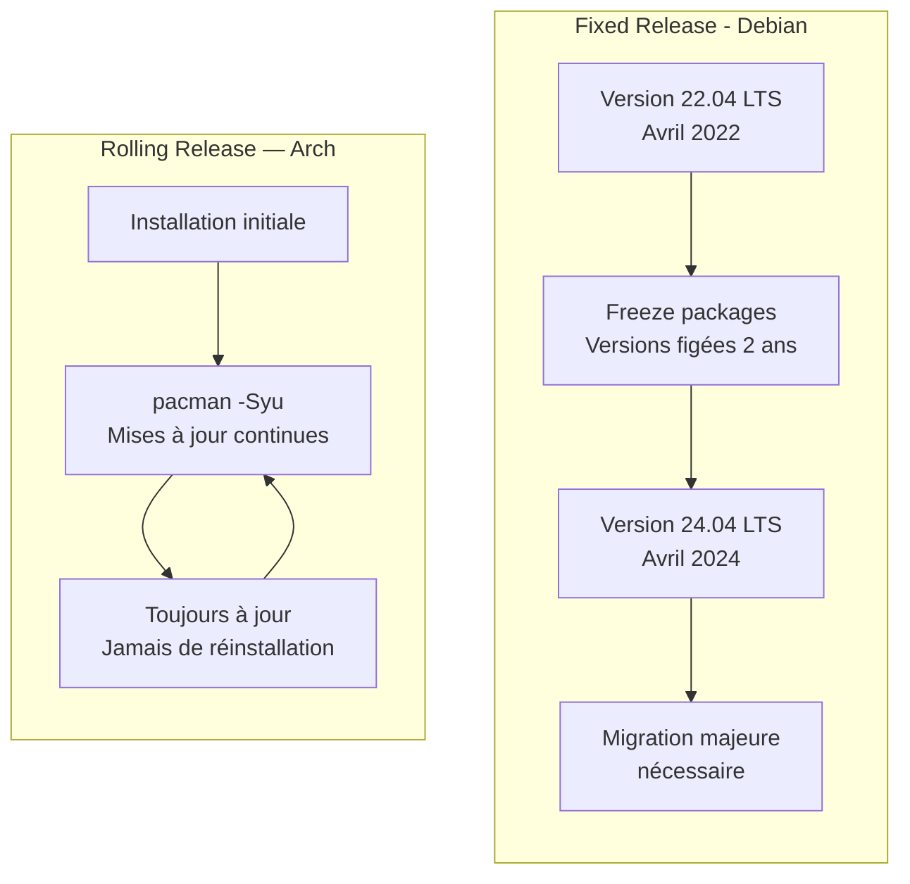
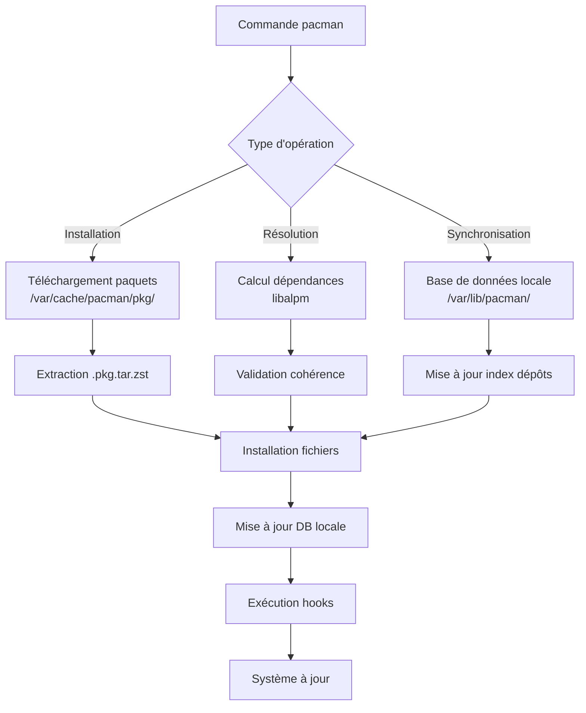
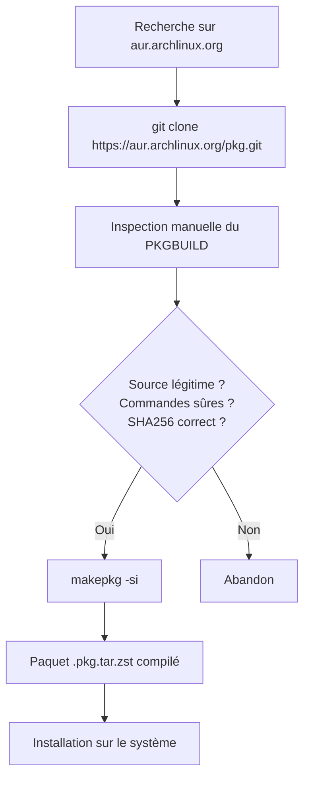

# PACMAN — Arch Linux Package Manager

<div
  class="omny-meta"
  data-level="🔴 Avancé"
  data-version="1.0"
  data-time="45-50 minutes">
</div>

!!! quote "Analogie"
    _Une bibliothèque d'avant-garde où l'on n'emprunte jamais de livres obsolètes. Chaque ouvrage représente la version la plus récente publiée, mise à jour quotidiennement. Le système de catalogage est ultra-rapide, les transactions sont atomiques — tout réussit ou tout échoue, jamais d'état intermédiaire corrompu — et vous contrôlez précisément quels livres entrent dans votre collection. PACMAN fonctionne exactement ainsi : un gestionnaire de paquets conçu pour la simplicité, la rapidité et le contrôle total sur un système en rolling release permanente._

**PACMAN (Package Manager)** est le gestionnaire de paquets natif d'**Arch Linux**, une distribution créée en 2002 par Judd Vinet autour des principes de **simplicité**, **modernité**, **pragmatisme** et **contrôle utilisateur**. Contrairement aux distributions à versions fixes (Ubuntu, Fedora), Arch adopte un modèle de **rolling release** : le système se met à jour en continu vers les dernières versions logicielles sans jamais nécessiter de réinstallation majeure.

PACMAN se distingue par sa philosophie minimaliste : pas d'interface graphique par défaut, pas de configuration automatique, pas de décisions prises à la place de l'utilisateur. Chaque action est **explicite**, chaque dépendance **transparente**, chaque mise à jour **contrôlée**. Cette approche fait d'Arch et PACMAN le choix privilégié des utilisateurs avancés recherchant la maîtrise totale de leur système et l'accès immédiat aux dernières versions logicielles.

Arch Linux n'est pas une distribution pour débutants. Elle exige une compréhension solide du système Linux — partitionnement, chroot, systemd, réseau — car l'installation est entièrement manuelle et minimale. PACMAN suppose que l'utilisateur sait ce qu'il fait : il n'y a pas de garde-fous, pas de confirmations excessives, pas de récupération automatique d'erreurs.

!!! info "Pourquoi c'est important"
    PACMAN permet de maintenir un système toujours à jour (rolling release), de gérer les dépendances complexes avec précision, d'accéder aux logiciels les plus récents quelques heures après leur sortie, de comprendre exactement ce qui se passe sur le système et de construire un environnement minimaliste et optimisé sans bloatware.

!!! warning "Arch n'est pas Ubuntu"
    Ubuntu et Debian visent la stabilité avec des versions testées pendant des mois. Arch Linux vise la modernité avec des logiciels à jour quotidiennement. Pour un système stable en production critique, choisir Debian ou RHEL. Pour les dernières versions avec maintenance active, Arch est idéal.

<br />

---

## Philosophie Arch Linux

Comprendre PACMAN nécessite de comprendre la philosophie d'Arch Linux.

### Les principes fondateurs

**Simplicité (KISS — Keep It Simple) :** Arch évite les abstractions inutiles. Le système est transparent et compréhensible — pas de GUI par défaut, configuration en fichiers texte, pas de scripts automatiques cachés, documentation exhaustive.

**Modernité (Cutting Edge) :** rolling release avec mises à jour continues, derniers kernels disponibles quelques jours après sortie, logiciels récents sans freeze de versions, adoption rapide des technologies modernes (systemd, Wayland, PipeWire).

**Pragmatisme :** open source privilégié mais propriétaire accepté si nécessaire, performance avant purisme idéologique, fonctionnalité avant philosophie.

**Contrôle utilisateur :** l'utilisateur décide de tout ce qui est installé, aucun paquet superflu par défaut, installation manuelle qui force la compréhension du système.

### Rolling Release vs Fixed Release

!!! note "L'image ci-dessous compare les deux modèles de distribution dans le temps. Visualiser la différence entre une frise à releases fixes et une mise à jour continue explique pourquoi Arch ne nécessite jamais de réinstallation — mais exige une maintenance régulière."


<p><em>Les distributions à releases fixes (Ubuntu, Fedora) figent les versions des paquets pendant plusieurs mois pour garantir la stabilité, puis imposent une migration majeure tous les 2 ans. Arch Linux met à jour chaque paquet individuellement en continu — il n'y a pas de "version Arch", seulement un système toujours actuel. En contrepartie, la maintenance doit être régulière et les actualités Arch lues avant chaque mise à jour.</em></p>


```mermaid
flowchart TB
    subgraph "Fixed Release - Debian"
        direction TB
        A1["Version 22.04 LTS<br />Avril 2022"]
        A2["Freeze packages<br />Versions figées 2 ans"]
        A3["Version 24.04 LTS<br />Avril 2024"]
        A4["Migration majeure<br />nécessaire"]

        A1 --> A2
        A2 --> A3
        A3 --> A4
    end

    subgraph "Rolling Release — Arch"
        direction TB
        B1["Installation initiale"]
        B2["pacman -Syu<br />Mises à jour continues"]
        B3["Toujours à jour<br />Jamais de réinstallation"]

        B1 --> B2
        B2 --> B3
        B3 --> B2
    end
```

| Critère | Rolling Release (Arch) | Fixed Release (Ubuntu) |
|---|---|---|
| Dernières fonctionnalités | Immédiatement disponibles | Après 6 à 24 mois |
| Migration majeure | Inexistante | Tous les 2 ans |
| Stabilité | Réduite — breakage possible | Élevée — versions testées |
| Maintenance | Régulière — obligatoire | Occasionnelle |
| Veille technologique | Nécessaire avant mise à jour | Facultative |

### Architecture des dépôts

!!! note "L'image ci-dessous représente la hiérarchie des dépôts Arch et leur niveau de confiance respectif. La distinction entre dépôts officiels et AUR est le point de sécurité le plus important à retenir sur Arch."


<p><em>Les dépôts core, extra et community sont maintenus et vérifiés par les développeurs Arch et les Trusted Users — ils bénéficient d'un niveau de confiance équivalent à APT ou DNF. L'AUR (Arch User Repository) est fondamentalement différent : il contient des scripts de build (PKGBUILD) fournis par des utilisateurs individuels, sans vérification officielle. Un PKGBUILD peut contenir n'importe quoi — l'inspection manuelle avant installation est non négociable.</em></p>

```bash title="Bash — structure des dépôts Arch Linux"
# Dépôts officiels (maintenus par Arch)
# ├── core            # Paquets essentiels système — kernel, systemd, pacman
# ├── extra           # Paquets additionnels officiels — firefox, nginx, postgresql
# └── community       # Paquets communautaires vérifiés — docker, kubernetes, vscode

# AUR (Arch User Repository — non officiel)
# ├── Maintenus par des utilisateurs individuels
# ├── Scripts PKGBUILD uniquement — pas de binaires officiels
# └── 80 000+ paquets — logiciels propriétaires, versions git, outils spécifiques
```

| Dépôt | Maintenance | Vérification | Niveau de confiance |
|---|---|---|---|
| core / extra | Arch Developers | Complète | Élevé — officiel |
| community | Trusted Users | Complète | Élevé — communautaire vérifié |
| AUR | Mainteneur individuel | Aucune | Variable — inspection obligatoire |

!!! danger "AUR n'est pas un dépôt officiel"
    AUR contient des scripts de build (PKGBUILD) fournis par des utilisateurs. Ces scripts peuvent contenir n'importe quoi, y compris du code malveillant. Inspecter toujours le PKGBUILD avant installation. L'AUR est puissant mais nécessite vigilance constante.

<br />

---

## Architecture de PACMAN

!!! note "L'image ci-dessous détaille le flux interne de PACMAN lors d'une opération d'installation. Comprendre ce flux explique pourquoi le partial upgrade est si dangereux — et comment les hooks permettent d'automatiser des actions autour de ce flux."


<p><em>PACMAN commence par synchroniser la base de données locale avec les index des dépôts, calcule les dépendances via libalpm, télécharge les archives .pkg.tar.zst, vérifie leur signature GPG et leur hachage, installe les fichiers dans le système, met à jour la base de données locale et exécute les hooks. Si l'une de ces étapes échoue, la transaction entière est annulée — PACMAN ne laisse jamais le système dans un état intermédiaire.</em></p>


```mermaid
flowchart TB
    A["Commande pacman"]
    B{"Type d'opération"}

    A --> B

    B -->|Synchronisation| C["Base de données locale<br />/var/lib/pacman/"]
    B -->|Installation| D["Téléchargement paquets<br />/var/cache/pacman/pkg/"]
    B -->|Résolution| E["Calcul dépendances<br />libalpm"]

    C --> F["Mise à jour index dépôts"]
    D --> G["Extraction .pkg.tar.zst"]
    E --> H["Validation cohérence"]

    G --> I["Installation fichiers"]
    H --> I
    F --> I

    I --> J["Mise à jour DB locale"]
    J --> K["Exécution hooks"]
    K --> L["Système à jour"]
```

### Structure des fichiers système

```bash title="Bash — structure de configuration PACMAN"
# /etc/pacman.conf        # Configuration principale
# /etc/pacman.d/
# ├── mirrorlist          # Liste des miroirs
# └── hooks/              # Hooks personnalisés
```

```bash title="Bash — base de données PACMAN"
# /var/lib/pacman/
# ├── local/              # Paquets installés
# │   ├── bash-5.2.15-1/
# │   │   ├── desc        # Description du paquet
# │   │   ├── files       # Liste des fichiers installés
# │   │   └── mtree       # Métadonnées arborescence
# ├── sync/               # Index dépôts synchronisés
# │   ├── core.db
# │   ├── extra.db
# │   └── community.db
# └── ALPM_DB_VERSION

# /var/cache/pacman/pkg/  # Archives .pkg.tar.zst téléchargées
```

### Format des paquets

Les paquets Arch sont des archives compressées `.pkg.tar.zst`.

```bash title="Bash — contenu d'un paquet Arch"
# firefox-120.0-1-x86_64.pkg.tar.zst
# ├── .BUILDINFO          # Informations de build
# ├── .MTREE              # Métadonnées fichiers
# ├── .PKGINFO            # Métadonnées paquet
# ├── .INSTALL            # Scripts pre/post installation
# └── usr/                # Arborescence des fichiers
#     ├── bin/firefox
#     ├── lib/firefox/
#     └── share/applications/
```

```bash title="Bash — exemple de métadonnées .PKGINFO"
pkgname = firefox
pkgver = 120.0-1
pkgdesc = Standalone web browser from Mozilla
url = https://www.mozilla.org/firefox/
arch = x86_64
license = MPL GPL LGPL
depend = gtk3
depend = libxt
depend = nss
optdepend = libnotify: Notification support
```

<br />

---

## Commandes fondamentales

### Le danger du partial upgrade

!!! note "L'image ci-dessous illustre précisément pourquoi `-Sy` seul est dangereux. C'est l'erreur la plus commune sur Arch — et l'une des rares qui peut laisser le système dans un état difficile à récupérer."


<p><em>-Sy synchronise uniquement l'index local avec les dépôts — la base de données locale liste des versions plus récentes que celles installées. Si on installe ensuite un paquet, PACMAN peut tenter de satisfaire ses dépendances avec des versions mises à jour qui n'existent pas encore sur le système. Résultat : bibliothèques en version mixte, binaires incompatibles, système instable. -Syu synchronise ET met à jour le système entier — cohérence garantie.</em></p>

!!! danger "Partial Upgrade — règle absolue"
    Ne jamais faire `pacman -Sy paquet`. Toujours faire `pacman -Syu paquet`. Sur Arch, un partial upgrade peut casser le système de manière difficile à récupérer. Cette règle n'a aucune exception.

### Synchronisation et mise à jour

```bash title="Bash — mettre à jour le système Arch"
# Mise à jour complète — synchronise ET met à jour (recommandé)
pacman -Syu

# Mise à jour forcée — retélécharge même si déjà à jour
pacman -Syuu

# Mise à jour avec affichage détaillé
pacman -Syu --verbose

# Mise à jour sans confirmation — pour scripts
pacman -Syu --noconfirm
```

```bash title="Bash — workflow de mise à jour sécurisé"
# 1. Lire les actualités Arch AVANT toute mise à jour (obligatoire)
#    https://archlinux.org/news/

# 2. Mettre à jour les clés GPG si nécessaire
pacman -Sy archlinux-keyring

# 3. Mettre à jour le système complet
pacman -Syu

# 4. Vérifier si le kernel a été mis à jour
uname -r           # Version du kernel en cours d'exécution
pacman -Q linux    # Version installée
# Si les deux diffèrent, redémarrer

# 5. Vérifier les fichiers .pacnew/.pacsave
find /etc -name "*.pac*"
```

### Installation de paquets

```bash title="Bash — installer des paquets"
# Installer un paquet
pacman -S firefox

# Installer plusieurs paquets
pacman -S nginx postgresql redis

# Installer sans confirmation — pour scripts
pacman -S --noconfirm docker

# Installer depuis le cache local — utile hors ligne
pacman -U /var/cache/pacman/pkg/firefox-120.0-1-x86_64.pkg.tar.zst

# Installer depuis une URL — pour downgrade depuis archive
pacman -U https://archive.archlinux.org/packages/f/firefox/firefox-119.0-1-x86_64.pkg.tar.zst

# Réinstaller un paquet
pacman -S --overwrite '*' firefox
```

```bash title="Bash — gérer les marques de dépendances"
# Installer comme dépendance (auto-supprimable avec autoremove)
pacman -S --asdeps libfoo

# Installer comme paquet explicite (conservé par autoremove)
pacman -S --asexplicit firefox
```

### Recherche de paquets

```bash title="Bash — rechercher et inspecter des paquets"
# Rechercher dans les dépôts
pacman -Ss firefox

# Recherche avec expression régulière
pacman -Ss '^firefox'

# Afficher les informations détaillées (dépôts)
pacman -Si firefox

# Lister les paquets d'un dépôt spécifique
pacman -Sl core

# Rechercher quel paquet fournit un fichier
pacman -F /usr/bin/vim
# Prérequis : pacman -Fy pour mettre à jour la base de fichiers
```

### Interrogation des paquets installés

```bash title="Bash — inspecter les paquets installés"
# Lister tous les paquets installés
pacman -Q

# Lister les paquets installés explicitement
pacman -Qe

# Lister les dépendances orphelines (plus aucun paquet ne dépend d'elles)
pacman -Qdt

# Informations sur un paquet installé
pacman -Qi firefox

# Lister les fichiers installés par un paquet
pacman -Ql firefox

# Trouver le paquet propriétaire d'un fichier
pacman -Qo /usr/bin/firefox

# Vérifier l'intégrité des fichiers d'un paquet
pacman -Qk firefox

# Vérifier l'intégrité de tous les paquets
pacman -Qkk
```

### Suppression de paquets

```bash title="Bash — supprimer des paquets"
# Suppression basique
pacman -R firefox

# Suppression avec dépendances devenues inutiles
pacman -Rs firefox

# Suppression récursive en cascade — supprime aussi les paquets qui dépendent du paquet
pacman -Rsc firefox

# Suppression sans sauvegarde des fichiers de configuration
pacman -Rn firefox

# Suppression complète — recommandée
pacman -Rns firefox

# Supprimer tous les orphelins
pacman -Rns $(pacman -Qtdq)
```

| Option | Effet |
|---|---|
| `-R` | Suppression basique |
| `-s` | Supprime les dépendances devenues inutilisées |
| `-c` | Cascade — supprime aussi les paquets dépendants |
| `-n` | Nosave — supprime les fichiers de configuration |

### Nettoyage du cache

```bash title="Bash — gérer le cache PACMAN"
# Nettoyer les paquets désinstallés du cache
pacman -Sc

# Nettoyer tout le cache
pacman -Scc

# Afficher la taille du cache
du -sh /var/cache/pacman/pkg/

# Garder les 3 dernières versions de chaque paquet (avec paccache)
paccache -rk3

# Supprimer du cache les paquets désinstallés
paccache -ruk0
```

!!! tip "Stratégie de cache"
    Garder les 3 dernières versions de chaque paquet permet de downgrader facilement en cas de problème. Nettoyer mensuellement avec `paccache -rk3`. Avant une mise à jour majeure, conserver plus de versions.

<br />

---

## Configuration PACMAN

### Fichier /etc/pacman.conf

```ini title="INI — /etc/pacman.conf — options principales"
[options]
# Architecture cible
Architecture = auto

# Répertoires
RootDir     = /
DBPath      = /var/lib/pacman/
CacheDir    = /var/cache/pacman/pkg/
LogFile     = /var/log/pacman.log

# Téléchargements parallèles — 5 recommandé, accélère les mises à jour
ParallelDownloads = 5

# Affichage couleur dans le terminal
Color

# Barre de progression Pac-Man (optionnel)
ILoveCandy

# Vérification des signatures GPG
SigLevel    = Required DatabaseOptional

# Bloquer la mise à jour de paquets spécifiques (temporaire uniquement)
# IgnorePkg   = linux linux-headers

# Dépôts actifs
[core]
Include = /etc/pacman.d/mirrorlist

[extra]
Include = /etc/pacman.d/mirrorlist

[community]
Include = /etc/pacman.d/mirrorlist

# Multilib — bibliothèques 32 bits (optionnel)
#[multilib]
#Include = /etc/pacman.d/mirrorlist
```

!!! warning "IgnorePkg est temporaire"
    Bloquer des mises à jour avec `IgnorePkg` crée des partial upgrades progressifs. À utiliser uniquement le temps qu'un paquet problématique soit corrigé en amont. Surveiller les mises à jour et débloquer dès que possible.

### Gestion des miroirs

```bash title="Bash — /etc/pacman.d/mirrorlist — exemple"
# France
Server = https://archlinux.mailtunnel.eu/$repo/os/$arch
Server = https://mirror.oldsql.cc/archlinux/$repo/os/$arch

# Allemagne
Server = https://mirror.netcologne.de/archlinux/$repo/os/$arch

# CDN global
Server = https://mirror.rackspace.com/archlinux/$repo/os/$arch
```

```bash title="Bash — optimiser les miroirs avec reflector"
# Installer reflector
pacman -S reflector

# Générer la liste des 10 miroirs HTTPS les plus rapides en France
reflector --country France --latest 10 --protocol https --sort rate \
    --save /etc/pacman.d/mirrorlist

# Automatiser via systemd timer
systemctl enable --now reflector.timer
```

```bash title="Bash — /etc/xdg/reflector/reflector.conf"
--save /etc/pacman.d/mirrorlist
--country France,Germany
--protocol https
--latest 10
--sort rate
```

<br />

---

## Gestion avancée

### Downgrade de paquets

Si une mise à jour casse le système, revenir à la version précédente.

```bash title="Bash — downgrader depuis le cache local"
# Lister les versions disponibles dans le cache
ls /var/cache/pacman/pkg/ | grep firefox

# Installer une version spécifique depuis le cache
pacman -U /var/cache/pacman/pkg/firefox-119.0-1-x86_64.pkg.tar.zst

# Bloquer temporairement la mise à jour
# Dans /etc/pacman.conf : IgnorePkg = firefox
```

```bash title="Bash — downgrader depuis l'archive Arch"
# Télécharger une version spécifique depuis archive.archlinux.org
pacman -U https://archive.archlinux.org/packages/f/firefox/firefox-119.0-1-x86_64.pkg.tar.zst
```

```bash title="Bash — downgrader avec l'outil downgrade (AUR)"
# Installer downgrade
yay -S downgrade

# Interface interactive — liste les versions disponibles en cache et en archive
downgrade firefox
```

### Hooks PACMAN

Les hooks permettent d'exécuter des actions avant ou après les opérations PACMAN.

```bash title="Bash — emplacement des hooks"
# /etc/pacman.d/hooks/
```

```ini title="INI — hook de sauvegarde kernel avant mise à jour"
# /etc/pacman.d/hooks/backup-kernel.hook

[Trigger]
Operation = Upgrade
Type = Package
Target = linux

[Action]
Description = Sauvegarde kernel avant mise a jour
When = PreTransaction
Exec = /usr/local/bin/backup-kernel.sh
```

```bash title="Bash — script de sauvegarde kernel"
#!/bin/bash
# /usr/local/bin/backup-kernel.sh

BACKUP_DIR="/boot/backup"
mkdir -p "$BACKUP_DIR"

cp /boot/vmlinuz-linux "$BACKUP_DIR/vmlinuz-linux-$(date +%Y%m%d)"
cp /boot/initramfs-linux.img "$BACKUP_DIR/initramfs-linux-$(date +%Y%m%d).img"

echo "Kernel sauvegarde dans $BACKUP_DIR"
```

```ini title="INI — hook de nettoyage automatique du cache"
# /etc/pacman.d/hooks/clean-cache.hook

[Trigger]
Operation = Upgrade
Operation = Install
Operation = Remove
Type = Package
Target = *

[Action]
Description = Nettoyage cache PACMAN — garde 2 versions
When = PostTransaction
Exec = /usr/bin/paccache -rk2
```

### Gestion des fichiers de configuration

!!! note "L'image ci-dessous explique la logique .pacnew/.pacsave. C'est un mécanisme unique à PACMAN qui confuse régulièrement les nouveaux utilisateurs Arch — comprendre quand chaque fichier apparaît et quoi en faire évite des heures de débogage."


<p><em>PACMAN ne remplace jamais automatiquement un fichier de configuration modifié par l'utilisateur. Lors d'une mise à jour, si le paquet fournit une nouvelle version du fichier de configuration, PACMAN installe la nouvelle version sous le nom original.pacnew — l'ancienne version modifiée est préservée. Lors d'une suppression, si le fichier a été modifié, il est sauvegardé sous le nom original.pacsave. Ces fichiers s'accumulent et doivent être traités régulièrement.</em></p>

| Fichier | Situation | Signification | Action à prendre |
|---|---|---|---|
| `.pacnew` | Mise à jour | Nouvelle version du fichier config fournie par le paquet | Comparer avec diff, fusionner les changements pertinents |
| `.pacsave` | Suppression | Ancienne version sauvegardée | Archiver si nécessaire, supprimer sinon |

```bash title="Bash — gérer les fichiers .pacnew et .pacsave"
# Trouver tous les fichiers .pacnew et .pacsave
find /etc -name "*.pac*"

# Comparer manuellement
diff /etc/pacman.conf /etc/pacman.conf.pacnew

# Remplacer par la nouvelle version
mv /etc/pacman.conf.pacnew /etc/pacman.conf

# Outil interactif — recommandé
pacman -S pacman-contrib
pacdiff
# Commandes dans pacdiff :
# v — afficher le diff
# m — fusionner avec vimdiff
# r — remplacer par .pacnew
# s — sauter
# q — quitter
```

### Vérification de l'intégrité

```bash title="Bash — vérifier l'intégrité des paquets installés"
# Vérifier un paquet spécifique
pacman -Qk firefox

# Vérifier tous les paquets (opération longue)
pacman -Qkk

# Réinstaller si fichiers corrompus ou modifiés
pacman -S --overwrite '*' firefox

# Mettre à jour le format de la base de données
pacman-db-upgrade
```

<br />

---

## AUR — Arch User Repository

### Comprendre AUR

!!! note "L'image ci-dessous représente le workflow complet d'une installation depuis AUR. Chaque étape est délibérément manuelle — comprendre pourquoi renforce la vigilance nécessaire face à un PKGBUILD potentiellement malveillant."


<p><em>AUR ne distribue pas de paquets binaires — il distribue des scripts PKGBUILD que makepkg exécute pour compiler le paquet sur la machine locale. L'étape d'inspection du PKGBUILD est la seule protection disponible : il n'y a pas de vérification automatique. Un PKGBUILD peut télécharger et exécuter n'importe quel code — vérifier la source, les commandes exécutées dans les fonctions build() et package(), et les sommes de contrôle sha256sums avant de lancer makepkg.</em></p>


```mermaid
flowchart TB
    A["Recherche sur aur.archlinux.org"]
    B["git clone https://aur.archlinux.org/pkg.git"]
    C["Inspection manuelle du PKGBUILD"]
    D{"Source légitime ?<br />Commandes sûres ?<br />SHA256 correct ?"}
    E["makepkg -si"]
    F["Abandon"]
    G["Paquet .pkg.tar.zst compilé"]
    H["Installation sur le système"]

    A --> B
    B --> C
    C --> D
    D -->|Oui| E
    D -->|Non| F
    E --> G
    G --> H
```

**Structure d'un PKGBUILD :**

```bash title="Bash — exemple de PKGBUILD AUR"
# Maintainer: Username <email@example.com>

pkgname=myapp
pkgver=1.0.0
pkgrel=1
pkgdesc="My application"
arch=('x86_64')
url="https://example.com"
license=('MIT')
depends=('python' 'gtk3')
makedepends=('git')
source=("$pkgname-$pkgver.tar.gz::https://example.com/releases/$pkgver.tar.gz")
sha256sums=('abc123...')

build() {
    cd "$pkgname-$pkgver"
    make
}

package() {
    cd "$pkgname-$pkgver"
    make DESTDIR="$pkgdir" install
}
```

### Installation manuelle depuis AUR

```bash title="Bash — installer un paquet AUR manuellement"
# 1. Cloner le dépôt Git AUR
git clone https://aur.archlinux.org/yay.git
cd yay

# 2. Inspecter le PKGBUILD — étape obligatoire
cat PKGBUILD
# Vérifier : source légitime, pas de commandes suspectes, SHA256 présent

# 3. Compiler et installer
makepkg -si
# -s : installer les dépendances manquantes
# -i : installer le paquet compilé

# 4. Mettre à jour ultérieurement
cd yay
git pull
makepkg -si
```

### AUR helpers

Les AUR helpers automatisent le processus d'installation depuis AUR.

```bash title="Bash — installer yay (Yet Another Yogurt)"
# Installation initiale manuelle (une seule fois)
pacman -S --needed git base-devel
git clone https://aur.archlinux.org/yay.git
cd yay
makepkg -si
```

```bash title="Bash — utiliser yay comme pacman"
# Mettre à jour système et paquets AUR
yay -Syu

# Installer depuis les dépôts officiels ou AUR
yay -S spotify
yay -S google-chrome

# Rechercher dans les dépôts officiels et AUR
yay -Ss spotify

# Nettoyer les dépendances orphelines
yay -Yc
```

!!! danger "Sécurité AUR — règles non négociables"
    Toujours inspecter le PKGBUILD avant installation — vérifier la source, les commandes dans `build()` et `package()`, et les sommes de contrôle. Vérifier le mainteneur (utilisateur reconnu, votes élevés, commentaires positifs, date de mise à jour récente). Un PKGBUILD malveillant peut compromettre tout le système. Les AUR helpers comme yay n'inspectent pas automatiquement les PKGBUILD à votre place.

<br />

---

## Résolution de problèmes

### Erreurs de clés GPG

```bash title="Bash — résoudre les erreurs de signature GPG"
# Erreur typique :
# error: package: signature from "Builder <email>" is invalid
# error: failed to commit transaction (invalid or corrupted package)

# Solution standard — mettre à jour le keyring
pacman -Sy archlinux-keyring

# Réinitialisation complète si le keyring est corrompu
rm -rf /etc/pacman.d/gnupg
pacman-key --init
pacman-key --populate archlinux
```

### Conflit de fichiers

```bash title="Bash — résoudre un conflit de fichiers"
# Erreur typique :
# error: failed to commit transaction (conflicting files)
# package: /usr/bin/binary exists in filesystem

# Identifier le propriétaire actuel du fichier
pacman -Qo /usr/bin/binary

# Si le fichier est orphelin (aucun paquet propriétaire), forcer l'écrasement
pacman -S --overwrite /usr/bin/binary package-name

# Si le fichier appartient à un autre paquet, le conflit est légitime
# Désinstaller l'ancien paquet ou résoudre le conflit manuellement
```

### Base de données corrompue

```bash title="Bash — réparer la base de données PACMAN"
# Sauvegarder la DB actuelle
cp -r /var/lib/pacman /var/lib/pacman.bak

# Régénérer la base de données
pacman-db-upgrade

# En dernier recours, réinstaller PACMAN lui-même
pacman -S --overwrite '*' pacman
```

### Récupération après casse système

```bash title="Bash — récupérer un système cassé via chroot"
# 1. Booter sur une clé USB Live Arch

# 2. Monter le système cassé
mount /dev/sdaX /mnt
mount /dev/sdaY /mnt/boot  # Si /boot est une partition séparée
arch-chroot /mnt

# 3. Downgrader le paquet problématique depuis le cache
pacman -U /var/cache/pacman/pkg/paquet-ancienne-version.pkg.tar.zst

# 4. Bloquer temporairement la mise à jour dans /etc/pacman.conf
# IgnorePkg = paquet-problematique

# 5. Quitter et redémarrer
exit
umount -R /mnt
reboot
```

<br />

---

## Bonnes pratiques

### Routine de maintenance

```bash title="Bash — maintenance hebdomadaire"
# 1. Lire les actualités Arch (https://archlinux.org/news/)
#    Certaines mises à jour nécessitent des interventions manuelles

# 2. Mettre à jour le système complet
pacman -Syu

# 3. Supprimer les orphelins
pacman -Rns $(pacman -Qtdq)

# 4. Nettoyer le cache — garder 3 versions
paccache -rk3
```

```bash title="Bash — maintenance mensuelle"
# Traiter les fichiers .pacnew et .pacsave
pacdiff

# Vérifier l'intégrité des fichiers installés
pacman -Qkk | grep warning

# Vérifier les vulnérabilités connues
pacman -S arch-audit
arch-audit
```

### Sauvegardes avant mise à jour majeure

```bash title="Bash — sauvegarder avant une mise à jour importante"
# Liste des paquets installés explicitement
pacman -Qe > ~/backup/pkglist-$(date +%Y%m%d).txt

# Sauvegarde de la configuration système
tar -czf ~/backup/etc-$(date +%Y%m%d).tar.gz /etc

# Snapshot Btrfs si le système de fichiers le permet
btrfs subvolume snapshot / /.snapshots/pre-update-$(date +%Y%m%d)
```

### Optimisation de la compilation

```bash title="Bash — /etc/makepkg.conf — optimisations CPU"
# Optimisations pour le CPU de la machine (compilation locale uniquement)
CFLAGS="-march=native -O2 -pipe -fno-plt"
CXXFLAGS="${CFLAGS}"

# Paralléliser la compilation — nombre de coeurs + 1
MAKEFLAGS="-j9"

# Format de compression zstd
PKGEXT='.pkg.tar.zst'
```

### Cache partagé entre plusieurs machines Arch

```bash title="Bash — partager le cache via NFS"
# Sur le serveur — exporter le cache
# /etc/exports
/var/cache/pacman/pkg 192.168.1.0/24(ro,sync)

# Sur les clients — monter le cache distant
mount serveur:/var/cache/pacman/pkg /var/cache/pacman/pkg
```

<br />

---

## Conclusion

!!! quote "Conclusion"
    _Arch Linux et PACMAN représentent une philosophie radicalement différente de la gestion système. Là où Ubuntu protège, Arch responsabilise. Là où Fedora automatise, Arch exige compréhension. PACMAN est un outil puissant et sans garde-fous — il fait exactement ce qu'on lui demande. Cette confiance implique une responsabilité : comprendre ce qu'on installe, lire les actualités avant toute mise à jour, maintenir le système régulièrement. En échange, on obtient un système parfaitement maîtrisé, toujours à jour et sans bloatware. Le modèle rolling release transforme la maintenance système en discipline continue plutôt qu'en migration traumatique bisannuelle — on apprend constamment, on s'adapte progressivement, on reste à la pointe. L'AUR illustre la force de la communauté Arch : avec plus de 80 000 paquets maintenus par des utilisateurs, pratiquement tout logiciel Linux est accessible. Cette richesse exige vigilance permanente — inspecter les PKGBUILD, vérifier les mainteneurs, comprendre ce qu'on installe. Maîtriser PACMAN, c'est accepter que la simplicité ne soit pas synonyme de facilité, que la transparence vaut mieux que l'abstraction et que le contrôle total implique responsabilité totale._

<br />