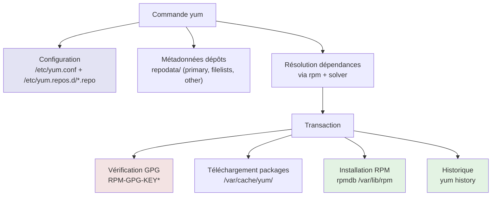
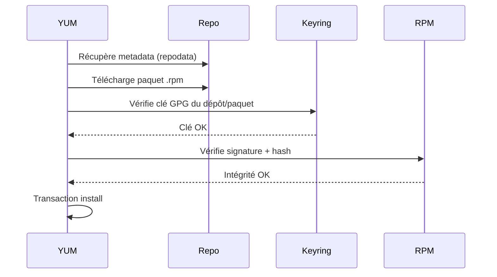

# YUM — Yellowdog Updater, Modified


<div
  class="omny-meta"
  data-level="🟡 Intermédiaire / 🔴 Avancé"
  data-version="1.0"
  data-time="35-45 minutes">
</div>

## Introduction au Gestionnaire pour Redhat (YUM RHEL)

!!! quote "Analogie pédagogique"
    *Imaginez un **entrepôt logistique**. Le format **RPM** est la **caisse** (le colis), et **YUM** est le **chef d’orchestre** qui choisit le bon colis, vérifie l’étiquette d’authenticité, calcule ce qu’il faut livrer en plus (dépendances), et planifie une livraison cohérente sans casser l’inventaire. C’est moins “bibliothèque” qu’APK/APT : ici, on gère une **supply chain** très industrielle.*

> **YUM (Yellowdog Updater, Modified)** est historiquement le gestionnaire de paquets des distributions **RPM-based** côté Red Hat : **RHEL 5/6/7**, **CentOS 5/6/7**, et diverses dérivées. YUM n’installe pas “magiquement” des logiciels : il orchestre l’installation de **paquets RPM**, en s’appuyant sur des **métadonnées de dépôts**, des **signatures GPG**, et un mécanisme de **transactions**.

Point crucial (et souvent mal compris) : sur **RHEL 8/9**, la commande `yum` existe encore, mais elle s’appuie sur la technologie **DNF** (YUM v4) pour compatibilité. En pratique, YUM “moderne” est un alias/compatibilité vers DNF sur ces versions. ([Red Hat Docs][1])
Ce chapitre commence donc par **YUM “classique”** (RHEL/CentOS 7) parce que c’est l’ancêtre “toujours d’actualité” en environnement legacy, et parce que ses concepts restent la base mentale utile pour DNF.

!!! info "Pourquoi c'est important ?"
    Comprendre YUM, c’est comprendre la logique RPM “enterprise” : dépôts, GPG, priorités, exclusions, historique, rollback partiel, packaging propre, et surtout la gestion des incidents (conflits, dépendances cassées, caches corrompus). C’est exactement ce que vous retrouvez ensuite avec DNF, mais modernisé.

---

## Philosophie côté Red Hat : stabilité et traçabilité

Sur RHEL/CentOS, la priorité n’est pas “la dernière version”, mais la **stabilité**, les **backports**, et la **traçabilité**. La conséquence directe : vous verrez souvent des versions “anciennes” mais patchées sécurité.

YUM reflète cette philosophie : il préfère une résolution cohérente et reproductible plutôt qu’un comportement “best effort” qui peut surprendre en production.

---

## Architecture YUM (RHEL/CentOS 7)



### Composants clés

**Configuration globale :**

* `/etc/yum.conf` : options globales, plugins, cache, exclusions.
* `/etc/yum.repos.d/*.repo` : dépôts (BaseOS, Updates, EPEL, vendor, etc.).

**Base de données RPM :**

* `/var/lib/rpm/` : base de données des paquets installés (ne pas “bricoler” à la main).

**Cache YUM :**

* `/var/cache/yum/` : métadonnées + RPM téléchargés (utile pour perf, mais cause classique de bugs si corrompu).

**Clés GPG :**

* souvent importées depuis `/etc/pki/rpm-gpg/` ou URL `gpgkey=` dans les `.repo`.

---

## Gestion des dépôts

### Format d’un dépôt `.repo`

```ini
# /etc/yum.repos.d/epel.repo
[epel]
name=Extra Packages for Enterprise Linux 7 - $basearch
baseurl=https://download.fedoraproject.org/pub/epel/7/$basearch/
enabled=1
gpgcheck=1
gpgkey=https://dl.fedoraproject.org/pub/epel/RPM-GPG-KEY-EPEL-7
```

Ce qui compte vraiment en production : `enabled`, `gpgcheck`, la cohérence `baseurl/mirrorlist`, et la gouvernance des dépôts tiers.

!!! danger "Dépôts tiers : risque supply-chain"
Chaque dépôt supplémentaire est une **autorité de distribution**. S’il est compromis, votre parc l’est potentiellement aussi. Limitez, auditez, et préférez des dépôts reconnus.

### Lister et diagnostiquer les dépôts

```bash
# Lister tous les dépôts et leur statut
yum repolist all

# Afficher le détail d’un dépôt
yum repoinfo epel

# Voir quelles sources sont réellement utilisées
yum -v repolist
```

---

## Commandes fondamentales

### Mise à jour des métadonnées et du système

```bash
# Reconstruire/actualiser le cache metadata (recommandé)
yum makecache

# Mettre à jour tout le système
yum update

# Mettre à jour un paquet spécifique
yum update openssl

# Voir ce qui serait mis à jour (sans exécuter)
yum check-update
```

En production, la logique est : d’abord visibilité (`check-update`), ensuite exécution (`update`), et ensuite validation (services, kernel, reboot planifié).

### Installer et supprimer

```bash
# Installer
yum install nginx

# Installer plusieurs paquets
yum install nginx curl ca-certificates

# Désinstaller
yum remove nginx

# Nettoyer les dépendances inutiles (selon cas, pas aussi “automatique” qu’APT)
yum autoremove
```

### Recherche et inspection

```bash
# Recherche par nom/description
yum search nginx

# Infos détaillées
yum info nginx

# Lister fichiers d’un paquet (installé ou dispo)
yum provides /usr/sbin/nginx
yum whatprovides /usr/sbin/nginx

# Dépendances (vue “RPM”)
yum deplist nginx
```

### Gestion des groupes (très utilisé côté RHEL)

```bash
# Lister groupes
yum grouplist

# Installer un groupe
yum groupinstall "Development Tools"

# Infos groupe
yum groupinfo "Development Tools"
```

---

## Historique, traçabilité, rollback partiel

YUM garde un historique transactionnel qui aide énormément en incident.

```bash
# Historique
yum history

# Détail d’une transaction
yum history info 42

# Annuler une transaction (quand possible)
yum history undo 42

# Revenir à un état précédent (rollback)
yum history rollback 40
```

Attention : `undo/rollback` ne sont pas une “machine à remonter le temps” parfaite. Si des dépôts ont changé, si des versions ne sont plus disponibles, ou si des dépendances ont évolué, ça peut échouer. En entreprise, on combine souvent ça avec des miroirs internes et des politiques de versions.

---

## Sécurité : signatures GPG et intégrité



Bon réflexe : ne jamais désactiver `gpgcheck` en prod “parce que ça marche pas”. Si ça casse, on corrige la gestion des clés, on n’éteint pas l’alarme.

---

## Bonnes pratiques production (RHEL/CentOS 7)

### 1) Contrôle de version et gel applicatif

Pour éviter des surprises, vous pouvez fixer une version (ou au minimum contrôler les mises à jour).

```bash
# Installer une version spécifique (si disponible dans les repos)
yum install nginx-1.20.1-10.el7

# Exclure un paquet des updates (dans yum.conf)
# exclude=nginx* kernel*
```

### 2) Approche “staging -> prod”

Même logique que votre monde DevSecOps : staging identique, rollout contrôlé, vérification, puis prod.

### 3) Dépôts internes / miroirs

Pour la reproductibilité, un miroir interne (ou un proxy cache) évite l’effet “le dépôt externe a changé”.

---

## Dépannage : les erreurs typiques et leur logique

### Cache corrompu / metadata incohérente

Symptômes : erreurs bizarres de résolution, paquets introuvables alors que le repo est OK.

```bash
# Nettoyage “safe”
yum clean all
rm -rf /var/cache/yum
yum makecache
```

### Conflits de dépendances

```bash
# Simuler et comprendre avant d’exécuter
yum update --assumeno

# Voir les versions candidates
yum list nginx --showduplicates
```

### Verrouillage RPM DB / transactions interrompues

YUM/RPM n’aiment pas les interruptions. En cas de crash, on diagnostique avant de supprimer des fichiers de lock au hasard.

```bash
# Vérifier cohérence RPM
rpm -Va

# Reconstruire la base RPM si corruption avérée (cas avancé)
rpm --rebuilddb
```

---

## Comparaison rapide : YUM “classique” vs DNF (pour préparer la suite)

| Axe              | YUM (RHEL/CentOS 7) | DNF (RHEL 8/9, Fedora)                             |
| ---------------- | ------------------- | -------------------------------------------------- |
| Génération       | Historique          | Successeur officiel                                |
| Performances     | Correctes           | Meilleures (solver, metadata)                      |
| API / modularité | Plugins historiques | libdnf, plugins modernisés                         |
| Commande `yum`   | Native              | Alias/compatibilité (RHEL 8/9) ([Red Hat Docs][1]) |

---

## Le mot de la fin

!!! quote
    YUM est la “grammaire” historique des systèmes RPM en entreprise. Même si DNF est la réalité moderne, YUM reste incontournable dès qu’on touche des environnements legacy (et surtout, dès qu’on doit comprendre des procédures, des runbooks, et des habitudes d’équipes ops qui datent de RHEL 6/7).

> Si vous maîtrisez réellement YUM, vous maîtrisez surtout : la chaîne de confiance (GPG), la gouvernance des dépôts, la logique de résolution, et les mécaniques de diagnostic. C’est exactement ce qui vous rend solide quand “ça casse” en prod, pas le fait de connaître trois commandes par cœur.


[^1]: Lien officiel : [Chapter 7. Software managementn](https://docs.redhat.com/en/documentation/red_hat_enterprise_linux/8/html/considerations_in_adopting_rhel_8/software-management_considerations-in-adopting-rhel-8?utm_source=chatgpt.com)
[^2]: Lien officiel : [Changes/SwitchToDnf5 - Fedora Project Wiki](https://fedoraproject.org/wiki/Changes/SwitchToDnf5?utm_source=chatgpt.com)
[^3]: Lien officiel : [9.0 Release Notes | Red Hat Enterprise Linux | 9](https://docs.redhat.com/en/documentation/red_hat_enterprise_linux/9/html-single/9.0_release_notes/index?utm_source=chatgpt.com)
