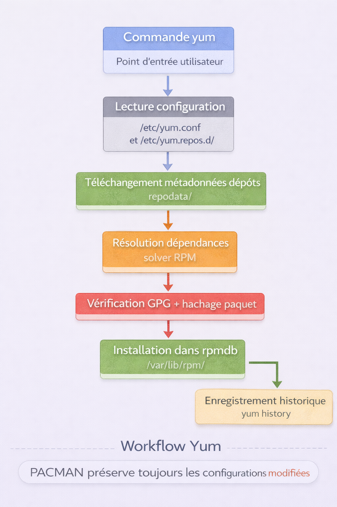
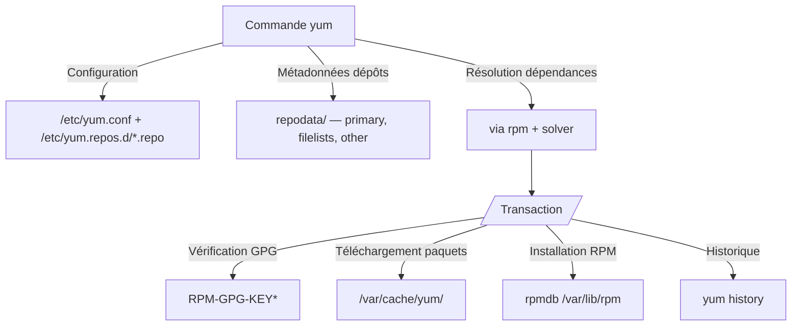
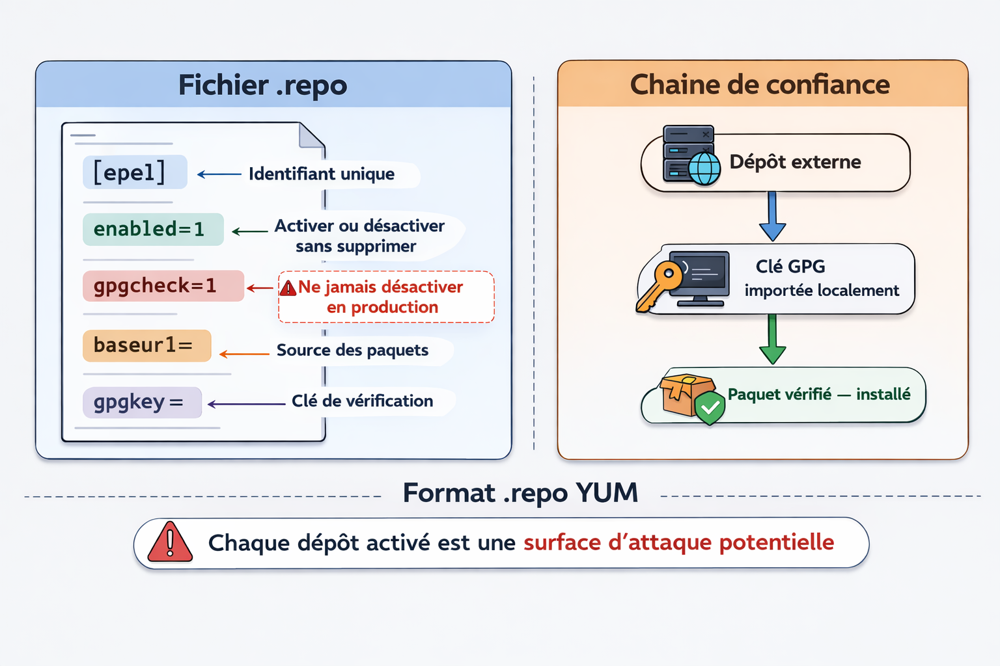
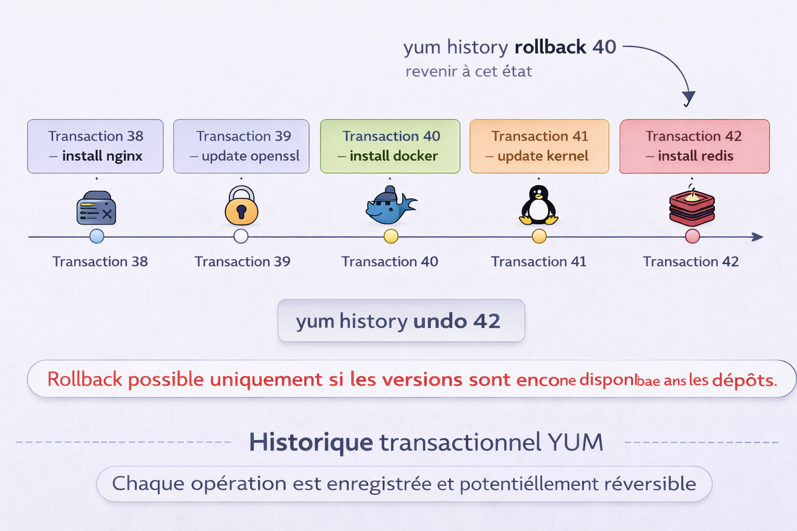
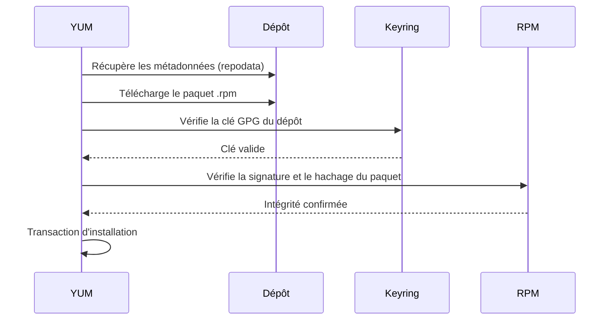
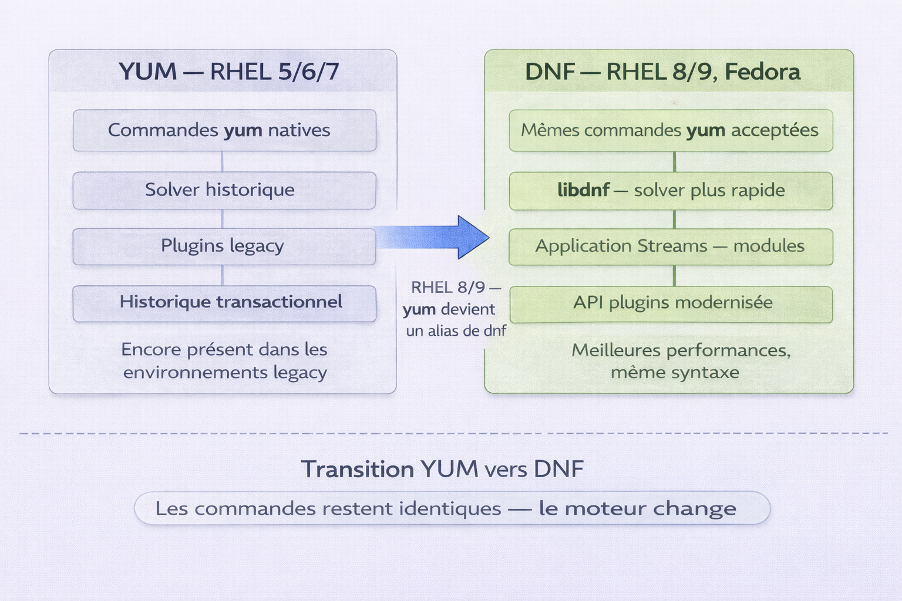

# YUM — Yellowdog Updater, Modified

<div
  class="omny-meta"
  data-level="🟡 Intermédiaire & 🔴 Avancé"
  data-version="1.0"
  data-time="35-45 minutes">
</div>

!!! quote "Analogie"
    _Un entrepôt logistique. Le format RPM est la caisse — le colis — et YUM est le chef d'orchestre qui choisit le bon colis, vérifie l'étiquette d'authenticité, calcule ce qu'il faut livrer en plus (dépendances) et planifie une livraison cohérente sans casser l'inventaire. Moins "bibliothèque" qu'APK ou APT : ici, on gère une supply chain très industrielle._

**YUM (Yellowdog Updater, Modified)** est historiquement le gestionnaire de paquets des distributions RPM-based côté Red Hat : **RHEL 5/6/7**, **CentOS 5/6/7** et leurs dérivées. YUM n'installe pas "magiquement" des logiciels — il orchestre l'installation de **paquets RPM** en s'appuyant sur des **métadonnées de dépôts**, des **signatures GPG** et un mécanisme de **transactions**.

Point crucial et souvent mal compris : sur RHEL 8 et 9, la commande `yum` existe encore mais elle s'appuie sur la technologie **DNF** (YUM v4) pour assurer la compatibilité. En pratique, YUM "moderne" est un alias vers DNF sur ces versions. Ce document couvre YUM "classique" (RHEL/CentOS 7) parce que c'est l'ancêtre toujours d'actualité en environnement legacy, et parce que ses concepts constituent la base mentale indispensable pour aborder DNF.

!!! info "Pourquoi c'est important"
    Comprendre YUM, c'est comprendre la logique RPM enterprise : dépôts, GPG, priorités, exclusions, historique, rollback partiel, packaging propre et gestion des incidents — conflits, dépendances cassées, caches corrompus. C'est exactement ce que l'on retrouve ensuite avec DNF, mais modernisé.

<br />

---

## Philosophie Red Hat — stabilité et traçabilité

Sur RHEL et CentOS, la priorité n'est pas la dernière version logicielle, mais la **stabilité**, les **backports** et la **traçabilité**. La conséquence directe : on voit souvent des versions apparemment anciennes, mais qui reçoivent des patches de sécurité backportés depuis les versions amont.

YUM reflète cette philosophie : il préfère une résolution cohérente et reproductible plutôt qu'un comportement "best effort" susceptible de surprendre en production. Cette approche est le premier point de différenciation avec Arch Linux ou même Ubuntu.

<br />

---

## Architecture YUM

!!! note "L'image ci-dessous représente la chaîne complète RPM orchestrée par YUM — de la configuration des dépôts jusqu'à l'écriture dans la base de données RPM. Comprendre ce flux permet de diagnostiquer précisément à quelle étape une erreur se produit."



<p><em>YUM commence par lire sa configuration et les fichiers .repo, télécharge les métadonnées des dépôts activés, résout les dépendances via son solver, vérifie les signatures GPG de chaque paquet, télécharge les RPM dans le cache local et les installe dans la base de données RPM. Chaque opération est enregistrée dans l'historique transactionnel — ce qui rend possible le rollback.</em></p>


```mermaid
flowchart TB
    U["Commande yum"]

    U -->|Configuration| C["/etc/yum.conf + /etc/yum.repos.d/*.repo"]
    U -->|Métadonnées dépôts| M["repodata/ — primary, filelists, other"]
    U -->|Résolution dépendances| R["via rpm + solver"]

    R --> T[/"Transaction"/]

    T -->|Vérification GPG| G["RPM-GPG-KEY*"]
    T -->|Téléchargement paquets| D["/var/cache/yum/"]
    T -->|Installation RPM| I["rpmdb /var/lib/rpm"]
    T -->|Historique| H["yum history"]
```

### Structure des fichiers système

```bash title="Bash — configuration YUM"
# /etc/yum.conf                 # Options globales — plugins, cache, exclusions
# /etc/yum.repos.d/*.repo       # Définition des dépôts (BaseOS, Updates, EPEL, vendor)
```

```bash title="Bash — base de données et cache"
# /var/lib/rpm/                 # Base de données des paquets installés
#                               # Ne jamais modifier à la main

# /var/cache/yum/               # Métadonnées + RPM téléchargés
#                               # Cache utile pour la performance
#                               # Cause classique de bugs si corrompu

# /etc/pki/rpm-gpg/             # Clés GPG importées localement
#                               # Ou spécifiées par gpgkey= dans les .repo
```

<br />

---

## Gestion des dépôts

!!! note "L'image ci-dessous illustre la structure d'un fichier .repo et la chaîne de confiance qu'il implique. En environnement enterprise, chaque dépôt activé est une surface d'attaque potentielle — comprendre les paramètres critiques d'un .repo est indispensable."



<p><em>Un fichier .repo définit l'identifiant du dépôt, son nom lisible, l'URL des paquets (baseurl) ou la liste de miroirs (mirrorlist), l'activation (enabled=1 ou 0), la vérification de signature GPG (gpgcheck=1 — ne jamais désactiver en production) et l'URL ou le chemin local de la clé GPG (gpgkey=). Chaque dépôt activé est une autorité de distribution — s'il est compromis, le parc l'est potentiellement aussi.</em></p>

### Format d'un fichier .repo

```ini title="INI — /etc/yum.repos.d/epel.repo — exemple EPEL 7"
[epel]
name=Extra Packages for Enterprise Linux 7 - $basearch
baseurl=https://download.fedoraproject.org/pub/epel/7/$basearch/
enabled=1
gpgcheck=1
gpgkey=https://dl.fedoraproject.org/pub/epel/RPM-GPG-KEY-EPEL-7
```

Les paramètres critiques en production sont `enabled`, `gpgcheck`, la cohérence de `baseurl` ou `mirrorlist`, et la gouvernance des dépôts tiers.

!!! danger "Dépôts tiers — risque supply chain"
    Chaque dépôt supplémentaire est une autorité de distribution. S'il est compromis, l'ensemble du parc l'est potentiellement. En environnement enterprise, limiter le nombre de dépôts tiers, les auditer régulièrement et préférer des sources reconnues (EPEL, SCL, dépôts éditeurs officiels).

### Diagnostiquer les dépôts

```bash title="Bash — lister et inspecter les dépôts"
# Lister tous les dépôts et leur statut (activé, désactivé)
yum repolist all

# Afficher le détail d'un dépôt spécifique
yum repoinfo epel

# Voir les sources réellement utilisées avec leur priorité
yum -v repolist
```

<br />

---

## Commandes fondamentales

### Mise à jour des métadonnées et du système

```bash title="Bash — mettre à jour les métadonnées et le système"
# Reconstruire et actualiser le cache des métadonnées
yum makecache

# Vérifier ce qui serait mis à jour sans exécuter
yum check-update

# Mettre à jour tout le système
yum update

# Mettre à jour un paquet spécifique
yum update openssl
```

En production, la logique est systématiquement : visibilité d'abord (`check-update`), exécution ensuite (`update`), puis validation — services, kernel, redémarrage planifié.

### Installation et suppression

```bash title="Bash — installer et supprimer des paquets"
# Installer un paquet
yum install nginx

# Installer plusieurs paquets
yum install nginx curl ca-certificates

# Installer une version spécifique si disponible dans les dépôts
yum install nginx-1.20.1-10.el7

# Désinstaller un paquet
yum remove nginx

# Supprimer les dépendances devenues inutiles
yum autoremove
```

### Recherche et inspection

```bash title="Bash — rechercher et inspecter des paquets"
# Rechercher par nom ou description
yum search nginx

# Informations détaillées sur un paquet
yum info nginx

# Trouver quel paquet fournit un fichier ou une commande
yum provides /usr/sbin/nginx
yum whatprovides /usr/sbin/nginx

# Afficher l'arbre de dépendances d'un paquet
yum deplist nginx

# Lister toutes les versions disponibles d'un paquet
yum list nginx --showduplicates
```

### Gestion des groupes

Les groupes de paquets sont très utilisés en environnement RHEL — ils permettent d'installer des ensembles logiciels cohérents en une seule commande.

```bash title="Bash — gérer les groupes de paquets"
# Lister les groupes disponibles
yum grouplist

# Informations sur un groupe
yum groupinfo "Development Tools"

# Installer un groupe complet
yum groupinstall "Development Tools"
```

<br />

---

## Historique, traçabilité et rollback

!!! note "L'image ci-dessous représente le mécanisme de rollback transactionnel de YUM. C'est l'une des fonctionnalités qui distinguent YUM des autres gestionnaires de paquets — et l'une des plus utiles en contexte d'incident production."



<p><em>YUM enregistre chaque transaction dans un historique numéroté — installation, mise à jour, suppression. La commande yum history affiche la liste chronologique. yum history info N détaille les paquets concernés par une transaction. yum history undo N tente d'annuler la transaction N. yum history rollback N tente de ramener le système à l'état qui précédait la transaction N. Ces commandes sont puissantes mais pas infaillibles — si les dépôts ont évolué ou si des versions ne sont plus disponibles, le rollback peut échouer.</em></p>

```bash title="Bash — consulter et exploiter l'historique YUM"
# Afficher l'historique des transactions
yum history

# Détail d'une transaction spécifique
yum history info 42

# Annuler une transaction (quand possible)
yum history undo 42

# Revenir à l'état précédant une transaction
yum history rollback 40
```

!!! warning "Limites du rollback YUM"
    `undo` et `rollback` ne sont pas une machine à remonter le temps parfaite. Si les dépôts ont changé, si des versions ne sont plus disponibles ou si des dépendances ont évolué entre-temps, la commande peut échouer. En environnement enterprise, cette fonctionnalité s'appuie sur des miroirs internes et des politiques de versions strictes pour être pleinement exploitable.

<br />

---

## Sécurité — signatures GPG et intégrité


```mermaid
sequenceDiagram
    participant Y as YUM
    participant R as Dépôt
    participant K as Keyring
    participant P as RPM

    Y->>R: Récupère les métadonnées (repodata)
    Y->>R: Télécharge le paquet .rpm
    Y->>K: Vérifie la clé GPG du dépôt
    K-->>Y: Clé valide
    Y->>P: Vérifie la signature et le hachage du paquet
    P-->>Y: Intégrité confirmée
    Y->>Y: Transaction d'installation
```

```bash title="Bash — gérer les clés GPG"
# Importer une clé GPG manuellement
rpm --import /etc/pki/rpm-gpg/RPM-GPG-KEY-redhat-release

# Lister les clés importées
rpm -qa gpg-pubkey*

# Vérifier la signature d'un RPM local
rpm --checksig paquet.rpm
```

!!! danger "Ne jamais désactiver gpgcheck en production"
    Si la vérification GPG échoue, la cause est à diagnostiquer — clé manquante, clé expirée, dépôt mal configuré. Désactiver `gpgcheck` pour "faire fonctionner" l'installation revient à éteindre l'alarme incendie plutôt qu'à éteindre le feu. Corriger la gestion des clés, pas le mécanisme de vérification.

<br />

---

## Bonnes pratiques production

### Contrôle des versions et gel applicatif

```bash title="Bash — contrôler les versions et geler des paquets"
# Installer une version spécifique si disponible dans les dépôts
yum install nginx-1.20.1-10.el7

# Simuler une mise à jour sans l'appliquer
yum update --assumeno

# Exclure des paquets des mises à jour dans /etc/yum.conf
# exclude=nginx* kernel*
```

### Stratégie staging vers production

La même logique que le DevSecOps s'applique à la gestion des paquets : un environnement de staging identique à la production, un rollout contrôlé, une vérification des services, puis la production. Ne jamais appliquer directement une mise à jour en production sans validation préalable.

### Miroirs internes et reproductibilité

Pour garantir la reproductibilité et l'indépendance vis-à-vis des dépôts externes, un miroir interne ou un proxy cache évite l'effet "le dépôt externe a changé entre la validation et le déploiement". C'est une pratique standard dans les environnements enterprise RHEL.

<br />

---

## Dépannage

### Cache corrompu ou métadonnées incohérentes

```bash title="Bash — nettoyer et reconstruire le cache"
# Symptômes : erreurs de résolution, paquets introuvables alors que le dépôt est accessible

# Nettoyage complet
yum clean all
rm -rf /var/cache/yum
yum makecache
```

### Conflits de dépendances

```bash title="Bash — diagnostiquer les conflits de dépendances"
# Simuler et analyser avant d'exécuter
yum update --assumeno

# Lister toutes les versions disponibles pour identifier les candidats
yum list nginx --showduplicates
```

### Base de données RPM corrompue

```bash title="Bash — réparer la base de données RPM"
# Vérifier la cohérence des paquets installés
rpm -Va

# Reconstruire la base de données RPM si corruption avérée
rpm --rebuilddb
```

!!! warning "Verrous et transactions interrompues"
    YUM et RPM ne tolèrent pas les interruptions en cours de transaction. En cas de crash, diagnostiquer avant de supprimer des fichiers de verrou arbitrairement. Utiliser `rpm -Va` pour évaluer l'état réel du système avant toute action corrective.

<br />

---

## Comparaison YUM vs DNF

!!! note "L'image ci-dessous synthétise la transition entre YUM classique et DNF. Comprendre cette ligne de continuité évite la confusion fréquente entre les deux outils — et explique pourquoi les commandes YUM continuent de fonctionner sur RHEL 8 et 9."



<p><em>Sur RHEL 8 et 9, la commande yum est un alias vers dnf — les deux sont interchangeables en surface. Sous le capot, DNF apporte un solver de dépendances plus rapide (libdnf), une meilleure gestion des modules (application streams), une API de plugins modernisée et de meilleures performances sur les métadonnées. Les commandes fondamentales restent identiques — la migration depuis YUM classique ne nécessite pas de réapprentissage complet.</em></p>

| Axe | YUM — RHEL/CentOS 7 | DNF — RHEL 8/9, Fedora |
|---|---|---|
| Génération | Historique | Successeur officiel |
| Performances | Correctes | Meilleures — solver et métadonnées optimisés |
| API et modularité | Plugins historiques | libdnf, plugins modernisés |
| Commande `yum` | Native | Alias de compatibilité vers dnf |
| Modules applicatifs | Non disponibles | Application Streams (RHEL 8+) |

<br />

---

## Conclusion

!!! quote "Ce qu'il faut retenir"
    La gestion des paquets via yum rhel est la porte d'entrée de toute administration système Linux. Comprendre ses mécanismes de résolution de dépendances et de dépôts garantit la stabilité et la sécurité de vos serveurs en production.

!!! quote "Conclusion"
    _YUM est la grammaire historique des systèmes RPM en environnement enterprise. Même si DNF est la réalité moderne, YUM reste incontournable dès qu'on intervient sur des environnements legacy — et surtout, dès qu'on doit comprendre des procédures, des runbooks et des habitudes d'équipes ops qui datent de RHEL 6 et 7. Maîtriser YUM, c'est maîtriser la chaîne de confiance GPG, la gouvernance des dépôts, la logique de résolution de dépendances et les mécaniques de diagnostic. C'est exactement ce qui rend solide quand ça casse en production — pas le fait de connaître trois commandes par cœur._

<br />