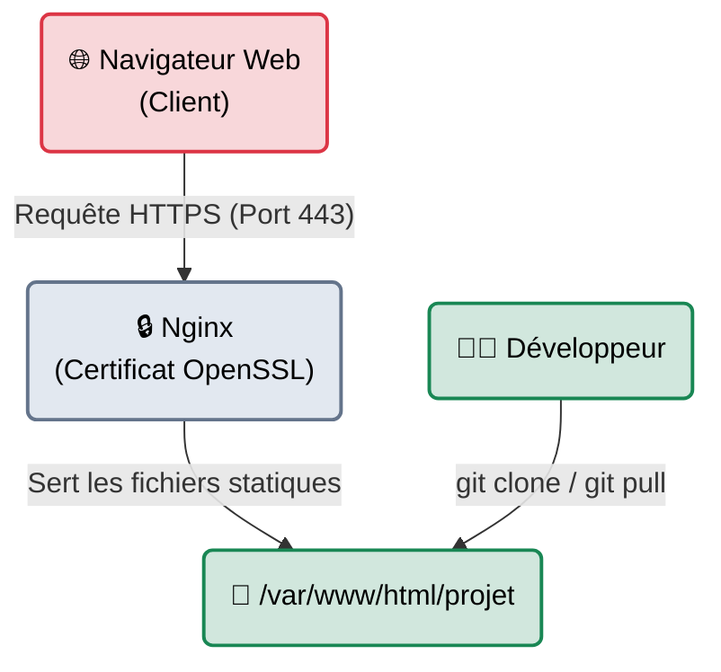

# 🔴 Le Projet Fil Rouge : Déploiement Sécurisé

<div
  class="omny-meta"
  data-level="🟢 Débutant → 🟡 Intermédiaire"
  data-version="1.0"
  data-time="~3 heures">
</div>


!!! quote "Analogie pédagogique"
    _Un projet fil rouge est comme la maquette d'un architecte. Au lieu d'apprendre à construire un mur d'un côté et un toit de l'autre sans jamais les assembler, vous bâtissez une maison complète de bout en bout, en comprenant comment chaque élément s'imbrique._

## Introduction

!!! quote "Objectif Pédagogique"
    Vous avez lu les chapitres sur Linux, Git, les protocoles réseaux et la cryptographie. Ce projet **Fil Rouge** sert de validation de fin de module pour la section **Bases & Fondamentaux IT**. Vous allez assembler toutes ces briques pour construire une infrastructure web minimale, fonctionnelle et sécurisée.

L'objectif de ce projet est de configurer un serveur Linux depuis zéro, d'y cloner un dépôt Git contenant une page web statique, de la servir via un serveur Nginx, et de chiffrer les échanges en HTTPS à l'aide d'OpenSSL. 

<br>

---

## 🏗️ Architecture du Projet



<br>

---

## 🛠️ Étape 1 : Préparation du Système (Linux & Outils)

Votre première tâche consiste à configurer l'environnement système.

1. **Environnement** : Démarrez une machine virtuelle Ubuntu Server ou un conteneur WSL.
2. **Gestion des paquets** : Mettez à jour les dépôts système et installez les outils nécessaires (`git`, `nginx`, `openssl`).
   ```bash
   sudo apt update && sudo apt upgrade -y
   sudo apt install nginx git openssl -y
   ```
3. **Droits et Permissions** : Créez un utilisateur nommé `deployer` avec des droits sudo restreints, et attribuez-lui la propriété du dossier `/var/www/html/`.

---

## 📁 Étape 2 : Versionning et Contenu (Git)

Au lieu de coder directement sur le serveur, nous simulons un flux de travail professionnel.

1. **Création locale** : Sur votre ordinateur, créez un dossier, initialisez un dépôt Git (`git init`), et créez un fichier `index.html` basique contenant un message de bienvenue.
2. **Commit** : Figez cette version (`git add .`, `git commit -m "Initial commit"`).
3. **Déploiement** : Transférez (clonez ou copiez) ce dépôt dans le dossier `/var/www/html/` du serveur.

---

## 🌐 Étape 3 : Réseaux et Serveur Web (Protocoles)

Le serveur Nginx est installé, mais il faut le configurer pour qu'il comprenne les requêtes HTTP(S).

1. **Configuration Nginx** : Créez un fichier de configuration dans `/etc/nginx/sites-available/projet` pour écouter sur le port 80.
2. **Modèle OSI** : Assurez-vous que le port 80 (Couche 4 Transport TCP, Couche 7 Application HTTP) est bien ouvert sur votre pare-feu local (UFW).
   ```bash
   sudo ufw allow 'Nginx HTTP'
   ```

---

## 🔐 Étape 4 : Cryptographie (OpenSSL & HTTPS)

C'est ici que l'on sécurise les communications. Nous allons générer un certificat auto-signé pour activer le HTTPS.

1. **Génération de la clé privée (RSA 2048 bits)** :
   ```bash
   openssl genrsa -out server.key 2048
   ```
2. **Génération du Certificat (X.509)** :
   ```bash
   openssl req -new -x509 -key server.key -out server.crt -days 365
   ```
3. **Configuration TLS** : Modifiez votre bloc Nginx pour écouter sur le port `443 ssl` et indiquez les chemins vers `server.crt` et `server.key`.
4. **Validation** : Accédez à `https://localhost` dans votre navigateur. Vous obtiendrez une alerte de sécurité (car le certificat est auto-signé et non reconnu par une autorité publique), ce qui valide que la cryptographie est bien en place !

<br>

---

## Conclusion

!!! quote "Ce qu'il faut retenir"
    Ce projet prouve que l'informatique n'est pas une série de disciplines isolées. Un développeur écrit le code (Git), un SysAdmin configure le serveur (Linux/Nginx), un ingénieur réseau ouvre les flux (TCP/80/443), et un expert en sécurité chiffre les échanges (OpenSSL). Vous venez de réaliser les 4 rôles simultanément.

> Vous possédez désormais le socle transversal fondamental. Il est temps de choisir votre spécialité. Si l'administration approfondie et l'automatisation vous intéressent, dirigez-vous vers la section **[Systèmes & Infra](../sys-reseau/index.md)**.
