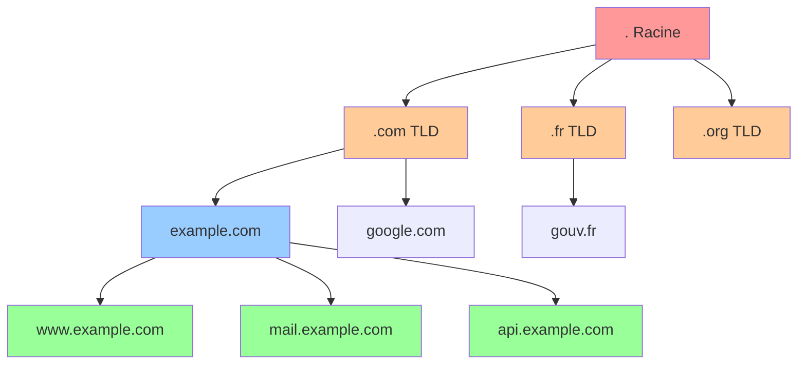
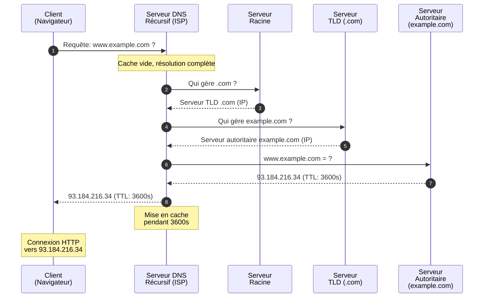
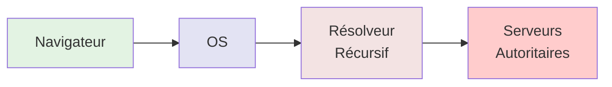
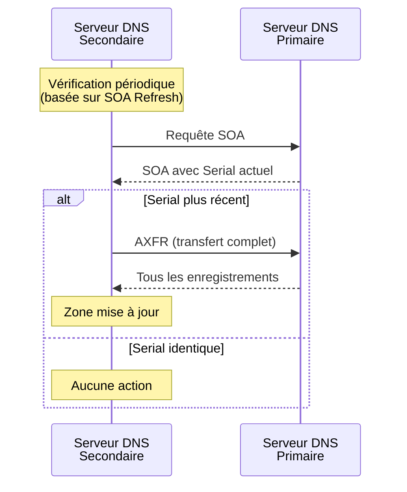
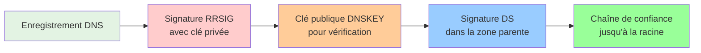

# DNS – Notions

## Introduction

<div
  class="omny-meta"
  data-level="🟢 Débutant"
  data-version="0"
  data-time="25-30 minutes">
</div>

!!! quote "Analogie pédagogique"
    _Imaginez un **annuaire téléphonique mondial** où au lieu de chercher un numéro de téléphone à partir d'un nom, vous cherchez une **adresse IP** à partir d'un **nom de domaine**. Plutôt que de mémoriser `142.250.179.78`, vous tapez simplement `google.com`. **Le DNS est cet annuaire intelligent et distribué qui traduit les noms compréhensibles par les humains en adresses IP utilisables par les machines.**_

> Le **Domain Name System (DNS)** est l'un des piliers fondamentaux d'Internet. Sans lui, naviguer sur le web nécessiterait de mémoriser des millions d'adresses IP numériques. Le DNS agit comme un **service de traduction automatique** entre les noms de domaine lisibles (`example.com`) et les adresses IP techniques (`93.184.216.34`).

Comprendre le DNS est essentiel pour tout professionnel IT car il impacte directement la **disponibilité**, les **performances** et la **sécurité** des infrastructures réseau. Une mauvaise configuration DNS peut rendre un site web inaccessible, tandis qu'une attaque DNS peut rediriger des millions d'utilisateurs vers des sites malveillants.

!!! info "Pourquoi c'est important ?"
    Le DNS intervient dans **presque toutes les communications Internet** : navigation web, emails, applications mobiles, APIs, services cloud. C'est souvent le **premier point de défaillance** en cas de panne et une **cible privilégiée** pour les attaques cybernétiques.

## Concepts fondamentaux

### Qu'est-ce que le DNS ?

Le **DNS (Domain Name System)** est un **système de nommage hiérarchique et distribué** qui assure la correspondance entre :

- **Noms de domaine** : `www.example.com` (lisible par l'humain)
- **Adresses IP** : `93.184.216.34` (utilisable par les machines)

**Caractéristiques principales :**

- **Distribué** : Aucun serveur unique ne contient toutes les informations
- **Hiérarchique** : Organisation en arborescence (racine → TLD → domaine → sous-domaine)
- **Caché** : Les résultats sont mis en cache pour améliorer les performances
- **Résilient** : Redondance et réplication pour garantir la disponibilité

### Pourquoi le DNS existe-t-il ?

!!! info "Sans le DNS, il faudrait"

    - Mémoriser l'adresse IP de chaque site web visité
    - Mettre à jour manuellement cette information en cas de changement de serveur
    - Gérer manuellement les changements d'infrastructure

!!! example "Exemple concret"

    ```plaintext
    Sans DNS :
      Vous tapez : http://142.250.179.78
      Problème : Impossible à mémoriser, change régulièrement

    Avec DNS :
      Vous tapez : http://google.com
      Le DNS traduit automatiquement vers l'IP actuelle
    ```

## Hiérarchie DNS

Le DNS fonctionne selon une **structure arborescente** à plusieurs niveaux.



_Ce diagramme illustre la hiérarchie DNS depuis la racine jusqu'aux sous-domaines._

### Les différents niveaux

=== "1. Racine DNS (Root)"

    - Représentée par un point : `.`
    - **13 serveurs racines** dans le monde (a.root-servers.net à m.root-servers.net)
    - Gérés par différentes organisations (ICANN, universités, entreprises)
    - Répliqués via **Anycast** pour des centaines d'instances physiques

    **Serveurs racines** : _Il n'existe pas "13 serveurs physiques" mais **13 adresses IP** derrière lesquelles se cachent **des centaines de serveurs répliqués** dans le monde entier pour assurer performances et résilience._

=== "2. TLD (Top-Level Domain)"

    Les **domaines de premier niveau** se divisent en plusieurs catégories :

    **TLD génériques (gTLD) :**
    
    <div class="grid cards" markdown>
  
    - `.com` - Commercial
    - `.org` - Organisation
    - `.net` - Network
    - `.edu` - Éducation
    - `.gov` - Gouvernement US
    - `.info`, `.biz`, `.name`, etc.

    </div>

    **TLD nationaux (ccTLD) :**
    
    <div class="grid cards" markdown>

    - `.fr` - France
    - `.de` - Allemagne
    - `.uk` - Royaume-Uni
    - `.jp` - Japon
    - `.ca` - Canada

    </div>

    **Nouveaux gTLD :**

    <div class="grid cards" markdown>

    - `.tech`, `.app`, `.dev`, `.cloud`, `.security`, etc.

    </div>

=== "3. Domaine de second niveau (SLD)"

    C'est le **nom que vous enregistrez** auprès d'un registrar :

    - `example` dans `example.com`
    - `google` dans `google.com`
    - `wikipedia` dans `wikipedia.org`

=== "4. Sous-domaines"

    Créés librement par le propriétaire du domaine :

    - `www.example.com`
    - `mail.example.com`
    - `api.example.com`
    - `staging.api.example.com` (sous-sous-domaine)

## Processus de résolution DNS

La résolution DNS est le processus de traduction d'un nom de domaine en adresse IP.

### Résolution récursive complète



_Ce diagramme montre les **8 étapes** d'une résolution DNS complète quand aucun cache n'est disponible._

### Étapes détaillées

!!! info "1. Requête initiale du client"

Le navigateur vérifie d'abord son **cache local** :

```plaintext
Cache navigateur → Cache OS → Requête DNS récursive
```

!!! info "2. Serveur DNS récursif"

Fourni généralement par votre **FAI** ou un service tiers (Google DNS, Cloudflare DNS) :

- **8.8.8.8** - Google Public DNS
- **1.1.1.1** - Cloudflare DNS
- **9.9.9.9** - Quad9 DNS

!!! info "3. Interrogation des serveurs racines"

Si le cache est vide, le serveur récursif interroge un serveur racine qui répond :

```plaintext
"Je ne connais pas example.com, mais voici les serveurs qui gèrent .com"
```

!!! info "4. Interrogation du serveur TLD"

Le serveur récursif interroge maintenant le serveur `.com` :

```plaintext
"Je ne connais pas www.example.com, mais voici les serveurs autoritaires pour example.com"
```

!!! info "5. Interrogation du serveur autoritaire"

Le serveur récursif interroge le serveur autoritaire d'`example.com` :

```plaintext
"www.example.com = 93.184.216.34 (TTL: 3600 secondes)"
```

!!! info "6. Réponse et mise en cache"

Le serveur récursif renvoie la réponse au client et **stocke le résultat en cache** pendant la durée spécifiée par le TTL.

!!! info "7. Connexion au serveur web"

Le client peut maintenant établir une connexion TCP vers `93.184.216.34` sur le port 80 (HTTP) ou 443 (HTTPS).

### Types de résolution

#### Résolution récursive

Le serveur DNS prend en charge **toute la résolution** et renvoie une réponse finale.

```plaintext
Client → Serveur récursif → [Root → TLD → Autoritaire] → Serveur récursif → Client
```

!!! tip "Avantages"

    - Simple pour le client
    - Mise en cache centralisée
    - Réduit la charge sur les serveurs autoritaires

#### Résolution itérative

Le serveur DNS renvoie la **meilleure réponse qu'il possède** ou une référence au prochain serveur à interroger.

```plaintext
Client → Racine : "Demande à .com"
Client → TLD .com : "Demande à example.com"
Client → Autoritaire example.com : "Voici l'IP"
```

!!! tip "Avantages"

    - Moins de charge sur un serveur unique
    - Plus de contrôle pour le client

## Types d'enregistrements DNS

Les serveurs DNS stockent différents **types d'enregistrements** dans des **zones DNS**.

### Enregistrements principaux

=== "A (Address)"

    Associe un **nom de domaine à une adresse IPv4**.

    ```dns
    example.com.        3600    IN    A    93.184.216.34
    www.example.com.    3600    IN    A    93.184.216.34
    ```

    **Format :**

    ```plaintext
    <nom>    <TTL>    <classe>    <type>    <adresse IPv4>
    ```

=== "AAAA (IPv6 Address)"

    Associe un **nom de domaine à une adresse IPv6**.

    ```dns
    example.com.    3600    IN    AAAA    2606:2800:220:1:248:1893:25c8:1946
    ```

**CNAME (Canonical Name)**

Crée un **alias** vers un autre nom de domaine.

```dns
www.example.com.    3600    IN    CNAME    example.com.
blog.example.com.   3600    IN    CNAME    example.com.
```

!!! warning "Limitation CNAME"
    Un enregistrement CNAME **ne peut pas coexister** avec d'autres enregistrements pour le même nom (sauf DNSSEC). Il ne peut **jamais pointer vers un domaine racine** (apex).

=== "MX (Mail Exchange)"

    Indique les **serveurs de messagerie** pour un domaine.

    ```dns
    example.com.    3600    IN    MX    10 mail1.example.com.
    example.com.    3600    IN    MX    20 mail2.example.com.
    ```

    **Le nombre (10, 20) indique la priorité** : plus bas = prioritaire.

=== "TXT (Text)"

    Stocke du **texte arbitraire**, souvent utilisé pour :

    - **Vérification de propriété** (Google Search Console, Microsoft)
    - **SPF** (Sender Policy Framework) - lutte anti-spam
    - **DKIM** (DomainKeys Identified Mail) - signature d'emails
    - **DMARC** (Domain-based Message Authentication) - politique d'authentification

    ```dns
    example.com.    3600    IN    TXT    "v=spf1 include:_spf.google.com ~all"
    example.com.    3600    IN    TXT    "google-site-verification=abcd1234"
    ```

=== "NS (Name Server)"

    Indique les **serveurs DNS autoritaires** pour une zone.

    ```dns
    example.com.    3600    IN    NS    ns1.example.com.
    example.com.    3600    IN    NS    ns2.example.com.
    ```

=== "SOA (Start of Authority)"

    Contient les **informations administratives** de la zone DNS.

    ```dns
    example.com.    3600    IN    SOA    ns1.example.com. admin.example.com. (
                                        2024011801  ; Serial
                                        7200        ; Refresh
                                        3600        ; Retry
                                        1209600     ; Expire
                                        3600 )      ; Minimum TTL
    ```

    **Champs SOA :**

    - **MNAME** : Serveur DNS principal
    - **RNAME** : Email de l'administrateur (@ remplacé par .)
    - **Serial** : Numéro de version (format recommandé : YYYYMMDDNN)
    - **Refresh** : Intervalle de vérification pour les secondaires (secondes)
    - **Retry** : Délai avant nouvelle tentative en cas d'échec (secondes)
    - **Expire** : Durée de validité si le primaire est injoignable (secondes)
    - **Minimum TTL** : TTL par défaut pour les enregistrements négatifs

=== "PTR (Pointer)"

    Utilisé pour la **résolution inverse** (IP → nom de domaine).

    ```dns
    34.216.184.93.in-addr.arpa.    3600    IN    PTR    example.com.
    ```

    Principalement utilisé pour :

    - Vérification des serveurs de messagerie
    - Logs et diagnostics réseau
    - Détection de spam

### Enregistrements spécialisés

=== "SRV (Service)"

    Définit l'emplacement de **services spécifiques**.

    ```dns
    _http._tcp.example.com.    3600    IN    SRV    10 60 80 server.example.com.
    ```

    **Format :**

    ```plaintext
    _service._protocole.domaine    TTL    IN    SRV    priorité poids port cible
    ```

    **Utilisations courantes :**

    - Services Microsoft (Active Directory, Exchange)
    - VoIP (SIP)
    - XMPP (messagerie instantanée)

=== "CAA (Certification Authority Authorization)"

    Spécifie quelles **autorités de certification** peuvent émettre des certificats SSL/TLS.

    ```dns
    example.com.    3600    IN    CAA    0 issue "letsencrypt.org"
    example.com.    3600    IN    CAA    0 issuewild ";"
    ```

    **Flags :**

    - `0 issue` : Autorité autorisée pour les certificats standard
    - `0 issuewild` : Autorité autorisée pour les certificats wildcard
    - `0 iodef` : URL pour signaler les violations

## Cache DNS et TTL

### Concept de cache

Le **cache DNS** évite d'interroger constamment les serveurs autoritaires en stockant temporairement les résultats.

**Niveaux de cache :**



### TTL (Time To Live)

Le **TTL** détermine la **durée pendant laquelle un enregistrement peut être mis en cache**.

```dns
example.com.    3600    IN    A    93.184.216.34
                ^^^^
                TTL en secondes (1 heure)
```

**Valeurs typiques :**

| Durée | Secondes | Usage |
|-------|----------|-------|
| 5 minutes | 300 | Services nécessitant une mise à jour rapide |
| 1 heure | 3600 | Configuration standard |
| 24 heures | 86400 | Enregistrements très stables |
| 1 semaine | 604800 | Enregistrements rarement modifiés |

!!! tip "Stratégie de TTL"
    **Avant une modification importante** (migration de serveur) :
    
    1. Réduisez le TTL à 300 secondes **24-48h avant**
    2. Effectuez la modification
    3. Vérifiez que tout fonctionne
    4. Augmentez progressivement le TTL à sa valeur normale

### Propagation DNS

Le **délai de propagation DNS** dépend du TTL et des caches intermédiaires.

```plaintext
Modification DNS → Attente du TTL expiré → Nouvelle valeur récupérée
```

**Facteurs influençant la propagation :**

- TTL configuré sur l'ancien enregistrement
- Caches des ISP et résolveurs publics
- Caches des applications et navigateurs
- Horloges désynchronisées

!!! note "Délai typique : 24-48 heures pour une propagation mondiale complète (avec TTL standard)."

## Zones DNS

Une **zone DNS** est une **portion de l'espace de noms DNS** gérée par une entité spécifique.

### Fichier de zone

??? example "Exemple de fichier de zone pour `example.com`"

    ```dns
    ; Zone file for example.com
    $ORIGIN example.com.
    $TTL 3600

    ; SOA Record
    @    IN    SOA    ns1.example.com. admin.example.com. (
                      2024011801  ; Serial
                      7200        ; Refresh
                      3600        ; Retry
                      1209600     ; Expire
                      3600 )      ; Minimum TTL

    ; Name Servers
    @    IN    NS     ns1.example.com.
    @    IN    NS     ns2.example.com.

    ; A Records (IPv4)
    @              IN    A      93.184.216.34
    www            IN    A      93.184.216.34
    mail           IN    A      93.184.216.50
    ns1            IN    A      93.184.216.1
    ns2            IN    A      93.184.216.2

    ; AAAA Records (IPv6)
    @              IN    AAAA   2606:2800:220:1:248:1893:25c8:1946

    ; MX Records
    @              IN    MX     10 mail.example.com.
    @              IN    MX     20 mail2.example.com.

    ; CNAME Records
    blog           IN    CNAME  example.com.
    ftp            IN    CNAME  example.com.

    ; TXT Records
    @              IN    TXT    "v=spf1 include:_spf.google.com ~all"
    @              IN    TXT    "google-site-verification=abc123"

    ; CAA Records
    @              IN    CAA    0 issue "letsencrypt.org"
    ```

    **Éléments clés :**

    - `$ORIGIN` : Domaine de base
    - `$TTL` : TTL par défaut
    - `@` : Représente `$ORIGIN` (le domaine lui-même)

### Transfert de zone

Les **serveurs DNS secondaires** se synchronisent avec le primaire via **AXFR** (transfert complet) ou **IXFR** (transfert incrémental).



!!! danger "Sécurité des transferts de zone"
    Les transferts de zone **révèlent tous les enregistrements** d'un domaine.  
    Ils doivent être **restreints aux serveurs autorisés** via TSIG ou ACL.

## Serveurs DNS publics

### Principaux fournisseurs

| Fournisseur | IPv4 | IPv6 | Caractéristiques |
|-------------|------|------|------------------|
| **Google Public DNS** | 8.8.8.8<br/>8.8.4.4 | 2001:4860:4860::8888<br/>2001:4860:4860::8844 | Performance, aucun filtrage |
| **Cloudflare DNS** | 1.1.1.1<br/>1.0.0.1 | 2606:4700:4700::1111<br/>2606:4700:4700::1001 | Confidentialité, rapide |
| **Quad9** | 9.9.9.9<br/>149.112.112.112 | 2620:fe::fe<br/>2620:fe::9 | Sécurité (blocage malware) |
| **OpenDNS** | 208.67.222.222<br/>208.67.220.220 | 2620:119:35::35<br/>2620:119:53::53 | Filtrage parental |

### Configuration sur différents OS

=== ":fontawesome-brands-linux: Linux"

    **Modification temporaire (NetworkManager) :**
    
    ```bash
    # Éditer la connexion réseau
    nmcli connection modify "Connexion Ethernet" ipv4.dns "1.1.1.1 8.8.8.8"
    
    # Appliquer les changements
    nmcli connection down "Connexion Ethernet"
    nmcli connection up "Connexion Ethernet"
    
    # Vérifier
    nmcli device show | grep DNS
    ```
    
    **Modification persistante (resolv.conf) :**
    
    ```bash
    # Éditer le fichier de configuration
    sudo nano /etc/resolv.conf
    
    # Ajouter les serveurs DNS
    nameserver 1.1.1.1
    nameserver 8.8.8.8
    
    # Rendre le fichier immuable (empêche modification automatique)
    sudo chattr +i /etc/resolv.conf
    ```

=== ":fontawesome-brands-windows: Windows"

    **PowerShell (administrateur) :**
    
    ```powershell
    # Lister les interfaces réseau
    Get-NetAdapter
    
    # Configurer DNS pour une interface
    Set-DnsClientServerAddress -InterfaceAlias "Ethernet" -ServerAddresses ("1.1.1.1","8.8.8.8")
    
    # Vérifier
    Get-DnsClientServerAddress
    
    # Vider le cache DNS
    Clear-DnsClientCache
    ```
    
    **Interface graphique :**
    
    1. Panneau de configuration → Réseau et Internet
    2. Centre Réseau et partage → Modifier les paramètres de la carte
    3. Clic droit sur la connexion → Propriétés
    4. IPv4 → Propriétés → Utiliser les adresses DNS suivantes

=== ":fontawesome-brands-apple: macOS"

    **Terminal :**
    
    ```bash
    # Configurer DNS
    networksetup -setdnsservers Wi-Fi 1.1.1.1 8.8.8.8
    
    # Vérifier
    networksetup -getdnsservers Wi-Fi
    
    # Vider le cache DNS
    sudo dscacheutil -flushcache
    sudo killall -HUP mDNSResponder
    ```
    
    **Interface graphique :**
    
    1. Préférences Système → Réseau
    2. Sélectionner la connexion → Avancé
    3. DNS → Ajouter les serveurs avec le bouton +

## Commandes DNS essentielles

<div class="grid cards" markdown>

  - :lucide-terminal: **[dig](../outils/network/dig.md)** - Outil DNS avancé pour Unix/Linux
  - :lucide-terminal: **[nslookup](../outils/network/nslookup.md)** - Requêtes DNS multi-plateformes
  - :lucide-terminal: **[host](../outils/network/host.md)** - Vérifications DNS rapides
  - :lucide-terminal: **[ping](../outils/network/ping.md)** - Test de connectivité réseau

</div>
_Chaque commande dispose d'une fiche détaillée dans la section Outils_

## Sécurité DNS

### Vulnérabilités courantes

=== "1. DNS Spoofing / Cache Poisoning"

    **Attaque :** Injection de **fausses réponses DNS** dans le cache pour rediriger les utilisateurs.

    ```mermaid
    sequenceDiagram
        participant Client
        participant Cache
        participant Attaquant
        participant Legitime as Serveur<br/>Légitime
        
        Client->>Cache: bank.com ?
        Cache->>Legitime: bank.com ?
        
        Attaquant->>Cache: Fausse réponse:<br/>bank.com = IP_malveillante
        Note over Attaquant: Arrive avant la vraie réponse
        
        Legitime-->>Cache: Réponse légitime (ignorée)
        Cache-->>Client: IP_malveillante
        
        Note over Client: Connecté au site<br/>de l'attaquant
    ```

    **Protections :**

    - **DNSSEC** (voir ci-dessous)
    - **Randomisation des ports sources** (port >1024 aléatoire)
    - **Randomisation des IDs de transaction**
    - **0x20 encoding** (randomisation de la casse)

=== "2. DNS Tunneling"

    **Attaque :** Exfiltration de données via des **requêtes DNS encodées**.

    ```plaintext
    Données à exfiltrer : "password123"

    Requêtes DNS générées :
    70617373.attacker.com
    776f7264.attacker.com
    313233.attacker.com

    Serveur DNS de l'attaquant décode les sous-domaines
    ```

    **Détection :**

    - Analyse des longueurs de sous-domaines (anormalement longues)
    - Fréquence élevée de requêtes vers un même domaine
    - Entropie élevée des noms de domaine

=== "3. DDoS par amplification DNS"

    **Attaque :** Utilisation de serveurs DNS ouverts pour **amplifier le trafic** vers une cible.

    ```plaintext
    Attaquant envoie : 60 octets (requête ANY vers un gros domaine)
    Serveur DNS répond : 3000 octets
    Facteur d'amplification : 50x

    IP source spoofée = IP de la victime
    → La victime reçoit 50x le trafic généré
    ```

    **Protections :**

    - **Désactivation des requêtes récursives** pour les serveurs autoritaires
    - **Rate limiting** (limitation du nombre de requêtes)
    - **Response Rate Limiting (RRL)**
    - **Filtrage des requêtes ANY**

### DNSSEC (DNS Security Extensions)

**DNSSEC** ajoute des **signatures cryptographiques** aux enregistrements DNS pour garantir leur **authenticité et intégrité**.

#### Principe de fonctionnement



#### Enregistrements DNSSEC

**DNSKEY** : Contient les clés publiques

```dns
example.com.    3600    IN    DNSKEY    257 3 13 mdsswUyr3DPW132mOi8V9xESWE8jTo0dxCjjnopX+cQ=
```

**RRSIG** : Signature cryptographique d'un enregistrement

```dns
example.com.    3600    IN    RRSIG    A 13 2 3600 20240201000000 20240101000000 12345 example.com. signature_base64
```

**DS** : Empreinte de la clé publiée dans la zone parente

```dns
example.com.    3600    IN    DS    12345 13 2 49FD46E6C4B45C55D4AC69CBD3CD34AC1AFE51DE
```

**NSEC/NSEC3** : Preuve de non-existence d'un enregistrement

```dns
example.com.    3600    IN    NSEC    www.example.com. A NS SOA MX TXT RRSIG NSEC DNSKEY
```

#### Vérification DNSSEC

```bash
# Vérifier si DNSSEC est activé
dig +dnssec example.com

# Valider la chaîne de confiance
dig +sigchase +trusted-key=/etc/trusted-key.key example.com

# Vérifier le statut DNSSEC
delv example.com
```

**Sortie avec DNSSEC activé :**

```plaintext
;; flags: qr rd ra ad; QUERY: 1, ANSWER: 2
             ^^
             ad = Authenticated Data
```

### DNS over HTTPS (DoH) et DNS over TLS (DoT)

Ces protocoles **chiffrent les requêtes DNS** pour éviter l'espionnage et la manipulation.

#### DoH (DNS over HTTPS)

**Port 443** - Requêtes DNS encapsulées dans HTTPS

```bash
# Utilisation avec curl
curl -H 'accept: application/dns-json' \
  'https://1.1.1.1/dns-query?name=example.com&type=A'
```

**Configuration Firefox :**

1. `about:config`
2. `network.trr.mode = 2`
3. `network.trr.uri = https://1.1.1.1/dns-query`

#### DoT (DNS over TLS)

**Port 853** - Connexion TLS dédiée aux requêtes DNS

```bash
# Test avec kdig
kdig -d @1.1.1.1 +tls example.com
```

**Comparaison DoH vs DoT :**

| Critère | DoH | DoT |
|---------|-----|-----|
| **Port** | 443 (HTTPS) | 853 (dédié) |
| **Détection** | Difficile (mélangé avec HTTPS) | Facile (port spécifique) |
| **Performance** | Légère surcharge HTTP | Plus efficace |
| **Blocage** | Difficile | Possible par pare-feu |

### Bonnes pratiques de sécurité

!!! tip "Sécurisation DNS"
    **Pour les serveurs DNS :**
    
    - ✅ Activer **DNSSEC** sur vos domaines
    - ✅ Désactiver la **récursion** sur les serveurs autoritaires
    - ✅ Restreindre les **transferts de zone** (TSIG/ACL)
    - ✅ Implémenter **Response Rate Limiting (RRL)**
    - ✅ Séparer les **serveurs récursifs** et **autoritaires**
    - ✅ Activer les **logs détaillés** et monitorer les anomalies
    
    **Pour les clients :**
    
    - ✅ Utiliser **DoH** ou **DoT** pour chiffrer les requêtes
    - ✅ Valider **DNSSEC** quand disponible
    - ✅ Utiliser des **serveurs DNS fiables** (pas ceux par défaut des ISP)
    - ✅ Vérifier les **certificats SSL** dans les navigateurs

## Récapitulatif

### Points clés à retenir

!!! quote "L'essentiel du DNS"
    - Le DNS traduit les **noms de domaine en adresses IP** via un système hiérarchique
    - La résolution DNS implique plusieurs serveurs : **récursif**, **racine**, **TLD**, **autoritaire**
    - Les enregistrements DNS principaux : **A** (IPv4), **AAAA** (IPv6), **MX** (mail), **CNAME** (alias), **TXT** (texte)
    - Le **TTL** contrôle la durée de mise en cache
    - Le **cache DNS** améliore les performances mais retarde la propagation des modifications
    - **DNSSEC**, **DoH** et **DoT** renforcent la sécurité DNS
    - Le DNS est une cible privilégiée pour les attaques : **spoofing**, **amplification**, **tunneling**

### Tableau récapitulatif des enregistrements

| Type | Description | Exemple |
|------|-------------|---------|
| **A** | IPv4 | `example.com IN A 93.184.216.34` |
| **AAAA** | IPv6 | `example.com IN AAAA 2606:2800:220:1::1` |
| **CNAME** | Alias | `www IN CNAME example.com` |
| **MX** | Serveur mail | `example.com IN MX 10 mail.example.com` |
| **TXT** | Texte arbitraire | `example.com IN TXT "v=spf1..."` |
| **NS** | Serveur DNS | `example.com IN NS ns1.example.com` |
| **SOA** | Autorité de zone | `example.com IN SOA ns1...` |
| **PTR** | Résolution inverse | `34.216.184.93.in-addr.arpa IN PTR...` |
| **CAA** | Autorité certification | `example.com IN CAA 0 issue "..."` |

## Pour aller plus loin

!!! tip "Ressources complémentaires"
    - **RFC 1034/1035** : Standards DNS originaux
    - **RFC 4033-4035** : Spécifications DNSSEC
    - **RFC 8484** : DNS over HTTPS (DoH)
    - **RFC 7858** : DNS over TLS (DoT)
    
    **Outils d'apprentissage :**
    
    - [DNSdumpster](https://dnsdumpster.com/) - Exploration DNS
    - [MXToolbox](https://mxtoolbox.com/) - Diagnostic DNS complet
    - [What's My DNS](https://www.whatsmydns.net/) - Vérification propagation mondiale
    - [DNSSEC Analyzer](https://dnssec-analyzer.verisignlabs.com/) - Validation DNSSEC
