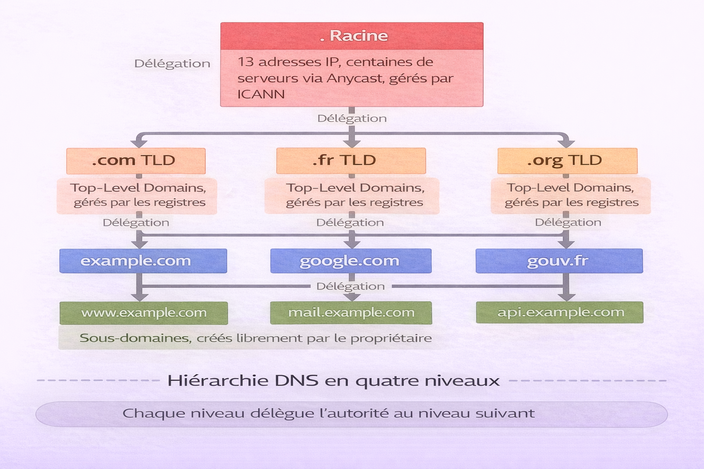
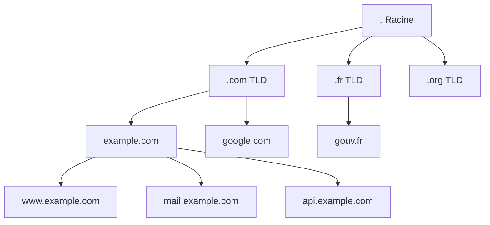
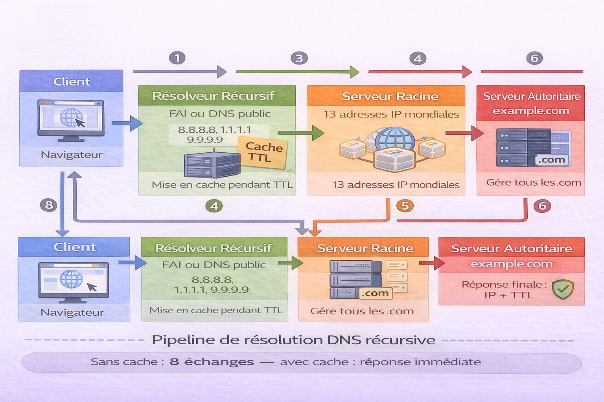
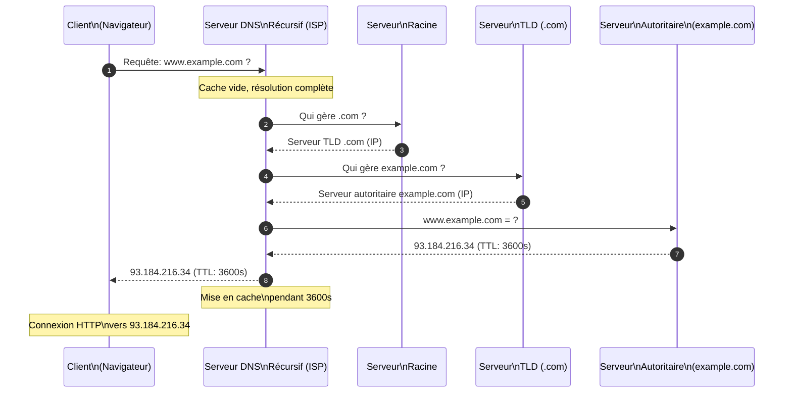
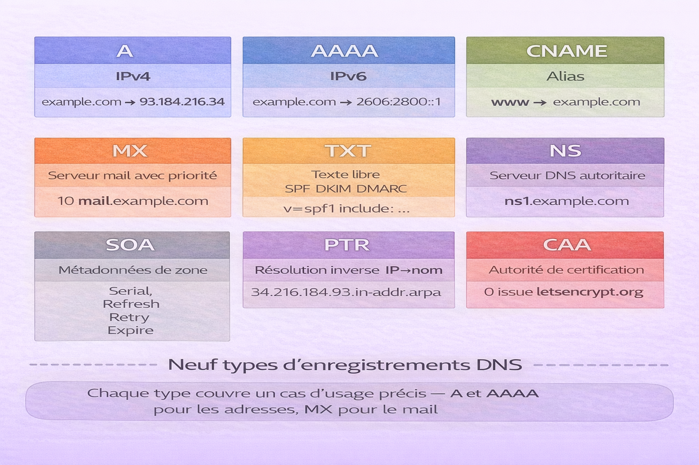
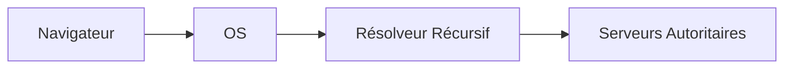
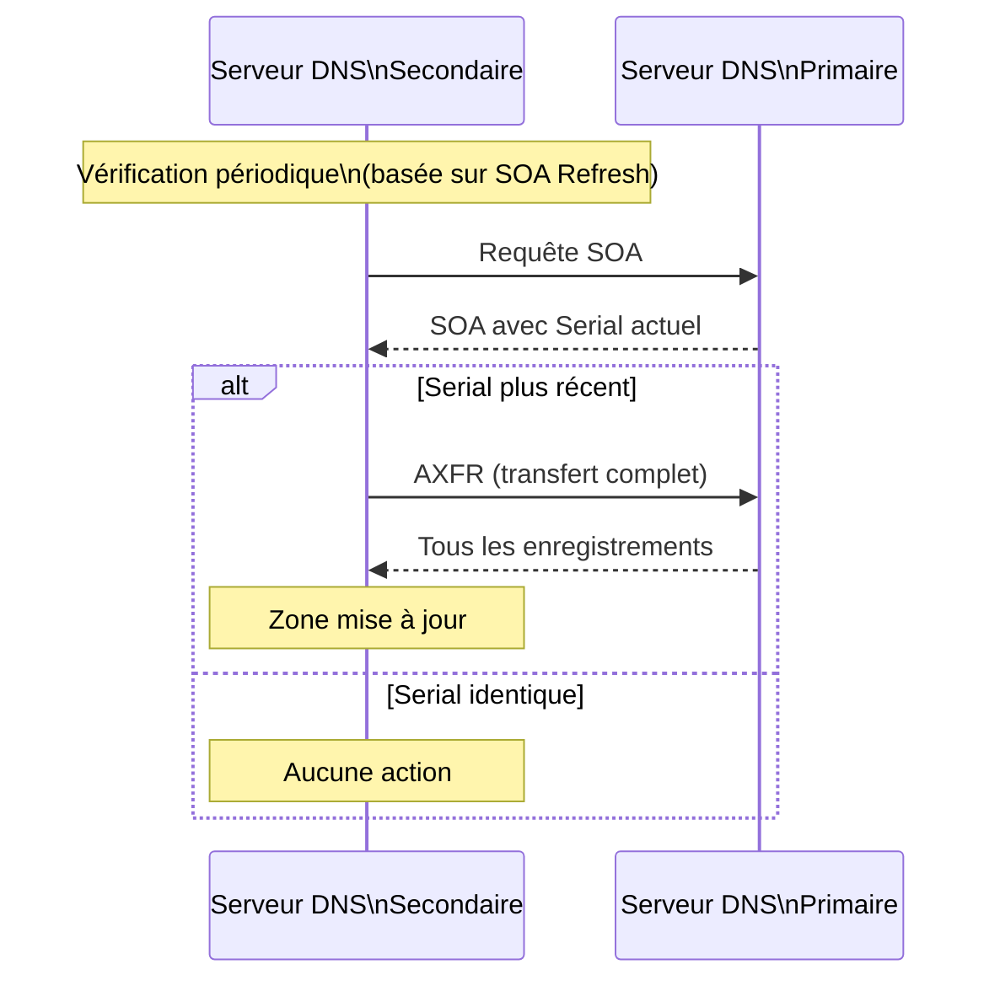
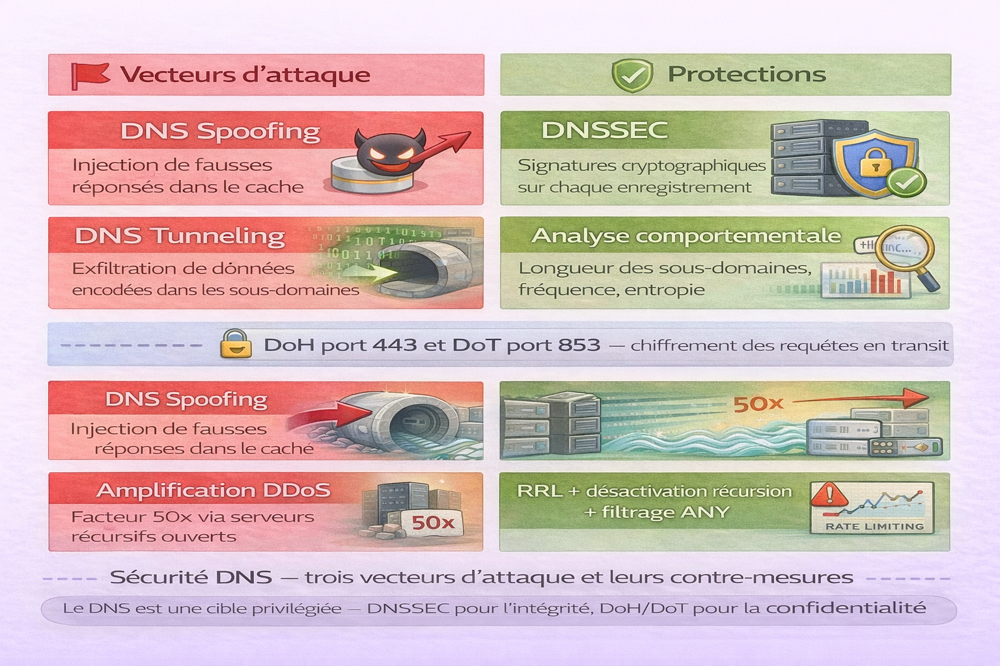
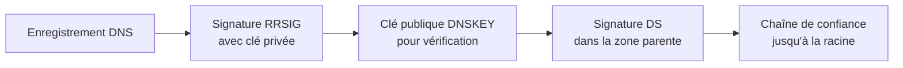

# DNS — Notions

<div
  class="omny-meta"
  data-level="🟢 Débutant"
  data-version="0"
  data-time="25-30 minutes">
</div>

!!! quote "Analogie"
    _Un annuaire téléphonique mondial où au lieu de chercher un numéro de téléphone à partir d'un nom, vous cherchez une adresse IP à partir d'un nom de domaine. Plutôt que de mémoriser `142.250.179.78`, vous tapez simplement `google.com`. Le DNS est cet annuaire intelligent et distribué qui traduit les noms compréhensibles par les humains en adresses IP utilisables par les machines._

Le **Domain Name System (DNS)** est l'un des piliers fondamentaux d'Internet. Sans lui, naviguer sur le web nécessiterait de mémoriser des millions d'adresses IP numériques. Le DNS agit comme un service de traduction automatique entre les noms de domaine lisibles — `example.com` — et les adresses IP techniques — `93.184.216.34`.

Comprendre le DNS est indispensable pour tout professionnel IT car il impacte directement la disponibilité, les performances et la sécurité des infrastructures réseau. Une mauvaise configuration DNS peut rendre un site inaccessible, tandis qu'une attaque DNS peut rediriger des millions d'utilisateurs vers des sites malveillants.

!!! info "Pourquoi c'est important"
    Le DNS intervient dans presque toutes les communications Internet — navigation web, emails, applications mobiles, APIs, services cloud. C'est souvent le premier point de défaillance en cas de panne et une cible privilégiée pour les attaques cybernétiques.

<br />

---

## Concepts fondamentaux

Le DNS est un **système de nommage hiérarchique et distribué** qui assure la correspondance entre les noms de domaine (`www.example.com`, lisible par l'humain) et les adresses IP (`93.184.216.34`, utilisable par les machines).

Ses quatre caractéristiques fondamentales sont la distribution (aucun serveur unique ne contient toutes les informations), la hiérarchie (organisation en arborescence racine → TLD → domaine → sous-domaine), le cache (les résultats sont mis en cache pour améliorer les performances) et la résilience (redondance et réplication pour garantir la disponibilité).

Sans le DNS, il faudrait mémoriser l'adresse IP de chaque site visité, mettre à jour manuellement cette information en cas de changement de serveur et gérer les évolutions d'infrastructure à la main.

```plaintext title="Plaintext — sans DNS vs avec DNS"
Sans DNS :
  Vous tapez : http://142.250.179.78
  Problème : Impossible à mémoriser, change régulièrement

Avec DNS :
  Vous tapez : http://google.com
  Le DNS traduit automatiquement vers l'IP actuelle
```

<br />

---

## Hiérarchie DNS

!!! note "L'image ci-dessous représente la structure arborescente du DNS — de la racine jusqu'aux sous-domaines. Comprendre cette hiérarchie est indispensable pour interpréter n'importe quel nom de domaine."



<p><em>Le DNS fonctionne comme un arbre inversé. La racine (point) est gérée par 13 adresses IP derrière lesquelles se cachent des centaines de serveurs physiques répliqués. Les TLD (.com, .fr, .org) constituent le premier niveau. Les domaines de second niveau (example.com, google.com) sont enregistrés auprès de registrars. Les sous-domaines (www, mail, api) sont créés librement par le propriétaire du domaine. Chaque niveau délègue l'autorité au niveau suivant.</em></p>


```mermaid
flowchart TD
    A[". Racine"]
    B[".com TLD"]
    C[".fr TLD"]
    D[".org TLD"]
    E["example.com"]
    F["google.com"]
    G["gouv.fr"]
    H["www.example.com"]
    I["mail.example.com"]
    J["api.example.com"]

    A --> B
    A --> C
    A --> D
    B --> E
    B --> F
    C --> G
    E --> H
    E --> I
    E --> J
```

### Les différents niveaux

=== "1. Racine DNS"

    La racine est représentée par un point `.` — c'est le sommet de toute la hiérarchie. Il n'existe pas 13 serveurs physiques mais **13 adresses IP** derrière lesquelles se cachent **des centaines de serveurs répliqués** dans le monde entier via Anycast, pour assurer performances et résilience. Ils sont gérés par différentes organisations : ICANN, universités, entreprises.

=== "2. TLD — Top-Level Domain"

    Les domaines de premier niveau se divisent en trois catégories.

    **TLD génériques (gTLD) :**

    <div class="grid cards" markdown>

    - `.com` — Commercial
    - `.org` — Organisation
    - `.net` — Network
    - `.edu` — Éducation
    - `.gov` — Gouvernement US
    - `.info`, `.biz`, `.name`, etc.

    </div>

    **TLD nationaux (ccTLD) :**

    <div class="grid cards" markdown>

    - `.fr` — France
    - `.de` — Allemagne
    - `.uk` — Royaume-Uni
    - `.jp` — Japon
    - `.ca` — Canada

    </div>

    **Nouveaux gTLD :**

    <div class="grid cards" markdown>

    - `.tech`, `.app`, `.dev`, `.cloud`, `.security`, etc.

    </div>

=== "3. Domaine de second niveau (SLD)"

    C'est le nom enregistré auprès d'un registrar : `example` dans `example.com`, `google` dans `google.com`, `wikipedia` dans `wikipedia.org`.

=== "4. Sous-domaines"

    Créés librement par le propriétaire du domaine : `www.example.com`, `mail.example.com`, `api.example.com`, `staging.api.example.com` (sous-sous-domaine).

<br />

---

## Processus de résolution DNS

!!! note "L'image ci-dessous présente le pipeline complet de résolution DNS en mode récursif. Le diagramme de séquence ci-après détaille l'échange message par message."



<p><em>La résolution DNS récursive implique quatre acteurs distincts. Le résolveur récursif — fourni par le FAI ou un service public — prend en charge toute la résolution pour le client. Il interroge d'abord un serveur racine qui lui indique quel serveur TLD consulter. Le serveur TLD indique ensuite quel serveur autoritaire gère le domaine. Le serveur autoritaire fournit enfin l'adresse IP. Le résolveur met le résultat en cache pendant la durée du TTL avant de le retourner au client.</em></p>

### Résolution récursive complète


```mermaid
sequenceDiagram
    autonumber
    participant Client as Client\n(Navigateur)
    participant Recursive as Serveur DNS\nRécursif (ISP)
    participant Root as Serveur\nRacine
    participant TLD as Serveur\nTLD (.com)
    participant Auth as Serveur\nAutoritaire\n(example.com)

    Client->>Recursive: Requête: www.example.com ?

    Note over Recursive: Cache vide, résolution complète

    Recursive->>Root: Qui gère .com ?
    Root-->>Recursive: Serveur TLD .com (IP)

    Recursive->>TLD: Qui gère example.com ?
    TLD-->>Recursive: Serveur autoritaire example.com (IP)

    Recursive->>Auth: www.example.com = ?
    Auth-->>Recursive: 93.184.216.34 (TTL: 3600s)

    Recursive-->>Client: 93.184.216.34 (TTL: 3600s)

    Note over Recursive: Mise en cache\npendant 3600s
    Note over Client: Connexion HTTP\nvers 93.184.216.34
```

Ce diagramme montre les 8 étapes d'une résolution DNS complète quand aucun cache n'est disponible.

### Étapes détaillées

!!! info "1. Requête initiale du client"
    Le navigateur vérifie d'abord son cache local selon la séquence : cache navigateur → cache OS → requête DNS récursive.

!!! info "2. Serveur DNS récursif"
    Fourni par le FAI ou un service tiers. Les plus courants sont 8.8.8.8 (Google Public DNS), 1.1.1.1 (Cloudflare DNS) et 9.9.9.9 (Quad9 DNS).

!!! info "3. Interrogation des serveurs racines"
    Si le cache est vide, le serveur récursif interroge un serveur racine qui répond : "Je ne connais pas example.com, mais voici les serveurs qui gèrent .com".

!!! info "4. Interrogation du serveur TLD"
    Le serveur récursif interroge le serveur .com qui répond : "Je ne connais pas www.example.com, mais voici les serveurs autoritaires pour example.com".

!!! info "5. Interrogation du serveur autoritaire"
    Le serveur récursif interroge le serveur autoritaire d'example.com qui répond : "www.example.com = 93.184.216.34 (TTL: 3600 secondes)".

!!! info "6. Réponse et mise en cache"
    Le serveur récursif renvoie la réponse au client et stocke le résultat en cache pendant la durée spécifiée par le TTL.

!!! info "7. Connexion au serveur web"
    Le client établit une connexion TCP vers 93.184.216.34 sur le port 80 (HTTP) ou 443 (HTTPS).

### Types de résolution

#### Résolution récursive

Le serveur DNS prend en charge toute la résolution et renvoie une réponse finale.

```plaintext title="Plaintext — flux récursif"
Client → Serveur récursif → [Root → TLD → Autoritaire] → Serveur récursif → Client
```

Le client pose une question et reçoit directement la réponse finale. La mise en cache est centralisée et la charge sur les serveurs autoritaires est réduite.

#### Résolution itérative

Le serveur DNS renvoie la meilleure réponse qu'il possède ou une référence au prochain serveur à interroger.

```plaintext title="Plaintext — flux itératif"
Client → Racine : "Demande à .com"
Client → TLD .com : "Demande à example.com"
Client → Autoritaire example.com : "Voici l'IP"
```

Le client gère lui-même la chaîne d'interrogation — moins de charge sur un serveur unique, plus de contrôle.

<br />

---

## Types d'enregistrements DNS

!!! note "L'image ci-dessous présente les neuf types d'enregistrements DNS principaux avec leur rôle et un exemple. C'est la référence à consulter lors de la configuration d'une zone."



<p><em>Les enregistrements DNS définissent le comportement de chaque domaine. A et AAAA pointent vers des adresses IP. CNAME crée des alias. MX déclare les serveurs mail avec leur priorité. TXT stocke du texte libre — vérifications, SPF, DKIM, DMARC. NS déclare les serveurs autoritaires. SOA contient les métadonnées administratives de la zone. PTR assure la résolution inverse. CAA restreint les autorités de certification autorisées à émettre des certificats SSL/TLS.</em></p>

Les serveurs DNS stockent différents types d'enregistrements dans des zones DNS.

### Enregistrements principaux

=== "A — Address"

    Associe un nom de domaine à une adresse IPv4.

    ```dns title="DNS — enregistrement A"
    example.com.        3600    IN    A    93.184.216.34
    www.example.com.    3600    IN    A    93.184.216.34
    ```

    Format : `<nom>  <TTL>  <classe>  <type>  <adresse IPv4>`

=== "AAAA — IPv6 Address"

    Associe un nom de domaine à une adresse IPv6.

    ```dns title="DNS — enregistrement AAAA"
    example.com.    3600    IN    AAAA    2606:2800:220:1:248:1893:25c8:1946
    ```

=== "CNAME — Canonical Name"

    Crée un alias vers un autre nom de domaine.

    ```dns title="DNS — enregistrement CNAME"
    www.example.com.    3600    IN    CNAME    example.com.
    blog.example.com.   3600    IN    CNAME    example.com.
    ```

    !!! warning "Limitation CNAME"
        Un enregistrement CNAME ne peut pas coexister avec d'autres enregistrements pour le même nom (sauf DNSSEC). Il ne peut jamais pointer vers un domaine racine (apex).

=== "MX — Mail Exchange"

    Indique les serveurs de messagerie pour un domaine. Le nombre indique la priorité — plus bas = prioritaire.

    ```dns title="DNS — enregistrement MX avec priorités"
    example.com.    3600    IN    MX    10 mail1.example.com.
    example.com.    3600    IN    MX    20 mail2.example.com.
    ```

=== "TXT — Text"

    Stocke du texte arbitraire. Principalement utilisé pour la vérification de propriété (Google Search Console, Microsoft), SPF (Sender Policy Framework), DKIM (DomainKeys Identified Mail) et DMARC (Domain-based Message Authentication).

    ```dns title="DNS — enregistrements TXT SPF et vérification"
    example.com.    3600    IN    TXT    "v=spf1 include:_spf.google.com ~all"
    example.com.    3600    IN    TXT    "google-site-verification=abcd1234"
    ```

=== "NS — Name Server"

    Indique les serveurs DNS autoritaires pour une zone.

    ```dns title="DNS — enregistrement NS"
    example.com.    3600    IN    NS    ns1.example.com.
    example.com.    3600    IN    NS    ns2.example.com.
    ```

=== "SOA — Start of Authority"

    Contient les informations administratives de la zone DNS.

    ```dns title="DNS — enregistrement SOA avec tous les champs"
    example.com.    3600    IN    SOA    ns1.example.com. admin.example.com. (
                                        2024011801  ; Serial — numéro de version YYYYMMDDNN
                                        7200        ; Refresh — intervalle de vérification (secondes)
                                        3600        ; Retry — délai avant nouvelle tentative
                                        1209600     ; Expire — validité si primaire injoignable
                                        3600 )      ; Minimum TTL — TTL par défaut négatif
    ```

    Le champ RNAME est l'email de l'administrateur avec le `@` remplacé par un point.

=== "PTR — Pointer"

    Utilisé pour la résolution inverse (IP → nom de domaine). Principalement utilisé pour la vérification des serveurs de messagerie, les logs et diagnostics réseau, et la détection de spam.

    ```dns title="DNS — enregistrement PTR résolution inverse"
    34.216.184.93.in-addr.arpa.    3600    IN    PTR    example.com.
    ```

=== "CAA — Certification Authority Authorization"

    Spécifie quelles autorités de certification peuvent émettre des certificats SSL/TLS pour le domaine.

    ```dns title="DNS — enregistrement CAA restriction des autorités"
    example.com.    3600    IN    CAA    0 issue "letsencrypt.org"
    example.com.    3600    IN    CAA    0 issuewild ";"
    ```

    `0 issue` : autorité autorisée pour les certificats standard. `0 issuewild` : autorité autorisée pour les certificats wildcard. `0 iodef` : URL pour signaler les violations.

### Enregistrements spécialisés

=== "SRV — Service"

    Définit l'emplacement de services spécifiques — Active Directory, VoIP SIP, XMPP.

    ```dns title="DNS — enregistrement SRV"
    _http._tcp.example.com.    3600    IN    SRV    10 60 80 server.example.com.
    # Format : _service._protocole.domaine  TTL  IN  SRV  priorité poids port cible
    ```

<br />

---

## Cache DNS et TTL

### Concept de cache

Le cache DNS évite d'interroger constamment les serveurs autoritaires en stockant temporairement les résultats. Il existe à quatre niveaux distincts.


```mermaid
flowchart LR
    A["Navigateur"]
    B["OS"]
    C["Résolveur Récursif"]
    D["Serveurs Autoritaires"]

    A --> B --> C --> D
```

Chaque niveau consulte son cache avant de remonter vers le niveau suivant. Un cache valide évite toute la chaîne jusqu'aux serveurs autoritaires.

### TTL — Time To Live

Le TTL détermine la durée pendant laquelle un enregistrement peut être mis en cache.

```dns title="DNS — lecture du TTL dans un enregistrement A"
example.com.    3600    IN    A    93.184.216.34
                ^^^^
                TTL en secondes (1 heure)
```

| Durée | Secondes | Usage |
|---|---|---|
| 5 minutes | 300 | Services nécessitant une mise à jour rapide |
| 1 heure | 3600 | Configuration standard |
| 24 heures | 86400 | Enregistrements très stables |
| 1 semaine | 604800 | Enregistrements rarement modifiés |

!!! tip "Stratégie de TTL avant une migration"
    Réduire le TTL à 300 secondes 24 à 48 heures avant la modification. Effectuer la modification. Vérifier que tout fonctionne. Augmenter progressivement le TTL à sa valeur normale.

### Propagation DNS

La propagation DNS dépend du TTL de l'ancien enregistrement, des caches des ISP et résolveurs publics, des caches des applications et navigateurs, et des horloges désynchronisées entre serveurs.

```plaintext title="Plaintext — cycle de propagation"
Modification DNS → Attente du TTL expiré → Nouvelle valeur récupérée
```

!!! note "Délai typique : 24 à 48 heures pour une propagation mondiale complète avec un TTL standard."

<br />

---

## Zones DNS

Une zone DNS est une portion de l'espace de noms DNS gérée par une entité spécifique.

### Fichier de zone

??? example "Exemple de fichier de zone pour example.com"

    ```dns title="DNS — fichier de zone complet example.com"
    ; Zone file for example.com
    $ORIGIN example.com.
    $TTL 3600

    ; SOA Record
    @    IN    SOA    ns1.example.com. admin.example.com. (
                      2024011801  ; Serial
                      7200        ; Refresh
                      3600        ; Retry
                      1209600     ; Expire
                      3600 )      ; Minimum TTL

    ; Name Servers
    @    IN    NS     ns1.example.com.
    @    IN    NS     ns2.example.com.

    ; A Records (IPv4)
    @              IN    A      93.184.216.34
    www            IN    A      93.184.216.34
    mail           IN    A      93.184.216.50
    ns1            IN    A      93.184.216.1
    ns2            IN    A      93.184.216.2

    ; AAAA Records (IPv6)
    @              IN    AAAA   2606:2800:220:1:248:1893:25c8:1946

    ; MX Records
    @              IN    MX     10 mail.example.com.
    @              IN    MX     20 mail2.example.com.

    ; CNAME Records
    blog           IN    CNAME  example.com.
    ftp            IN    CNAME  example.com.

    ; TXT Records
    @              IN    TXT    "v=spf1 include:_spf.google.com ~all"
    @              IN    TXT    "google-site-verification=abc123"

    ; CAA Records
    @              IN    CAA    0 issue "letsencrypt.org"
    ```

    `$ORIGIN` définit le domaine de base. `$TTL` définit le TTL par défaut. `@` représente `$ORIGIN`.

### Transfert de zone

Les serveurs DNS secondaires se synchronisent avec le primaire via AXFR (transfert complet) ou IXFR (transfert incrémental).


```mermaid
sequenceDiagram
    participant Secondary as Serveur DNS\nSecondaire
    participant Primary as Serveur DNS\nPrimaire

    Note over Secondary: Vérification périodique\n(basée sur SOA Refresh)

    Secondary->>Primary: Requête SOA
    Primary-->>Secondary: SOA avec Serial actuel

    alt Serial plus récent
        Secondary->>Primary: AXFR (transfert complet)
        Primary-->>Secondary: Tous les enregistrements
        Note over Secondary: Zone mise à jour
    else Serial identique
        Note over Secondary: Aucune action
    end
```

!!! danger "Sécurité des transferts de zone"
    Les transferts de zone révèlent tous les enregistrements d'un domaine. Ils doivent être restreints aux serveurs autorisés via TSIG ou ACL.

<br />

---

## Serveurs DNS publics

| Fournisseur | IPv4 | IPv6 | Caractéristiques |
|---|---|---|---|
| Google Public DNS | 8.8.8.8 / 8.8.4.4 | 2001:4860:4860::8888 / ::8844 | Performance, aucun filtrage |
| Cloudflare DNS | 1.1.1.1 / 1.0.0.1 | 2606:4700:4700::1111 / ::1001 | Confidentialité, rapide |
| Quad9 | 9.9.9.9 / 149.112.112.112 | 2620:fe::fe / 2620:fe::9 | Sécurité — blocage malware |
| OpenDNS | 208.67.222.222 / 208.67.220.220 | 2620:119:35::35 / 2620:119:53::53 | Filtrage parental |

### Configuration par système d'exploitation

=== ":fontawesome-brands-linux: Linux"

    ```bash title="Bash — configuration DNS via NetworkManager"
    # Modifier la connexion réseau
    nmcli connection modify "Connexion Ethernet" ipv4.dns "1.1.1.1 8.8.8.8"

    # Appliquer les changements
    nmcli connection down "Connexion Ethernet"
    nmcli connection up "Connexion Ethernet"

    # Vérifier la configuration active
    nmcli device show | grep DNS
    ```

    ```bash title="Bash — configuration DNS persistante via resolv.conf"
    # Éditer le fichier de configuration
    sudo nano /etc/resolv.conf

    # Ajouter les serveurs DNS
    # nameserver 1.1.1.1
    # nameserver 8.8.8.8

    # Rendre le fichier immuable pour empêcher les modifications automatiques
    sudo chattr +i /etc/resolv.conf
    ```

=== ":fontawesome-brands-windows: Windows"

    ```powershell title="PowerShell — configuration DNS et vidage du cache"
    # Lister les interfaces réseau disponibles
    Get-NetAdapter

    # Configurer les serveurs DNS pour une interface
    Set-DnsClientServerAddress -InterfaceAlias "Ethernet" -ServerAddresses ("1.1.1.1","8.8.8.8")

    # Vérifier la configuration
    Get-DnsClientServerAddress

    # Vider le cache DNS local
    Clear-DnsClientCache
    ```

    Via l'interface graphique : Panneau de configuration → Réseau et Internet → Centre Réseau et partage → Modifier les paramètres de la carte → Clic droit connexion → Propriétés → IPv4 → Propriétés → Utiliser les adresses DNS suivantes.

=== ":fontawesome-brands-apple: macOS"

    ```bash title="Bash — configuration DNS et vidage du cache macOS"
    # Configurer les serveurs DNS pour Wi-Fi
    networksetup -setdnsservers Wi-Fi 1.1.1.1 8.8.8.8

    # Vérifier la configuration
    networksetup -getdnsservers Wi-Fi

    # Vider le cache DNS
    sudo dscacheutil -flushcache
    sudo killall -HUP mDNSResponder
    ```

    Via l'interface graphique : Préférences Système → Réseau → sélectionner la connexion → Avancé → DNS → ajouter les serveurs avec le bouton +.

<br />

---

## Commandes DNS essentielles

<div class="grid cards" markdown>

- :lucide-terminal: **[dig](../outils/network/dig.md)** — Outil DNS avancé pour Unix/Linux
- :lucide-terminal: **[nslookup](../outils/network/nslookup.md)** — Requêtes DNS multi-plateformes
- :lucide-terminal: **[host](../outils/network/host.md)** — Vérifications DNS rapides
- :lucide-terminal: **[ping](../outils/network/ping.md)** — Test de connectivité réseau

</div>

Chaque commande dispose d'une fiche détaillée dans la section Outils.

<br />

---

## Sécurité DNS

!!! note "L'image ci-dessous présente une vue unifiée des trois vecteurs d'attaque DNS et des protections associées — DNSSEC, DoH, DoT. En contexte DevSecOps, cette cartographie est indispensable pour sécuriser une infrastructure."



<p><em>Le DNS est attaqué selon trois vecteurs principaux. Le DNS spoofing injecte de fausses réponses dans le cache pour rediriger les utilisateurs. Le DNS tunneling exfiltre des données en les encodant dans des requêtes DNS vers un serveur contrôlé par l'attaquant. L'amplification DDoS exploite des serveurs récursifs ouverts pour multiplier le trafic vers une victime — un facteur d'amplification de 50x est courant. DNSSEC protège l'intégrité des réponses. DoH et DoT protègent la confidentialité des requêtes.</em></p>

### Vulnérabilités courantes

=== "1. DNS Spoofing / Cache Poisoning"

    Injection de fausses réponses DNS dans le cache pour rediriger les utilisateurs vers des sites malveillants.

    ```mermaid
    sequenceDiagram
        participant Client
        participant Cache
        participant Attaquant
        participant Legitime as Serveur\nLégitime

        Client->>Cache: bank.com ?
        Cache->>Legitime: bank.com ?

        Attaquant->>Cache: Fausse réponse:\nbank.com = IP_malveillante
        Note over Attaquant: Arrive avant la vraie réponse

        Legitime-->>Cache: Réponse légitime (ignorée)
        Cache-->>Client: IP_malveillante

        Note over Client: Connecté au site\nde l'attaquant
    ```

    Protections : DNSSEC, randomisation des ports sources (port >1024 aléatoire), randomisation des IDs de transaction, 0x20 encoding (randomisation de la casse).

=== "2. DNS Tunneling"

    Exfiltration de données via des requêtes DNS encodées vers un serveur contrôlé par l'attaquant.

    ```plaintext title="Plaintext — exemple d'exfiltration par DNS tunneling"
    Données à exfiltrer : "password123"

    Requêtes DNS générées :
    70617373.attacker.com     # "pass" en hexadécimal
    776f7264.attacker.com     # "word"
    313233.attacker.com       # "123"

    Le serveur DNS de l'attaquant décode les sous-domaines
    ```

    Détection : analyse des longueurs de sous-domaines (anormalement longues), fréquence élevée de requêtes vers un même domaine, entropie élevée des noms de domaine.

=== "3. DDoS par amplification DNS"

    Utilisation de serveurs DNS ouverts pour amplifier le trafic vers une cible en spoofant l'IP source.

    ```plaintext title="Plaintext — facteur d'amplification DNS"
    Attaquant envoie : 60 octets (requête ANY vers un gros domaine)
    Serveur DNS répond : 3000 octets
    Facteur d'amplification : 50x

    IP source spoofée = IP de la victime
    La victime reçoit 50x le trafic généré par l'attaquant
    ```

    Protections : désactivation des requêtes récursives sur les serveurs autoritaires, rate limiting, Response Rate Limiting (RRL), filtrage des requêtes ANY.

### DNSSEC — DNS Security Extensions

DNSSEC ajoute des signatures cryptographiques aux enregistrements DNS pour garantir leur authenticité et leur intégrité.


```mermaid
flowchart LR
    A["Enregistrement DNS"]
    B["Signature RRSIG\navec clé privée"]
    C["Clé publique DNSKEY\npour vérification"]
    D["Signature DS\ndans la zone parente"]
    E["Chaîne de confiance\njusqu'à la racine"]

    A --> B --> C --> D --> E
```

**DNSKEY** contient les clés publiques. **RRSIG** est la signature cryptographique d'un enregistrement. **DS** est l'empreinte de la clé publiée dans la zone parente. **NSEC/NSEC3** prouve la non-existence d'un enregistrement.

```dns title="DNS — enregistrements DNSSEC"
; Clé publique
example.com.    3600    IN    DNSKEY    257 3 13 mdsswUyr3DPW132mOi8V9xESWE8jTo0dxCjjnopX+cQ=

; Signature d'un enregistrement A
example.com.    3600    IN    RRSIG    A 13 2 3600 20240201000000 20240101000000 12345 example.com. signature_base64

; Empreinte dans la zone parente
example.com.    3600    IN    DS    12345 13 2 49FD46E6C4B45C55D4AC69CBD3CD34AC1AFE51DE
```

```bash title="Bash — vérification DNSSEC"
# Vérifier si DNSSEC est activé
dig +dnssec example.com

# Valider la chaîne de confiance
dig +sigchase +trusted-key=/etc/trusted-key.key example.com

# Vérifier le statut DNSSEC — le flag "ad" indique Authenticated Data
delv example.com
```

### DNS over HTTPS (DoH) et DNS over TLS (DoT)

Ces protocoles chiffrent les requêtes DNS pour éviter l'espionnage et la manipulation en transit.

**DoH** utilise le port 443 — les requêtes DNS sont encapsulées dans HTTPS.

```bash title="Bash — requête DNS via DoH avec curl"
curl -H 'accept: application/dns-json' \
  'https://1.1.1.1/dns-query?name=example.com&type=A'
```

**DoT** utilise le port 853 — connexion TLS dédiée aux requêtes DNS.

```bash title="Bash — requête DNS via DoT avec kdig"
kdig -d @1.1.1.1 +tls example.com
```

| Critère | DoH | DoT |
|---|---|---|
| Port | 443 (HTTPS) | 853 (dédié) |
| Détection par pare-feu | Difficile — mélangé avec HTTPS | Possible — port spécifique |
| Performance | Légère surcharge HTTP | Plus efficace |
| Blocage | Difficile | Possible |

### Bonnes pratiques de sécurité

!!! tip "Sécurisation DNS"
    **Pour les serveurs DNS :** activer DNSSEC sur les domaines gérés, désactiver la récursion sur les serveurs autoritaires, restreindre les transferts de zone via TSIG ou ACL, implémenter Response Rate Limiting (RRL), séparer les serveurs récursifs et autoritaires, activer les logs détaillés et monitorer les anomalies.

    **Pour les clients :** utiliser DoH ou DoT pour chiffrer les requêtes, valider DNSSEC quand disponible, utiliser des serveurs DNS fiables plutôt que ceux des FAI par défaut, vérifier les certificats SSL dans les navigateurs.

<br />

---

## Tableau récapitulatif des enregistrements

| Type | Description | Exemple |
|---|---|---|
| A | IPv4 | `example.com IN A 93.184.216.34` |
| AAAA | IPv6 | `example.com IN AAAA 2606:2800:220:1::1` |
| CNAME | Alias | `www IN CNAME example.com` |
| MX | Serveur mail | `example.com IN MX 10 mail.example.com` |
| TXT | Texte arbitraire | `example.com IN TXT "v=spf1..."` |
| NS | Serveur DNS autoritaire | `example.com IN NS ns1.example.com` |
| SOA | Autorité de zone | `example.com IN SOA ns1...` |
| PTR | Résolution inverse | `34.216.184.93.in-addr.arpa IN PTR...` |
| CAA | Autorité de certification | `example.com IN CAA 0 issue "..."` |

<br />

---

## Pour aller plus loin

!!! tip "Ressources de référence"
    RFC 1034/1035 : standards DNS originaux. RFC 4033-4035 : spécifications DNSSEC. RFC 8484 : DNS over HTTPS. RFC 7858 : DNS over TLS.

!!! tip "Outils en ligne"
    - [DNSdumpster](https://dnsdumpster.com/) — exploration DNS.
    - [MXToolbox](https://mxtoolbox.com/) — diagnostic DNS complet. 
    - [What's My DNS](https://www.whatsmydns.net/) — vérification de propagation mondiale. 
    - [DNSSEC Analyzer](https://dnssec-analyzer.verisignlabs.com/) — validation DNSSEC.

<br />

---

## Conclusion

!!! quote "Ce qu'il faut retenir"
    Les notions abordées autour de dns notions sont le système nerveux de l'informatique moderne. Sans une maîtrise parfaite de ces protocoles et modèles, le dépannage de problèmes d'infrastructure ou la sécurisation de communications restent de pures suppositions.

!!! quote "Conclusion"
    _Le DNS traduit les noms de domaine en adresses IP via un système hiérarchique distribué — racine, TLD, domaine de second niveau, sous-domaines. La résolution récursive implique quatre acteurs : résolveur récursif, serveur racine, serveur TLD et serveur autoritaire. Les neuf types d'enregistrements principaux couvrent l'intégralité des cas d'usage — A et AAAA pour les adresses, MX pour le mail, CNAME pour les alias, TXT pour les vérifications et l'authentification, NS et SOA pour l'administration de zone, PTR pour la résolution inverse, CAA pour la sécurité des certificats. Le TTL contrôle la durée de mise en cache et détermine le délai de propagation lors des modifications. DNSSEC garantit l'intégrité des réponses — DoH et DoT garantissent la confidentialité des requêtes. Le DNS est une cible privilégiée : spoofing, amplification DDoS et tunneling sont les vecteurs d'attaque à maîtriser pour protéger toute infrastructure._

<br />