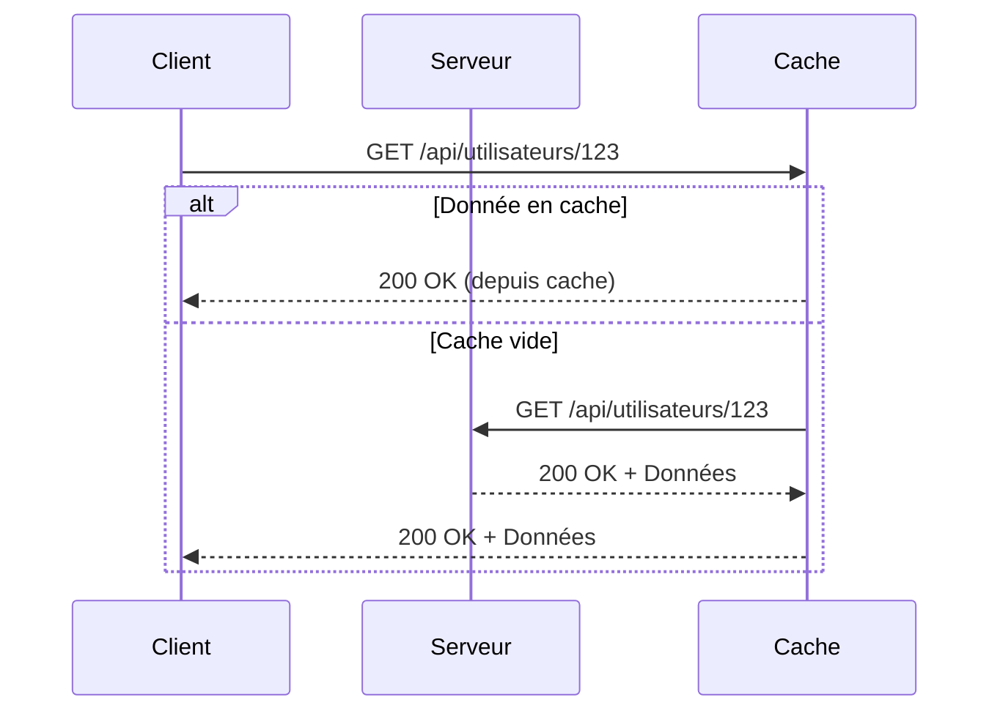

# HTTP – Méthodes

## Introduction

<div
  class="omny-meta"
  data-level="🟢 Débutant & 🟡 Intermédiaire"
  data-version="1.1"
  data-time="40-45 minutes">
</div>

!!! quote "Analogie pédagogique"
    _Imaginez une bibliothèque où vous pouvez effectuer différentes actions : **consulter** un livre (GET), **emprunter** un livre en remplissant un formulaire (POST), **remplacer** complètement un livre endommagé (PUT), **corriger** quelques pages (PATCH), ou **retourner** un livre (DELETE). Chaque action suit des règles précises. **Les méthodes HTTP fonctionnent exactement ainsi** : elles définissent les actions possibles sur les ressources web, chacune avec ses propres caractéristiques et règles de sécurité._

> Le protocole **HTTP** (HyperText Transfer Protocol) constitue le fondement de la communication sur le web. Chaque interaction entre un client (navigateur, application mobile, API) et un serveur utilise une **méthode HTTP** qui définit **l'intention de la requête** et **comment le serveur doit la traiter**.

Comprendre les méthodes HTTP devient essentiel dès que vous développez des applications web, consommez des APIs, ou sécurisez des systèmes. **Chaque méthode possède des caractéristiques spécifiques** concernant la **sécurité**, l'**idempotence** et les **effets de bord** qui impactent directement l'architecture et la fiabilité de vos applications.

!!! info "Pourquoi c'est important ?"
    Les méthodes HTTP régissent **toutes les interactions client-serveur**, déterminent **la sécurité des opérations**, permettent **la conception d'APIs REST**, et influencent **les performances** et **la mise en cache**. Une utilisation incorrecte peut créer des vulnérabilités de sécurité graves comme des modifications non autorisées ou des fuites de données.

## Pour repartir des bases (vrais débutants)

Ce chapitre nécessite une compréhension basique du fonctionnement du web. Vous devez savoir qu'un **client** (navigateur) envoie des **requêtes** à un **serveur** qui répond avec des **données**. Si ces concepts vous semblent flous, consultez d'abord la documentation sur les **bases des réseaux**.

!!! tip "C'est comme apprendre les verbes d'action !"
    Si le web était une langue, les méthodes HTTP seraient ses verbes d'action. Tout comme vous utilisez différents verbes selon ce que vous voulez faire (lire, écrire, modifier, supprimer), vous utilisez différentes méthodes HTTP selon l'action que votre application doit effectuer.

## Les méthodes HTTP principales

Le protocole HTTP définit **neuf méthodes** officielles, mais **cinq méthodes couvrent la majorité des usages** dans les applications modernes.

| Méthode | Action | Idempotente[^1] | Sécurisée | Corps de requête | Corps de réponse |
|---------|--------|-------------|-----------|------------------|------------------|
| **GET** | Récupérer une ressource | ✅ Oui | ✅ Oui | ❌ Non | ✅ Oui |
| **POST** | Créer une ressource | ❌ Non | ❌ Non | ✅ Oui | ✅ Oui |
| **PUT** | Remplacer complètement | ✅ Oui | ❌ Non | ✅ Oui | ✅ Oui |
| **PATCH** | Modifier partiellement | ❌ Non* | ❌ Non | ✅ Oui | ✅ Oui |
| **DELETE** | Supprimer une ressource | ✅ Oui | ❌ Non | ❌ Non** | ✅ Oui |

!!! note "Propriétés importantes"
    - **Idempotente** : Plusieurs appels identiques produisent le même résultat qu'un seul appel
    - **Sécurisée** : N'a aucun effet de bord sur le serveur (lecture seule)
    - **\*PATCH** peut être idempotente selon l'implémentation
    - **\*\*DELETE** peut avoir un corps dans certaines implémentations non-standard

## Méthode GET

La méthode **GET** demande la représentation d'une ressource spécifiée. Elle est **la méthode la plus utilisée** sur le web et possède des caractéristiques de sécurité importantes.

!!! quote "Caractéristiques clés"
    - **Sécurisée** : Ne doit jamais modifier de données sur le serveur
    - **Idempotente** : Peut être appelée plusieurs fois sans effet différent
    - **Cacheable** : Les réponses peuvent être mises en cache
    - **Paramètres visibles** : Les données transitent dans l'URL

### Fonctionnement de GET



_Ce diagramme illustre le cycle de vie d'une requête GET avec mise en cache, mécanisme crucial pour les performances des applications web._

### Exemples par langage

=== ":fontawesome-brands-python: Python"

    ```python
        import requests
        
        # Récupération simple d'une ressource
        response = requests.get('https://api.example.com/utilisateurs/123')
        
        if response.status_code == 200:
            utilisateur = response.json()
            print(f"Nom: {utilisateur['nom']}")
        else:
            print(f"Erreur: {response.status_code}")
        
        # GET avec paramètres de requête
        params = {
            'page': 1,
            'limite': 10,
            'tri': 'nom'
        }
        response = requests.get('https://api.example.com/utilisateurs', params=params)
        # URL finale : /utilisateurs?page=1&limite=10&tri=nom
    ```

=== ":fontawesome-brands-js: JavaScript"

    ```javascript
        // Récupération avec Fetch API moderne
        fetch('https://api.example.com/utilisateurs/123')
            .then(response => {
                if (!response.ok) {
                    throw new Error(`Erreur HTTP: ${response.status}`);
                }
                return response.json();
            })
            .then(utilisateur => {
                console.log(`Nom: ${utilisateur.nom}`);
            })
            .catch(error => {
                console.error('Erreur:', error);
            });
        
        // GET avec paramètres (URLSearchParams)
        const params = new URLSearchParams({
            page: 1,
            limite: 10,
            tri: 'nom'
        });
        fetch(`https://api.example.com/utilisateurs?${params}`);
    ```

=== ":fontawesome-brands-php: PHP"

    ```php
        <?php
        // Récupération avec cURL
        $ch = curl_init('https://api.example.com/utilisateurs/123');
        curl_setopt($ch, CURLOPT_RETURNTRANSFER, true);
        curl_setopt($ch, CURLOPT_HTTPGET, true);
        
        $response = curl_exec($ch);
        $httpCode = curl_getinfo($ch, CURLINFO_HTTP_CODE);
        curl_close($ch);
        
        if ($httpCode === 200) {
            $utilisateur = json_decode($response, true);
            echo "Nom: {$utilisateur['nom']}\n";
        } else {
            echo "Erreur: $httpCode\n";
        }
        
        // GET avec paramètres
        $params = http_build_query([
            'page' => 1,
            'limite' => 10,
            'tri' => 'nom'
        ]);
        $url = "https://api.example.com/utilisateurs?$params";
        ?>
    ```

=== ":fontawesome-brands-golang: Golang"

    ```go
        package main
        import (
            "encoding/json"
            "fmt"
            "net/http"
            "net/url"
        )
        
        type Utilisateur struct {
            ID   int    `json:"id"`
            Nom  string `json:"nom"`
        }
        
        func main() {
            // Récupération simple
            resp, err := http.Get("https://api.example.com/utilisateurs/123")
            if err != nil {
                fmt.Printf("Erreur: %v\n", err)
                return
            }
            defer resp.Body.Close()
            
            if resp.StatusCode == http.StatusOK {
                var utilisateur Utilisateur
                json.NewDecoder(resp.Body).Decode(&utilisateur)
                fmt.Printf("Nom: %s\n", utilisateur.Nom)
            }
            
            // GET avec paramètres
            baseURL, _ := url.Parse("https://api.example.com/utilisateurs")
            params := url.Values{}
            params.Add("page", "1")
            params.Add("limite", "10")
            baseURL.RawQuery = params.Encode()
            
            http.Get(baseURL.String())
        }
    ```

=== ":fontawesome-brands-rust: Rust"

    ```rust
        use reqwest;
        use serde::{Deserialize, Serialize};
        
        #[derive(Debug, Deserialize)]
        struct Utilisateur {
            id: u32,
            nom: String,
        }
        
        #[tokio::main]
        async fn main() -> Result<(), Box<dyn std::error::Error>> {
            // Récupération simple
            let response = reqwest::get("https://api.example.com/utilisateurs/123")
                .await?;
            
            if response.status().is_success() {
                let utilisateur: Utilisateur = response.json().await?;
                println!("Nom: {}", utilisateur.nom);
            }
            
            // GET avec paramètres
            let client = reqwest::Client::new();
            let response = client
                .get("https://api.example.com/utilisateurs")
                .query(&[("page", "1"), ("limite", "10"), ("tri", "nom")])
                .send()
                .await?;
            
            Ok(())
        }
    ```

!!! warning "Sécurité GET"
    **Ne transmettez JAMAIS de données sensibles dans l'URL** avec GET. Les URLs apparaissent dans :
    
    - Les logs du serveur
    - L'historique du navigateur
    - Les logs des proxies et firewalls
    - Les en-têtes Referer lors de navigation
    
    Utilisez POST pour les données sensibles comme les mots de passe, tokens ou informations personnelles.

## Méthode POST

La méthode **POST** soumet une entité à la ressource spécifiée, causant souvent **un changement d'état ou des effets de bord sur le serveur**. Elle est **la méthode standard pour créer de nouvelles ressources**.

!!! quote "Caractéristiques clés"
    - **Non-sécurisée** : Modifie l'état du serveur
    - **Non-idempotente** : Chaque appel crée potentiellement une nouvelle ressource
    - **Données dans le corps** : Les données ne sont pas visibles dans l'URL
    - **Flexible** : Peut créer, mettre à jour, ou déclencher des actions

### Exemples par langage

=== ":fontawesome-brands-python: Python"

    ```python
        import requests
        
        # Création d'un utilisateur
        nouveau_utilisateur = {
            'nom': 'Alice Dupont',
            'email': 'alice@example.com',
            'role': 'admin'
        }
        
        response = requests.post(
            'https://api.example.com/utilisateurs',
            json=nouveau_utilisateur,  # Envoi en JSON
            headers={'Content-Type': 'application/json'}
        )
        
        if response.status_code == 201:  # 201 Created
            utilisateur_cree = response.json()
            print(f"Créé avec ID: {utilisateur_cree['id']}")
        elif response.status_code == 400:  # 400 Bad Request
            print(f"Erreur validation: {response.json()['erreurs']}")
        
        # Upload de fichier
        files = {'fichier': open('document.pdf', 'rb')}
        response = requests.post(
            'https://api.example.com/documents',
            files=files
        )
    ```

=== ":fontawesome-brands-js: JavaScript"

    ```javascript
        // Création d'un utilisateur avec Fetch
        const nouveauUtilisateur = {
            nom: 'Alice Dupont',
            email: 'alice@example.com',
            role: 'admin'
        };
        
        fetch('https://api.example.com/utilisateurs', {
            method: 'POST',
            headers: {
                'Content-Type': 'application/json',
            },
            body: JSON.stringify(nouveauUtilisateur)
        })
        .then(response => {
            if (response.status === 201) {
                return response.json();
            } else if (response.status === 400) {
                throw new Error('Erreur de validation');
            }
        })
        .then(utilisateurCree => {
            console.log(`Créé avec ID: ${utilisateurCree.id}`);
        })
        .catch(error => console.error('Erreur:', error));
        
        // Upload de fichier avec FormData
        const formData = new FormData();
        formData.append('fichier', fileInput.files[0]);
        
        fetch('https://api.example.com/documents', {
            method: 'POST',
            body: formData  // Pas de Content-Type, le navigateur le définit
        });
    ```

=== ":fontawesome-brands-php: PHP"

    ```php
        <?php
        // Création d'un utilisateur
        $nouveau_utilisateur = [
            'nom' => 'Alice Dupont',
            'email' => 'alice@example.com',
            'role' => 'admin'
        ];
        
        $ch = curl_init('https://api.example.com/utilisateurs');
        curl_setopt($ch, CURLOPT_POST, true);
        curl_setopt($ch, CURLOPT_POSTFIELDS, json_encode($nouveau_utilisateur));
        curl_setopt($ch, CURLOPT_RETURNTRANSFER, true);
        curl_setopt($ch, CURLOPT_HTTPHEADER, [
            'Content-Type: application/json'
        ]);
        
        $response = curl_exec($ch);
        $httpCode = curl_getinfo($ch, CURLINFO_HTTP_CODE);
        curl_close($ch);
        
        if ($httpCode === 201) {
            $utilisateur_cree = json_decode($response, true);
            echo "Créé avec ID: {$utilisateur_cree['id']}\n";
        }
        ?>
    ```

=== ":fontawesome-brands-golang: Golang"

    ```go
        package main
        import (
            "bytes"
            "encoding/json"
            "fmt"
            "net/http"
        )
        
        type NouvelUtilisateur struct {
            Nom   string `json:"nom"`
            Email string `json:"email"`
            Role  string `json:"role"`
        }
        
        func main() {
            // Création d'un utilisateur
            utilisateur := NouvelUtilisateur{
                Nom:   "Alice Dupont",
                Email: "alice@example.com",
                Role:  "admin",
            }
            
            jsonData, _ := json.Marshal(utilisateur)
            
            resp, err := http.Post(
                "https://api.example.com/utilisateurs",
                "application/json",
                bytes.NewBuffer(jsonData),
            )
            if err != nil {
                fmt.Printf("Erreur: %v\n", err)
                return
            }
            defer resp.Body.Close()
            
            if resp.StatusCode == http.StatusCreated {
                var result map[string]interface{}
                json.NewDecoder(resp.Body).Decode(&result)
                fmt.Printf("Créé avec ID: %v\n", result["id"])
            }
        }
    ```

=== ":fontawesome-brands-rust: Rust"

    ```rust
        use reqwest;
        use serde::{Deserialize, Serialize};
        
        #[derive(Serialize)]
        struct NouvelUtilisateur {
            nom: String,
            email: String,
            role: String,
        }
        
        #[derive(Deserialize)]
        struct UtilisateurCree {
            id: u32,
            nom: String,
        }
        
        #[tokio::main]
        async fn main() -> Result<(), Box<dyn std::error::Error>> {
            let utilisateur = NouvelUtilisateur {
                nom: "Alice Dupont".to_string(),
                email: "alice@example.com".to_string(),
                role: "admin".to_string(),
            };
            
            let client = reqwest::Client::new();
            let response = client
                .post("https://api.example.com/utilisateurs")
                .json(&utilisateur)
                .send()
                .await?;
            
            if response.status() == reqwest::StatusCode::CREATED {
                let cree: UtilisateurCree = response.json().await?;
                println!("Créé avec ID: {}", cree.id);
            }
            
            Ok(())
        }
    ```

!!! danger "Sécurité POST"
    POST nécessite des **protections CSRF** (Cross-Site Request Forgery) car il modifie l'état du serveur. Implémentez systématiquement :
    
    - Tokens CSRF sur les formulaires
    - Vérification de l'origine (Origin/Referer headers)
    - Authentification robuste
    - Validation stricte des données entrantes

## Méthode PUT

La méthode **PUT** remplace **toutes les représentations actuelles** de la ressource cible par le contenu de la requête. Elle est **idempotente** : appeler PUT plusieurs fois avec les mêmes données produit le même résultat qu'un seul appel.

!!! quote "Caractéristiques clés"
    - **Idempotente** : N appels = 1 appel
    - **Remplacement complet** : Toute la ressource est remplacée
    - **Créer ou mettre à jour** : Peut créer si la ressource n'existe pas
    - **Client détermine l'URI** : Le client spécifie l'identifiant de la ressource

### PUT vs POST

| Critère | PUT | POST |
|---------|-----|------|
| **Idempotence** | ✅ Idempotente | ❌ Non-idempotente |
| **URI** | Client spécifie `/users/123` | Serveur génère l'ID |
| **Action** | Remplace complètement | Crée une nouvelle ressource |
| **Appels multiples** | Même résultat | Crée plusieurs ressources |

### Exemples par langage

=== ":fontawesome-brands-python: Python"

    ```python
        import requests
        
        # Remplacement complet d'un utilisateur
        utilisateur_complet = {
            'id': 123,
            'nom': 'Alice Dupont Modifié',
            'email': 'alice.nouveau@example.com',
            'role': 'admin',
            'actif': True,
            'date_creation': '2025-01-01'
        }
        
        response = requests.put(
            'https://api.example.com/utilisateurs/123',
            json=utilisateur_complet
        )
        
        if response.status_code == 200:  # 200 OK (mis à jour)
            print("Utilisateur mis à jour")
        elif response.status_code == 201:  # 201 Created (créé)
            print("Utilisateur créé")
    ```

=== ":fontawesome-brands-js: JavaScript"

    ```javascript
        // Remplacement complet avec Fetch
        const utilisateurComplet = {
            id: 123,
            nom: 'Alice Dupont Modifié',
            email: 'alice.nouveau@example.com',
            role: 'admin',
            actif: true,
            dateCreation: '2025-01-01'
        };
        
        fetch('https://api.example.com/utilisateurs/123', {
            method: 'PUT',
            headers: {
                'Content-Type': 'application/json',
            },
            body: JSON.stringify(utilisateurComplet)
        })
        .then(response => {
            if (response.status === 200) {
                console.log('Utilisateur mis à jour');
            } else if (response.status === 201) {
                console.log('Utilisateur créé');
            }
            return response.json();
        });
    ```

=== ":fontawesome-brands-php: PHP"

    ```php
        <?php
        $utilisateur_complet = [
            'id' => 123,
            'nom' => 'Alice Dupont Modifié',
            'email' => 'alice.nouveau@example.com',
            'role' => 'admin',
            'actif' => true,
            'date_creation' => '2025-01-01'
        ];
        
        $ch = curl_init('https://api.example.com/utilisateurs/123');
        curl_setopt($ch, CURLOPT_CUSTOMREQUEST, 'PUT');
        curl_setopt($ch, CURLOPT_POSTFIELDS, json_encode($utilisateur_complet));
        curl_setopt($ch, CURLOPT_RETURNTRANSFER, true);
        curl_setopt($ch, CURLOPT_HTTPHEADER, [
            'Content-Type: application/json'
        ]);
        
        $response = curl_exec($ch);
        $httpCode = curl_getinfo($ch, CURLINFO_HTTP_CODE);
        curl_close($ch);
        ?>
    ```

=== ":fontawesome-brands-golang: Golang"

    ```go
        package main
        import (
            "bytes"
            "encoding/json"
            "net/http"
        )
        
        func main() {
            utilisateur := map[string]interface{}{
                "id":            123,
                "nom":           "Alice Dupont Modifié",
                "email":         "alice.nouveau@example.com",
                "role":          "admin",
                "actif":         true,
                "dateCreation":  "2025-01-01",
            }
            
            jsonData, _ := json.Marshal(utilisateur)
            
            req, _ := http.NewRequest(
                "PUT",
                "https://api.example.com/utilisateurs/123",
                bytes.NewBuffer(jsonData),
            )
            req.Header.Set("Content-Type", "application/json")
            
            client := &http.Client{}
            resp, _ := client.Do(req)
            defer resp.Body.Close()
        }
    ```

=== ":fontawesome-brands-rust: Rust"

    ```rust
        use reqwest;
        use serde::Serialize;
        
        #[derive(Serialize)]
        struct Utilisateur {
            id: u32,
            nom: String,
            email: String,
            role: String,
            actif: bool,
            date_creation: String,
        }
        
        #[tokio::main]
        async fn main() -> Result<(), Box<dyn std::error::Error>> {
            let utilisateur = Utilisateur {
                id: 123,
                nom: "Alice Dupont Modifié".to_string(),
                email: "alice.nouveau@example.com".to_string(),
                role: "admin".to_string(),
                actif: true,
                date_creation: "2025-01-01".to_string(),
            };
            
            let client = reqwest::Client::new();
            let response = client
                .put("https://api.example.com/utilisateurs/123")
                .json(&utilisateur)
                .send()
                .await?;
            
            Ok(())
        }
    ```

!!! warning "Remplacement complet"
    PUT remplace **toute la ressource**. Si vous omettez un champ, il sera **effacé ou remis à sa valeur par défaut**.  
    Pour des modifications partielles, utilisez **PATCH**.

## Méthode PATCH

La méthode **PATCH** applique des **modifications partielles** à une ressource. Contrairement à PUT qui remplace entièrement, PATCH ne modifie que les champs spécifiés.

!!! quote "Caractéristiques clés"
    - **Modification partielle** : Seuls les champs envoyés sont modifiés
    - **Potentiellement idempotente** : Dépend de l'implémentation
    - **Flexible** : Plusieurs formats possibles (JSON Patch, Merge Patch)
    - **Efficace** : Transmet uniquement les changements

### Exemples par langage

=== ":fontawesome-brands-python: Python"

    ```python
        import requests
        
        # Modification partielle - uniquement l'email
        modifications = {
            'email': 'alice.nouveau@example.com'
        }
        
        response = requests.patch(
            'https://api.example.com/utilisateurs/123',
            json=modifications
        )
        
        # JSON Patch (RFC 6902) - format standardisé
        json_patch = [
            {
                'op': 'replace',
                'path': '/email',
                'value': 'alice.nouveau@example.com'
            },
            {
                'op': 'add',
                'path': '/telephone',
                'value': '+33123456789'
            }
        ]
        
        response = requests.patch(
            'https://api.example.com/utilisateurs/123',
            json=json_patch,
            headers={'Content-Type': 'application/json-patch+json'}
        )
    ```

=== ":fontawesome-brands-js: JavaScript"

    ```javascript
        // Modification partielle simple
        const modifications = {
            email: 'alice.nouveau@example.com'
        };
        
        fetch('https://api.example.com/utilisateurs/123', {
            method: 'PATCH',
            headers: {
                'Content-Type': 'application/json',
            },
            body: JSON.stringify(modifications)
        });
        
        // JSON Patch (RFC 6902)
        const jsonPatch = [
            {
                op: 'replace',
                path: '/email',
                value: 'alice.nouveau@example.com'
            },
            {
                op: 'add',
                path: '/telephone',
                value: '+33123456789'
            }
        ];
        
        fetch('https://api.example.com/utilisateurs/123', {
            method: 'PATCH',
            headers: {
                'Content-Type': 'application/json-patch+json',
            },
            body: JSON.stringify(jsonPatch)
        });
    ```

=== ":fontawesome-brands-php: PHP"

    ```php
        <?php
        // Modification partielle
        $modifications = [
            'email' => 'alice.nouveau@example.com'
        ];
        
        $ch = curl_init('https://api.example.com/utilisateurs/123');
        curl_setopt($ch, CURLOPT_CUSTOMREQUEST, 'PATCH');
        curl_setopt($ch, CURLOPT_POSTFIELDS, json_encode($modifications));
        curl_setopt($ch, CURLOPT_RETURNTRANSFER, true);
        curl_setopt($ch, CURLOPT_HTTPHEADER, [
            'Content-Type: application/json'
        ]);
        
        $response = curl_exec($ch);
        curl_close($ch);
        ?>
    ```

=== ":fontawesome-brands-golang: Golang"

    ```go
        package main
        import (
            "bytes"
            "encoding/json"
            "net/http"
        )
        
        func main() {
            modifications := map[string]string{
                "email": "alice.nouveau@example.com",
            }
            
            jsonData, _ := json.Marshal(modifications)
            
            req, _ := http.NewRequest(
                "PATCH",
                "https://api.example.com/utilisateurs/123",
                bytes.NewBuffer(jsonData),
            )
            req.Header.Set("Content-Type", "application/json")
            
            client := &http.Client{}
            resp, _ := client.Do(req)
            defer resp.Body.Close()
        }
    ```

=== ":fontawesome-brands-rust: Rust"

    ```rust
        use reqwest;
        use serde_json::json;
        
        #[tokio::main]
        async fn main() -> Result<(), Box<dyn std::error::Error>> {
            let modifications = json!({
                "email": "alice.nouveau@example.com"
            });
            
            let client = reqwest::Client::new();
            let response = client
                .patch("https://api.example.com/utilisateurs/123")
                .json(&modifications)
                .send()
                .await?;
            
            Ok(())
        }
    ```

## Méthode DELETE

La méthode **DELETE** supprime la ressource spécifiée. Elle est **idempotente** : supprimer une ressource déjà supprimée ne change pas l'état final.

### Exemples par langage

=== ":fontawesome-brands-python: Python"

    ```python
        import requests
        
        # Suppression simple
        response = requests.delete('https://api.example.com/utilisateurs/123')
        
        if response.status_code == 204:  # 204 No Content
            print("Utilisateur supprimé avec succès")
        elif response.status_code == 404:  # 404 Not Found
            print("Utilisateur déjà supprimé ou inexistant")
        elif response.status_code == 403:  # 403 Forbidden
            print("Pas les droits pour supprimer")
    ```

=== ":fontawesome-brands-js: JavaScript"

    ```javascript
        fetch('https://api.example.com/utilisateurs/123', {
            method: 'DELETE'
        })
        .then(response => {
            if (response.status === 204) {
                console.log('Utilisateur supprimé');
            } else if (response.status === 404) {
                console.log('Utilisateur inexistant');
            }
        });
    ```

=== ":fontawesome-brands-php: PHP"

    ```php
        <?php
        $ch = curl_init('https://api.example.com/utilisateurs/123');
        curl_setopt($ch, CURLOPT_CUSTOMREQUEST, 'DELETE');
        curl_setopt($ch, CURLOPT_RETURNTRANSFER, true);
        
        $response = curl_exec($ch);
        $httpCode = curl_getinfo($ch, CURLINFO_HTTP_CODE);
        curl_close($ch);
        
        if ($httpCode === 204) {
            echo "Utilisateur supprimé\n";
        }
        ?>
    ```

=== ":fontawesome-brands-golang: Golang"

    ```go
        package main
        import "net/http"
        
        func main() {
            req, _ := http.NewRequest(
                "DELETE",
                "https://api.example.com/utilisateurs/123",
                nil,
            )
            
            client := &http.Client{}
            resp, _ := client.Do(req)
            defer resp.Body.Close()
            
            if resp.StatusCode == http.StatusNoContent {
                // Suppression réussie
            }
        }
    ```

=== ":fontawesome-brands-rust: Rust"

    ```rust
        use reqwest;
        
        #[tokio::main]
        async fn main() -> Result<(), Box<dyn std::error::Error>> {
            let client = reqwest::Client::new();
            let response = client
                .delete("https://api.example.com/utilisateurs/123")
                .send()
                .await?;
            
            if response.status() == reqwest::StatusCode::NO_CONTENT {
                println!("Utilisateur supprimé");
            }
            
            Ok(())
        }
    ```

!!! danger "Sécurité DELETE"
    DELETE est **irréversible** et potentiellement **destructeur**. Implémentez :
    
    - **Confirmation** avant suppression d'entités critiques
    - **Soft delete** (marquage comme supprimé) plutôt que suppression physique
    - **Journalisation** de toutes les suppressions
    - **Authentification forte** et vérification des droits
    - **Sauvegarde** avant suppression de données importantes

## Codes de statut HTTP courants

Chaque méthode HTTP utilise des **codes de statut** spécifiques pour communiquer le résultat de l'opération.

| Méthode | Succès typique | Erreurs courantes |
|---------|----------------|-------------------|
| **GET** | 200 OK, 304 Not Modified | 404 Not Found, 403 Forbidden |
| **POST** | 201 Created, 200 OK | 400 Bad Request, 409 Conflict |
| **PUT** | 200 OK, 201 Created | 400 Bad Request, 404 Not Found |
| **PATCH** | 200 OK | 400 Bad Request, 404 Not Found |
| **DELETE** | 204 No Content | 404 Not Found, 403 Forbidden |

!!! info "Documentation complète des codes"
    Pour une liste exhaustive et détaillée de tous les codes de statut HTTP avec leurs significations précises, consultez le chapitre [Liste des codes d'erreur](../concepts/liste-code-erreur.md).


## Bonnes pratiques de sécurité

### Protection CSRF

=== ":fontawesome-brands-python: Python"

    ```python
        # Flask avec Flask-WTF
        from flask_wtf.csrf import CSRFProtect
        
        app = Flask(__name__)
        app.config['SECRET_KEY'] = 'votre-cle-secrete'
        csrf = CSRFProtect(app)
        
        @app.route('/api/utilisateurs', methods=['POST'])
        def creer_utilisateur():
            # CSRF automatiquement vérifié
            data = request.get_json()
            # Traitement...
    ```

=== ":fontawesome-brands-js: JavaScript"

    ```javascript
        // Ajout du token CSRF dans les requêtes
        const csrfToken = document.querySelector('meta[name="csrf-token"]').content;
        
        fetch('https://api.example.com/utilisateurs', {
            method: 'POST',
            headers: {
                'Content-Type': 'application/json',
                'X-CSRF-Token': csrfToken
            },
            body: JSON.stringify(data)
        });
    ```

=== ":fontawesome-brands-php: PHP"

    ```php
        <?php
        // Génération du token CSRF
        session_start();
        if (empty($_SESSION['csrf_token'])) {
            $_SESSION['csrf_token'] = bin2hex(random_bytes(32));
        }
        
        // Vérification sur POST
        if ($_SERVER['REQUEST_METHOD'] === 'POST') {
            if (!hash_equals($_SESSION['csrf_token'], $_POST['csrf_token'])) {
                die('Token CSRF invalide');
            }
            // Traitement...
        }
        ?>
    ```

### Validation stricte

**Validez toujours** les données entrantes côté serveur, même si vous validez côté client.

!!! warning "Règles de validation"
    - **Whitelist** plutôt que blacklist (autoriser uniquement ce qui est attendu)
    - **Typage fort** pour les valeurs numériques, dates, etc.
    - **Longueur maximale** pour les chaînes de caractères
    - **Format attendu** pour emails, URLs, etc.
    - **Échappement** pour prévenir les injections SQL/XSS

### Limitation de débit (Rate Limiting)

Protégez vos APIs contre les abus en limitant le nombre de requêtes.

=== ":fontawesome-brands-python: Python"

    ```python
        # Flask-Limiter
        from flask_limiter import Limiter
        from flask_limiter.util import get_remote_address
        
        limiter = Limiter(
            app,
            key_func=get_remote_address,
            default_limits=["200 per day", "50 per hour"]
        )
        
        @app.route('/api/utilisateurs', methods=['POST'])
        @limiter.limit("10 per minute")
        def creer_utilisateur():
            # Maximum 10 créations par minute
            pass
    ```

=== ":fontawesome-brands-js: JavaScript"

    ```javascript
        // Express avec express-rate-limit
        const rateLimit = require('express-rate-limit');
        
        const limiter = rateLimit({
            windowMs: 15 * 60 * 1000, // 15 minutes
            max: 100 // Max 100 requêtes
        });
        
        app.use('/api/', limiter);
    ```

## Le mot de la fin

!!! quote
    Les méthodes HTTP constituent le vocabulaire fondamental de toute communication web moderne. Leur maîtrise dépasse la simple connaissance syntaxique pour englober la compréhension profonde de leurs propriétés de sécurité, d'idempotence et d'impacts sur l'architecture de vos applications.
    
    Une utilisation correcte des méthodes HTTP garantit des APIs prévisibles, performantes et sécurisées. Une utilisation incorrecte expose vos systèmes à des vulnérabilités critiques et des comportements imprévisibles qui compromettent la fiabilité de vos applications.

---

[^1]: En développement, une opération est **idempotente** lorsqu’elle peut être exécutée plusieurs fois sans modifier le résultat final au-delà de son premier effet, comme un `PUT` HTTP qui met toujours la ressource dans le même état quel que soit le nombre d’appels.
