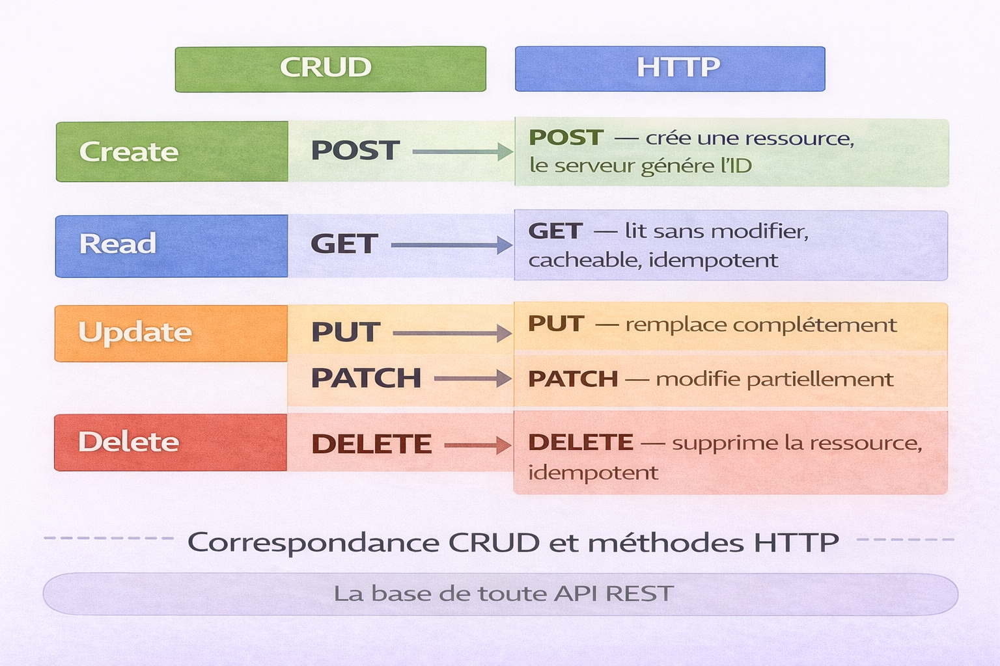
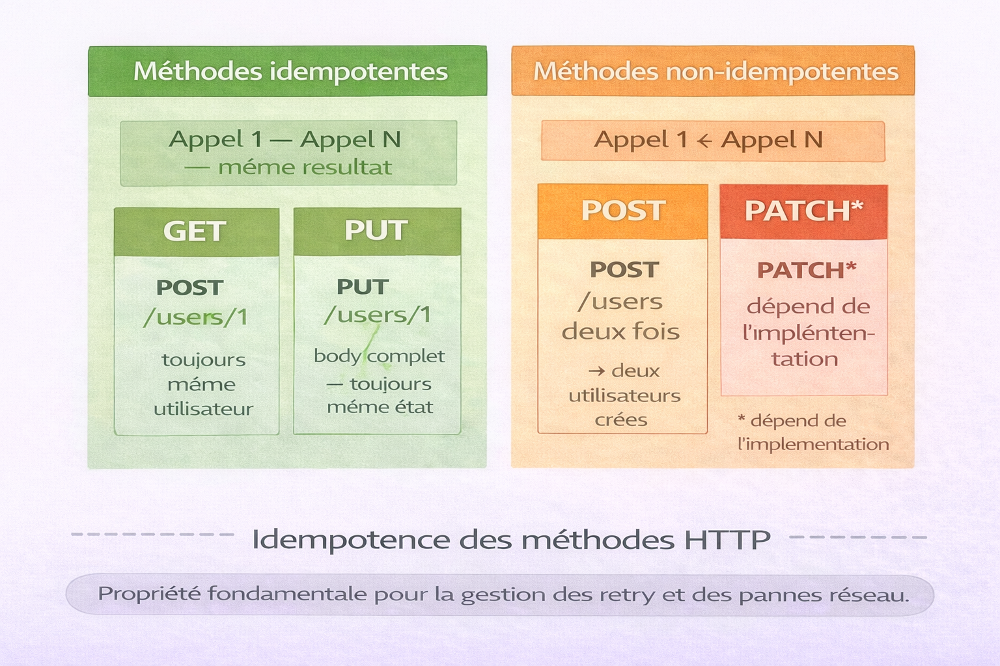
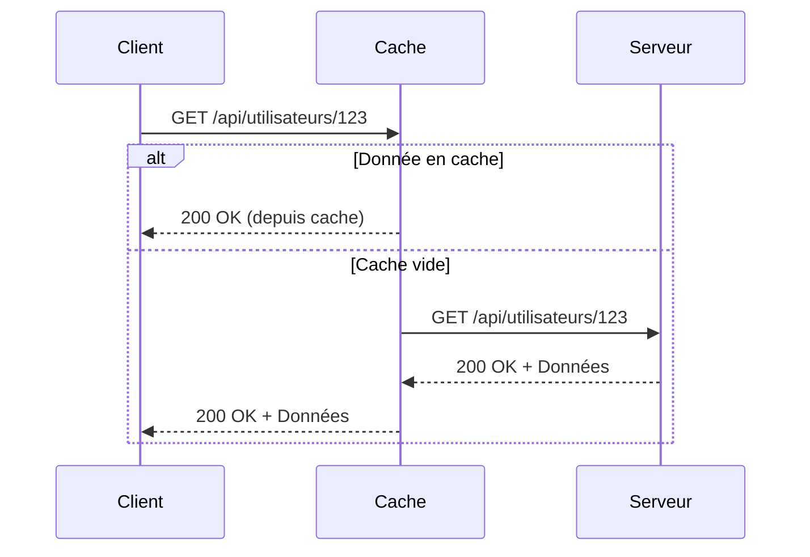
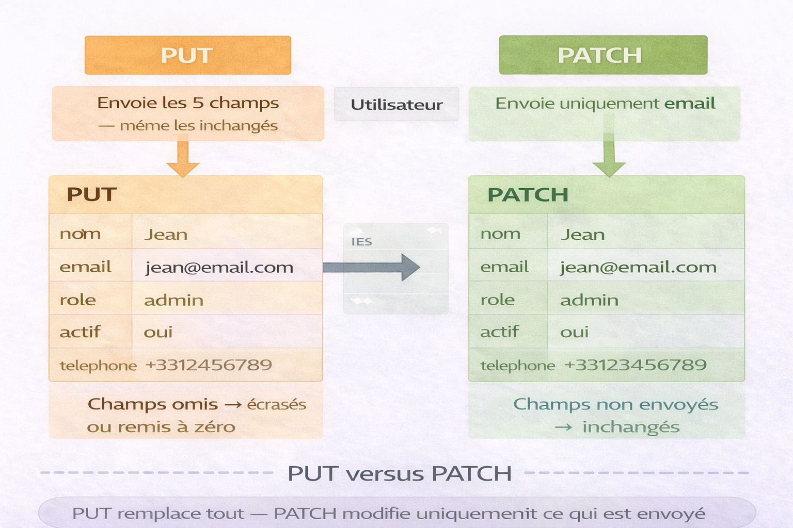
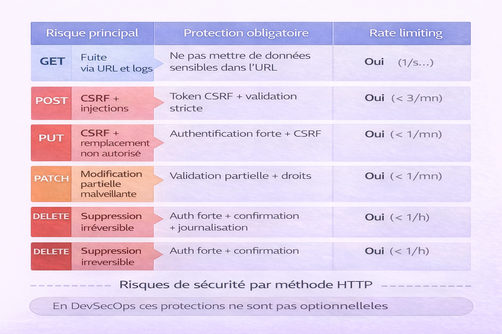

# HTTP — Méthodes

<div
  class="omny-meta"
  data-level="🟢 Débutant & 🟡 Intermédiaire"
  data-version="1.1"
  data-time="40-45 minutes">
</div>

!!! quote "Analogie"
    _Une bibliothèque où vous pouvez effectuer différentes actions : consulter un livre (GET), emprunter un livre en remplissant un formulaire (POST), remplacer complètement un livre endommagé (PUT), corriger quelques pages (PATCH), ou retourner un livre (DELETE). Chaque action suit des règles précises. Les méthodes HTTP fonctionnent exactement ainsi : elles définissent les actions possibles sur les ressources web, chacune avec ses propres caractéristiques et règles de sécurité._

Le protocole **HTTP** (HyperText Transfer Protocol) constitue le fondement de la communication sur le web. Chaque interaction entre un client — navigateur, application mobile, API — et un serveur utilise une **méthode HTTP** qui définit l'intention de la requête et comment le serveur doit la traiter.

Comprendre les méthodes HTTP devient indispensable dès que l'on développe des applications web, consomme des APIs ou sécurise des systèmes. Chaque méthode possède des caractéristiques spécifiques concernant la sécurité, l'idempotence et les effets de bord qui impactent directement l'architecture et la fiabilité des applications.

!!! info "Pourquoi c'est important"
    Les méthodes HTTP régissent toutes les interactions client-serveur, déterminent la sécurité des opérations, permettent la conception d'APIs REST et influencent les performances et la mise en cache. Une utilisation incorrecte peut créer des vulnérabilités graves — modifications non autorisées, fuites de données, soumissions dupliquées.

Ce document nécessite une compréhension basique du fonctionnement du web — un client envoie une requête à un serveur qui répond avec des données. Si ces concepts semblent flous, consulter d'abord le chapitre sur les bases des réseaux.

<br />

---

## Les méthodes HTTP principales

!!! note "L'image ci-dessous représente la correspondance entre les opérations CRUD et les méthodes HTTP. C'est la carte mentale de référence à mémoriser avant d'aborder les caractéristiques de chaque méthode."



<p><em>Les quatre opérations CRUD (Create, Read, Update, Delete) se traduisent en méthodes HTTP selon une convention bien établie. GET lit sans modifier. POST crée une nouvelle ressource dont l'identifiant est généré par le serveur. PUT remplace entièrement une ressource existante à un identifiant connu. PATCH applique une modification partielle. DELETE supprime la ressource. Cette correspondance est la base de toute API REST.</em></p>

Le protocole HTTP définit neuf méthodes officielles, mais cinq méthodes couvrent la majorité des usages dans les applications modernes.

!!! note "L'image ci-dessous illustre le concept d'idempotence par méthode — la propriété la plus souvent mal comprise et la plus critique pour la fiabilité des APIs."



<p><em>Une méthode est idempotente si appeler N fois la même requête produit le même résultat qu'un seul appel. GET, PUT et DELETE sont idempotentes — les appeler plusieurs fois ne crée pas d'effets supplémentaires. POST n'est pas idempotente — appeler POST deux fois sur /utilisateurs crée deux utilisateurs distincts. PATCH peut être idempotente ou non selon l'implémentation. Cette propriété est fondamentale pour la gestion des retry et des pannes réseau.</em></p>

| Méthode | Action | Idempotente | Sécurisée | Corps requête | Corps réponse |
|---|---|:---:|:---:|:---:|:---:|
| GET | Récupérer une ressource | Oui | Oui | Non | Oui |
| POST | Créer une ressource | Non | Non | Oui | Oui |
| PUT | Remplacer complètement | Oui | Non | Oui | Oui |
| PATCH | Modifier partiellement | Non* | Non | Oui | Oui |
| DELETE | Supprimer une ressource | Oui | Non | Non** | Oui |

_* PATCH peut être idempotente selon l'implémentation. ** DELETE peut avoir un corps dans certaines implémentations non-standard._

!!! info "Propriétés clés"
    **Idempotente** : plusieurs appels identiques produisent le même résultat qu'un seul appel. **Sécurisée** : n'a aucun effet de bord sur le serveur — lecture seule.

<br />

---

## Méthode GET

La méthode **GET** demande la représentation d'une ressource spécifiée. C'est la méthode la plus utilisée sur le web.

!!! info "Caractéristiques"
    GET est sécurisée — ne doit jamais modifier de données sur le serveur. Elle est idempotente et ses réponses peuvent être mises en cache. Les paramètres transitent dans l'URL et sont donc visibles.

### Fonctionnement avec cache


```mermaid
sequenceDiagram
    participant Client
    participant Cache
    participant Serveur

    Client->>Cache: GET /api/utilisateurs/123
    alt Donnée en cache
        Cache-->>Client: 200 OK (depuis cache)
    else Cache vide
        Cache->>Serveur: GET /api/utilisateurs/123
        Serveur-->>Cache: 200 OK + Données
        Cache-->>Client: 200 OK + Données
    end
```

Le cache intercepte la requête GET et retourne une réponse locale si la ressource est déjà connue et valide. Ce mécanisme est crucial pour les performances — une requête servitée depuis le cache ne charge pas le backend.

### Exemples par langage

=== ":fontawesome-brands-python: Python"

    ```python title="Python — GET simple et GET avec paramètres"
    import requests

    # Récupération simple d'une ressource
    response = requests.get('https://api.example.com/utilisateurs/123')

    if response.status_code == 200:
        utilisateur = response.json()
        print(f"Nom: {utilisateur['nom']}")
    else:
        print(f"Erreur: {response.status_code}")

    # GET avec paramètres de requête
    params = {
        'page': 1,
        'limite': 10,
        'tri': 'nom'
    }
    response = requests.get('https://api.example.com/utilisateurs', params=params)
    # URL finale : /utilisateurs?page=1&limite=10&tri=nom
    ```

=== ":fontawesome-brands-js: JavaScript"

    ```javascript title="JavaScript — GET avec Fetch API et URLSearchParams"
    // Récupération avec Fetch API
    fetch('https://api.example.com/utilisateurs/123')
        .then(response => {
            if (!response.ok) {
                throw new Error(`Erreur HTTP: ${response.status}`);
            }
            return response.json();
        })
        .then(utilisateur => {
            console.log(`Nom: ${utilisateur.nom}`);
        })
        .catch(error => {
            console.error('Erreur:', error);
        });

    // GET avec paramètres via URLSearchParams
    const params = new URLSearchParams({
        page: 1,
        limite: 10,
        tri: 'nom'
    });
    fetch(`https://api.example.com/utilisateurs?${params}`);
    ```

=== ":fontawesome-brands-php: PHP"

    ```php title="PHP — GET avec cURL et paramètres"
    <?php
    // Récupération avec cURL
    $ch = curl_init('https://api.example.com/utilisateurs/123');
    curl_setopt($ch, CURLOPT_RETURNTRANSFER, true);
    curl_setopt($ch, CURLOPT_HTTPGET, true);

    $response = curl_exec($ch);
    $httpCode = curl_getinfo($ch, CURLINFO_HTTP_CODE);
    curl_close($ch);

    if ($httpCode === 200) {
        $utilisateur = json_decode($response, true);
        echo "Nom: {$utilisateur['nom']}\n";
    } else {
        echo "Erreur: $httpCode\n";
    }

    // GET avec paramètres
    $params = http_build_query([
        'page' => 1,
        'limite' => 10,
        'tri' => 'nom'
    ]);
    $url = "https://api.example.com/utilisateurs?$params";
    ?>
    ```

=== ":fontawesome-brands-golang: Golang"

    ```go title="Go — GET simple et GET avec paramètres d'URL"
    package main

    import (
        "encoding/json"
        "fmt"
        "net/http"
        "net/url"
    )

    type Utilisateur struct {
        ID  int    `json:"id"`
        Nom string `json:"nom"`
    }

    func main() {
        // Récupération simple
        resp, err := http.Get("https://api.example.com/utilisateurs/123")
        if err != nil {
            fmt.Printf("Erreur: %v\n", err)
            return
        }
        defer resp.Body.Close()

        if resp.StatusCode == http.StatusOK {
            var utilisateur Utilisateur
            json.NewDecoder(resp.Body).Decode(&utilisateur)
            fmt.Printf("Nom: %s\n", utilisateur.Nom)
        }

        // GET avec paramètres
        baseURL, _ := url.Parse("https://api.example.com/utilisateurs")
        params := url.Values{}
        params.Add("page", "1")
        params.Add("limite", "10")
        baseURL.RawQuery = params.Encode()

        http.Get(baseURL.String())
    }
    ```

=== ":fontawesome-brands-rust: Rust"

    ```rust title="Rust — GET avec reqwest et paramètres de requête"
    use reqwest;
    use serde::Deserialize;

    #[derive(Debug, Deserialize)]
    struct Utilisateur {
        id: u32,
        nom: String,
    }

    #[tokio::main]
    async fn main() -> Result<(), Box<dyn std::error::Error>> {
        // Récupération simple
        let response = reqwest::get("https://api.example.com/utilisateurs/123")
            .await?;

        if response.status().is_success() {
            let utilisateur: Utilisateur = response.json().await?;
            println!("Nom: {}", utilisateur.nom);
        }

        // GET avec paramètres
        let client = reqwest::Client::new();
        let response = client
            .get("https://api.example.com/utilisateurs")
            .query(&[("page", "1"), ("limite", "10"), ("tri", "nom")])
            .send()
            .await?;

        Ok(())
    }
    ```

!!! warning "Sécurité GET — données sensibles interdites dans l'URL"
    Ne jamais transmettre de données sensibles dans l'URL avec GET. Les URLs apparaissent dans les logs serveur, l'historique du navigateur, les logs des proxies et firewalls, et les en-têtes Referer lors de la navigation. Utiliser POST pour les mots de passe, tokens ou informations personnelles.

<br />

---

## Méthode POST

La méthode **POST** soumet une entité à la ressource spécifiée, causant un changement d'état ou des effets de bord sur le serveur. C'est la méthode standard pour créer de nouvelles ressources.

!!! info "Caractéristiques"
    POST est non-sécurisée — elle modifie l'état du serveur. Elle est non-idempotente — chaque appel crée potentiellement une nouvelle ressource. Les données transitent dans le corps de la requête et ne sont pas visibles dans l'URL. Elle est flexible : peut créer, mettre à jour ou déclencher des actions.

### Exemples par langage

=== ":fontawesome-brands-python: Python"

    ```python title="Python — POST JSON et upload de fichier"
    import requests

    # Création d'un utilisateur
    nouveau_utilisateur = {
        'nom': 'Alice Dupont',
        'email': 'alice@example.com',
        'role': 'admin'
    }

    response = requests.post(
        'https://api.example.com/utilisateurs',
        json=nouveau_utilisateur,
        headers={'Content-Type': 'application/json'}
    )

    if response.status_code == 201:       # 201 Created
        utilisateur_cree = response.json()
        print(f"Créé avec ID: {utilisateur_cree['id']}")
    elif response.status_code == 400:     # 400 Bad Request
        print(f"Erreur validation: {response.json()['erreurs']}")

    # Upload de fichier
    files = {'fichier': open('document.pdf', 'rb')}
    response = requests.post(
        'https://api.example.com/documents',
        files=files
    )
    ```

=== ":fontawesome-brands-js: JavaScript"

    ```javascript title="JavaScript — POST JSON et upload avec FormData"
    // Création d'un utilisateur avec Fetch
    const nouveauUtilisateur = {
        nom: 'Alice Dupont',
        email: 'alice@example.com',
        role: 'admin'
    };

    fetch('https://api.example.com/utilisateurs', {
        method: 'POST',
        headers: {
            'Content-Type': 'application/json',
        },
        body: JSON.stringify(nouveauUtilisateur)
    })
    .then(response => {
        if (response.status === 201) {
            return response.json();
        } else if (response.status === 400) {
            throw new Error('Erreur de validation');
        }
    })
    .then(utilisateurCree => {
        console.log(`Créé avec ID: ${utilisateurCree.id}`);
    })
    .catch(error => console.error('Erreur:', error));

    // Upload de fichier avec FormData
    const formData = new FormData();
    formData.append('fichier', fileInput.files[0]);

    fetch('https://api.example.com/documents', {
        method: 'POST',
        body: formData  // Le navigateur définit automatiquement le Content-Type
    });
    ```

=== ":fontawesome-brands-php: PHP"

    ```php title="PHP — POST JSON avec cURL"
    <?php
    $nouveau_utilisateur = [
        'nom'   => 'Alice Dupont',
        'email' => 'alice@example.com',
        'role'  => 'admin'
    ];

    $ch = curl_init('https://api.example.com/utilisateurs');
    curl_setopt($ch, CURLOPT_POST, true);
    curl_setopt($ch, CURLOPT_POSTFIELDS, json_encode($nouveau_utilisateur));
    curl_setopt($ch, CURLOPT_RETURNTRANSFER, true);
    curl_setopt($ch, CURLOPT_HTTPHEADER, [
        'Content-Type: application/json'
    ]);

    $response = curl_exec($ch);
    $httpCode = curl_getinfo($ch, CURLINFO_HTTP_CODE);
    curl_close($ch);

    if ($httpCode === 201) {
        $utilisateur_cree = json_decode($response, true);
        echo "Créé avec ID: {$utilisateur_cree['id']}\n";
    }
    ?>
    ```

=== ":fontawesome-brands-golang: Golang"

    ```go title="Go — POST JSON avec encoding/json"
    package main

    import (
        "bytes"
        "encoding/json"
        "fmt"
        "net/http"
    )

    type NouvelUtilisateur struct {
        Nom   string `json:"nom"`
        Email string `json:"email"`
        Role  string `json:"role"`
    }

    func main() {
        utilisateur := NouvelUtilisateur{
            Nom:   "Alice Dupont",
            Email: "alice@example.com",
            Role:  "admin",
        }

        jsonData, _ := json.Marshal(utilisateur)

        resp, err := http.Post(
            "https://api.example.com/utilisateurs",
            "application/json",
            bytes.NewBuffer(jsonData),
        )
        if err != nil {
            fmt.Printf("Erreur: %v\n", err)
            return
        }
        defer resp.Body.Close()

        if resp.StatusCode == http.StatusCreated {
            var result map[string]interface{}
            json.NewDecoder(resp.Body).Decode(&result)
            fmt.Printf("Créé avec ID: %v\n", result["id"])
        }
    }
    ```

=== ":fontawesome-brands-rust: Rust"

    ```rust title="Rust — POST JSON avec reqwest et serde"
    use reqwest;
    use serde::{Deserialize, Serialize};

    #[derive(Serialize)]
    struct NouvelUtilisateur {
        nom: String,
        email: String,
        role: String,
    }

    #[derive(Deserialize)]
    struct UtilisateurCree {
        id: u32,
        nom: String,
    }

    #[tokio::main]
    async fn main() -> Result<(), Box<dyn std::error::Error>> {
        let utilisateur = NouvelUtilisateur {
            nom:   "Alice Dupont".to_string(),
            email: "alice@example.com".to_string(),
            role:  "admin".to_string(),
        };

        let client = reqwest::Client::new();
        let response = client
            .post("https://api.example.com/utilisateurs")
            .json(&utilisateur)
            .send()
            .await?;

        if response.status() == reqwest::StatusCode::CREATED {
            let cree: UtilisateurCree = response.json().await?;
            println!("Créé avec ID: {}", cree.id);
        }

        Ok(())
    }
    ```

!!! danger "Sécurité POST — protection CSRF obligatoire"
    POST modifie l'état du serveur et nécessite une protection CSRF (Cross-Site Request Forgery). Implémenter systématiquement des tokens CSRF sur les formulaires, la vérification de l'origine via les en-têtes Origin et Referer, une authentification robuste et une validation stricte des données entrantes.

<br />

---

## Méthode PUT

La méthode **PUT** remplace **toutes les représentations actuelles** de la ressource cible par le contenu de la requête. Elle est idempotente — appeler PUT plusieurs fois avec les mêmes données produit le même résultat qu'un seul appel.

!!! info "Caractéristiques"
    PUT est idempotente — N appels équivalent à 1 appel. Elle remplace la ressource complètement — tout champ omis est effacé ou remis à sa valeur par défaut. Elle peut créer une ressource si elle n'existe pas encore. Le client spécifie l'URI complète incluant l'identifiant.

### PUT vs POST

| Critère | PUT | POST |
|---|---|---|
| Idempotence | Idempotente | Non-idempotente |
| URI | Le client spécifie `/users/123` | Le serveur génère l'identifiant |
| Action | Remplace complètement | Crée une nouvelle ressource |
| Appels multiples | Même résultat | Crée plusieurs ressources |

### Exemples par langage

=== ":fontawesome-brands-python: Python"

    ```python title="Python — PUT remplacement complet d'une ressource"
    import requests

    # Remplacement complet d'un utilisateur — tous les champs requis
    utilisateur_complet = {
        'id':            123,
        'nom':           'Alice Dupont Modifié',
        'email':         'alice.nouveau@example.com',
        'role':          'admin',
        'actif':         True,
        'date_creation': '2025-01-01'
    }

    response = requests.put(
        'https://api.example.com/utilisateurs/123',
        json=utilisateur_complet
    )

    if response.status_code == 200:    # 200 OK — mis à jour
        print("Utilisateur mis à jour")
    elif response.status_code == 201:  # 201 Created — créé
        print("Utilisateur créé")
    ```

=== ":fontawesome-brands-js: JavaScript"

    ```javascript title="JavaScript — PUT remplacement complet avec Fetch"
    const utilisateurComplet = {
        id:           123,
        nom:          'Alice Dupont Modifié',
        email:        'alice.nouveau@example.com',
        role:         'admin',
        actif:        true,
        dateCreation: '2025-01-01'
    };

    fetch('https://api.example.com/utilisateurs/123', {
        method: 'PUT',
        headers: {
            'Content-Type': 'application/json',
        },
        body: JSON.stringify(utilisateurComplet)
    })
    .then(response => {
        if (response.status === 200) {
            console.log('Utilisateur mis à jour');
        } else if (response.status === 201) {
            console.log('Utilisateur créé');
        }
        return response.json();
    });
    ```

=== ":fontawesome-brands-php: PHP"

    ```php title="PHP — PUT avec CURLOPT_CUSTOMREQUEST"
    <?php
    $utilisateur_complet = [
        'id'            => 123,
        'nom'           => 'Alice Dupont Modifié',
        'email'         => 'alice.nouveau@example.com',
        'role'          => 'admin',
        'actif'         => true,
        'date_creation' => '2025-01-01'
    ];

    $ch = curl_init('https://api.example.com/utilisateurs/123');
    curl_setopt($ch, CURLOPT_CUSTOMREQUEST, 'PUT');
    curl_setopt($ch, CURLOPT_POSTFIELDS, json_encode($utilisateur_complet));
    curl_setopt($ch, CURLOPT_RETURNTRANSFER, true);
    curl_setopt($ch, CURLOPT_HTTPHEADER, [
        'Content-Type: application/json'
    ]);

    $response = curl_exec($ch);
    $httpCode = curl_getinfo($ch, CURLINFO_HTTP_CODE);
    curl_close($ch);
    ?>
    ```

=== ":fontawesome-brands-golang: Golang"

    ```go title="Go — PUT avec http.NewRequest"
    package main

    import (
        "bytes"
        "encoding/json"
        "net/http"
    )

    func main() {
        utilisateur := map[string]interface{}{
            "id":           123,
            "nom":          "Alice Dupont Modifié",
            "email":        "alice.nouveau@example.com",
            "role":         "admin",
            "actif":        true,
            "dateCreation": "2025-01-01",
        }

        jsonData, _ := json.Marshal(utilisateur)

        req, _ := http.NewRequest(
            "PUT",
            "https://api.example.com/utilisateurs/123",
            bytes.NewBuffer(jsonData),
        )
        req.Header.Set("Content-Type", "application/json")

        client := &http.Client{}
        resp, _ := client.Do(req)
        defer resp.Body.Close()
    }
    ```

=== ":fontawesome-brands-rust: Rust"

    ```rust title="Rust — PUT avec reqwest et serde"
    use reqwest;
    use serde::Serialize;

    #[derive(Serialize)]
    struct Utilisateur {
        id:            u32,
        nom:           String,
        email:         String,
        role:          String,
        actif:         bool,
        date_creation: String,
    }

    #[tokio::main]
    async fn main() -> Result<(), Box<dyn std::error::Error>> {
        let utilisateur = Utilisateur {
            id:            123,
            nom:           "Alice Dupont Modifié".to_string(),
            email:         "alice.nouveau@example.com".to_string(),
            role:          "admin".to_string(),
            actif:         true,
            date_creation: "2025-01-01".to_string(),
        };

        let client = reqwest::Client::new();
        client
            .put("https://api.example.com/utilisateurs/123")
            .json(&utilisateur)
            .send()
            .await?;

        Ok(())
    }
    ```

!!! warning "PUT remplace toute la ressource"
    PUT remplace l'intégralité de la ressource. Tout champ omis dans le corps de la requête sera effacé ou remis à sa valeur par défaut. Pour des modifications partielles, utiliser PATCH.

<br />

---

## Méthode PATCH

La méthode **PATCH** applique des **modifications partielles** à une ressource. Contrairement à PUT qui remplace entièrement, PATCH ne modifie que les champs spécifiés.

!!! note "L'image ci-dessous illustre la différence fondamentale entre PUT et PATCH sur une ressource existante. La confusion entre les deux est une des erreurs de conception d'API les plus courantes."



<p><em>PUT envoie la représentation complète de la ressource — les champs non inclus sont écrasés. PATCH envoie uniquement les modifications — les champs non inclus restent inchangés. Sur un utilisateur avec dix champs, modifier uniquement l'email avec PUT nécessite d'envoyer les dix champs ; avec PATCH, un seul champ suffit. PATCH est plus efficace en bande passante mais nécessite une logique de fusion côté serveur.</em></p>

!!! info "Caractéristiques"
    PATCH applique une modification partielle — seuls les champs envoyés sont modifiés. Elle est potentiellement idempotente selon l'implémentation. Elle supporte plusieurs formats standardisés : JSON Patch (RFC 6902) et JSON Merge Patch (RFC 7396).

### Exemples par langage

=== ":fontawesome-brands-python: Python"

    ```python title="Python — PATCH simple et JSON Patch RFC 6902"
    import requests

    # Modification partielle — uniquement l'email
    modifications = {
        'email': 'alice.nouveau@example.com'
    }

    response = requests.patch(
        'https://api.example.com/utilisateurs/123',
        json=modifications
    )

    # JSON Patch (RFC 6902) — format standardisé avec opérations explicites
    json_patch = [
        {
            'op':    'replace',
            'path':  '/email',
            'value': 'alice.nouveau@example.com'
        },
        {
            'op':    'add',
            'path':  '/telephone',
            'value': '+33123456789'
        }
    ]

    response = requests.patch(
        'https://api.example.com/utilisateurs/123',
        json=json_patch,
        headers={'Content-Type': 'application/json-patch+json'}
    )
    ```

=== ":fontawesome-brands-js: JavaScript"

    ```javascript title="JavaScript — PATCH simple et JSON Patch RFC 6902"
    // Modification partielle simple
    const modifications = {
        email: 'alice.nouveau@example.com'
    };

    fetch('https://api.example.com/utilisateurs/123', {
        method: 'PATCH',
        headers: {
            'Content-Type': 'application/json',
        },
        body: JSON.stringify(modifications)
    });

    // JSON Patch (RFC 6902) — opérations explicites
    const jsonPatch = [
        {
            op:    'replace',
            path:  '/email',
            value: 'alice.nouveau@example.com'
        },
        {
            op:    'add',
            path:  '/telephone',
            value: '+33123456789'
        }
    ];

    fetch('https://api.example.com/utilisateurs/123', {
        method: 'PATCH',
        headers: {
            'Content-Type': 'application/json-patch+json',
        },
        body: JSON.stringify(jsonPatch)
    });
    ```

=== ":fontawesome-brands-php: PHP"

    ```php title="PHP — PATCH avec CURLOPT_CUSTOMREQUEST"
    <?php
    $modifications = [
        'email' => 'alice.nouveau@example.com'
    ];

    $ch = curl_init('https://api.example.com/utilisateurs/123');
    curl_setopt($ch, CURLOPT_CUSTOMREQUEST, 'PATCH');
    curl_setopt($ch, CURLOPT_POSTFIELDS, json_encode($modifications));
    curl_setopt($ch, CURLOPT_RETURNTRANSFER, true);
    curl_setopt($ch, CURLOPT_HTTPHEADER, [
        'Content-Type: application/json'
    ]);

    $response = curl_exec($ch);
    curl_close($ch);
    ?>
    ```

=== ":fontawesome-brands-golang: Golang"

    ```go title="Go — PATCH avec http.NewRequest"
    package main

    import (
        "bytes"
        "encoding/json"
        "net/http"
    )

    func main() {
        modifications := map[string]string{
            "email": "alice.nouveau@example.com",
        }

        jsonData, _ := json.Marshal(modifications)

        req, _ := http.NewRequest(
            "PATCH",
            "https://api.example.com/utilisateurs/123",
            bytes.NewBuffer(jsonData),
        )
        req.Header.Set("Content-Type", "application/json")

        client := &http.Client{}
        resp, _ := client.Do(req)
        defer resp.Body.Close()
    }
    ```

=== ":fontawesome-brands-rust: Rust"

    ```rust title="Rust — PATCH avec serde_json::json!"
    use reqwest;
    use serde_json::json;

    #[tokio::main]
    async fn main() -> Result<(), Box<dyn std::error::Error>> {
        let modifications = json!({
            "email": "alice.nouveau@example.com"
        });

        let client = reqwest::Client::new();
        client
            .patch("https://api.example.com/utilisateurs/123")
            .json(&modifications)
            .send()
            .await?;

        Ok(())
    }
    ```

<br />

---

## Méthode DELETE

La méthode **DELETE** supprime la ressource spécifiée. Elle est idempotente — supprimer une ressource déjà supprimée ne change pas l'état final du système.

### Exemples par langage

=== ":fontawesome-brands-python: Python"

    ```python title="Python — DELETE avec gestion des codes de retour"
    import requests

    response = requests.delete('https://api.example.com/utilisateurs/123')

    if response.status_code == 204:    # 204 No Content — suppression réussie
        print("Utilisateur supprimé avec succès")
    elif response.status_code == 404:  # 404 Not Found — déjà supprimé ou inexistant
        print("Utilisateur déjà supprimé ou inexistant")
    elif response.status_code == 403:  # 403 Forbidden — droits insuffisants
        print("Pas les droits pour supprimer")
    ```

=== ":fontawesome-brands-js: JavaScript"

    ```javascript title="JavaScript — DELETE avec Fetch"
    fetch('https://api.example.com/utilisateurs/123', {
        method: 'DELETE'
    })
    .then(response => {
        if (response.status === 204) {
            console.log('Utilisateur supprimé');
        } else if (response.status === 404) {
            console.log('Utilisateur inexistant');
        }
    });
    ```

=== ":fontawesome-brands-php: PHP"

    ```php title="PHP — DELETE avec CURLOPT_CUSTOMREQUEST"
    <?php
    $ch = curl_init('https://api.example.com/utilisateurs/123');
    curl_setopt($ch, CURLOPT_CUSTOMREQUEST, 'DELETE');
    curl_setopt($ch, CURLOPT_RETURNTRANSFER, true);

    $response = curl_exec($ch);
    $httpCode = curl_getinfo($ch, CURLINFO_HTTP_CODE);
    curl_close($ch);

    if ($httpCode === 204) {
        echo "Utilisateur supprimé\n";
    }
    ?>
    ```

=== ":fontawesome-brands-golang: Golang"

    ```go title="Go — DELETE avec http.NewRequest"
    package main

    import "net/http"

    func main() {
        req, _ := http.NewRequest(
            "DELETE",
            "https://api.example.com/utilisateurs/123",
            nil,
        )

        client := &http.Client{}
        resp, _ := client.Do(req)
        defer resp.Body.Close()

        if resp.StatusCode == http.StatusNoContent {
            // Suppression réussie
        }
    }
    ```

=== ":fontawesome-brands-rust: Rust"

    ```rust title="Rust — DELETE avec reqwest"
    use reqwest;

    #[tokio::main]
    async fn main() -> Result<(), Box<dyn std::error::Error>> {
        let client = reqwest::Client::new();
        let response = client
            .delete("https://api.example.com/utilisateurs/123")
            .send()
            .await?;

        if response.status() == reqwest::StatusCode::NO_CONTENT {
            println!("Utilisateur supprimé");
        }

        Ok(())
    }
    ```

!!! danger "Sécurité DELETE — irréversible par nature"
    DELETE est irréversible et potentiellement destructeur. Implémenter une confirmation avant suppression d'entités critiques, préférer le soft delete (marquage comme supprimé) à la suppression physique, journaliser toutes les suppressions, exiger une authentification forte avec vérification des droits, et maintenir des sauvegardes avant toute suppression de données importantes.

<br />

---

## Codes de statut par méthode

| Méthode | Succès typique | Erreurs courantes |
|---|---|---|
| GET | 200 OK, 304 Not Modified | 404 Not Found, 403 Forbidden |
| POST | 201 Created, 200 OK | 400 Bad Request, 409 Conflict |
| PUT | 200 OK, 201 Created | 400 Bad Request, 404 Not Found |
| PATCH | 200 OK | 400 Bad Request, 404 Not Found |
| DELETE | 204 No Content | 404 Not Found, 403 Forbidden |

!!! info "Documentation complète des codes"
    Pour une liste exhaustive de tous les codes de statut HTTP avec leurs significations précises, consulter le chapitre [Liste des codes d'erreur](../reseaux/http-codes.md).

<br />

---

## Bonnes pratiques de sécurité

!!! note "L'image ci-dessous présente une vue unifiée des risques de sécurité par méthode HTTP et les contre-mesures associées. En contexte DevSecOps, ces protections ne sont pas optionnelles."



<p><em>Chaque méthode HTTP expose une surface d'attaque différente. GET ne modifie pas l'état mais peut fuir des données sensibles via les URLs et les logs. POST et PUT exposent aux attaques CSRF et aux injections si les données ne sont pas validées. DELETE est la méthode la plus destructrice — une authentification forte et une journalisation sont non-négociables. Le rate limiting protège toutes les méthodes contre les abus et les attaques par déni de service.</em></p>

### Protection CSRF

=== ":fontawesome-brands-python: Python"

    ```python title="Python — protection CSRF avec Flask-WTF"
    from flask_wtf.csrf import CSRFProtect

    app = Flask(__name__)
    app.config['SECRET_KEY'] = 'votre-cle-secrete'
    csrf = CSRFProtect(app)

    @app.route('/api/utilisateurs', methods=['POST'])
    def creer_utilisateur():
        # CSRF vérifié automatiquement par Flask-WTF
        data = request.get_json()
        # Traitement...
    ```

=== ":fontawesome-brands-js: JavaScript"

    ```javascript title="JavaScript — token CSRF dans les en-têtes Fetch"
    // Lecture du token CSRF depuis la balise meta
    const csrfToken = document.querySelector('meta[name="csrf-token"]').content;

    fetch('https://api.example.com/utilisateurs', {
        method: 'POST',
        headers: {
            'Content-Type': 'application/json',
            'X-CSRF-Token': csrfToken
        },
        body: JSON.stringify(data)
    });
    ```

=== ":fontawesome-brands-php: PHP"

    ```php title="PHP — génération et vérification du token CSRF en session"
    <?php
    session_start();

    // Génération du token CSRF à la première visite
    if (empty($_SESSION['csrf_token'])) {
        $_SESSION['csrf_token'] = bin2hex(random_bytes(32));
    }

    // Vérification sur chaque requête POST
    if ($_SERVER['REQUEST_METHOD'] === 'POST') {
        if (!hash_equals($_SESSION['csrf_token'], $_POST['csrf_token'])) {
            die('Token CSRF invalide');
        }
        // Traitement...
    }
    ?>
    ```

### Validation stricte des données entrantes

Valider systématiquement les données côté serveur, même lorsqu'une validation existe côté client.

!!! warning "Règles de validation à appliquer"
    Utiliser une whitelist plutôt qu'une blacklist — autoriser uniquement ce qui est attendu. Typer fortement les valeurs numériques, dates et booléens. Définir une longueur maximale pour les chaînes. Vérifier le format attendu pour les emails, URLs et numéros de téléphone. Échapper systématiquement pour prévenir les injections SQL et XSS.

### Limitation de débit (Rate Limiting)

=== ":fontawesome-brands-python: Python"

    ```python title="Python — rate limiting par route avec Flask-Limiter"
    from flask_limiter import Limiter
    from flask_limiter.util import get_remote_address

    limiter = Limiter(
        app,
        key_func=get_remote_address,
        default_limits=["200 per day", "50 per hour"]
    )

    @app.route('/api/utilisateurs', methods=['POST'])
    @limiter.limit("10 per minute")
    def creer_utilisateur():
        # Maximum 10 créations par minute par adresse IP
        pass
    ```

=== ":fontawesome-brands-js: JavaScript"

    ```javascript title="JavaScript — rate limiting global avec express-rate-limit"
    const rateLimit = require('express-rate-limit');

    const limiter = rateLimit({
        windowMs: 15 * 60 * 1000, // Fenêtre de 15 minutes
        max: 100                   // Maximum 100 requêtes par fenêtre
    });

    app.use('/api/', limiter);
    ```

<br />

---

## Conclusion

!!! quote "Conclusion"
    _Les méthodes HTTP constituent le vocabulaire fondamental de toute communication web moderne. Leur maîtrise dépasse la simple connaissance syntaxique pour englober la compréhension profonde de leurs propriétés de sécurité, d'idempotence et d'impacts sur l'architecture des applications. Une utilisation correcte garantit des APIs prévisibles, performantes et sécurisées. Une utilisation incorrecte expose les systèmes à des vulnérabilités critiques — CSRF, fuites de données, soumissions dupliquées, suppressions non autorisées. L'idempotence en particulier n'est pas un détail académique : elle détermine directement la stratégie de retry lors des pannes réseau et la fiabilité des opérations distribuées._

<br />