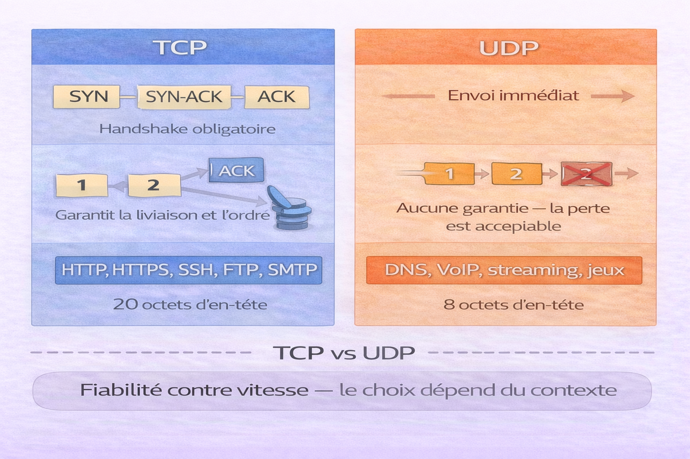
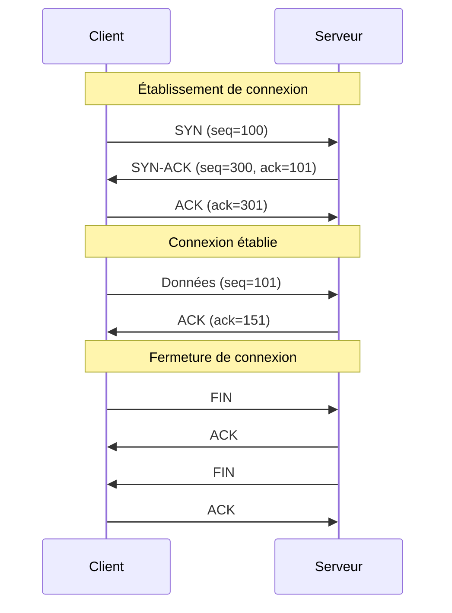
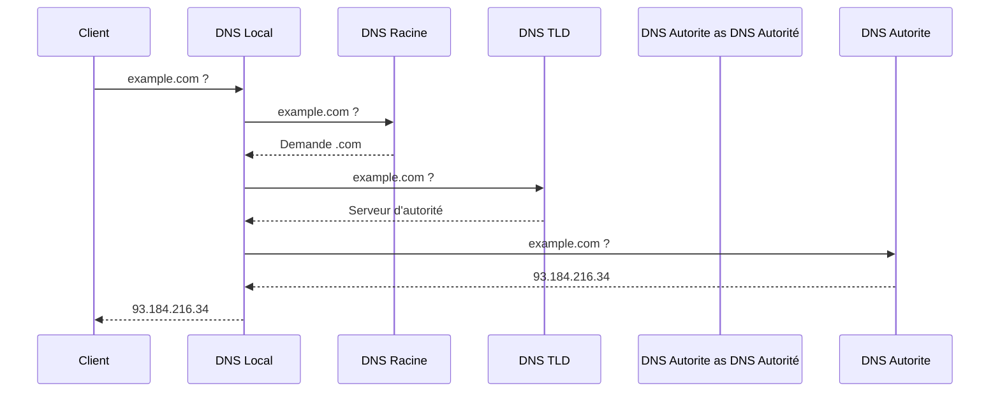
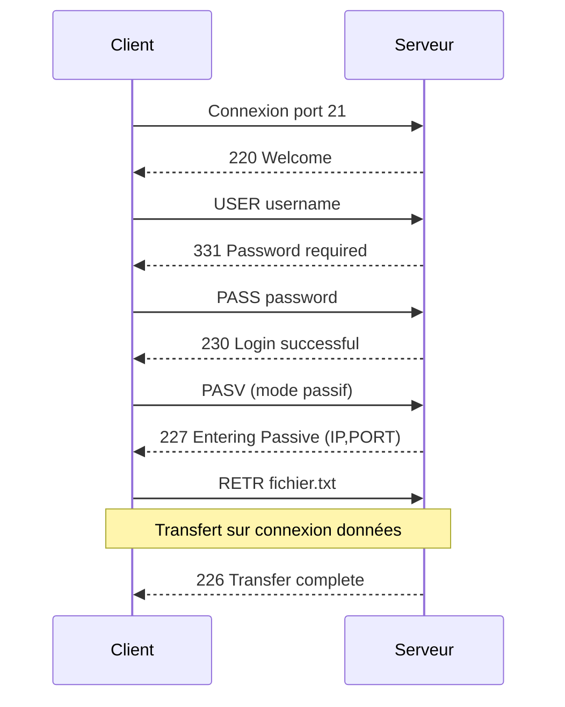
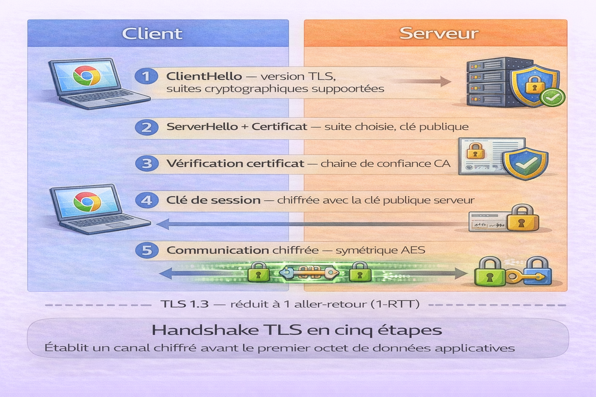
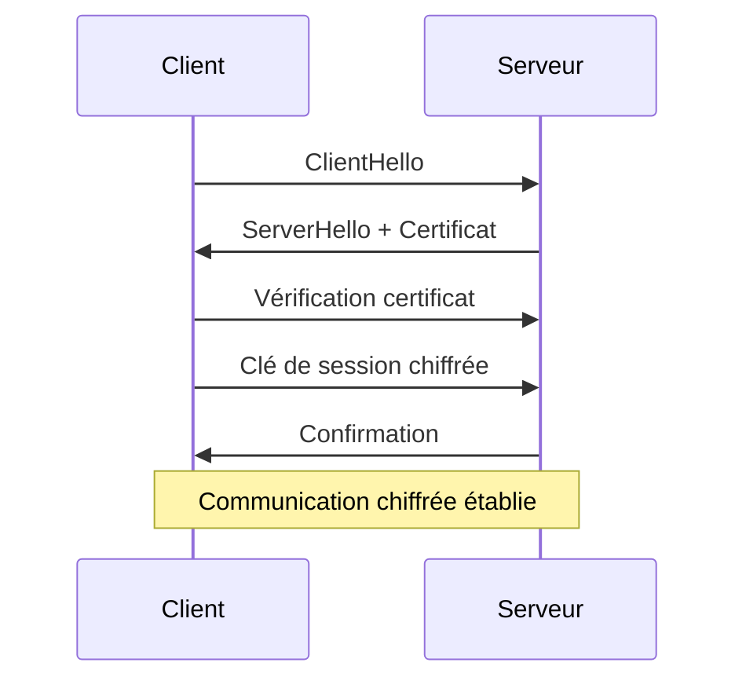
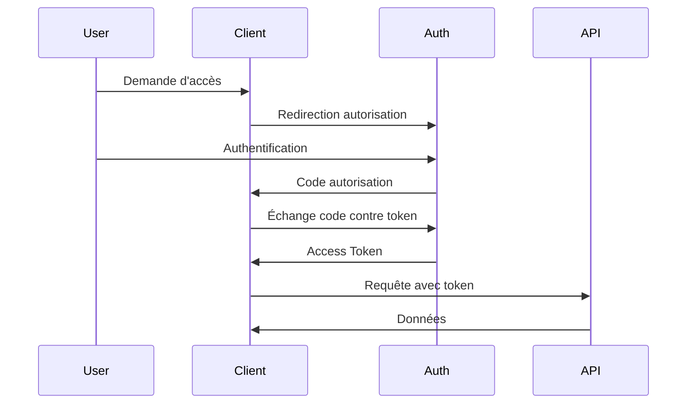
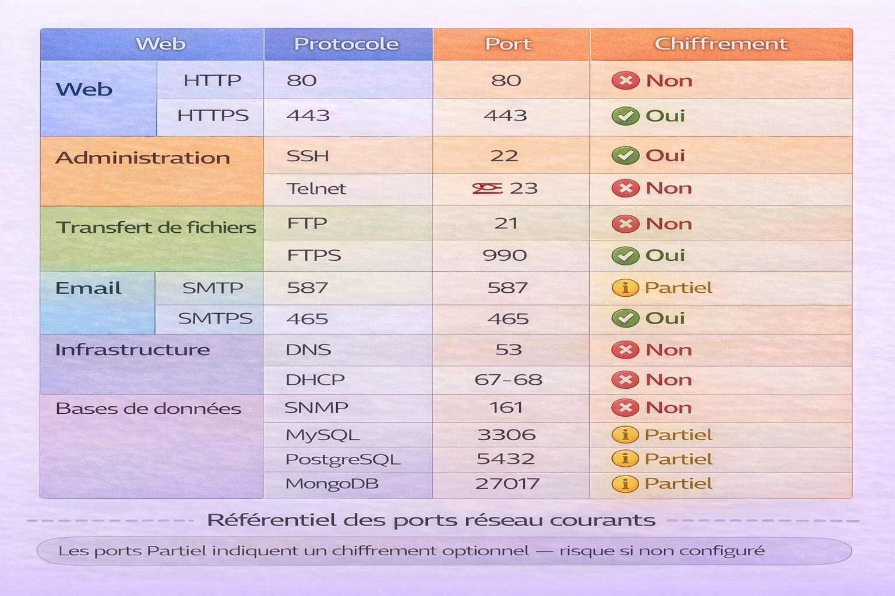

# Liste des Protocoles

<div
  class="omny-meta"
  data-level="🟢 Débutant & 🟡 Intermédiaire"
  data-version="0"
  data-time="50-60 minutes">
</div>

!!! quote "Analogie"
    _Un service postal international. Pour qu'une lettre arrive à destination, tout le monde doit suivre les mêmes règles : format des adresses, types d'envoi (courrier standard, recommandé, express), processus de tri, gestion des erreurs. Les protocoles réseau fonctionnent exactement ainsi : ce sont des ensembles de règles standardisées qui permettent à des ordinateurs de communiquer efficacement, quel que soit leur fabricant ou leur système d'exploitation._

Les protocoles réseau constituent le **langage commun** qui permet à des milliards d'appareils de communiquer à travers le monde. Chaque protocole répond à des besoins spécifiques en termes de fiabilité, vitesse, sécurité et type de données transmises.

Comprendre les protocoles réseau devient indispensable dès que l'on développe des applications distribuées, sécurise des systèmes, diagnostique des problèmes de connectivité ou conçoit des architectures réseau. Chaque protocole possède des caractéristiques uniques concernant la garantie de livraison, la gestion des erreurs, le chiffrement et les cas d'usage optimaux.

!!! info "Pourquoi c'est important"
    Les protocoles déterminent comment les données voyagent, quelles garanties existent sur leur livraison, comment gérer la sécurité et quelle performance attendre. Choisir le mauvais protocole peut compromettre la fiabilité, la sécurité ou les performances d'une application.

Ce document nécessite une compréhension basique du modèle OSI ou TCP/IP et des concepts d'adresse IP et de port. Si le mécanisme d'établissement d'une connexion réseau n'est pas encore acquis, consulter d'abord les bases des réseaux.

<br />

---

## Modèle en couches

Les protocoles présentés dans ce document s'organisent selon deux modèles de référence — OSI (7 couches) et TCP/IP (4 couches) — qui définissent comment chaque protocole s'empile et interagit avec les couches adjacentes. Ces modèles sont traités en détail dans les chapitres dédiés.

!!! info "Chapitres de référence"
    Pour comprendre où chaque protocole se positionne dans la pile réseau, consulter [Modèle OSI](../reseaux/modele-osi.md) et [Modèle TCP/IP](../reseaux/modele-tcpip.md) avant d'approfondir les protocoles individuels.

<br />

---

## Couche Transport

La couche transport gère la **communication de bout en bout** entre applications. Elle offre deux protocoles aux caractéristiques radicalement différentes.

!!! note "L'image ci-dessous compare TCP et UDP selon six critères — connexion, fiabilité, vitesse, overhead, contrôle et cas d'usage. C'est la décision architecturale la plus fréquente en développement réseau."



<p><em>TCP et UDP sont complémentaires et non interchangeables. TCP garantit la livraison et l'ordre au prix d'un overhead et d'une latence supplémentaires — indispensable pour les données critiques. UDP privilégie la vitesse en supprimant toutes les garanties — indispensable pour le temps réel où une retransmission serait pire qu'une perte. DNS utilise UDP pour les requêtes courtes mais bascule sur TCP pour les transferts de zone et les réponses dépassant 512 octets.</em></p>

### TCP — Transmission Control Protocol

TCP est un protocole **orienté connexion** qui garantit la **livraison fiable et ordonnée** des données.

!!! info "Caractéristiques"
    TCP est orienté connexion — établissement via handshake à 3 voies. Il garantit la livraison et l'ordre des paquets. Il implémente un contrôle de flux pour éviter la saturation du récepteur et un contrôle de congestion pour adapter le débit au réseau. Son en-tête minimal est de 20 octets.

#### Handshake TCP à 3 voies


```mermaid
sequenceDiagram
    participant Client
    participant Serveur

    Note over Client,Serveur: Établissement de connexion
    Client->>Serveur: SYN (seq=100)
    Serveur->>Client: SYN-ACK (seq=300, ack=101)
    Client->>Serveur: ACK (ack=301)
    Note over Client,Serveur: Connexion établie

    Client->>Serveur: Données (seq=101)
    Serveur->>Client: ACK (ack=151)

    Note over Client,Serveur: Fermeture de connexion
    Client->>Serveur: FIN
    Serveur->>Client: ACK
    Serveur->>Client: FIN
    Client->>Serveur: ACK
```

Le diagramme montre le cycle complet d'une connexion TCP : établissement en 3 échanges (SYN, SYN-ACK, ACK), transfert de données avec accusés de réception, et fermeture propre en 4 échanges (FIN, ACK, FIN, ACK).

#### Exemples par langage

=== ":fontawesome-brands-python: Python"

    ```python title="Python — serveur et client TCP avec socket"
    import socket

    # Serveur TCP
    def serveur_tcp():
        serveur = socket.socket(socket.AF_INET, socket.SOCK_STREAM)
        serveur.bind(('0.0.0.0', 8080))
        serveur.listen(5)
        print("Serveur TCP en écoute sur le port 8080")

        while True:
            client, adresse = serveur.accept()
            print(f"Connexion depuis {adresse}")

            donnees = client.recv(1024)
            print(f"Reçu : {donnees.decode()}")

            client.send(b"Message recu")
            client.close()

    # Client TCP
    def client_tcp():
        client = socket.socket(socket.AF_INET, socket.SOCK_STREAM)
        client.connect(('localhost', 8080))

        client.send(b"Bonjour serveur")

        reponse = client.recv(1024)
        print(f"Réponse : {reponse.decode()}")

        client.close()
    ```

=== ":fontawesome-brands-js: JavaScript"

    ```javascript title="Node.js — serveur et client TCP avec net"
    const net = require('net');

    // Serveur TCP
    const serveur = net.createServer((socket) => {
        console.log('Client connecté');

        socket.on('data', (data) => {
            console.log(`Reçu : ${data.toString()}`);
            socket.write('Message reçu');
        });

        socket.on('end', () => {
            console.log('Client déconnecté');
        });
    });

    serveur.listen(8080, () => {
        console.log('Serveur TCP en écoute sur le port 8080');
    });

    // Client TCP
    const client = net.createConnection({ port: 8080 }, () => {
        console.log('Connecté au serveur');
        client.write('Bonjour serveur');
    });

    client.on('data', (data) => {
        console.log(`Réponse : ${data.toString()}`);
        client.end();
    });
    ```

=== ":fontawesome-brands-php: PHP"

    ```php title="PHP — serveur et client TCP avec socket_*"
    <?php
    // Serveur TCP
    function serveur_tcp() {
        $socket = socket_create(AF_INET, SOCK_STREAM, SOL_TCP);
        socket_bind($socket, '0.0.0.0', 8080);
        socket_listen($socket, 5);

        echo "Serveur TCP en écoute sur le port 8080\n";

        while (true) {
            $client   = socket_accept($socket);
            $donnees  = socket_read($client, 1024);
            echo "Reçu : $donnees\n";

            socket_write($client, "Message reçu");
            socket_close($client);
        }
    }

    // Client TCP
    function client_tcp() {
        $socket = socket_create(AF_INET, SOCK_STREAM, SOL_TCP);
        socket_connect($socket, 'localhost', 8080);

        socket_write($socket, "Bonjour serveur");
        $reponse = socket_read($socket, 1024);
        echo "Réponse : $reponse\n";

        socket_close($socket);
    }
    ?>
    ```

=== ":fontawesome-brands-golang: Golang"

    ```go title="Go — serveur TCP concurrent avec goroutine"
    package main

    import (
        "fmt"
        "net"
    )

    // Serveur TCP
    func serveurTCP() {
        listener, _ := net.Listen("tcp", ":8080")
        defer listener.Close()
        fmt.Println("Serveur TCP en écoute sur le port 8080")

        for {
            conn, _ := listener.Accept()
            go handleConnection(conn) // Goroutine par connexion
        }
    }

    func handleConnection(conn net.Conn) {
        defer conn.Close()

        buffer := make([]byte, 1024)
        n, _ := conn.Read(buffer)
        fmt.Printf("Reçu : %s\n", buffer[:n])

        conn.Write([]byte("Message reçu"))
    }

    // Client TCP
    func clientTCP() {
        conn, _ := net.Dial("tcp", "localhost:8080")
        defer conn.Close()

        conn.Write([]byte("Bonjour serveur"))

        buffer := make([]byte, 1024)
        n, _ := conn.Read(buffer)
        fmt.Printf("Réponse : %s\n", buffer[:n])
    }
    ```

Cas d'usage TCP : applications nécessitant une livraison garantie (HTTP, HTTPS, FTP, SSH, SMTP), transferts de fichiers, bases de données, applications bancaires et financières.

<br />

### UDP — User Datagram Protocol

UDP est un protocole **sans connexion** qui privilégie la **vitesse** au détriment de la fiabilité.

!!! info "Caractéristiques"
    UDP est sans connexion — aucun établissement préalable. Il n'offre aucune garantie de livraison ni d'ordre. Son overhead est minimal — 8 octets d'en-tête contre 20 pour TCP. Il n'implémente ni contrôle de flux ni contrôle de congestion. Il supporte nativement le broadcast et le multicast.

#### Exemples par langage

=== ":fontawesome-brands-python: Python"

    ```python title="Python — serveur et client UDP avec socket SOCK_DGRAM"
    import socket

    # Serveur UDP
    def serveur_udp():
        serveur = socket.socket(socket.AF_INET, socket.SOCK_DGRAM)
        serveur.bind(('0.0.0.0', 8080))
        print("Serveur UDP en écoute sur le port 8080")

        while True:
            donnees, adresse = serveur.recvfrom(1024)
            print(f"Reçu de {adresse} : {donnees.decode()}")

            # Réponse directe — pas de connexion établie
            serveur.sendto(b"Message recu", adresse)

    # Client UDP
    def client_udp():
        client = socket.socket(socket.AF_INET, socket.SOCK_DGRAM)

        # Envoi sans connexion préalable
        client.sendto(b"Bonjour serveur", ('localhost', 8080))

        # Réception avec timeout recommandé
        client.settimeout(2)
        try:
            reponse, _ = client.recvfrom(1024)
            print(f"Réponse : {reponse.decode()}")
        except socket.timeout:
            print("Pas de réponse (timeout)")

        client.close()
    ```

=== ":fontawesome-brands-js: JavaScript"

    ```javascript title="Node.js — serveur et client UDP avec dgram"
    const dgram = require('dgram');

    // Serveur UDP
    const serveur = dgram.createSocket('udp4');

    serveur.on('message', (msg, rinfo) => {
        console.log(`Reçu de ${rinfo.address}:${rinfo.port} : ${msg}`);
        serveur.send('Message reçu', rinfo.port, rinfo.address);
    });

    serveur.bind(8080, () => {
        console.log('Serveur UDP en écoute sur le port 8080');
    });

    // Client UDP
    const client  = dgram.createSocket('udp4');
    const message = Buffer.from('Bonjour serveur');

    client.send(message, 8080, 'localhost', (err) => {
        if (err) console.error(err);
        console.log('Message envoyé');
    });

    client.on('message', (msg) => {
        console.log(`Réponse : ${msg}`);
        client.close();
    });
    ```

=== ":fontawesome-brands-php: PHP"

    ```php title="PHP — serveur et client UDP avec socket_recvfrom"
    <?php
    // Serveur UDP
    function serveur_udp() {
        $socket = socket_create(AF_INET, SOCK_DGRAM, SOL_UDP);
        socket_bind($socket, '0.0.0.0', 8080);

        echo "Serveur UDP en écoute sur le port 8080\n";

        while (true) {
            socket_recvfrom($socket, $buffer, 1024, 0, $ip, $port);
            echo "Reçu de $ip:$port : $buffer\n";

            socket_sendto($socket, "Message reçu", strlen("Message reçu"), 0, $ip, $port);
        }
    }

    // Client UDP
    function client_udp() {
        $socket  = socket_create(AF_INET, SOCK_DGRAM, SOL_UDP);
        $message = "Bonjour serveur";

        socket_sendto($socket, $message, strlen($message), 0, 'localhost', 8080);

        socket_recvfrom($socket, $buffer, 1024, 0, $ip, $port);
        echo "Réponse : $buffer\n";

        socket_close($socket);
    }
    ?>
    ```

=== ":fontawesome-brands-golang: Golang"

    ```go title="Go — serveur et client UDP avec net.ListenUDP"
    package main

    import (
        "fmt"
        "net"
    )

    // Serveur UDP
    func serveurUDP() {
        addr, _ := net.ResolveUDPAddr("udp", ":8080")
        conn, _ := net.ListenUDP("udp", addr)
        defer conn.Close()

        fmt.Println("Serveur UDP en écoute sur le port 8080")

        buffer := make([]byte, 1024)
        for {
            n, clientAddr, _ := conn.ReadFromUDP(buffer)
            fmt.Printf("Reçu de %v : %s\n", clientAddr, buffer[:n])

            conn.WriteToUDP([]byte("Message reçu"), clientAddr)
        }
    }

    // Client UDP
    func clientUDP() {
        addr, _ := net.ResolveUDPAddr("udp", "localhost:8080")
        conn, _ := net.DialUDP("udp", nil, addr)
        defer conn.Close()

        conn.Write([]byte("Bonjour serveur"))

        buffer := make([]byte, 1024)
        n, _ := conn.Read(buffer)
        fmt.Printf("Réponse : %s\n", buffer[:n])
    }
    ```

Cas d'usage UDP : streaming vidéo et audio (perte de quelques paquets acceptable), jeux en ligne (latence critique), DNS (requêtes courtes), VoIP (temps réel prioritaire), IoT (overhead minimal).

<br />

### TCP vs UDP — Comparaison

| Critère | TCP | UDP |
|---|---|---|
| Connexion | Orienté connexion — handshake | Sans connexion |
| Fiabilité | Garantie de livraison et d'ordre | Aucune garantie |
| Vitesse | Plus lent — overhead | Très rapide |
| Overhead | 20 octets minimum | 8 octets |
| Contrôle de flux | Oui | Non |
| Détection d'erreurs | Oui avec retransmission | Checksum basique |
| Ordre des paquets | Garanti | Non garanti |
| Cas d'usage | Données critiques | Temps réel |

<br />

---

## Couche Application

La couche application contient les protocoles de **haut niveau** utilisés directement par les applications.

### HTTP / HTTPS

Couvert en détail dans le chapitre [HTTP — Méthodes](../reseaux/http-methodes.md) et [Liste des codes d'erreur HTTP](../reseaux/http-codes.md).

HTTP utilise le port 80 — non chiffré, vulnérable aux interceptions. HTTPS utilise le port 443 — chiffré via TLS, à utiliser systématiquement.

### DNS — Domain Name System

Le DNS est traité en détail dans le chapitre [DNS — Notions](../reseaux/dns-notions.md). Ce chapitre couvre la hiérarchie, les types d'enregistrements, la résolution récursive, le TTL et la sécurité DNS.

Rappel rapide : DNS traduit les noms de domaine en adresses IP via une résolution hiérarchique — résolveur récursif, serveur racine, serveur TLD, serveur autoritaire. Port 53 UDP pour les requêtes standard, port 53 TCP pour les transferts de zone et les réponses dépassant 512 octets.


```mermaid
sequenceDiagram
    participant Client
    participant DNS Local
    participant DNS Racine
    participant DNS TLD
    participant DNS Autorite as DNS Autorité

    Client->>DNS Local: example.com ?
    DNS Local->>DNS Racine: example.com ?
    DNS Racine-->>DNS Local: Demande .com
    DNS Local->>DNS TLD: example.com ?
    DNS TLD-->>DNS Local: Serveur d'autorité
    DNS Local->>DNS Autorite: example.com ?
    DNS Autorite-->>DNS Local: 93.184.216.34
    DNS Local-->>Client: 93.184.216.34
```

Résolution hiérarchique DNS — la requête traverse quatre acteurs avant d'obtenir l'adresse IP finale. Le résolveur met le résultat en cache selon le TTL de l'enregistrement.

!!! danger "Sécurité DNS"
    Vulnérabilités principales : DNS Spoofing (injection de fausses réponses), DNS Cache Poisoning (corruption du cache), DNS Tunneling (exfiltration de données encodées dans des requêtes DNS), amplification DDoS (serveurs récursifs ouverts exploités pour multiplier le trafic). Protections : DNSSEC, DoH, DoT, rate limiting.

#### Résolution DNS par langage

=== ":fontawesome-brands-python: Python"

    ```python title="Python — résolution DNS avec socket et dnspython"
    import socket
    import dns.resolver  # pip install dnspython

    # Résolution simple
    ip = socket.gethostbyname('example.com')
    print(f"IP : {ip}")

    # Enregistrements A (IPv4)
    for rdata in dns.resolver.resolve('example.com', 'A'):
        print(f"A : {rdata.address}")

    # Enregistrements MX (Mail)
    for rdata in dns.resolver.resolve('example.com', 'MX'):
        print(f"MX : {rdata.preference} {rdata.exchange}")

    # Enregistrements TXT
    for rdata in dns.resolver.resolve('example.com', 'TXT'):
        print(f"TXT : {rdata.strings}")
    ```

=== ":fontawesome-brands-js: JavaScript"

    ```javascript title="Node.js — résolution DNS avec le module dns"
    const dns = require('dns');

    // Résolution simple
    dns.lookup('example.com', (err, address, family) => {
        console.log(`IP : ${address}`);
    });

    // Enregistrements IPv4
    dns.resolve4('example.com', (err, addresses) => {
        console.log(`IPv4 : ${addresses}`);
    });

    // Enregistrements MX
    dns.resolveMx('example.com', (err, addresses) => {
        addresses.forEach(mx => {
            console.log(`MX : ${mx.priority} ${mx.exchange}`);
        });
    });

    // Enregistrements TXT
    dns.resolveTxt('example.com', (err, records) => {
        console.log(`TXT : ${records}`);
    });
    ```

=== ":fontawesome-brands-php: PHP"

    ```php title="PHP — résolution DNS avec dns_get_record"
    <?php
    // Résolution simple
    $ip = gethostbyname('example.com');
    echo "IP : $ip\n";

    // Enregistrements A
    $dns = dns_get_record('example.com', DNS_A);
    foreach ($dns as $record) {
        echo "A : {$record['ip']}\n";
    }

    // Enregistrements MX
    $mx = dns_get_record('example.com', DNS_MX);
    foreach ($mx as $record) {
        echo "MX : {$record['pri']} {$record['target']}\n";
    }

    // Enregistrements TXT
    $txt = dns_get_record('example.com', DNS_TXT);
    foreach ($txt as $record) {
        echo "TXT : {$record['txt']}\n";
    }
    ?>
    ```

=== ":fontawesome-brands-golang: Golang"

    ```go title="Go — résolution DNS avec net.LookupIP, LookupMX, LookupTXT"
    package main

    import (
        "fmt"
        "net"
    )

    func main() {
        // Résolution simple
        ips, _ := net.LookupIP("example.com")
        for _, ip := range ips {
            fmt.Printf("IP : %s\n", ip)
        }

        // Enregistrements MX
        mxs, _ := net.LookupMX("example.com")
        for _, mx := range mxs {
            fmt.Printf("MX : %d %s\n", mx.Pref, mx.Host)
        }

        // Enregistrements TXT
        txts, _ := net.LookupTXT("example.com")
        for _, txt := range txts {
            fmt.Printf("TXT : %s\n", txt)
        }
    }
    ```

<br />

### FTP — File Transfer Protocol

FTP permet le **transfert de fichiers** entre client et serveur.

Port 21 pour le contrôle (commandes), port 20 pour les données (transferts actifs). Deux modes : actif et passif. Non sécurisé — le mot de passe circule en clair.


```mermaid
sequenceDiagram
    participant Client
    participant Serveur

    Client->>Serveur: Connexion port 21
    Serveur-->>Client: 220 Welcome
    Client->>Serveur: USER username
    Serveur-->>Client: 331 Password required
    Client->>Serveur: PASS password
    Serveur-->>Client: 230 Login successful
    Client->>Serveur: PASV (mode passif)
    Serveur-->>Client: 227 Entering Passive (IP,PORT)
    Client->>Serveur: RETR fichier.txt
    Note over Client,Serveur: Transfert sur connexion données
    Serveur-->>Client: 226 Transfer complete
```

Le mode passif (PASV) est nécessaire quand le client est derrière un NAT ou un pare-feu — c'est le client qui initie la connexion de données plutôt que le serveur.

=== ":fontawesome-brands-python: Python"

    ```python title="Python — client FTP avec ftplib"
    from ftplib import FTP

    ftp = FTP('ftp.example.com')
    ftp.login('username', 'password')

    # Lister les fichiers
    ftp.retrlines('LIST')

    # Télécharger un fichier
    with open('fichier_local.txt', 'wb') as f:
        ftp.retrbinary('RETR fichier_distant.txt', f.write)

    # Envoyer un fichier
    with open('fichier_local.txt', 'rb') as f:
        ftp.storbinary('STOR fichier_distant.txt', f)

    ftp.quit()
    ```

!!! danger "FTP vs SFTP vs FTPS"
    FTP : non sécurisé — mot de passe en clair sur le réseau. FTPS : FTP avec TLS/SSL sur les ports 990/989. SFTP : transfert de fichiers sur SSH, port 22 — recommandé pour tous les transferts sensibles.

<br />

### SSH — Secure Shell

SSH fournit un **accès distant sécurisé** et un **tunnel chiffré**.

Port 22. Tout le trafic est chiffré. Authentification par mot de passe ou clé publique. Peut encapsuler d'autres protocoles via le tunneling.

=== ":fontawesome-brands-python: Python"

    ```python title="Python — connexion SSH et SFTP avec paramiko"
    import paramiko  # pip install paramiko

    ssh = paramiko.SSHClient()
    ssh.set_missing_host_key_policy(paramiko.AutoAddPolicy())

    # Connexion avec mot de passe
    ssh.connect('example.com', username='user', password='pass')

    # Exécution de commande distante
    stdin, stdout, stderr = ssh.exec_command('ls -la')
    print(stdout.read().decode())

    # Connexion avec clé privée
    key = paramiko.RSAKey.from_private_key_file('/path/to/key')
    ssh.connect('example.com', username='user', pkey=key)

    # Transfert de fichier via SFTP
    sftp = ssh.open_sftp()
    sftp.put('local.txt', '/remote/path/file.txt')
    sftp.get('/remote/file.txt', 'local_copy.txt')
    sftp.close()

    ssh.close()
    ```

=== ":fontawesome-brands-js: JavaScript"

    ```javascript title="Node.js — connexion SSH avec ssh2"
    const { Client } = require('ssh2');

    const conn = new Client();
    conn.on('ready', () => {
        console.log('Connexion SSH établie');

        // Exécution de commande distante
        conn.exec('ls -la', (err, stream) => {
            stream.on('data', (data) => {
                console.log(data.toString());
            });
        });

        // Transfert de fichier via SFTP
        conn.sftp((err, sftp) => {
            sftp.fastPut('local.txt', '/remote/file.txt', (err) => {
                console.log('Upload terminé');
            });
        });
    }).connect({
        host:     'example.com',
        port:     22,
        username: 'user',
        password: 'pass'
    });
    ```

=== ":fontawesome-brands-golang: Golang"

    ```go title="Go — connexion SSH avec golang.org/x/crypto/ssh"
    package main

    import (
        "fmt"
        "golang.org/x/crypto/ssh"
    )

    func main() {
        config := &ssh.ClientConfig{
            User: "user",
            Auth: []ssh.AuthMethod{
                ssh.Password("password"),
            },
            HostKeyCallback: ssh.InsecureIgnoreHostKey(),
        }

        client, _ := ssh.Dial("tcp", "example.com:22", config)
        defer client.Close()

        // Exécution de commande distante
        session, _ := client.NewSession()
        defer session.Close()

        output, _ := session.CombinedOutput("ls -la")
        fmt.Println(string(output))
    }
    ```

!!! tip "Bonnes pratiques SSH"
    Désactiver l'authentification par mot de passe — utiliser exclusivement les clés. Changer le port par défaut pour réduire les scans automatisés. Déployer Fail2Ban pour bloquer les tentatives de brute-force. Préférer les clés ED25519 — plus sûres et plus rapides que RSA. Ajouter une authentification à deux facteurs pour les accès critiques.

<br />

### SMTP / IMAP / POP3

Protocoles pour l'**envoi et la réception d'emails**.

| Protocole | Rôle | Port standard | Port SSL/TLS |
|---|---|---|---|
| SMTP | Envoi d'emails | 25, 587 | 465 |
| IMAP | Réception avec synchronisation | 143 | 993 |
| POP3 | Réception avec téléchargement | 110 | 995 |

=== ":fontawesome-brands-python: Python"

    ```python title="Python — envoi SMTP et réception IMAP"
    import smtplib
    import imaplib
    from email.mime.text import MIMEText
    from email.mime.multipart import MIMEMultipart

    # Envoi d'email via SMTP avec STARTTLS
    def envoyer_email():
        msg            = MIMEMultipart()
        msg['From']    = 'expediteur@example.com'
        msg['To']      = 'destinataire@example.com'
        msg['Subject'] = 'Test Email'

        msg.attach(MIMEText("Ceci est un email de test", 'plain'))

        server = smtplib.SMTP('smtp.example.com', 587)
        server.starttls()
        server.login('username', 'password')
        server.send_message(msg)
        server.quit()

    # Réception via IMAP SSL
    def recevoir_emails():
        mail = imaplib.IMAP4_SSL('imap.example.com', 993)
        mail.login('username', 'password')
        mail.select('INBOX')

        status, messages = mail.search(None, 'UNSEEN')

        for num in messages[0].split():
            status, data = mail.fetch(num, '(RFC822)')
            print(data[0][1])

        mail.close()
        mail.logout()
    ```

<br />

### WebSocket

WebSocket permet une **communication bidirectionnelle en temps réel** sur une seule connexion TCP persistante.

Port 80 ou 443 — upgrade depuis HTTP ou HTTPS. Full-duplex : communication simultanée dans les deux sens. La connexion reste ouverte — pas d'overhead HTTP répété à chaque échange.

=== ":fontawesome-brands-python: Python"

    ```python title="Python — serveur et client WebSocket avec websockets"
    import asyncio
    import websockets

    # Serveur WebSocket
    async def handler(websocket, path):
        async for message in websocket:
            print(f"Reçu : {message}")
            await websocket.send(f"Echo: {message}")

    start_server = websockets.serve(handler, "localhost", 8765)

    asyncio.get_event_loop().run_until_complete(start_server)
    asyncio.get_event_loop().run_forever()

    # Client WebSocket
    async def client():
        async with websockets.connect('ws://localhost:8765') as websocket:
            await websocket.send("Hello Server")
            response = await websocket.recv()
            print(f"Réponse : {response}")
    ```

=== ":fontawesome-brands-js: JavaScript"

    ```javascript title="Node.js — serveur WebSocket avec ws et client navigateur"
    const WebSocket = require('ws');

    // Serveur WebSocket
    const wss = new WebSocket.Server({ port: 8765 });

    wss.on('connection', (ws) => {
        console.log('Client connecté');

        ws.on('message', (message) => {
            console.log(`Reçu : ${message}`);
            ws.send(`Echo: ${message}`);
        });
    });

    // Client WebSocket (navigateur natif)
    const ws = new WebSocket('ws://localhost:8765');

    ws.onopen = () => {
        ws.send('Hello Server');
    };

    ws.onmessage = (event) => {
        console.log(`Réponse : ${event.data}`);
    };
    ```

=== ":fontawesome-brands-golang: Golang"

    ```go title="Go — serveur WebSocket avec gorilla/websocket"
    package main

    import (
        "github.com/gorilla/websocket"
        "net/http"
    )

    var upgrader = websocket.Upgrader{}

    func handler(w http.ResponseWriter, r *http.Request) {
        conn, _ := upgrader.Upgrade(w, r, nil)
        defer conn.Close()

        for {
            msgType, msg, _ := conn.ReadMessage()
            conn.WriteMessage(msgType, []byte("Echo: "+string(msg)))
        }
    }

    func main() {
        http.HandleFunc("/ws", handler)
        http.ListenAndServe(":8765", nil)
    }
    ```

Cas d'usage WebSocket : chat en temps réel, applications collaboratives, jeux multijoueurs, notifications push, streaming de données.

<br />

---

## Couche Internet

### IP — Internet Protocol

IP gère l'**adressage** et le **routage** des paquets entre les hôtes.

IPv4 utilise 32 bits — environ 4,3 milliards d'adresses — sous la forme `192.168.1.1`. IPv6 utilise 128 bits — 340 undécillions d'adresses — sous la forme `2001:0db8:85a3::8a2e:0370:7334`. La pénurie d'adresses IPv4 est le moteur principal de la migration vers IPv6.

### ICMP — Internet Control Message Protocol

ICMP gère les **messages d'erreur** et de **diagnostic** entre équipements réseau.

Commandes principales : ping (Echo Request/Reply pour tester la connectivité), traceroute (trace le chemin réseau en exploitant le TTL IP).

=== ":fontawesome-brands-python: Python"

    ```python title="Python — ping et traceroute via subprocess"
    import subprocess

    # Ping — test de connectivité
    def ping(host):
        response = subprocess.run(
            ['ping', '-c', '4', host],
            capture_output=True,
            text=True
        )
        print(response.stdout)

    ping('example.com')

    # Traceroute — chemin réseau
    def traceroute(host):
        response = subprocess.run(
            ['traceroute', host],
            capture_output=True,
            text=True
        )
        print(response.stdout)
    ```

### IPsec

IPsec sécurise les communications IP via chiffrement et authentification au niveau de la couche réseau.

Mode Transport : chiffre uniquement la charge utile du paquet — utilisé entre deux hôtes. Mode Tunnel : chiffre tout le paquet IP original et l'encapsule dans un nouveau paquet — utilisé pour les VPN site-à-site.

<br />

---

## Protocoles de sécurité

### TLS/SSL — Transport Layer Security

!!! note "L'image ci-dessous représente le handshake TLS en cinq étapes. C'est le mécanisme qui protège toutes les communications HTTPS, SMTPS, IMAPS et LDAPS."



<p><em>Le handshake TLS établit un canal chiffré en cinq étapes. Le client annonce ses capacités cryptographiques (ClientHello). Le serveur sélectionne les algorithmes et envoie son certificat (ServerHello). Le client vérifie le certificat contre une autorité de certification de confiance. Le client génère une clé de session et la chiffre avec la clé publique du serveur. Les deux parties confirment et toutes les communications suivantes sont chiffrées symétriquement. TLS 1.3 réduit ce processus à un seul aller-retour.</em></p>

TLS chiffre les communications entre client et serveur — il remplace SSL, désormais obsolète.


```mermaid
sequenceDiagram
    participant Client
    participant Serveur

    Client->>Serveur: ClientHello
    Serveur->>Client: ServerHello + Certificat
    Client->>Serveur: Vérification certificat
    Client->>Serveur: Clé de session chiffrée
    Serveur->>Client: Confirmation
    Note over Client,Serveur: Communication chiffrée établie
```

| Version | Statut |
|---|---|
| SSL 2.0 / 3.0 | Obsolète et vulnérable — à désactiver impérativement |
| TLS 1.0 / 1.1 | Déprécié — ne plus utiliser |
| TLS 1.2 | Supporté — acceptable |
| TLS 1.3 | Recommandé — plus rapide et plus sécurisé |

### OAuth 2.0 / OpenID Connect

Protocoles d'**autorisation** (OAuth 2.0) et d'**authentification** (OpenID Connect) pour les APIs et applications modernes.


```mermaid
sequenceDiagram
    participant User
    participant Client
    participant Auth
    participant API

    User->>Client: Demande d'accès
    Client->>Auth: Redirection autorisation
    User->>Auth: Authentification
    Auth->>Client: Code autorisation
    Client->>Auth: Échange code contre token
    Auth->>Client: Access Token
    Client->>API: Requête avec token
    API->>Client: Données
```

OAuth 2.0 délègue l'autorisation sans partager les credentials. OpenID Connect ajoute une couche d'identité sur OAuth 2.0 via un ID Token JWT.

<br />

---

## Tableau récapitulatif des ports

!!! note "L'image ci-dessous présente les ports les plus courants classés par catégorie. En audit et en pentesting, cette cartographie est le point de départ de toute reconnaissance réseau."



<p><em>Les ports inférieurs à 1024 sont les "well-known ports" — réservés aux protocoles système. Connaître le port d'un service permet de cibler un scan (nmap -p 443), de configurer des règles firewall précises, et d'identifier des services exposés involontairement. Les ports marqués "Partiel" indiquent que le chiffrement est optionnel ou configurable — ils représentent un risque si mal configurés.</em></p>

| Protocole | Port(s) | Transport | Chiffré |
|---|---|:---:|:---:|
| HTTP | 80 | TCP | Non |
| HTTPS | 443 | TCP | Oui — TLS |
| FTP | 20-21 | TCP | Non |
| FTPS | 989-990 | TCP | Oui — TLS |
| SSH / SFTP | 22 | TCP | Oui |
| Telnet | 23 | TCP | Non — obsolète |
| SMTP | 25, 587 | TCP | Partiel |
| SMTPS | 465 | TCP | Oui — TLS |
| DNS | 53 | UDP / TCP | Non |
| DHCP | 67-68 | UDP | Non |
| POP3 | 110 | TCP | Non |
| POP3S | 995 | TCP | Oui — TLS |
| IMAP | 143 | TCP | Non |
| IMAPS | 993 | TCP | Oui — TLS |
| SNMP | 161-162 | UDP | Non |
| LDAP | 389 | TCP | Non |
| LDAPS | 636 | TCP | Oui — TLS |
| RDP | 3389 | TCP | Partiel |
| MySQL | 3306 | TCP | Partiel |
| PostgreSQL | 5432 | TCP | Partiel |
| MongoDB | 27017 | TCP | Partiel |
| Redis | 6379 | TCP | Partiel |

<br />

---

## Bonnes pratiques de sécurité

### Principe du moindre privilège

N'ouvrir que les **ports strictement nécessaires** et filtrer par adresse source.

=== ":fontawesome-brands-linux: Bash"

    ```bash title="Bash — règles iptables — restriction SSH par IP source"
    # Accepter SSH uniquement depuis une IP spécifique
    iptables -A INPUT -p tcp -s 192.168.1.100 --dport 22 -j ACCEPT
    iptables -A INPUT -p tcp --dport 22 -j DROP

    # Accepter HTTP et HTTPS depuis n'importe quelle source
    iptables -A INPUT -p tcp --dport 80 -j ACCEPT
    iptables -A INPUT -p tcp --dport 443 -j ACCEPT

    # Politique par défaut — bloquer tout le trafic entrant non autorisé
    iptables -P INPUT DROP
    ```

### Chiffrement systématique

Utiliser toujours les versions chiffrées des protocoles : HTTPS plutôt que HTTP, SFTP ou FTPS plutôt que FTP, SMTPS et IMAPS plutôt que SMTP et IMAP non chiffrés, SSH plutôt que Telnet.

### Surveillance et journalisation

Loguer toutes les connexions pour détecter les activités suspectes et alimenter les outils SIEM.

=== ":fontawesome-brands-python: Python"

    ```python title="Python — journalisation des connexions avec logging"
    import logging

    logging.basicConfig(
        filename='server.log',
        level=logging.INFO,
        format='%(asctime)s - %(levelname)s - %(message)s'
    )

    def handle_connection(addr):
        logging.info(f"Connexion depuis {addr}")
        # Traitement...
    ```

### Mise à jour régulière

Maintenir les systèmes à jour pour corriger les vulnérabilités connues — CVE publiées régulièrement sur les implémentations de TLS, OpenSSH, OpenSSL et les stacks réseau des OS.

<br />

---

## Conclusion

!!! quote "Conclusion"
    _Les protocoles réseau constituent l'infrastructure invisible qui permet au monde numérique de fonctionner. Leur compréhension dépasse la simple mémorisation de ports et de noms pour englober une vision holistique de la communication réseau, des compromis entre performance et fiabilité, et des implications de sécurité. TCP garantit la livraison au prix de la latence — UDP sacrifie la fiabilité pour la vitesse. TLS chiffre les échanges mais ne protège pas contre les erreurs de configuration. Chaque protocole a été conçu pour résoudre un problème précis. Choisir le protocole adapté, l'implémenter correctement et le sécuriser rigoureusement — c'est là que se joue la différence entre une infrastructure robuste et une surface d'attaque ouverte._

<br />