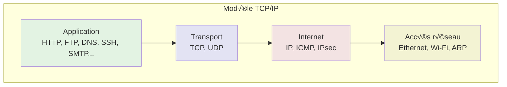
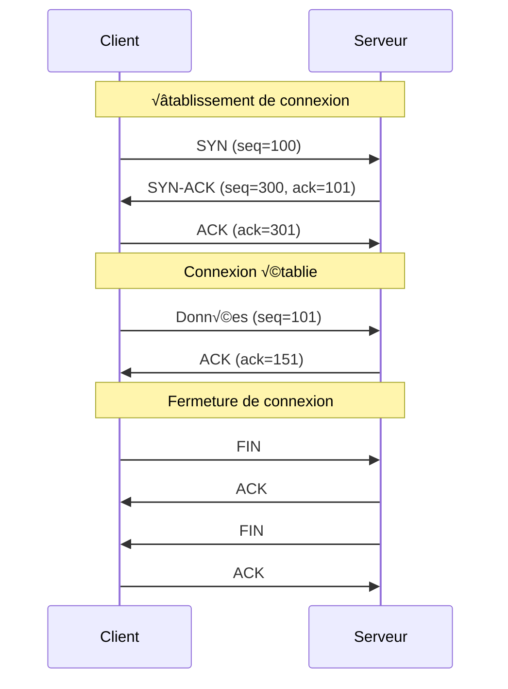
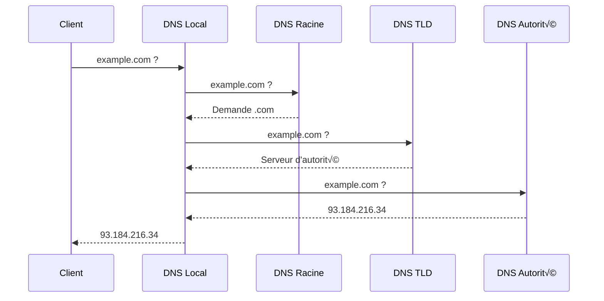
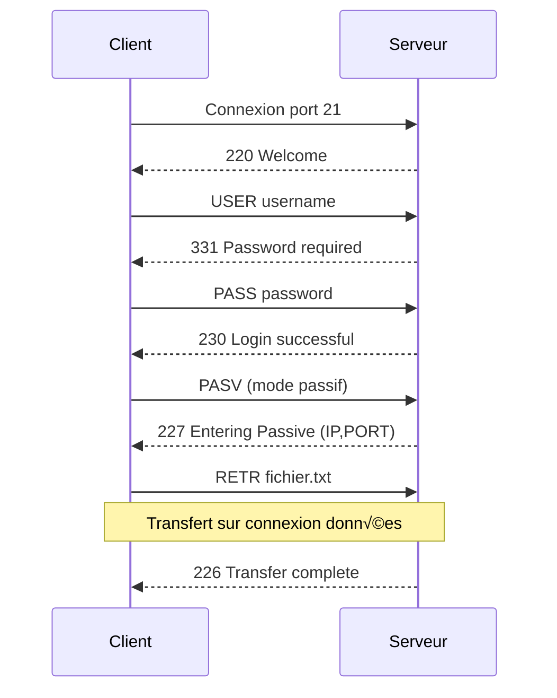
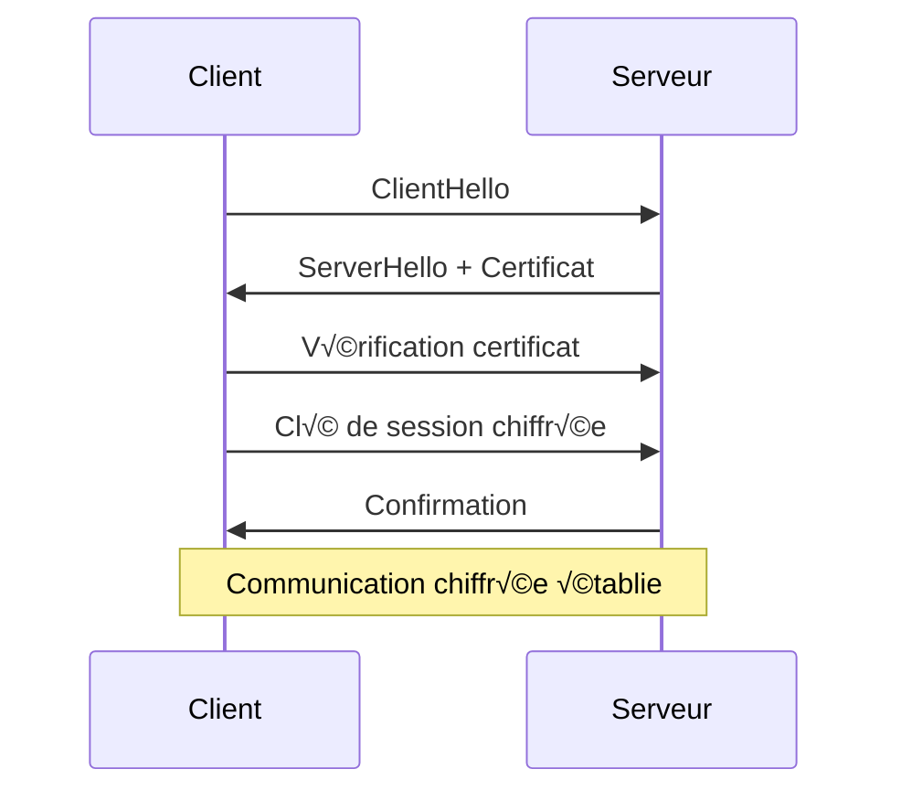
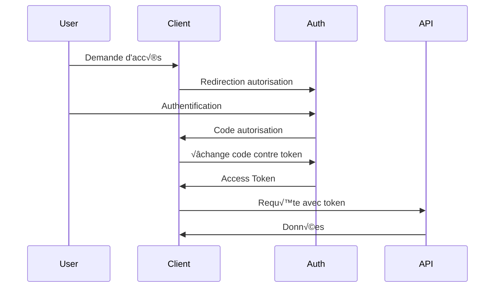

# Liste des Protocoles

## Introduction

<div
  class="omny-meta"
  data-level="🟢 Débutant & 🟡 Intermédiaire"
  data-version="0"
  data-time="50-60 minutes">
</div>

!!! quote "Analogie pédagogique"
    _Imaginez un service postal international. Pour qu'une lettre arrive à destination, tout le monde doit suivre les mêmes règles : **format des adresses**, **types d'envoi** (courrier standard, recommandé, express), **processus de tri**, **gestion des erreurs**. **Les protocoles réseau fonctionnent exactement ainsi** : ce sont des ensembles de règles standardisées qui permettent à des ordinateurs de communiquer efficacement, quel que soit leur fabricant ou leur système d'exploitation._

> Les protocoles réseau constituent le **langage commun** qui permet à des milliards d'appareils de communiquer à travers le monde. Chaque protocole répond à des **besoins spécifiques** en termes de **fiabilité**, **vitesse**, **sécurité** et **type de données** transmises.

Comprendre les protocoles réseau devient essentiel dès que vous développez des applications distribuées, sécurisez des systèmes, diagnostiquez des problèmes de connectivité ou concevez des architectures réseau. **Chaque protocole possède des caractéristiques uniques** concernant la **garantie de livraison**, la **gestion des erreurs**, le **chiffrement** et les **cas d'usage optimaux**.

!!! info "Pourquoi c'est important ?"
    Les protocoles déterminent **comment vos données voyagent**, **quelles garanties vous avez** sur leur livraison, **comment gérer la sécurité**, et **quelle performance attendre**. Choisir le mauvais protocole peut compromettre la fiabilité, la sécurité ou les performances de votre application.

## Pour repartir des bases (vrais débutants)

Ce chapitre nécessite une compréhension basique du modèle OSI ou TCP/IP et du concept d'**adresse IP** et de **port**. Si vous ne savez pas comment deux ordinateurs établissent une connexion, consultez d'abord les bases des réseaux.

!!! tip "Pensez aux protocoles comme à des contrats de livraison !"
    - **TCP** = Courrier recommandé avec accusé de réception (fiable mais plus lent)
    - **UDP** = Courrier standard (rapide mais sans garantie)
    - **HTTP/HTTPS** = Le formulaire de commande pour demander des pages web
    - **DNS** = L'annuaire qui traduit les noms en adresses

## Modèle en couches

Les protocoles s'organisent selon un **modèle en couches** où chaque couche fournit des services à la couche supérieure.


```mermaid
graph TB
    subgraph "Modèle TCP/IP"
        A[Application<br/>HTTP, FTP, DNS, SSH, SMTP...]
        B[Transport<br/>TCP, UDP]
        C[Internet<br/>IP, ICMP, IPsec]
        D[Accès réseau<br/>Ethernet, Wi-Fi, ARP]
    end
    
    A --> B
    B --> C
    C --> D
    
    style A fill:#e3f3e3
    style B fill:#e3e3f3
    style C fill:#f3e3e3
    style D fill:#f3f3d3
```

_Ce diagramme illustre les quatre couches du modèle TCP/IP. **Chaque couche ajoute ses propres en-têtes** et s'appuie sur les services de la couche inférieure._

## Couche Transport

La couche transport gère **la communication de bout en bout** entre applications. Elle offre deux protocoles principaux aux caractéristiques radicalement différentes.

### TCP (Transmission Control Protocol)

TCP est un protocole **orienté connexion** qui garantit la **livraison fiable et ordonnée** des données.

!!! quote "Caractéristiques TCP"
    - **Orienté connexion** : Établissement via handshake à 3 voies
    - **Fiable** : Garantit la livraison et l'ordre des paquets
    - **Contrôle de flux** : Évite la saturation du récepteur
    - **Contrôle de congestion** : Adapte le débit au réseau
    - **Overhead** : En-têtes de 20 octets minimum + mécanismes de contrôle

#### Handshake TCP à 3 voies


```mermaid
sequenceDiagram
    participant Client
    participant Serveur
    
    Note over Client,Serveur: Établissement de connexion
    Client->>Serveur: SYN (seq=100)
    Serveur->>Client: SYN-ACK (seq=300, ack=101)
    Client->>Serveur: ACK (ack=301)
    Note over Client,Serveur: Connexion établie
    
    Client->>Serveur: Données (seq=101)
    Serveur->>Client: ACK (ack=151)
    
    Note over Client,Serveur: Fermeture de connexion
    Client->>Serveur: FIN
    Serveur->>Client: ACK
    Serveur->>Client: FIN
    Client->>Serveur: ACK
```

_Ce diagramme montre le cycle complet d'une connexion TCP : **établissement** (SYN, SYN-ACK, ACK), **transfert de données** avec accusés de réception, et **fermeture** propre._

#### Utilisation de TCP

=== ":fontawesome-brands-python: Python"

    ```python
    import socket
    
    # Serveur TCP
    def serveur_tcp():
        serveur = socket.socket(socket.AF_INET, socket.SOCK_STREAM)
        serveur.bind(('0.0.0.0', 8080))
        serveur.listen(5)
        print("Serveur TCP en écoute sur le port 8080")
        
        while True:
            client, adresse = serveur.accept()
            print(f"Connexion depuis {adresse}")
            
            # Réception des données
            donnees = client.recv(1024)
            print(f"Reçu : {donnees.decode()}")
            
            # Envoi de réponse
            client.send(b"Message recu")
            client.close()
    
    # Client TCP
    def client_tcp():
        client = socket.socket(socket.AF_INET, socket.SOCK_STREAM)
        client.connect(('localhost', 8080))
        
        # Envoi de données
        client.send(b"Bonjour serveur")
        
        # Réception de réponse
        reponse = client.recv(1024)
        print(f"Réponse : {reponse.decode()}")
        
        client.close()
    ```

=== ":fontawesome-brands-js: JavaScript"

    ```javascript
    // Node.js - Serveur TCP
    const net = require('net');
    
    const serveur = net.createServer((socket) => {
        console.log('Client connecté');
        
        socket.on('data', (data) => {
            console.log(`Reçu : ${data.toString()}`);
            socket.write('Message reçu');
        });
        
        socket.on('end', () => {
            console.log('Client déconnecté');
        });
    });
    
    serveur.listen(8080, () => {
        console.log('Serveur TCP en écoute sur le port 8080');
    });
    
    // Client TCP
    const client = net.createConnection({ port: 8080 }, () => {
        console.log('Connecté au serveur');
        client.write('Bonjour serveur');
    });
    
    client.on('data', (data) => {
        console.log(`Réponse : ${data.toString()}`);
        client.end();
    });
    ```

=== ":fontawesome-brands-php: PHP"

    ```php
    <?php
    // Serveur TCP
    function serveur_tcp() {
        $socket = socket_create(AF_INET, SOCK_STREAM, SOL_TCP);
        socket_bind($socket, '0.0.0.0', 8080);
        socket_listen($socket, 5);
        
        echo "Serveur TCP en écoute sur le port 8080\n";
        
        while (true) {
            $client = socket_accept($socket);
            $donnees = socket_read($client, 1024);
            echo "Reçu : $donnees\n";
            
            socket_write($client, "Message reçu");
            socket_close($client);
        }
    }
    
    // Client TCP
    function client_tcp() {
        $socket = socket_create(AF_INET, SOCK_STREAM, SOL_TCP);
        socket_connect($socket, 'localhost', 8080);
        
        socket_write($socket, "Bonjour serveur");
        $reponse = socket_read($socket, 1024);
        echo "Réponse : $reponse\n";
        
        socket_close($socket);
    }
    ?>
    ```

=== ":fontawesome-brands-golang: Golang"

    ```go
    package main
    import (
        "fmt"
        "net"
    )
    
    // Serveur TCP
    func serveurTCP() {
        listener, _ := net.Listen("tcp", ":8080")
        defer listener.Close()
        fmt.Println("Serveur TCP en écoute sur le port 8080")
        
        for {
            conn, _ := listener.Accept()
            go handleConnection(conn)
        }
    }
    
    func handleConnection(conn net.Conn) {
        defer conn.Close()
        
        buffer := make([]byte, 1024)
        n, _ := conn.Read(buffer)
        fmt.Printf("Reçu : %s\n", buffer[:n])
        
        conn.Write([]byte("Message reçu"))
    }
    
    // Client TCP
    func clientTCP() {
        conn, _ := net.Dial("tcp", "localhost:8080")
        defer conn.Close()
        
        conn.Write([]byte("Bonjour serveur"))
        
        buffer := make([]byte, 1024)
        n, _ := conn.Read(buffer)
        fmt.Printf("Réponse : %s\n", buffer[:n])
    }
    ```

=== ":fontawesome-brands-rust: Rust"

    ```rust
    use std::net::{TcpListener, TcpStream};
    use std::io::{Read, Write};
    
    // Serveur TCP
    fn serveur_tcp() {
        let listener = TcpListener::bind("0.0.0.0:8080").unwrap();
        println!("Serveur TCP en écoute sur le port 8080");
        
        for stream in listener.incoming() {
            match stream {
                Ok(stream) => {
                    std::thread::spawn(|| handle_client(stream));
                }
                Err(e) => eprintln!("Erreur: {}", e),
            }
        }
    }
    
    fn handle_client(mut stream: TcpStream) {
        let mut buffer = [0; 1024];
        stream.read(&mut buffer).unwrap();
        println!("Reçu : {}", String::from_utf8_lossy(&buffer));
        
        stream.write(b"Message recu").unwrap();
    }
    
    // Client TCP
    fn client_tcp() {
        let mut stream = TcpStream::connect("localhost:8080").unwrap();
        
        stream.write(b"Bonjour serveur").unwrap();
        
        let mut buffer = [0; 1024];
        stream.read(&mut buffer).unwrap();
        println!("Réponse : {}", String::from_utf8_lossy(&buffer));
    }
    ```

**Cas d'usage TCP :**

- Applications nécessitant une livraison garantie (HTTP, HTTPS, FTP, SSH, SMTP)
- Transferts de fichiers
- Bases de données
- Applications bancaires et financières

### UDP (User Datagram Protocol)

UDP est un protocole **sans connexion** qui privilégie la **vitesse** au détriment de la fiabilité.

!!! quote "Caractéristiques UDP"
    - **Sans connexion** : Pas d'établissement préalable
    - **Non fiable** : Aucune garantie de livraison ou d'ordre
    - **Rapide** : Overhead minimal (8 octets d'en-tête)
    - **Pas de contrôle** : Ni de flux ni de congestion
    - **Broadcast/Multicast** : Support natif

#### Utilisation de UDP

=== ":fontawesome-brands-python: Python"

    ```python
    import socket
    
    # Serveur UDP
    def serveur_udp():
        serveur = socket.socket(socket.AF_INET, socket.SOCK_DGRAM)
        serveur.bind(('0.0.0.0', 8080))
        print("Serveur UDP en écoute sur le port 8080")
        
        while True:
            donnees, adresse = serveur.recvfrom(1024)
            print(f"Reçu de {adresse} : {donnees.decode()}")
            
            # Réponse directe sans connexion établie
            serveur.sendto(b"Message recu", adresse)
    
    # Client UDP
    def client_udp():
        client = socket.socket(socket.AF_INET, socket.SOCK_DGRAM)
        
        # Envoi sans connexion préalable
        client.sendto(b"Bonjour serveur", ('localhost', 8080))
        
        # Réception (avec timeout recommandé)
        client.settimeout(2)
        try:
            reponse, _ = client.recvfrom(1024)
            print(f"Réponse : {reponse.decode()}")
        except socket.timeout:
            print("Pas de réponse (timeout)")
        
        client.close()
    ```

=== ":fontawesome-brands-js: JavaScript"

    ```javascript
    // Node.js - Serveur UDP
    const dgram = require('dgram');
    
    const serveur = dgram.createSocket('udp4');
    
    serveur.on('message', (msg, rinfo) => {
        console.log(`Reçu de ${rinfo.address}:${rinfo.port} : ${msg}`);
        
        // Réponse
        serveur.send('Message reçu', rinfo.port, rinfo.address);
    });
    
    serveur.bind(8080, () => {
        console.log('Serveur UDP en écoute sur le port 8080');
    });
    
    // Client UDP
    const client = dgram.createSocket('udp4');
    const message = Buffer.from('Bonjour serveur');
    
    client.send(message, 8080, 'localhost', (err) => {
        if (err) console.error(err);
        console.log('Message envoyé');
    });
    
    client.on('message', (msg) => {
        console.log(`Réponse : ${msg}`);
        client.close();
    });
    ```

=== ":fontawesome-brands-php: PHP"

    ```php
    <?php
    // Serveur UDP
    function serveur_udp() {
        $socket = socket_create(AF_INET, SOCK_DGRAM, SOL_UDP);
        socket_bind($socket, '0.0.0.0', 8080);
        
        echo "Serveur UDP en écoute sur le port 8080\n";
        
        while (true) {
            socket_recvfrom($socket, $buffer, 1024, 0, $ip, $port);
            echo "Reçu de $ip:$port : $buffer\n";
            
            socket_sendto($socket, "Message reçu", strlen("Message reçu"), 0, $ip, $port);
        }
    }
    
    // Client UDP
    function client_udp() {
        $socket = socket_create(AF_INET, SOCK_DGRAM, SOL_UDP);
        
        $message = "Bonjour serveur";
        socket_sendto($socket, $message, strlen($message), 0, 'localhost', 8080);
        
        socket_recvfrom($socket, $buffer, 1024, 0, $ip, $port);
        echo "Réponse : $buffer\n";
        
        socket_close($socket);
    }
    ?>
    ```

=== ":fontawesome-brands-golang: Golang"

    ```go
    package main
    import (
        "fmt"
        "net"
    )
    
    // Serveur UDP
    func serveurUDP() {
        addr, _ := net.ResolveUDPAddr("udp", ":8080")
        conn, _ := net.ListenUDP("udp", addr)
        defer conn.Close()
        
        fmt.Println("Serveur UDP en écoute sur le port 8080")
        
        buffer := make([]byte, 1024)
        for {
            n, clientAddr, _ := conn.ReadFromUDP(buffer)
            fmt.Printf("Reçu de %v : %s\n", clientAddr, buffer[:n])
            
            conn.WriteToUDP([]byte("Message reçu"), clientAddr)
        }
    }
    
    // Client UDP
    func clientUDP() {
        addr, _ := net.ResolveUDPAddr("udp", "localhost:8080")
        conn, _ := net.DialUDP("udp", nil, addr)
        defer conn.Close()
        
        conn.Write([]byte("Bonjour serveur"))
        
        buffer := make([]byte, 1024)
        n, _ := conn.Read(buffer)
        fmt.Printf("Réponse : %s\n", buffer[:n])
    }
    ```

=== ":fontawesome-brands-rust: Rust"

    ```rust
    use std::net::UdpSocket;
    
    // Serveur UDP
    fn serveur_udp() {
        let socket = UdpSocket::bind("0.0.0.0:8080").unwrap();
        println!("Serveur UDP en écoute sur le port 8080");
        
        let mut buffer = [0; 1024];
        loop {
            let (n, src) = socket.recv_from(&mut buffer).unwrap();
            println!("Reçu de {} : {}", src, String::from_utf8_lossy(&buffer[..n]));
            
            socket.send_to(b"Message recu", src).unwrap();
        }
    }
    
    // Client UDP
    fn client_udp() {
        let socket = UdpSocket::bind("0.0.0.0:0").unwrap();
        socket.connect("localhost:8080").unwrap();
        
        socket.send(b"Bonjour serveur").unwrap();
        
        let mut buffer = [0; 1024];
        let n = socket.recv(&mut buffer).unwrap();
        println!("Réponse : {}", String::from_utf8_lossy(&buffer[..n]));
    }
    ```

**Cas d'usage UDP :**

- Streaming vidéo/audio (perte de quelques paquets acceptable)
- Jeux en ligne (latence critique)
- DNS (requêtes courtes)
- VoIP (temps réel prioritaire)
- IoT (overhead minimal)

### TCP vs UDP : Comparaison

| Critère | TCP | UDP |
|---------|-----|-----|
| **Connexion** | Orienté connexion (handshake) | Sans connexion |
| **Fiabilité** | Garantie de livraison et d'ordre | Aucune garantie |
| **Vitesse** | Plus lent (overhead) | Très rapide |
| **Overhead** | 20+ octets d'en-tête | 8 octets d'en-tête |
| **Contrôle de flux** | Oui | Non |
| **Détection d'erreurs** | Oui avec retransmission | Checksum basique |
| **Ordre des paquets** | Garanti | Non garanti |
| **Cas d'usage** | Données critiques | Temps réel |

## Couche Application

La couche application contient les protocoles de **haut niveau** utilisés directement par les applications.

### HTTP / HTTPS

Déjà couvert en détail dans le chapitre **HTTP - Méthodes**.

**Rappel des caractéristiques :**

- **HTTP** : Port 80, non chiffré, vulnérable aux interceptions
- **HTTPS** : Port 443, chiffré via TLS/SSL, sécurisé

### DNS (Domain Name System)

DNS traduit les **noms de domaine** en **adresses IP**.


```mermaid
sequenceDiagram
    participant Client
    participant DNS Local
    participant DNS Racine
    participant DNS TLD
    participant DNS Autorité
    
    Client->>DNS Local: example.com ?
    DNS Local->>DNS Racine: example.com ?
    DNS Racine-->>DNS Local: Demande .com
    DNS Local->>DNS TLD: example.com ?
    DNS TLD-->>DNS Local: Serveur d'autorité
    DNS Local->>DNS Autorité: example.com ?
    DNS Autorité-->>DNS Local: 93.184.216.34
    DNS Local-->>Client: 93.184.216.34
```

_Ce diagramme illustre la **résolution DNS hiérarchique** où la requête traverse plusieurs serveurs avant d'obtenir l'adresse IP finale._

#### Utilisation de DNS

=== ":fontawesome-brands-python: Python"

    ```python
    import socket
    import dns.resolver  # pip install dnspython
    
    # Résolution simple
    ip = socket.gethostbyname('example.com')
    print(f"IP : {ip}")
    
    # Résolution DNS détaillée
    resolver = dns.resolver.Resolver()
    
    # Enregistrements A (IPv4)
    for rdata in resolver.resolve('example.com', 'A'):
        print(f"A : {rdata.address}")
    
    # Enregistrements MX (Mail)
    for rdata in resolver.resolve('example.com', 'MX'):
        print(f"MX : {rdata.preference} {rdata.exchange}")
    
    # Enregistrements TXT
    for rdata in resolver.resolve('example.com', 'TXT'):
        print(f"TXT : {rdata.strings}")
    ```

=== ":fontawesome-brands-js: JavaScript"

    ```javascript
    // Node.js
    const dns = require('dns');
    
    // Résolution simple
    dns.lookup('example.com', (err, address, family) => {
        console.log(`IP : ${address}`);
    });
    
    // Résolution détaillée
    dns.resolve4('example.com', (err, addresses) => {
        console.log(`IPv4 : ${addresses}`);
    });
    
    dns.resolveMx('example.com', (err, addresses) => {
        addresses.forEach(mx => {
            console.log(`MX : ${mx.priority} ${mx.exchange}`);
        });
    });
    
    dns.resolveTxt('example.com', (err, records) => {
        console.log(`TXT : ${records}`);
    });
    ```

=== ":fontawesome-brands-php: PHP"

    ```php
    <?php
    // Résolution simple
    $ip = gethostbyname('example.com');
    echo "IP : $ip\n";
    
    // Enregistrements DNS détaillés
    $dns = dns_get_record('example.com', DNS_A);
    foreach ($dns as $record) {
        echo "A : {$record['ip']}\n";
    }
    
    $mx = dns_get_record('example.com', DNS_MX);
    foreach ($mx as $record) {
        echo "MX : {$record['pri']} {$record['target']}\n";
    }
    
    $txt = dns_get_record('example.com', DNS_TXT);
    foreach ($txt as $record) {
        echo "TXT : {$record['txt']}\n";
    }
    ?>
    ```

=== ":fontawesome-brands-golang: Golang"

    ```go
    package main
    import (
        "fmt"
        "net"
    )
    
    func main() {
        // Résolution simple
        ips, _ := net.LookupIP("example.com")
        for _, ip := range ips {
            fmt.Printf("IP : %s\n", ip)
        }
        
        // Enregistrements MX
        mxs, _ := net.LookupMX("example.com")
        for _, mx := range mxs {
            fmt.Printf("MX : %d %s\n", mx.Pref, mx.Host)
        }
        
        // Enregistrements TXT
        txts, _ := net.LookupTXT("example.com")
        for _, txt := range txts {
            fmt.Printf("TXT : %s\n", txt)
        }
    }
    ```

=== ":fontawesome-brands-rust: Rust"

    ```rust
    use std::net::ToSocketAddrs;
    
    fn main() {
        // Résolution simple
        let addrs = "example.com:80"
            .to_socket_addrs()
            .unwrap();
        
        for addr in addrs {
            println!("IP : {}", addr.ip());
        }
        
        // Pour des résolutions DNS plus avancées,
        // utiliser la crate trust-dns-resolver
    }
    ```

**Ports DNS :**

- **Port 53 UDP** : Requêtes standard
- **Port 53 TCP** : Transferts de zone, réponses >512 octets

!!! danger "Sécurité DNS"
    **Vulnérabilités DNS :**
    
    - **DNS Spoofing** : Injection de fausses réponses
    - **DNS Cache Poisoning** : Corruption du cache
    - **DNS Tunneling** : Exfiltration de données via DNS
    - **DDoS par amplification DNS** : Utilisation de DNS pour amplifier des attaques
    
    **Protections :**
    
    - **DNSSEC** : Signatures cryptographiques des enregistrements
    - **DNS over HTTPS (DoH)** : Chiffrement des requêtes
    - **DNS over TLS (DoT)** : Alternative chiffrée
    - **Limitation de taux** : Protection contre l'amplification

### FTP (File Transfer Protocol)

FTP permet le **transfert de fichiers** entre client et serveur.

**Caractéristiques :**

- **Port 21** : Contrôle (commandes)
- **Port 20** : Données (transferts)
- **Modes** : Actif ou Passif
- **Non sécurisé** : Mot de passe en clair


```mermaid
sequenceDiagram
    participant Client
    participant Serveur
    
    Client->>Serveur: Connexion port 21
    Serveur-->>Client: 220 Welcome
    Client->>Serveur: USER username
    Serveur-->>Client: 331 Password required
    Client->>Serveur: PASS password
    Serveur-->>Client: 230 Login successful
    Client->>Serveur: PASV (mode passif)
    Serveur-->>Client: 227 Entering Passive (IP,PORT)
    Client->>Serveur: RETR fichier.txt
    Note over Client,Serveur: Transfert sur connexion données
    Serveur-->>Client: 226 Transfer complete
```

=== ":fontawesome-brands-python: Python"

    ```python
    from ftplib import FTP
    
    # Connexion FTP
    ftp = FTP('ftp.example.com')
    ftp.login('username', 'password')
    
    # Lister les fichiers
    ftp.retrlines('LIST')
    
    # Télécharger un fichier
    with open('fichier_local.txt', 'wb') as f:
        ftp.retrbinary('RETR fichier_distant.txt', f.write)
    
    # Upload un fichier
    with open('fichier_local.txt', 'rb') as f:
        ftp.storbinary('STOR fichier_distant.txt', f)
    
    ftp.quit()
    ```

!!! danger "FTP vs SFTP vs FTPS"
    - **FTP** : Non sécurisé, mot de passe en clair
    - **FTPS** : FTP avec TLS/SSL (ports 990/989)
    - **SFTP** : FTP sur SSH (port 22), recommandé
    
    **Utilisez toujours SFTP** pour les transferts sensibles !

### SSH (Secure Shell)

SSH fournit un **accès distant sécurisé** et un **tunnel chiffré**.

**Caractéristiques :**

- **Port 22**
- **Chiffrement fort** : Tout le trafic est chiffré
- **Authentification** : Par mot de passe ou clé publique
- **Tunneling** : Peut encapsuler d'autres protocoles

=== ":fontawesome-brands-python: Python"

    ```python
    import paramiko  # pip install paramiko
    
    # Connexion SSH
    ssh = paramiko.SSHClient()
    ssh.set_missing_host_key_policy(paramiko.AutoAddPolicy())
    
    # Connexion avec mot de passe
    ssh.connect('example.com', username='user', password='pass')
    
    # Exécution de commande
    stdin, stdout, stderr = ssh.exec_command('ls -la')
    print(stdout.read().decode())
    
    # Connexion avec clé privée
    key = paramiko.RSAKey.from_private_key_file('/path/to/key')
    ssh.connect('example.com', username='user', pkey=key)
    
    # Transfert de fichier (SFTP)
    sftp = ssh.open_sftp()
    sftp.put('local.txt', '/remote/path/file.txt')
    sftp.get('/remote/file.txt', 'local_copy.txt')
    sftp.close()
    
    ssh.close()
    ```

=== ":fontawesome-brands-js: JavaScript"

    ```javascript
    // Node.js avec ssh2
    const { Client } = require('ssh2');
    
    const conn = new Client();
    conn.on('ready', () => {
        console.log('Connexion SSH établie');
        
        // Exécution de commande
        conn.exec('ls -la', (err, stream) => {
            stream.on('data', (data) => {
                console.log(data.toString());
            });
        });
        
        // SFTP
        conn.sftp((err, sftp) => {
            sftp.fastPut('local.txt', '/remote/file.txt', (err) => {
                console.log('Upload terminé');
            });
        });
    }).connect({
        host: 'example.com',
        port: 22,
        username: 'user',
        password: 'pass'
    });
    ```

=== ":fontawesome-brands-golang: Golang"

    ```go
    package main
    import (
        "golang.org/x/crypto/ssh"
        "fmt"
    )
    
    func main() {
        config := &ssh.ClientConfig{
            User: "user",
            Auth: []ssh.AuthMethod{
                ssh.Password("password"),
            },
            HostKeyCallback: ssh.InsecureIgnoreHostKey(),
        }
        
        client, _ := ssh.Dial("tcp", "example.com:22", config)
        defer client.Close()
        
        // Exécution de commande
        session, _ := client.NewSession()
        defer session.Close()
        
        output, _ := session.CombinedOutput("ls -la")
        fmt.Println(string(output))
    }
    ```

!!! tip "Bonnes pratiques SSH"
    - **Désactivez l'authentification par mot de passe** : Utilisez uniquement les clés
    - **Changez le port par défaut** : Réduisez les scans automatisés
    - **Fail2Ban** : Bloquez les tentatives de brute-force
    - **Clés ED25519** : Plus sûres et rapides que RSA
    - **Authentification à deux facteurs** : Ajoutez une couche de sécurité

### SMTP / IMAP / POP3

Protocoles pour l'**envoi et la réception d'emails**.

| Protocole | Rôle | Port standard | Port SSL/TLS |
|-----------|------|---------------|--------------|
| **SMTP** | Envoi d'emails | 25, 587 | 465 |
| **IMAP** | Réception avec sync | 143 | 993 |
| **POP3** | Réception avec téléchargement | 110 | 995 |

=== ":fontawesome-brands-python: Python"

    ```python
    import smtplib
    from email.mime.text import MIMEText
    from email.mime.multipart import MIMEMultipart
    
    # Envoi d'email via SMTP
    def envoyer_email():
        msg = MIMEMultipart()
        msg['From'] = 'expediteur@example.com'
        msg['To'] = 'destinataire@example.com'
        msg['Subject'] = 'Test Email'
        
        corps = "Ceci est un email de test"
        msg.attach(MIMEText(corps, 'plain'))
        
        # Connexion SMTP avec TLS
        server = smtplib.SMTP('smtp.example.com', 587)
        server.starttls()
        server.login('username', 'password')
        
        server.send_message(msg)
        server.quit()
    
    # Réception via IMAP
    import imaplib
    
    def recevoir_emails():
        mail = imaplib.IMAP4_SSL('imap.example.com', 993)
        mail.login('username', 'password')
        
        mail.select('INBOX')
        
        # Recherche d'emails
        status, messages = mail.search(None, 'UNSEEN')
        
        for num in messages[0].split():
            status, data = mail.fetch(num, '(RFC822)')
            print(data[0][1])
        
        mail.close()
        mail.logout()
    ```

### WebSocket

WebSocket permet une **communication bidirectionnelle en temps réel** sur une seule connexion TCP.

**Caractéristiques :**

- **Port 80/443** : Upgrade depuis HTTP/HTTPS
- **Full-duplex** : Communication simultanée dans les deux sens
- **Persistant** : Connexion maintenue ouverte
- **Faible latence** : Pas de overhead HTTP répété

=== ":fontawesome-brands-python: Python"

    ```python
    # Serveur WebSocket avec websockets
    import asyncio
    import websockets
    
    async def handler(websocket, path):
        async for message in websocket:
            print(f"Reçu : {message}")
            await websocket.send(f"Echo: {message}")
    
    start_server = websockets.serve(handler, "localhost", 8765)
    
    asyncio.get_event_loop().run_until_complete(start_server)
    asyncio.get_event_loop().run_forever()
    
    # Client WebSocket
    async def client():
        async with websockets.connect('ws://localhost:8765') as websocket:
            await websocket.send("Hello Server")
            response = await websocket.recv()
            print(f"Réponse : {response}")
    ```

=== ":fontawesome-brands-js: JavaScript"

    ```javascript
    // Serveur WebSocket avec ws
    const WebSocket = require('ws');
    
    const wss = new WebSocket.Server({ port: 8765 });
    
    wss.on('connection', (ws) => {
        console.log('Client connecté');
        
        ws.on('message', (message) => {
            console.log(`Reçu : ${message}`);
            ws.send(`Echo: ${message}`);
        });
    });
    
    // Client WebSocket (navigateur)
    const ws = new WebSocket('ws://localhost:8765');
    
    ws.onopen = () => {
        ws.send('Hello Server');
    };
    
    ws.onmessage = (event) => {
        console.log(`Réponse : ${event.data}`);
    };
    ```

=== ":fontawesome-brands-golang: Golang"

    ```go
    package main
    import (
        "github.com/gorilla/websocket"
        "net/http"
    )
    
    var upgrader = websocket.Upgrader{}
    
    func handler(w http.ResponseWriter, r *http.Request) {
        conn, _ := upgrader.Upgrade(w, r, nil)
        defer conn.Close()
        
        for {
            msgType, msg, _ := conn.ReadMessage()
            conn.WriteMessage(msgType, []byte("Echo: "+string(msg)))
        }
    }
    
    func main() {
        http.HandleFunc("/ws", handler)
        http.ListenAndServe(":8765", nil)
    }
    ```

**Cas d'usage WebSocket :**

- Chat en temps réel
- Applications collaboratives
- Jeux multijoueurs
- Notifications push
- Streaming de données

## Couche Internet

### IP (Internet Protocol)

IP gère l'**adressage** et le **routage** des paquets.

**Versions :**

- **IPv4** : 32 bits (4.3 milliards d'adresses) - ex: `192.168.1.1`
- **IPv6** : 128 bits (340 undécillions d'adresses) - ex: `2001:0db8:85a3::8a2e:0370:7334`

### ICMP (Internet Control Message Protocol)

ICMP gère les **messages d'erreur** et de **diagnostic**.

**Commandes principales :**

- **Ping** : Teste la connectivité (Echo Request/Reply)
- **Traceroute** : Trace le chemin réseau

=== ":fontawesome-brands-python: Python"

    ```python
    import subprocess
    
    # Ping
    def ping(host):
        response = subprocess.run(['ping', '-c', '4', host], 
                                 capture_output=True, text=True)
        print(response.stdout)
    
    ping('example.com')
    
    # Traceroute
    def traceroute(host):
        response = subprocess.run(['traceroute', host],
                                 capture_output=True, text=True)
        print(response.stdout)
    ```

### IPsec

IPsec sécurise les communications IP via **chiffrement** et **authentification**.

**Modes :**

- **Transport** : Chiffre uniquement les données
- **Tunnel** : Chiffre tout le paquet (VPN)

## Protocoles de sécurité

### TLS/SSL (Transport Layer Security)

TLS chiffre les communications entre client et serveur.

**Handshake TLS :**


```mermaid
sequenceDiagram
    participant Client
    participant Serveur
    
    Client->>Serveur: ClientHello
    Serveur->>Client: ServerHello + Certificat
    Client->>Serveur: Vérification certificat
    Client->>Serveur: Clé de session chiffrée
    Serveur->>Client: Confirmation
    Note over Client,Serveur: Communication chiffrée établie
```

**Versions :**

- **SSL 2.0/3.0** : ❌ Obsolètes et vulnérables
- **TLS 1.0/1.1** : ❌ Dépréciés
- **TLS 1.2** : ✅ Supporté
- **TLS 1.3** : ✅ Recommandé (plus rapide et sécurisé)

### OAuth 2.0 / OpenID Connect

Protocoles d'**autorisation** et d'**authentification** pour les APIs.

**Flux OAuth 2.0 :**


```mermaid
sequenceDiagram
    participant User
    participant Client
    participant Auth
    participant API
    
    User->>Client: Demande d'accès
    Client->>Auth: Redirection autorisation
    User->>Auth: Authentification
    Auth->>Client: Code autorisation
    Client->>Auth: Échange code contre token
    Auth->>Client: Access Token
    Client->>API: Requête avec token
    API->>Client: Données
```

## Tableau récapitulatif des ports

| Protocole | Port(s) | Transport | Chiffré |
|-----------|---------|-----------|---------|
| **HTTP** | 80 | TCP | ‚ùå |
| **HTTPS** | 443 | TCP | ‚úÖ TLS |
| **FTP** | 20-21 | TCP | ‚ùå |
| **FTPS** | 989-990 | TCP | ‚úÖ TLS |
| **SSH/SFTP** | 22 | TCP | ‚úÖ |
| **Telnet** | 23 | TCP | ❌ Obsolète |
| **SMTP** | 25, 587 | TCP | ⚠️ |
| **SMTPS** | 465 | TCP | ‚úÖ TLS |
| **DNS** | 53 | UDP/TCP | ‚ùå |
| **DHCP** | 67-68 | UDP | ‚ùå |
| **POP3** | 110 | TCP | ‚ùå |
| **POP3S** | 995 | TCP | ‚úÖ TLS |
| **IMAP** | 143 | TCP | ‚ùå |
| **IMAPS** | 993 | TCP | ‚úÖ TLS |
| **SNMP** | 161-162 | UDP | ‚ùå |
| **LDAP** | 389 | TCP | ‚ùå |
| **LDAPS** | 636 | TCP | ‚úÖ TLS |
| **RDP** | 3389 | TCP | ⚠️ |
| **MySQL** | 3306 | TCP | ⚠️ |
| **PostgreSQL** | 5432 | TCP | ⚠️ |
| **MongoDB** | 27017 | TCP | ⚠️ |
| **Redis** | 6379 | TCP | ⚠️ |

## Bonnes pratiques de sécurité

### Principe du moindre privilège

N'ouvrez que les **ports strictement nécessaires** et **filtrez par source**.

=== ":fontawesome-brands-linux: Bash :lucide-terminal:"
    
    ```bash
    # Firwall Linux - (iptables)
    # Accepter SSH uniquement depuis IP spécifique
    iptables -A INPUT -p tcp -s 192.168.1.100 --dport 22 -j ACCEPT
    iptables -A INPUT -p tcp --dport 22 -j DROP

    # Accepter HTTP/HTTPS depuis n'importe o√π
    iptables -A INPUT -p tcp --dport 80 -j ACCEPT
    iptables -A INPUT -p tcp --dport 443 -j ACCEPT

    # Bloquer tout le reste
    iptables -P INPUT DROP
    ```

### Chiffrement systématique

**Utilisez toujours les versions chiffrées** des protocoles :

- ‚úÖ HTTPS (pas HTTP)
- ‚úÖ SFTP/FTPS (pas FTP)
- ✅ SMTPS/IMAPS (pas SMTP/IMAP non chiffré)
- ‚úÖ SSH (pas Telnet)

### Surveillance et journalisation

**Loggez toutes les connexions** pour détecter les activités suspectes.

=== ":fontawesome-brands-python: Python"

    ```python
    import logging
    
    # Configuration des logs
    logging.basicConfig(
        filename='server.log',
        level=logging.INFO,
        format='%(asctime)s - %(levelname)s - %(message)s'
    )
    
    def handle_connection(addr):
        logging.info(f"Connexion depuis {addr}")
        # Traitement...
    ```

### Mise à jour régulière

**Maintenez vos systèmes à jour** pour corriger les vulnérabilités.

## Le mot de la fin

!!! quote
    Les protocoles réseau constituent l'infrastructure invisible qui permet au monde numérique de fonctionner. Leur compréhension dépasse la simple mémorisation de ports et de noms pour englober une vision holistique de la communication réseau, de la sécurité, et des compromis entre performance et fiabilité.
    
    Chaque protocole a été conçu pour résoudre des problèmes spécifiques. Votre rôle en tant que développeur ou professionnel de la cybersécurité est de choisir le protocole adapté à votre contexte, de l'implémenter correctement, et de le sécuriser rigoureusement. Une mauvaise compréhension des protocoles expose vos systèmes à des vulnérabilités critiques.

---
