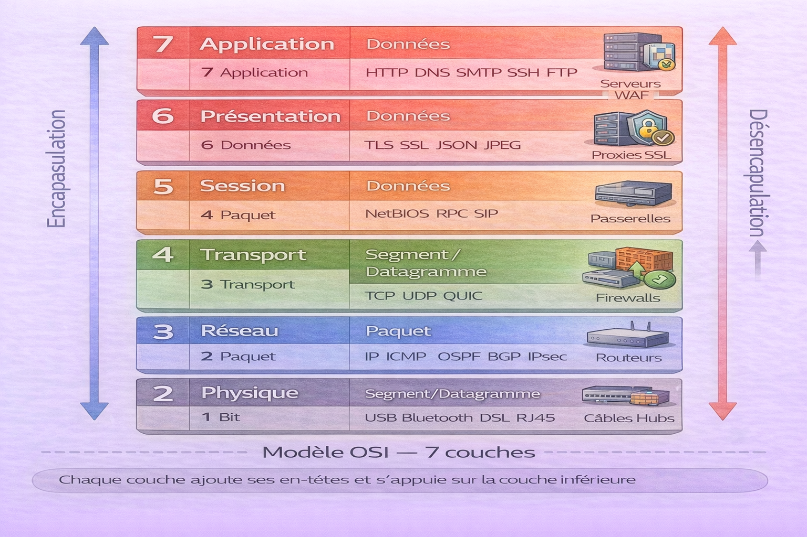
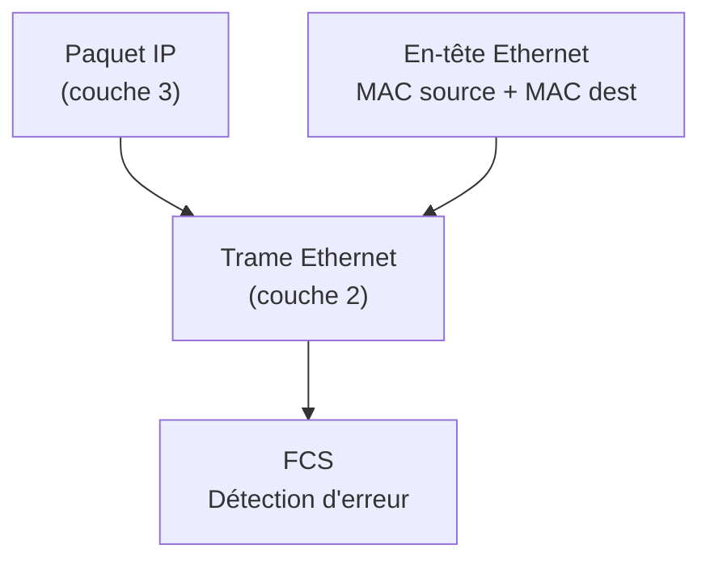
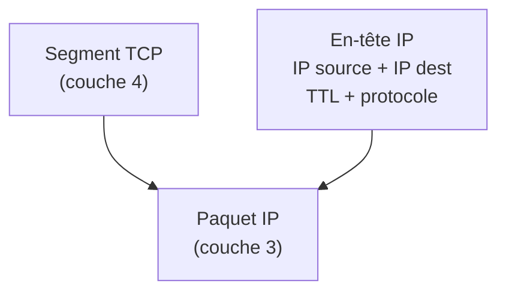
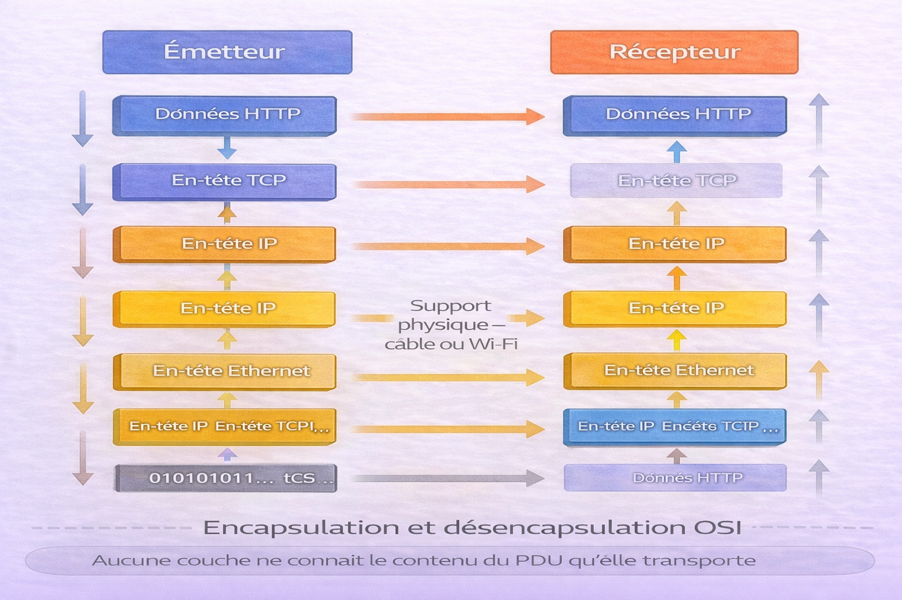
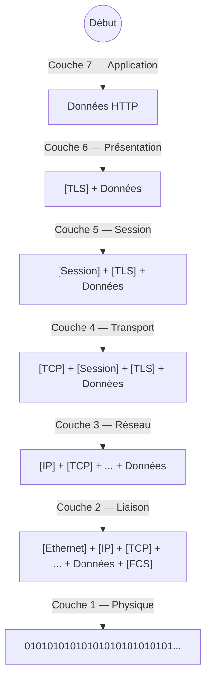
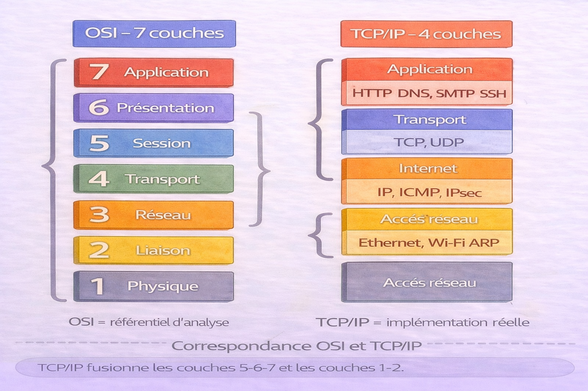
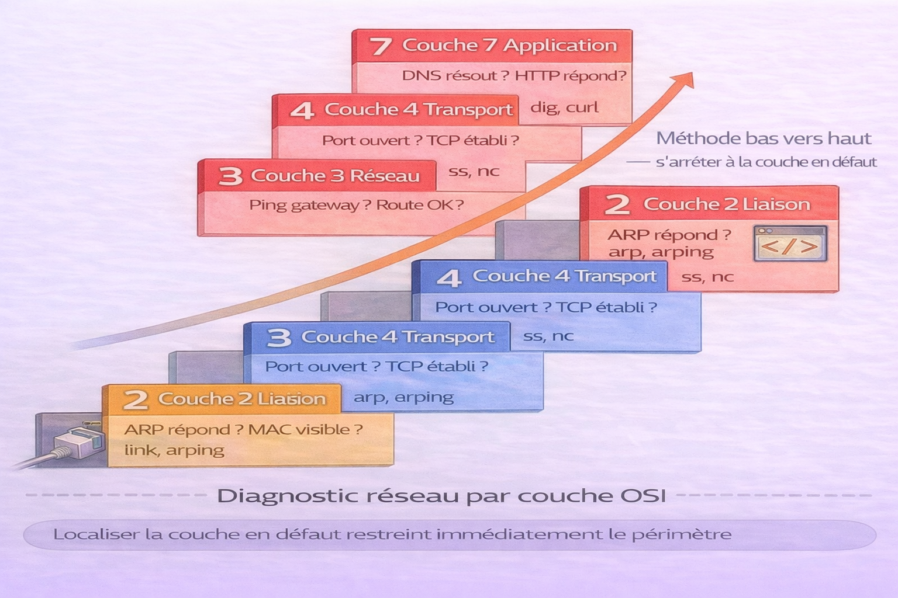
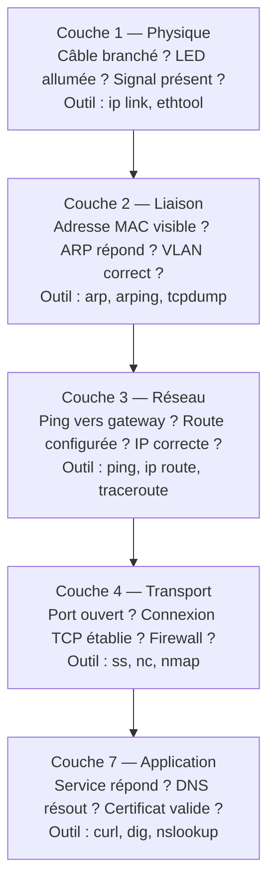

# Modèle OSI

<div
  class="omny-meta"
  data-level="🟢 Débutant & 🟡 Intermédiaire"
  data-version="0"
  data-time="30-35 minutes">
</div>

!!! quote "Analogie"
    _Envoyer une lettre à l'international. L'expéditeur rédige le contenu, le met dans une enveloppe, y inscrit l'adresse, le dépose au bureau de poste, qui le trie, le charge dans un camion, qui roule jusqu'à l'aéroport, qui charge l'avion, qui vole jusqu'à destination — puis le processus se déroule en sens inverse jusqu'au destinataire. Chaque étape ajoute sa propre couche de traitement sans avoir à connaître le fonctionnement des autres étapes. Le modèle OSI fonctionne exactement ainsi : sept couches indépendantes, chacune responsable d'une tâche précise, communicant uniquement avec la couche immédiatement au-dessus ou en dessous._

Le **modèle OSI** (Open Systems Interconnection) est un cadre conceptuel développé par l'ISO en 1984 pour standardiser les communications réseau entre systèmes hétérogènes. Il décompose la communication en **sept couches distinctes**, chacune avec un rôle précis, des protocoles définis et des unités de données spécifiques.

Comprendre le modèle OSI est indispensable pour diagnostiquer les pannes réseau, analyser le trafic, concevoir des architectures sécurisées et comprendre pourquoi chaque protocole existe à l'endroit où il se trouve dans la pile. C'est le langage commun de tous les professionnels réseau et cybersécurité.

!!! info "Pourquoi c'est important"
    Le modèle OSI est le référentiel universel pour parler de réseau. Quand un firewall filtre au niveau 4, quand Wireshark capture au niveau 2, quand une attaque MITM opère au niveau 3 — tout se réfère aux couches OSI. Identifier à quelle couche se situe un problème divise par deux le temps de diagnostic.

<br />

---

## Les sept couches — vue d'ensemble

!!! note "L'image ci-dessous est le référentiel des 7 couches OSI avec pour chaque couche son numéro, son nom, son PDU, son rôle et ses protocoles. C'est la vue à mémoriser avant d'approfondir chaque couche."



<p><em>Le modèle OSI s'lit dans les deux sens. De l'émetteur vers le récepteur, les données descendent de la couche 7 vers la couche 1 — chaque couche ajoute un en-tête (encapsulation). À réception, les données remontent de la couche 1 vers la couche 7 — chaque couche retire son en-tête (désencapsulation). Les couches 1 à 4 sont les couches de transport — elles gèrent le acheminement. Les couches 5 à 7 sont les couches applicatives — elles gèrent le sens des données.</em></p>

| Couche | Nom | PDU | Rôle | Exemples de protocoles | Équipements |
|:---:|---|---|---|---|---|
| 7 | Application | Données | Interface avec les applications | HTTP, FTP, DNS, SMTP, SSH | Serveurs, applications |
| 6 | Présentation | Données | Encodage, chiffrement, compression | TLS/SSL, JPEG, MPEG, ASCII | Passerelles |
| 5 | Session | Données | Gestion des sessions et dialogues | NetBIOS, RPC, SIP | Passerelles |
| 4 | Transport | Segment / Datagramme | Transmission bout en bout, fiabilité | TCP, UDP | Pare-feu, load balancer |
| 3 | Réseau | Paquet | Adressage logique et routage | IP, ICMP, IPsec, OSPF, BGP | Routeurs |
| 2 | Liaison de données | Trame | Adressage physique, détection d'erreurs | Ethernet, Wi-Fi (802.11), ARP | Switchs, ponts |
| 1 | Physique | Bit | Transmission des bits sur le support | USB, Bluetooth, DSL, RJ45 | Hubs, câbles, répéteurs |

!!! info "PDU — Protocol Data Unit"
    Le PDU est le nom donné à l'unité de données à chaque couche. Un **segment** TCP encapsule des données applicatives. Un **paquet** IP encapsule un segment. Une **trame** Ethernet encapsule un paquet. Un flux de **bits** transporte une trame sur le support physique. Connaître le PDU de chaque couche est indispensable pour lire une capture Wireshark.

<br />

---

## Couche 1 — Physique

La couche Physique gère la **transmission brute des bits** sur un support de communication. Elle s'occupe des signaux électriques, optiques ou radio — pas de leur interprétation.

**Rôle :** convertir les bits en signaux physiques (tension électrique, impulsion lumineuse, onde radio) et inversement. Elle définit les caractéristiques mécaniques et électriques des connecteurs, câbles et interfaces.

**PDU :** Bit

**Protocoles et standards :** USB, Bluetooth, DSL, RJ45 (10/100/1000BASE-T), fibre optique (1000BASE-SX), Wi-Fi (802.11 — couche radio uniquement)

**Équipements :** câbles, hubs, répéteurs, convertisseurs de média, modems

!!! warning "Point de sécurité — couche 1"
    Un attaquant avec un accès physique au réseau peut brancher un équipement d'écoute sur un câble (tap physique), connecter un appareil non autorisé sur un port ouvert, ou intercepter des transmissions Wi-Fi. La sécurité physique des locaux et des baies réseau est la première ligne de défense.

<br />

---

## Couche 2 — Liaison de données

La couche Liaison de données assure le **transfert fiable de trames** entre deux nœuds directement connectés sur le même segment réseau. Elle introduit l'**adresse MAC** comme identifiant physique.

**Rôle :** encapsuler les paquets en trames, adresser physiquement la source et la destination sur le réseau local, détecter (et parfois corriger) les erreurs de transmission, contrôler l'accès au support partagé.

**PDU :** Trame

**Sous-couches :** LLC (Logical Link Control) — interface avec la couche réseau. MAC (Media Access Control) — accès au support et adressage physique.

**Protocoles :** Ethernet (IEEE 802.3), Wi-Fi (IEEE 802.11), PPP, ARP, VLAN (802.1Q), STP (Spanning Tree Protocol)

**Équipements :** switchs, ponts, cartes réseau (NIC)



L'adresse MAC est codée sur 48 bits en hexadécimal — `AA:BB:CC:DD:EE:FF`. Les 3 premiers octets identifient le fabricant (OUI — Organizationally Unique Identifier). Les 3 derniers sont l'identifiant de l'interface.

!!! warning "Point de sécurité — couche 2"
    Les attaques de couche 2 sont particulièrement dangereuses car elles opèrent sous le niveau IP et contournent de nombreux firewalls. ARP Spoofing (empoisonnement de table ARP pour intercepter le trafic), MAC Flooding (saturation de la table CAM d'un switch pour le faire se comporter comme un hub), VLAN Hopping (sauter entre VLANs via double tagging 802.1Q) sont les vecteurs classiques.

<br />

---

## Couche 3 — Réseau

La couche Réseau gère l'**adressage logique** et le **routage** des paquets entre réseaux distincts. C'est la couche qui permet à un paquet de traverser Internet en passant par de multiples routeurs.

**Rôle :** adresser logiquement les hôtes (adresse IP), fragmenter les paquets si nécessaire, choisir le chemin optimal via les protocoles de routage.

**PDU :** Paquet

**Protocoles :** IPv4, IPv6, ICMP (messages d'erreur et diagnostic), OSPF, BGP, RIP (routage), IPsec (sécurité)

**Équipements :** routeurs, pare-feu de couche 3, load balancers L3



Le **TTL** (Time To Live) est décrémenté à chaque routeur. Quand il atteint 0, le paquet est abandonné et un message ICMP "Time Exceeded" est envoyé à l'émetteur — c'est le mécanisme exploité par `traceroute`.

!!! warning "Point de sécurité — couche 3"
    IP Spoofing (falsification de l'adresse source pour usurper une identité), attaques par fragmentation (exploitation de la réassemblage), routage asymétrique exploité pour contourner des IDS/IPS. Les ACL sur les routeurs et les règles de filrage par IP opèrent à cette couche.

<br />

---

## Couche 4 — Transport

La couche Transport gère la **communication de bout en bout** entre processus applicatifs. Elle introduit la notion de **port** pour multiplexer plusieurs communications simultanées sur une même adresse IP.

**Rôle :** segmenter les données applicatives, gérer la fiabilité (TCP) ou la vitesse (UDP), contrôler le flux et la congestion, identifier les applications via les ports.

**PDU :** Segment (TCP) ou Datagramme (UDP)

**Protocoles :** TCP (fiable, orienté connexion), UDP (rapide, sans connexion), QUIC (HTTP/3 — UDP avec fiabilité au niveau applicatif)

**Équipements :** pare-feu de couche 4, load balancers L4

Les couches 1 à 4 sont traitées en détail — TCP, UDP, ports et cas d'usage — dans le chapitre [Liste des Protocoles](../reseaux/protocoles-liste.md).

!!! warning "Point de sécurité — couche 4"
    SYN Flood (envoi massif de SYN sans compléter le handshake — épuisement de la table de connexions), port scanning (reconnaissance des services exposés), session hijacking (vol de numéro de séquence TCP pour prendre le contrôle d'une session). Les firewalls stateful inspectent l'état des connexions TCP à cette couche.

<br />

---

## Couche 5 — Session

La couche Session gère l'**établissement, le maintien et la fermeture des sessions** de communication entre applications. Elle coordonne les échanges et gère la reprise en cas d'interruption.

**Rôle :** ouvrir une session de communication, la maintenir active, synchroniser les échanges (points de contrôle pour la reprise), la fermer proprement.

**PDU :** Données

**Protocoles :** NetBIOS (partage de ressources Windows), RPC (Remote Procedure Call), SIP (VoIP — gestion des sessions d'appel), SQL sessions

**Équipements :** passerelles applicatives

!!! note "Dans la pratique"
    La couche 5 est souvent transparente pour les développeurs. TCP maintient les connexions (couche 4) et les applications gèrent elles-mêmes leur état de session. C'est pourquoi le modèle TCP/IP fusionne les couches 5, 6 et 7 en une seule couche Application.

<br />

---

## Couche 6 — Présentation

La couche Présentation assure la **traduction des données** entre le format utilisé par l'application et le format de transport réseau. Elle gère l'encodage, le chiffrement et la compression.

**Rôle :** convertir les formats de données (sérialisation/désérialisation), chiffrer et déchiffrer les données (TLS opère ici), compresser pour réduire la bande passante.

**PDU :** Données

**Protocoles et formats :** TLS/SSL (chiffrement), JSON, XML, JPEG, MPEG, ASCII, Unicode, Base64, gzip

**Équipements :** passerelles SSL/TLS, proxies de déchiffrement

!!! note "TLS et la couche 6"
    TLS est souvent dit "entre couche 4 et 7" — c'est une approximation. Il opère conceptuellement à la couche 6 : il chiffre les données applicatives avant transmission et les déchiffre à réception, sans modifier le transport TCP sous-jacent.

<br />

---

## Couche 7 — Application

La couche Application est l'**interface directe avec l'utilisateur ou l'application**. Elle fournit les services réseau directement consommables — navigation web, emails, transfert de fichiers, résolution DNS.

**Rôle :** fournir les services réseau aux applications (HTTP pour le web, SMTP pour l'email, DNS pour la résolution de noms, FTP pour les fichiers).

**PDU :** Données

**Protocoles :** HTTP/HTTPS, FTP/SFTP, DNS, SMTP/IMAP/POP3, SSH, SNMP, LDAP, NFS

**Équipements :** serveurs web, serveurs mail, proxies applicatifs, WAF (Web Application Firewall)

!!! warning "Point de sécurité — couche 7"
    La couche applicative est la surface d'attaque la plus large. Injection SQL, XSS, CSRF, déni de service applicatif (HTTP Flood), exploitation de vulnérabilités applicatives (CVE). Les WAF filtrent le trafic HTTP/HTTPS à cette couche. Les outils comme Burp Suite travaillent exclusivement sur la couche 7.

<br />

---

## Encapsulation et désencapsulation

!!! note "L'image ci-dessous illustre le flux d'encapsulation de la couche 7 vers la couche 1 à l'émission, et le flux inverse à la réception. C'est le mécanisme fondamental qui permet à des couches indépendantes de coopérer."



<p><em>À l'émission, chaque couche encapsule le PDU de la couche supérieure en ajoutant ses propres en-têtes — parfois un trailer en fin de trame (couche 2 avec le FCS). À réception, chaque couche retire son en-tête et passe le contenu à la couche supérieure. Aucune couche n'a besoin de comprendre ce que contient le PDU qu'elle transporte — c'est le principe d'encapsulation. HTTP ne sait pas qu'il voyage dans TCP. TCP ne sait pas qu'il est dans un paquet IP. IP ne sait pas qu'il est dans une trame Ethernet.</em></p>



À chaque flèche vers le bas, une couche ajoute son en-tête. À chaque flèche vers le haut (réception), une couche retire son en-tête. Le contenu n'est jamais modifié — uniquement encapsulé.

<br />

---

## OSI vs TCP/IP

!!! note "L'image ci-dessous présente la correspondance entre les 7 couches OSI et les 4 couches TCP/IP. TCP/IP est le modèle implémenté en pratique — OSI est le modèle de référence pour l'analyse et le diagnostic."



<p><em>TCP/IP fusionne les couches 5, 6 et 7 d'OSI en une seule couche Application — dans la pratique, les applications gèrent elles-mêmes la session, le formatage et la logique applicative. TCP/IP fusionne également les couches 1 et 2 en une couche Accès réseau. OSI reste le modèle de référence pour analyser et diagnostiquer — TCP/IP est ce qui est réellement implémenté dans les systèmes d'exploitation et les équipements réseau.</em></p>

| Couche OSI | Nom OSI | Couche TCP/IP | Nom TCP/IP |
|:---:|---|:---:|---|
| 7 | Application | 4 | Application |
| 6 | Présentation | 4 | Application |
| 5 | Session | 4 | Application |
| 4 | Transport | 3 | Transport |
| 3 | Réseau | 2 | Internet |
| 2 | Liaison de données | 1 | Accès réseau |
| 1 | Physique | 1 | Accès réseau |

Le modèle TCP/IP est traité en détail dans le chapitre [Modèle TCP/IP](../reseaux/modele-tcpip.md).

<br />

---

## Utilisation pratique — diagnostic par couche

!!! note "L'image ci-dessous présente la méthode de diagnostic réseau par couche OSI — du bas vers le haut. C'est la démarche systématique à appliquer face à tout problème de connectivité."



<p><em>La méthode de diagnostic OSI consiste à monter les couches de bas en haut jusqu'à localiser la défaillance. Si la couche 1 fonctionne (câble, signal) mais pas la couche 2 (pas de résolution ARP), le problème est à la couche 2. Localiser la couche en défaut restreint immédiatement le périmètre d'investigation et les outils à utiliser. Un problème de couche 3 ne se résout pas en remplaçant un câble, et un problème DNS (couche 7) ne se résout pas en configurant un routeur.</em></p>

### Commandes de diagnostic par couche

```bash title="Bash — couche 1 Physique — vérification du lien réseau"
# Vérifier l'état de l'interface réseau — link UP/DOWN, vitesse, duplex
ip link show eth0

# Statistiques de l'interface — erreurs, paquets perdus, collisions
ip -s link show eth0

# Informations détaillées sur la carte réseau
ethtool eth0
```

```bash title="Bash — couche 2 Liaison — ARP et adresses MAC"
# Afficher la table ARP — correspondances IP <> MAC connues
arp -n

# Forcer une résolution ARP pour vérifier la couche 2
arping -I eth0 192.168.1.1

# Afficher les VLANs configurés
ip link show type vlan

# Capturer les trames Ethernet sur l'interface
tcpdump -i eth0 -e arp
```

```bash title="Bash — couche 3 Réseau — IP, routage et ICMP"
# Vérifier la connectivité vers une IP — teste les couches 1, 2 et 3
ping -c 4 192.168.1.1

# Afficher la table de routage
ip route show

# Tracer le chemin réseau — exploite le TTL ICMP
traceroute 8.8.8.8

# Vérifier la configuration IP de l'interface
ip addr show eth0
```

```bash title="Bash — couche 4 Transport — ports et connexions TCP/UDP"
# Lister toutes les connexions TCP actives avec leur état
ss -tnp

# Lister les ports en écoute (services actifs)
ss -lntp

# Vérifier qu'un port TCP est accessible depuis l'extérieur
nc -zv 192.168.1.10 443

# Statistiques TCP — retransmissions, erreurs
ss -s
```

```bash title="Bash — couche 7 Application — DNS, HTTP, services"
# Résolution DNS — teste la couche 7 côté DNS
dig example.com

# Tester un serveur HTTP
curl -I https://example.com

# Vérifier la connectivité SMTP
nc -v smtp.example.com 25

# Tester la résolution et la réponse d'un serveur
nslookup example.com
```

### Méthodologie de diagnostic

La démarche systématique part toujours de la couche la plus basse :



À chaque étape, si la couche fonctionne, on monte. Si elle échoue, on a localisé le problème.

<br />

---

## Conclusion

!!! quote "Conclusion"
    _Le modèle OSI n'est pas un protocole à implémenter — c'est un langage commun pour raisonner sur les réseaux. Ses sept couches permettent de décomposer n'importe quel problème réseau en une question précise : à quelle couche se situe la défaillance ? Un attaquant qui empoisonne une table ARP opère en couche 2. Un firewall qui filtre par IP opère en couche 3. Un WAF qui bloque une injection SQL opère en couche 7. Un certificat TLS expiré est un problème de couche 6. Maîtriser ce découpage transforme le diagnostic réseau d'un exercice intuitif en une démarche méthodique et reproductible. Dans un contexte de cybersécurité, identifier la couche d'une attaque détermine immédiatement les contre-mesures à déployer._

<br />