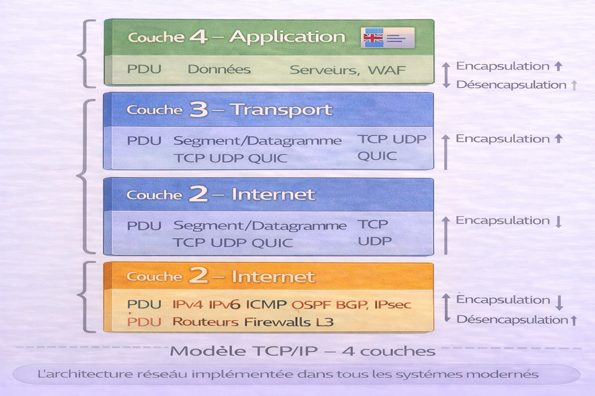
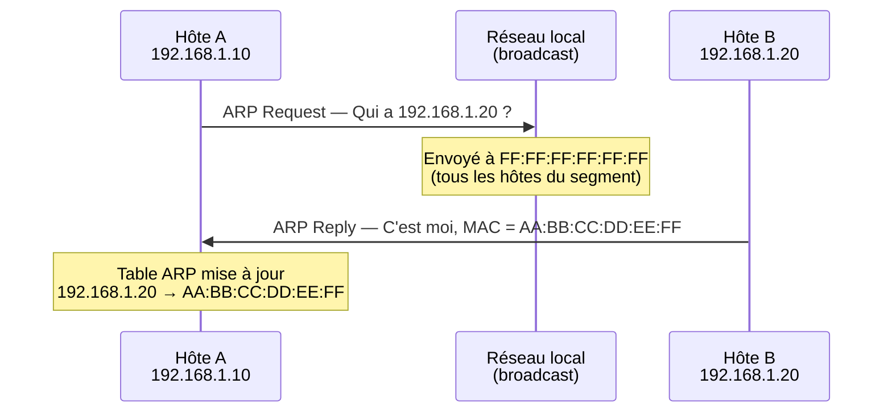
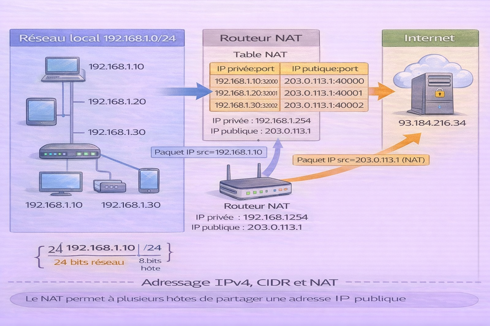
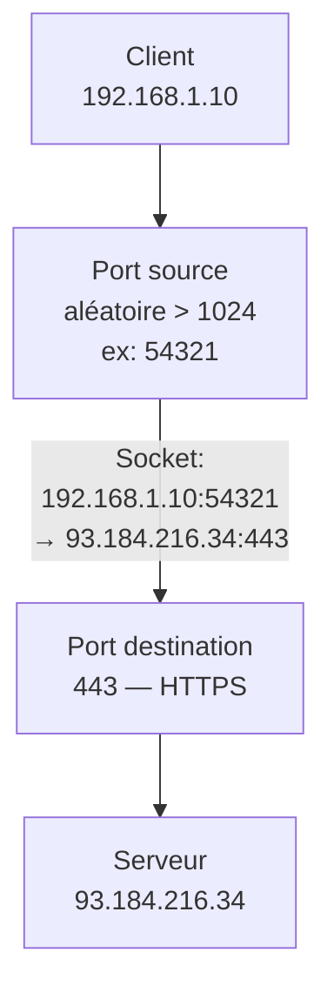
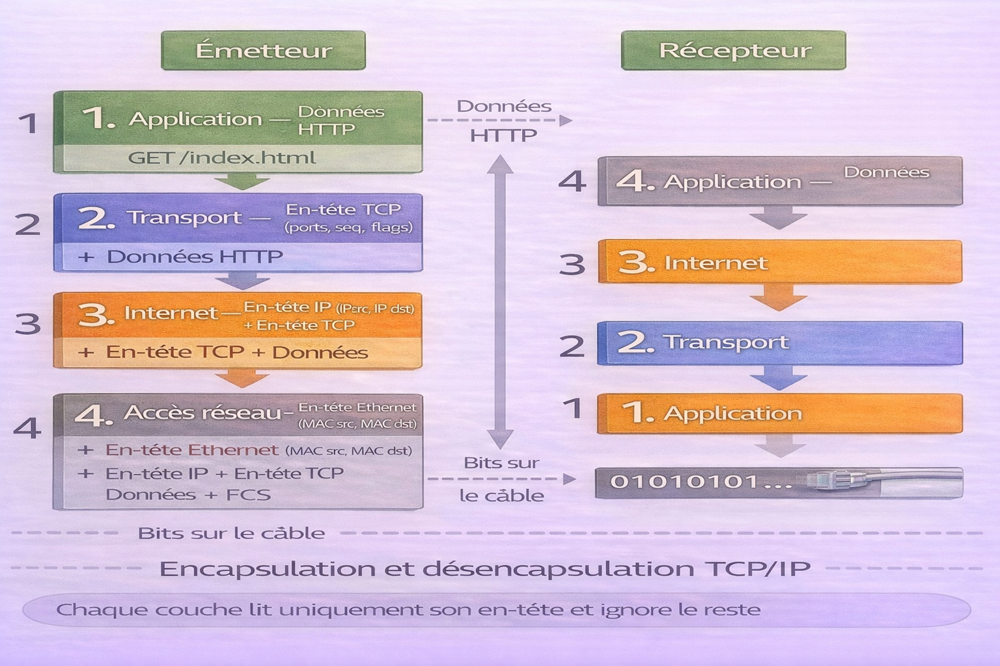
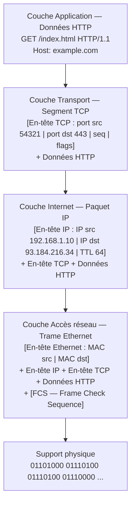
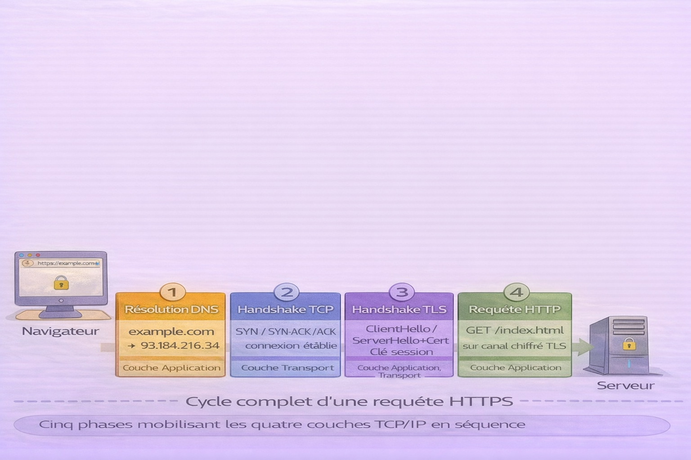
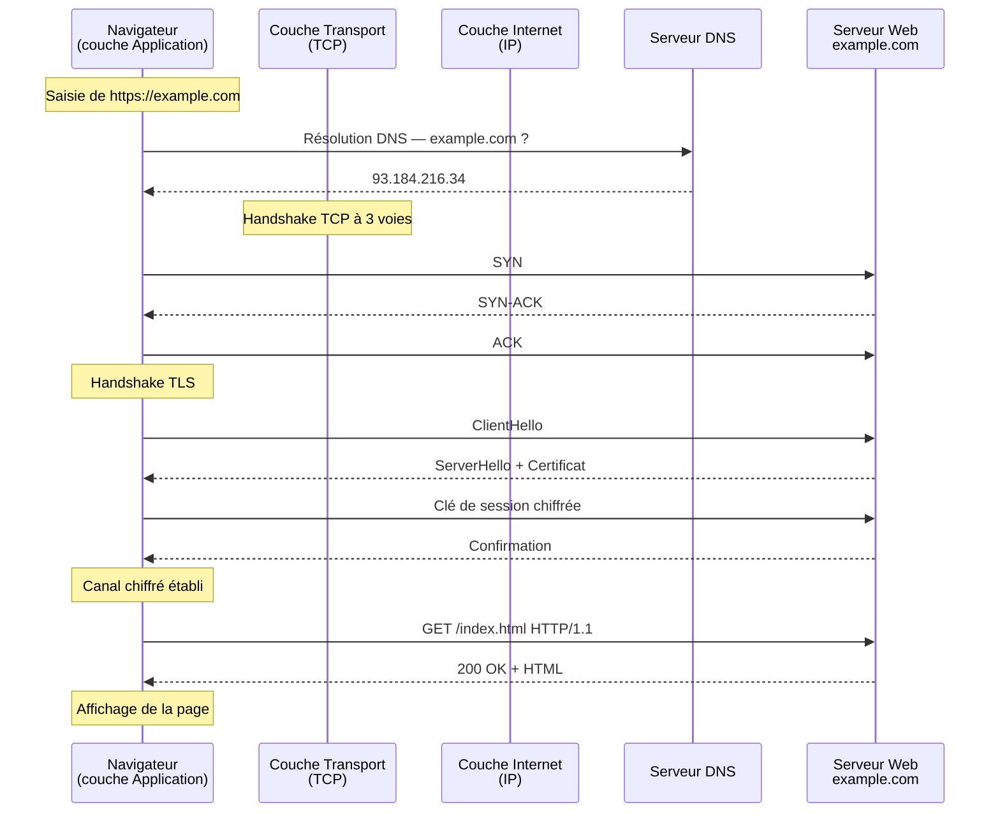
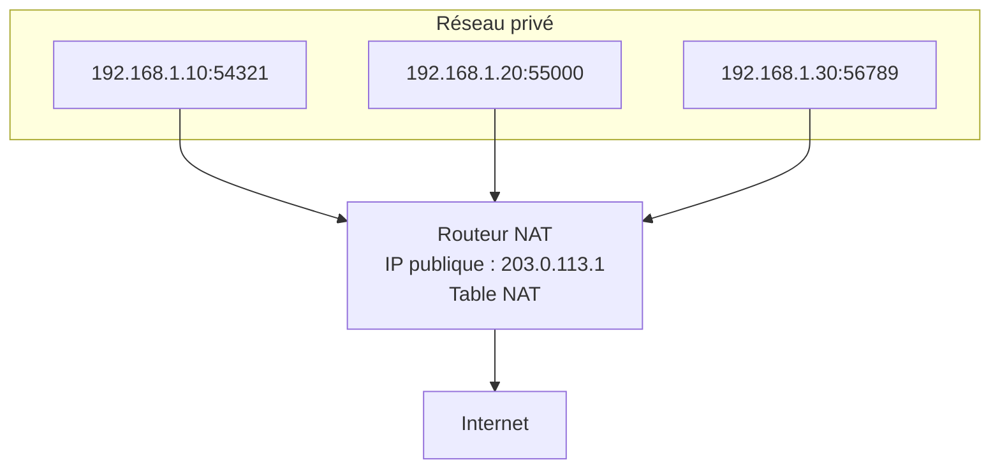

# Modèle TCP/IP

<div
  class="omny-meta"
  data-level="🟢 Débutant & 🟡 Intermédiaire"
  data-version="0"
  data-time="35-40 minutes">
</div>

!!! quote "Analogie"
    _Un système de messagerie express international avec quatre départements. Le département Expédition conditionne le colis et le remet au transporteur local (Accès réseau). Le département Logistique détermine l'itinéraire et les points de transit (Internet). Le département Livraison garantit que le colis arrive en bon état à la bonne porte — ou signale la perte (Transport). Le département Commercial communique directement avec le client pour prendre et confirmer la commande (Application). Chaque département a un rôle exclusif et passe la main au suivant sans empiéter sur son périmètre._

Le **modèle TCP/IP** est l'architecture réseau qui fait fonctionner Internet. Contrairement au modèle OSI — un cadre théorique à 7 couches — TCP/IP est l'implémentation réelle, déployée dans chaque système d'exploitation, équipement réseau et application connectée depuis les années 1970. Il organise la communication en **quatre couches**, chacune gérant un périmètre précis.

TCP/IP doit son nom à ses deux protocoles fondateurs : **TCP** (Transmission Control Protocol) pour la fiabilité de la transmission, et **IP** (Internet Protocol) pour l'adressage et le routage. Ensemble, ils constituent la colonne vertébrale d'Internet.

!!! info "Pourquoi c'est important"
    Toute communication réseau moderne passe par TCP/IP — navigation web, emails, APIs, VoIP, IoT, services cloud. Comprendre ses quatre couches, comment les données s'encapsulent et comment les adresses IP et les routes fonctionnent est la base de tout travail en développement réseau, administration système ou cybersécurité.

Le modèle OSI et la correspondance entre les deux modèles sont traités dans le chapitre [Modèle OSI](../reseaux/modele-osi.md).

<br />

---

## Les quatre couches — vue d'ensemble

!!! note "L'image ci-dessous est le référentiel des 4 couches TCP/IP avec pour chaque couche son rôle, ses protocoles et le PDU associé. C'est la base à maîtriser avant d'approfondir chaque couche."



<p><em>Le modèle TCP/IP fonctionne comme une pile — les données descendent de la couche Application vers la couche Accès réseau à l'émission, et remontent dans l'ordre inverse à la réception. Chaque couche encapsule le contenu de la couche supérieure en ajoutant ses propres en-têtes. La couche Application parle HTTP — elle ne sait pas que ses données voyageront dans un segment TCP, lui-même encapsulé dans un paquet IP, lui-même encapsulé dans une trame Ethernet.</em></p>

| Couche | Nom | PDU | Rôle | Protocoles principaux |
|:---:|---|---|---|---|
| 4 | Application | Données | Services réseau aux applications | HTTP/S, DNS, FTP, SSH, SMTP, SNMP |
| 3 | Transport | Segment / Datagramme | Transmission bout en bout, fiabilité, ports | TCP, UDP, QUIC |
| 2 | Internet | Paquet | Adressage logique et routage | IP (v4/v6), ICMP, OSPF, BGP, IPsec |
| 1 | Accès réseau | Trame / Bit | Transmission physique sur le support local | Ethernet, Wi-Fi, ARP, PPP |

!!! info "Numérotation des couches TCP/IP"
    Contrairement à OSI qui numérote de 1 (bas) à 7 (haut), TCP/IP est parfois numéroté dans les deux sens selon les sources. Dans ce document, la couche 1 est la couche la plus basse (Accès réseau) et la couche 4 la plus haute (Application) — cohérent avec la lecture bas vers haut du modèle OSI.

<br />

---

## Couche 1 — Accès réseau

La couche Accès réseau regroupe ce que le modèle OSI sépare en deux couches distinctes (Physique et Liaison de données). Elle gère **tout ce qui concerne la transmission sur le réseau local** — du signal électrique sur le câble jusqu'à l'adressage MAC entre deux nœuds adjacents.

**Rôle :** transmettre les trames sur le support physique, adresser les équipements via leurs adresses MAC, détecter les erreurs de transmission, gérer l'accès au support partagé.

**PDU :** Trame (couche 2 OSI) et Bit (couche 1 OSI)

**Protocoles :** Ethernet (IEEE 802.3), Wi-Fi (IEEE 802.11), ARP (Address Resolution Protocol), PPP (Point-to-Point Protocol), VLAN (IEEE 802.1Q)

**Équipements :** switchs, ponts, cartes réseau, points d'accès Wi-Fi, câbles, hubs

### ARP — Address Resolution Protocol

ARP est le protocole qui assure la transition entre la couche Internet (adresses IP) et la couche Accès réseau (adresses MAC). Un hôte qui veut envoyer un paquet à une IP locale doit d'abord connaître l'adresse MAC correspondante.



```bash title="Bash — consultation et manipulation de la table ARP"
# Afficher la table ARP locale
arp -n

# Afficher avec ip (plus moderne)
ip neigh show

# Forcer une résolution ARP
arping -I eth0 192.168.1.1

# Capturer les échanges ARP sur le réseau
tcpdump -i eth0 arp
```

!!! warning "ARP Spoofing"
    ARP ne dispose d'aucun mécanisme d'authentification. Un attaquant peut envoyer de fausses réponses ARP pour associer son adresse MAC à l'IP d'une passerelle légitime (ARP Spoofing), interceptant ainsi tout le trafic du segment — attaque de type Man-in-the-Middle. Protection : Dynamic ARP Inspection (DAI) sur les switchs managés.

<br />

---

## Couche 2 — Internet

La couche Internet est le cœur du modèle TCP/IP. Elle gère l'**adressage logique** (adresses IP) et le **routage** des paquets à travers des réseaux distincts pour acheminer les données de la source jusqu'à la destination finale, en traversant potentiellement des dizaines de routeurs intermédiaires.

**Rôle :** encapsuler les segments dans des paquets IP, adresser source et destination, fragmenter si nécessaire, choisir le chemin via les protocoles de routage.

**PDU :** Paquet

**Protocoles :** IPv4, IPv6, ICMP (diagnostic et erreurs), OSPF et BGP (routage dynamique), IPsec (sécurité)

**Équipements :** routeurs, firewalls de couche 3

### IP — Internet Protocol

IP est le protocole d'adressage universel. Chaque hôte connecté à Internet possède une adresse IP unique qui identifie sa position dans le réseau.

**Structure d'un en-tête IPv4 :**

| Champ | Taille | Rôle |
|---|---|---|
| Version | 4 bits | IPv4 (4) ou IPv6 (6) |
| IHL | 4 bits | Longueur de l'en-tête |
| TTL | 8 bits | Nombre de sauts restants avant abandon |
| Protocole | 8 bits | TCP (6), UDP (17), ICMP (1) |
| IP source | 32 bits | Adresse IP de l'émetteur |
| IP destination | 32 bits | Adresse IP du destinataire |

**TTL (Time To Live) :** decrementé de 1 à chaque routeur traversé. Quand il atteint 0, le paquet est abandonné et un message ICMP "Time Exceeded" est retourné à l'émetteur. C'est le mécanisme exploité par `traceroute` pour cartographier le chemin réseau.

### Adressage IPv4 et CIDR

!!! note "L'image ci-dessous illustre le découpage d'un espace d'adressage IPv4 en sous-réseaux via CIDR, et le rôle de la passerelle dans le routage vers d'autres réseaux."



<p><em>Une adresse IPv4 est composée de 32 bits divisés en deux parties : le préfixe réseau (identifie le réseau) et la partie hôte (identifie l'équipement dans ce réseau). Le masque CIDR /24 signifie que les 24 premiers bits identifient le réseau — soit 256 adresses possibles dont 254 utilisables (la première est l'adresse réseau, la dernière le broadcast). La passerelle est le routeur qui reçoit les paquets destinés à des réseaux extérieurs et décide de leur prochain saut.</em></p>

```bash title="Bash — adressage IP et sous-réseaux"
# Afficher toutes les adresses IP des interfaces
ip addr show

# Afficher uniquement les adresses IPv4
ip -4 addr show

# Calculer les informations d'un sous-réseau (ipcalc)
ipcalc 192.168.1.0/24

# Afficher la table de routage
ip route show

# Ajouter une route statique
ip route add 10.0.0.0/8 via 192.168.1.254
```

**Plages d'adresses privées RFC 1918 :**

| Plage | Notation CIDR | Nb d'adresses |
|---|---|---|
| 10.0.0.0 — 10.255.255.255 | 10.0.0.0/8 | 16 777 216 |
| 172.16.0.0 — 172.31.255.255 | 172.16.0.0/12 | 1 048 576 |
| 192.168.0.0 — 192.168.255.255 | 192.168.0.0/16 | 65 536 |

Ces adresses ne sont pas routables sur Internet — elles nécessitent un NAT (Network Address Translation) pour communiquer avec l'extérieur.

### ICMP — Internet Control Message Protocol

ICMP transporte les **messages d'erreur et de diagnostic** entre équipements réseau. Il opère à la couche Internet et est encapsulé directement dans des paquets IP.

```bash title="Bash — utilisation d'ICMP pour le diagnostic"
# Ping — test de connectivité via ICMP Echo Request/Reply
ping -c 4 8.8.8.8

# Ping avec taille de paquet spécifique — teste la fragmentation
ping -s 1472 -M do 8.8.8.8

# Traceroute — exploite le TTL pour cartographier le chemin
traceroute 8.8.8.8

# Traceroute avec ICMP explicite (par défaut UDP sur Linux)
traceroute -I 8.8.8.8

# Ping IPv6
ping6 -c 4 2001:4860:4860::8888
```

**Types ICMP courants :**

| Type | Code | Signification |
|---|---|---|
| 0 | 0 | Echo Reply (réponse ping) |
| 3 | 0 | Destination Network Unreachable |
| 3 | 3 | Destination Port Unreachable |
| 8 | 0 | Echo Request (ping) |
| 11 | 0 | TTL Exceeded (traceroute) |

!!! warning "Sécurité ICMP"
    ICMP est souvent filtré ou limité par les firewalls pour prévenir la reconnaissance réseau (ping sweep, OS fingerprinting) et les attaques par inondation (ICMP Flood). Le blocage total d'ICMP est déconseillé — il empêche le diagnostic et casse la découverte du MTU (Path MTU Discovery).

<br />

---

## Couche 3 — Transport

La couche Transport gère la **communication de bout en bout** entre processus applicatifs. Elle introduit la notion de **port** qui permet à un même hôte de maintenir des dizaines de connexions simultanées vers des services distincts.

**PDU :** Segment (TCP) ou Datagramme (UDP)

**Protocoles :** TCP (fiable, orienté connexion), UDP (rapide, sans connexion), QUIC (UDP avec fiabilité au niveau applicatif — utilisé par HTTP/3)

Les protocoles TCP et UDP, le handshake à 3 voies, les exemples de code et les cas d'usage sont traités en détail dans le chapitre [Liste des Protocoles](../reseaux/protocoles-liste.md).

### Ports et multiplexage

Le **port** est un entier de 16 bits (0 à 65535) qui identifie un processus applicatif spécifique sur un hôte. L'association IP:port constitue un **socket** — l'identifiant unique d'un point de communication.



**Plages de ports :**

| Plage | Nom | Usage |
|---|---|---|
| 0 — 1023 | Well-known ports | Protocoles système — HTTP (80), SSH (22), DNS (53) |
| 1024 — 49151 | Registered ports | Applications enregistrées IANA — MySQL (3306), Redis (6379) |
| 49152 — 65535 | Dynamic ports | Ports éphémères — attribués automatiquement aux clients |

```bash title="Bash — inspection des ports et connexions"
# Lister toutes les connexions TCP actives avec processus
ss -tnp

# Lister les ports en écoute
ss -lntp

# Vérifier qu'un port distant est accessible
nc -zv 93.184.216.34 443

# Scanner les ports ouverts sur un hôte (outil de diagnostic réseau)
nmap -sV 192.168.1.1

# Suivre les connexions en temps réel
watch -n 1 'ss -tnp'
```

<br />

---

## Couche 4 — Application

La couche Application est la couche la plus haute — celle avec laquelle les développeurs interagissent directement. Elle regroupe tous les protocoles qui fournissent des **services réseau directement consommables** par les applications.

**PDU :** Données

**Protocoles :** HTTP/HTTPS (web), DNS (résolution de noms), FTP/SFTP (transfert de fichiers), SSH (accès distant sécurisé), SMTP/IMAP/POP3 (email), SNMP (supervision), LDAP (annuaire), NTP (synchronisation du temps)

Chaque protocole applicatif dispose d'une fiche dédiée dans la section Réseaux.  
Les plus importants sont traités dans les chapitres [HTTP — Méthodes](../reseaux/http-methodes.md), [HTTP — Codes d'erreur](../reseaux/http-codes.md), [DNS — Notions](../reseaux/dns-notions.md) et [Liste des Protocoles](../reseaux/protocoles-liste.md).

```bash title="Bash — diagnostic de la couche Application"
# DNS — vérifier la résolution de nom
dig example.com A
dig example.com MX

# HTTP — tester un serveur web
curl -I https://example.com
curl -v https://example.com 2>&1 | head -50

# SSH — tester la connectivité avant authentification
ssh -v user@example.com 2>&1 | head -30

# SMTP — tester un serveur mail
nc -v smtp.example.com 25

# NTP — vérifier la synchronisation temporelle
timedatectl status
chronyc tracking
```

<br />

---

## Encapsulation TCP/IP

!!! note "L'image ci-dessous illustre l'encapsulation en quatre étapes — de la donnée HTTP jusqu'aux bits sur le câble. C'est le mécanisme central qui permet à des couches indépendantes de coopérer sans se connaître."



<p><em>À l'émission, chaque couche encapsule le PDU de la couche supérieure. La couche Application produit des données HTTP. La couche Transport ajoute l'en-tête TCP avec les ports source et destination. La couche Internet ajoute l'en-tête IP avec les adresses source et destination. La couche Accès réseau ajoute l'en-tête Ethernet avec les adresses MAC et un trailer FCS pour la détection d'erreurs. À réception, chaque couche retire son en-tête et passe le contenu à la couche supérieure.</em></p>



Chaque couche lit uniquement son propre en-tête et ignore tout ce qui est encapsulé à l'intérieur. TCP ne sait pas que ses données contiennent du HTTP. IP ne sait pas qu'il transporte du TCP. Ethernet ne sait pas qu'il transporte de l'IP.

<br />

---

## Cycle complet d'une communication

!!! note "L'image ci-dessous présente le cycle complet d'une requête HTTPS — de la saisie de l'URL dans le navigateur jusqu'à la réception de la réponse du serveur. C'est la synthèse de toutes les couches en action."



<p><em>Une requête HTTPS simple mobilise les quatre couches TCP/IP en séquence. La résolution DNS (couche Application + Transport UDP + couche Internet + couche Accès réseau) traduit le nom de domaine en IP. Le handshake TCP (couche Transport) établit la connexion fiable. Le handshake TLS (couche Application — protocole de présentation) chiffre le canal. La requête HTTP (couche Application) est enfin envoyée et la réponse reçue. Chaque étape dépend de la précédente.</em></p>



<br />

---

## Routage IP

Le **routage** est le processus par lequel un paquet IP trouve son chemin de la source vers la destination en traversant des réseaux intermédiaires.

### Table de routage

Chaque hôte et chaque routeur maintient une **table de routage** qui associe des préfixes réseau à des interfaces de sortie ou à des passerelles (next hop).

```bash title="Bash — table de routage et débogage"
# Afficher la table de routage complète
ip route show

# Identifier quelle route serait utilisée pour atteindre une IP
ip route get 8.8.8.8

# Afficher les routes IPv6
ip -6 route show

# Ajouter une route statique
ip route add 10.0.0.0/8 via 192.168.1.254 dev eth0

# Supprimer une route
ip route del 10.0.0.0/8

# Trace du chemin réseau — identifie chaque routeur traversé
traceroute -n 8.8.8.8
```

### NAT — Network Address Translation

Le NAT permet à plusieurs hôtes d'un réseau privé de partager une seule adresse IP publique. C'est le mécanisme qui pallie l'épuisement des adresses IPv4.



Le routeur NAT remplace l'adresse IP privée source et le port source par son adresse IP publique et un port de sortie unique, et maintient une table de correspondance pour router les réponses vers le bon hôte interne.

<br />

---

## IPv6

IPv4 offre environ 4,3 milliards d'adresses — un nombre épuisé depuis 2011. IPv6 utilise 128 bits et offre 340 undécillions d'adresses — suffisant pour adresser chaque grain de sable de la planète plusieurs fois.

**Format d'une adresse IPv6 :** `2001:0db8:85a3:0000:0000:8a2e:0370:7334`

Règles d'abréviation : les groupes de zéros consécutifs peuvent être remplacés par `::` (une seule fois par adresse). Les zéros en tête d'un groupe peuvent être omis.

`2001:0db8:85a3:0000:0000:8a2e:0370:7334` → `2001:db8:85a3::8a2e:370:7334`

**Avantages d'IPv6 :**

- Espace d'adressage quasi-illimité — plus besoin de NAT
- IPsec natif — chiffrement et authentification intégrés
- Auto-configuration (SLAAC) — sans serveur DHCP
- Multicast natif — remplace le broadcast
- En-tête simplifié — meilleure performance de routage

```bash title="Bash — diagnostic IPv6"
# Afficher les adresses IPv6 de toutes les interfaces
ip -6 addr show

# Ping IPv6
ping6 -c 4 2001:4860:4860::8888

# Traceroute IPv6
traceroute6 2001:4860:4860::8888

# Résolution DNS en IPv6 (enregistrement AAAA)
dig AAAA example.com
```

<br />

---

## Diagnostic complet par couche

```bash title="Bash — couche 1 Accès réseau — lien physique et interface"
# Vérifier l'état du lien — UP/DOWN, vitesse, duplex
ip link show eth0

# Statistiques de l'interface — erreurs, pertes, collisions
ip -s link show eth0

# Informations sur la carte réseau — vitesse, câble détecté
ethtool eth0

# Capturer le trafic brut sur l'interface
tcpdump -i eth0 -n -c 20
```

```bash title="Bash — couche 2 Internet — IP, routage, ICMP"
# Test de connectivité couche 2 (couche Internet dans TCP/IP)
ping -c 4 192.168.1.1

# Vérifier la configuration IP
ip addr show

# Vérifier les routes
ip route show
ip route get 8.8.8.8

# Cartographier le chemin réseau
traceroute -n 8.8.8.8
```

```bash title="Bash — couche 3 Transport — ports et connexions"
# État des connexions TCP
ss -tnp

# Ports en écoute
ss -lntp

# Tester l'accessibilité d'un port
nc -zv 8.8.8.8 53
nc -zv example.com 443

# Statistiques TCP globales
ss -s
```

```bash title="Bash — couche 4 Application — services et protocoles"
# DNS
dig example.com
dig @8.8.8.8 example.com

# HTTP/HTTPS
curl -I https://example.com
curl -w "\n%{time_total}s\n" -o /dev/null -s https://example.com

# Vérifier un certificat TLS
openssl s_client -connect example.com:443 -brief

# Vérifier la synchronisation NTP
timedatectl status
```

<br />

---

## Conclusion

!!! quote "Conclusion"
    _Le modèle TCP/IP est l'architecture qui fait fonctionner Internet depuis plus de cinquante ans. Ses quatre couches découpent la complexité d'une communication réseau en périmètres indépendants et interchangeables — changer l'implémentation de la couche Accès réseau (passer d'Ethernet à Wi-Fi) ne modifie pas le comportement des couches supérieures. Comprendre l'encapsulation — comment une donnée HTTP devient un segment TCP, un paquet IP, une trame Ethernet, puis une suite de bits — est indispensable pour lire une capture Wireshark, diagnostiquer une panne réseau ou comprendre pourquoi une attaque de couche 2 peut intercepter du trafic HTTPS. L'adressage IP, le routage et le NAT sont les mécanismes qui permettent à des milliards d'hôtes de se trouver et de communiquer. IPv6 résout structurellement les limites d'IPv4 — sa maîtrise devient incontournable._

<br />