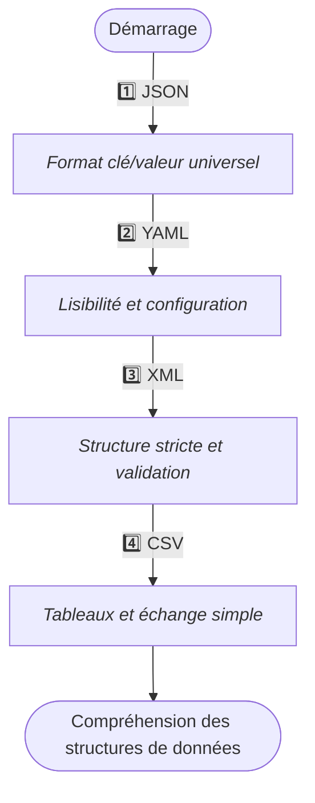

# Structures de données

## Vue d’ensemble

Les structures de données sont des **formats normalisés**[^1] permettant de représenter, stocker et échanger de l’information entre programmes, services et systèmes. Elles jouent un rôle fondamental dans le développement moderne, car elles définissent **la manière dont les données sont organisées**, **hiérarchisées**, **lisibles**, et **manipulables**.

Cette section présente les **quatre formats essentiels** utilisés quotidiennement par les _développeurs_, _administrateurs systèmes_, _analystes_ et _ingénieurs logiciel_ :

* **JSON**  
* **YAML**  
* **XML**  
* **CSV**

Chacun dispose d’une **fiche dédiée** permettant d’en comprendre la structure, les usages, les bonnes pratiques et les pièges courants.

!!! info "Comment lire cette section"
    Les formats présentés ici partagent des concepts communs, mais servent des usages différents :
    
    1. **Formats hiérarchiques**  
       _JSON, YAML, XML – idéals pour représenter des structures complexes._
    
    2. **Formats tabulaires**  
       _CSV – conçu pour manipuler des données organisées en tableaux._
    
    3. **Formats orientés configuration**  
       _YAML et JSON sont très utilisés pour configurer des services, outils DevOps ou applications._
    
    4. **Formats orientés échange**  
       _JSON est dominant dans les API. XML reste courant dans les systèmes anciens ou normatifs._

## Présentation des formats

- ### :lucide-file-json:{ .lg .middle } › JSON  
    ---
    Format léger, lisible et structuré, très utilisé dans les **API**, les **applications web**, et la **sérialisation de données**.  
    JSON repose sur une structure clé/valeur simple, facile à manipuler dans la plupart des langages.

    [:lucide-book-open-check: Voir la fiche JSON](./json)

- ### :lucide-file-cog:{ .lg .middle } › YAML  
    ---
    Connu pour sa **lisibilité** et sa **syntaxe épurée**, YAML est largement utilisé dans les **outils DevOps**, **CI/CD**, **Kubernetes**, **Ansible**, et les **applications configurables**.

    [:lucide-book-open-check: Voir la fiche YAML](./yml)

- ### :lucide-file-code:{ .lg .middle } › XML  
    ---
    Format structuré, robuste et extensible.  
    Très utilisé dans les **systèmes d’entreprise**, les **normes industrielles**, les **services anciens**, et certains frameworks exigeant des schémas stricts.

    [:lucide-book-open-check: Voir la fiche XML](./xml)

- ### :lucide-table:{ .lg .middle } › CSV  
    ---
    Format tabulaire simple et universel, idéal pour l’échange de données entre outils, feuilles de calcul, scripts ou bases relationnelles.

    [:lucide-book-open-check: Voir la fiche CSV](./csv)

## Progression pédagogique recommandée

!!! abstract "Compréhension"
    La progression ci-dessous propose un parcours logique :  
    passer des formats les plus structurés (**JSON**, **YAML**, **XML**) au plus simple (**CSV**), tout en comprenant **leurs similitudes**, **leurs différences**, et **leurs usages privilégiés**.

*Cette progression met en lumière les différents modèles d’organisation des données :  
**hiérarchique → déclaratif → structuré → tabulaire**.*

## Rôle dans l’écosystème global

Les structures de données jouent un rôle transversal dans tous les domaines de l’informatique.
Elles sont essentielles pour comprendre :

* les **requêtes API** (REST, GraphQL),
* les **configurations DevOps** (Docker, Kubernetes, Ansible, CI/CD),
* les **systèmes distribués[^2] et microservices[^3]**,
* les **bases de données**,
* les **formats d’échange entre langages**,
* les **outils d’analyse et de manipulation de données**.

> Maîtriser ces formats permet de travailler efficacement avec des services, des outils et des environnements hétérogènes.

## Conclusion

!!! quote "Point d’entrée vers la manipulation des données"
    Cette section constitue un passage incontournable pour comprendre comment les données sont **stockées**, **échangées**, **configurées** et **manipulées** dans les environnements modernes.
    
    Chaque fiche approfondit un format clé, ses avantages, ses limites et ses usages recommandés.

[^1]: **Un format normalisé** est une manière de représenter des données ou des informations selon un ensemble de **règles officielles** et **uniformes**, garantissant qu’elles seront comprises et traitées correctement par n’importe quel système conforme à la même norme.
[^2]: **Un système distribué** est **un ensemble de machines** ou **de services autonomes** qui collaborent comme un tout cohérent pour _exécuter une tâche_, tout en étant physiquement séparés et connectés par un réseau.
[^3]: **Un microservice** est un service logiciel autonome, spécialisé dans une fonction précise, déployé indépendamment et communiquant avec les autres via des API légères afin de construire un système modulaire, scalable et résilient.
