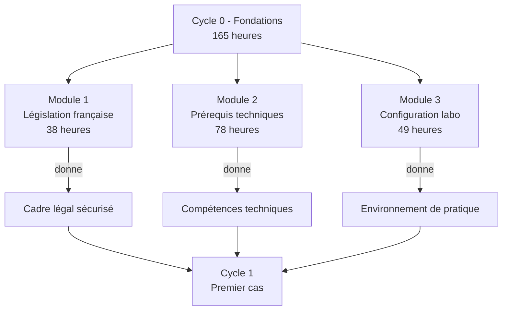

# Cycle 0 - Fondations

!!! quote "L'analogie de la fondation du bâtiment"

    Avant qu'un architecte ne dessine la façade, avant que le maçon ne pose la première brique apparente, des semaines sont consacrées à la fondation. Invisible une fois le bâtiment terminé, elle est pourtant ce qui détermine si le bâtiment tiendra dix ans ou cent ans. Le cycle 0 d'OmnyAcademy joue ce rôle. Aucune compétence forensic n'y est acquise au sens strict. Mais sans lui, tout le reste s'effondrera tôt ou tard. Législation pour ne jamais commettre d'infraction, prérequis techniques pour analyser sans tâtonner, laboratoire physique pour pratiquer sans contrainte virtuelle. Trois modules, 165 heures, indispensables.

## Présentation du cycle

Le cycle 0 est le **socle préparatoire** d'OmnyAcademy. Il prépare l'apprenant à toute la suite du parcours en couvrant les trois piliers indispensables :



## Objectifs du cycle 0

À l'issue de ce cycle, vous serez capable de :

| Domaine | Compétence acquise |
|---|---|
| Juridique | Mener toute mission dans un cadre légal opposable |
| Technique Linux | Investiguer un système Linux compromis |
| Technique Windows | Investiguer un poste Windows compromis |
| Technique macOS | Investiguer un Mac Apple Silicon (spécificité française) |
| Cryptographie | Comprendre les enjeux et limites en forensic |
| Systèmes de fichiers | Lire NTFS, ext4, APFS au niveau forensic |
| Méthodologie | MITRE ATT&CK, Cyber Kill Chain, Diamond Model |
| Matériel | Laboratoire physique réel opérationnel |

## Architecture pédagogique

| Caractéristique | Précision |
|---|---|
| Durée totale | 165 heures |
| Rythme conseillé | 8-15 heures par semaine |
| Durée calendaire | 3 à 5 mois |
| Prérequis d'entrée | Notions IT générales, motivation |
| Validation | Auto-évaluations + auto-explications vidéo |

## Plan détaillé des modules

### Module 1 - Législation française (38 h)

Cadre juridique du forensic et du pentest en France et en Europe :
- Hiérarchie des normes
- Loi Godfrain et articles 323
- Article 226-15 secret correspondances
- LCEN, LPM, NIS2 (Loi Résilience 2026)
- RGPD articles 32-33-34
- DORA pour le secteur financier
- Cadre du pentest légal
- Jurisprudences fondatrices
- Templates contractuels

[Accéder au module 1](module-1-legislation/README.md)

### Module 2 - Prérequis techniques (78 h)

Compétences techniques transversales :
- Linux fondamentaux et avancé
- Windows architecture
- macOS architecture (Apple Silicon)
- PowerShell, bash, zsh
- Réseaux TCP/IP
- Cryptographie et hash
- Systèmes de fichiers (NTFS, ext4, APFS)
- MITRE ATT&CK et frameworks de menace

[Accéder au module 2](module-2-prerequis-techniques/README.md)

### Module 3 - Configuration laboratoire (49 h)

Mise en place du laboratoire forensic physique :
- Inventaire et achat du matériel reconditionné
- Topologie réseau et adressage
- Configuration OpenWrt sur Archer C7
- Wi-Fi WPA2 volontairement faible
- Serveur Debian, postes Windows, Active Directory
- Kali attaquant et CAINE analyste
- Outils d'acquisition (Alfa, write-blocker)
- Préparation MacBook M1 forensic
- Documentation et validation

[Accéder au module 3](module-3-configuration-laboratoire/README.md)

## Méthodologie de validation

À l'issue de chaque chapitre :

1. **Auto-évaluation écrite** (10 minutes) : tableau de questions/réponses
2. **Auto-explication vidéo** : enregistrement où vous expliquez le chapitre
3. **Application pratique** : exercice sur votre propre matériel ou vos templates

À l'issue de chaque module : synthèse personnelle et validation des compétences.

À l'issue du cycle 0 : **examen blanc complet** simulant un audit RNCP.

## Calendrier indicatif

| Semaine | Activité |
|---|---|
| 1-3 | Module 1 chapitres 1.1 à 1.7 |
| 4-5 | Module 1 chapitres 1.8 à 1.16 |
| 6-9 | Module 2 chapitres 2.1 à 2.10 bis |
| 10-12 | Module 2 chapitres 2.11 à 2.14 + module 3 setup |
| 13-15 | Module 3 configuration complète |
| 16 | Validation cycle 0 |

## Démarrer

```bash
# Cloner ou télécharger le parcours
cd ~/Documents/omnyacademy

# Commencer par le module 1
cd 01-cycle-0-fondations/module-1-legislation/
cat README.md
cat 01-1-hierarchie-normes.md
```

---

**Cycle suivant** : [Cycle 1 - Premier cas pratique complet](../02-cycle-1-premier-cas/) (à produire ultérieurement)
