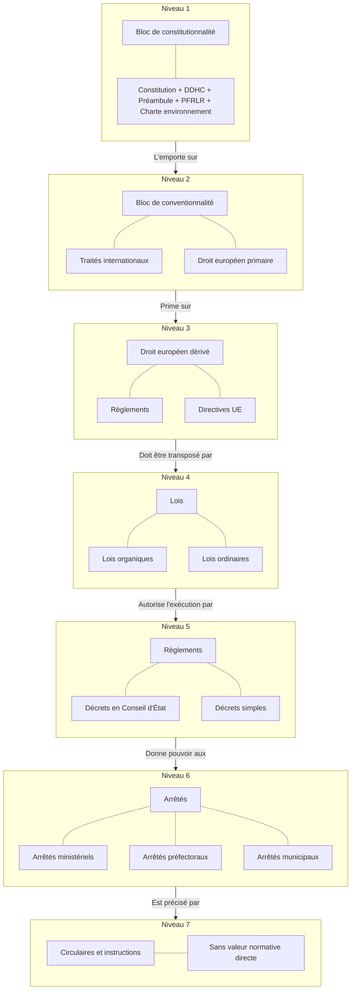
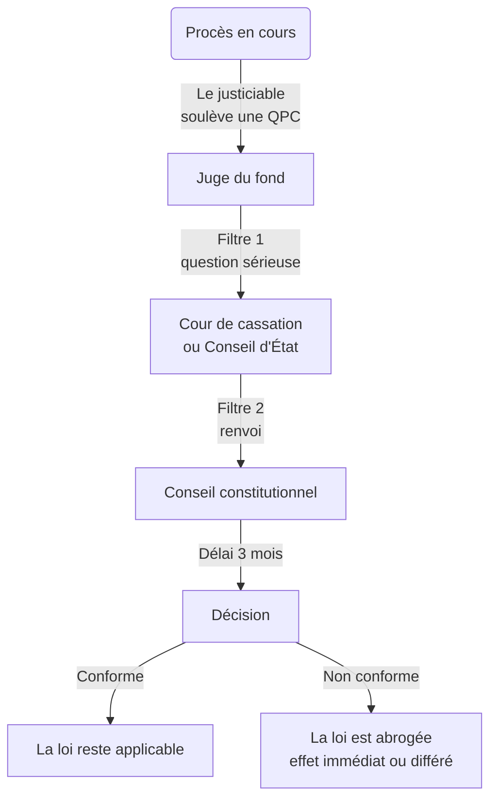
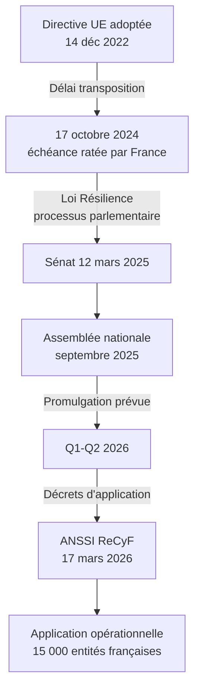
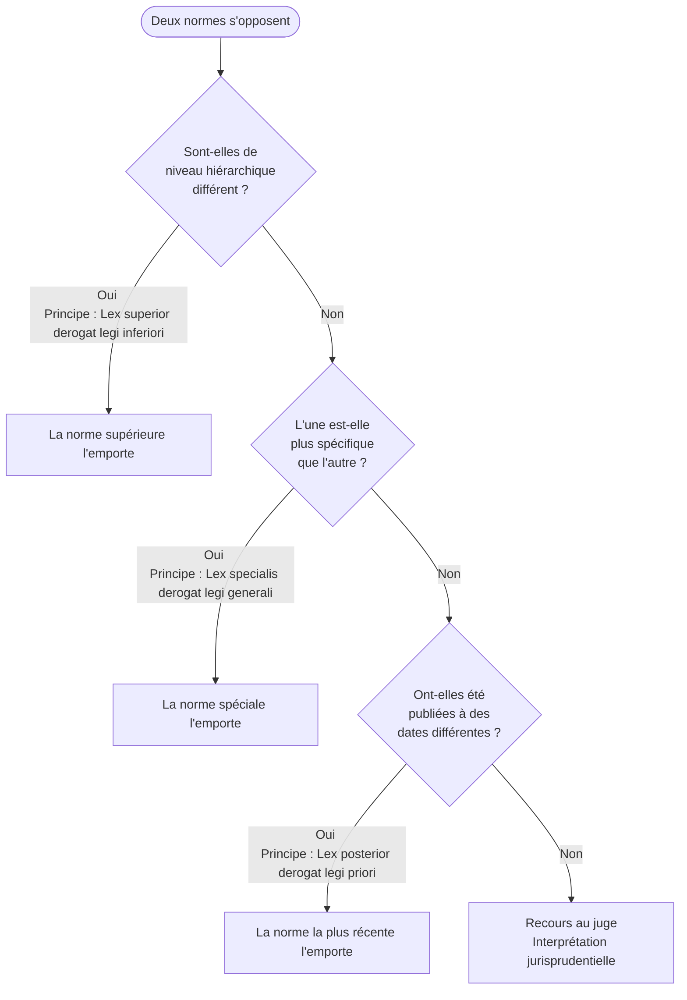
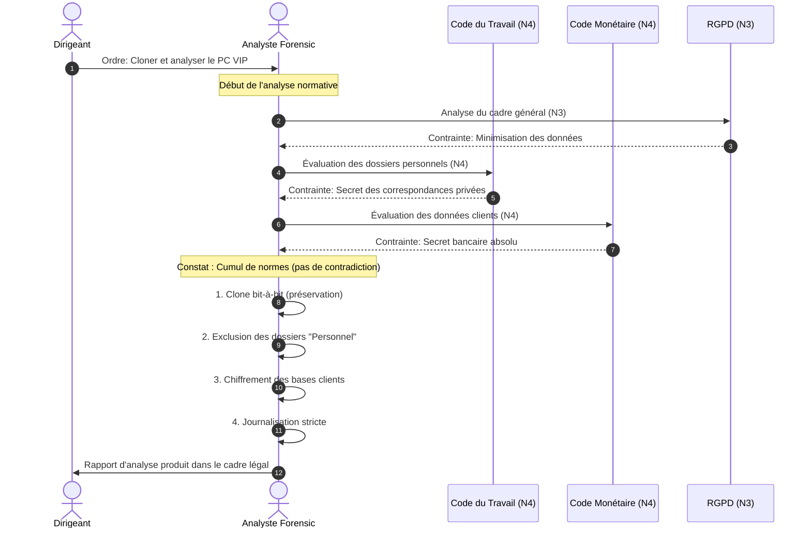

# Hiérarchie des normes en France

<div
  class="omny-meta"
  data-level="🟢 Débutant & 🟡 Intermédiaire"
  data-version="Droit Français (2026)"
  data-time="30-45 minutes">
</div>

!!! note "**Livrables :** _Schéma personnel de la pyramide, exercice d'identification_"
!!! note "**Auto-explication :** _Savoir expliquer la notion en 10 minutes sans regarder ses notes_"

<br>

---

<br>

!!! quote "L'analogie de la pyramide alimentaire"

    Quand un nutritionniste veut comprendre votre régime, il ne se contente pas de regarder ce que vous avez mangé hier. Il dresse la pyramide alimentaire : les bases minérales, les protéines structurelles, les glucides énergétiques, les vitamines de finition. Chaque étage soutient l'étage du dessus et conditionne ce qui peut s'y trouver. Le droit français fonctionne pareillement. Quand on cite un article du Code pénal, on ne raisonne jamais isolément. On le situe dans une pyramide qui descend de la Constitution jusqu'aux arrêtés municipaux. Comprendre cette pyramide, c'est savoir où chercher la règle, comment l'interpréter, et surtout pourquoi telle disposition l'emporte sur telle autre en cas de conflit.

## Objectifs pédagogiques

!!! tip "À la fin de ce chapitre, vous serez capable de :"

    - Décrire la pyramide des normes françaises en sept niveaux distincts.
    - Identifier le bloc de constitutionnalité et ses composantes.
    - Expliquer la primauté du droit européen sur le droit national.
    - Localiser une norme dans la hiérarchie quand elle est citée dans un texte.
    - Justifier pourquoi un article du Code pénal peut être contesté pour inconstitutionnalité.

<br>

---

<br>

## Pourquoi commencer par la hiérarchie

Tous les chapitres suivants citent des articles précis. Ces articles ne tombent pas du ciel. Ils s'inscrivent dans une **structure ordonnée** où chaque norme tire sa validité d'une norme supérieure. Sans cette compréhension structurelle, les chapitres juridiques deviennent une accumulation de règles sans logique apparente.

Trois bénéfices opérationnels immédiats :

| Bénéfice | Application concrète en forensic |
|---|---|
| Hiérarchiser les obligations | Quand le RGPD et droit du travail entrent en conflit, lequel l'emporte ? |
| Identifier les recours possibles | Un client peut-il contester une saisie au nom de la Constitution ? |
| Anticiper les évolutions | Une directive européenne en cours peut-elle modifier vos obligations futures ? |

## La pyramide Kelsen

La pyramide de Kelsen de la hiérarchie des normes, telle qu'elle existe en avril 2026 comprend **sept niveaux**, du plus haut au plus bas.

### Schéma de la pyramide



!!! warning "_**Règle absolue** : une norme inférieure ne peut pas contredire une norme supérieure. Si elle le fait, elle est susceptible d'annulation par le juge compétent._"

<br>

### Juge compétent en cas de violation

> Attention, il existe des nuances importantes. Par exemple, un règlement européen peut avoir une portée plus large qu'une loi nationale, et un arrêté ministériel peut primer sur un arrêté préfectoral. Il est donc essentiel de bien comprendre la hiérarchie des normes pour savoir quel juge contacter en cas de violation._

Ci-dessous, un tableau récapitulatif des juges compétents en cas de violation de chaque niveau de la hiérarchie des normes :

| Niveau | Juge compétent en cas de violation |
|---|---|
| Niveau 1 (constitutionnalité) | Conseil constitutionnel via Question prioritaire de constitutionnalité (QPC) |
| Niveau 2 (conventionnalité) | Tout juge ordinaire (judiciaire ou administratif) |
| Niveau 3 (droit dérivé UE) | Tout juge ordinaire ou Cour de justice de l'UE (CJUE) |
| Niveau 4 (loi) | Conseil constitutionnel ou juge ordinaire |
| Niveau 5 (règlement) | Conseil d'État ou tribunal administratif |
| Niveau 6 (arrêté) | Tribunal administratif |
| Niveau 7 (circulaire) | Tribunal administratif si elle a effet réglementaire déguisé |

<br>

---

<br>


## Niveau 1 - Le bloc de constitutionnalité

Le **bloc de constitutionnalité** est la norme suprême en droit français. Il a été défini par le Conseil constitutionnel dans sa décision fondatrice du 16 juillet 1971 (décision Liberté d'association). Il regroupe cinq textes de valeur constitutionnelle.

### Composantes du bloc

> Le tableau ci-dessous récapitule les composantes du bloc de constitutionnalité et leur pertinence pour le forensic :

| Composante | Date | Pertinence pour le forensic |
|---|:---:|---|
| Constitution de 1958 | 4 octobre 1958 | Articles relatifs à la séparation des pouvoirs, justice, libertés |
| Déclaration des droits de l'homme et du citoyen (DDHC) | 26 août 1789 | Articles 2, 4 (liberté), 8 (proportionnalité des peines), 9 (présomption d'innocence) |
| Préambule de la Constitution de 1946 | 27 octobre 1946 | Droits sociaux et économiques |
| Principes fondamentaux reconnus par les lois de la République (PFRLR) | Construction jurisprudentielle | Liberté d'association, droits de la défense |
| Charte de l'environnement | 1er mars 2005 | Principe de précaution |

### Articles particulièrement pertinents pour le forensic

Trois articles de la DDHC[^1] structurent toute votre pratique :

!!! abstract "**Article 8 de la DDHC** : _La loi ne doit établir que des peines strictement et évidemment nécessaires, et nul ne peut être puni qu'en vertu d'une loi établie et promulguée antérieurement au délit._"

**Conséquence pratique** : on ne peut pas vous condamner pour un fait qui n'était pas explicitement érigé en infraction au moment où vous l'avez commis. C'est le principe de **légalité criminelle**, qui protège tous les analystes forensic en cas d'évolution du droit.

!!! abstract "**Article 9 de la DDHC** : _Tout homme étant présumé innocent jusqu'à ce qu'il ait été déclaré coupable..._"

**Conséquence pratique** : vos rapports forensic doivent **présenter les faits sans présumer la culpabilité**. Un rapport qui conclut "M. X est coupable de détournement de fonds" outrepasse la fonction de l'analyste. Le bon vocabulaire est "Les faits techniquement établis sont compatibles avec l'hypothèse d'un détournement de fonds".

!!! abstract "**Article 16 de la DDHC** : _Toute société dans laquelle la garantie des droits n'est pas assurée, ni la séparation des pouvoirs déterminée, n'a point de Constitution._"

**Conséquence pratique** : la séparation des pouvoirs explique pourquoi vous ne pouvez **jamais** mener une investigation à la demande d'un dirigeant d'entreprise contre un salarié sans cadre judiciaire. Le pouvoir d'enquête appartient à l'autorité judiciaire, pas au directeur.

### Le contrôle de constitutionnalité

Depuis 2010, tout justiciable peut soulever une **Question prioritaire de constitutionnalité (QPC)** devant n'importe quelle juridiction. Si la QPC est jugée sérieuse, le Conseil constitutionnel examine la conformité de la loi à la Constitution.



_**Cas pertinent pour le forensic** : la QPC du 9 février 2018 (n°2017-693) sur les enquêtes administratives en matière de cybersécurité. Le Conseil constitutionnel a précisé les conditions dans lesquelles l'ANSSI peut effectuer des contrôles, en limitant les pouvoirs intrusifs. Cette décision conditionne aujourd'hui les modalités d'audit imposées aux OIV._

<br>

---

<br>

## Niveau 2 - Le bloc de conventionnalité

Au-dessus des lois nationales mais en-dessous de la Constitution figurent les **traités internationaux** ratifiés par la France. Cette primauté est posée par l'article 55 de la Constitution.

### Article 55 de la Constitution

*"Les traités ou accords régulièrement ratifiés ou approuvés ont, dès leur publication, une autorité supérieure à celle des lois, sous réserve, pour chaque accord ou traité, de son application par l'autre partie."*


### Traités structurants pour le forensic

Ci-dessous, un tableau récapitulatif des traités internationaux ratifiés par la France et leur pertinence pour le forensic :

| Traité | Année de ratification par la France | Pertinence forensic |
|---|:---:|---|
| Convention européenne des droits de l'homme (CEDH) | 1974 | Article 6 droit à un procès équitable, article 8 vie privée |
| Convention de Budapest sur la cybercriminalité | 2006 | Coopération internationale en cybercriminalité |
| Pacte international relatif aux droits civils et politiques | 1980 | Article 17 protection vie privée |

### La Convention de Budapest spécifiquement

La Convention sur la cybercriminalité du Conseil de l'Europe, signée à Budapest le 23 novembre 2001, est le seul traité international général sur la cybercriminalité. Soixante-huit États l'ont ratifiée à ce jour.

Trois éléments à retenir :

!!! abstract "**Élément 1 - Harmonisation des incriminations** : _Les États signataires s'engagent à criminaliser certains actes (accès illégal, interception, atteintes à l'intégrité de données, faux informatique, fraude informatique)._"

!!! abstract "**Élément 2 - Procédure d'enquête internationale** : _La Convention autorise la conservation rapide de données stockées et la conservation rapide de données de trafic dans le cadre d'une coopération transfrontalière._"

!!! abstract "**Élément 3 - Production de preuves** : _Les preuves obtenues conformément à la Convention sont mutuellement reconnues entre États signataires, ce qui simplifie les enquêtes internationales._"

<br>

---

<br>

!!! info "Cas pratique"

    Si une PME française est attaquée depuis un serveur loué en Allemagne par un acteur opérant depuis le Brésil, la Convention de Budapest permet à la justice française de demander à la justice allemande la conservation immédiate des logs du serveur, pendant que les démarches d'extradition sont engagées avec le Brésil. Sans cette Convention, la coopération serait soumise aux lourdeurs habituelles des entraides judiciaires bilatérales.

<br>

---

<br>

## Niveau 3 - Le droit européen dérivé

Le droit européen dérivé regroupe les actes adoptés par les institutions de l'Union européenne sur la base des traités. Deux types d'actes nous concernent.

### Règlements européens

Le **règlement** est directement applicable dans tous les États membres dès sa publication au Journal officiel de l'Union européenne (JOUE[^2]). Il n'a pas besoin de transposition nationale.

Le règlement le plus emblématique pour notre métier est le **RGPD** (Règlement UE 2016/679), adopté le 27 avril 2016 et entré en application le 25 mai 2018. Son **article 99** dispose : _"Le présent règlement entre en vigueur le vingtième jour suivant celui de sa publication au Journal officiel de l'Union européenne."_

!!! note "**Conséquence** : _aucun analyste forensic ne peut prétexter ignorer le RGPD au motif qu'il attendait une loi française. Le règlement s'impose directement._"

<br>

### Directives européennes

La **directive** est un acte qui fixe des objectifs aux États membres mais leur laisse la liberté de choisir la forme et les moyens. Elle nécessite une **transposition nationale** par une loi ou un règlement.

!!! example "Exemple emblématique en cours"

    la directive **NIS2** (UE 2022/2555). Adoptée le 14 décembre 2022, elle devait être transposée par les États membres avant le 17 octobre 2024. La France ne l'a pas fait dans les délais. La transposition est en cours via la **Loi Résilience**, adoptée au Sénat le 12 mars 2025, examinée à l'Assemblée nationale en septembre 2025, dont la promulgation est attendue au premier semestre 2026.

Le schéma suivant retrace le processus :



_**Implication pratique** : tant que la transposition n'est pas finalisée, les obligations NIS2 ne sont pas directement opposables aux entreprises françaises **dans toute leur étendue**. Mais la directive elle-même peut être invoquée dans certains cas (effet direct vertical) et l'ANSSI encourage les entités concernées à anticiper._

<br>

---

<br>

## Niveau 4 - La loi

Le **niveau de la loi** se subdivise en trois catégories.

### Lois organiques

!!! abstract "**Définition et rôle** : Les lois organiques sont des lois qui ont pour objet de préciser les modalités d'organisation et de fonctionnement des pouvoirs publics. Elles se situent à un niveau intermédiaire entre la Constitution et les Lois ordinaires."

Elles ne peuvent être adoptées que dans les domaines limitativement énumérés par la Constitution (**ex:** _statut des magistrats_, _lois de finances_, _fonctionnement du Conseil constitutionnel_).

!!! example "**Exemple pertinent** : _la loi organique n°2009-1523 du 10 décembre 2009 relative à l'application de l'article 61-1 de la Constitution, qui a institué la Question prioritaire de constitutionnalité (QPC)._"

> Ces lois précisent l'organisation et le fonctionnement des pouvoirs publics dans les domaines prévus par la Constitution. Elles sont adoptées selon une **procédure renforcée (Article 46)** et sont **systématiquement contrôlées** par le Conseil constitutionnel avant leur promulgation.

<br>

### Lois ordinaires

!!! abstract "**Définition** : Les lois ordinaires constituent le socle commun du droit français. Elles sont votées par le Parlement (Assemblée nationale et Sénat) dans les domaines définis par l'**Article 34** de la Constitution."

Elles suivent la **procédure législative classique** (système de "navette" entre les deux chambres). C'est le niveau normatif que vous rencontrerez le plus fréquemment dans votre carrière d'analyste, car il définit les infractions et les règles de preuve.

Le tableau ci-dessous récapitule les lois ordinaires fondamentales qui ont façonné le paysage du forensic et de la cybercriminalité en France :

| Loi | Date | Apport au cadre forensic |
|---|:---:|---|
| Loi Godfrain | 5 janvier 1988 | Création des infractions informatiques (chapitre 1.2) |
| Loi pour la confiance dans l'économie numérique (LCEN) | 21 juin 2004 | Conservation des données, responsabilité des hébergeurs |
| Loi de programmation militaire (LPM) | 18 décembre 2013 | Régime des Opérateurs d'Importance Vitale (OIV) |
| Loi Renseignement | 24 juillet 2015 | Encadrement des techniques de renseignement |
| Loi pour une République numérique | 7 octobre 2016 | Droit à la portabilité, mort numérique |
| Loi Informatique et Libertés | 6 janvier 1978 (refondue 2018) | Cadre national d'application du RGPD |
| Loi visant à conforter le respect des principes de la République | 24 août 2021 | Lutte contre la haine en ligne |
| Loi sur la cybersécurité (intégrant NIS2) - en cours | Promulgation 2026 | Transposition NIS2, REC, DORA |

<br>

### Ordonnances de l'article 38

!!! abstract "**Définition** : Les ordonnances sont des textes pris par le Gouvernement dans des matières normalement législatives, sur autorisation du Parlement. Elles ont valeur réglementaire jusqu'à leur ratification, après quoi elles acquièrent valeur législative."

!!! example "**Exemple pertinent** : _l'ordonnance n°2018-1125 du 12 décembre 2018 a refondu la loi Informatique et Libertés pour la mettre en conformité avec le RGPD._"

<br>

---

<br>

## Niveau 5 - Les règlements

!!! abstract "**Définition** : Le pouvoir réglementaire est exercé par le Premier ministre (article 21 de la Constitution) et par le Président de la République (article 13). Il englobe l'ensemble des décisions exécutives."

Il existe deux types de décrets :

### Décrets en Conseil d'État

Ces décrets sont **obligatoirement soumis pour avis** à la section administrative compétente du Conseil d'État avant signature. Ils précisent l'application des lois sensibles.

!!! example "**Exemple pertinent** : _Les décrets d'application de NIS2 attendus au second semestre 2026 préciseront les seuils, mesures techniques, et procédures de notification d'incident._"

### Décrets simples

Ces décrets sont signés par le Premier ministre seul. Ils règlent des matières moins sensibles ou de pure organisation interne.

### Le Référentiel Cyber France (ReCyF)

!!! info "**Cas particulier important** : _L'ANSSI a publié le 17 mars 2026 le **Référentiel Cyber France (ReCyF)**, qui détaille les mesures concrètes recommandées pour atteindre les objectifs de sécurité fixés par NIS2._"

Bien que ce référentiel n'ait **pas de valeur réglementaire stricte** en lui-même, sa non-application devra être justifiée (approche "comply or explain") par les entités assujetties en cas de contrôle ou d'incident.

<br>

---

<br>

## Niveau 6 - Les arrêtés

!!! abstract "**Définition** : Les arrêtés sont des décisions administratives prises par les ministres, préfets, maires ou autres autorités, dans la limite stricte de leurs compétences territoriales et matérielles."

Pour l'analyste forensic, les arrêtés ministériels les plus fréquents concernent des aspects très opérationnels :

| Arrêté | Domaine d'application |
|---|---|
| Arrêtés homologuant des produits de sécurité (ANSSI) | Qualification officielle des outils |
| Arrêtés de désignation des OIV | Identification secrète des entités critiques |
| Arrêtés de zone de défense | Plans de continuité régionaux (cyber-résilience) |

<br>

---

<br>

## Niveau 7 - Les circulaires et instructions

!!! abstract "**Définition** : Les circulaires et instructions sont des documents internes à l'administration. Elles servent à interpréter les textes pour les fonctionnaires et n'ont théoriquement **aucune valeur normative**."

!!! warning "**Exception importante** : _Si une circulaire ajoute des règles nouvelles ou modifie le sens de la loi, elle est requalifiée par le juge en **acte réglementaire déguisé** et peut être annulée._"

Pour le forensic, les doctrines de la CNIL et les recommandations de l'ANSSI ont une **importance pratique considérable**. Même sans valeur normative stricte, les ignorer expose votre organisation ou votre client à des risques réputationnels majeurs et à de lourdes contestations contentieuses.

<br>

---

<br>

## Conflits de normes - Comment les résoudre

En tant qu'analyste forensic, vous serez fréquemment confronté à des "conflits de lois". Un dirigeant s'appuiera sur sa charte informatique (règlement interne) pour vous demander une action, tandis que vous devrez respecter le Code pénal (Loi). 

Pour résoudre ces antinomies, le droit français applique un algorithme de résolution basé sur trois principes fondamentaux.

### L'algorithme de résolution

!!! info "1. Le principe de Hiérarchie (_Lex superior derogat legi inferiori_)"
    **La norme supérieure déroge à la norme inférieure.**
    C'est le filtre principal. Si une charte informatique d'entreprise stipule que l'employeur peut lire tous les mails personnels, mais que la Loi (Article 9 du Code civil) garantit le secret des correspondances privées, la Loi l'emporte de façon absolue. La charte est juridiquement inopérante sur ce point.

!!! info "2. Le principe de Spécialité (_Lex specialis derogat legi generali_)"
    **La norme spéciale déroge à la norme générale.**
    À niveau hiérarchique équivalent (ex: deux lois), un texte qui vise une situation très précise l'emporte sur un texte de portée générale. 
    _Exemple_ : Le Code civil pose des règles générales sur la responsabilité, mais en cas de fuite de données personnelles, ce sont les sanctions spécifiques de la Loi Informatique et Libertés qui priment.

!!! info "3. Le principe de Chronologie (_Lex posterior derogat legi priori_)"
    **La norme postérieure déroge à la norme antérieure.**
    À niveau et spécialité égaux, c'est la règle la plus récente qui s'applique. Le législateur est censé avoir pris en compte l'ancienne loi et avoir voulu la modifier implicitement par ce nouveau texte.

!!! warning "L'ultime recours : L'interprétation du juge"
    Si l'application de ces trois filtres ne suffit pas, ou si les textes sont trop obscurs, seul le juge (Cour de cassation, Conseil d'État) a le pouvoir d'interpréter la loi. Cette interprétation continue forme la **Jurisprudence**.

<br>

### Logique de décision

Ci-dessous la logique de décision sous forme de schéma afin de vous aider à résoudre les conflits de normes :



<br>

### Cas pratique : L'investigation interne face au cumul normatif

Souvent, ce qui ressemble à un conflit de normes est en réalité un **cumul de contraintes**. Voici une situation classique en réponse à incident.

!!! example "**Situation** : Investigation sur un poste VIP"
    Le dirigeant d'une banque vous mandate pour cloner et analyser en urgence le disque dur d'un cadre supérieur suspecté d'espionnage industriel.

    - Le **Code du travail** (Loi - Niv 4) impose la justification et la proportionnalité des atteintes aux libertés du salarié.
    - Le **Code monétaire et financier** (Loi - Niv 4) impose le secret bancaire absolu sur les données clients potentiellement présentes.
    - Le **RGPD** (Règlement UE - Niv 3) impose la minimisation des données personnelles traitées lors de l'investigation.

**Comment aborder la situation :**

1. **Hiérarchie** : Le RGPD (Niveau 3) encadre globalement la démarche. Vous ne pouvez pas procéder à un "chalutage" (copie intégrale sans filtrage) sans documenter une base légale stricte.

2. **Cumul et Spécialité** : Le Code monétaire protège les clients, le Code du travail protège le salarié. Il n'y a pas de contradiction, les contraintes **s'additionnent**.

3. **Résolution Forensic** : La solution au conflit juridique est souvent **technique**. Vous devrez cloner le disque (préservation), mais isoler les répertoires identifiés comme "Personnels" (respect du Code du travail) et chiffrer l'accès aux bases de données clients (respect du Code monétaire), tout en traçant rigoureusement chaque action dans un journal auditable (respect du RGPD).

### Cinématique de la résolution

Ci-dessous un diagramme de séquence expliquant la résolution du cas pratique tout en respectant la charte éthique de l'analyste forensic.



<br>

---

<br>

## La hiérarchie en image - Schéma personnel

À ce stade, dessinez **à la main** votre propre version de la pyramide normative. Cet exercice de mémorisation active est plus efficace que la simple lecture.

Modèle suggéré :

```text
                    ┌─────────────────────────────────────────┐
                    │ NIVEAU 1 - Bloc de constitutionnalité   │
                    │ Constitution + DDHC + Préambule + PFRLR │
                    │ + Charte environnement                  │
                    └─────────────────────────────────────────┘
                               │ Conseil constitutionnel
                    ┌─────────────────────────────────────────┐
                    │ NIVEAU 2 - Bloc de conventionnalité     │
                    │ Traités internationaux ratifiés         │
                    │ CEDH, Budapest, etc.                    │
                    └─────────────────────────────────────────┘
                               │
                    ┌─────────────────────────────────────────┐
                    │ NIVEAU 3 - Droit européen dérivé        │
                    │ Règlements (RGPD) - effet direct        │
                    │ Directives (NIS2) - transposition req.  │
                    └─────────────────────────────────────────┘
                               │
                    ┌─────────────────────────────────────────┐
                    │ NIVEAU 4 - Lois                         │
                    │ Lois organiques, lois ordinaires,       │
                    │ ordonnances ratifiées                   │
                    └─────────────────────────────────────────┘
                               │
                    ┌─────────────────────────────────────────┐
                    │ NIVEAU 5 - Règlements                   │
                    │ Décrets en CE, décrets simples          │
                    └─────────────────────────────────────────┘
                               │
                    ┌─────────────────────────────────────────┐
                    │ NIVEAU 6 - Arrêtés                      │
                    │ Ministériels, préfectoraux, municipaux  │
                    └─────────────────────────────────────────┘
                               │
                    ┌─────────────────────────────────────────┐
                    │ NIVEAU 7 - Circulaires et instructions  │
                    │ Pas de valeur normative directe         │
                    └─────────────────────────────────────────┘
```

<br>

---

<br>

## Pièges et bonnes pratiques

!!! failure "Piège 1 : Confondre Directive et Règlement"
    **Erreur typique** : _"Le RGPD a été transposé par la loi Informatique et Libertés."_ <br>
    **Correction** : Le RGPD est un **Règlement**, il est donc directement applicable sans transposition. La loi française a simplement été **adaptée** pour s'articuler avec lui. À l'inverse, NIS2 est une **Directive** et nécessite bien une transposition (ex: Loi Résilience).

!!! failure "Piège 2 : Ignorer la primauté du droit européen"
    **Erreur typique** : _"Le Code du travail français m'impose telle action, je l'applique à la lettre."_ <br>
    **Correction** : Vous devez toujours vérifier que cette disposition ne contredit pas une norme européenne (comme le RGPD). En cas de conflit direct, l'Europe l'emporte (Principe de Lex superior).

!!! failure "Piège 3 : Surévaluer la portée d'une circulaire"
    **Erreur typique** : _"Il est obligatoire de faire X car une circulaire de l'ANSSI le demande."_ <br>
    **Correction** : Les circulaires (Niveau 7) interprètent la loi mais n'ont pas de force normative directe. Ce sont des **doctrines de référence**, pas des lois.

<br>

## Bonnes pratiques de l'Analyste

!!! tip "1. Préciser le niveau de la norme"
    Dans vos rapports forensic, ne citez jamais un article isolé. Écrivez plutôt : "_L'article 323-1 du Code pénal (Niveau 4 - Loi)_". Cela montre au lecteur ou au juge que vous maîtrisez le poids juridique de votre argument.

!!! tip "2. Figer la ligne temporelle (Lex posterior)"
    Les textes évoluent sur Légifrance. Dans une enquête, c'est la loi en vigueur **au moment précis des faits** qui s'applique, et non celle en vigueur le jour de la rédaction de votre rapport.

!!! tip "3. Gérer un référentiel documentaire"
    Créez et maintenez un fichier `sources-juridiques.md` listant les URL permanentes (stables) de Légifrance pour chaque article critique. Les numéros d'articles peuvent changer lors des refontes de codes.

<br>

---

<br>

## Manipulation pratique

### Exercice 1 - Cartographier une obligation

Prenez l'obligation suivante : *"Une PME victime d'une violation de données doit notifier la CNIL sous 72 heures."*

Localisez chaque élément de cette obligation dans la pyramide :

| Élément | Texte source | Niveau |
|---|:---:|:---:|
| Obligation de notification | RGPD article 33 | Niveau 3 (Règlement UE) |
| Délai de 72 heures | RGPD article 33 §1 | Niveau 3 (Règlement UE) |
| Notification à la CNIL | Loi Informatique et Libertés | Niveau 4 (Loi) |
| Modèle de notification | Téléservice et FAQ CNIL | Niveau 7 (Doctrine) |

### Exercice 2 - Identifier la norme suprême applicable

Pour chaque situation suivante, identifiez quelle norme s'applique en priorité :

| Situation | Norme prioritaire | Pourquoi |
|---|:---:|---|
| Un salarié refuse de remettre son téléphone professionnel à l'employeur | Cumul normatif | L'employeur ne peut pas forcer l'accès sans cadre (Art. 9 Code Civil, RGPD). |
| Un client demande un audit forensic sans cadre écrit | Code pénal (Art. 323-1) | Sans accord explicite, c'est un piratage illégal. |
| Un magistrat ordonne la saisie d'un disque dur | Code de procédure pénale | La loi judiciaire autorise expressément la perquisition. |

<br>

---

<br>

## Auto-évaluation

!!! question "Testez vos connaissances (sans relire)"
    1. Quels sont les 5 composants du bloc de constitutionnalité ?
    2. Qu'est-ce qu'une QPC ?
    3. Quelle est la différence entre un règlement et une directive UE ?
    4. Quelle est la primauté entre le RGPD et le Code du travail ?
    5. Quels sont les 3 adages latins de résolution des conflits ?

> _Les réponses sont dispersées dans les blocs **Abstract** et **Info** du chapitre. Cherchez-les si vous hésitez !_

<br>

---

<br>

## Synthèse mémo

!!! success "À retenir absolument"
    1. La pyramide compte **7 niveaux**, de la Constitution aux circulaires.
    2. Une norme inférieure ne peut **jamais** contredire une norme supérieure.
    3. Le **RGPD** est un règlement européen directement applicable (pas besoin de loi française).
    4. **NIS2** est une directive nécessitant une transposition (ex: Loi Résilience).
    5. Résolution de conflit : **Hiérarchie > Spécialité > Chronologie > Juge**.
    6. **Règle d'or en rédaction** : Toujours préciser le niveau et la date en vigueur de la norme citée.

<br>

---

<br>

## Pour aller plus loin

Ci-dessous une liste des ressources pour approfondir le sujet :

| Ressource | Type | Pertinence |
|---|:---:|---|
| [Légifrance](https://www.legifrance.gouv.fr) | Site officiel | La seule source de vérité pour le texte en vigueur |
| Site du Conseil constitutionnel | Institution | Suivi des QPC |
| Site de la CNIL | Autorité | Doctrines et sanctions |

<br>

---

<br>

## Auto-explication

!!! tip "Défi pédagogique (Technique Feynman)"
    Pour valider définitivement ce chapitre, enregistrez une vidéo ou un audio de 10 minutes où vous expliquez à voix haute :
    
    1. Ce qu'est la hiérarchie des normes.
    2. Les 7 niveaux avec un exemple pour chacun.
    3. Le bloc constitutionnel.
    4. Le mécanisme de résolution des conflits (les 3 adages latins).
    
    _Stockez cette preuve dans votre dossier personnel d'auto-évaluation._

<br>

---

<br>

## Conclusion

!!! quote "Ce qu'il faut retenir"
    La maîtrise théorique et pratique de la hiérarchie des normes est indispensable pour asseoir la validité juridique de vos investigations. L'évolution constante du cadre légal exige une veille rigoureuse et une remise en question permanente de vos acquis.

> [Chapitre suivant : 1.2 Loi Godfrain de 1988 →](01-2-loi-godfrain.md)

<br>

[^1]: **DDHC** : Déclaration des Droits de l'Homme et du Citoyen du 26 août 1789. Texte fondateur du droit français, intégré au bloc de constitutionnalité.
[^2]: **JOUE** : Journal Officiel de l'Union Européenne. Publication officielle où sont enregistrés et publiés les règlements et directives européens.
