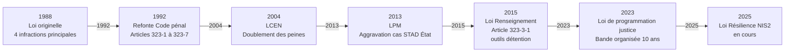
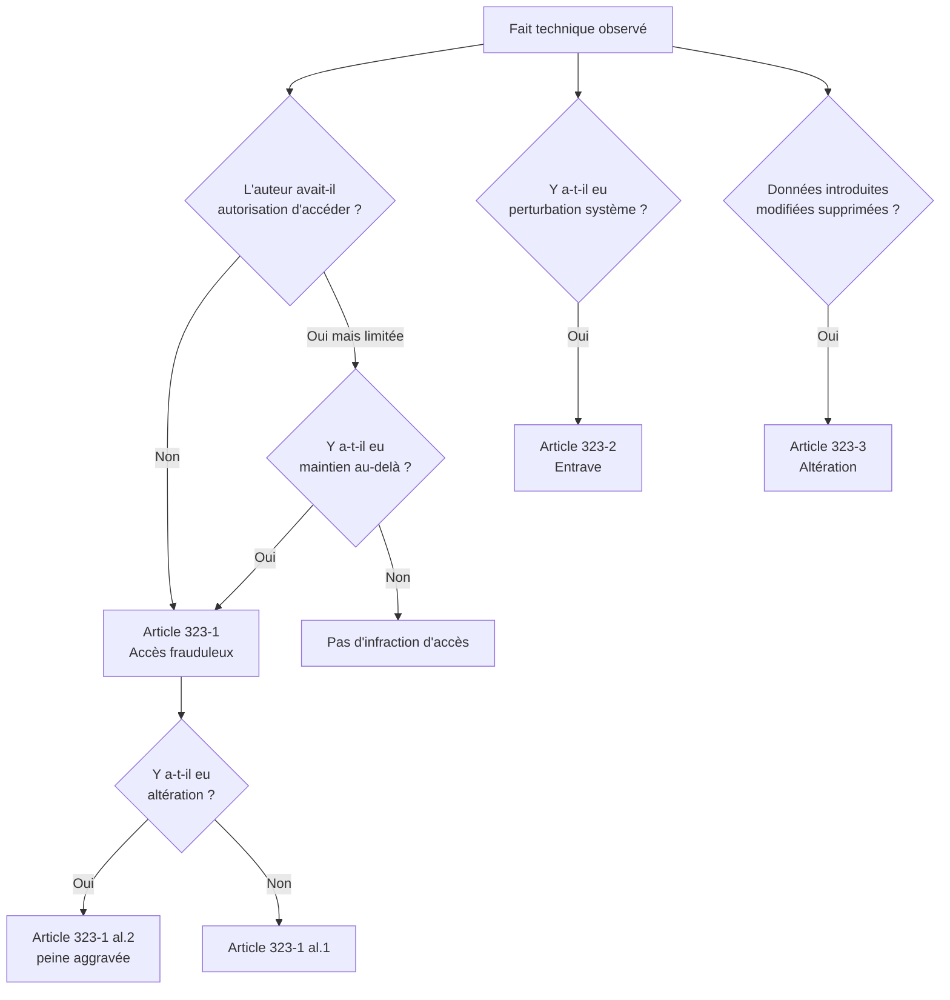

# 1.2 Loi Godfrain de 1988 et son contexte historique

!!! note "**Livrables :** _Frise chronologique, exercice de qualification_"
!!! note "**Auto-explication :** _Savoir expliquer la loi en 10 minutes sans regarder ses notes_"

 

---

 

!!! quote "L'analogie de la première carte routière"

    Quand l'automobile s'est démocratisée au début du XXe siècle, les routes existaient mais n'étaient pas conçues pour elle. Les charrettes et les voitures se croisaient sans règles, les accidents se multipliaient, les juges peinaient à qualifier les infractions selon le droit existant des chevaux et des piétons. Il a fallu des années pour qu'apparaisse le Code de la route, première grammaire commune adaptée au nouveau véhicule. La loi Godfrain est exactement la même chose pour l'informatique. En 1988, les ordinateurs existaient depuis trente ans, les réseaux depuis quinze ans, mais aucun texte ne nommait les atteintes informatiques. Les juges utilisaient les notions de vol, destruction, abus de confiance, qui s'adaptaient mal. Jacques Godfrain a fait passer la première loi qui désigne précisément les comportements criminels dans le monde informatique. Comprendre cette loi, c'est comprendre les fondations de tout votre métier.

## Objectifs pédagogiques

!!! tip "À la fin de ce chapitre, vous serez capable de :"

    - Restituer le contexte technologique et social qui a précédé la loi Godfrain.
    - Expliquer pourquoi le droit antérieur (vol, destruction) était inadapté aux atteintes informatiques.
    - Citer les quatre infractions principales créées par la loi originale du 5 janvier 1988.
    - Identifier les six modifications majeures intervenues entre 1988 et 2026.
    - Analyser l'apport conceptuel du terme "système de traitement automatisé de données" (STAD).
    - Tracer la généalogie des articles 323-1 à 323-7 actuels jusqu'à leurs racines de 1988.

 

---

 

## 1. Le contexte des années 1980 - Pourquoi cette loi est devenue urgente

### 1.1 Le paysage informatique français en 1980

Pour comprendre la loi Godfrain, il faut se replacer dans l'état réel de l'informatique française au début des années 1980.

> Le tableau ci-dessous récapitule la réalité technologique de l'époque :

| Élément | Réalité 1980-1988 |
|---|---|
| Ordinateurs personnels | Apparition récente, principalement réservés aux passionnés et professionnels |
| Minitel | Lancé en 1982, déployé massivement dès 1984, plusieurs millions d'utilisateurs en 1988 |
| Internet (terme) | Existait techniquement mais quasi inconnu du grand public |
| Réseau Transpac | Réseau X.25 français commercial, utilisé par les banques et grandes entreprises |
| Mainframes | Cœur des systèmes d'information des grandes entreprises et administrations |
| Légalité informatique | Néant - aucun texte spécifique |

Le **Minitel** est central dans la prise de conscience française. Avec plusieurs millions de terminaux distribués gratuitement par France Télécom, le grand public accède pour la première fois à des services informatiques distants. Les pirates Minitel, parfois adolescents, accèdent à des bases de données par exploitation de failles ou de mots de passe faibles.

### 1.2 Les premiers cas marquants

Plusieurs affaires médiatisées ont nourri la pression législative.

!!! abstract "**Affaire 1 - Le détournement Pacific Bell (1981, États-Unis).** : _Un consultant détourne des facturations télécoms pour un montant équivalent à 100 000 dollars. L'affaire pose la question de la qualification : vol ? Détournement de fonds ? Faux en écriture ? La justice américaine peine à choisir._"

!!! abstract "**Affaire 2 - Les pirates du Chaos Computer Club (1984, Allemagne).** : _Un groupe de hackers allemands accède au système de courrier électronique BTX de la Deutsche Bundespost et met en évidence sa vulnérabilité. Le débat européen sur la criminalisation s'enclenche._"

!!! abstract "**Affaire 3 - Les fraudes Minitel (1984-1987, France).** : _Plusieurs cas de pirates qui accèdent aux serveurs Minitel par exploitation de failles ou par vol d'identifiants. Les juges français se trouvent face à un vide juridique : peut-on parler de vol pour un accès à des données qui n'ont pas été soustraites physiquement ?_"

### 1.3 L'inadaptation du droit pénal classique

Avant 1988, les magistrats français disposaient de quatre incriminations potentiellement applicables aux atteintes informatiques. Aucune n'était satisfaisante.

> Le tableau ci-dessous résume les limites de ces incriminations classiques :

| Incrimination classique | Article | Limite face aux atteintes informatiques |
|---|---|---|
| Vol | Article 379 ancien Code pénal | Suppose la **soustraction** d'un bien matériel - les données copiées ne sont pas "volées" au sens classique |
| Destruction de biens | Article 257 ancien Code pénal | Suppose un dommage physique - effacer des données ne détruit pas un bien matériel |
| Abus de confiance | Article 408 ancien Code pénal | Suppose une remise volontaire préalable - inapplicable à un accès non autorisé |
| Faux et usage de faux | Article 145 ancien Code pénal | Trop spécifique aux écrits authentiques - mal adapté aux données numériques |

L'**affaire dite "du logiciel volé"** (Cass. crim., 14 mars 1985, Bourquin) a illustré l'impasse. Un employé avait copié un logiciel propriétaire de son employeur. La Cour de cassation a refusé de qualifier l'acte de vol au motif que le support physique n'avait pas été soustrait. Cette décision a déclenché l'urgence législative.

### 1.4 Le travail préparatoire

Trois rapports parlementaires et un travail interministériel ont précédé la loi.

> Le tableau ci-dessous retrace les travaux qui ont abouti à la loi Godfrain :

| Document | Date | Auteur | Apport |
|---|---|---|---|
| Rapport Lasserre | 1984 | Bernard Lasserre, Conseil d'État | Premier état des lieux des vides juridiques |
| Proposition Bloch-Lainé | 1985 | Jean-Marie Bloch-Lainé, sénateur | Proposition de loi non aboutie |
| Rapport Vivien | 1986 | Robert-André Vivien, député | Inspirera directement la loi Godfrain |
| Note interministérielle Justice/Industrie | 1987 | Ministères Justice et Industrie | Cadrage final |

C'est dans ce contexte que **Jacques Godfrain**, député du Rassemblement pour la République (RPR) de l'Aveyron, dépose en 1987 une proposition de loi sur la fraude informatique. Le texte est adopté rapidement, dans un consensus politique rare, et promulgué le **5 janvier 1988**.

 

---

 

## 2. La loi du 5 janvier 1988 - Architecture originelle

### 2.1 Numéro et structure

La loi Godfrain est officiellement la **loi n°88-19 du 5 janvier 1988 relative à la fraude informatique**. Elle a inséré dans le Code pénal de l'époque un nouveau chapitre, devenu plus tard les articles 323-1 et suivants du Nouveau Code pénal de 1992.

Le texte originel comportait six articles principaux et plusieurs dispositions de coordination.

### 2.2 Innovation conceptuelle - Le STAD

L'apport principal de la loi Godfrain est la création du concept de **Système de Traitement Automatisé de Données (STAD)**. Ce terme générique englobe les quatre composantes principales de l'informatique.

> Le tableau ci-dessous compare les composants d'un STAD entre 1988 et aujourd'hui :

| Composant du STAD | Exemples 1988 | Exemples 2026 |
|---|---|---|
| Matériel | Minitel, mainframe, ordinateur personnel | PC, serveur, smartphone, IoT |
| Logiciel | OS, applications | OS, apps, microservices, conteneurs |
| Données | Bases de données, fichiers | Bases de données, blockchains, datalakes |
| Réseau | Lignes Transpac, modem | Internet, 5G, fibre |

Le génie du concept réside dans son **abstraction technologique**. La loi de 1988 reste applicable en 2026 parce qu'elle n'a jamais nommé les technologies concrètes. Elle a parlé de "systèmes" au sens large.

!!! info "Comparaison internationale"

    À la même époque, les États-Unis ont adopté le **Computer Fraud and Abuse Act (CFAA) en 1986**, qui pose le concept de "protected computer". Le Royaume-Uni a suivi avec le **Computer Misuse Act 1990**. La France a précédé le mouvement européen et a influencé la rédaction de la Convention de Budapest 2001.

### 2.3 Les quatre infractions originelles

La loi de 1988 a créé quatre infractions principales, devenues les articles 323-1 à 323-3 du Code pénal après la refonte de 1992.

#### Infraction 1 - L'accès et le maintien frauduleux

**Texte de 1988** (article 462-2 ancien) : *"Quiconque, frauduleusement, aura accédé ou se sera maintenu dans tout ou partie d'un système de traitement automatisé de données sera puni d'un emprisonnement de deux mois à un an et d'une amende de 2 000 F à 50 000 F ou de l'une de ces deux peines."*

**Aggravation** : *"Lorsqu'il en sera résulté soit la suppression ou la modification de données contenues dans le système, soit une altération du fonctionnement de ce système, l'emprisonnement sera de deux mois à deux ans et l'amende de 10 000 F à 100 000 F."*

Cette infraction couvre deux comportements distincts :

- L'**accès initial** sans autorisation (la "porte d'entrée")
- Le **maintien** une fois l'accès obtenu (rester quand on n'a plus le droit)

#### Infraction 2 - L'entrave au fonctionnement

**Texte de 1988** (article 462-3 ancien) : *"Quiconque aura, intentionnellement et au mépris des droits d'autrui, entravé ou faussé le fonctionnement d'un système de traitement automatisé de données sera puni d'un emprisonnement de trois mois à trois ans et d'une amende de 10 000 F à 100 000 F ou de l'une de ces deux peines."*

L'entrave vise toute action qui perturbe le fonctionnement du système : déni de service, saturation, sabotage logiciel.

#### Infraction 3 - L'altération des données

**Texte de 1988** (article 462-4 ancien) : *"Quiconque aura, intentionnellement et au mépris des droits d'autrui, directement ou indirectement, introduit des données dans un système de traitement automatisé ou supprimé ou modifié les données qu'il contient ou leurs modes de traitement ou de transmission, sera puni d'un emprisonnement de trois mois à trois ans et d'une amende de 2 000 F à 500 000 F ou de l'une de ces deux peines."*

Cette infraction couvre toute manipulation frauduleuse des données : modification, suppression, ajout, altération du mode de traitement.

#### Infraction 4 - La tentative et la complicité

**Texte de 1988** (article 462-7 ancien) : *"La tentative des délits prévus par les articles 462-2 à 462-6 est punie des mêmes peines que le délit lui-même."*

Cette disposition est cruciale : la **tentative** d'intrusion est punie comme l'intrusion réussie. Un attaquant dont le payload est bloqué par un EDR peut être condamné comme s'il avait réussi.

### 2.4 Tableau récapitulatif des peines originelles

> Le tableau ci-dessous récapitule les peines originelles et leur équivalent actuel estimé :

| Infraction | Peine de 1988 | Équivalent en € (avec inflation) |
|---|---|---|
| Accès simple | 2 mois à 1 an + 2 000 à 50 000 F | Environ 305 à 7 600 € |
| Accès avec altération | 2 mois à 2 ans + 10 000 à 100 000 F | Environ 1 525 à 15 200 € |
| Entrave | 3 mois à 3 ans + 10 000 à 100 000 F | Environ 1 525 à 15 200 € |
| Altération de données | 3 mois à 3 ans + 2 000 à 500 000 F | Environ 305 à 76 000 € |

Ces peines étaient considérées comme dissuasives en 1988. Elles ont été significativement durcies par les modifications successives.

 

---

 

## 3. Évolutions de la loi Godfrain - Six étapes majeures

### 3.1 Étape 1992 - Refonte du Code pénal

Le **Nouveau Code pénal** entré en vigueur le 1er mars 1994 (loi du 22 juillet 1992) a renuméroté les articles. Les anciens articles 462-2 à 462-7 sont devenus les articles **323-1 à 323-7** dans un nouveau chapitre III du titre II du livre III, intitulé *"Des atteintes aux systèmes de traitement automatisé de données"*.

Aucune modification substantielle n'a été apportée au fond. Seuls la numérotation et le découpage ont changé.

### 3.2 Étape 2004 - LCEN et doublement des peines

La **Loi pour la confiance dans l'économie numérique (LCEN) du 21 juin 2004** a doublé les peines d'amende et durci certaines peines d'emprisonnement.

> Le tableau ci-dessous illustre le durcissement des peines suite à la LCEN :

| Infraction | Peine 1988-2004 | Peine après 2004 |
|---|---|---|
| Accès simple | 1 an + 50 000 F | 2 ans + 30 000 € |
| Accès avec altération | 2 ans + 100 000 F | 3 ans + 45 000 € |
| Entrave | 3 ans + 100 000 F | 5 ans + 75 000 € |
| Altération de données | 3 ans + 500 000 F | 5 ans + 75 000 € |

La LCEN a aussi introduit la circonstance aggravante de **bande organisée**.

### 3.3 Étape 2013 - LPM et STAD État

La **Loi de programmation militaire (LPM) du 18 décembre 2013** a créé une circonstance aggravante spécifique : lorsque l'infraction vise un *"système de traitement automatisé de données à caractère personnel mis en œuvre par l'État"*, les peines sont substantiellement aggravées.

Cette aggravation reflète la sensibilité particulière des bases publiques (état civil, fichiers de sécurité, fichiers fiscaux). Elle a doublé les peines pour ces cas spécifiques.

### 3.4 Étape 2015 - Article 323-3-1 et détention d'outils

La **Loi du 24 juillet 2015 relative au renseignement** a créé un article entièrement nouveau, l'**article 323-3-1**, qui criminalise la détention d'outils offensifs sans motif légitime.

**Texte de 2015** : *"Le fait, sans motif légitime, notamment de recherche ou de sécurité informatique, d'importer, de détenir, d'offrir, de céder ou de mettre à disposition un équipement, un instrument, un programme informatique ou toute donnée conçus ou spécialement adaptés pour commettre une ou plusieurs des infractions prévues par les articles 323-1 à 323-3 est puni des peines prévues respectivement pour l'infraction elle-même ou pour l'infraction la plus sévèrement réprimée."*

C'est l'article qui **vous concerne directement** en tant qu'analyste forensic. Il introduit une exception explicite : *"sans motif légitime, notamment de recherche ou de sécurité informatique"*. Cela signifie que la détention d'outils comme Metasploit, Cobalt Strike, mimikatz, est légale **si vous avez un motif légitime**, par exemple un mandat de pentest, une activité de recherche académique, ou une fonction professionnelle de sécurité.

!!! warning "Attention - Le motif légitime doit être prouvable"

    En cas de poursuite, c'est à vous de prouver le motif légitime. Une simple affirmation orale ne suffit pas. Vous devez pouvoir produire un mandat écrit, un contrat de travail, une attestation d'employeur, ou tout document daté antérieur aux faits qui établit votre activité légitime.

### 3.5 Étape 2023 - Loi du 24 janvier 2023

La **loi n°2023-22 du 24 janvier 2023 d'orientation et de programmation du ministère de l'Intérieur** a apporté deux modifications importantes.

**Modification 1 - Augmentation générale des peines.** Les peines des articles 323-1, 323-2 et 323-3 ont été augmentées :

> Le tableau ci-dessous montre l'augmentation générale des peines de la loi de 2023 :

| Infraction | Avant 2023 | Après 2023 |
|---|---|---|
| Article 323-1 simple | 2 ans + 60 000 € | 3 ans + 100 000 € |
| Article 323-1 avec altération | 3 ans + 100 000 € | 5 ans + 150 000 € |
| Article 323-2 entrave | 5 ans + 150 000 € | 5 ans + 150 000 € (inchangé) |
| Article 323-3 altération données | 5 ans + 150 000 € | 5 ans + 150 000 € (inchangé) |

**Modification 2 - Création de la bande organisée à 10 ans.** L'article 323-4-1 a été modifié pour porter la peine en bande organisée à **10 ans d'emprisonnement et 300 000 € d'amende** (avec aggravation à 300 000 € pour STAD État).

### 3.6 Étape 2025 et 2026 - Loi Résilience

Au moment où vous lisez ce chapitre (avril 2026), la **Loi Résilience** est en cours d'adoption. Elle ne modifie pas directement les articles 323, mais elle introduit un cadre parallèle pour les entités essentielles et importantes au sens de NIS2.

Les obligations de cybersécurité de la Loi Résilience peuvent **alourdir** les sanctions des articles 323 lorsque l'attaque vise une entité régulée par NIS2.

 

---

 

## 4. État du droit en avril 2026 - Les articles consolidés

Voici l'état exact des articles 323-1 à 323-7 tels qu'ils sont en vigueur le 28 avril 2026. Ces articles seront détaillés au chapitre 1.3.

> Le tableau ci-dessous présente l'état consolidé des articles à ce jour :

| Article | Infraction | Peine principale | Aggravation STAD État |
|---|---|---|---|
| 323-1 al.1 | Accès ou maintien frauduleux | 3 ans + 100 000 € | 5 ans + 150 000 € |
| 323-1 al.2 | Accès avec altération | 5 ans + 150 000 € | 7 ans + 300 000 € |
| 323-2 | Entrave au fonctionnement | 5 ans + 150 000 € | 7 ans + 300 000 € |
| 323-3 | Altération frauduleuse de données | 5 ans + 150 000 € | 7 ans + 300 000 € |
| 323-3-1 | Détention d'outils sans motif légitime | Peines de l'infraction visée | Idem |
| 323-4 | Participation à un groupement | Peines de l'infraction visée | Idem |
| 323-4-1 | Bande organisée | 10 ans + 300 000 € | 10 ans + 300 000 € |
| 323-5 | Peines complémentaires | Voir 323-5 | - |
| 323-6 | Personnes morales | Amendes article 131-38 | - |
| 323-7 | Tentative | Peines du délit | - |

 

---

 

## 5. Apport conceptuel et limites

### 5.1 Apports majeurs

**Apport 1 - Reconnaissance juridique des biens informatiques.** Avant 1988, les "biens" du Code pénal étaient implicitement matériels. La loi Godfrain a reconnu que les **données informatiques** méritent une protection spécifique, distincte des biens corporels.

**Apport 2 - Élément moral d'intentionnalité.** Toutes les infractions exigent une **conscience d'agir frauduleusement**. L'analyste forensic mandaté n'agit pas frauduleusement : il a un motif légitime. C'est ce qui rend votre métier légal.

**Apport 3 - Protection des systèmes d'information privés.** La loi protège indifféremment les systèmes publics et privés. Une PME victime d'intrusion bénéficie de la même protection pénale qu'un ministère.

**Apport 4 - Adaptabilité technologique.** En quarante ans, la loi a survécu à toutes les évolutions technologiques (Internet, mobile, cloud, IoT, intelligence artificielle) sans avoir à être réécrite fondamentalement.

### 5.2 Limites et critiques

**Limite 1 - Difficulté de la preuve.** Les infractions informatiques sont techniquement complexes à prouver. Les magistrats ne sont pas tous formés. C'est précisément là que votre rôle d'analyste forensic devient critique : produire des preuves intelligibles pour le juge.

**Limite 2 - Question de la territorialité.** Une attaque depuis l'étranger pose des problèmes de compétence. Le tribunal de grande instance de Paris dispose d'une **compétence nationale concurrente** pour les infractions informatiques (CPP article 706-72), mais l'extradition reste un défi.

**Limite 3 - Faiblesse face au "low-level" hacking.** Les peines, bien que renforcées, restent modérées par rapport au préjudice causé. Une intrusion massive coûtant des millions est punie de 5 à 7 ans, soit moins que certains vols de moindre gravité financière.

**Limite 4 - Tension avec la recherche en sécurité.** L'article 323-3-1 a été critiqué par les chercheurs en cybersécurité. La frontière entre détention illégitime et recherche est floue. La jurisprudence est encore en construction.

 

---

 

## 6. Affaires jurisprudentielles fondatrices

Trois affaires sont à connaître absolument. Elles seront détaillées dans les chapitres dédiés (1.11, 1.12, 1.13).

### 6.1 Affaire Kitetoa (CA Paris, 30 octobre 2002)

Antoine Champagne, journaliste sous le pseudonyme "Kitetoa", avait accédé à des bases de données mal protégées et publié des articles dénonçant les failles. La Cour d'appel de Paris l'a relaxé au motif que les données étaient en pratique accessibles publiquement, malgré l'intention initiale de protection.

**Apport jurisprudentiel** : pour qu'il y ait accès frauduleux, il faut un **dispositif de sécurité effectif**. L'absence ou l'inefficacité de protection peut écarter l'incrimination.

### 6.2 Affaire Bluetouff (Cass. crim., 20 mai 2015, n°14-81.336)

Olivier Laurelli, dit "Bluetouff", a téléchargé des documents accessibles via Google sur l'extranet de l'ANSES. Il a été condamné en cassation alors qu'il avait été relaxé en première instance.

**Apport jurisprudentiel** : la Cour de cassation a confirmé que se maintenir dans un système après avoir constaté qu'on n'y avait pas le droit constitue un **maintien frauduleux**, même si l'accès initial était techniquement possible.

### 6.3 Affaire Stéphane G. (jurisprudence anonymisée)

Plusieurs affaires récentes (2020-2025) concernent des chercheurs en sécurité ayant divulgué des failles à des entreprises qui ont ensuite porté plainte. Elles illustrent le risque persistant pour les "white hats" sans cadre formel.

**Apport jurisprudentiel** : le **bug bounty** et la **divulgation responsable** sans cadre contractuel ne protègent pas pénalement. Toujours travailler sous mandat écrit.

 

---

 

## 7. Importance pour votre pratique forensic

### 7.1 Vous êtes structurellement protégé... si vous avez un mandat

L'article 323-3-1 vous autorise à **détenir** Volatility, hashcat, Sliver, mimikatz **si vous avez un motif légitime**. Le mandat écrit, le contrat de prestation, la mission d'investigation sont des motifs légitimes acceptés.

### 7.2 Vos rapports doivent qualifier juridiquement

Quand vous rédigez un rapport pour un magistrat, vous devez **qualifier juridiquement** les faits. Voici la grille d'analyse à appliquer :

### 7.3 La tentative est punie comme l'infraction

L'article 323-7 punit la tentative comme l'infraction consommée. Cela signifie qu'un beacon Sliver bloqué par EDR peut suffire à caractériser l'infraction si l'intention frauduleuse est établie.

 

---

 

## Pièges et bonnes pratiques

!!! failure "Piège 1 : Confondre Accès libre et Accès autorisé"
    L'affaire Kitetoa a posé une nuance subtile. Si un système est **techniquement accessible** mais que l'auteur sait qu'il n'a pas le droit d'y être, le maintien devient frauduleux. Une simple mention "Accès réservé" ou un "robots.txt" peut suffire à caractériser l'absence de droit.

!!! failure "Piège 2 : Sous-estimer l'article 323-3-1"
    Posséder un binaire de *mimikatz* ou *Cobalt Strike* sur une clé USB sans pouvoir justifier d'une mission en cours peut suffire à caractériser l'infraction. Toujours conserver ses mandats et contrats à proximité.

!!! failure "Piège 3 : Manquer de précision juridique"
    Dans un rapport professionnel, on ne dit jamais _"violation de la loi Godfrain"_. On écrit : _"violation de l'article 323-X du Code pénal, modifié par la loi du [Date]"_. La précision est absolue.

 

 

---

 

## Bonnes pratiques de l'Analyste

!!! tip "1. Tenir une fiche par article"
    Constituez une fiche par article 323-X dans votre base de connaissances. Pour chaque article : texte exact, peine maximale, exemple d'application, et jurisprudence associée.

!!! tip "2. Surveiller les évolutions législatives"
    Les articles 323 ont été modifiés six fois depuis 1988. Un suivi annuel est nécessaire via Légifrance ou des sites spécialisés (ex: Doctrine.fr).

!!! tip "3. Citer l'article ET sa version temporelle"
    Principe de non-rétroactivité (Art. 8 DDHC) : si vous analysez en 2026 des faits commis en 2022, vous devez vous référer à la loi applicable **en 2022**, c'est-à-dire avant la modification de 2023.

 

 

---

 

## Manipulation pratique

### Exercice 9.1 - Frise chronologique personnelle

Réalisez à la main une frise chronologique des évolutions de la loi Godfrain de 1988 à 2026. Pour chaque évolution, indiquez :

- L'année
- Le nom de la loi modificatrice
- Le contenu principal de la modification
- L'impact sur les peines

### Exercice 9.2 - Qualification juridique de cas

Pour chaque situation, identifiez l'article et la peine applicable selon le droit en vigueur en avril 2026.

> Tableau d'exercice à compléter :

| Situation | Article applicable | Peine encourue |
|---|---|---|
| Un employé accède au compte mail de son collègue avec un mot de passe deviné | Article 323-1 al.1 | 3 ans + 100 000 € |
| Le même employé supprime des emails du collègue | Article 323-1 al.2 ET 323-3 | 5 ans + 150 000 € |
| Un attaquant lance un déni de service sur une PME | Article 323-2 | 5 ans + 150 000 € |
| Un attaquant possède Cobalt Strike sans mandat | Article 323-3-1 | Peines de l'infraction visée |
| Un groupe de 5 personnes attaque ensemble | Article 323-4-1 | 10 ans + 300 000 € |

### Exercice 9.3 - Recherche Légifrance

Allez sur Légifrance, recherchez "article 323-1 Code pénal", consultez :

- La version en vigueur
- L'historique des versions (cliquer sur "Versions")
- Le texte de la loi du 24 janvier 2023 qui l'a modifié

Ce travail de recherche directe sur les sources officielles est une compétence à acquérir.

## Auto-évaluation

!!! question "Testez vos connaissances (sans relire)"
    1. Qui était Jacques Godfrain ?
    2. Pourquoi le droit antérieur à 1988 était-il inadapté ?
    3. Qu'est-ce qu'un STAD ?
    4. Quel article a été créé en 2015 ?
    5. Quelle peine pour l'accès frauduleux simple en 2026 ?
    6. Qu'est-ce qu'un motif légitime ?
    7. Pourquoi l'affaire Kitetoa est importante ?
    8. Que punit l'article 323-7 ?

> _Les réponses se trouvent dans les différentes sections du chapitre. Cherchez-les si vous hésitez !_

 

---

 

## Synthèse mémo

!!! success "À retenir absolument"
    1. La loi Godfrain est la loi n°88-19 du 5 janvier 1988, première loi française sur la fraude informatique.
    2. Elle a créé le concept de **STAD** (Système de Traitement Automatisé de Données), encore en vigueur en 2026.
    3. Six modifications majeures ont durci les peines entre 1988 et 2026.
    4. Les articles actuels sont les **articles 323-1 à 323-7** du Code pénal.
    5. L'article **323-3-1** (créé en 2015) vous protège si vous avez un motif légitime pour détenir des outils offensifs.
    6. La **tentative** est punie comme l'infraction (article 323-7).
    7. La **bande organisée** est punie de 10 ans + 300 000 € depuis 2023.

 

---

 

## Pour aller plus loin

Ci-dessous une liste des ressources pour approfondir le sujet :

| Ressource | Type | Description |
|---|---|---|
| Loi n°88-19 du 5 janvier 1988 sur Légifrance | Texte officiel | Version originelle archivée |
| Texte consolidé Code pénal articles 323-1 à 323-8 | Légifrance | Version en vigueur |
| Frédéric Chopin, "Le droit pénal des nouvelles technologies" | Manuel juridique | Approfondissement |
| Romain Boos, "Cyberattaques et droit pénal" | Manuel juridique | Cas pratiques |
| Site CLUSIF (clusif.fr) | Site professionnel | Veille jurisprudentielle |

 

---

 

## Auto-explication

!!! tip "Défi pédagogique (Technique Feynman)"
    Pour valider définitivement ce chapitre, enregistrez une vidéo de 10 minutes où vous expliquez à voix haute :
    
    1. Le contexte des années 80 et l'inadaptation du droit antérieur.
    2. Les quatre infractions principales de 1988.
    3. Les évolutions majeures jusqu'en 2026.
    4. L'importance du mandat écrit (article 323-3-1) pour votre pratique forensic.
    
    _Stockez cette preuve dans votre dossier personnel d'auto-évaluation._

 

---

 

## Conclusion

!!! quote "Ce qu'il faut retenir"
    La loi Godfrain a jeté les fondations du droit pénal informatique moderne en créant le concept intemporel de STAD. Comprendre son évolution est crucial pour qualifier juridiquement les attaques que vous analyserez lors de vos missions forensic, tout en vous assurant d'opérer sous un mandat strict (Article 323-3-1).

> [Chapitre suivant : 1.3 Articles 323-1 à 323-7 en détail →](01-3-articles-323.md)
>
> [Retour à l'index →](./index.md)

 
