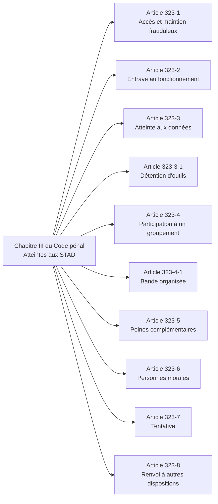
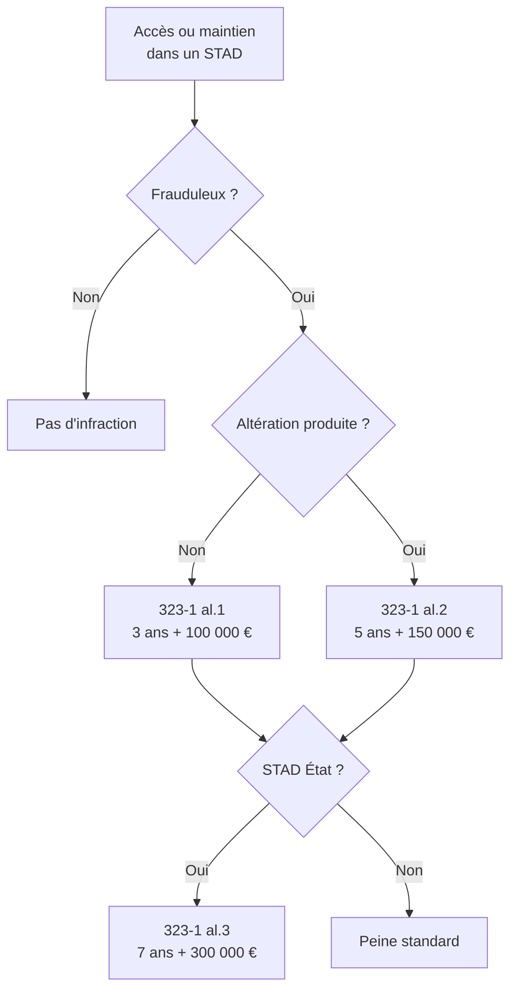
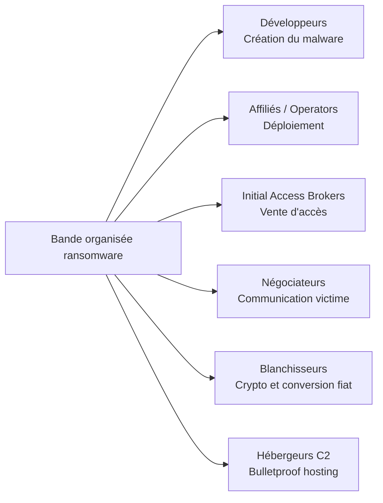
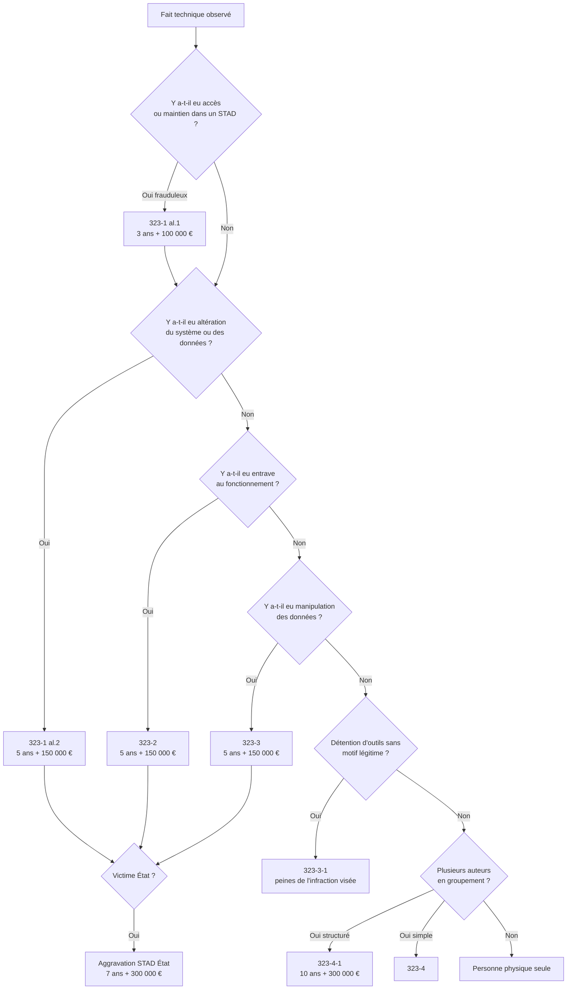

# 1.3 Articles 323-1 à 323-7 du Code pénal en détail

!!! quote "L'analogie du chirurgien et de l'anatomie"

    Un chirurgien qui ne maîtrise pas l'anatomie n'opère pas, il blesse. Il connaît chaque muscle, chaque vaisseau, chaque nerf, non pas par culture générale mais parce que sa précision opératoire en dépend. Les articles 323-1 à 323-7 sont l'anatomie de votre métier. Chaque alinéa, chaque circonstance aggravante, chaque exception conditionne la qualification d'un fait, le choix d'une procédure, la rédaction d'un rapport. Ne les lisez pas comme un texte juridique abstrait. Lisez-les comme la carte des nerfs et des artères que vos investigations vont disséquer. À la fin de ce chapitre, vous devez les avoir quasi mémorisés.

## Métadonnées du chapitre

| Champ | Valeur |
|---|---|
| Durée estimée | 4 heures |
| Niveau | Exhaustif |
| Prérequis | Chapitres 1.1 et 1.2 |
| Livrables | Fiche article par article, grille de qualification juridique |
| Auto-explication | 20 minutes |

## Objectifs pédagogiques

À la fin de ce chapitre, vous serez capable de :

- Citer le texte exact des articles 323-1 à 323-7 dans leur version en vigueur en avril 2026.
- Décomposer chaque article en éléments matériel, moral et légal.
- Identifier les peines principales, complémentaires et aggravations applicables à chaque infraction.
- Qualifier juridiquement un fait technique observé selon la grille des articles 323.
- Distinguer la consommation et la tentative au sens de l'article 323-7.
- Articuler les articles 323 avec d'autres incriminations (escroquerie, vol, atteintes RGPD).

---

## 1. Vue d'ensemble du chapitre III du Code pénal

Les articles 323-1 à 323-8 sont regroupés dans le **chapitre III** du **titre II** du **livre III** du Code pénal, intitulé *"Des atteintes aux systèmes de traitement automatisé de données"*. Ils forment une unité cohérente.

### 1.1 Architecture du chapitre



### 1.2 Logique d'organisation

| Articles | Fonction |
|---|---|
| 323-1 à 323-3 | Infractions principales (le cœur opérationnel) |
| 323-3-1 | Infraction connexe (les outils) |
| 323-4 et 323-4-1 | Aggravations liées à la pluralité d'auteurs |
| 323-5 à 323-6 | Régime des peines complémentaires et personnes morales |
| 323-7 | Tentative |
| 323-8 | Coordination avec d'autres dispositions |

### 1.3 Notions transversales à connaître avant lecture

Trois notions s'appliquent à tous les articles 323. Les comprendre une fois pour toutes permet d'éviter de les redécouvrir à chaque lecture.

#### Notion 1 - Le caractère frauduleux

Toutes les infractions des articles 323-1 à 323-3 exigent un comportement **"frauduleux"**. Le terme désigne la **conscience d'agir contre le droit d'autrui**, c'est-à-dire l'**élément moral d'intentionnalité**.

| Comportement | Frauduleux ? |
|---|---|
| Accéder à un système avec un mandat écrit du propriétaire | Non |
| Accéder à un système après avoir cliqué sur un lien public reçu par email | Dépend de la connaissance qu'avait l'auteur du caractère privé |
| Accéder à un système en exploitant une vulnérabilité connue | Oui (intention démontrée par la technicité) |
| Maintenir l'accès après avoir constaté qu'il s'agit d'un système privé | Oui (article 323-1 maintien frauduleux) |
| Accéder accidentellement et quitter immédiatement | Non (absence d'intention) |

L'absence d'élément moral écarte l'incrimination. Mais l'élément moral peut être déduit des **circonstances objectives** : compétence technique de l'auteur, nature des outils utilisés, durée de l'accès, comportement post-accès.

#### Notion 2 - Le STAD

Le **Système de Traitement Automatisé de Données** est défini largement par la jurisprudence. Il englobe :

| Élément constitutif | Exemples |
|---|---|
| Tout matériel ou logiciel traitant des données | PC, serveur, smartphone, montre connectée, voiture connectée |
| Y compris les systèmes embarqués | Domotique, IoT industriel, dispositifs médicaux |
| Y compris les systèmes en réseau | Cloud, microservices, blockchains |
| Y compris les sous-parties d'un système | Une base de données, une zone mémoire, un compte utilisateur |

La Cour de cassation a précisé dans plusieurs arrêts que l'article 323-1 protège **"tout ou partie"** d'un STAD, ce qui inclut les compartiments logiques (bases, comptes, partitions chiffrées).

#### Notion 3 - L'élément matériel

L'élément matériel est l'**acte concret** réalisé par l'auteur. Il diffère selon l'article :

| Article | Élément matériel |
|---|---|
| 323-1 al.1 | Accéder ou se maintenir |
| 323-1 al.2 | Accès suivi d'altération du système ou des données |
| 323-2 | Entraver ou fausser le fonctionnement |
| 323-3 | Introduire, modifier, extraire, supprimer ou transmettre frauduleusement |
| 323-3-1 | Importer, détenir, offrir, céder, mettre à disposition |

Pour caractériser une infraction, le ministère public doit prouver **l'élément matériel + l'élément moral**. C'est cette double exigence qui structure votre rapport forensic.

---

## 2. Article 323-1 - Accès et maintien frauduleux

### 2.1 Texte intégral en vigueur le 28 avril 2026

> **Article 323-1**
> 
> *Le fait d'accéder ou de se maintenir, frauduleusement, dans tout ou partie d'un système de traitement automatisé de données est puni de trois ans d'emprisonnement et de 100 000 € d'amende.*
> 
> *Lorsqu'il en est résulté soit la suppression ou la modification de données contenues dans le système, soit une altération du fonctionnement de ce système, la peine est de cinq ans d'emprisonnement et de 150 000 € d'amende.*
> 
> *Lorsque les infractions prévues aux deux premiers alinéas ont été commises à l'encontre d'un système de traitement automatisé de données à caractère personnel mis en œuvre par l'État, la peine est portée à sept ans d'emprisonnement et à 300 000 € d'amende.*

### 2.2 Décomposition juridique

L'article 323-1 contient **deux infractions distinctes** dans ses deux premiers alinéas, plus une **circonstance aggravante** dans le troisième.

| Alinéa | Infraction | Peine de base | Aggravation STAD État |
|---|---|---|---|
| Alinéa 1 | Accès ou maintien simple | 3 ans + 100 000 € | 7 ans + 300 000 € |
| Alinéa 2 | Accès ou maintien suivi d'altération | 5 ans + 150 000 € | 7 ans + 300 000 € |

### 2.3 L'accès frauduleux - Analyse de l'alinéa 1

**Élément matériel - L'accès** : pénétration logique dans le système. La pénétration physique (entrée dans une salle serveur) relève de la violation de domicile, pas de l'article 323-1.

L'accès peut prendre des formes très variées :

| Forme d'accès | Exemples concrets |
|---|---|
| Authentification frauduleuse | Mot de passe deviné, force brute, credential stuffing |
| Exploitation de vulnérabilité | Injection SQL, RCE, déserialisation, SSRF |
| Phishing aboutissant à un accès | Vol de session, vol de cookies |
| Interception de session | Vol de token, MITM |
| Accès physique non autorisé suivi de connexion | Branchement clé USB pour démarrer Kali Live |
| Bypass de contrôle d'accès | Manipulation de paramètres URL, IDOR |

**Élément matériel - Le maintien** : continuer à utiliser un système alors qu'on n'y a plus le droit. Cet élément vise les cas où l'accès initial était licite (par exemple, salarié encore en poste) mais où l'autorisation a cessé.

**Cas typique du maintien** : un salarié licencié dont les accès ne sont pas immédiatement révoqués. S'il continue à se connecter sciemment, il commet le maintien frauduleux.

**Élément moral - Le caractère frauduleux** : la conscience d'agir contre le droit d'autrui. Pour le maintien, la jurisprudence de la Cour de cassation (arrêt Bluetouff du 20 mai 2015) a précisé que la **prise de conscience** au cours de la session suffit à transformer un accès licite en maintien frauduleux.

### 2.4 L'accès aggravé - Analyse de l'alinéa 2

L'alinéa 2 punit plus sévèrement lorsque l'accès produit des **conséquences techniques** :

| Conséquence | Exemple |
|---|---|
| Suppression de données | Effacement de fichiers, vidage de tables |
| Modification de données | Altération de logs, falsification de comptes |
| Altération du fonctionnement | Crash service, corruption mémoire, modification de configuration |

L'aggravation s'applique même si la conséquence n'était **pas voulue** par l'auteur. Par exemple, un attaquant qui exploite une RCE et provoque accidentellement un crash du service tombe sous l'alinéa 2.

!!! warning "Subtilité importante"

    L'altération doit résulter de l'accès. Si l'accès est licite mais que l'auteur procède ensuite à une altération, on ne tombe pas sous 323-1 alinéa 2, mais sous **323-3** (altération de données indépendamment de l'accès). Le rapport forensic doit qualifier précisément.

### 2.5 La circonstance STAD État - Analyse de l'alinéa 3

L'alinéa 3 aggrave les peines lorsque la victime est l'**État** mettant en œuvre un STAD à caractère personnel. Cela vise typiquement :

| Système État | Exemples |
|---|---|
| Fichiers fiscaux | DGFiP, FICOBA |
| Fichiers de sécurité | TAJ, FNAEG, FPR |
| État civil | Bases nationales d'identité |
| Santé publique | SI-DEP, Vaccin Covid |
| Justice | Cassiopée, application des peines |

L'aggravation est de **4 ans supplémentaires** sur l'emprisonnement et passe à **300 000 €**.

### 2.6 Tableau récapitulatif des hypothèses 323-1



### 2.7 Cas pratiques de qualification 323-1

| Cas | Qualification | Peine encourue |
|---|---|---|
| Accès à un compte mail par mot de passe deviné, lecture seule | 323-1 al.1 | 3 ans + 100 000 € |
| Accès à un serveur Web avec exploitation de RCE, lecture des configurations | 323-1 al.1 | 3 ans + 100 000 € |
| Accès au même serveur avec écriture d'un webshell | 323-1 al.2 | 5 ans + 150 000 € |
| Accès à FICOBA par exploitation de la fonction recherche | 323-1 al.3 | 7 ans + 300 000 € |
| Salarié licencié continuant à se connecter au CRM trois jours après notification | 323-1 al.1 (maintien) | 3 ans + 100 000 € |

---

## 3. Article 323-2 - Entrave au fonctionnement

### 3.1 Texte intégral en vigueur

> **Article 323-2**
> 
> *Le fait d'entraver ou de fausser le fonctionnement d'un système de traitement automatisé de données est puni de cinq ans d'emprisonnement et de 150 000 € d'amende.*
> 
> *Lorsque cette infraction a été commise à l'encontre d'un système de traitement automatisé de données à caractère personnel mis en œuvre par l'État, la peine est portée à sept ans d'emprisonnement et à 300 000 € d'amende.*

### 3.2 Décomposition juridique

| Élément | Précision |
|---|---|
| Élément matériel | Entraver ou fausser le fonctionnement |
| Élément moral | Intention frauduleuse |
| Peine | 5 ans + 150 000 € (de base) |
| Aggravation STAD État | 7 ans + 300 000 € |

### 3.3 Notions d'entrave et de faussement

**Entraver** signifie **empêcher ou ralentir** le fonctionnement normal du système. Cela couvre les cas où le système devient inutilisable ou dégradé.

**Fausser** signifie **modifier le comportement** du système pour qu'il produise des résultats différents de ceux attendus, sans nécessairement le bloquer.

| Comportement | Qualification |
|---|---|
| Déni de service distribué (DDoS) | Entrave |
| Saturation d'un service par des requêtes massives | Entrave |
| Exploitation d'un bug provoquant un crash | Entrave (si volontaire) |
| Modification de la configuration pour fausser les calculs | Faussement |
| Empoisonnement de cache DNS | Faussement |
| Modification d'un script pour qu'il renvoie des résultats faux | Faussement |
| Détournement des routes BGP | Entrave et faussement combinés |

### 3.4 Cas particulier - Distinguer 323-2 et 323-1 al.2

La distinction entre **entrave** (323-2) et **altération du fonctionnement** (323-1 al.2) est subtile mais importante.

| Critère | 323-1 al.2 | 323-2 |
|---|---|---|
| Préalable | Accès frauduleux préalable | Pas nécessairement |
| Élément matériel | Accès + altération | Entrave seule (avec ou sans accès) |
| Peine | 5 ans + 150 000 € | 5 ans + 150 000 € |

Dans les faits, la **peine est identique**, mais la qualification précise compte pour le rapport forensic et l'argumentation devant le juge.

**Cas du DDoS** : un attaquant lance un DDoS sans avoir besoin d'accéder au système. Il commet 323-2 (entrave) sans 323-1.

**Cas du ransomware** : un attaquant accède au système (323-1 al.1), introduit le ransomware (323-3), et le ransomware entrave le fonctionnement (323-2 ou 323-1 al.2). Plusieurs qualifications sont possibles, le ministère public retient généralement la plus grave ou cumule.

### 3.5 Cas pratiques de qualification 323-2

| Cas | Qualification | Peine encourue |
|---|---|---|
| Lancement d'un DDoS via un botnet contre un site marchand | 323-2 | 5 ans + 150 000 € |
| Exploitation d'un bug dans une application web provoquant un crash | 323-2 (si intention) | 5 ans + 150 000 € |
| Saturation volontaire de la file d'impression d'une imprimante réseau | 323-2 | 5 ans + 150 000 € |
| BGP hijacking entraînant la déviation du trafic d'une banque | 323-2 (et probablement 323-3) | 5 ans + 150 000 € |
| Modification d'un script DNS pour qu'il résolve des domaines vers des IP fausses | 323-2 | 5 ans + 150 000 € |

---

## 4. Article 323-3 - Atteinte aux données

### 4.1 Texte intégral en vigueur

> **Article 323-3**
> 
> *Le fait d'introduire frauduleusement des données dans un système de traitement automatisé, d'extraire, de détenir, de reproduire, de transmettre, de supprimer ou de modifier frauduleusement les données qu'il contient est puni de cinq ans d'emprisonnement et de 150 000 € d'amende.*
> 
> *Lorsque cette infraction a été commise à l'encontre d'un système de traitement automatisé de données à caractère personnel mis en œuvre par l'État, la peine est portée à sept ans d'emprisonnement et à 300 000 € d'amende.*

### 4.2 Décomposition juridique

L'article 323-3 est l'article le plus **large** des articles 323. Il couvre **sept comportements distincts** par le simple verbe :

| Verbe | Comportement |
|---|---|
| Introduire | Ajouter des données dans un système |
| Extraire | Retirer / faire sortir des données |
| Détenir | Conserver des données obtenues frauduleusement |
| Reproduire | Copier des données |
| Transmettre | Envoyer des données à un tiers |
| Supprimer | Effacer des données |
| Modifier | Altérer des données existantes |

### 4.3 L'élargissement de 2014 - La détention et la reproduction

Avant 2014, l'article 323-3 ne couvrait que l'introduction, la suppression et la modification. La **loi du 13 novembre 2014 contre le terrorisme** a ajouté l'extraction, la détention, la reproduction et la transmission, en réponse à plusieurs affaires de fuite massive de données.

Cet élargissement est crucial pour le forensic : il permet de qualifier juridiquement l'**exfiltration de données**, qui est l'objectif principal de la majorité des attaques modernes.

| Cas pré-2014 | Cas post-2014 |
|---|---|
| Difficile à qualifier sans destruction | Facilement qualifié sous 323-3 |
| Recours à l'escroquerie ou au vol contestable | 323-3 directement applicable |
| Peines parfois moindres | 5 ans + 150 000 € automatiques |

### 4.4 La détention frauduleuse - Cas particulier

La **détention** de données obtenues frauduleusement est une infraction continue. Cela signifie que tant que l'auteur conserve les données, l'infraction se poursuit, sans nouvelle prescription.

**Conséquence pratique** : un attaquant qui a exfiltré une base de données il y a cinq ans et qui la conserve toujours peut être poursuivi aujourd'hui sous 323-3 (détention), même si l'extraction initiale est prescrite.

!!! info "Pour vous, analyste forensic"

    Vous êtes amené à **détenir** des données issues d'investigations (dumps mémoire, copies disques, extraits). Vous devez pouvoir prouver à tout moment que cette détention est légitime. Conservez systématiquement le mandat ou la mission d'investigation à proximité des données analysées. La fin de mission n'autorise pas la détention prolongée : à la clôture du dossier, soit vous archivez sous scellés numériques, soit vous détruisez avec procès-verbal.

### 4.5 Cas pratiques de qualification 323-3

| Cas | Qualification | Peine encourue |
|---|---|---|
| Insertion d'un compte administrateur dans une base utilisateurs | 323-3 (introduction) | 5 ans + 150 000 € |
| Exfiltration d'une base clients vers un C2 | 323-3 (extraction et transmission) | 5 ans + 150 000 € |
| Conservation sur clé USB de données obtenues lors d'une attaque | 323-3 (détention) | 5 ans + 150 000 € |
| Effacement de logs après une intrusion | 323-3 (suppression) | 5 ans + 150 000 € |
| Altération d'écritures comptables dans un ERP | 323-3 (modification) | 5 ans + 150 000 € |
| Reproduction par capture d'écran de pages d'un intranet | 323-3 (reproduction) | 5 ans + 150 000 € |

---

## 5. Article 323-3-1 - Détention d'outils sans motif légitime

### 5.1 Texte intégral en vigueur

> **Article 323-3-1**
> 
> *Le fait, sans motif légitime, notamment de recherche ou de sécurité informatique, d'importer, de détenir, d'offrir, de céder ou de mettre à disposition un équipement, un instrument, un programme informatique ou toute donnée conçus ou spécialement adaptés pour commettre une ou plusieurs des infractions prévues par les articles 323-1 à 323-3 est puni des peines prévues respectivement pour l'infraction elle-même ou pour l'infraction la plus sévèrement réprimée.*

### 5.2 Décomposition juridique

| Élément | Précision |
|---|---|
| Élément matériel | Importer, détenir, offrir, céder, mettre à disposition |
| Objet | Outil conçu ou adapté pour commettre une infraction 323-1, 323-2 ou 323-3 |
| Élément moral | Absence de motif légitime |
| Peine | Identique à l'infraction la plus sévère visée |

### 5.3 La notion de motif légitime

Le motif légitime est une **cause d'irresponsabilité pénale** spécifique à cet article. Sa charge de preuve incombe à l'auteur.

Cinq catégories de motifs légitimes sont reconnues :

| Catégorie | Justificatif type |
|---|---|
| Recherche académique | Affiliation universitaire, publication, cadre de laboratoire |
| Sécurité informatique professionnelle | Contrat de travail, mandat de pentest, mission CSIRT |
| Bug bounty officiel | Inscription sur plateforme (HackerOne, YesWeHack, Intigriti) |
| Activité de défense | Position au sein d'un SOC, équipe Blue Team |
| Formation pédagogique | Inscription à un cursus, attestation de formation, certifications |

!!! danger "Le piège de la détention prolongée hors mission"

    Si votre mission CSIRT se termine en mars 2026, vous ne pouvez pas conserver indéfiniment le dump mémoire et les outils sur votre poste. La fin de mission marque la **fin du motif légitime**. Procédure à suivre : archivage sous scellés numériques chiffrés conservés en lieu sûr, ou destruction avec procès-verbal. Conserver les outils hors mission expose à 323-3-1.

### 5.4 Outils typiques visés

| Catégorie d'outils | Exemples |
|---|---|
| Frameworks d'exploitation | Metasploit, Cobalt Strike, Sliver, Havoc, Mythic |
| Outils de credential dumping | Mimikatz, Rubeus, hashcat (avec dictionnaires d'attaque) |
| Outils de reconnaissance offensive | nmap (avec scripts NSE offensifs), Bloodhound |
| Outils de craquage WiFi | aircrack-ng suite, hcxdumptool, hcxtools |
| Frameworks de phishing | GoPhish, evilginx, modlishka |
| Malwares pédagogiques | EduCrypt, malwares CTF |
| Outils mémoire offensifs | Donut, sRDI, nimcrypt |

### 5.5 Outils dans la zone grise

Certains outils sont à **double usage** : utiles en défense et en attaque. Leur détention est en principe légitime mais doit être justifiable.

| Outil | Usage défensif | Usage offensif |
|---|---|---|
| Wireshark | Analyse réseau | Capture de credentials non chiffrés |
| Volatility | Forensic mémoire | Extraction de clés et secrets |
| Autopsy | Forensic disque | Récupération de données effacées sans autorisation |
| Burp Suite | Tests de sécurité applicative | Manipulation de requêtes pour exploiter |
| nmap | Cartographie réseau autorisée | Reconnaissance préalable à intrusion |

### 5.6 Cas pratique - Le forensic indépendant

**Situation** : vous lancez votre activité de forensic indépendant en juillet 2026. Vous avez sur votre PC : Volatility, hashcat, Sliver, Mimikatz, mac_apt, EduCrypt (compilé en TP).

**Question** : êtes-vous en infraction ?

**Analyse** :

1. Volatility, hashcat, mac_apt sont à **double usage**. Leur détention est légitime pour un forensic.
2. Sliver et Mimikatz sont **clairement offensifs**. Leur détention nécessite un motif légitime explicite : mandat de pentest, formation en cours, recherche.
3. EduCrypt est un **malware pédagogique**. Sa détention nécessite la documentation d'une formation suivie ou en cours.

**Solution recommandée** :

| Outil | Action |
|---|---|
| Volatility, hashcat, mac_apt, Autopsy | Conserver, documenter usage légitime |
| Sliver, Mimikatz, Cobalt Strike, etc. | Conserver dans un container chiffré accessible uniquement en mission, avec documentation contractuelle |
| EduCrypt et malwares pédagogiques | Conserver hors ligne sur support dédié, avec documentation de la formation |

### 5.7 Articulation avec d'autres articles

L'article 323-3-1 est une **infraction autonome** : il peut être caractérisé même si aucune infraction 323-1, 323-2 ou 323-3 n'a été effectivement commise. La simple détention sans motif légitime suffit.

En cas de cumul (détention + commission), la jurisprudence retient généralement l'infraction principale et la détention est absorbée. Mais le ministère public peut choisir de cumuler pour aggraver.

---

## 6. Article 323-4 - Participation à un groupement

### 6.1 Texte intégral en vigueur

> **Article 323-4**
> 
> *La participation à un groupement formé ou à une entente établie en vue de la préparation, caractérisée par un ou plusieurs faits matériels, d'une ou de plusieurs des infractions prévues par les articles 323-1 à 323-3-1 est punie des peines prévues pour l'infraction elle-même ou pour l'infraction la plus sévèrement réprimée.*

### 6.2 Décomposition juridique

| Élément | Précision |
|---|---|
| Élément matériel | Participer à un groupement ou une entente |
| Caractérisation | Faits matériels préparant l'infraction |
| Élément moral | Conscience de la nature criminelle du groupement |
| Peine | Identique à l'infraction préparée |

### 6.3 La notion de groupement ou entente

L'**entente** est une simple combinaison de volontés en vue d'une infraction. Le **groupement** suppose une organisation plus structurée.

Pour caractériser l'infraction, il faut :

1. Au moins **deux personnes** qui se concertent
2. La **préparation** d'une ou plusieurs infractions des articles 323-1 à 323-3-1
3. Des **faits matériels** caractérisant la préparation (achat d'outils, repérage, division des rôles)
4. Une **intention commune**

L'infraction est consommée par la simple participation, **sans qu'il soit nécessaire** que l'infraction préparée soit effectivement commise.

### 6.4 Cas pratiques

| Cas | Qualification |
|---|---|
| Trois personnes se concertent pour pirater un site, l'une fait du repérage, l'autre crée des comptes leurres | 323-4 caractérisé |
| Un groupe Discord discute de techniques de hacking sans préparation concrète | Probablement pas 323-4 (absence de faits matériels) |
| Un forum cybercriminel où s'échangent des outils et planifications | 323-4 caractérisé |
| Deux personnes louent ensemble un VPS pour mener une campagne de phishing | 323-4 caractérisé |

---

## 7. Article 323-4-1 - Bande organisée

### 7.1 Texte intégral en vigueur

> **Article 323-4-1**
> 
> *Lorsque les infractions prévues aux articles 323-1 à 323-3-1 ont été commises en bande organisée, la peine est portée à dix ans d'emprisonnement et à 300 000 € d'amende.*

### 7.2 Décomposition juridique

L'article 323-4-1 est une **circonstance aggravante** transversale qui s'applique à toutes les infractions des articles 323-1 à 323-3-1.

### 7.3 La notion de bande organisée

La bande organisée est définie par l'**article 132-71 du Code pénal** : *"Constitue une bande organisée, au sens de la loi, tout groupement formé ou toute entente établie en vue de la préparation, caractérisée par un ou plusieurs faits matériels, d'une ou de plusieurs infractions."*

Trois critères supplémentaires distinguent la bande organisée du simple groupement (323-4) :

| Critère | Précision |
|---|---|
| Nombre | Plusieurs personnes (au moins 3 en pratique) |
| Structure | Organisation hiérarchique ou répartition des rôles |
| Permanence | Stabilité dans le temps, pas un coup ponctuel |

### 7.4 Application aux groupes ransomware

Les groupes ransomware modernes (LockBit, Conti, BlackCat, Akira, ALPHV) répondent **typiquement** à la définition de bande organisée :



Lorsque l'enquête identifie ces rôles distincts, l'aggravation 323-4-1 s'applique automatiquement, portant les peines à **10 ans + 300 000 €**.

### 7.5 Cas pratique

Un groupe de 8 personnes mène une campagne de ransomware contre 50 PME françaises. L'enquête identifie :

- 2 développeurs Russes
- 4 affiliés Européens dont 2 Français  
- 1 négociateur basé en Estonie
- 1 blanchisseur d'argent

**Qualification pour les Français** : 323-1 al.2 + 323-2 + 323-3 + 323-4-1.

**Peine encourue** : 10 ans + 300 000 € (la bande organisée absorbe les peines des infractions principales).

**Articulation avec d'autres articles** : extorsion (article 312-1), blanchiment (article 324-1), participation à association de malfaiteurs (article 450-1) sont susceptibles de s'ajouter.

---

## 8. Article 323-5 - Peines complémentaires

### 8.1 Texte intégral en vigueur

> **Article 323-5**
> 
> *Les personnes physiques coupables des délits prévus au présent chapitre encourent également les peines complémentaires suivantes :*
> 
> *1° L'interdiction, suivant les modalités prévues par l'article 131-26, des droits civiques, civils et de famille ;*
> 
> *2° L'interdiction, pour une durée de cinq ans au plus, d'exercer une fonction publique ou d'exercer l'activité professionnelle ou sociale dans l'exercice ou à l'occasion de laquelle l'infraction a été commise ;*
> 
> *3° La confiscation de la chose qui a servi ou était destinée à commettre l'infraction ou de la chose qui en est le produit, à l'exception des objets susceptibles de restitution ;*
> 
> *4° La fermeture, pour une durée de cinq ans au plus, des établissements ou de l'un ou de plusieurs des établissements de l'entreprise ayant servi à commettre les faits incriminés ;*
> 
> *5° L'exclusion, pour une durée de cinq ans au plus, des marchés publics ;*
> 
> *6° L'interdiction, pour une durée de cinq ans au plus, d'émettre des chèques autres que ceux qui permettent le retrait de fonds par le tireur auprès du tiré ou ceux qui sont certifiés ou d'utiliser des cartes de paiement ;*
> 
> *7° L'affichage ou la diffusion de la décision prononcée dans les conditions prévues par l'article 131-35.*

### 8.2 Décomposition des peines complémentaires

Les **peines complémentaires** s'ajoutent aux peines principales (emprisonnement et amende). Elles peuvent être prononcées seules ou en complément.

| Peine complémentaire | Impact pour un professionnel cyber |
|---|---|
| Interdiction des droits civiques, civils et de famille | Privation du droit de vote, d'éligibilité, d'autorité parentale |
| Interdiction d'exercer | Vous interdit d'exercer la cybersécurité pendant 5 ans |
| Confiscation des outils | Saisie de votre PC, serveurs, équipements |
| Fermeture d'établissement | Fermeture de votre cabinet ou société |
| Exclusion des marchés publics | Plus aucun contrat avec administration |
| Interdiction de chéquier ou cartes | Restriction bancaire forte |
| Affichage de la décision | Publication possible dans la presse |

### 8.3 Conséquences pratiques pour vous

Si vous êtes condamné sous les articles 323, **votre carrière dans la cybersécurité est terminée pendant au moins 5 ans**, et probablement définitivement par la perte de réputation. C'est la raison principale pour laquelle le respect strict du cadre légal n'est pas négociable.

---

## 9. Article 323-6 - Personnes morales

### 9.1 Texte intégral en vigueur

> **Article 323-6**
> 
> *Les personnes morales déclarées responsables pénalement, dans les conditions prévues par l'article 121-2, des infractions définies au présent chapitre encourent, outre l'amende suivant les modalités prévues par l'article 131-38, les peines prévues par l'article 131-39.*
> 
> *L'interdiction mentionnée au 2° de l'article 131-39 porte sur l'activité dans l'exercice ou à l'occasion de l'exercice de laquelle l'infraction a été commise.*

### 9.2 Décomposition juridique

L'article 323-6 organise la **responsabilité pénale des personnes morales** (sociétés, associations, etc.) pour les infractions des articles 323.

L'amende encourue par une personne morale est **5 fois supérieure** à celle d'une personne physique (article 131-38). Une infraction 323-1 al.1 punie de 100 000 € pour une personne physique est punie de **500 000 €** pour une personne morale.

### 9.3 Peines complémentaires applicables aux personnes morales

L'article 131-39 du Code pénal liste les peines complémentaires :

| Peine | Impact |
|---|---|
| Dissolution | Fin de la personne morale |
| Interdiction d'exercer une activité professionnelle ou sociale | Fin de l'activité concernée |
| Placement sous surveillance judiciaire | Contrôle externe pour 5 ans max |
| Fermeture définitive ou temporaire d'établissements | Fermeture des sites concernés |
| Exclusion des marchés publics | 5 ans maximum |
| Interdiction d'émettre des chèques | Restriction financière |
| Confiscation | Biens, équipements, profits |
| Affichage et publication | Communication publique de la condamnation |

### 9.4 Cas typique

Une société de pentest mandate des pentesters qui débordent du périmètre autorisé et accèdent à des systèmes hors contrat. La société peut être poursuivie sous 323-6 si l'infraction a été commise **pour son compte** par ses dirigeants ou représentants.

---

## 10. Article 323-7 - Tentative

### 10.1 Texte intégral en vigueur

> **Article 323-7**
> 
> *La tentative des délits prévus par les articles 323-1 à 323-3-1 est punie des mêmes peines.*

### 10.2 Décomposition juridique

L'article 323-7 érige la **tentative** au rang d'infraction consommée. Cela signifie qu'un attaquant qui échoue (par exemple parce que l'EDR a bloqué le payload) encourt les **mêmes peines** que s'il avait réussi.

### 10.3 La notion de tentative en droit pénal

L'**article 121-5 du Code pénal** définit la tentative : *"La tentative est constituée dès lors que, manifestée par un commencement d'exécution, elle n'a été suspendue ou n'a manqué son effet qu'en raison de circonstances indépendantes de la volonté de son auteur."*

Trois conditions :

| Condition | Précision |
|---|---|
| Commencement d'exécution | Acte matériel directement lié à l'infraction |
| Absence de désistement volontaire | Si l'auteur renonce avant consommation, pas de tentative |
| Échec dû à circonstances indépendantes | Blocage par EDR, alerte SOC, panne réseau |

### 10.4 Application en cybersécurité

| Cas | Tentative caractérisée ? |
|---|---|
| Envoi d'email de phishing avec payload, victime ne clique pas | Oui (commencement d'exécution) |
| Lancement d'un scan nmap massif sans exploitation | Difficilement (préparation, pas commencement d'exécution) |
| Tentative d'exploitation de RCE bloquée par WAF | Oui (commencement d'exécution, échec extérieur) |
| Beacon Sliver bloqué par EDR au démarrage | Oui (exécution lancée, blocage extérieur) |
| Brute force sur SSH bloqué par fail2ban | Oui |
| Tentative d'exfiltration bloquée par DLP | Oui |

### 10.5 Importance du désistement volontaire

Si l'auteur **renonce volontairement** avant consommation, il n'y a pas de tentative. Le désistement doit être :

- **Volontaire** : pas par contrainte extérieure
- **Effectif** : actes pour empêcher le résultat
- **Avant consommation** : avant que l'infraction soit complète

**Cas pratique** : un attaquant lance une exploitation de RCE, obtient le shell, puis se déconnecte sans rien faire. Tentative ou non ?

**Réponse** : la simple obtention du shell consomme déjà l'accès frauduleux (323-1 al.1). Le "désistement" intervient après la consommation, donc l'infraction est constituée.

---

## 11. Article 323-8 - Disposition de coordination

### 11.1 Texte intégral en vigueur

> **Article 323-8**
> 
> *Pour les infractions prévues par les articles 323-1 à 323-3-1 commises à l'encontre d'un système de traitement automatisé de données à caractère personnel mis en œuvre par l'État, les mesures conservatoires prévues à l'article 706-22-1 du code de procédure pénale peuvent être mises en œuvre.*

### 11.2 Précision

Cet article renvoie aux **mesures conservatoires** spéciales applicables aux infractions visant les STAD État. Il s'agit notamment de la possibilité de saisie immédiate de matériel, de blocage de comptes, de sécurisation préventive, sous le contrôle du juge.

---

## 12. Grille de qualification juridique pour rapport forensic

Voici la **grille de qualification** que vous devez mentalement appliquer à chaque fait technique observé dans une investigation. Cette grille structurera vos rapports.



---

## 13. Articulation avec d'autres infractions

Les articles 323 ne sont **pas exclusifs** d'autres infractions. Selon les faits, plusieurs qualifications peuvent se cumuler.

### 13.1 Cumul avec l'escroquerie

L'**article 313-1 du Code pénal** punit l'escroquerie de 5 ans + 375 000 €. Si l'attaquant utilise des manœuvres frauduleuses (faux site, ingénierie sociale) pour obtenir un transfert de fonds après son intrusion, il peut être poursuivi à la fois sous 323-1 et 313-1.

### 13.2 Cumul avec le faux et usage de faux

L'**article 441-1 du Code pénal** punit le faux et usage de faux de 3 ans + 45 000 €. Si l'attaquant modifie des écritures comptables après intrusion, il peut être poursuivi à la fois sous 323-3 et 441-1.

### 13.3 Cumul avec l'extorsion

L'**article 312-1 du Code pénal** punit l'extorsion de 7 ans + 100 000 €. Le ransomware caractérise typiquement l'extorsion (menace + exigence de rançon) en plus des infractions 323. Cumul fréquent.

### 13.4 Cumul avec les infractions RGPD

Le **non-respect du RGPD** entraîne des sanctions administratives prononcées par la CNIL (jusqu'à 4% du CA mondial). Ces sanctions ne sont pas pénales mais peuvent se cumuler avec les poursuites pénales.

### 13.5 Cumul avec les atteintes à la vie privée

L'**article 226-1 du Code pénal** punit l'atteinte à la vie privée de 1 an + 45 000 €. La diffusion de données personnelles obtenues par intrusion peut entraîner ce cumul.

---

## 14. Pièges et bonnes pratiques

### Piège 1 - Oublier l'élément moral

L'élément matériel ne suffit jamais. Si vous démontrez un accès dans votre rapport mais sans **caractériser l'intention frauduleuse**, le juge ne pourra pas condamner. Toujours documenter les indices d'intentionnalité : compétence technique, choix du moment, comportement post-accès.

### Piège 2 - Mal qualifier 323-1 al.2 vs 323-3

Si l'altération **résulte directement de l'accès**, c'est 323-1 al.2 (peine identique mais qualification différente). Si l'altération est **un acte distinct** suivant l'accès, c'est 323-3.

### Piège 3 - Sous-estimer 323-3-1

Vous risquez personnellement 323-3-1 si vous conservez des outils offensifs sans motif légitime documenté. Ce n'est pas un piège théorique. Plusieurs analystes ont été inquiétés pour cette infraction.

### Bonne pratique 1 - Citer toujours article et alinéa

Pas "violation de l'article 323-1", mais "violation de l'article 323-1 alinéa 2 du Code pénal". La précision juridique est attendue d'un professionnel.

### Bonne pratique 2 - Vérifier la version applicable

Citer la version de l'article applicable **à la date des faits**, pas à la date du rapport. La loi pénale plus douce rétroagit, la loi pénale plus sévère ne rétroagit pas (article 112-1 du Code pénal).

### Bonne pratique 3 - Documenter votre motif légitime en permanence

Tenez un dossier numérique chiffré contenant : contrats de mission en cours, mandats de pentest, attestations de formation, certifications. Ce dossier est votre **assurance pénale** au regard de l'article 323-3-1.

---

## 15. Manipulation pratique - Exercices

### Exercice 15.1 - Qualification du cas ARTECH (cycle 1)

Reprenez le scénario fil rouge : un attaquant attaque la PME ARTECH. Pour chaque action, qualifiez juridiquement.

| Action | Article(s) applicable(s) | Peine maximale |
|---|---|---|
| Wardriving passif (capture handshake WPA2) | 323-1 al.1 (tentative d'accès) | 3 ans + 100 000 € |
| Cracking du handshake et connexion au WiFi | 323-1 al.1 | 3 ans + 100 000 € |
| nmap silencieux du réseau interne | 323-1 al.1 (maintien) | 3 ans + 100 000 € |
| Spear-phishing avec macro | 323-1 al.1 (tentative) | 3 ans + 100 000 € |
| Beacon Sliver actif sur poste stagiaire | 323-1 al.2 + 323-3 | 5 ans + 150 000 € |
| Persistance scheduled task | 323-1 al.2 + 323-3 | 5 ans + 150 000 € |
| Vol de clés SSH via Mimikatz | 323-3 (extraction) | 5 ans + 150 000 € |
| Pivot vers serveur Linux | 323-1 al.1 | 3 ans + 100 000 € |
| Déploiement EduCrypt | 323-1 al.2 + 323-2 + 323-3 | 5 ans + 150 000 € |
| Note de rançon | 312-1 (extorsion) | 7 ans + 100 000 € |
| **En bande organisée** | 323-4-1 absorbe | **10 ans + 300 000 €** |

### Exercice 15.2 - Rédaction de qualification

Pour le rapport ARTECH, rédigez le paragraphe juridique de qualification. Modèle attendu :

```text
QUALIFICATION JURIDIQUE DES FAITS

Les faits techniquement établis dans le présent rapport sont susceptibles de
constituer les infractions suivantes au Code pénal, dans leur version en
vigueur à la date des faits (entre le 10 et le 14 mars 2026) :

- Article 323-1 alinéa 1er : accès frauduleux à un système de traitement
  automatisé de données, par compromission du réseau Wi-Fi de l'entreprise
  et de plusieurs postes de travail (peine encourue : trois ans
  d'emprisonnement et 100 000 € d'amende) ;

- Article 323-1 alinéa 2 : accès suivi d'altération du fonctionnement et des
  données du système (peine encourue : cinq ans d'emprisonnement et
  150 000 € d'amende) ;

- Article 323-3 : extraction et transmission frauduleuses de données
  contenues dans le système, ainsi que modification et suppression de
  données comptables (peine encourue : cinq ans d'emprisonnement et
  150 000 € d'amende) ;

- Article 323-2 : entrave au fonctionnement du système par déploiement d'un
  logiciel de chiffrement (peine encourue : cinq ans d'emprisonnement et
  150 000 € d'amende) ;

- Article 323-4-1 : commission en bande organisée, ayant pour effet de
  porter la peine à dix ans d'emprisonnement et 300 000 € d'amende.

À ces infractions s'ajoute potentiellement l'article 312-1 du Code pénal
(extorsion par menace) du fait de la note de rançon exigeant un paiement en
cryptomonnaie en échange de la clé de déchiffrement (peine de sept ans
d'emprisonnement et 100 000 € d'amende).

Il appartient au magistrat de qualifier définitivement les faits.
```

### Exercice 15.3 - Recherche Légifrance

Sur Légifrance, accédez aux articles 323-1 à 323-7. Pour chaque article :

1. Notez le numéro complet et la date de la dernière modification.
2. Cliquez sur "Versions" et identifiez la version en vigueur en 2020 vs 2024.
3. Identifiez la loi qui a modifié l'article entre ces deux dates.

Cet exercice de recherche directe est essentiel pour acquérir le réflexe Légifrance.

---

## 16. Auto-évaluation

| # | Question | Réponse attendue |
|---|---|---|
| 1 | Peine de l'accès frauduleux simple en 2026 ? | 3 ans + 100 000 € (art. 323-1 al.1) |
| 2 | Peine en cas d'altération ? | 5 ans + 150 000 € (art. 323-1 al.2) |
| 3 | Aggravation STAD État ? | 7 ans + 300 000 € |
| 4 | Que punit 323-2 ? | Entrave ou faussement du fonctionnement |
| 5 | Quels comportements sous 323-3 ? | Introduction, extraction, détention, reproduction, transmission, suppression, modification |
| 6 | À quoi sert le motif légitime de 323-3-1 ? | Cause d'irresponsabilité pénale pour la détention d'outils |
| 7 | Peine en bande organisée ? | 10 ans + 300 000 € (art. 323-4-1) |
| 8 | La tentative est-elle punissable ? | Oui, mêmes peines que l'infraction (art. 323-7) |
| 9 | Une personne morale peut-elle être condamnée ? | Oui, art. 323-6, amende ×5 |
| 10 | Que risque un professionnel cyber condamné ? | Interdiction d'exercer 5 ans (art. 323-5) |

---

## 17. Synthèse mémo

**Articles 323-1 à 323-3 - Les trois grandes infractions** :

```text
323-1 al.1 : Accès / maintien frauduleux              3 ans + 100 000 €
323-1 al.2 : avec altération                          5 ans + 150 000 €
323-1 al.3 : STAD État                                7 ans + 300 000 €
323-2      : Entrave au fonctionnement                5 ans + 150 000 €
323-3      : Atteinte aux données (7 verbes)          5 ans + 150 000 €
```

**Articles 323-3-1 et suivants - Régimes connexes** :

```text
323-3-1    : Détention outils sans motif légitime     Peine de l'infraction
323-4      : Participation à un groupement            Peine de l'infraction
323-4-1    : Bande organisée                          10 ans + 300 000 €
323-5      : Peines complémentaires (interdictions)
323-6      : Personnes morales (amende ×5)
323-7      : Tentative = consommation
323-8      : Mesures conservatoires STAD État
```

**Triade éléments matériel / moral / légal à appliquer systématiquement.**

**Toujours citer article ET alinéa, et version applicable à la date des faits.**

---

## 18. Pour aller plus loin

| Ressource | Type | Description |
|---|---|---|
| Légifrance - Code pénal | Site officiel | Source primaire, versions historiques |
| Code pénal annoté Dalloz | Édition annuelle | Jurisprudence par article |
| Doctrine.fr | Base de données | Recherche jurisprudentielle |
| Romain Boos - Cyberattaques et droit pénal | Manuel | Cas pratiques approfondis |
| Frédéric Chopin - Droit pénal des nouvelles technologies | Manuel | Synthèse universitaire |

---

## 19. Auto-explication

Pour valider ce chapitre, enregistrez une vidéo de 20 minutes où vous expliquez à voix haute, sans support :

1. La structure du chapitre III du Code pénal (2 minutes)
2. L'article 323-1 alinéa par alinéa (4 minutes)
3. L'article 323-2 et la distinction avec 323-1 al.2 (2 minutes)
4. L'article 323-3 et ses 7 verbes (3 minutes)
5. L'article 323-3-1 et le motif légitime (3 minutes)
6. La bande organisée et son régime (2 minutes)
7. Les peines complémentaires et leurs conséquences professionnelles (2 minutes)
8. La tentative et son régime (1 minute)
9. Synthèse opérationnelle pour votre métier (1 minute)

Stockez la vidéo dans `01-cycle-0-fondations/module-1-legislation/auto-explications/2026-XX-XX_chapitre-1-3.mp4`.

---

**Chapitre précédent** : [1.2 Loi Godfrain de 1988 et son contexte historique](01-2-loi-godfrain.md)

**Chapitre suivant** : [1.4 Article 226-15 et atteintes au secret des correspondances](01-4-article-226-15.md)
