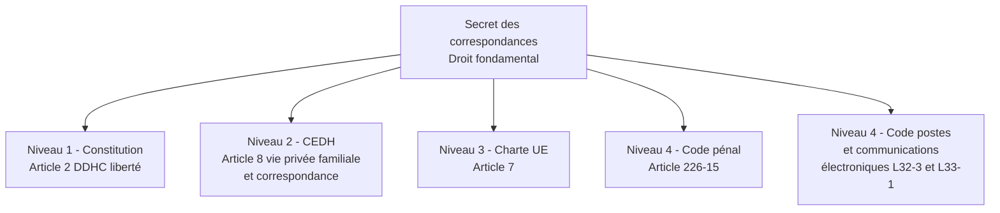
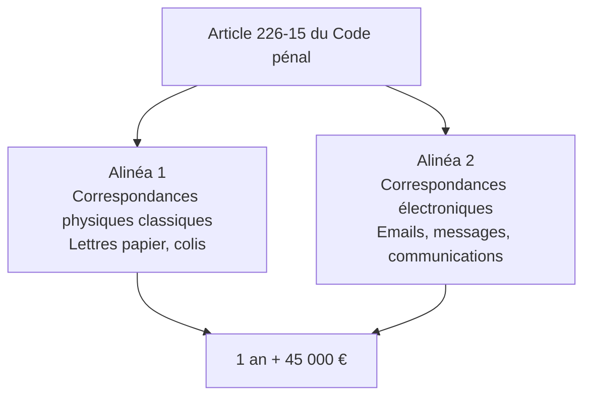
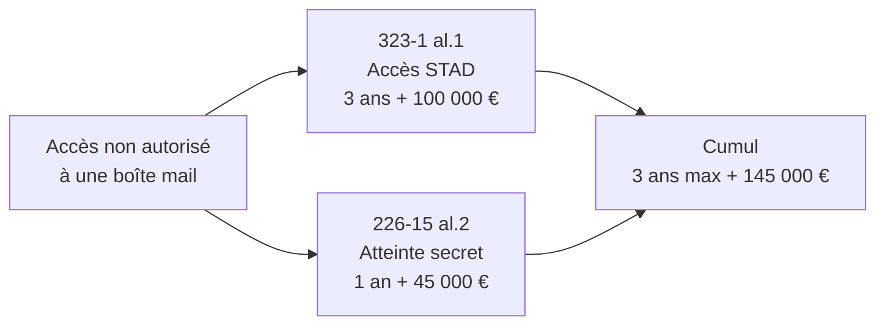
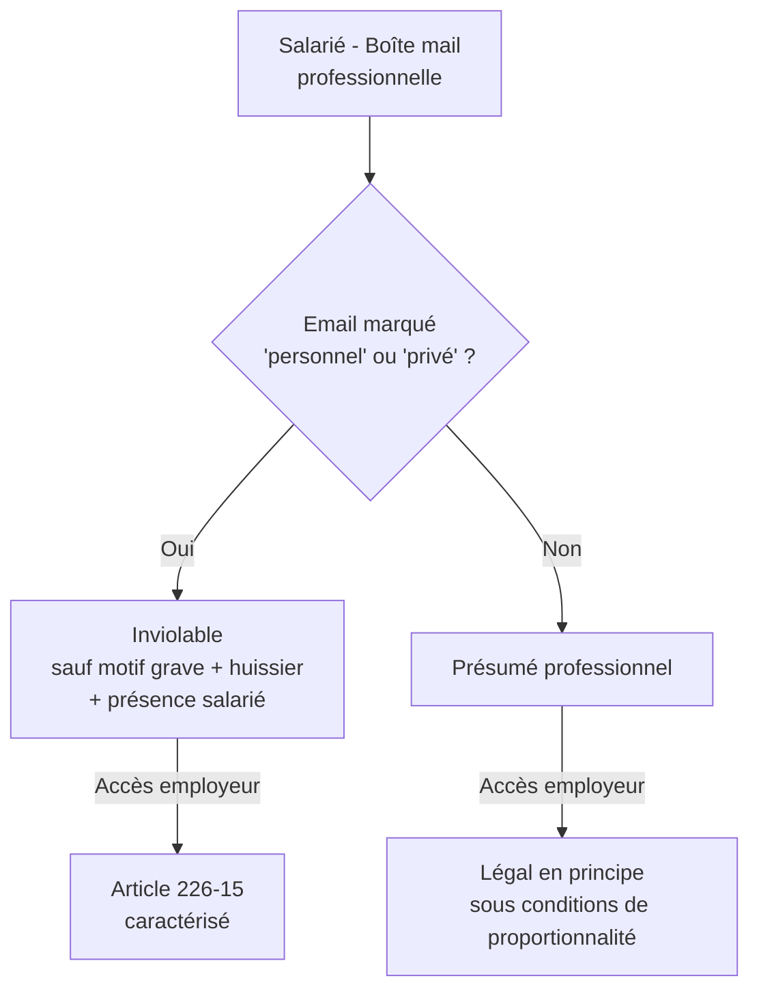
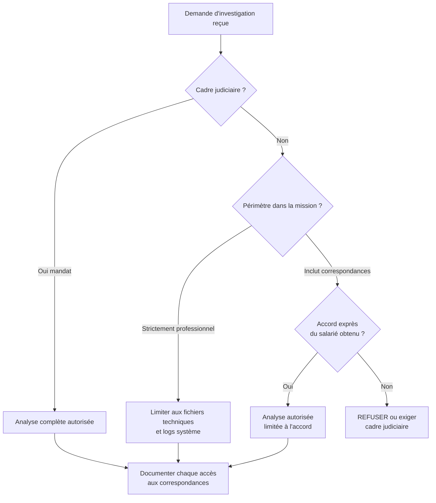

# 1.4 Article 226-15 et atteintes au secret des correspondances

!!! quote "L'analogie de la lettre cachetée"

    Au XIXe siècle, le facteur qui décachetait les lettres pour en lire le contenu commettait une infraction grave, indépendamment de ce qu'il faisait ensuite avec l'information. Le secret de la correspondance était sacré, non pas parce que les lettres contenaient des secrets d'État, mais parce que la confiance dans le service postal était une condition de la vie en société. L'article 226-15 du Code pénal moderne applique exactement la même logique aux emails, messages instantanés, échanges sur réseaux sociaux, communications chiffrées. Décacheter un email d'autrui n'est pas un acte technique anodin : c'est une atteinte à un droit fondamental qui a sa propre incrimination, distincte des articles 323. Pour vous, analyste forensic, comprendre cette distinction est vital. Vos investigations vont fréquemment toucher à des correspondances, et chaque manipulation doit s'inscrire dans un cadre qui préserve ce droit fondamental.

## Métadonnées du chapitre

| Champ | Valeur |
|---|---|
| Durée estimée | 1 heure |
| Niveau | Standard |
| Prérequis | Chapitres 1.1 à 1.3 |
| Livrables | Fiche d'articulation 226-15 / 323-X |
| Auto-explication | 8 minutes |

## Objectifs pédagogiques

À la fin de ce chapitre, vous serez capable de :

- Citer le texte de l'article 226-15 du Code pénal et identifier ses deux alinéas distincts.
- Distinguer l'atteinte au secret des correspondances (226-15) de l'accès frauduleux à un STAD (323-1).
- Identifier les cas où vos investigations forensic peuvent toucher à des correspondances.
- Articuler 226-15 avec le droit du travail (surveillance des salariés).
- Connaître les exceptions légales (interception judiciaire, accord du destinataire).

---

## 1. Pourquoi un article spécifique aux correspondances

### 1.1 Le secret des correspondances - Un droit fondamental

Le secret des correspondances est un droit fondamental garanti à plusieurs niveaux de la pyramide des normes (chapitre 1.1).



Le caractère **multi-niveaux** de cette protection signifie qu'une violation peut être attaquée à plusieurs titres : pénal, administratif, civil, et même devant la Cour européenne des droits de l'homme.

### 1.2 Distinction conceptuelle avec l'accès au STAD

L'article 323-1 (chapitre 1.3) protège le **système** comme contenant. L'article 226-15 protège la **correspondance** comme contenu. Cette distinction est subtile mais structurante.

| Critère | Article 323-1 | Article 226-15 |
|---|---|---|
| Objet protégé | Le système informatique | Le contenu de la communication |
| Bien juridique | Confidentialité et intégrité du STAD | Secret de la correspondance privée |
| Élément matériel | Accès, maintien, altération | Interception, détournement, ouverture |
| Conscience requise | Caractère frauduleux | Conscience de violer le secret |

**Cas concret illustrant la distinction** : un attaquant accède à un serveur de messagerie (323-1 al.1). S'il lit les emails, il commet **également** 226-15 al.2. Les deux infractions se cumulent.

### 1.3 Pourquoi vous concerne directement

Vous êtes **constamment exposé** à des correspondances dans vos investigations :

| Situation forensic | Correspondances potentiellement touchées |
|---|---|
| Acquisition mémoire d'un poste | Sessions emails ouvertes, messages instantanés en RAM |
| Acquisition disque | Fichiers PST, OST, mbox, conversations Slack/Teams |
| Analyse navigateur | Webmails, sessions Discord, messages Facebook |
| Analyse mobile | SMS, WhatsApp, Signal |
| Analyse réseau | Captures Wireshark de SMTP, IMAP, HTTPS |

Chaque accès à ces données peut tomber sous 226-15 si vous ne respectez pas un cadre légitime.

---

## 2. Article 226-15 - Texte et décomposition

### 2.1 Texte intégral en vigueur le 28 avril 2026

> **Article 226-15**
> 
> *Le fait, commis de mauvaise foi, d'ouvrir, de supprimer, de retarder ou de détourner des correspondances arrivées ou non à destination et adressées à des tiers, ou d'en prendre frauduleusement connaissance, est puni d'un an d'emprisonnement et de 45 000 € d'amende.*
> 
> *Est puni des mêmes peines le fait, commis de mauvaise foi, d'intercepter, de détourner, d'utiliser ou de divulguer des correspondances émises, transmises ou reçues par la voie électronique ou de procéder à l'installation d'appareils de nature à permettre la réalisation de telles interceptions.*

### 2.2 Architecture en deux alinéas

L'article comporte **deux alinéas correspondant à deux infractions distinctes**.



Pour le forensic numérique, c'est **l'alinéa 2** qui s'applique. Mais l'alinéa 1 reste pertinent pour les correspondances papier que vous pourriez analyser dans le cadre d'une investigation mixte.

### 2.3 Décomposition de l'alinéa 2

L'alinéa 2 punit **cinq comportements distincts** liés aux correspondances électroniques.

| Verbe | Comportement | Exemple forensic |
|---|---|---|
| Intercepter | Capturer la correspondance pendant sa transmission | Sniffing de trafic, MITM |
| Détourner | Faire dévier la correspondance vers une autre destination | Forwarding caché, redirection DNS |
| Utiliser | Exploiter le contenu d'une correspondance interceptée | Vol d'identifiants, chantage |
| Divulguer | Communiquer le contenu à un tiers | Partage public de logs incluant emails |
| Installer | Mettre en place les outils permettant l'interception | Déploiement de keylogger, sniffer permanent |

### 2.4 Notion de "correspondance électronique"

La jurisprudence et les textes ont progressivement élargi cette notion. En 2026, sont considérés comme correspondances électroniques :

| Type | Exemples |
|---|---|
| Email classique | SMTP/IMAP/POP3, Gmail, Outlook, Proton Mail |
| Messages instantanés | WhatsApp, Signal, Telegram, iMessage |
| Réseaux sociaux | DM Twitter/X, messages Facebook, LinkedIn InMail |
| Plateformes professionnelles | Slack, Teams, Mattermost |
| Voix et vidéo | Appels VoIP, conférences Zoom, FaceTime |
| Communications de fichiers | Transferts via WeTransfer, Drive partagés |

La frontière reste floue pour les **publications publiques** (tweets publics, posts Facebook ouverts) qui ne sont généralement pas considérées comme correspondances privées.

### 2.5 La notion de mauvaise foi

L'élément moral de l'article 226-15 est la **mauvaise foi**. Cette notion est plus large que l'intentionnalité simple du Code pénal.

| Caractéristique | Conséquence |
|---|---|
| Mauvaise foi présumée | Le ministère public n'a pas à la prouver positivement |
| Justification possible | L'auteur peut prouver sa bonne foi (motif légitime) |
| Renversement de charge | À l'auteur de démontrer la légitimité |

C'est exactement le même mécanisme que l'article 323-3-1 vu au chapitre précédent : **vous devez pouvoir prouver votre motif légitime**, pas l'inverse.

---

## 3. Articulation avec d'autres infractions

### 3.1 Cumul avec l'article 323-1

Comme évoqué, un attaquant qui accède à une boîte mail commet typiquement **deux infractions cumulées** :



En pratique, le ministère public retient les deux qualifications. Le juge peut prononcer une peine unique correspondant au maximum le plus élevé.

### 3.2 Cumul avec le RGPD

L'interception ou la divulgation d'emails contenant des données personnelles constitue **également** une violation du RGPD (chapitre 1.8). Les sanctions administratives CNIL se cumulent avec les sanctions pénales.

### 3.3 Cumul avec l'article 226-1

L'**article 226-1 du Code pénal** punit l'atteinte à la vie privée par captation, enregistrement ou transmission de paroles ou d'images. Pour les communications **vocales** ou **vidéo**, ces deux articles peuvent se cumuler.

### 3.4 Cumul avec les écoutes illégales

L'**article L. 226-15-1 du Code pénal** (renumérotation 2024) sanctionne spécifiquement l'utilisation d'appareils techniques destinés aux écoutes. Pour un keylogger, cumul possible.

---

## 4. Exceptions légales au secret

L'article 226-15 connaît plusieurs **exceptions légales** strictement encadrées.

### 4.1 Interceptions de sécurité (renseignement)

L'**article L. 851-1 et suivants du Code de la sécurité intérieure** autorise les services de renseignement à intercepter des correspondances dans des cas limitativement énumérés (terrorisme, criminalité organisée, espionnage économique).

Cadre : autorisation préalable du Premier ministre après avis de la **Commission nationale de contrôle des techniques de renseignement (CNCTR)**.

### 4.2 Interceptions judiciaires

Les **articles 100 à 100-8 du Code de procédure pénale** autorisent les interceptions sur ordonnance d'un juge d'instruction dans le cadre d'une enquête. Durée maximum : 4 mois renouvelables.

### 4.3 Accord exprès du destinataire ou de l'expéditeur

Si le destinataire (ou l'expéditeur) **donne son accord exprès**, l'accès à sa correspondance ne tombe pas sous 226-15. Cet accord doit être :

| Caractéristique | Précision |
|---|---|
| Exprès | Pas implicite, formulé clairement |
| Préalable ou contemporain | Pas a posteriori |
| Spécifique | Pour cette investigation précise |
| Documenté | Écrit, signé, daté |

### 4.4 Mandat judiciaire au sens large

Tout mandat judiciaire (perquisition, saisie, expertise) couvre l'accès aux correspondances saisies dans le cadre du périmètre du mandat. C'est ce qui rend votre activité forensic légale lorsque vous travaillez pour un magistrat.

### 4.5 Exception du dirigeant d'entreprise

C'est une exception **complexe et fragile**. Le dirigeant d'entreprise peut accéder aux correspondances professionnelles de ses salariés, **sous strictes conditions**. Voir section 5.

---

## 5. Le cas particulier - Surveillance des salariés

### 5.1 Le principe et la jurisprudence

L'employeur peut accéder aux fichiers et correspondances **professionnels** des salariés, mais **pas aux correspondances personnelles**. Cette frontière est jurisprudentielle.



### 5.2 Les arrêts fondateurs

| Arrêt | Date | Apport |
|---|---|---|
| Cass. soc., Nikon, 2 octobre 2001 | 2001 | Inviolabilité des fichiers personnels même sur PC pro |
| Cass. soc., Cathnet, 9 juillet 2008 | 2008 | Présomption de caractère professionnel à défaut de mention |
| Cass. soc., 18 octobre 2006 | 2006 | Conditions de la surveillance |
| Cass. soc., 17 mai 2005 | 2005 | Information préalable obligatoire |
| Cass. crim., 16 janvier 2018 | 2018 | Application en matière pénale |

### 5.3 Conditions cumulatives pour l'accès employeur

Pour qu'un employeur puisse légitimement accéder aux correspondances d'un salarié sans tomber sous 226-15, **cinq conditions** doivent être réunies.

| Condition | Précision |
|---|---|
| Information préalable | Charte informatique signée, règlement intérieur, affichage |
| Caractère professionnel | Email non marqué "personnel" ou "privé" |
| Proportionnalité | Accès justifié par un but légitime |
| Présence du salarié | Recommandée sauf empêchement légitime |
| Cadre formalisé | Procès-verbal, témoin, huissier idéalement |

### 5.4 Cas pratique - Le forensic en entreprise

**Situation** : la directrice d'ARTECH vous mandate pour analyser le poste d'un salarié suspecté de fuite d'informations. Elle veut que vous lisiez les emails professionnels et personnels du salarié.

**Analyse** :

| Action | Légalité |
|---|---|
| Analyser les fichiers techniques (logs, registres, mémoire) | Légal sous mandat |
| Lire les emails professionnels non marqués personnels | Légal si charte informatique le prévoit et information préalable |
| Lire les emails marqués "Personnel" ou "Privé" | Illégal sans accord du salarié ou ordonnance judiciaire |
| Lire les conversations WhatsApp ou Signal personnelles | Illégal sauf cadre judiciaire |
| Capturer la mémoire vive contenant ces conversations | Captation = légal mais lecture sans cadre = illégal |

**Solution recommandée** : si la fuite est sérieuse, conseillez à la directrice de **déposer plainte**. Le magistrat délivrera un mandat qui couvrira légalement l'analyse complète. Sans mandat, refusez l'accès aux correspondances personnelles, même si techniquement possible.

!!! danger "Attention au piège du dirigeant pressé"

    Un dirigeant qui veut "agir vite" sans cadre judiciaire vous expose **personnellement** à 226-15. Sa demande ne vous protège pas. C'est vous qui serez poursuivi en cas de plainte du salarié. Ne cédez jamais à la pression sans mandat formel.

---

## 6. Application au forensic - Les bonnes pratiques

### 6.1 Procédure d'investigation respectueuse

Voici la procédure type à appliquer dès qu'une investigation peut toucher à des correspondances.



### 6.2 Cloisonnement des analyses

Pour minimiser les risques, **cloisonnez** vos analyses dès la phase d'acquisition.

| Type de données | Acquisition | Analyse |
|---|---|---|
| Données techniques (logs, registres, processus) | Acquisition complète | Analyse autorisée |
| Documents professionnels | Acquisition complète | Analyse autorisée si charte |
| Correspondances professionnelles | Acquisition possible | Analyse uniquement avec cadre |
| Correspondances personnelles | Acquisition à éviter ou cloisonner | Analyse interdite sans mandat |

### 6.3 Documentation indispensable

Pour chaque accès à une correspondance, **tracez** :

```text
JOURNAL D'ACCÈS AUX CORRESPONDANCES - CASE: XXX
======================================================

Date / heure UTC : 2026-XX-XX HH:MM:SS
Investigateur    : NOM Prénom
Cadre légal      : [Mandat n° XXX du juge YYY] OU [Accord du salarié du DD/MM/AAAA]
Type             : [Email professionnel / WhatsApp / SMS / etc.]
Destinataire     : [Adresse email ou numéro]
Expéditeur       : [Adresse email ou numéro]
Date du message  : [Date d'envoi du message d'origine]
Motif de l'accès : [Justification opérationnelle dans le cadre de la mission]
Action effectuée : [Lecture / Extraction / Annotation]
Hash de l'élément : [SHA-256 du fichier ou capture]

Justification du caractère légitime :
[Texte rédigé expliquant pourquoi cet accès s'inscrit dans le mandat]

Signature : ________________________
```

Cette documentation est votre **assurance pénale** au regard de 226-15. En cas de plainte du salarié, le journal démontre que chaque accès a été justifié et tracé.

### 6.4 Cas du dump mémoire global

Une difficulté pratique : un dump mémoire de RAM **capture tout**, y compris les correspondances en cours. Vous **ne pouvez pas** acquérir uniquement les zones non sensibles.

**Solution** : la captation globale est **légale** dans le cadre d'un mandat. C'est la **lecture ciblée** post-acquisition qui doit respecter le périmètre. Distinguez clairement les deux phases dans votre rapport.

---

## 7. Pièges et bonnes pratiques

### Piège 1 - Confondre captation et lecture

Capter techniquement n'équivaut pas à lire. Vous pouvez **acquérir** un dump complet sous mandat, puis **limiter votre lecture** au périmètre. Le mandat couvre la captation, votre déontologie limite la lecture.

### Piège 2 - Croire que l'employeur peut tout

Le dirigeant qui vous mandate n'a pas tous les pouvoirs. Sa demande ne légalise pas votre violation de 226-15. Soyez **toujours plus prudent que votre client**.

### Piège 3 - Oublier les correspondances chiffrées

WhatsApp, Signal, iMessage utilisent du chiffrement de bout en bout. Si vous parvenez à les déchiffrer (clés en RAM, accès à un compte iCloud), 226-15 s'applique au contenu déchiffré. Le chiffrement ne lève pas la protection légale.

### Bonne pratique 1 - Refuser sans cadre

Apprenez à dire non. Un refus ferme ("sans mandat judiciaire ou accord exprès du salarié, je ne peux légalement pas analyser ces correspondances") protège votre carrière.

### Bonne pratique 2 - Conseiller le dépôt de plainte

Si l'enjeu justifie une investigation des correspondances, conseillez systématiquement le **dépôt de plainte préalable**. Le mandat qui en découle vous donnera le cadre légal nécessaire.

### Bonne pratique 3 - Tenir un journal d'accès

Le journal documenté section 6.3 est votre meilleure défense. Tenez-le à jour pour chaque investigation, même les plus simples.

---

## 8. Manipulation pratique

### Exercice 8.1 - Qualification de cas

Pour chaque situation, identifiez l'article applicable et la sanction.

| Situation | Article | Sanction |
|---|---|---|
| Un attaquant pirate la boîte mail Gmail d'un journaliste et lit ses échanges | 323-1 al.1 + 226-15 al.2 | 3 ans + 100 000 € (peine la plus haute) |
| Un employeur configure un keylogger sur le PC d'un salarié sans information préalable | 226-15 al.2 (installation) + Code travail | 1 an + 45 000 € |
| Un sysadmin lit les emails de son DG par curiosité | 226-15 al.2 | 1 an + 45 000 € |
| Un analyste forensic acquiert un dump mémoire sous mandat puis lit les conversations Signal du suspect | Légal (mandat couvre) | Aucune |
| Un consultant pentest découvre une faille permettant de lire les emails de tous les salariés et le démontre au RSSI | Si dans périmètre du mandat = légal | Aucune |
| Le même consultant lit le contenu d'un email pour "vérifier la faille" | 226-15 al.2 (dépassement de périmètre) | 1 an + 45 000 € |

### Exercice 8.2 - Rédaction d'une clause de mandat

Rédigez une clause de mandat couvrant l'accès aux correspondances dans le cadre d'une investigation forensic.

**Modèle attendu** :

```text
ARTICLE X - PÉRIMÈTRE D'ACCÈS AUX CORRESPONDANCES

Dans le cadre de la présente mission, le Prestataire est expressément
autorisé à accéder, dans la limite stricte de la résolution de l'incident
de sécurité décrit en annexe :

- Aux journaux système et applicatifs ;
- Aux processus en cours d'exécution et à leur mémoire associée ;
- Aux fichiers et correspondances professionnels non marqués personnels
  ou privés ;
- Aux fichiers techniques de configuration et de fonctionnement.

Le Prestataire s'engage explicitement à :

1. Ne pas accéder aux correspondances marquées "personnel", "privé" ou
   "perso", sauf accord exprès et préalable du salarié concerné, ou sauf
   réquisition judiciaire ;
2. Tenir un journal horodaté de tout accès à des correspondances
   professionnelles, justifiant l'accès au regard de la mission ;
3. Restituer ce journal au Mandant en fin de mission ;
4. Détruire ou archiver sous scellés numériques les correspondances
   acquises au terme de la mission, sans en conserver de copie.

En cas de découverte de correspondances personnelles dans le cadre d'une
acquisition globale (dump mémoire, image disque), le Prestataire s'engage
à ne pas les exploiter et à les cloisonner techniquement.
```

### Exercice 8.3 - Recherche jurisprudentielle

Sur Doctrine.fr ou Légifrance, recherchez l'arrêt **Cass. soc., 2 octobre 2001, Nikon**. Lisez le résumé et notez :

- Les faits
- La position des juges du fond
- La position de la Cour de cassation
- L'apport principal pour le droit du travail

Cet exercice vous familiarise avec la lecture de jurisprudence.

---

## 9. Auto-évaluation

| # | Question | Réponse attendue |
|---|---|---|
| 1 | Quelle peine pour 226-15 ? | 1 an + 45 000 € |
| 2 | Différence entre alinéa 1 et alinéa 2 ? | Alinéa 1 = correspondances physiques, alinéa 2 = électroniques |
| 3 | Quels comportements sous 226-15 al.2 ? | Intercepter, détourner, utiliser, divulguer, installer |
| 4 | Qu'est-ce que la mauvaise foi ? | Conscience de violer le secret, présumée si pas de motif légitime |
| 5 | Un employeur peut-il lire les emails d'un salarié ? | Oui, sous conditions strictes (information préalable, caractère professionnel, proportionnalité) |
| 6 | Que protège le marquage "personnel" sur un email ? | Inviolabilité même par l'employeur, sauf cadre judiciaire |
| 7 | Cumul possible avec 323-1 ? | Oui, fréquent (accès STAD + lecture du contenu) |
| 8 | Apport de l'arrêt Nikon 2001 ? | Inviolabilité des fichiers personnels sur PC pro |

---

## 10. Synthèse mémo

```text
ARTICLE 226-15 - SECRET DES CORRESPONDANCES

Alinéa 1 : Correspondances physiques (lettres, colis)
Alinéa 2 : Correspondances électroniques (emails, messages, voix)

Comportements (alinéa 2) :
  - Intercepter
  - Détourner
  - Utiliser
  - Divulguer
  - Installer (outils)

Élément moral : mauvaise foi (présumée)
Peine : 1 an + 45 000 €

Cumul typique : 323-1 + 226-15 (intrusion + lecture)

Exceptions :
  - Mandat judiciaire
  - Accord exprès
  - Surveillance employeur sous conditions
  - Interceptions de sécurité (renseignement)

Pour vous, analyste :
  - Captation = ok sous mandat
  - Lecture = limitée au périmètre
  - Documenter chaque accès
```

---

## 11. Pour aller plus loin

| Ressource | Type |
|---|---|
| Légifrance - Article 226-15 | Texte officiel |
| Cass. soc. Nikon 2 octobre 2001 | Jurisprudence fondatrice |
| CEDH - Affaire Halford c. Royaume-Uni 1997 | Jurisprudence européenne |
| CNIL - Guide de la cybersurveillance des salariés | Guide pratique 2025 |
| Code postes et communications électroniques L32-3 | Texte complémentaire |

---

## 12. Auto-explication

Pour valider ce chapitre, enregistrez une vidéo de 8 minutes où vous expliquez :

1. La distinction entre 323-1 (système) et 226-15 (contenu) (1 minute)
2. Les cinq comportements de l'alinéa 2 (1 minute)
3. La notion de mauvaise foi (1 minute)
4. Les exceptions légales (1 minute)
5. Le cas particulier de l'employeur (2 minutes)
6. Votre procédure forensic respectueuse (2 minutes)

---

**Chapitre précédent** : [1.3 Articles 323-1 à 323-7 du Code pénal en détail](01-3-articles-323.md)

**Chapitre suivant** : [1.5 LCEN 2004 et conservation des données](01-5-lcen-2004.md)
