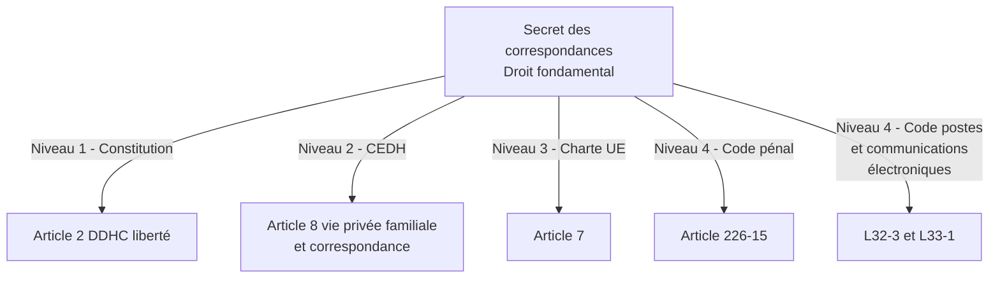
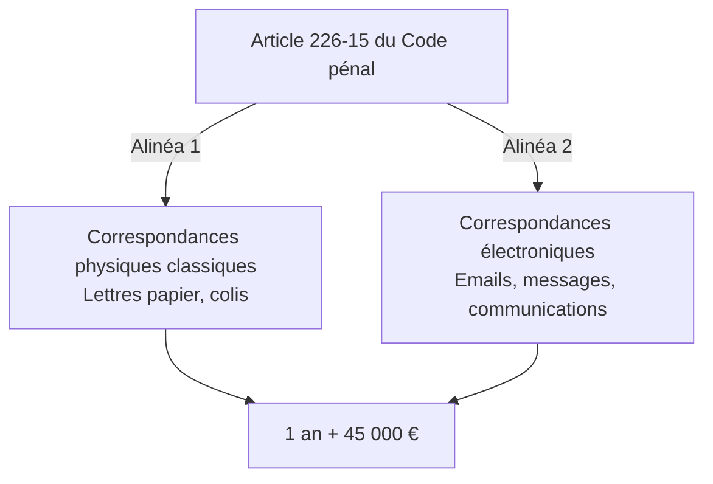
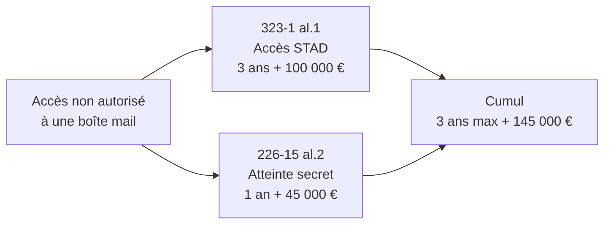
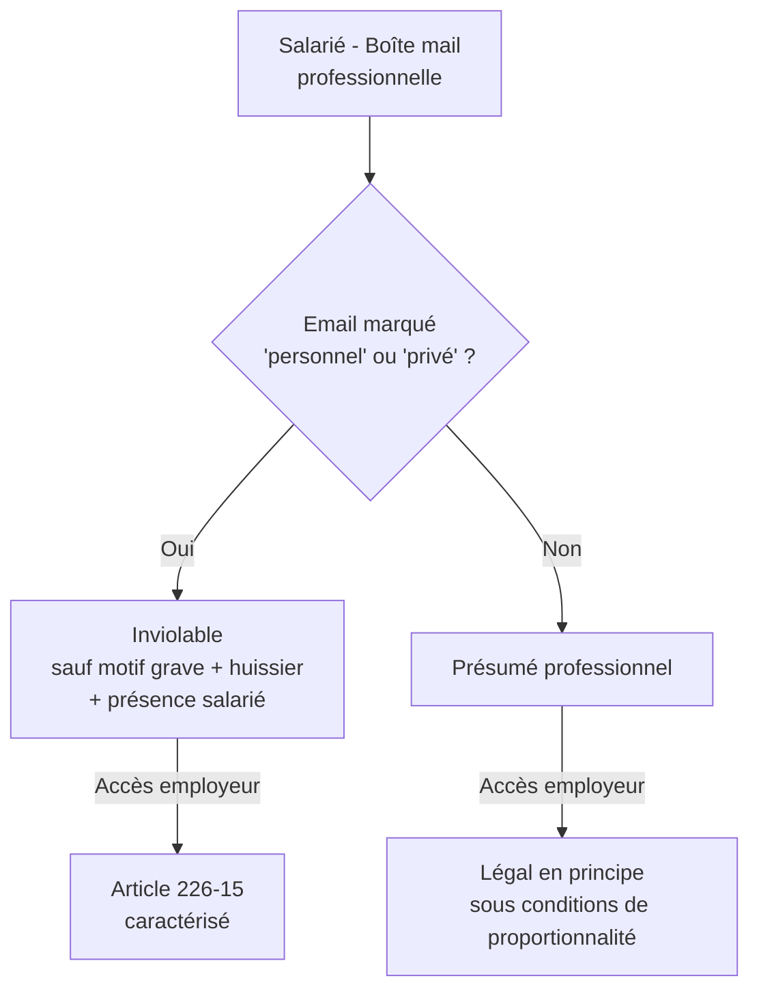
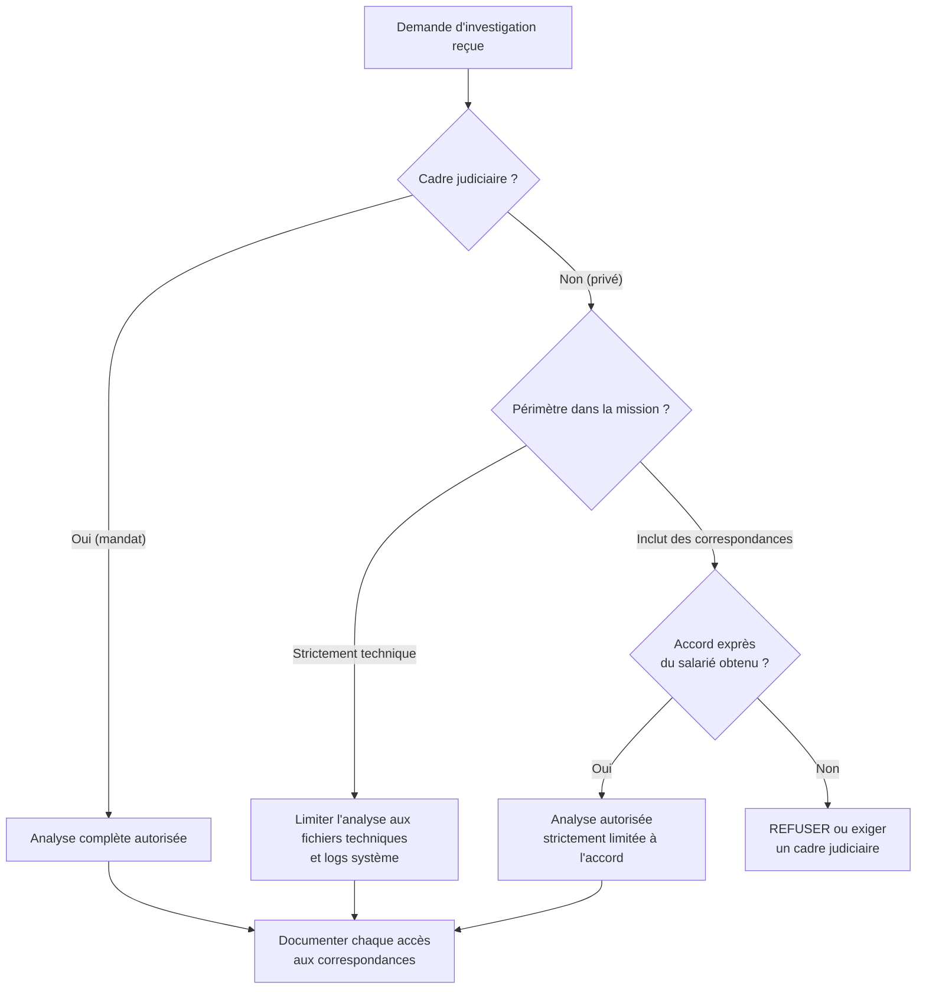

# Article 226-15 et atteintes au secret des correspondances

<div
  class="omny-meta"
  data-level="🟡 Intermédiaire"
  data-version="Droit Français (2026)"
  data-time="1 heure">
</div>

!!! note "**Livrables :** _Fiche d'articulation 226-15 / 323-X_"
!!! note "**Auto-explication :** _8 minutes_"

<br>

---

<br>

!!! quote "L'analogie de la lettre cachetée"

    Au XIXe siècle, le facteur qui décachetait les lettres pour en lire le contenu commettait une infraction grave, indépendamment de ce qu'il faisait ensuite avec l'information. Le secret de la correspondance était sacré, non pas parce que les lettres contenaient des secrets d'État, mais parce que la confiance dans le service postal était une condition de la vie en société. L'article 226-15 du Code pénal moderne applique exactement la même logique aux emails, messages instantanés, échanges sur réseaux sociaux, communications chiffrées. Décacheter un email d'autrui n'est pas un acte technique anodin : c'est une atteinte à un droit fondamental qui a sa propre incrimination, distincte des articles 323. Pour vous, analyste forensic, comprendre cette distinction est vital. Vos investigations vont fréquemment toucher à des correspondances, et chaque manipulation doit s'inscrire dans un cadre qui préserve ce droit fondamental.

## Objectifs pédagogiques

!!! tip "À la fin de ce chapitre, vous serez capable de :"

    - Citer le texte de l'article 226-15 du Code pénal et identifier ses deux alinéas distincts.
    - Distinguer l'atteinte au secret des correspondances (226-15) de l'accès frauduleux à un STAD (323-1).
    - Identifier les cas où vos investigations forensic peuvent toucher à des correspondances.
    - Articuler 226-15 avec le droit du travail (surveillance des salariés).
    - Connaître les exceptions légales (interception judiciaire, accord du destinataire).

<br>

---

<br>

## Pourquoi un article spécifique aux correspondances

### Le secret des correspondances - Un droit fondamental

Le secret des correspondances est un droit fondamental garanti à plusieurs niveaux de la pyramide des normes (chapitre 1.1).

> Le schéma suivant illustre l'empilement des garanties protégeant le secret des correspondances :



Le caractère **multi-niveaux** de cette protection signifie qu'une violation peut être attaquée à plusieurs titres : pénal, administratif, civil, et même devant la Cour européenne des droits de l'homme.

### Distinction conceptuelle avec l'accès au STAD

L'article 323-1 (chapitre 1.3) protège le **système** comme contenant. L'article 226-15 protège la **correspondance** comme contenu. Cette distinction est subtile mais structurante.

> Le tableau ci-dessous synthétise les différences fondamentales entre la protection du système et la protection de la correspondance :

| Critère | Article 323-1 | Article 226-15 |
|---|---|---|
| Objet protégé | Le système informatique | Le contenu de la communication |
| Bien juridique | Confidentialité et intégrité du STAD | Secret de la correspondance privée |
| Élément matériel | Accès, maintien, altération | Interception, détournement, ouverture |
| Conscience requise | Caractère frauduleux | Conscience de violer le secret |

!!! info "Cas concret illustrant la distinction"
    Un attaquant accède à un serveur de messagerie (323-1 al.1). S'il lit les emails, il commet **également** 226-15 al.2. Les deux infractions se cumulent.

### Pourquoi vous concerne directement

Vous êtes **constamment exposé** à des correspondances dans vos investigations :

| Situation forensic | Correspondances potentiellement touchées |
|---|---|
| Acquisition mémoire d'un poste | Sessions emails ouvertes, messages instantanés en RAM |
| Acquisition disque | Fichiers PST, OST, mbox, conversations Slack/Teams |
| Analyse de tenant Cloud (O365) | Logs d'audit Exchange, règles de transfert suspectes (Inbox rules) |
| Analyse navigateur | Webmails, sessions Discord, messages Facebook |
| Analyse mobile | SMS, WhatsApp, Signal |
| Analyse réseau | Captures Wireshark de SMTP, IMAP, HTTPS |

Chaque accès à ces données peut tomber sous 226-15 si vous ne respectez pas un cadre légitime.

<br>

---

<br>

## Article 226-15 - Texte et décomposition

### Texte intégral en vigueur le 28 avril 2026

!!! quote "Texte en vigueur (Article 226-15)"
    
    > Le fait, commis de mauvaise foi, d'ouvrir, de supprimer, de retarder ou de détourner des correspondances arrivées ou non à destination et adressées à des tiers, ou d'en prendre frauduleusement connaissance, est puni d'un an d'emprisonnement et de 45 000 € d'amende.
    > 
    > Est puni des mêmes peines le fait, commis de mauvaise foi, d'intercepter, de détourner, d'utiliser ou de divulguer des correspondances émises, transmises ou reçues par la voie électronique ou de procéder à l'installation d'appareils de nature à permettre la réalisation de telles interceptions.

<br>

### Architecture en deux alinéas

L'article comporte **deux alinéas correspondant à deux infractions distinctes**.



Pour le forensic numérique, c'est **l'alinéa 2** qui s'applique. Mais l'alinéa 1 reste pertinent pour les correspondances papier que vous pourriez analyser dans le cadre d'une investigation mixte.

<br>

### Décomposition de l'alinéa 2

L'alinéa 2 punit **cinq comportements distincts** liés aux correspondances électroniques.

| Verbe | Comportement | Exemple forensic / attaquant |
|---|---|---|
| Intercepter | Capturer la correspondance pendant sa transmission | Sniffing de trafic, MITM |
| Détourner | Faire dévier la correspondance vers une destination tierce | Règle de forwarding cachée dans O365, redirection DNS |
| Utiliser | Exploiter le contenu d'une correspondance interceptée | Vol d'identifiants, chantage, ingénierie sociale |
| Divulguer | Communiquer le contenu à un tiers | Partage public de logs incluant des emails |
| Installer | Mettre en place les outils d'interception | Déploiement de keylogger, sniffer permanent |

<br>

### Notion de "correspondance électronique"

La jurisprudence et les textes ont progressivement élargi cette notion. En 2026, sont considérés comme correspondances électroniques :

| Type | Exemples |
|---|---|
| Email classique | SMTP/IMAP/POP3, Gmail, Outlook, Exchange Online |
| Messages instantanés | WhatsApp, Signal, Telegram, iMessage |
| Réseaux sociaux | DM Twitter/X, messages Facebook, LinkedIn InMail |
| Plateformes professionnelles | Slack, Teams, Mattermost |
| Voix et vidéo | Appels VoIP, conférences Zoom, FaceTime |
| Communications de fichiers | Transferts via WeTransfer, partages de liens SharePoint |

La frontière reste floue pour les **publications publiques** (tweets publics, posts Facebook ouverts) qui ne sont généralement pas considérées comme des correspondances privées.

<br>

### La notion de mauvaise foi

L'élément moral de l'article 226-15 est la **mauvaise foi**. Cette notion est plus large que l'intentionnalité simple du Code pénal.

| Caractéristique | Conséquence |
|---|---|
| Mauvaise foi présumée | Le ministère public n'a pas à la prouver positivement |
| Justification possible | L'auteur peut prouver sa bonne foi (motif légitime) |
| Renversement de charge | À l'auteur de démontrer la légitimité de l'accès |

!!! abstract "Comparaison avec l'article 323-3-1"
    C'est exactement le même mécanisme que l'article 323-3-1 vu au chapitre précédent : **vous devez pouvoir prouver votre motif légitime**, pas l'inverse. Si vous lisez un email, il vous appartient de prouver pourquoi cette lecture était justifiée par votre mission.

<br>

---

<br>

## Articulation avec d'autres infractions

### Cumul avec l'article 323-1

Comme évoqué, un attaquant qui accède à une boîte mail (par exemple via le vol d'un token de session O365) commet typiquement **deux infractions cumulées** :



En pratique, le ministère public retient les deux qualifications. Le juge peut prononcer une peine unique correspondant au maximum le plus élevé.

### Cumul avec le RGPD

L'interception ou la divulgation d'emails contenant des données personnelles constitue **également** une violation du RGPD (chapitre 1.8). Les sanctions administratives CNIL se cumulent avec les sanctions pénales.

### Cumul avec l'article 226-1

L'**article 226-1 du Code pénal** punit l'atteinte à la vie privée par captation, enregistrement ou transmission de paroles ou d'images. Pour les communications **vocales** ou **vidéo**, ces deux articles peuvent se cumuler.

### Cumul avec les écoutes illégales

L'**article L. 226-15-1 du Code pénal** (renumérotation 2024) sanctionne spécifiquement l'utilisation d'appareils techniques destinés aux écoutes. Pour un keylogger, le cumul est possible.

<br>

---

<br>

## Exceptions légales au secret

L'article 226-15 connaît plusieurs **exceptions légales** strictement encadrées, qui permettent de lever légalement ce secret.

### Interceptions de sécurité (renseignement)

L'**article L. 851-1 et suivants du Code de la sécurité intérieure** autorise les services de renseignement à intercepter des correspondances dans des cas limitativement énumérés (terrorisme, criminalité organisée, espionnage économique).

!!! info "Cadre du renseignement"
    Autorisation préalable du Premier ministre après avis de la **Commission nationale de contrôle des techniques de renseignement (CNCTR)**.

### Interceptions judiciaires

Les **articles 100 à 100-8 du Code de procédure pénale** autorisent les interceptions sur ordonnance d'un juge d'instruction dans le cadre d'une enquête. La durée maximum est de 4 mois, renouvelables.

### Accord exprès du destinataire ou de l'expéditeur

Si le destinataire (ou l'expéditeur) **donne son accord exprès**, l'accès à sa correspondance ne tombe pas sous 226-15. Cet accord doit obéir à certaines règles strictes :

| Caractéristique | Précision |
|---|---|
| Exprès | L'accord ne peut pas être implicite, il doit être formulé clairement |
| Préalable ou contemporain | L'accord ne peut pas être donné a posteriori pour justifier un acte passé |
| Spécifique | L'accord doit valoir pour cette investigation précise |
| Documenté | Idéalement écrit, signé et daté |

### Mandat judiciaire au sens large

Tout mandat judiciaire (perquisition, saisie, expertise) couvre l'accès aux correspondances saisies dans le cadre du périmètre du mandat. C'est ce qui rend votre activité forensic légale lorsque vous travaillez sur commission rogatoire pour un magistrat.

### Exception du dirigeant d'entreprise

C'est une exception **complexe et fragile**. Le dirigeant d'entreprise peut accéder aux correspondances professionnelles de ses salariés, **sous de strictes conditions**. Cette exception est détaillée dans la section suivante.

<br>

---

<br>

## Le cas particulier - Surveillance des salariés

### Le principe et la jurisprudence

L'employeur peut accéder aux fichiers et correspondances **professionnels** des salariés, mais **pas aux correspondances personnelles**. Cette frontière a été construite et affinée par la jurisprudence sociale et pénale au fil des années.



### Les arrêts fondateurs

| Arrêt | Date | Apport |
|---|---|---|
| Cass. soc., Nikon, 2 octobre 2001 | 2001 | Inviolabilité des fichiers personnels même sur PC pro |
| Cass. soc., Cathnet, 9 juillet 2008 | 2008 | Présomption de caractère professionnel à défaut de mention |
| Cass. soc., 18 octobre 2006 | 2006 | Conditions de la surveillance |
| Cass. soc., 17 mai 2005 | 2005 | Information préalable obligatoire |
| Cass. crim., 16 janvier 2018 | 2018 | Application de ce principe jurisprudentiel en matière pénale |

### Conditions cumulatives pour l'accès employeur

Pour qu'un employeur puisse légitimement accéder aux correspondances d'un salarié sans tomber sous 226-15, **cinq conditions** doivent être réunies.

| Condition | Précision |
|---|---|
| Information préalable | Charte informatique signée, règlement intérieur, affichage |
| Caractère professionnel | Email non explicitement marqué "personnel" ou "privé" |
| Proportionnalité | L'accès est justifié par un but légitime (ex: fuite de données, continuité de service) |
| Présence du salarié | Fortement recommandée, sauf empêchement légitime |
| Cadre formalisé | Procès-verbal, témoin, ou idéalement intervention d'un huissier |

### Cas pratique - Le forensic en entreprise

!!! example "**Situation : Suspicion de fuite chez ARTECH**"
    La directrice d'ARTECH vous mandate pour analyser le poste d'un salarié suspecté de fuite d'informations. Elle exige que vous lisiez les emails professionnels et personnels du salarié pour trouver des preuves.

**Analyse de la demande** :

| Action demandée | Légalité de l'action |
|---|---|
| Analyser les fichiers techniques (logs, registres, mémoire) | **Légal** sous mandat de l'employeur |
| Lire les emails professionnels non marqués personnels | **Légal** si la charte informatique le prévoit et que le salarié a été préalablement informé |
| Lire les emails marqués "Personnel" ou "Privé" | **Illégal** sans accord exprès du salarié ou ordonnance d'un juge |
| Lire les conversations WhatsApp ou Signal personnelles | **Illégal** sauf cadre judiciaire strict |
| Capturer la mémoire vive contenant ces conversations | **Légal** (captation globale), mais la *lecture* de ces portions sans cadre reste illégale |

**Solution recommandée** : Si la fuite de données est critique et sérieuse, conseillez à la directrice de **déposer plainte pénalement**. Le magistrat délivrera alors un mandat judiciaire qui couvrira légalement une analyse complète et profonde. Sans mandat, vous devez refuser l'accès aux correspondances personnelles, même si techniquement vous avez l'outil pour le faire.

!!! danger "Attention au piège du dirigeant pressé"
    Un dirigeant qui veut "agir vite" sans s'encombrer du cadre judiciaire vous expose **personnellement** aux sanctions de l'article 226-15. L'ordre du client ne vous protège pas devant la loi. En cas de plainte du salarié pour violation du secret des correspondances, c'est l'analyste qui a physiquement ouvert l'email qui sera visé. Ne cédez jamais à la pression sans mandat formel.

<br>

---

<br>

## Application au forensic - Les bonnes pratiques

### Procédure d'investigation respectueuse

Voici l'arbre de décision type à appliquer dès qu'une investigation est susceptible d'effleurer des correspondances.



### Cloisonnement des analyses

Pour minimiser les risques juridiques, **cloisonnez** vos analyses dès la phase d'acquisition.

| Type de données | Phase d'Acquisition | Phase d'Analyse |
|---|---|---|
| Données techniques (logs, registres, processus) | Acquisition complète requise | Analyse autorisée |
| Documents professionnels de l'utilisateur | Acquisition complète requise | Analyse autorisée si charte présente |
| Correspondances professionnelles | Acquisition possible | Analyse uniquement avec un cadre défini |
| Correspondances personnelles | Acquisition à éviter ou cloisonner techniquement | Analyse strictement interdite sans mandat judiciaire |

### Documentation indispensable

Pour chaque accès à une correspondance, **tracez de manière détaillée** votre action. Cette documentation est votre seule défense en cas de contestation.

!!! abstract "Modèle de journal d'accès"

    ```text
    JOURNAL D'ACCÈS AUX CORRESPONDANCES - CASE: XXX
    ======================================================
    
    Date / heure UTC : 2026-XX-XX HH:MM:SS
    Investigateur    : NOM Prénom
    Cadre légal      : [Mandat n° XXX du juge YYY] OU [Accord du salarié du DD/MM/AAAA]
    Type             : [Email professionnel / WhatsApp / SMS / Log Cloud / etc.]
    Destinataire     : [Adresse email ou numéro]
    Expéditeur       : [Adresse email ou numéro]
    Date du message  : [Date d'envoi du message d'origine]
    Motif de l'accès : [Justification opérationnelle dans le cadre de la mission]
    Action effectuée : [Lecture / Extraction / Annotation / Recherche de mots clés]
    Hash de l'élément : [SHA-256 du fichier ou de la capture]
    
    Justification du caractère légitime :
    [Texte expliquant de manière concise pourquoi cet accès précis s'inscrit dans le mandat technique]
    
    Signature : ________________________
    ```

Cette documentation constitue votre **assurance pénale** vis-à-vis de l'article 226-15. En cas de plainte d'un salarié, le journal prouve que chaque accès a été mesuré, justifié et entièrement traçable.

### Cas du dump mémoire global

Une difficulté pratique classique en forensic : un dump mémoire de la RAM **capture absolument tout**, y compris les processus de messagerie et les correspondances en clair. Vous **ne pouvez pas** demander à Volatility d'acquérir uniquement les zones de mémoire non sensibles.

**La position admise** : la captation globale de la RAM est **légale** dans le cadre d'un mandat technique (elle est indispensable pour chercher des malwares fileless). C'est la **lecture ciblée** post-acquisition qui doit impérativement respecter le périmètre. Distinguez toujours très clairement la phase de captation aveugle de la phase de lecture qualifiée dans votre rapport final.

<br>

---

<br>

## Pièges et bonnes pratiques

!!! failure "Piège 1 - Confondre captation et lecture"
    Capter techniquement (faire une image disque ou un dump RAM) n'équivaut pas à lire. Vous pouvez **acquérir** l'intégralité d'un système sous mandat technique, mais vous devez ensuite **limiter votre lecture** au périmètre autorisé. Le mandat de l'entreprise couvre la captation préventive, votre déontologie juridique limite la lecture.

!!! failure "Piège 2 - Croire que l'employeur peut tout autoriser"
    Le dirigeant qui vous mandate n'a pas un pouvoir absolu sur les données personnelles de ses employés. Sa simple demande ne "légalise" pas votre violation de l'article 226-15. Vous devez toujours être **plus prudent que votre client** en matière de respect de la vie privée.

!!! failure "Piège 3 - Oublier les correspondances chiffrées"
    Des applications comme WhatsApp, Signal, ou iMessage utilisent du chiffrement de bout en bout. Si vos outils (ou le hasard d'une clé en RAM) vous permettent de les déchiffrer, l'article 226-15 s'applique immédiatement au contenu déchiffré. La présence de chiffrement indique d'ailleurs explicitement la volonté de maintenir le secret, renforçant la protection légale.

<br>

## Les 3 règles d'or de l'Analyste

!!! tip "1. Refuser d'agir sans cadre"
    Savoir dire non est une compétence professionnelle majeure en forensic. Un refus ferme tel que : _"Sans mandat judiciaire ou sans l'accord exprès et écrit du salarié, je ne peux légalement pas ouvrir ces correspondances"_ protège votre responsabilité civile et pénale.

!!! tip "2. Privilégier le dépôt de plainte"
    Si les enjeux de la compromission (fuite de propriété intellectuelle massive, extorsion) justifient absolument une investigation profonde des correspondances, incitez systématiquement la direction à **déposer plainte**. Le mandat judiciaire qui s'ensuivra vous offrira un cadre d'intervention serein et totalement légal.

!!! tip "3. Tenir scrupuleusement un journal d'accès"
    Le journal d'accès documenté (section précédente) est votre bouclier. Prenez l'habitude de le tenir à jour en temps réel pour chaque investigation, même pour les dossiers qui vous semblent simples au départ.

<br>

---

<br>

## Manipulation pratique - Exercices

### Exercice 1 - Qualification de cas

> Le tableau ci-dessous liste plusieurs situations. Identifiez l'article de loi enfreint et la peine maximale encourue.

!!! quote "Solution"

    | Situation | Infraction caractérisée | Peine maximale encourue |
    |---|---|---|
    | Un attaquant pirate la boîte mail Gmail d'un journaliste et lit ses échanges | 323-1 al.1 (système) + 226-15 al.2 (correspondance) | 3 ans + 100 000 € (le juge retient la peine la plus haute) |
    | Un employeur configure discrètement un keylogger sur le PC d'un salarié sans en informer ce dernier | 226-15 al.2 (installation d'appareil d'interception) | 1 an + 45 000 € |
    | Un sysadmin lit par simple curiosité les emails de son Directeur Général | 226-15 al.2 (prise de connaissance frauduleuse) | 1 an + 45 000 € |
    | Un analyste forensic acquiert un dump mémoire sous commission rogatoire puis lit les conversations Signal du suspect | **Légal** (l'ordonnance judiciaire couvre l'investigation) | Aucune |
    | Un pentester découvre une faille Exchange Server et démontre l'impact au RSSI sans lire de courriers | **Légal** si stipulé dans le périmètre d'audit | Aucune |
    | Le même pentester lit le contenu de trois courriels "pour valider la faille en profondeur" | 226-15 al.2 (dépassement grave du périmètre de mandat) | 1 an + 45 000 € |

<br>

### Exercice 2 - Rédaction d'une clause de mandat (Cas Cloud O365)

Vous intervenez pour une compromission BEC (Business Email Compromise) sur le tenant Office 365 d'un client. Rédigez une clause type de mandat qui sécurise votre action, en particulier vis-à-vis des règles de forwarding (qui dévient les emails de salariés) et des accès aux boîtes compromis.

!!! quote "Solution (Modèle attendu)"

    **ARTICLE X - PÉRIMÈTRE D'ACCÈS AUX CORRESPONDANCES ELECTRONIQUES (ENVIRONNEMENT CLOUD)**
    
    Dans le cadre de la présente mission de remédiation sur l'environnement Microsoft 365
    du Mandant, le Prestataire est expressément autorisé à accéder, dans la limite
    stricte de l'identification et de la neutralisation des accès illégitimes :
    
    - Aux journaux d'audit de la plateforme (Unified Audit Logs, Sign-in Logs) ;
    - Aux règles de flux de messagerie (Transport Rules, Inbox Rules) ;
    - Aux métadonnées des courriels professionnels (expéditeur, destinataire, date, objet) non marqués expressément comme personnels ;
    - Aux indicateurs de compromission (règles de redirection, transferts masqués).
    
    Le Prestataire s'engage de manière explicite et inconditionnelle à :
    
    1. Ne pas lire le contenu effectif des correspondances interceptées ou redirigées,
       ni des courriels présents dans les boîtes aux lettres auditées, sauf nécessité
       absolue pour confirmer la présence d'un code malveillant, et uniquement
       avec l'accord formel du Mandant ou du salarié ;
    2. Ne jamais extraire, copier ou conserver le contenu de messages signalés "Privé"
       ou "Personnel" ;
    3. Tracer systématiquement dans un journal horodaté tout accès exceptionnel au
       contenu d'un courriel ;
    4. Supprimer l'intégralité des extractions de logs et métadonnées à la clôture
       définitive du rapport d'intervention.

<br>

### Exercice 3 - Recherche jurisprudentielle

Sur Doctrine.fr ou Légifrance, recherchez l'arrêt **Cass. soc., 2 octobre 2001, Nikon**. Lisez le résumé officiel et identifiez l'apport juridique fondamental de cette décision pour la sphère professionnelle. Ce travail de recherche directe sur les sources officielles est indispensable pour solidifier vos connaissances.

<br>

---

<br>

## Auto-évaluation

!!! question "Testez vos connaissances (sans relire)"
    1. Quelle est la peine encourue pour violation de l'article 226-15 ?
    2. Quelle est la différence d'application entre l'alinéa 1 et l'alinéa 2 de cet article ?
    3. Quels sont les cinq comportements répréhensibles listés dans l'alinéa 2 ?
    4. Comment définit-on juridiquement la mauvaise foi dans le cadre de cet article ?
    5. Dans quelles conditions strictes un employeur peut-il légitimement lire les emails de l'un de ses employés ?
    6. Quel est le statut d'un email professionnel marqué "Personnel" dans l'objet ?
    7. Peut-on cumuler une infraction à l'article 323-1 et à l'article 226-15 pour la même attaque ?
    8. Quel est l'apport historique de l'arrêt Nikon de 2001 ?

> _Les réponses à ces questions se trouvent dans les tableaux de synthèse des sections précédentes. Prenez le temps de les chercher si vous avez le moindre doute !_

<br>

---

<br>

## Synthèse mémo

!!! success "À retenir absolument"
    
    **ARTICLE 226-15 - SECRET DES CORRESPONDANCES**
    
    - **Alinéa 1** : Correspondances physiques (lettres, colis)
    - **Alinéa 2** : Correspondances électroniques (emails, messageries instantanées, voix sur IP)
    
    **Comportements sanctionnés (alinéa 2)** :
    - Intercepter
    - Détourner
    - Utiliser
    - Divulguer
    - Installer (des outils d'interception)
    
    **Élément moral** : La mauvaise foi (qui est présumée sans motif légitime démontré).
    **Peine encourue** : 1 an d'emprisonnement et 45 000 € d'amende.
    
    **Cumul typique** : 323-1 (violation du système) + 226-15 (lecture ou vol de la correspondance).
    
    **Exceptions légales** :
    - Le mandat judiciaire strict
    - L'accord exprès et formel de l'intéressé
    - La cybersurveillance légitime de l'employeur (soumise à un formalisme lourd)
    - Les interceptions de sécurité étatiques (services de renseignement)
    
    **Pour vous, Analyste Forensic** :
    - La captation technique aveugle (image disque, mémoire) est tolérée sous couvert de votre mission.
    - La lecture ciblée doit impérativement se limiter au périmètre professionnel autorisé.
    - Il est obligatoire de documenter chaque accès nominatif dans un journal spécifique.

<br>

---

<br>

## Pour aller plus loin

Ci-dessous une liste des ressources pour approfondir le sujet :

| Ressource | Type | Description |
|---|---|---|
| Légifrance - Article 226-15 | Texte officiel | Consultation du cadre pénal en vigueur |
| Cass. soc. Nikon 2 octobre 2001 | Jurisprudence | Arrêt fondateur sur l'inviolabilité des fichiers au travail |
| CEDH - Affaire Halford c. Royaume-Uni 1997 | Jurisprudence | Impact européen du droit au secret des communications |
| CNIL - Guide de la cybersurveillance des salariés | Guide pratique | Règles applicables au contrôle des postes de travail (2025) |
| Code des postes et communications L32-3 | Texte | Dispositions complémentaires concernant les opérateurs télécoms |

<br>

---

<br>

## Auto-explication

!!! tip "Défi pédagogique (Technique Feynman)"
    Pour valider définitivement l'assimilation de ce chapitre fondamental, enregistrez une vidéo de 8 minutes où vous expliquez de manière fluide et professionnelle :
    
    1. La distinction fondamentale entre la violation du système (323-1) et la violation du contenu (226-15) (1 min).
    2. Les cinq verbes d'action constituant l'infraction de l'alinéa 2 (1 min).
    3. Le concept de mauvaise foi et l'importance du motif légitime (1 min).
    4. Les grandes exceptions légales qui permettent de contourner ce secret (1 min).
    5. Le cas extrêmement sensible du droit d'accès de l'employeur (2 min).
    6. La procédure forensic respectueuse que vous appliquez personnellement pour vous protéger (2 min).
    
    _Stockez cette séquence vidéo dans votre dossier personnel d'auto-évaluation continue._

<br>

---

<br>

## Conclusion

!!! quote "Ce qu'il faut retenir"
    Un bon analyste technique peut récupérer n'importe quel fichier sur un disque. Un excellent analyste forensic sait exactement quels fichiers il a **le droit** de regarder, et comment prouver la légalité de son action. Ne sous-estimez jamais l'article 226-15 : c'est l'un des rares textes du code pénal qui peut se retourner contre le défenseur avec autant de violence que contre l'attaquant.

> [Chapitre suivant : 1.5 LCEN 2004 et conservation des données →](01-5-lcen-2004.md)
>
> [Retour à l'index →](./index.md)

<br>
