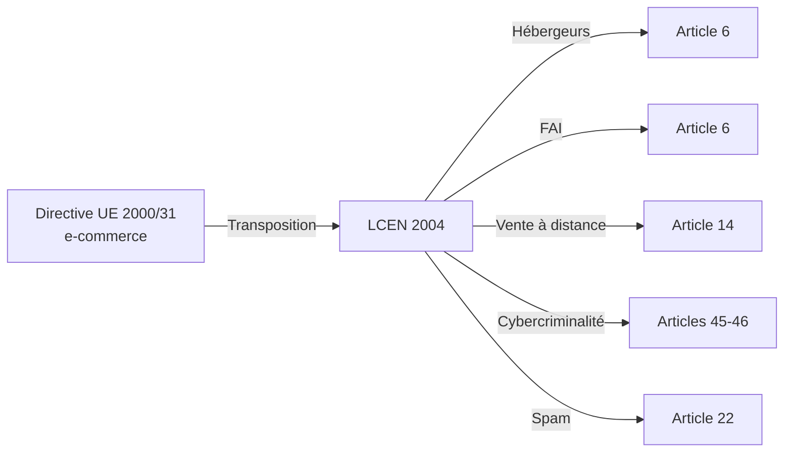
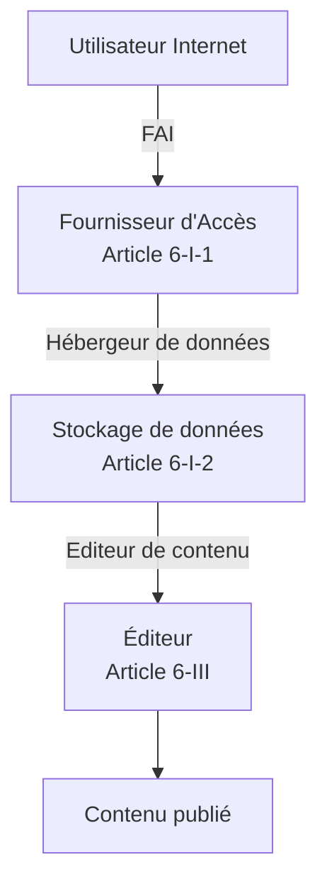
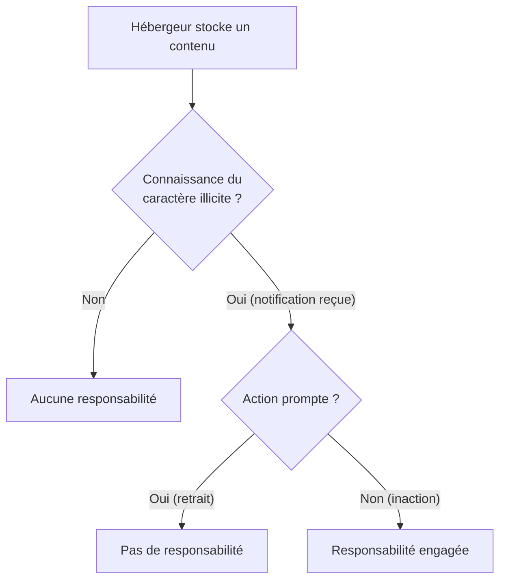
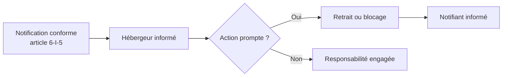
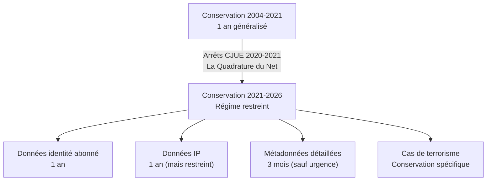
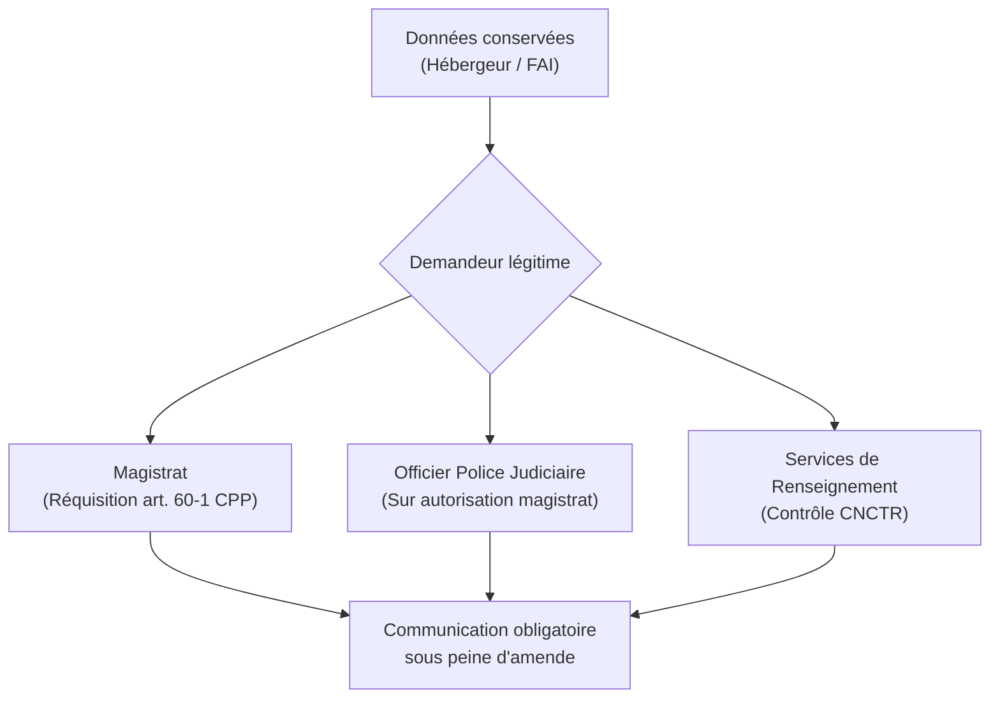
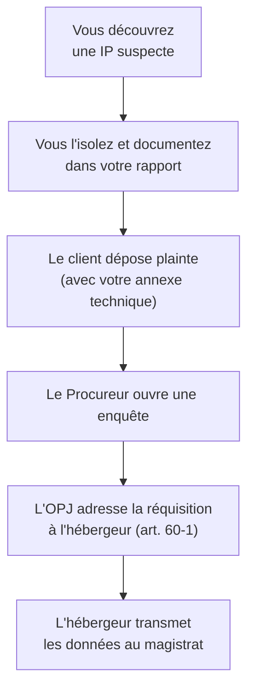

# LCEN 2004 et conservation des données

!!! note "**Livrables :** _Schéma des obligations LCEN, fiche réquisition_"
!!! note "**Auto-explication :** _12 minutes_"

 

---

 

!!! quote "L'analogie de l'autoroute et des péages"

    Sur une autoroute, les sociétés concessionnaires ne sont pas responsables des accidents causés par les conducteurs, mais elles sont tenues de conserver des informations (vitesse aux péages, vidéos de surveillance, plaques minéralogiques) qui permettront aux enquêteurs de remonter aux faits. La LCEN applique cette logique à l'autoroute numérique. Les hébergeurs et FAI ne sont pas responsables des contenus qu'ils transportent, mais ils doivent conserver des traces qui permettent aux autorités d'enquêter. Pour vous, analyste forensic, ces traces sont une mine d'or : ce sont les seules preuves objectives qui permettent de remonter à l'attaquant quand toutes les autres ont été effacées.

## Objectifs pédagogiques

!!! tip "À la fin de ce chapitre, vous serez capable de :"

    - Citer les éléments structurants de la LCEN du 21 juin 2004.
    - Distinguer les statuts d'éditeur, hébergeur et FAI au sens de la LCEN.
    - Lister les données de connexion soumises à conservation et leurs durées.
    - Identifier les autorités habilitées à demander la communication de ces données.
    - Articuler la LCEN avec le RGPD et le secret des correspondances.

 

---

 

## Contexte et architecture de la LCEN

### Genèse

La **loi n°2004-575 du 21 juin 2004 pour la confiance dans l'économie numérique** est le texte fondateur du droit français de l'Internet commercial. Elle transpose la **directive européenne 2000/31/CE** dite "directive e-commerce".

> Le schéma ci-dessous montre la structure globale de cette législation :

### Les quatre piliers de la LCEN

La LCEN structure le droit numérique français autour de quatre piliers principaux.

> Tableau récapitulatif des piliers :

| Pilier | Articles principaux | Contenu |
|---|---|---|
| Statut des intermédiaires techniques | Article 6 | Hébergeurs, FAI, éditeurs |
| Conservation et communication | Article 6-II et II bis | Données de connexion |
| Vente à distance | Articles 14 à 19 | E-commerce et obligations |
| Cybercriminalité | Articles 45-46 | Renforcement Code pénal |

### Pourquoi la LCEN nous concerne en forensic

Trois raisons structurelles rendent ce texte essentiel pour l'investigateur :

!!! abstract "**Raison 1 - Source de preuves légales.** Les données conservées par les hébergeurs et FAI au titre de la LCEN sont **les seules traces fiables** quand l'attaquant a effacé ses traces locales. Vous serez amené à les solliciter via réquisition judiciaire."

!!! abstract "**Raison 2 - Obligations potentielles si vous hébergez.** Si OmnyVia héberge des contenus utilisateurs (ce qui peut arriver avec OmnyDocs ou des outils SaaS), vous devenez vous-même hébergeur au sens de la LCEN, avec ses obligations."

!!! abstract "**Raison 3 - Cadre du retrait de contenus illicites.** Les notifications LCEN (article 6-I-5) permettent de demander à un hébergeur de retirer des contenus illicites. Ce mécanisme peut être utile dans des incidents de fuite de données ou de diffamation post-attaque."

 

---

 

## Le statut des intermédiaires techniques

### Trois statuts distincts

La LCEN distingue **trois acteurs** de la chaîne Internet, avec des régimes de responsabilité très différents.

### L'éditeur

L'**éditeur** est la personne qui décide du contenu publié. Il est **pleinement responsable** de ce contenu, tout comme un éditeur de presse.

| Caractéristique | Précision |
|---|---|
| Définition | Personne qui choisit, sélectionne et organise les contenus |
| Responsabilité | Pleine et entière (civile et pénale) |
| Identification obligatoire | Mentions légales obligatoires sur le site |
| Application au forensic | Vous êtes éditeur du contenu que vous rédigez sur OmnyDocs |

### L'hébergeur

L'**hébergeur** stocke les contenus pour le compte de tiers, sans intervention sur leur sélection. Sa responsabilité est **limitée**.

!!! quote "Texte en vigueur (Article 6-I-2)"
    
    > Les personnes physiques ou morales qui assurent, même à titre gratuit, pour mise à disposition du public par des services de communication au public en ligne, le stockage de signaux, d'écrits, d'images, de sons ou de messages de toute nature fournis par des destinataires de ces services ne peuvent pas voir leur responsabilité civile engagée du fait des activités ou des informations stockées à la demande d'un destinataire de ces services si elles n'avaient pas effectivement connaissance de leur caractère illicite ou de faits et circonstances faisant apparaître ce caractère ou si, dès le moment où elles en ont eu cette connaissance, elles ont agi promptement pour retirer ces données ou en rendre l'accès impossible.

### Régime de responsabilité de l'hébergeur

> Le logigramme suivant détaille l'engagement de responsabilité de l'hébergeur :

L'hébergeur est protégé tant qu'il ignore le caractère illicite du contenu. Dès qu'il en est formellement notifié, il doit agir rapidement. C'est le mécanisme de **notification et action**.

### Le FAI

Le **fournisseur d'accès Internet (FAI)** a pour rôle de transporter le trafic sans en modifier le contenu. Sa responsabilité est **encore plus limitée** que celle de l'hébergeur.

| Caractéristique | Précision |
|---|---|
| Activité | Transport du trafic, accès au réseau, pas de stockage durable |
| Responsabilité | Quasi-nulle pour les contenus transportés |
| Obligations | Conservation des données de connexion de leurs abonnés |
| Exemples | Orange, SFR, Bouygues, Free, Starlink |

### Cas pratique - Qualification d'un acteur

> Exercice d'application immédiate :

| Acteur / Service | Statut LCEN |
|---|---|
| Site corporate avec articles rédigés par les employés | Éditeur |
| Service Cloud hébergeant un site institutionnel tiers | Hébergeur |
| FAI fournissant la fibre à une entreprise | FAI |
| Un blog WordPress.com hébergeant les billets d'un utilisateur | Hébergeur |
| Un compte Twitter/X | La plateforme est hébergeur, l'utilisateur est l'éditeur de ses tweets |
| Wikipedia | Hébergeur (pas de contrôle a priori des contributeurs) |

 

---

 

## La notification LCEN et le retrait de contenu

### Mécanisme de notification

L'**article 6-I-5** de la LCEN définit les conditions très strictes d'une notification valide à un hébergeur.

!!! abstract "Les 7 conditions de validité"
    Pour forcer l'action de l'hébergeur, la notification doit **obligatoirement** comporter :
    
    1. La date de la notification
    2. L'identité du notifiant (personne physique ou morale)
    3. Les coordonnées complètes
    4. La description précise des faits litigieux
    5. La localisation précise des contenus (URL exacte)
    6. Les motifs juridiques de la demande de retrait
    7. La justification de la communication préalable à l'éditeur du contenu (sauf impossibilité)

### Effet de la notification

Une notification strictement conforme **fait peser sur l'hébergeur l'obligation d'agir**. S'il n'agit pas et que le contenu est ultérieurement jugé illicite par un tribunal, sa responsabilité civile (et parfois pénale) peut être engagée.

### Application post-incident (Forensic / Réponse sur incident)

Après une cyberattaque (ex: ransomware), vos données peuvent se retrouver publiées sur des forums, des sites de leak publics ou des archives non-darknet. La notification LCEN est l'**outil légal** pour en exiger le retrait.

**Procédure type** :
1. Identifier l'hébergeur du site de leak (via WHOIS, traceroute, IP, mentions légales).
2. Rédiger une notification exhaustive conforme à l'article 6-I-5.
3. L'envoyer en recommandé avec AR (ou via le formulaire légal dédié de l'hébergeur).
4. Conserver minutieusement la preuve d'envoi.
5. Si aucune action n'est prise sous 24-48h, escalader juridiquement.

!!! warning "Les limites géopolitiques"
    Beaucoup d'hébergeurs "bulletproof" étrangers (Russie, certains pays asiatiques, ou paradis de l'hébergement) ignorent totalement les notifications LCEN. Le recours réel reste alors limité aux saisines judiciaires internationales ou au blocage DNS national, procédures longues et coûteuses.

 

---

 

## La conservation des données de connexion

### Principe

L'**article 6-II et 6-II bis** de la LCEN impose aux hébergeurs et FAI la **conservation systématique** de certaines données techniques pour permettre l'identification a posteriori des auteurs d'infractions.

C'est cette obligation légale qui rend possibles vos investigations forensic à postériori, lorsque les attaquants ont pris soin d'effacer les journaux locaux.

### Données concernées

Les données conservées sont exclusivement des **métadonnées techniques**, jamais les contenus eux-mêmes.

> Le tableau ci-dessous distingue ce qui est conservé de ce qui ne l'est pas :

| Catégorie | Données conservées | Interdit de conserver (sous LCEN) |
|---|---|---|
| Identification de connexion | Adresse IP, port source attribué | Contenu de la session, requêtes HTTP complètes |
| Données utilisateur | Identifiants utilisés, heures de login/logout | Mots de passe en clair |
| Données contractuelles | Identité civile de l'abonné, facturation | Achats détaillés, comportement d'usage |
| Données de communication | Date, heure, durée d'un échange | Corps du texte, enregistrement de la voix |

### Durées de conservation - Évolution récente

Les durées de conservation ont été **considérablement réduites** suite aux décisions de la CJUE (Cour de justice de l'UE) et du Conseil d'État, qui ont jugé la conservation généralisée "au cas où" incompatible avec le droit fondamental au respect de la vie privée.

!!! info "État du droit en avril 2026"

    - **Identité de l'abonné** (nom, adresse, paiement) : Conservation d'**1 an** maintenue.
    - **Adresse IP** : Conservation d'**1 an** autorisée pour les enquêtes pénales graves.
    - **Données de connexion détaillées** (ports, heures exactes, destinataires) : **3 mois maximum**, sauf si une injonction de conservation rapide ("quick freeze") est ordonnée.

### Communication aux autorités

Ces données ne sont pas en libre accès. Elles sont communiquées uniquement sur demande d'autorités habilitées, selon des procédures très formalisées.

### Réquisition judiciaire - Article 60-1 du Code de procédure pénale

C'est la procédure cardinale pour obtenir des logs dans une enquête pénale.

!!! quote "Texte en vigueur (Article 60-1 CPP)"
    
    > Le procureur de la République ou l'officier de police judiciaire peut, par tout moyen, requérir de toute personne, de tout établissement ou organisme privé ou public ou de toute administration publique qui sont susceptibles de détenir des informations intéressant l'enquête, de lui remettre ces informations, notamment celles issues d'un système informatique ou d'un traitement de données nominatives.

> Voici la chronologie type d'une réquisition :

| Étape | Acteur | Délai indicatif |
|---|---|---|
| Dépôt de plainte | Victime ou son conseil | - |
| Ouverture d'enquête | Parquet | Quelques jours |
| Émission de la réquisition | OPJ / Procureur | Sous 1 mois (trop lent pour les logs de 3 mois) |
| Réponse au format légal | Hébergeur / FAI | 24h à plusieurs semaines |
| Exploitation technique | Enquêteur / Forensic | Selon l'ampleur du fichier transmis |

### Sanctions du non-respect

Le refus de communiquer suite à une réquisition est sévèrement sanctionné. 
L'**article 60-1 CPP** prévoit une amende générale de **3 750 €**. 
Mais l'**article 60-2 CPP** ajoute des sanctions beaucoup plus lourdes spécifiquement pour les opérateurs de communications électroniques : le refus peut entraîner jusqu'à **75 000 € d'amende** et l'engagement de la responsabilité pénale personnelle du dirigeant.

 

---

 

## Articulation avec le RGPD

### Conflit apparent

Il existe une tension naturelle : la LCEN impose la **conservation systématique** (stocker) ; le RGPD impose la **minimisation** (ne pas stocker inutilement).

**Résolution juridique** : La LCEN constitue une **base légale spéciale** au sens de l'article 6-1-c du RGPD (traitement nécessaire au respect d'une obligation légale). La conservation est donc parfaitement légitime au regard du RGPD, tant qu'elle ne dépasse pas les limites et durées strictes fixées par la LCEN.

### Effet sur les durées et droits des personnes

C'est cette friction avec le droit européen des données personnelles qui a forcé la réduction des durées à 3 mois pour le trafic détaillé. De plus, les données conservées LCEN restent soumises aux droits fondamentaux du RGPD :

| Droit RGPD | Application aux données LCEN |
|---|---|
| Droit d'accès (article 15) | L'abonné peut demander à l'opérateur quelles données sont conservées |
| Droit de rectification (article 16) | Possibilité de faire corriger des données contractuelles erronées |
| Droit à l'effacement (article 17) | **Limité** (l'obligation légale prévaut sur le droit à l'effacement) |
| Droit d'opposition (article 21) | **Inopérant** face à une injonction de conservation |

 

---

 

## Application au forensic - Workflow type

### Quand solliciter les données LCEN

Vous conseillerez systématiquement la sollicitation de ces données dans les scénarios suivants :

| Scénario d'incident | Métadonnées LCEN ciblées |
|---|---|
| Intrusion depuis une IP externe | Identité civile de l'abonné liée à l'IP à l'horaire précis |
| Exfiltration de données via canal inconnu | Logs de connexion du FAI (volumétrie, qui parle à qui) |
| Campagne de phishing ciblé | Logs SMTP de l'hébergeur de l'attaquant |
| Effacement intégral des journaux locaux | Logs d'accès de l'hébergeur Cloud du serveur compromis |

### Procédure de demande type

!!! danger "Vous ne pouvez pas réquisitionner !"
    En tant que prestataire privé, vous n'avez **aucun pouvoir de réquisition**. Une demande amiable d'un cabinet forensic à un FAI pour obtenir l'identité derrière une IP se soldera par un refus (et une violation potentielle du RGPD par le FAI s'il acceptait). La demande **doit** passer par le canal judiciaire.

### Cas où vous ne passerez pas par la justice

Il existe trois exceptions majeures où l'accès aux logs d'hébergement se fait directement, sans juge :

1. **Vous êtes l'éditeur du service**. Si l'incident concerne votre propre infrastructure, vous accédez directement à vos journaux.
2. **Accès via console Cloud**. Certains fournisseurs Cloud (AWS, Azure, GCP) offrent au client final un accès "self-service" à ses propres logs d'activité (CloudTrail, Azure Activity Log). L'accès est contractuel, pas judiciaire.
3. **Périmètre interne de l'entreprise**. Si vous enquêtez sur une compromission interne et que l'entreprise héberge elle-même ses services, vous y accédez avec l'autorisation de la DSI dans le cadre de votre mandat (cf. module 226-15).

 

---

 

## Pièges et bonnes pratiques

!!! failure "Piège 1 - Confondre obligation et faculté d'obtention"
    La LCEN **impose** la conservation en France. Mais un hébergeur situé aux Seychelles ou en Russie n'y est pas soumis. Même s'il a une clientèle française, obtenir ces données hors de l'UE relève du parcours du combattant diplomatique.

!!! failure "Piège 2 - Sous-estimer les délais (La montre tourne)"
    Les métadonnées détaillées ne sont conservées que 3 mois. Or, une plainte suivie d'une réquisition prend souvent plusieurs semaines. Si vous découvrez une intrusion vieille de 2 mois, prévenez le client que **le temps presse dramatiquement** pour la préservation des preuves externes.

!!! failure "Piège 3 - Rédiger des demandes techniques floues"
    Un juge n'est pas un expert réseau. Si votre rapport indique "Il faudrait l'IP de l'attaquant", la réquisition sera mauvaise. Vous devez mâcher le travail : *« Solliciter l'opérateur [NOM] pour obtenir l'identité de l'abonné détenant l'adresse IPv4 [X.X.X.X] le [Date] à [Heure:Min:Sec UTC] »*.

 

## Les 3 règles d'or de l'Analyste

!!! tip "1. Préparer la réquisition "prête à l'emploi""
    Dès la détection d'une compromission impliquant un hébergeur tiers, rédigez un tableau clair (IP, Port, Timestamp UTC, ASN) destiné à être copié-collé par l'Officier de Police Judiciaire. Vous gagnerez des semaines.

!!! tip "2. Appliquer la LCEN à vous-même"
    Pour les infrastructures de vos clients, configurez une politique de journalisation centralisée et externalisée (SIEM) prévoyant une rétention d'un an (pour les connexions). Ne comptez pas que sur les autres pour conserver les preuves.

!!! tip "3. Traçabilité stricte (Chaîne de garde)"
    Lorsque l'entreprise cliente reçoit des données de son hébergeur ou via la police, documentez scrupuleusement l'origine du fichier de logs avant de l'injecter dans votre outil d'analyse (Exemple : *Fichier "logs_ovh_req_458.csv", SHA256: xxx, remis sur clé USB scellée le JJ/MM/AA*).

 

---

 

## Manipulation pratique - Exercices

### Exercice 1 - Qualifier un acteur

> Le tableau ci-dessous décrit des acteurs du numérique. Identifiez leur statut LCEN et l'obligation qui en découle.

!!! quote "Solution"

    | Acteur / Situation | Statut LCEN | Obligations principales |
    |---|---|---|
    | L'analyste Zyrass écrivant un article pour le blog d'OmnyVia | Éditeur | Responsabilité civile et pénale du contenu, mentions légales. |
    | Microsoft Azure hébergeant la machine virtuelle d'OmnyVia | Hébergeur | Conservation (IPs/logs) pdt 1 an, retrait immédiat si notifié. |
    | Starlink fournissant la connexion internet du QG OmnyVia | FAI | Conservation stricte des données d'attribution IP de connexion. |
    | GitHub hébergeant un dépôt de code public | Hébergeur | Retrait des codes malveillants/illicites sur notification 6-I-5. |
    | Un forum phpBB hébergé sur un serveur de l'entreprise ARTECH | ARTECH est Hébergeur (et Éditeur si elle modère a priori) | Obligation de réponse aux réquisitions pour identifier ses utilisateurs. |

 

### Exercice 2 - Rédaction d'une notification LCEN

Rédigez une notification LCEN type pour exiger le retrait d'un contenu publié à votre encontre sur un site tiers, de manière à engager juridiquement l'hébergeur s'il n'agit pas.

!!! quote "Solution (Modèle de notification 6-I-5 attendu)"

    **NOTIFICATION AU TITRE DE L'ARTICLE 6-I-5 DE LA LCEN**
    
    Date d'émission : 28 avril 2026
    
    **Notifiant :**
      Alain GUILLON
      OmnyVia, [Adresse de la société]
      [Email et Téléphone de contact]
    
    **Hébergeur destinataire :**
      [Nom officiel de la société d'hébergement, ex: OVH SAS]
      [Adresse du siège de l'hébergeur]
    
    **I. Description précise des faits litigieux**
    Un contenu stocké sur vos infrastructures porte gravement atteinte à mes droits :
    - Divulgation illégale d'un rapport technique confidentiel.
    - Atteinte à la vie privée (publication de données personnelles clients).
    
    **II. Localisation précise des contenus**
    Les fichiers sont accessibles à l'adresse exacte suivante :
    - URL : `https://exemple.com/leak/rapport-omnyvia-2026.pdf`
    Constat effectué le 28/04/2026 à 14:30 UTC. (Capture d'écran jointe en annexe).
    
    **III. Motifs juridiques**
    Cette publication enfreint l'article 226-15 du Code pénal (atteinte au secret) et 
    l'article 323-3 (détention frauduleuse de données).
    
    **IV. Démarche préalable**
    L'éditeur du site a été contacté par voie électronique le 25/04/2026.
    Je n'ai reçu aucune réponse à ce jour, justifiant la présente escalade.
    
    **V. Demande d'action prompte**
    Par la présente, je vous mets en demeure de procéder au retrait définitif ou au 
    blocage de l'accès à ce contenu dans les plus brefs délais, conformément à vos 
    obligations découlant de l'article 6-I-2 de la LCEN. À défaut, votre responsabilité 
    pourra être engagée.
    
    Signature : ________________________

 

### Exercice 3 - Le calcul du délai ("Quick Freeze")

Un attaquant a mené une intrusion latérale sur une durée de trois jours, qui s'est terminée le **3 février 2026**. Vous êtes mandaté et découvrez les faits le **15 mars 2026**. La victime dépose plainte le **20 mars**. Le juge valide la réquisition qui part chez l'hébergeur le **5 mai**.
*Question :* En vertu de la jurisprudence 2026, quelles données l'hébergeur sera-t-il légalement capable de fournir ?

!!! quote "Solution"

    | Type de Données | Statut de disponibilité au 5 Mai |
    |---|---|
    | **Identité du locataire du serveur** (Nom, CB) | **DISPONIBLE**. La durée de conservation légale pour les données de création et d'identité est de 1 an (jusqu'au 3 février 2027). |
    | **Adresse IP utilisée pour administrer le serveur** | **DISPONIBLE**. 1 an autorisé pour le pénal. |
    | **Métadonnées détaillées (Quels ports, Quels transferts réseau)** | **PERDUES ET DÉTRUITES**. La durée de conservation stricte est tombée à 3 mois (échéance au 3 mai). La réquisition arrivant le 5 mai, l'hébergeur a l'obligation légale (RGPD/CJUE) d'avoir purgé ces logs détaillés. |
    
    **Leçon opérationnelle :** C'est à vous, analyste, de demander immédiatement aux forces de l'ordre d'émettre une injonction de conservation rapide ("Quick Freeze") dès le 20 mars, pour geler le délai d'effacement en attendant la longue procédure judiciaire.

 

---

 

## Auto-évaluation

!!! question "Testez vos connaissances (sans relire)"
    1. Que signifie l'acronyme LCEN ?
    2. Quels sont les trois statuts distincts régissant la publication sur le net ?
    3. Quelle est la particularité juridique du statut de "l'hébergeur" ?
    4. Citez trois éléments obligatoires pour qu'une notification de retrait (6-I-5) soit valide.
    5. Quelle est la durée de conservation maximale pour les informations d'identité (nom, carte bleue) ?
    6. Quelle est la durée de conservation maximale pour les métadonnées de trafic détaillées, et pourquoi a-t-elle été réduite récemment ?
    7. Quel article du Code de procédure pénale est utilisé par les forces de l'ordre pour exiger ces logs ?
    8. Quelle amende risque l'opérateur (hébergeur/FAI) s'il refuse de fournir les logs à la justice ?

> _Si un point est encore flou, n'hésitez pas à remonter dans la section correspondante pour le consolider._

 

---

 

## Synthèse mémo

!!! success "À retenir absolument"
    
    **LCEN 2004 - Loi pour la Confiance dans l'Économie Numérique**
    
    **Responsabilités structurantes** :
    - **Éditeur** : Pleine responsabilité (civile et pénale).
    - **Hébergeur** : Responsabilité **limitée**. Il devient responsable s'il n'agit pas "promptement" après avoir reçu une notification valide de contenu illicite.
    - **FAI** : Responsabilité quasi nulle sur le transport, mais obligation de conservation.
    
    **La notification (Article 6-I-5)** :
    Outil légal permettant d'exiger le retrait d'une fuite de données chez un hébergeur tiers. Exige 7 critères précis pour être opposable en justice.
    
    **Durées de conservation (Post jurisprudence européenne)** :
    - Identité civile / Contrat : **1 an**.
    - Attribution des Adresses IP : **1 an** (réserve pénal/sécurité).
    - Métadonnées de trafic / logs détaillés : **3 mois**.
    
    **Procédure judiciaire** :
    La demande de logs LCEN s'effectue obligatoirement via une réquisition judiciaire (Article 60-1 du CPP). Les délais sont l'ennemi de l'investigateur ; l'anticipation ("Quick freeze") est indispensable.

 

---

 

## Pour aller plus loin

Ci-dessous une liste de ressources utiles pour approfondir vos connaissances jurisprudentielles :

| Ressource | Type | Description |
|---|---|---|
| Légifrance - LCEN | Référence officielle | Texte complet et actualisé de la loi de 2004 |
| Arrêt CJUE Quadrature du Net (Oct 2020) | Jurisprudence UE | L'arrêt fondateur ayant cassé la conservation de masse d'1 an |
| Conseil const. Décision 2021-976 QPC | Jurisprudence FR | Traduction des contraintes européennes dans le droit français |
| Code de procédure pénale (Art 60-1 à 60-3) | Procédure | Base légale des saisies et réquisitions |
| CNIL - Obligations de conservation | Guide pratique | La position du régulateur sur le compromis RGPD / LCEN |

 

---

 

## Auto-explication

!!! tip "Défi pédagogique (Technique Feynman)"
    Pour certifier l'acquisition de ce chapitre, enregistrez une vidéo de 12 minutes où vous expliquez à voix haute et sans support :
    
    1. La grande distinction de responsabilité entre éditeur, hébergeur et FAI (2 min).
    2. Le fonctionnement juridique du mécanisme de notification (et retrait) (2 min).
    3. Les obligations de conservation exactes des hébergeurs en 2026 (2 min).
    4. La procédure de réquisition judiciaire pour y accéder (2 min).
    5. Le pourquoi de l'évolution récente des lois de conservation face à l'Europe (2 min).
    6. L'impact concret de ces délais et de la juridiction étrangère sur vos investigations (2 min).
    
    _Stockez ce fichier dans votre dossier de progression._

 

---

 

## Conclusion

!!! quote "Ce qu'il faut retenir"
    La LCEN est l'outil à double tranchant par excellence. C'est elle qui vous fournit les preuves d'une attaque lorsque les logs locaux sont détruits, mais c'est aussi elle qui punira l'hébergeur négligent. En forensic, connaître les statuts de la LCEN, c'est savoir immédiatement *à qui* s'adresser, *quoi* demander, et *combien de temps* il vous reste avant la suppression légale des traces. Ne perdez pas un jour.

> [Chapitre suivant : 1.6 Loi de Programmation Militaire 2013 et OIV →](01-6-lpm-oiv.md)
>
> [Retour à l'index →](./index.md)

 
