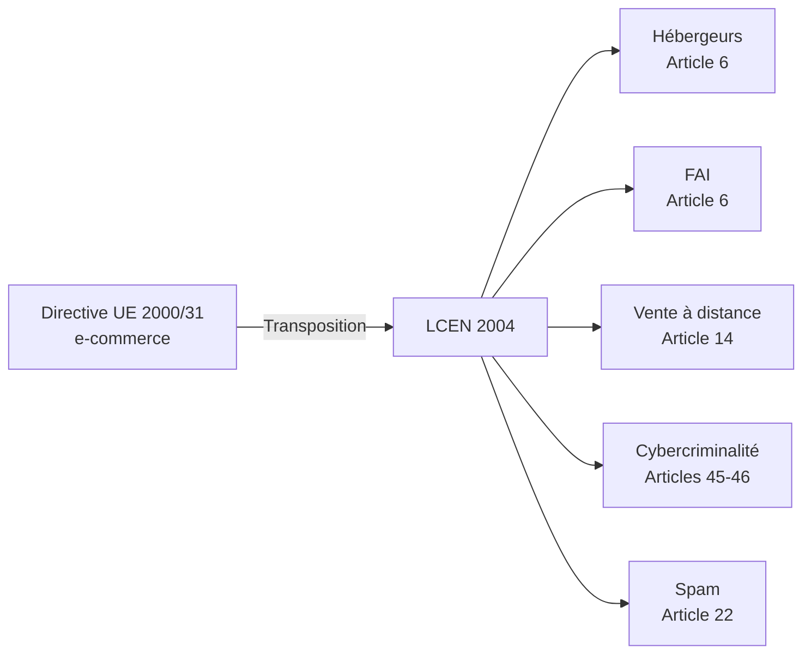
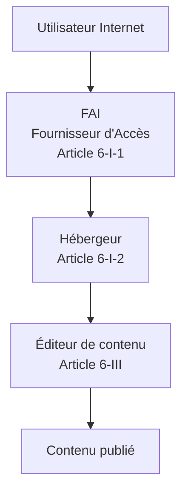
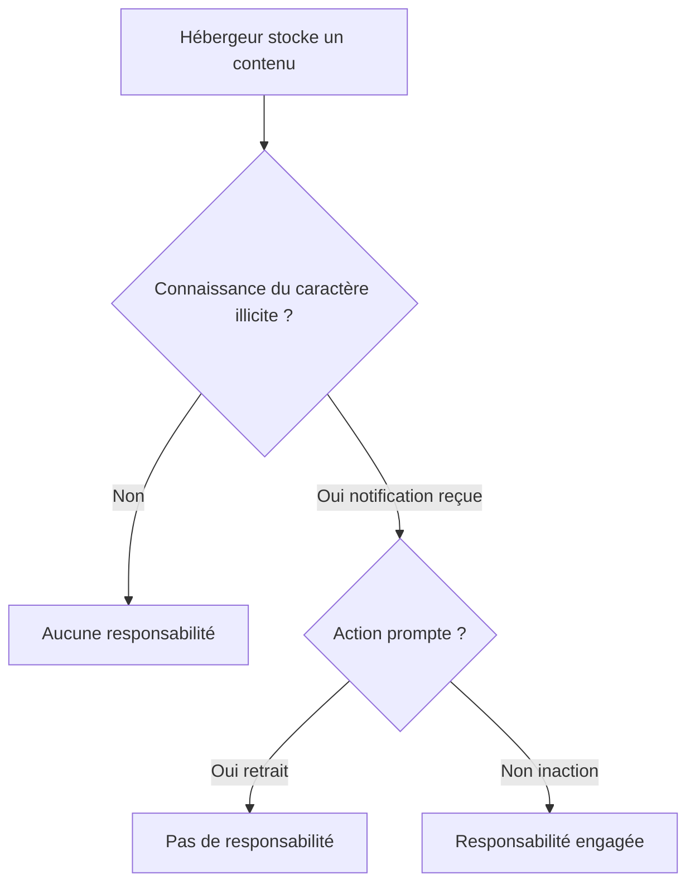
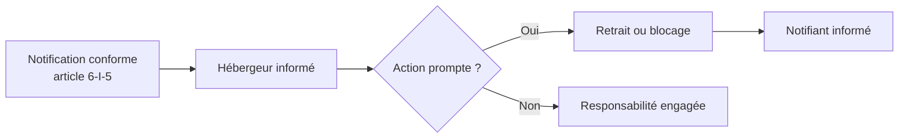
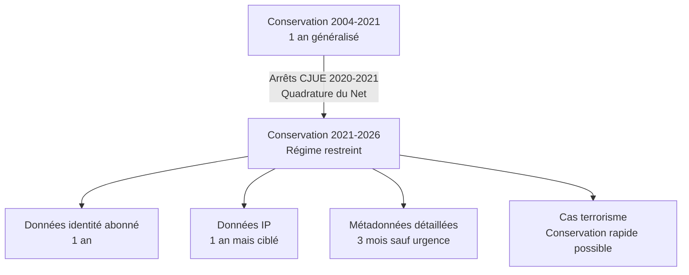
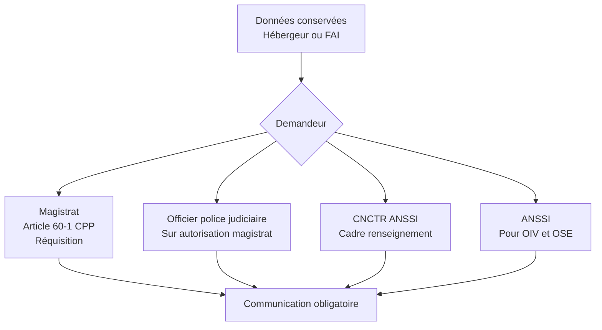
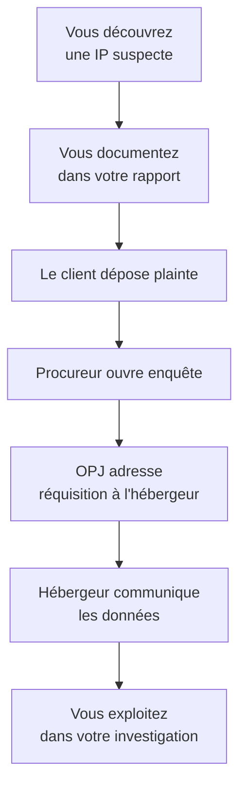

# 1.5 LCEN 2004 et conservation des données

!!! quote "L'analogie de l'autoroute et des péages"

    Sur une autoroute, les sociétés concessionnaires ne sont pas responsables des accidents causés par les conducteurs, mais elles sont tenues de conserver des informations (vitesse aux péages, vidéos de surveillance, plaques minéralogiques) qui permettront aux enquêteurs de remonter aux faits. La LCEN applique cette logique à l'autoroute numérique. Les hébergeurs et FAI ne sont pas responsables des contenus qu'ils transportent, mais ils doivent conserver des traces qui permettent aux autorités d'enquêter. Pour vous, analyste forensic, ces traces sont une mine d'or : ce sont les seules preuves objectives qui permettent de remonter à l'attaquant quand toutes les autres ont été effacées.

## Métadonnées du chapitre

| Champ | Valeur |
|---|---|
| Durée estimée | 2 heures |
| Niveau | Standard |
| Prérequis | Chapitres 1.1 à 1.4 |
| Livrables | Schéma des obligations LCEN, fiche réquisition |
| Auto-explication | 12 minutes |

## Objectifs pédagogiques

À la fin de ce chapitre, vous serez capable de :

- Citer les éléments structurants de la LCEN du 21 juin 2004.
- Distinguer les statuts d'éditeur, hébergeur et FAI au sens de la LCEN.
- Lister les données de connexion soumises à conservation et leurs durées.
- Identifier les autorités habilitées à demander la communication de ces données.
- Articuler la LCEN avec le RGPD et le secret des correspondances.

---

## 1. Contexte et architecture de la LCEN

### 1.1 Genèse

La **loi n°2004-575 du 21 juin 2004 pour la confiance dans l'économie numérique** est le texte fondateur du droit français de l'Internet commercial. Elle transpose la **directive européenne 2000/31/CE** dite "directive e-commerce".



### 1.2 Les quatre piliers de la LCEN

La LCEN structure le droit numérique français autour de quatre piliers principaux.

| Pilier | Articles principaux | Contenu |
|---|---|---|
| Statut des intermédiaires techniques | Article 6 | Hébergeurs, FAI, éditeurs |
| Conservation et communication | Article 6-II et II bis | Données de connexion |
| Vente à distance | Articles 14 à 19 | E-commerce et obligations |
| Cybercriminalité | Articles 45-46 | Renforcement Code pénal |

### 1.3 Pourquoi la LCEN nous concerne en forensic

Trois raisons structurelles :

**Raison 1 - Source de preuves légales.** Les données conservées par les hébergeurs et FAI au titre de la LCEN sont **les seules traces fiables** quand l'attaquant a effacé ses traces locales. Vous serez amené à les solliciter via réquisition judiciaire.

**Raison 2 - Obligations potentielles si vous hébergez.** Si OmnyVia héberge des contenus utilisateurs (ce qui peut arriver avec OmnyDocs ou des outils SaaS), vous devenez vous-même hébergeur au sens de la LCEN, avec ses obligations.

**Raison 3 - Cadre du retrait de contenus illicites.** Les notifications LCEN (article 6-I-5) permettent de demander à un hébergeur de retirer des contenus illicites. Ce mécanisme peut être utile dans des incidents de fuite ou de diffamation post-attaque.

---

## 2. Le statut des intermédiaires techniques

### 2.1 Trois statuts distincts

La LCEN distingue **trois acteurs** de la chaîne Internet, avec des régimes de responsabilité différents.



### 2.2 L'éditeur

L'**éditeur** est la personne qui décide du contenu publié. Il est **pleinement responsable** de ce contenu, comme un éditeur de presse.

| Caractéristique | Précision |
|---|---|
| Définition | Personne qui choisit, sélectionne, organise les contenus |
| Responsabilité | Pleine et entière |
| Identification obligatoire | Mentions légales sur le site |
| Application au forensic | Vous êtes éditeur de votre site OmnyVia, OmnyDocs |

### 2.3 L'hébergeur

L'**hébergeur** stocke les contenus pour le compte de tiers, sans intervention sur leur sélection. Sa responsabilité est **limitée**.

**Texte de l'article 6-I-2** : *"Les personnes physiques ou morales qui assurent, même à titre gratuit, pour mise à disposition du public par des services de communication au public en ligne, le stockage de signaux, d'écrits, d'images, de sons ou de messages de toute nature fournis par des destinataires de ces services ne peuvent pas voir leur responsabilité civile engagée du fait des activités ou des informations stockées à la demande d'un destinataire de ces services si elles n'avaient pas effectivement connaissance de leur caractère illicite ou de faits et circonstances faisant apparaître ce caractère ou si, dès le moment où elles en ont eu cette connaissance, elles ont agi promptement pour retirer ces données ou en rendre l'accès impossible."*

### 2.4 Régime de responsabilité de l'hébergeur



L'hébergeur est protégé tant qu'il ignore le caractère illicite. Dès qu'il est notifié, il doit agir. C'est le mécanisme de **notification et action**.

### 2.5 Le FAI

Le **fournisseur d'accès Internet** transporte le trafic sans en modifier le contenu. Sa responsabilité est **encore plus limitée** que celle de l'hébergeur.

| Caractéristique | Précision |
|---|---|
| Activité | Transport du trafic, pas de stockage durable |
| Responsabilité | Quasi-nulle pour les contenus |
| Obligations | Conservation données de connexion |
| Exemples | Orange, SFR, Bouygues, Free pour le grand public |

### 2.6 Cas pratique - Qualification d'un acteur

| Acteur | Statut LCEN |
|---|---|
| OmnyVia, site corporate avec articles rédigés par Zyrass | Éditeur |
| OmnyDocs avec contributions externes possibles | Hébergeur (pour les contributions) + Éditeur (pour le contenu propre) |
| Cloud OVH hébergeant le site OmnyVia | Hébergeur |
| Free, FAI fournissant la connexion | FAI |
| Un blog WordPress.com hébergeant des billets | Hébergeur |
| Un compte Twitter/X | Twitter est hébergeur, vous êtes éditeur de vos tweets |

---

## 3. La notification LCEN et le retrait de contenu

### 3.1 Mécanisme de notification

L'**article 6-I-5** définit les conditions strictes d'une notification valide à un hébergeur.

Pour être valide, la notification doit comporter **sept éléments obligatoires** :

```text
1. Date de la notification
2. Identité du notifiant (personne physique ou morale)
3. Coordonnées complètes
4. Description précise des faits litigieux
5. Localisation précise des contenus (URL)
6. Motifs juridiques de la demande de retrait
7. Justification de la communication préalable à l'éditeur
```

### 3.2 Effet de la notification

Une notification conforme **fait peser sur l'hébergeur l'obligation d'agir**. S'il n'agit pas et que le contenu est ultérieurement jugé illicite, sa responsabilité civile et pénale peut être engagée.



### 3.3 Application post-incident

Après une attaque, vos données peuvent se retrouver publiées sur des forums, sites de leak, archives. La notification LCEN est l'**outil légal** pour demander le retrait.

**Procédure** :

1. Identifier l'hébergeur via WHOIS, traceroute, mentions légales
2. Rédiger une notification conforme à l'article 6-I-5
3. Envoyer en recommandé avec AR (ou équivalent légal pour hébergeurs étrangers)
4. Conserver la preuve d'envoi pour la suite contentieuse
5. Si pas d'action sous 24-48h, saisir un avocat ou la justice

!!! warning "Limites"

    Beaucoup d'hébergeurs étrangers (Russie, certains pays asiatiques) ignorent les notifications LCEN. Le recours réel reste alors limité aux saisines judiciaires internationales, longues et coûteuses.

---

## 4. La conservation des données de connexion

### 4.1 Principe

L'**article 6-II et 6-II bis** de la LCEN impose aux hébergeurs et FAI la **conservation** de certaines données techniques pour permettre l'identification a posteriori des auteurs de publications.

C'est cette obligation qui rend possibles vos investigations forensic à postériori.

### 4.2 Données concernées

Les données conservées sont les **métadonnées techniques**, pas les contenus eux-mêmes.

| Catégorie | Données conservées | Pas conservé |
|---|---|---|
| Identification connexion | Adresse IP, port source | Contenu de la session |
| Données utilisateur | Identifiants utilisés, login/logout | Mots de passe |
| Données contractuelles | Identité de l'abonné | Achats, comportement |
| Données de communication | Date, heure, durée | Contenu des emails ou messages |
| Localisation | IP géolocalisée, antenne mobile | GPS précis (sauf cas spécifiques) |

### 4.3 Durées de conservation - Évolution récente

Les durées de conservation ont été **considérablement réduites** suite aux décisions de la CJUE (Cour de justice de l'UE) qui ont jugé la conservation généralisée incompatible avec le droit fondamental au respect de la vie privée.



État du droit en avril 2026 :

| Données | Durée | Cadre |
|---|---|---|
| Identité de l'abonné (nom, adresse) | 1 an | Conservation généralisée admise |
| Adresse IP attribuée à un abonné | 1 an | Conservation autorisée pour enquêtes pénales graves |
| Données de connexion détaillées | 3 mois | Sauf injonction de conservation rapide pour enquête |
| Données de localisation | Variable | Selon finalités |

### 4.4 Communication aux autorités

Les données conservées peuvent être communiquées sur demande à plusieurs autorités, selon des procédures formalisées.



### 4.5 Réquisition judiciaire - Article 60-1 du Code de procédure pénale

C'est la procédure principale pour obtenir des données dans une enquête pénale.

**Texte de l'article 60-1 CPP** : *"Le procureur de la République ou l'officier de police judiciaire peut, par tout moyen, requérir de toute personne, de tout établissement ou organisme privé ou public ou de toute administration publique qui sont susceptibles de détenir des informations intéressant l'enquête, de lui remettre ces informations, notamment celles issues d'un système informatique ou d'un traitement de données nominatives."*

Procédure :

| Étape | Acteur | Délai |
|---|---|---|
| Plainte de la victime | Particulier ou entreprise | Variable |
| Ouverture d'enquête | Parquet | Quelques jours |
| Réquisition adressée | OPJ ou Procureur | Sous 1 mois |
| Réponse de l'hébergeur | Hébergeur | Délai variable, 24-72h en pratique |
| Exploitation des données | Enquêteur | Selon ampleur |

### 4.6 Sanctions du non-respect

Le refus de communiquer suite à une réquisition est sanctionné. L'**article 60-1 CPP** prévoit une amende de **3 750 €**. Mais l'**article 60-2 CPP** ajoute des sanctions plus lourdes pour les opérateurs.

Pour les hébergeurs, le refus peut entraîner jusqu'à **75 000 € d'amende** et engagement de la responsabilité pénale du dirigeant.

---

## 5. Articulation avec le RGPD

### 5.1 Conflit apparent

LCEN impose la **conservation** ; RGPD impose la **minimisation**. Ces deux principes peuvent sembler contradictoires.

**Résolution** : la LCEN constitue une **base légale spéciale** au sens du RGPD article 6-1-c (obligation légale). La conservation est donc légitime tant qu'elle reste dans les limites strictes de la LCEN.

### 5.2 Effet sur les durées

La jurisprudence européenne a forcé une **harmonisation** : la LCEN ne peut pas imposer des conservations excessives au regard du RGPD. C'est pourquoi les durées ont été réduites depuis 2021.

### 5.3 Droits des personnes

Les données conservées au titre de la LCEN restent soumises aux droits RGPD :

| Droit RGPD | Application |
|---|---|
| Droit d'accès (article 15) | L'abonné peut demander quelles données sont conservées |
| Droit de rectification (article 16) | Possibilité de corriger les données erronées |
| Droit à l'effacement (article 17) | Limité par l'obligation légale de conservation |
| Droit d'opposition (article 21) | Limité aussi |

---

## 6. Application au forensic - Workflow type

### 6.1 Quand solliciter les données LCEN

Vous solliciterez ces données dans les situations suivantes :

| Situation | Données utiles |
|---|---|
| Identifier l'auteur d'une intrusion par IP | Identité de l'abonné liée à l'IP, à l'horaire des faits |
| Tracer une communication suspecte | Métadonnées de connexion (qui parle à qui, quand) |
| Identifier l'origine d'un email malveillant | Logs SMTP de l'hébergeur |
| Confirmer la présence d'un attaquant | Logs de connexion d'une plateforme |
| Caractériser un mouvement latéral | Logs réseau d'un FAI ou hébergeur cloud |

### 6.2 Procédure de demande type

Vous ne pouvez **pas** demander directement à un hébergeur en tant que prestataire privé. La demande doit passer par **le canal judiciaire** ou **administratif**.



### 6.3 Cas où vous ne passerez pas par la justice

Trois exceptions où l'accès aux données LCEN se fait sans réquisition :

**Cas 1 - Vous êtes l'éditeur ou le client**. Si l'incident concerne votre propre infrastructure, vous accédez directement à vos logs.

**Cas 2 - Convention de partage avec l'hébergeur**. Certains hébergeurs cloud (AWS, Azure, GCP) permettent au client final d'accéder à ses propres logs via des consoles dédiées (CloudTrail, Activity Log, Audit Logs).

**Cas 3 - Enquête interne en entreprise**. Si vous menez une enquête dans une entreprise qui héberge ses propres logs, vous y accédez avec l'autorisation du DSI ou DPO, dans le cadre du contrat.

---

## 7. Pièges et bonnes pratiques

### Piège 1 - Confondre obligation et faculté

La LCEN **impose** la conservation, mais le caractère obligatoire ne signifie pas que vous pourrez **toujours** obtenir les données. Beaucoup d'hébergeurs étrangers ne respectent pas la LCEN.

### Piège 2 - Sous-estimer les délais

Les réquisitions judiciaires prennent **des semaines**. Si un attaquant vide une boîte mail ce matin, vous n'aurez pas les logs de l'hébergeur avant 2 à 6 semaines, parfois plus.

### Piège 3 - Croire que le refus protège l'hébergeur

Un hébergeur qui refuse une réquisition régulière s'expose à des amendes lourdes. Mais un hébergeur qui répond rapidement protège sa réputation auprès de ses clients. Beaucoup choisissent une voie médiane légalement contestable.

### Bonne pratique 1 - Préparer la réquisition tôt

Dès l'ouverture du cas, identifiez les hébergeurs susceptibles d'avoir des données. Préparez les éléments nécessaires à la réquisition : URL, IP, horodatages précis. Cela accélère le travail des magistrats.

### Bonne pratique 2 - Conserver vos propres logs

Pour OmnyVia et vos clients, mettez en place une politique de logs **conforme à la LCEN** : conservation 1 an des logs de connexion, accès restreint, intégrité garantie. C'est votre premier réflexe forensic en cas d'incident sur votre propre infrastructure.

### Bonne pratique 3 - Documenter la chaîne de garde

Quand vous recevez des données via réquisition, documentez la chaîne :

```text
Origine : Réquisition n°XXX du Procureur de Z
Date d'émission : DD/MM/AAAA
Hébergeur destinataire : OVH SAS
Données reçues : fichier hebergeur.json, hash SHA-256 = XXX
Date de réception : DD/MM/AAAA HH:MM
Mode de réception : USB chiffré, mot de passe transmis hors bande
```

---

## 8. Manipulation pratique

### Exercice 8.1 - Qualifier un acteur

Pour chaque cas, identifiez le statut LCEN et les obligations.

| Acteur | Statut LCEN | Obligations principales |
|---|---|---|
| Vous, Zyrass, en tant que rédacteur OmnyDocs | Éditeur | Mentions légales, responsabilité du contenu |
| OVH hébergeant le serveur OmnyDocs | Hébergeur | Conservation 1 an, retrait sur notification |
| Free fournissant votre connexion Internet | FAI | Conservation données de connexion |
| Reddit où sont publiés des contenus utilisateurs | Hébergeur (US, mais soumis aux règles européennes) | Conservation et retrait sur notification |
| Un forum auto-hébergé par une PME | Hébergeur ET éditeur si modéré | Mixte selon l'activité |

### Exercice 8.2 - Rédaction d'une notification LCEN

Rédigez une notification LCEN type pour demander le retrait d'un contenu publié à votre encontre. Modèle attendu :

```text
NOTIFICATION AU TITRE DE L'ARTICLE 6-I-5 DE LA LCEN

Date : 28 avril 2026

Notifiant :
  Alain GUILLON (Zyrass)
  OmnyVia
  [Adresse complète]
  Email : [coordonnées]

Hébergeur destinataire :
  [Nom de l'hébergeur]
  [Adresse]

I. Description des faits litigieux
Un contenu publié à l'URL ci-dessous porte atteinte à mes droits :
- Diffamation au sens de l'article 29 de la loi du 29 juillet 1881
- Atteinte à la vie privée au sens de l'article 226-1 du Code pénal

II. Localisation précise
URL : https://exemple.com/contenu-litigieux
Date de constat : 28/04/2026 14:30 UTC
Capture d'écran : annexe 1

III. Motifs juridiques
[Développement des fondements juridiques précis]

IV. Démarche préalable
J'ai préalablement contacté l'éditeur du contenu le 25/04/2026.
Sans réponse à ce jour, je sollicite votre intervention.

V. Demande
Je vous demande de procéder au retrait de ce contenu dans les meilleurs
délais, conformément à l'article 6-I-2 de la LCEN.

Signature : ________________________
```

### Exercice 8.3 - Calculer la durée disponible

Un attaquant a mené une intrusion le **3 février 2026**. Vous découvrez les faits le **15 mars 2026**. Le client dépose plainte le **20 mars**. La réquisition est émise le **5 avril**.

Question : quelles données pouvez-vous encore espérer obtenir ?

| Données | Disponibilité |
|---|---|
| Identité de l'abonné via IP utilisée le 3 février | Disponible (1 an) |
| IP attribuée à un abonné spécifique le 3 février | Disponible (1 an) |
| Métadonnées détaillées des connexions du 3 février | **Probablement perdues** (3 mois) |
| Logs SMTP de l'hébergeur mail du 3 février | Variable selon hébergeur, souvent **perdus** |

**Leçon** : la rapidité d'action est décisive. Un cas découvert tardivement perd une partie des preuves disponibles.

---

## 9. Auto-évaluation

| # | Question | Réponse attendue |
|---|---|---|
| 1 | Que signifie LCEN ? | Loi pour la Confiance dans l'Économie Numérique |
| 2 | Trois statuts d'intermédiaires ? | Éditeur, hébergeur, FAI |
| 3 | Article fondamental sur les hébergeurs ? | Article 6 LCEN |
| 4 | Durée de conservation de l'identité d'abonné ? | 1 an |
| 5 | Durée de conservation des métadonnées détaillées ? | 3 mois (sauf injonction de conservation rapide) |
| 6 | Procédure pour demander des données à un hébergeur ? | Réquisition judiciaire (article 60-1 CPP) |
| 7 | Sanction du refus de communiquer ? | Jusqu'à 75 000 € pour un opérateur |
| 8 | Pourquoi la durée a-t-elle été réduite en 2021 ? | Arrêts CJUE Quadrature du Net |

---

## 10. Synthèse mémo

```text
LCEN 2004 - Loi pour la Confiance dans l'Économie Numérique

Trois statuts :
  - Éditeur     : pleine responsabilité
  - Hébergeur   : responsabilité limitée si action prompte
  - FAI         : responsabilité quasi nulle

Article clé : 6-I-2 (régime hébergeurs)
Article notification : 6-I-5
Article conservation : 6-II et 6-II bis

Durées 2026 :
  - Identité abonné : 1 an
  - IP : 1 an pour enquêtes graves
  - Métadonnées : 3 mois

Procédure d'accès :
  Plainte → Enquête → Réquisition art. 60-1 CPP → Communication

Pièges :
  - Délais longs (semaines)
  - Hébergeurs étrangers récalcitrants
  - Données effacées si réquisition trop tardive
```

---

## 11. Pour aller plus loin

| Ressource | Type |
|---|---|
| Légifrance - LCEN texte complet | Référence officielle |
| Arrêt CJUE Quadrature du Net 6 octobre 2020 | Jurisprudence européenne |
| Conseil constitutionnel décision 2021-976 QPC | Jurisprudence constitutionnelle |
| Code de procédure pénale articles 60-1 à 60-3 | Textes connexes |
| Site CNIL - Obligations conservation | Guide pratique |

---

## 12. Auto-explication

Pour valider ce chapitre, enregistrez une vidéo de 12 minutes où vous expliquez :

1. La distinction éditeur / hébergeur / FAI (2 minutes)
2. Le mécanisme de notification et action (2 minutes)
3. Les obligations de conservation et leurs durées (2 minutes)
4. La procédure de réquisition judiciaire (2 minutes)
5. L'évolution de la jurisprudence depuis 2020 (2 minutes)
6. L'impact pratique pour vos investigations (2 minutes)

---

**Chapitre précédent** : [1.4 Article 226-15 et atteintes au secret des correspondances](01-4-article-226-15.md)

**Chapitre suivant** : [1.6 Loi de Programmation Militaire 2013 et OIV](01-6-lpm-oiv.md)
